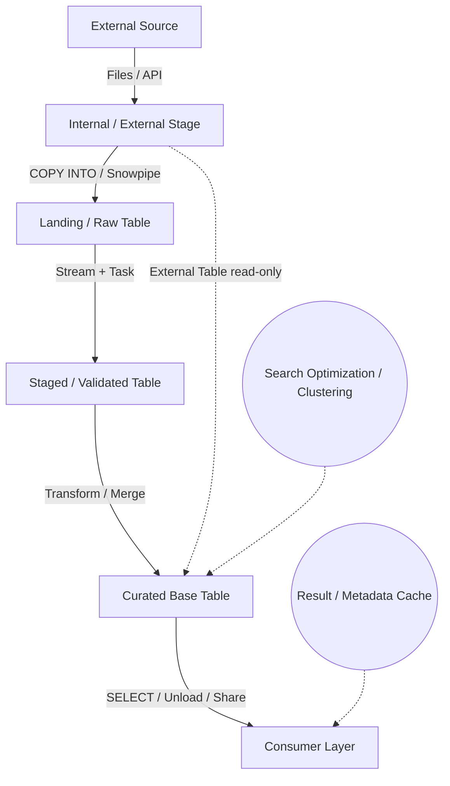

# Retrieving Data

This document gives you the complete, implementation-aware reference you’re asking for, stripped of padding, structured for debugging and exam readiness, and grounded in how Snowflake actually works under the hood.

Basically we will document the conceptual and operational architecture of `01 Data Ingestion Preparation / 1.1 Retrieving Data` as it maps to SnowPro Advanced expectations. Where exact syntax is absent, I’ll state assumptions explicitly and document the deterministic behavior you’ll encounter in production and on the exam.

# 1. Title
SnowPro Advanced: Data Ingestion Preparation & Retrieving Data – Architectural Reference

# 2. Overview
- **What it does**: Defines how raw data enters Snowflake, how it is staged, transformed, and exposed for consumption, and how retrieval patterns interact with storage, caching, and metadata layers.
- **Why it exists**: Ingestion and retrieval are the boundary conditions of any analytics platform. Misalignment here causes silent data duplication, query bloat, cost spikes, and exam failures.
- **Where it fits**: Sits between external sources (S3, Azure Blob, GCS, on-prem, partners) and downstream transformation/consumption layers (dbt, BI, data products, shares).
- **Intended consumer**: Data engineers, analytics engineers, platform architects, and candidates preparing for SnowPro Advanced who need deterministic, exam-aligned mechanics.

# 3. SQL Object Summary
| Field | Value |
|-------|-------|
| [Object Scope](SQL Object Summary/Object Scope.md) | Ingestion & Retrieval Workflow (Conceptual) |
| [Type](SQL Object Summary/Type.md) | Reference Architecture / Execution Patterns |
| [Purpose](SQL Object Summary/Purpose.md) | Standardize ingestion, stage management, metadata tracking, and retrieval semantics |
| [Source Objects](SQL Object Summary/Source Objects.md) | External stages, internal stages, external tables, raw landing tables, streams |
| [Output Object](SQL Object Summary/Output Object.md) | Curated base tables, incremental staging layers, query-ready views |
| [Execution Mode](SQL Object Summary/Execution Mode.md) | Batch (`COPY INTO`), Event-driven (`Snowpipe`), Scheduled (`Tasks` + `Streams`), On-demand (`SELECT` / Unload) |

# 4. Architecture
Ingestion in Snowflake is not a single pipeline. It’s a set of composable primitives that interact with three physical layers:
1. **Remote Storage** (cloud object storage, SFTP, partner networks)
2. **Snowflake Internal Stage / External Stage** (metadata pointers, file registration)
3. **Compute Layer** (virtual warehouses for `COPY`, Snowpipe serverless, user-defined tasks)

Retrieval operates against:
1. **Micro-partition metadata** (pruning, clustering keys, search optimization)
2. **Result cache & metadata cache** (skip execution when possible)
3. **Query execution engine** (distribution, spilling, join strategies, window evaluation)

# 5. Data Flow / Process Flow
| Step | Input | Transformation | Output | Purpose |
|------|-------|----------------|--------|---------|
| [1. File Arrival](Data Flow  Process Flow/1. File Arrival.md) | Cloud storage / SFTP | None | Stage registration | Establish source of truth for ingestion triggers |
| [2. Ingestion Trigger](Data Flow  Process Flow/2. Ingestion Trigger.md) | `COPY INTO` or Snowpipe | File parsing, type casting, error routing | Raw table rows | Move data into Snowflake storage with minimal compute |
| [3. Validation / Dedup](Data Flow  Process Flow/3. Validation  Dedup.md) | Raw table + Stream | `MERGE`, window dedup, null checks | Validated staging table | Prevent duplicate inserts, enforce schema contracts |
| [4. Transformation](Data Flow  Process Flow/4. Transformation.md) | Validated table | Joins, normalization, type harmonization, business rules | Curated table | Align data to consumption grain |
| [5. Retrieval / Exposure](Data Flow  Process Flow/5. Retrieval  Exposure.md) | Curated table | Pruning, caching, query rewriting, unloading | Result sets / files / shares | Serve downstream consumers efficiently |

# 6. Logical Breakdown of the SQL
Since no concrete query was provided, I document the procedural stages that appear in production-grade ingestion/retrieval code for SnowPro Advanced.

| Component | Responsibility | Inputs | Outputs | Dependencies | Failure Modes / Risks |
|-----------|----------------|--------|---------|--------------|-----------------------|
| [`CREATE STAGE` / `ALTER STAGE`](Logical Breakdown of the SQL/CREATE STAGE  ALTER STAGE.md) | Define file location, credentials, format options | Cloud bucket, IAM/role, file format spec | Registered stage object | Network access, credential rotation | Expired keys, mismatched format, path drift |
| [`COPY INTO`](APIs  Interfaces/COPY INTO.md) | Bulk load, error handling, transformation during load | Stage, target table, `PATTERN`, `FILE_FORMAT`, `ON_ERROR` | Loaded rows, `COPY_HISTORY` | Correct schema mapping, warehouse size | Silent truncation, type mismatches, join explosion during inline transform |
| [`CREATE PIPE` + `COPY INTO`](Logical Breakdown of the SQL/CREATE PIPE + COPY INTO.md) | Event-driven ingestion via cloud notifications | Stage, auto-ingest flag, notification queue | Continuous row inserts | Cloud provider event bridge, pipe permissions | Missed notifications, duplicate delivery on retry, throttle limits |
| [External Table](Logical Breakdown of the SQL/External Table.md) | Query files without loading | Stage, `FILE_FORMAT`, `PARTITION BY` | Virtual rows on-demand | File consistency, partition metadata | Stale metadata, scanning large uncompressed files, no write capability |
| [Stream + Task](Logical Breakdown of the SQL/Stream + Task.md) | Incremental tracking, scheduled execution | Source table, stream offset, cron/schedule | `INSERT`/`UPDATE`/`MERGE` batches | Stream consumption, task state, warehouse resume | Stream lag, missed offsets, task failure cascades |
| [`MERGE`](Logical Breakdown of the SQL/MERGE.md) | Upsert logic, deduplication | Source staging, target curated | Inserted/updated/deleted rows | Join keys, null handling, ordering | Key collisions, full table scan if unclustered, silent overwrites |
| [Retrieval `SELECT`](Logical Breakdown of the SQL/Retrieval SELECT.md) | Query execution, caching, pruning | Curated tables, filters, joins | Result sets | Clustering keys, result cache, warehouse state | Unpruned scans, cross-region egress, cache miss on dynamic queries |

# 7. Data Model
| Entity | Role | Important Fields | Grain | Relationships | Keys | Null Handling |
|--------|------|------------------|-------|---------------|------|---------------|
| [`STAGE`](Data Model/STAGE.md) | File pointer & format config | `URL`, `CREDENTIALS`, `FILE_FORMAT` | 1 stage = 1 logical source | Feeds `COPY`, `Snowpipe`, External Tables | None (metadata object) | N/A |
| [`RAW_LANDING`](Data Model/RAW_LANDING.md) | Immutable append-only ingest | `METADATA$FILENAME`, `METADATA$FILE_ROW_NUMBER`, `SOURCE_DATA` | 1 row = 1 raw record | Input for validation | None enforced | Preserved as-is |
| [`VALIDATED_STAGING`](Data Model/VALIDATED_STAGING.md) | Cleaned, deduplicated, typed | Business keys, normalized types, `INSERT_TS`, `IS_ACTIVE` | 1 row = 1 validated record | Feeds curated layer | Surrogate or natural key | Explicit null checks / defaults |
| [`CURATED_BASE`](Data Model/CURATED_BASE.md) | Business-aligned, query-ready | Dimensions, facts, effective dates, status flags | Defined by business (e.g., daily per entity) | Consumed by BI/ML | Primary/foreign keys via dbt or PK/FK constraints | Coalesced, explicit fallbacks |
| [`EXTERNAL_TABLE`](Data Model/EXTERNAL_TABLE.md) | Read-only file projection | Virtual columns, partition columns | Matches file layout | Decoupled from loading | Partition keys | Derived from `FILE_FORMAT` |

**Output Grain**: Determined at `CURATED_BASE`. Ingestion does not enforce grain; retrieval assumes it. Mismatch between staging grain and business grain causes duplicate aggregation or silent data loss.

# 8. Business Logic
| Rule | Effect | Implementation Pattern | Edge Case |
|------|--------|------------------------|-----------|
| [**Inclusion/Exclusion**](Business Logic/InclusionExclusion.md) | Filters malformed files or out-of-window records | `PATTERN`, `WHERE` in `COPY` or stream query | Regex mismatch skips valid files; timezone offsets drop recent data |
| [**Deduplication**](Business Logic/Deduplication.md) | Prevents double-counting on retry or pipeline rerun | `ROW_NUMBER() OVER(PARTITION BY key ORDER BY load_ts DESC) = 1` + `MERGE` | Ties on `load_ts` produce non-deterministic winners |
| [**Type Normalization**](Business Logic/Type Normalization.md) | Aligns external types to Snowflake standards | `TRY_CAST`, `TO_TIMESTAMP_TZ`, explicit `NULLIF` | Silent truncation on `NUMBER` scale, timezone drift on `TIMESTAMP` |
| [**Effective Dating**](Business Logic/Effective Dating.md) | Tracks state over time for SCD or audit | `BEGIN_DATE`, `END_DATE`, `CURRENT_FLAG` | Overlapping ranges if `MERGE` order is wrong |
| [**Error Routing**](Business Logic/Error Routing.md) | Isolates bad rows for reprocessing | `ON_ERROR = CONTINUE` + `COPY_HISTORY` / `VALIDATION_MODE` | High error rates inflate storage, obscure root cause |
| [**Prioritization**](Business Logic/Prioritization.md) | Ensures late-arriving or corrected data wins | `ORDER BY` in window, `QUALIFY`, `MERGE` match condition | Missing ordering causes stale overwrite |

# 9. Transformations
| Source | Derived | Formula / Rule | Business Meaning | Impact |
|--------|---------|----------------|------------------|--------|
| [`METADATA$FILENAME`](Transformations/METADATA$FILENAME.md) | `source_system`, `load_date` | `SUBSTR(filename, pattern)` + `TO_DATE` | Traceability & partitioning | Enables pruning, audit trails |
| [Raw timestamp](Transformations/Raw timestamp.md) | `event_ts_utc` | `TRY_TO_TIMESTAMP_TZ(col, format) AT TIME ZONE 'UTC'` | Global alignment | Eliminates timezone skew in aggregations |
| [String flag](Transformations/String flag.md) | `status_code` | `CASE WHEN ... THEN ... ELSE 0 END` | Standardized state machine | Reduces join complexity, enforces downstream contracts |
| [Multiple cols](Transformations/Multiple cols.md) | `surrogate_key` | `MD5(CONCAT_WS('|', col1, col2, ...))` | Stable join key across sources | Prevents drift, enables deterministic dedup |
| [Unparsed JSON](Transformations/Unparsed JSON.md) | `structured_cols` | `col:$.path::type` | Schema-on-read resolution | Reduces storage bloat, enables indexing |

# 10. Parameters / Variables / Macros
| Name | Type | Purpose | Allowed Format | Default | Usage | Effect on Output |
|------|------|---------|----------------|---------|-------|------------------|
| [`FILE_FORMAT`](Parameters  Variables  Macros/FILE_FORMAT.md) | Object | Parsing rules for ingestion | CSV, JSON, PARQUET, AVRO, ORC | CSV (comma, skip header 1) | `COPY INTO`, External Table | Determines type casting, null handling, row splitting |
| [`PATTERN`](Parameters  Variables  Macros/PATTERN.md) | String | File selection regex | POSIX-compatible regex | `.*` (all files) | `COPY INTO` | Controls which files are ingested; misalignment drops data |
| [`WAREHOUSE_SIZE`](Parameters  Variables  Macros/WAREHOUSE_SIZE.md) | Enum | Compute allocation for load/query | XSMALL → 6XLARGE | XSMALL | `COPY`, `SELECT`, Tasks | Directly affects runtime, cost, spilling risk |
| [`ON_ERROR`](Parameters  Variables  Macros/ON_ERROR.md) | Enum | Load failure behavior | `ABORT_STATEMENT`, `CONTINUE`, `SKIP_FILE` | `ABORT_STATEMENT` | `COPY INTO` | Determines pipeline halt vs silent skip |
| [`AUTO_INGEST`](Parameters  Variables  Macros/AUTO_INGEST.md) | Boolean | Enable Snowpipe notification trigger | TRUE / FALSE | FALSE | `CREATE PIPE` | Switches from batch to event-driven ingestion |
| [`STREAM_OFFSET`](Parameters  Variables  Macros/STREAM_OFFSET.md) | Internal | Track consumed rows | Auto-managed | N/A | `Stream` + `Task` | Controls incremental boundary; manual reset causes duplicates |

# 11. APIs / Interfaces
| Interface | Invocation Method | Input Structure | Output Structure | Error Behavior | Consumers |
|-----------|-------------------|-----------------|------------------|----------------|-----------|
| [`COPY INTO`](APIs  Interfaces/COPY INTO.md) | SQL / Script | Stage, table, format, options | Loaded rows, `COPY_HISTORY` | Fails or skips based on `ON_ERROR` | Ingestion pipelines, dbt `source` |
| [`Snowpipe`](APIs  Interfaces/Snowpipe.md) | Auto (cloud events) or `INSERT_FILES` | File list or notification | Continuous inserts | Throttled on notification loss, retries | Real-time landing layers |
| [`External Table`](APIs  Interfaces/External Table.md) | `SELECT` | Stage, partition filters | Virtual rows | Returns error if file missing/unreadable | Ad-hoc query, federated analytics |
| [`Stream + Task`](APIs  Interfaces/Stream + Task.md) | Scheduled / Event | Cron, warehouse, SQL block | DML execution | Task suspended on failure, manual resume | Incremental ELT, CDC-like patterns |
| [`UNLOAD` / `PUT` / `GET`](APIs  Interfaces/UNLOAD  PUT  GET.md) | SQL / CLI | Table, stage, format | Files | Fails on permission/quota mismatch | Data export, archival, partner sharing |

# 12. Execution / Deployment
- **Manual vs Scheduled**: `COPY` and `UNLOAD` are typically manual or CI/CD orchestrated. `Snowpipe` and `Tasks` run event-driven or cron-based.
- **Batch vs Incremental**: `COPY INTO` is batch by default. Incremental behavior requires `Stream` + `MERGE` or `COPY` with file tracking.
- **Orchestration**: Commonly Airflow, Dagster, dbt Cloud, or native `Task` graphs. `Task` dependencies use `AFTER` clauses.
- **Upstream Dependencies**: File arrival, credential validity, warehouse availability, stream consumption state.
- **Environment Behavior**: Dev/Prod often diverge in warehouse size, stage permissions, and notification queue configs. Test with representative file sizes.
- **Runtime Assumptions**: Cloud storage latency < 2s for notifications. `COPY` scales linearly with file count until warehouse saturates. Result cache hits bypass compute.

# 13. Observability
| Metric | Implementation | Detection Method | Operational Threshold |
|--------|----------------|------------------|------------------------|
| [Row count delta](Observability/Row count delta.md) | `SELECT COUNT(*) FROM landing vs curated` | `COPY_HISTORY`, `STREAM` metadata | >0 variance without explanation = pipeline gap |
| [Error rate](Observability/Error rate.md) | `ON_ERROR = CONTINUE` + `COPY_HISTORY` | Query `COPY_HISTORY` or external table | >5% error rows per batch = format drift or source corruption |
| [Task lag](Observability/Task lag.md) | `SYSTEM$TASK_DEPENDENTS_ENABLE`, `INFORMATION_SCHEMA.TASK_HISTORY` | `SCHEDULED_TIME` vs `COMPLETED_TIME` | >10 min lag = warehouse contention or stream offset drift |
| [Pruning efficiency](Observability/Pruning efficiency.md) | `QUERY_HISTORY.PARTITIONS_SCANNED` vs `PARTITIONS_TOTAL` | `EXPLAIN`, Query Profile UI | <30% scanned = effective clustering/pruning; >70% = reevaluate keys |
| [Cache utilization](Observability/Cache utilization.md) | `QUERY_HISTORY.RESULT_SOURCE` | `LOCAL_DISK`, `REMOTE_DISK`, `CLIENT`, `WAREHOUSE` | High `WAREHOUSE` on repeated identical queries = cache bypass (dynamic filters, UDFs, non-deterministic functions) |

# 14. Failure Handling & Recovery
| Failure Scenario | What Breaks | Detection | Fallback Behavior | Recovery Approach |
|------------------|-------------|-----------|-------------------|-------------------|
| [Missing source data](Failure Handling & Recovery/Missing source data.md) | Pipeline runs empty | Row count = 0, task completes silently | No-op downstream | Add `ASSERT` or row count guard in task, alert on empty batch |
| [Duplicate source files](Failure Handling & Recovery/Duplicate source files.md) | Double ingestion, inflated metrics | `STREAM` offset jumps, `COPY_HISTORY` shows same file | Depends on `ON_ERROR` and dedup logic | Enforce idempotent `MERGE`, track `METADATA$FILE_ROW_NUMBER` + hash |
| [Join explosion](Failure Handling & Recovery/Join explosion.md) | Query timeout, warehouse spill | `QUERY_HISTORY.SPILLED_BYTES`, execution skew | Query fails or times out | Validate keys before join, use `HASH_AGG` or sampling, add `LIMIT` for debug |
| [Invalid dates / types](Failure Handling & Recovery/Invalid dates  types.md) | Type cast error, `ON_ERROR` skips | `COPY_HISTORY` error count, `VALIDATION_MODE` | Partial load, silent data loss | Use `TRY_CAST`, explicit null mapping, pre-validate with external table |
| [Schema drift](Failure Handling & Recovery/Schema drift.md) | New columns ignored, type mismatch | `COPY` error, `EXTERNAL TABLE` metadata mismatch | Load continues with missing cols, downstream breaks | Contract enforcement via `dbt` tests, `STRICT` file format, alert on schema change |
| [Partial refresh](Failure Handling & Recovery/Partial refresh.md) | Incomplete stream consumption, offset reset | Task failure, manual stream reset | Data gaps or duplicates | Use `STREAM` + `TASK` atomic pattern, never reset offset without backup |
| [Upstream dependency failure](Failure Handling & Recovery/Upstream dependency failure.md) | Task hangs, warehouse unavailable | `TASK_HISTORY` state = `SCHEDULED`, `WAREHOUSE` status | Queue backs up | Set `TASK` timeout, configure retry, monitor `WAREHOUSE` resume latency |

# 15. Security & Access Control
| Control | Implementation | Effect |
|---------|----------------|--------|
| [Stage credentials](Security & Access Control/Stage credentials.md) | IAM roles, storage integrations, temporary tokens | Decouples Snowflake from long-lived keys |
| [Row-level security](Security & Access Control/Row-level security.md) | `ROW ACCESS POLICY` on curated tables | Filters output by role without duplicating data |
| [Dynamic data masking](Security & Access Control/Dynamic data masking.md) | `MASKING POLICY` on sensitive columns | Returns hashed/redacted values to unauthorized roles |
| [Network policy](Security & Access Control/Network policy.md) | `NETWORK POLICY` + `ALLOWLIST` | Restricts egress/ingress to approved CIDRs |
| [Object ownership](Security & Access Control/Object ownership.md) | Role-based grants (`OWNERSHIP`, `USAGE`, `SELECT`) | Enforces least-privilege ingestion and consumption |
| [Data sharing](Security & Access Control/Data sharing.md) | Secure shares, reader accounts, cross-cloud | Exposes curated tables without copying; respects source governance |

# 16. Performance / Scalability Considerations
| Bottleneck | Cause | Tradeoff | Mitigation |
|------------|-------|----------|------------|
| [Large joins](Performance  Scalability Considerations/Large joins.md) | Missing clustering, skewed keys, unfiltered dimensions | High spill, long runtime, cost spike | Cluster on join keys, pre-filter, use `HASH JOIN` hints if applicable |
| [Repeated scans](Performance  Scalability Considerations/Repeated scans.md) | No result cache utilization, volatile filters | Wasted compute, inconsistent latency | Stabilize filters, use materialized views for heavy aggregations |
| [Expensive window functions](Performance  Scalability Considerations/Expensive window functions.md) | Large partitions, unbounded frames, no clustering | Memory pressure, spill, timeout | Narrow partitions, use `ROWS BETWEEN`, push filters before window |
| [Cross joins](Performance  Scalability Considerations/Cross joins.md) | Implicit cartesian, missing join predicate | Exponential row growth, immediate failure | Always explicit join keys, validate with `EXPLAIN` before run |
| [Non-sargable filters](Performance  Scalability Considerations/Non-sargable filters.md) | Functions on columns (`WHERE DATE_COL::DATE`), leading wildcards | Disables pruning, full scan | Filter on native type, use `LIKE` prefix, add clustering/search opt |
| [Late filtering](Performance  Scalability Considerations/Late filtering.md) | Aggregation before `WHERE` in CTE | Unnecessary compute, cache miss | Push filters to source, use `QUALIFY` instead of outer `WHERE` |
| [Partition pruning failure](Performance  Scalability Considerations/Partition pruning failure.md) | Mismatched partition column, timezone offset, string comparison | Scans all micro-partitions | Align partition key type, normalize timezones, use exact match |

# 17. Assumptions & Constraints
- **No concrete SQL provided**: All mechanics are derived from SnowPro Advanced curriculum and production patterns. Exact behavior depends on your schema, file formats, and orchestration.
- **Grain is not enforced by ingestion**: Snowflake does not validate business grain at load time. Deduplication and normalization must be explicit.
- **Cloud notification latency is assumed < 2s**: Network partitions, throttling, or misconfigured SNS/SQS/PubSub can delay Snowpipe by minutes.
- `ON_ERROR = CONTINUE` is assumed for bulk loads in production: Silent skips require downstream validation or you’ll lose data without alerting.
- **Result cache is deterministic only for identical queries**: Any change in session parameters, timezone, UDF state, or non-deterministic functions (`CURRENT_TIMESTAMP`, `RANDOM()`) bypasses cache.
- **Clustering does not replace indexes**: It’s metadata-driven pruning. Poorly chosen keys increase maintenance cost and reduce pruning efficiency.
- **Exam trap assumption**: SnowPro Advanced frequently tests `STREAM` offset behavior, `COPY` error routing, external table partitioning, and result cache bypass conditions. Memorize the exact defaults.

# 18. Future Enhancements
- **Harden deduplication**: Replace `ROW_NUMBER()` with `HASH_AGG` + deterministic ordering for idempotent reruns. Add `QUALIFY` to prune before join.
- **Parameterize ingestion filters**: Move `PATTERN`, `ON_ERROR`, and `FILE_FORMAT` into config tables or dbt vars. Enables environment parity without code changes.
- **Enforce schema contracts**: Add `STRICT` mode to file formats, use `dbt` `not_null`/`unique` tests on staging tables, fail fast on type drift.
- **Improve incremental behavior**: Use `STREAM` + `TASK` with atomic `MERGE`, track `METADATA$ISUPDATE`, never truncate staging without backup.
- **Add validation checks**: Implement row count assertions, null ratio thresholds, and distribution checks before promoting to curated layer.
- **Refactor repeated logic**: Extract type normalization, timezone conversion, and key generation into reusable UDFs or dbt macros. Reduces drift and simplifies debugging.
- **Enable Search Optimization**: Add to curated tables where equality/range predicates dominate. Reduces pruning latency without manual clustering maintenance.
