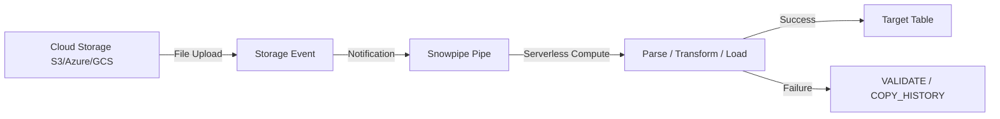
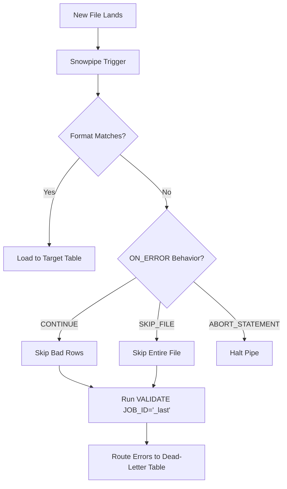

**Overview**
* Serverless, continuous data ingestion service
* Loads files from cloud storage on arrival via event notifications
* Zero warehouse management, pay-per-second ephemeral compute
* Uses standard `COPY INTO` syntax under the hood
* Built for low-latency, incremental, unpredictable file drops

**Key Characteristics**
* Serverless execution (no warehouse provisioning/scaling)
* Event-driven triggers (S3 SNS/SQS, Azure Event Grid, GCS Pub/Sub)
* Micro-batch processing (file-at-a-time execution)
* Built-in exactly-once semantics (internal metadata tracking prevents duplicates)
* Supports inline `SELECT` transformations inside `COPY INTO`
* Observability via `COPY_HISTORY()` and `VALIDATE()`
* Default concurrency limit: 100 files per pipe
* Cost model: serverless compute seconds + cloud notification fees (high tiny-file count = cost inefficiency)



**Examples**

* **Basic Auto-Ingest Pipe (S3)**
```sql
CREATE OR REPLACE PIPE raw_events_pipe
  AUTO_INGEST = TRUE
  AWS_SNS_TOPIC = 'arn:aws:sns:us-east-1:123456789012:snowpipe-events'
AS
COPY INTO raw_events
FROM @ext_s3_stage/events/
FILE_FORMAT = (TYPE = JSON COMPRESSION = GZIP)
ON_ERROR = 'CONTINUE';
```

* **Pipe with Inline Transformation & Casting**
```sql
CREATE OR REPLACE PIPE enriched_orders_pipe AS
COPY INTO orders_enriched (order_id, customer_id, order_ts, total_amount, region)
FROM (
  SELECT 
    $1:order_id::NUMBER,
    $1:customer_id::VARCHAR,
    TO_TIMESTAMP_NTZ($1:created_at),
    ($1:items[0].price * $1:items[0].qty)::DECIMAL(10,2),
    CURRENT_REGION()
  FROM @ext_stage/orders/
)
FILE_FORMAT = (TYPE = JSON);
```

* **Manual Programmatic Ingest (REST API)**
```bash
curl -X POST "https://<account>.snowflakecomputing.com/api/v1/pipes/insertFiles" \
  -H "Authorization: Bearer <JWT_TOKEN>" \
  -H "Content-Type: application/json" \
  -d '{"files": [{"path": "s3://bucket/data/batch_01.json"}]}'
```

* **Monitor Load Status & Errors**
```sql
SELECT pipe_name, status, file_name, last_load_time, error_count
FROM TABLE(INFORMATION_SCHEMA.COPY_HISTORY(
  TABLE_NAME => 'raw_events',
  START_TIME => DATEADD(HOUR, -24, CURRENT_TIMESTAMP())
))
WHERE pipe_name = 'RAW_EVENTS_PIPE';
```

* **Extract Row-Level Parse Failures**
```sql
SELECT * FROM TABLE(VALIDATE(raw_events, JOB_ID => '_last'));
```



**Notes**
* Strictly file-based; does NOT stream individual rows (use Snowpipe Streaming/Kafka connector for sub-second row ingestion)
* File size dictates cost: consolidate into 50MB–256MB chunks, avoid thousands of tiny files
* Prefer columnar formats (Parquet/ORC) + compression (ZSTD/SNAPPY) for compute efficiency
* 90% of `AUTO_INGEST` failures = broken notification chain (IAM roles, SQS permissions, Pub/Sub subscriptions)
* Test with `insertFiles` REST API first to isolate compute vs notification issues
* Idempotency is default; `FORCE=TRUE` bypasses tracking and creates duplicates
* Pair `ON_ERROR = 'CONTINUE'` with downstream streams/tasks for automated dead-letter routing
* Match tool to pattern: `COPY INTO` + scheduled tasks for predictable large batches, Snowpipe for unpredictable incremental drops
