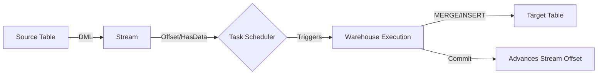
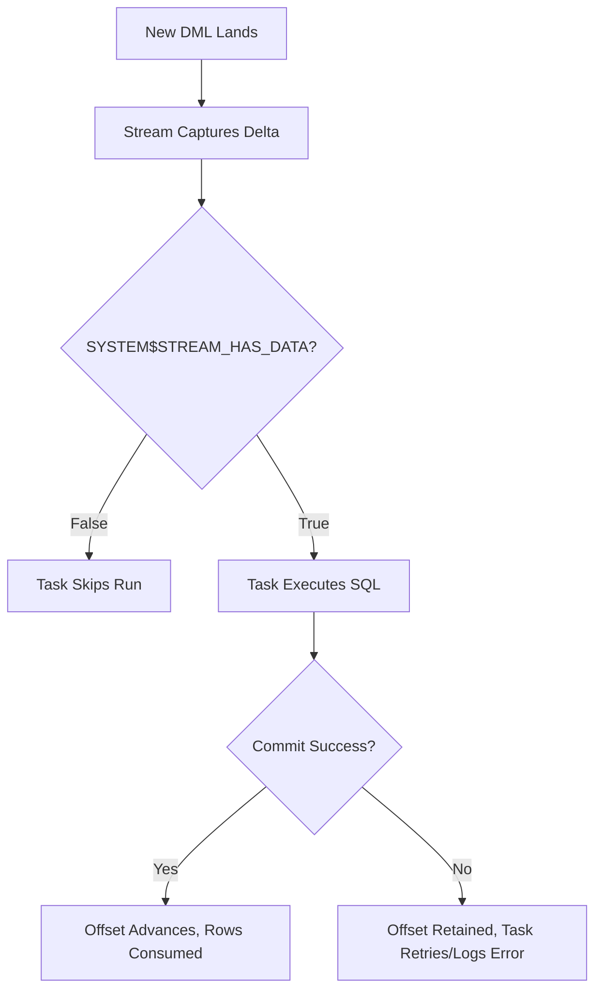

**Overview**
- Stream: Table-level CDC engine, captures DML deltas (INSERT/UPDATE/DELETE/MERGE), exposes changes via offset tracking
- Task: Native scheduler + execution runner, triggers SQL/scripts on cron, interval, or DAG dependency
- Combined: Stream feeds changes, Task processes them on schedule → automated micro-batch ELT/CDC pipeline
- Commit-driven consumption, warehouse-managed compute, exactly-once processing per transaction batch

**Key Characteristics**
- Streams track `METADATA$ACTION` (INSERT/DELETE), `METADATA$ISUPDATE` (TRUE/FALSE), `METADATA$ROW_ID`
- Offset advances only when consuming DML successfully commits
- Stream retention tied to source table `DATA_RETENTION_TIME_IN_DAYS` (default 1 day, max 90)
- Tasks support `SCHEDULE` (CRON/fixed), `WHEN` condition, `AFTER` chaining (DAGs), auto-suspend/resume
- `SYSTEM$STREAM_HAS_DATA('stream_name')` prevents empty task runs
- Task retries configurable via `MAX_CONSECUTIVE_FAILURES` and `ERROR_ON_TASK_FAILURE`
- Compute: Traditional tasks use managed warehouse; newer runs support serverless execution
- Limits: Max 100 tasks per DAG, stream offset resets on `ALTER STREAM ... SET OFFSET = ...` or table truncate

**Examples**

```sql
-- 1. Source Table + Delta Stream
CREATE OR REPLACE TABLE raw_events (
  event_id NUMBER,
  user_id NUMBER,
  payload VARIANT,
  created_at TIMESTAMP_NTZ
);
CREATE OR REPLACE STREAM events_stream ON TABLE raw_events;
```

```sql
-- 2. Scheduled Task Consuming Stream
CREATE OR REPLACE TASK load_events_task
  WAREHOUSE = etl_wh
  SCHEDULE = '10 MINUTE'
  WHEN SYSTEM$STREAM_HAS_DATA('events_stream')
AS
  INSERT INTO analytics_events (event_id, user_id, event_type, created_at)
  SELECT 
    s.event_id,
    s.user_id,
    s.payload:event_type::VARCHAR,
    s.created_at
  FROM events_stream s
  WHERE s.METADATA$ACTION = 'INSERT';
```

```sql
-- 3. Task Control & Monitoring
ALTER TASK load_events_task RESUME;
ALTER TASK load_events_task SUSPEND;

SELECT * FROM TABLE(INFORMATION_SCHEMA.TASK_HISTORY())
  WHERE TASK_NAME = 'LOAD_EVENTS_TASK'
  ORDER BY SCHEDULED_TIME DESC LIMIT 10;
```

```sql
-- 4. Full CDC Pattern (INSERT/UPDATE/DELETE Handling)
CREATE OR REPLACE TASK cdc_sync_task
  WAREHOUSE = etl_wh
  SCHEDULE = '5 MINUTE'
  WHEN SYSTEM$STREAM_HAS_DATA('orders_stream')
AS
  MERGE INTO target_orders t
  USING (
    SELECT id, amount, status, METADATA$ACTION, METADATA$ISUPDATE
    FROM orders_stream
  ) s
  ON t.id = s.id
  WHEN MATCHED AND s.METADATA$ACTION = 'DELETE' THEN DELETE
  WHEN MATCHED AND s.METADATA$ACTION = 'INSERT' AND s.METADATA$ISUPDATE = TRUE 
    THEN UPDATE SET amount = s.amount, status = s.status
  WHEN NOT MATCHED AND s.METADATA$ACTION = 'INSERT' 
    THEN INSERT (id, amount, status) VALUES (s.id, s.amount, s.status);
```





**Notes**
- Streams are NOT tables; SELECTing does not consume offset. Only INSERT/MERGE/DELETE against the stream advances it
- UPDATEs split into DELETE + INSERT pairs; filter with `METADATA$ISUPDATE = TRUE/FALSE` to handle correctly
- Stream offset tied to source table retention; if source truncates/drops, stream resets or fails
- Task `WHEN` clause prevents warehouse spin-up on empty streams; critical for cost control
- DAG execution requires top-level task to be RESUMED; child tasks inherit state via `AFTER`
- Error handling: `ON_ERROR = CONTINUE` in task DML, or route failures to dead-letter table via `TRY/CATCH` in Snowpark/JS
- Debugging: `TABLE(INFORMATION_SCHEMA.TASK_HISTORY())` shows run status, error messages, query IDs
- Alternative: Use Snowpipe Streaming for sub-second row ingestion; Streams+Tasks for scheduled micro-batch CDC
