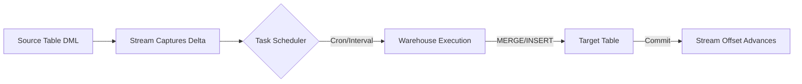
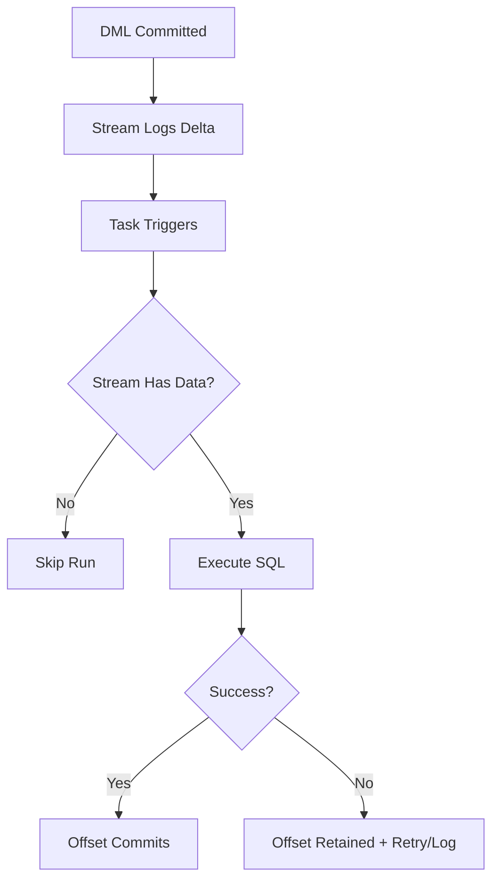

**Overview**
- Stream: Table-level CDC engine capturing DML deltas (INSERT/UPDATE/DELETE)
- Task: Native scheduler executing SQL on cron, interval, or DAG dependency
- Combined: Automated micro-batch ELT/CDC pipeline with offset tracking
- Warehouse-managed compute, exactly-once consumption per committed transaction
- Zero external orchestration; runs natively inside Snowflake

**Key Characteristics**
- Exposes `METADATA$ACTION` (INSERT/DELETE), `METADATA$ISUPDATE` (BOOLEAN), `METADATA$ROW_ID`
- Offset advances ONLY on successful DML commit against the stream
- Retention bound to source `DATA_RETENTION_TIME_IN_DAYS` (default 1, max 90)
- Task scheduling: `SCHEDULE` (CRON/interval), `WHEN` guard clause, `AFTER` (DAG chaining)
- `SYSTEM$STREAM_HAS_DATA()` prevents empty warehouse spin-ups
- Compute: Managed warehouse or serverless task execution
- Limits: 100 tasks per DAG, offset resets on table truncate/DROP, stream DDL locks source

**Examples**

- **Basic Setup & Scheduled Consumption**
```sql
CREATE TABLE raw_orders (id INT, status VARCHAR, updated_at TIMESTAMP);
CREATE STREAM order_stream ON TABLE raw_orders;

CREATE TASK process_orders
  WAREHOUSE = etl_wh
  SCHEDULE = '10 MINUTE'
  WHEN SYSTEM$STREAM_HAS_DATA('order_stream')
AS
  INSERT INTO analytics_orders
  SELECT id, status, updated_at
  FROM order_stream
  WHERE METADATA$ACTION = 'INSERT';
```

- **CDC MERGE Pattern (Handles Updates/Deletes)**
```sql
CREATE TASK cdc_merge_task
  WAREHOUSE = etl_wh
  SCHEDULE = '5 MINUTE'
  WHEN SYSTEM$STREAM_HAS_DATA('order_stream')
AS
  MERGE INTO target_orders t
  USING order_stream s ON t.id = s.id
  WHEN MATCHED AND s.METADATA$ACTION = 'DELETE' THEN DELETE
  WHEN MATCHED AND s.METADATA$ISUPDATE = TRUE 
    THEN UPDATE SET status = s.status, updated_at = s.updated_at
  WHEN NOT MATCHED AND s.METADATA$ACTION = 'INSERT'
    THEN INSERT (id, status, updated_at) VALUES (s.id, s.status, s.updated_at);
```

- **DAG Task Chaining & Monitoring**
```sql
CREATE TASK ingest_raw
  SCHEDULE = '15 MINUTE'
AS COPY INTO staging FROM @ext_stage;

CREATE TASK transform_stream
  AFTER ingest_raw
  WHEN SYSTEM$STREAM_HAS_DATA('stg_stream')
AS INSERT INTO prod_table SELECT * FROM stg_stream;

SELECT task_name, status, scheduled_time, error_message
FROM TABLE(INFORMATION_SCHEMA.TASK_HISTORY())
WHERE task_name = 'TRANSFORM_STREAM'
ORDER BY scheduled_time DESC LIMIT 10;
```





**Notes**
- `SELECT` on stream does NOT consume offset; only DML (`INSERT`/`MERGE`/`DELETE`) advances it
- `UPDATE` splits into `DELETE` + `INSERT` pairs; filter via `METADATA$ISUPDATE` to avoid double-counting
- Stream retention = source table retention; truncating source breaks stream offset
- `WHEN SYSTEM$STREAM_HAS_DATA()` prevents unnecessary warehouse costs; mandatory for production
- DAGs require parent task `RESUME`; children auto-inherit state and execute sequentially
- Serverless tasks auto-scale; warehouse tasks require manual sizing and monitoring
- Offset reset requires `ALTER STREAM ... SET OFFSET = ...` or table recreation
- Not for sub-second row streaming; use Snowpipe Streaming or Kafka connector instead
