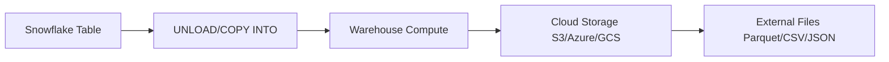
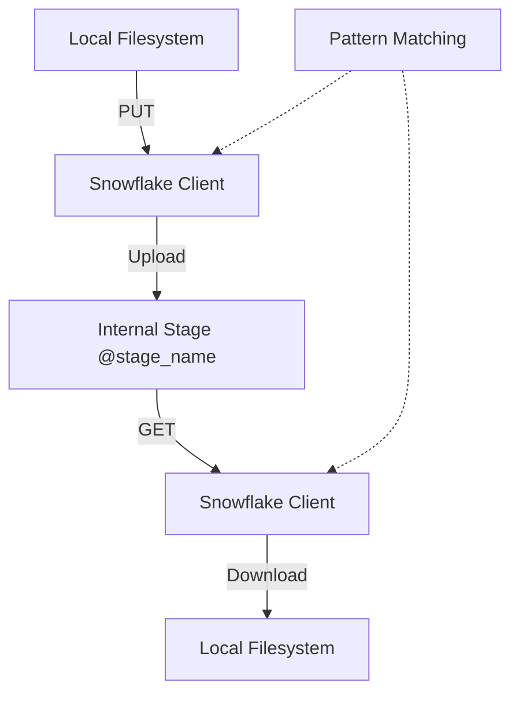
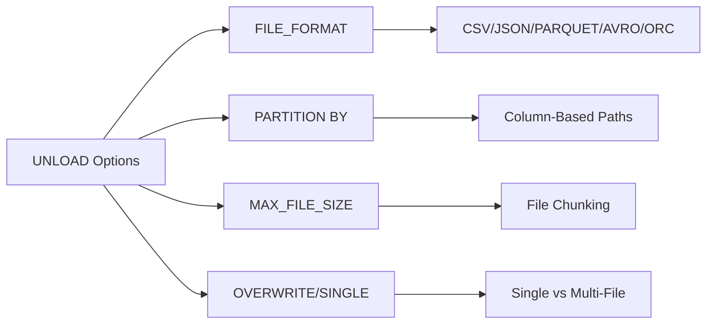

**Overview**
- UNLOAD: Exports Snowflake table data to cloud storage files (Parquet, CSV, JSON, Avro, ORC, XML)
- PUT: Uploads local files to Snowflake internal stages (client-side encryption optional)
- GET: Downloads files from Snowflake internal stages to local filesystem
- Complementary to COPY INTO; handles egress and local file management
- Warehouse compute required for UNLOAD; client-side transfer for PUT/GET

**Key Characteristics**
- UNLOAD writes to external stages (S3, Azure, GCS) or internal stages
- Supports file format options: compression, partitioning, max file size, header rows
- PUT/GET use Snowflake client (SnowSQL) or connectors; require `@stage` paths
- PUT supports auto-compression (GZIP, BZIP2, DEFLATE, RAW_DEFLATE)
- GET preserves file structure; can use pattern matching (`PATTERN='.*\.csv'`)
- UNLOAD parallelizes across warehouse nodes; controlled by `MAX_FILE_SIZE`, `SINGLE`
- Security: PUT/GET require stage privileges; UNLOAD requires SELECT + stage USAGE
- Client-side encryption available for PUT via `AUTO_COMPRESS=FALSE ENCRYPT`

**Examples**

- **UNLOAD to Parquet with Partitioning**
```sql
COPY INTO 's3://my-bucket/exports/sales/'
FROM sales_data
STORAGE_INTEGRATION = s3_int
FILE_FORMAT = (TYPE = PARQUET COMPRESSION = SNAPPY)
PARTITION BY (YEAR(order_date), REGION)
MAX_FILE_SIZE = 256000000
OVERWRITE = TRUE;
```

- **UNLOAD to CSV with Headers**
```sql
COPY INTO 'azure://mycontainer/exports/customers/'
FROM customers
STORAGE_INTEGRATION = azure_int
FILE_FORMAT = (TYPE = CSV FIELD_DELIMITER = ',' COMPRESSION = GZIP HEADER = TRUE)
SINGLE = FALSE
MAX_FILE_SIZE = 100000000;
```

- **PUT Local Files to Internal Stage**
```sql
PUT file:///local/data/orders_2024.csv @my_internal_stage/orders/ 
AUTO_COMPRESS = TRUE
OVERWRITE = TRUE;

PUT file:///local/data/*.json @my_internal_stage/raw/ 
PATTERN = '.*orders.*\\.json'
AUTO_COMPRESS = FALSE;
```

- **GET Files from Stage to Local**
```sql
GET @my_internal_stage/exports/sales/ file:///local/exports/ 
PATTERN = '.*\\.parquet'
OVERWRITE = TRUE;

GET @my_internal_stage/logs/ file:///local/logs/ 
PATTERN = '.*2024-05.*\\.gz';
```

- **UNLOAD with Transformation & Filtering**
```sql
COPY INTO 'gcs://my-bucket/analytics/daily_agg/'
FROM (
  SELECT 
    DATE_TRUNC('day', created_at) as dt,
    category,
    COUNT(*) as cnt,
    SUM(amount) as total
  FROM transactions
  WHERE created_at >= DATEADD(day, -7, CURRENT_TIMESTAMP())
  GROUP BY 1, 2
)
FILE_FORMAT = (TYPE = JSON COMPRESSION = ZSTD)
MAX_FILE_SIZE = 128000000;
```







**Notes**
- UNLOAD requires active warehouse; compute cost scales with data volume and transformations
- PUT/GET are client-side operations; network bandwidth is the bottleneck, not warehouse
- Internal stages have storage limits; use external stages for large-scale egress
- UNLOAD `SINGLE = TRUE` forces single output file (disables parallelism; slow for large datasets)
- PUT auto-compresses by default; set `AUTO_COMPRESS = FALSE` to preserve original format
- GET preserves directory structure from stage; use `PATTERN` to filter specific files
- UNLOAD to external stage requires `STORAGE_INTEGRATION` or explicit credentials (deprecated)
- File naming: UNLOAD generates UUID-based names; cannot control output filenames directly
- Encryption: PUT supports client-side encryption; UNLOAD relies on cloud storage encryption at rest
- Performance: UNLOAD parallelism = warehouse size; scale up warehouse for faster exports
- Pattern syntax: Uses regex (`.*\\.csv` matches `.csv` files; escape dots with `\\.`)
- Idempotency: `OVERWRITE = TRUE` replaces existing files; default is `FALSE` (fails on conflict)
