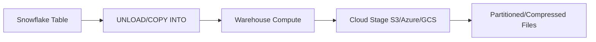
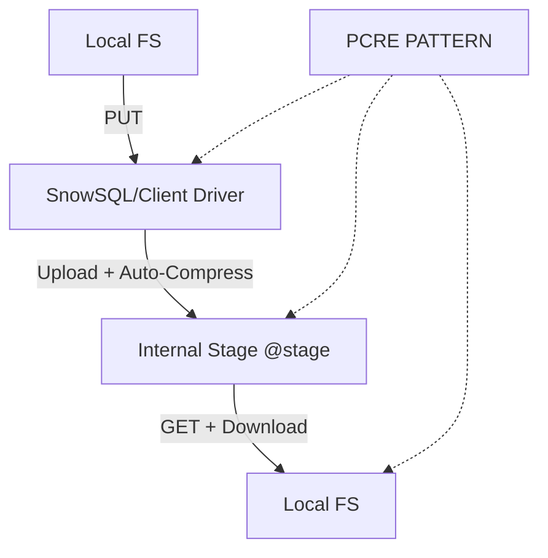
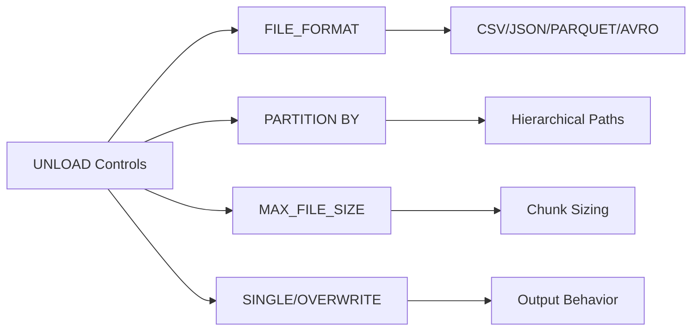

**Overview**
- UNLOAD: Exports Snowflake table data to cloud storage or internal stages via `COPY INTO <location>`
- PUT: Uploads local files to Snowflake internal stages (`@stage`)
- GET: Downloads stage files to local filesystem
- File-level operations; UNLOAD uses warehouse compute, PUT/GET use client network I/O
- Complements `COPY INTO` ingestion; handles egress and local staging workflows

**Key Characteristics**
- UNLOAD requires active virtual warehouse; scales with warehouse size
- UNLOAD supports partitioning, compression, max file size, overwrite toggle, header rows
- PUT/GET execute via SnowSQL/JDBC/ODBC; network-bound, not compute-bound
- PUT auto-compresses by default (`AUTO_COMPRESS=TRUE`); supports client-side encryption
- GET preserves stage directory structure; regex `PATTERN` filtering supported
- UNLOAD output filenames auto-generated (UUID-based); custom naming not supported
- `SINGLE = TRUE` forces single output file, disables parallel execution
- Internal stage size limit ~10TB; external UNLOAD requires `STORAGE_INTEGRATION`
- PUT/GET bypass table parsing; raw byte transfer only

**Examples**
- **UNLOAD to Partitioned Parquet (External Stage)**
```sql
COPY INTO 's3://my-bucket/exports/sales/'
FROM sales_fact
STORAGE_INTEGRATION = s3_int
FILE_FORMAT = (TYPE = PARQUET COMPRESSION = SNAPPY)
PARTITION BY (YEAR(created_at), region)
MAX_FILE_SIZE = 256000000
OVERWRITE = TRUE;
```

- **UNLOAD to Single CSV with Headers**
```sql
COPY INTO 'azure://container/dumps/customers/'
FROM (SELECT * FROM customers WHERE status = 'ACTIVE')
FILE_FORMAT = (TYPE = CSV HEADER = TRUE FIELD_OPTIONALLY_ENCLOSED_BY = '"')
SINGLE = TRUE;
```

- **PUT Local Files to Internal Stage**
```sql
PUT file:///data/raw/orders_*.csv @raw_stage/data/
AUTO_COMPRESS = TRUE
OVERWRITE = TRUE
PARALLEL = 10;
```

- **GET Files from Stage to Local**
```sql
GET @raw_stage/data/ file:///local/archive/
PATTERN = '.*2024.*\\.gz'
OVERWRITE = FALSE;
```

- **UNLOAD with Query + JSON Output**
```sql
COPY INTO 'gcs://my-bucket/analytics/events/'
FROM (
  SELECT event_type, user_id, TO_JSON(payload) AS data
  FROM raw_events
  WHERE event_ts >= DATEADD(day, -7, CURRENT_TIMESTAMP())
)
FILE_FORMAT = (TYPE = JSON COMPRESSION = ZSTD);
```







**Notes**
- UNLOAD burns warehouse credits; size warehouse to match export volume
- PUT/GET burn network bandwidth; throttle `PARALLEL` to avoid client OOM
- `SINGLE = TRUE` kills parallelism; only use for <100MB extracts or legacy consumers
- UNLOAD respects Time Travel; query historical table states before unload if needed
- Internal stages lack auto-cleanup; run `REMOVE @stage PATTERN='.*'` manually
- External UNLOAD inline credentials deprecated; enforce `STORAGE_INTEGRATION`
- Pattern syntax uses PCRE; escape special chars (`\\.` for dots)
- PUT encryption requires `ENCRYPT` flag + KMS key; UNLOAD relies on cloud-side SSE
- PUT/GET do NOT validate data format; garbage-in/garbage-out applies
- UNLOAD `OVERWRITE=FALSE` (default) fails on file collision; use `TRUE` for idempotent refreshes
