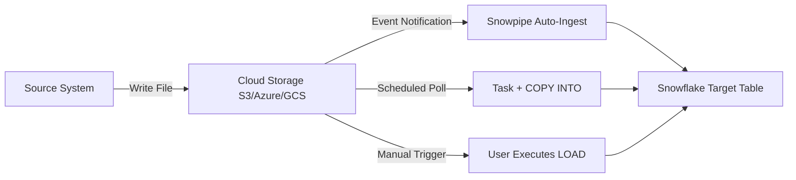
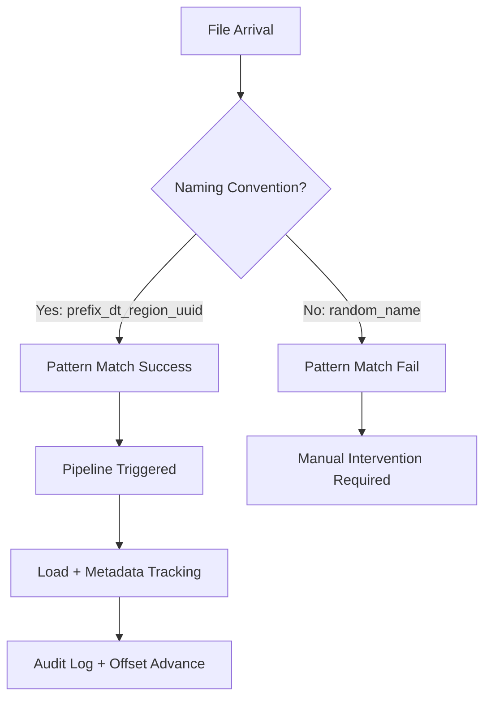
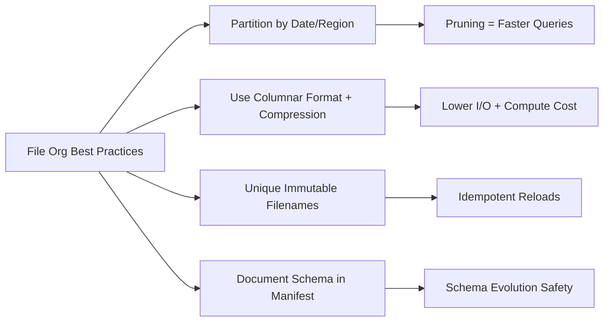

**Overview**
- Initial ingestion step: files land in cloud storage (S3/Azure/GCS) or internal stage
- Triggers downstream pipelines: Snowpipe auto-ingest, scheduled tasks, or manual COPY INTO
- File organization dictates pipeline efficiency: naming, partitioning, format, compression
- Decouples source system delivery from Snowflake processing
- Foundation for idempotent, scalable, observable data ingestion

**Key Characteristics**
- Arrival patterns: batch (daily/hourly dumps), incremental (micro-batches), event-driven (real-time file drops)
- File naming conventions: `prefix_YYYYMMDD_HHMMSS_uuid.ext` enables pattern matching and deduplication
- Partitioning strategy: folder hierarchy `.../dt=2024-01-01/region=US/file.parquet` enables pruning
- Format selection: Parquet/ORC for analytics, JSON/CSV for flexibility, Avro for schema evolution
- Compression: GZIP, ZSTD, SNAPPY reduce storage + I/O; columnar formats + compression = optimal
- Cloud notifications: S3 SNS/SQS, Azure Event Grid, GCS Pub/Sub trigger Snowpipe auto-ingest
- Idempotency guardrails: unique file names + internal tracking prevent duplicate loads
- Retention policies: lifecycle rules auto-archive/delete raw files post-ingestion

**Examples**

- **Cloud Storage Path Structure**
```
s3://raw-zone/
├── events/
│   ├── dt=2024-01-01/
│   │   ├── events_20240101_001.parquet
│   │   └── events_20240101_002.parquet
│   └── dt=2024-01-02/
├── orders/
│   ├── region=US/
│   │   └── orders_US_20240101.json.gz
│   └── region=EU/
```

- **External Stage with Pattern Matching**
```sql
CREATE OR REPLACE EXTERNAL STAGE ext_raw_events
  URL = 's3://raw-zone/events/'
  STORAGE_INTEGRATION = s3_int
  FILE_FORMAT = (TYPE = PARQUET)
  PATTERN = '.*dt=[0-9]{4}-[0-9]{2}-[0-9]{2}/.*\\.parquet';
```

- **Snowpipe Auto-Ingest Trigger on File Arrival**
```sql
CREATE OR REPLACE PIPE raw_events_pipe
  AUTO_INGEST = TRUE
  AWS_SNS_TOPIC = 'arn:aws:sns:us-east-1:123456789012:file-arrival'
AS
COPY INTO raw_events
FROM @ext_raw_events
FILE_FORMAT = (TYPE = PARQUET)
ON_ERROR = 'CONTINUE';
```

- **Scheduled Task Polling for New Files**
```sql
CREATE OR REPLACE TASK daily_load_task
  SCHEDULE = '0 2 * * *'  -- 2 AM UTC
  WHEN SYSTEM$STREAM_HAS_DATA('file_manifest_stream')
AS
  COPY INTO processed_events
  FROM @ext_raw_events
  PATTERN = '.*dt=' || TO_VARCHAR(DATEADD(day, -1, CURRENT_DATE()), 'YYYY-MM-DD') || '/.*'
  FILE_FORMAT = (TYPE = PARQUET);
```







**Notes**
- File arrival is NOT ingestion; it's the precondition. Snowflake acts only after files are fully written and visible
- Avoid in-place file updates; cloud storage eventual consistency can cause partial reads. Write-once, immutable files only
- Pattern matching uses PCRE regex; test with `LIST @stage PATTERN='.*'` before deploying pipelines
- Partition pruning only works if `PARTITION BY` in external table/stream matches folder structure
- Snowpipe auto-ingest latency: typically <1 min from file arrival to load start; not sub-second
- For high-frequency tiny files: batch at source or use Snowpipe Streaming (Kafka) instead of file-based arrival
- Always log file arrival metadata (filename, size, hash, timestamp) in a manifest table for audit/recovery
- Cloud lifecycle policies: auto-move raw files to cold storage post-ingestion to control costs
- Security: enforce bucket/stage policies (IAM, SAS, pre-signed URLs); never use inline credentials in prod
- Idempotency requires unique filenames + Snowflake's internal file tracking; never rely on timestamps alone for deduplication
