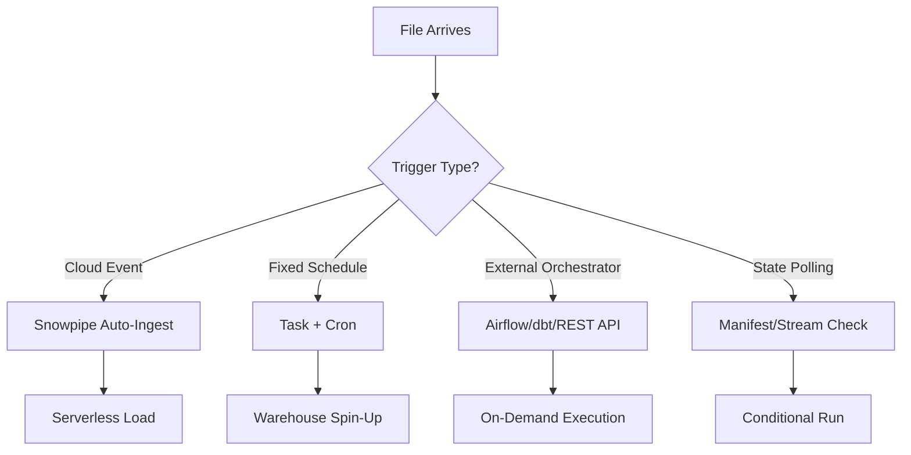
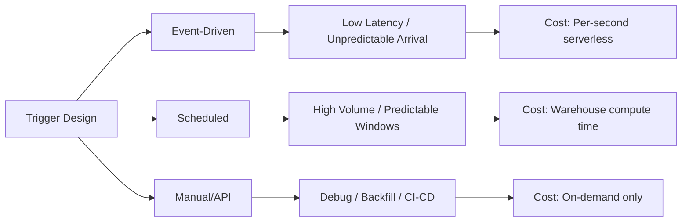

**Overview**
- Mechanism initiating data load after file arrival
- Decouples file presence from execution
- Supports event-driven, scheduled, manual/API, and polling patterns
- Core to pipeline reliability, cost control, and idempotency
- Determines latency vs compute trade-off

**Key Characteristics**
- Event-driven: Cloud notifications (S3 SNS/SQS, Azure Event Grid, GCS Pub/Sub) trigger Snowpipe instantly
- Scheduled: Cron/interval tasks run at fixed windows, poll stages, or check stream state
- Manual/API: REST `insertFiles`, CLI, or orchestrators (Airflow/dbt) trigger on-demand
- State-aware: `SYSTEM$STREAM_HAS_DATA()`, manifest tables, or `LIST` results prevent empty runs
- Idempotency guard: Unique filenames + internal tracking block duplicate loads
- Cost control: `WHEN` clauses + `AUTO_SUSPEND` prevent idle warehouse spin-ups
- Latency: Snowpipe ~10-60s, Tasks ~1-2 min (scheduler + warehouse resume)
- Observability: `COPY_HISTORY()`, `TASK_HISTORY()`, cloud notification logs track execution

**Examples**

- **Event-Driven: Snowpipe Auto-Ingest**
```sql
CREATE OR REPLACE PIPE ingest_events_pipe
  AUTO_INGEST = TRUE
  AWS_SNS_TOPIC = 'arn:aws:sns:us-east-1:123456789012:file-arrival'
AS
COPY INTO raw_events
FROM @ext_stage/events/
FILE_FORMAT = (TYPE = PARQUET)
ON_ERROR = 'CONTINUE';
```

- **Scheduled: Task with Stream Guard**
```sql
CREATE OR REPLACE TASK scheduled_load_task
  WAREHOUSE = etl_wh
  SCHEDULE = '0 */2 * * *'
  WHEN SYSTEM$STREAM_HAS_DATA('events_stream')
AS
INSERT INTO processed_events
SELECT * FROM events_stream
WHERE METADATA$ACTION = 'INSERT';
```

- **Manual/API Trigger (REST)**
```bash
POST /api/v1/pipes/insertFiles
-H "Authorization: Bearer <JWT>"
-d '{"files": [{"path": "s3://bucket/data/batch_001.parquet"}]}'
```

- **Conditional Polling: Manifest Table Check**
```sql
CREATE OR REPLACE TASK manifest_poll_task
  SCHEDULE = '5 MINUTE'
  WHEN (SELECT COUNT(*) FROM file_manifest WHERE status = 'PENDING') > 0
AS
COPY INTO staging FROM @ext_stage FILE_FORMAT = (TYPE = PARQUET);
```





**Notes**
- Event-driven requires exact cloud notification alignment; broken SNS/SQS = silent pipeline failure
- `WHEN` clauses are mandatory for cost control; never run tasks without data availability guards
- Manual/API triggers bypass auto-dedup; rely on default `FORCE=FALSE` to prevent duplicates
- Scheduled tasks inherit warehouse state; pair with `AUTO_SUSPEND=60` to cap idle credits
- Polling anti-pattern: `LIST @stage` in `WHEN` causes full metadata scans; prefer streams or manifest tables
- Orchestration handoff: Airflow/dbt should call `COPY INTO` or `insertFiles`, not manage Snowpipe lifecycle
- Trigger latency includes notification propagation + warehouse resume; sub-second triggers require Snowpipe Streaming
- Debugging: Cross-reference `TASK_HISTORY()`, `COPY_HISTORY()`, and cloud event delivery logs
- Match trigger to workload: High-frequency small files → Snowpipe; Large predictable batches → Scheduled Tasks; Ad-hoc/backfill → Manual/API
