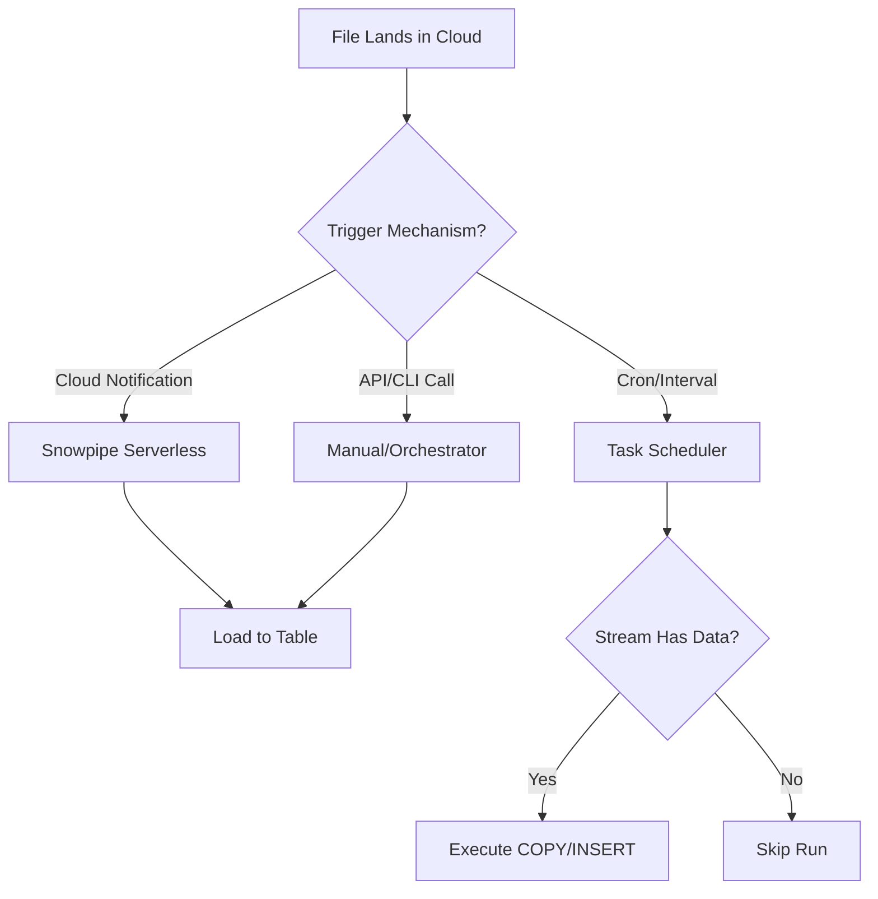
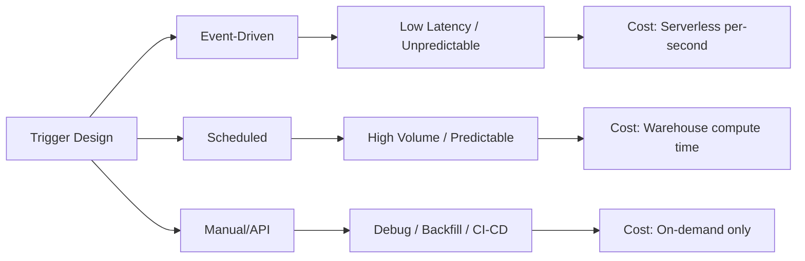
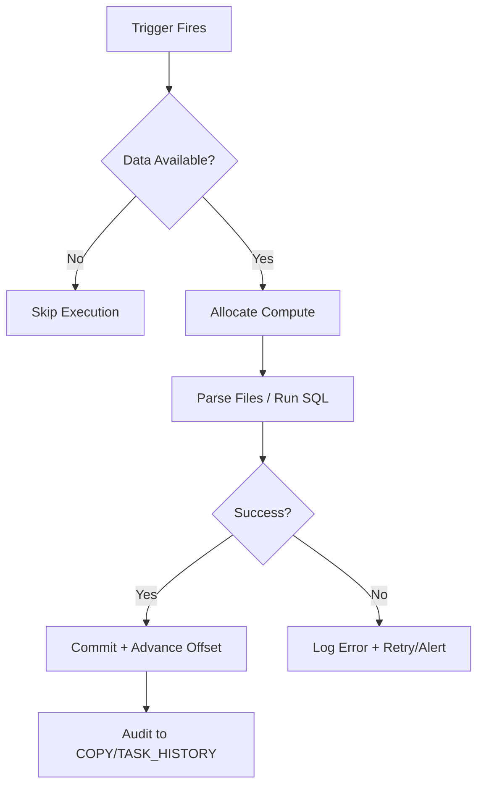

**Overview**
- Mechanism initiating data load post-file arrival
- Decouples storage presence from compute execution
- Patterns: Event-driven (Snowpipe), Scheduled (Tasks), Manual/API (REST), State-Polling (Streams)
- Dictates pipeline latency, compute cost, and idempotency guarantees
- Core to reliable, observable ingestion architecture

**Key Characteristics**
- Event-driven: Cloud notifications (S3/SQS, Azure Event Grid, GCS Pub/Sub) trigger Snowpipe ~10-60s
- Scheduled: Cron/interval tasks run at fixed windows; require `WHEN` guards to skip empty runs
- Manual/API: `insertFiles` REST endpoint, CLI, or orchestrator (Airflow/dbt) for ad-hoc/backfills
- State-aware: `SYSTEM$STREAM_HAS_DATA()`, manifest tables, or `LIST` results prevent wasted compute
- Idempotency: Relies on `FORCE=FALSE` (default) + unique filenames + Snowflake internal tracking
- Cost control: `AUTO_SUSPEND` + `WHEN` clauses cap idle warehouse credits
- Observability: `COPY_HISTORY()`, `TASK_HISTORY()`, cloud event logs track execution & failures





**Examples**

- **Event-Driven: Snowpipe Auto-Ingest**
```sql
CREATE OR REPLACE PIPE event_pipe
  AUTO_INGEST = TRUE
  AWS_SNS_TOPIC = 'arn:aws:sns:us-east-1:123456789012:s3-events'
AS COPY INTO raw_events 
FROM @ext_stage/ 
FILE_FORMAT = (TYPE = PARQUET);
```

- **Scheduled: Task with Stream Guard**
```sql
CREATE OR REPLACE TASK scheduled_ingest
  WAREHOUSE = etl_wh
  SCHEDULE = '0 */2 * * *'
  WHEN SYSTEM$STREAM_HAS_DATA('raw_stream')
AS INSERT INTO processed 
SELECT * FROM raw_stream 
WHERE METADATA$ACTION = 'INSERT';
```

- **Manual/API Trigger**
```bash
curl -X POST "https://<account>.snowflakecomputing.com/api/v1/pipes/insertFiles" \
  -H "Authorization: Bearer <JWT>" \
  -d '{"files": [{"path": "s3://bucket/data/batch_001.parquet"}]}'
```

- **Conditional Polling (Manifest Table)**
```sql
CREATE TASK manifest_trigger
  SCHEDULE = '5 MINUTE'
  WHEN (SELECT COUNT(*) FROM ingestion_manifest WHERE status = 'READY') > 0
AS COPY INTO staging FROM @ext_stage FILE_FORMAT = (TYPE = JSON);
```

- **Monitor Trigger Execution**
```sql
SELECT task_name, status, scheduled_time, query_id, error_message
FROM TABLE(INFORMATION_SCHEMA.TASK_HISTORY())
ORDER BY scheduled_time DESC LIMIT 10;
```



**Notes**
- Event-driven requires exact cloud IAM/notification alignment; broken SNS/SQS = silent pipeline failure
- `WHEN` clauses mandatory for cost control; never run tasks without data availability guards
- `FORCE=FALSE` (default) prevents duplicates; override only for explicit correction workflows
- `AUTO_SUSPEND` + warehouse sizing caps idle credits; serverless tasks bypass this but bill per-second
- Polling anti-pattern: `LIST @stage` in `WHEN` causes full metadata scans; prefer streams or manifest tables
- Orchestration handoff: Airflow/dbt should call `COPY INTO` or `insertFiles`, not manage Snowpipe lifecycle
- Trigger latency includes notification propagation + warehouse resume (~1-2 min); sub-second requires Streaming API
- Debugging: Cross-reference `TASK_HISTORY()`, `COPY_HISTORY()`, and cloud event delivery logs
- Match trigger to workload: High-frequency small files → Snowpipe; Large predictable batches → Scheduled Tasks; Ad-hoc → Manual/API
