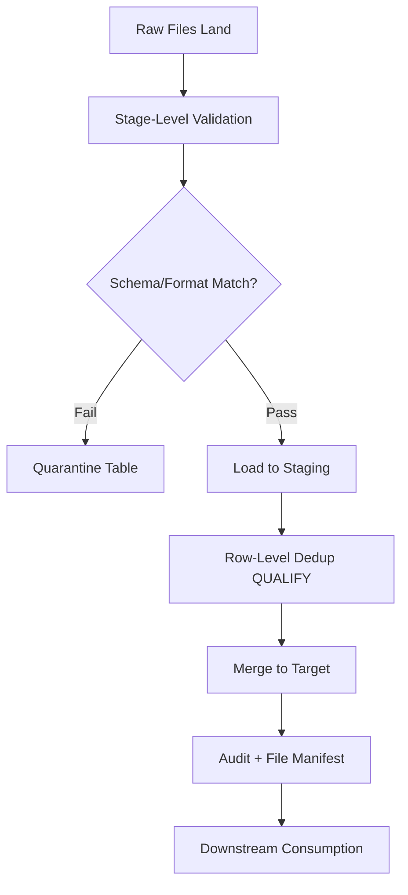
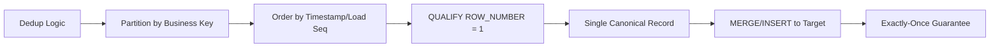
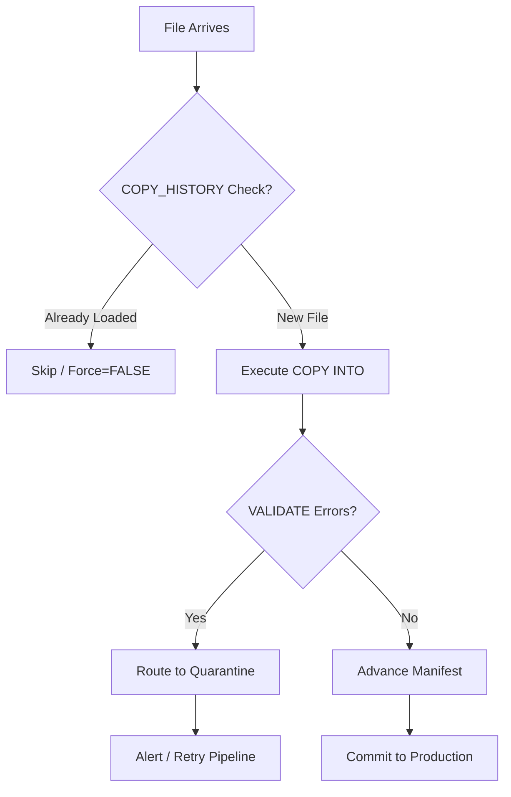

**Overview**
- Post-landing gate: validates structure/content, removes duplicates before downstream consumption
- Ensures idempotency, data quality, and pipeline resilience
- Combines native Snowflake features (`VALIDATE`, `ON_ERROR`, `QUALIFY`) with custom patterns (manifest tracking, `MERGE` dedup)
- Critical for handling re-runs, late-arriving files, and noisy source data

**Key Characteristics**
- Schema/Type Validation: `VALIDATE()` table function, `ON_ERROR` behavior, `RETURN_ERRORS`
- File-level Dedup: `COPY_HISTORY()`, manifest tables, Snowpipe internal tracking (`FORCE=FALSE`)
- Row-level Dedup: `ROW_NUMBER() OVER(PARTITION BY ... ORDER BY ...)` + `QUALIFY rn = 1`
- Error Routing: Bad records → quarantine table via conditional `INSERT` or `TRY_CAST` filters
- Idempotency: Combine file tracking + row dedup + `MERGE` for exactly-once semantics
- Cost/Compute: Validation scans require warehouse; optimize with sampling or stage-level pre-checks
- Observability: `VALIDATE` output, `COPY_HISTORY`, custom audit tables track pass/fail rates

**Examples**

- **Post-Load Error Capture**
```sql
SELECT 
  FILE_NAME,
  ROW_NUMBER,
  ERROR_CODE,
  ERROR_MESSAGE
FROM TABLE(VALIDATE(raw_events, JOB_ID => '_last'));
```

- **Row-Level Deduplication (Latest Wins)**
```sql
CREATE TABLE deduped_events AS
SELECT 
  event_id,
  user_id,
  payload,
  loaded_at
FROM raw_events
QUALIFY ROW_NUMBER() OVER(
  PARTITION BY event_id 
  ORDER BY loaded_at DESC, file_name DESC
) = 1;
```

- **File-Level Dedup via Manifest**
```sql
-- Check if files already processed
INSERT INTO target_table
SELECT * FROM @ext_stage/data/ (FILE_FORMAT => 'parquet_fmt') f
WHERE f.metadata$filename NOT IN (
  SELECT file_name FROM ingestion_audit WHERE status = 'SUCCESS'
);

-- Log successful loads
INSERT INTO ingestion_audit (file_name, load_time, status)
SELECT DISTINCT METADATA$FILENAME, CURRENT_TIMESTAMP(), 'SUCCESS'
FROM target_table;
```

- **Quarantine Routing via TRY_CAST**
```sql
-- Route invalid rows before main load
CREATE TABLE events_quarantine AS
SELECT src.*, 'TYPE_MISMATCH' AS reject_reason
FROM raw_events_stg src
WHERE TRY_CAST(src.payload:amount AS DECIMAL(10,2)) IS NULL
  AND src.payload:amount IS NOT NULL;
```







**Notes**
- `VALIDATE()` requires a completed `COPY` or `INSERT` job; `_last` references the most recent session job
- `QUALIFY` filters post-window-function; cleaner and more performant than CTE + `WHERE rn = 1`
- File-level dedup ≠ row-level dedup; track both for true idempotency across re-runs
- `FORCE=TRUE` in `COPY` bypasses internal tracking and creates duplicates; use only for explicit backfills
- Quarantine tables require separate cleanup pipelines; don't block main flow on partial failures
- Validation scans full datasets; use stage-level sampling or `LIST @stage` pre-checks to cap compute cost
- Combine `MERGE` with `QUALIFY` dedup for upsert scenarios; avoid standalone `INSERT` for mutable sources
- Monitor pass/fail ratios; >5% error rate usually indicates upstream schema drift or format changes
- Snowpipe auto-ingest dedup relies on file path + size; rename files if upstream system rewrites identical data
