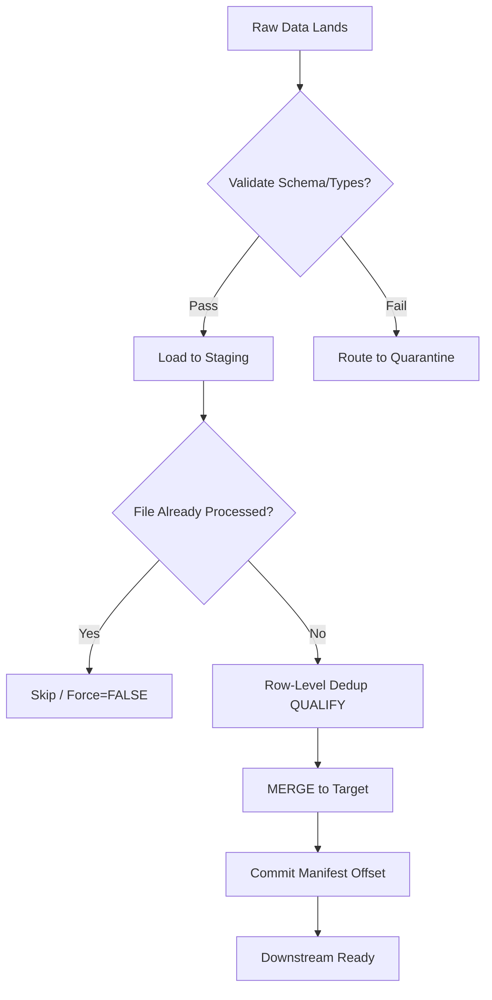
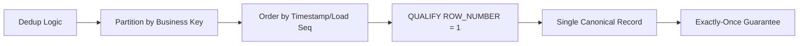

**Overview**
- Post-landing gate for data quality & idempotency
- Validates schema/format, removes duplicates before target load
- Combines native Snowflake features (`VALIDATE`, `ON_ERROR`, `QUALIFY`) with custom tracking (manifests, `MERGE`)
- Ensures exactly-once semantics across re-runs, late files, noisy sources

**Key Characteristics**
- File-level dedup: `COPY_HISTORY()`, ingestion manifests, Snowpipe internal tracking (`FORCE=FALSE` default)
- Row-level dedup: `ROW_NUMBER() OVER(PARTITION BY key ORDER BY ts DESC)` + `QUALIFY rn = 1`
- Schema/Type validation: `VALIDATE()` table function, `ON_ERROR` flags (`CONTINUE`, `SKIP_FILE`, `ABORT_STATEMENT`)
- Error routing: Bad records → quarantine table via `TRY_CAST`/`TRY_TO_*` filters or `VALIDATE` output
- Idempotency: File tracking + row dedup + `MERGE` = exactly-once guarantee
- Compute-bound: Validation scans raw data; optimize with partition pruning, sampling, or stage pre-checks
- Observability: `VALIDATE` output, `COPY_HISTORY`, custom audit logs track pass/fail rates

**Examples**

- **Validate last load & capture parsing errors**
```sql
SELECT 
  FILE_NAME,
  ROW_NUMBER,
  ERROR_CODE,
  ERROR_MESSAGE,
  VALUE
FROM TABLE(VALIDATE(raw_events, JOB_ID => '_last'))
WHERE ERROR_CODE IS NOT NULL;
```

- **Row-level dedup (latest arrival wins)**
```sql
CREATE TABLE deduped_events AS
SELECT event_id, user_id, payload, loaded_at
FROM raw_events
QUALIFY ROW_NUMBER() OVER(
  PARTITION BY event_id 
  ORDER BY loaded_at DESC, file_name DESC
) = 1;
```

- **File-level dedup via manifest tracking**
```sql
-- Load only unprocessed files
INSERT INTO target_table
SELECT * FROM @ext_stage/data/ (FILE_FORMAT => 'parquet_fmt') f
WHERE f.metadata$filename NOT IN (
  SELECT file_name FROM ingestion_manifest WHERE status = 'SUCCESS'
);

-- Log success
INSERT INTO ingestion_manifest (file_name, load_time, status)
SELECT DISTINCT METADATA$FILENAME, CURRENT_TIMESTAMP(), 'SUCCESS'
FROM @ext_stage/data/ WHERE METADATA$FILENAME IN (SELECT file_name FROM ingestion_manifest WHERE status = 'SUCCESS');
```

- **Quarantine routing with soft validation**
```sql
INSERT INTO events_quarantine
SELECT src.*, 'INVALID_AMOUNT' AS reject_reason
FROM raw_events_stg src
WHERE TRY_CAST(src.payload:amount AS DECIMAL(10,2)) IS NULL
  AND src.payload:amount IS NOT NULL;
```

- **MERGE with pre-deduped stream**
```sql
MERGE INTO target_orders t
USING (
  SELECT * FROM orders_stream
  QUALIFY ROW_NUMBER() OVER(PARTITION BY order_id ORDER BY METADATA$ACTION DESC) = 1
) s
ON t.order_id = s.order_id
WHEN MATCHED AND s.METADATA$ACTION = 'DELETE' THEN DELETE
WHEN MATCHED AND s.METADATA$ACTION = 'INSERT' THEN UPDATE SET status = s.status
WHEN NOT MATCHED THEN INSERT (order_id, status) VALUES (s.order_id, s.status);
```





**Notes**
- `VALIDATE()` requires completed `COPY`/`INSERT` job; `_last` references most recent session job
- `QUALIFY` > CTE + `WHERE rn=1` for performance & readability in Snowflake
- File dedup ≠ row dedup; track both for full idempotency across pipeline re-runs
- `FORCE=TRUE` bypasses internal tracking → duplicates; only use for explicit correction/backfills
- Quarantine tables need separate cleanup pipelines; don't block main flow on partial failures
- Validation scans full datasets; cap compute cost with partition pruning, `SAMPLE`, or `LIST @stage` pre-checks
- Combine `MERGE` with `QUALIFY` dedup for upsert scenarios; avoid standalone `INSERT` for mutable sources
- >5% error rate = upstream schema drift or format change; trigger alerting upstream
- Snowpipe auto-ingest dedup relies on file path + size; upstream rewrites break tracking → use manifest tables instead
