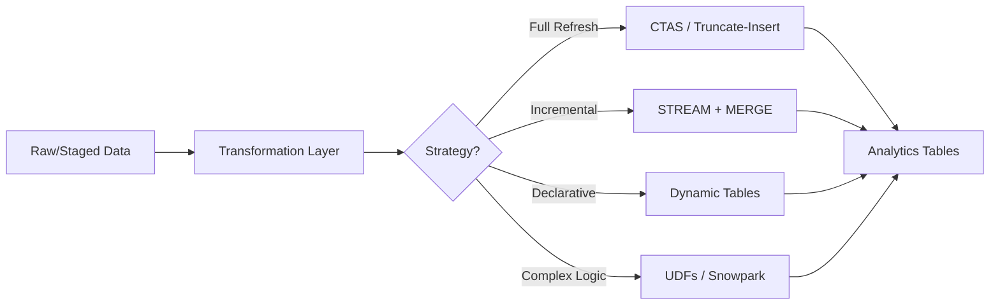
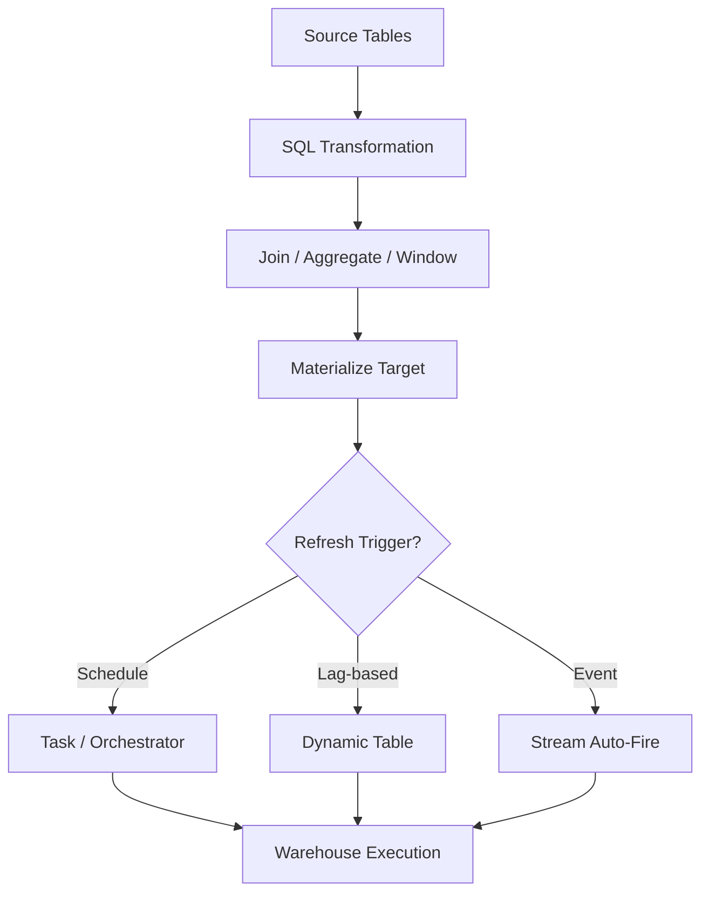

**Overview**
- Post-landing ELT step: raw/staged data → analytics-ready models
- Compute-bound: executes on virtual warehouse or serverless compute
- SQL-native + extensible: DML, window functions, UDFs, Python/Snowpark
- ELT paradigm: transform where data lives, avoid external data movement
- Foundation for dimensional modeling, incremental loads, and consumption layers

**Key Characteristics**
- Materialization strategies: CTAS, views, dynamic tables, temp/staging tables
- Incremental processing: `STREAM` offsets, watermark columns, `MERGE` upserts
- Extensibility: SQL/Python/Java UDFs, stored procedures, Snowpark DataFrames
- Orchestration: Native Tasks/DAGs, dbt (Jinja→SQL), external schedulers (Airflow/Prefect)
- Cost/latency trade-off: full refresh (simple, high compute) vs incremental (complex, low compute)
- Schema drift handling: `VARIANT` parsing, `ALTER TABLE ADD COLUMN`, flexible `MERGE`
- Dependency resolution: dynamic tables auto-handle DAGs; dbt compiles reference graphs
- Observability: query profiles, warehouse credit burn, task/stream history, dbt run logs

**Examples**

- **CTAS / Full Refresh**
```sql
CREATE OR REPLACE TABLE dim_customer AS
SELECT 
  c.customer_id,
  c.name,
  COALESCE(c.email, 'unknown') AS email,
  CASE WHEN c.country = 'US' THEN 'NA' ELSE 'INTL' END AS region,
  CURRENT_TIMESTAMP() AS updated_at
FROM stg_customers c;
```

- **Incremental MERGE (CDC)**
```sql
MERGE INTO dim_customer t
USING stg_customer_stream s
  ON t.customer_id = s.customer_id
WHEN MATCHED AND s.METADATA$ACTION = 'DELETE' THEN DELETE
WHEN MATCHED THEN UPDATE SET 
  name = s.name, 
  email = s.email, 
  region = s.region, 
  updated_at = CURRENT_TIMESTAMP()
WHEN NOT MATCHED THEN INSERT (customer_id, name, email, region, updated_at)
VALUES (s.customer_id, s.name, s.email, s.region, CURRENT_TIMESTAMP());
```

- **Dynamic Table (Auto-maintained)**
```sql
CREATE OR REPLACE DYNAMIC TABLE fct_orders_daily
  TARGET_LAG = '1 HOUR'
  WAREHOUSE = transform_wh
AS
SELECT 
  DATE_TRUNC('day', o.order_date) AS order_day,
  c.region,
  COUNT(DISTINCT o.order_id) AS orders,
  SUM(o.amount) AS revenue
FROM raw_orders o
JOIN dim_customer c ON o.customer_id = c.customer_id
GROUP BY 1, 2;
```

- **Python UDF for Row-Level Logic**
```sql
CREATE OR REPLACE FUNCTION normalize_email(email STRING)
RETURNS STRING
LANGUAGE PYTHON
RUNTIME_VERSION = '3.8'
HANDLER = 'clean'
AS $$
def clean(email):
    import re
    return re.sub(r'[^a-zA-Z0-9@._-]', '', email.lower())
$$;

UPDATE stg_users SET email = normalize_email(email);
```





**Notes**
- ELT > ETL: transform inside Snowflake; external pipelines waste network & add latency
- Incremental > full refresh for cost; use `STREAM` or `updated_at > watermark` to cap scans
- `MERGE` requires deterministic join keys; duplicates in source/stream cause unpredictable results
- Dynamic tables replace manual task chains; handle dependency graphs, auto-refresh, and cost tracking
- UDFs/Python introduce cold-start overhead; reserve for row-level regex/parsing, not set-based aggregations
- dbt standardizes modeling; compiles Jinja → SQL, manages tests, docs, and dependency resolution
- Warehouse sizing dictates transform speed; scale up temporarily for backfills, scale down after
- Schema drift breaks rigid pipelines; use `VARIANT` + flexible casting or `ALTER TABLE` before load
- Avoid transforming in `COPY INTO`; keep staging raw, apply business logic downstream for auditability
- Monitor credit burn per model; use `QUERY_HISTORY` + query profiles to catch inefficient joins/scans
- Validate on sampled data first; `TABLESAMPLE(10 PERCENT)` caps compute cost before full runs
