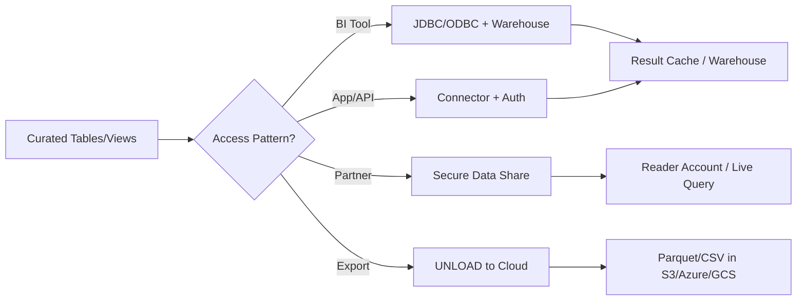
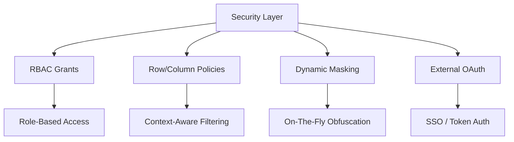
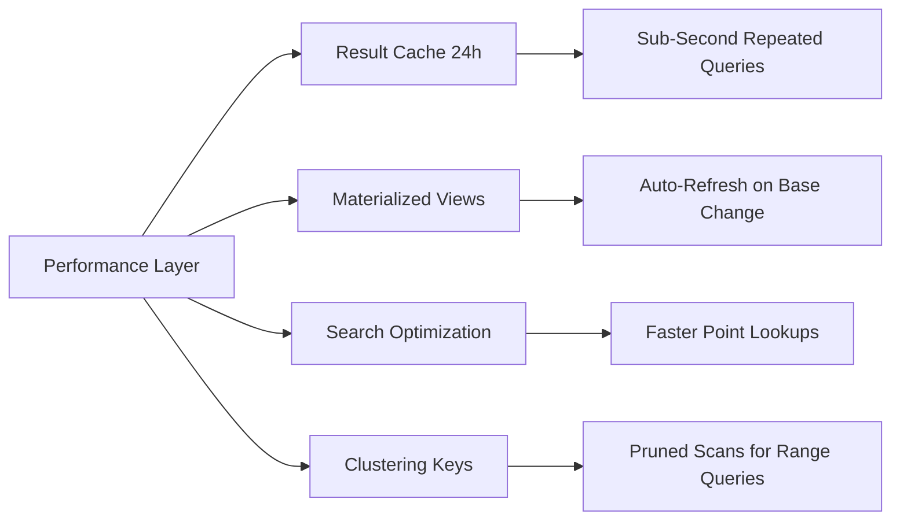

**Overview**
- Final pipeline stage: curated data → consumers (BI, APIs, apps, partners)
- Access patterns: direct SQL, secure views, data sharing, external functions, UNLOAD
- Security-first: row/column-level security, masking policies, object-level grants
- Performance-aware: result caching, warehouse sizing, materialized views, search optimization
- Zero-copy sharing: share live data without replication or egress

**Key Characteristics**
- Access methods: JDBC/ODBC, Snowflake Connector (Python/Node/Spark), REST API, SnowSQL
- Security: RBAC, row/column policies, dynamic data masking, external OAuth integration
- Sharing: Secure Data Sharing (reader accounts, marketplace), Delta Sharing (open protocol)
- Caching: Result cache (24h), metadata cache, warehouse local disk cache
- Performance: Materialized views, search optimization, clustering keys, query acceleration service
- External exposure: External functions (AWS Lambda/Azure FN), Snowflake Native Apps, UNLOAD to cloud storage
- Observability: `QUERY_HISTORY`, `ACCESS_HISTORY`, `LOGIN_HISTORY`, `METERING_BALANCE`
- Cost control: Resource monitors, warehouse auto-suspend, query timeout limits

**Examples**

- **Secure View with Row-Level Security**
```sql
CREATE OR REPLACE SECURE VIEW sales_restricted AS
SELECT order_id, customer_id, amount, region
FROM fct_sales
WHERE region = CURRENT_ROLE();  -- RLS via role context

GRANT SELECT ON VIEW sales_restricted TO ROLE analyst_us;
```

- **Dynamic Data Masking Policy**
```sql
CREATE MASKING POLICY mask_email AS (val STRING) RETURNS STRING ->
  CASE
    WHEN CURRENT_ROLE() IN ('ADMIN', 'COMPLIANCE') THEN val
    ELSE REGEXP_REPLACE(val, '.+@', '***@')
  END;

ALTER TABLE dim_customer MODIFY COLUMN email SET MASKING POLICY mask_email;
```

- **Secure Data Share (Cross-Account)**
```sql
CREATE SHARE sales_share;
GRANT USAGE ON DATABASE analytics TO SHARE sales_share;
GRANT SELECT ON TABLE fct_orders TO SHARE sales_share;
GRANT SELECT ON VIEW dim_customer_masked TO SHARE sales_share;

-- Add consumer account
ALTER SHARE sales_share ADD ACCOUNTS = consumer_acct_123;
```

- **Materialized View for Low-Latency BI**
```sql
CREATE MATERIALIZED VIEW mv_daily_revenue
  CLUSTER BY (order_date)
AS
SELECT 
  DATE_TRUNC('day', order_date) AS order_day,
  region,
  SUM(amount) AS revenue,
  COUNT(DISTINCT order_id) AS orders
FROM fct_orders
GROUP BY 1, 2;
```

- **External Function (Lambda Integration)**
```sql
CREATE OR REPLACE EXTERNAL FUNCTION enrich_address(addr STRING)
RETURNS VARIANT
API_INTEGRATION = aws_api_int
AS 'https://abc123.execute-api.us-east-1.amazonaws.com/prod/enrich';

SELECT order_id, enrich_address(shipping_addr) AS enriched
FROM fct_orders
WHERE order_date = CURRENT_DATE();
```

- **Query History + Access Audit**
```sql
SELECT 
  q.query_id,
  q.user_name,
  q.role_name,
  q.start_time,
  q.total_elapsed_time,
  q.query_text
FROM TABLE(INFORMATION_SCHEMA.QUERY_HISTORY_BY_SESSION(
  SESSION_ID => CURRENT_SESSION()
)) q
WHERE q.start_time >= DATEADD(hour, -24, CURRENT_TIMESTAMP());
```







**Notes**
- Secure views hide underlying table structure; `SECURE` keyword prevents metadata leakage
- Row-level security via `CURRENT_ROLE()`, `CURRENT_USER()`, or context functions; test with `SET ROLE`
- Data sharing is zero-copy; consumer queries run on producer warehouse (or reader account for isolation)
- Materialized views auto-refresh on base table changes; monitor `REFRESH_HISTORY` for lag/cost
- External functions add network latency; cache results or batch calls to reduce overhead
- Result cache invalidates on DML to base objects; `SELECT` after `UPDATE` bypasses cache
- `ACCESS_HISTORY` requires Enterprise+; critical for compliance audits and PII access tracking
- Resource monitors cap warehouse credits; set `NOTIFY_AT` + `SUSPEND_AT` thresholds to prevent runaway costs
- UNLOAD for external consumption: use `PARTITION BY` + columnar formats to optimize downstream reads
- Always grant minimal privileges; use `REVOKE` + `SHOW GRANTS` to audit surface area regularly
