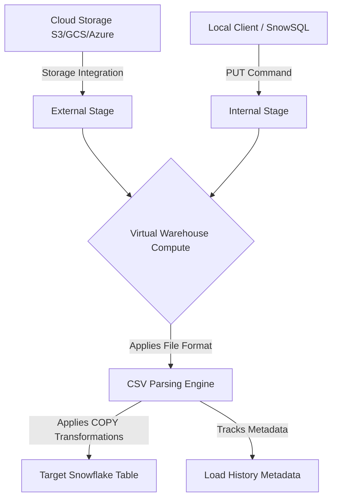

# 1. Retrieving and Ingesting Structured Data (CSV) in Snowflake

# 2. Overview
Retrieving and ingesting structured data (CSV) in Snowflake is the foundational process of moving delimited flat files from cloud storage into Snowflake relational tables or querying them directly. This process leverages Snowflake's decoupling of storage and compute to parse, transform, and load files using virtual warehouses.

This process is critical for data engineers building ELT pipelines and is a primary topic for SnowPro Advanced exams, which test knowledge of file format configurations, execution parameters, fault tolerance, and load history mechanics.

# 3. SQL Object Summary

| Object / Feature | Type | Purpose | Inputs | Outputs | Execution Mode |
| :--- | :--- | :--- | :--- | :--- | :--- |
| `COPY INTO <table>` | DML Command | Bulk loads CSV data into a target table. | Internal/External Stage | Populated Table | Batch / Micro-batch |
| `SELECT FROM @stage` | DQL Command | Queries CSV data directly without loading. | Internal/External Stage | Result Set | Ad-hoc / Interactive |
| `FILE FORMAT` | Schema Object | Defines parsing rules for the CSV engine. | Configuration parameters | Parsing configuration | Referenced at runtime |
| `STAGE` | Schema Object | Acts as a pointer to physical cloud storage. | S3, GCS, Azure Blob, Local | Virtual Directory | Referenced at runtime |

# 4. Architecture
The ingestion architecture relies on a declarative definition of storage location (Stage) and parsing rules (File Format), executed by a Virtual Warehouse to write micro-partitions to the Storage Layer.

# 5. Data Flow / Process Flow
1. **File Placement:** CSV files are placed in an external cloud bucket or uploaded via the `PUT` command to a Snowflake internal stage.
2. **Execution Invocation:** A `COPY INTO <table> FROM @stage` or `SELECT FROM @stage` command is executed.
3. **Metadata Evaluation:** The cloud services layer evaluates the stage definition, file format, and load history. If a file has already been loaded successfully into the target table, it is skipped (unless `FORCE = TRUE`).
4. **Compute Allocation:** The assigned virtual warehouse begins downloading and parsing the files in parallel based on the number of compute threads available.
5. **Parsing and Coercion:** The CSV engine splits records by the defined record delimiter, splits fields by the field delimiter, removes enclosures, and coerces string values into the target column data types.
6. **Transformation (Optional):** If the `COPY INTO` command includes a `SELECT` statement, basic column mapping, casting, or scalar functions are applied.
7. **Materialization:** Data is written as columnar micro-partitions into the target table, and load metadata is updated.

# 6. Logical Breakdown

**File Format Layer**
Responsibility: Instructs the Snowflake compute engine on how to interpret raw bytes as rows and columns.
Dependencies: Requires knowledge of source system extraction parameters (delimiters, quoting rules, null representations).
Risks: Incorrect configurations lead to misaligned columns or corrupted data ingestion.

**Staging Layer**
Responsibility: Abstracts the underlying storage credentials and paths into a secure, queryable Snowflake object.
Inputs: Cloud provider URLs and IAM roles/Storage Integrations.
Outputs: Directory listing accessible via `LIST @stage`.

**Query / Copy Layer**
Responsibility: Orchestrates the movement of data from the stage to the table or result set.
Inputs: Defined stage, defined file format, target table definition.
Outputs: Loaded rows and execution statistics.

# 7. Data Model 
The output of structured CSV retrieval is fundamentally a relational table.
Grain: One row per valid, un-skipped record delimited within the source CSV file.
Relationships: Data types must align with the target schema. 
Null Handling: Controlled by the `NULL_IF` file format parameter. If a string in the CSV matches an entry in the `NULL_IF` array, the target column receives a SQL `NULL`.

# 8. Execution Logic
**Schema Mapping Defaults:**
By default, Snowflake maps CSV fields to target table columns by ordinal position (e.g., Column 1 in CSV goes to Column 1 in Table).
If `MATCH_BY_COLUMN_NAME` is used, the CSV must include a header, and Snowflake maps fields based on matching header names to table column names.

**Load Tracking (Idempotency):**
Snowflake tracks the hash, path, and metadata of loaded files for 64 days.
Running the exact same `COPY INTO` command multiple times will not duplicate data; the engine skips previously loaded files automatically.
If a file is modified and placed back in the stage with the same name, Snowflake will not reload it unless it detects a new ETag/checksum or `FORCE = TRUE` is applied.

**Direct Querying Logic:**
When querying a stage directly (`SELECT $1, $2 FROM @stage`), Snowflake treats the file as an array of variant columns. Column 1 is accessed as `$1`, Column 2 as `$2`. All outputs from a direct stage query default to `VARCHAR` and must be explicitly cast to the desired data type.

# 9. Transformations 
During a `COPY INTO` statement, Snowflake supports lightweight transformations using a `SELECT` wrapper.
Allowed transformations:
- Column omission or reordering.
- Explicit data type casting (e.g., `CAST($1 AS DATE)`).
- String manipulation (e.g., `SUBSTRING`, `TRIM`, `UPPER`).
- Sequence generation (e.g., `METADATA$FILE_ROW_NUMBER`, `SEQ1()`).
- Metadata injection (e.g., `METADATA$FILENAME`).

Disallowed transformations:
- Aggregations (`GROUP BY`, `SUM()`).
- Joins to other tables.
- Window functions.
- `FLATTEN` operations (unless applied to JSON embedded within a CSV column).

# 10. Parameters / Configuration
File format configurations are critical for exam preparation and operational stability.

| Parameter | Type | Default Value (Exam Critical) | Purpose |
| :--- | :--- | :--- | :--- |
| `TYPE` | String | `CSV` | Defines the file format engine. |
| `COMPRESSION` | String | `AUTO` | Automatically detects GZIP, BZ2, BROTLI, ZSTD, DEFLATE, RAW_DEFLATE. |
| `RECORD_DELIMITER` | String | `\n` (Newline) | Character separating rows. |
| `FIELD_DELIMITER` | String | `,` (Comma) | Character separating columns. |
| `SKIP_HEADER` | Integer | `0` | Number of header lines to skip before parsing data. |
| `FIELD_OPTIONALLY_ENCLOSED_BY`| String | `NONE` | Character used to enclose strings (e.g., `"`), allowing delimiters inside strings. |
| `NULL_IF` | Array | `['\\N']` | Array of strings to translate to SQL NULL. |
| `ERROR_ON_COLUMN_COUNT_MISMATCH`| Boolean| `TRUE` | Aborts if CSV columns do not match target table columns (or `SELECT` projection). |
| `TRIM_SPACE` | Boolean | `FALSE` | Removes leading and trailing whitespace from strings. |

# 11. APIs / Interfaces

**COPY INTO Command**
Invocation: Executed via SQL worksheet, stored procedure, or programmatic driver.
Input: `COPY INTO my_table FROM @my_stage/path/ FILE_FORMAT = (FORMAT_NAME = 'my_csv_format');`
Output: Status message detailing files processed, rows loaded, and any errors encountered.

**VALIDATION_MODE Interface**
Invocation: Appended to the `COPY INTO` command.
Input: `VALIDATION_MODE = RETURN_ERRORS` (or `RETURN_n_ROWS`).
Output: Does not load data. Returns a result set detailing the specific parsing errors that would occur if the load were executed.

# 12. Execution / Deployment
CSV ingestion is typically deployed in one of two ways:
Batch Mode: Scheduled tasks or external orchestrators (Airflow, dbt) execute `COPY INTO` commands periodically.
Continuous Mode: Snowpipe relies on cloud storage event notifications (e.g., S3 Event to SQS) to trigger micro-batch `COPY INTO` operations asynchronously as files arrive.

# 13. Observability
`INFORMATION_SCHEMA.LOAD_HISTORY`: View tracking successfully loaded files and error counts within the last 14 days.
`ACCOUNT_USAGE.LOAD_HISTORY`: Long-term historical view tracking load metadata across the account for the last 365 days.
`COPY_HISTORY` Table Function: Granular diagnostic function tracking both successful and failed loads for a specific table over the last 14 days.

# 14. Failure Handling & Recovery
The `ON_ERROR` parameter in the `COPY INTO` command dictates failure behavior.

**Failure Scenario: Data Type Mismatch or Malformed Row**
- `ON_ERROR = ABORT_STATEMENT` (Default): The entire `COPY` command fails. No data is loaded, and the transaction is rolled back.
- `ON_ERROR = CONTINUE`: Snowflake skips the malformed rows, loads the valid rows, and flags the file with errors in load history.
- `ON_ERROR = SKIP_FILE`: Snowflake skips the entire file if a single error is found, but continues processing other files in the same command.
- `ON_ERROR = SKIP_FILE_num` / `SKIP_FILE_num%`: Skips the file only if the absolute number or percentage of errors exceeds the threshold.

**Failure Scenario: Mismatched Column Counts**
If a CSV has 5 columns but the target table has 4, the default behavior (`ERROR_ON_COLUMN_COUNT_MISMATCH = TRUE`) causes the load to fail.
Recovery: Set `ERROR_ON_COLUMN_COUNT_MISMATCH = FALSE`. Snowflake will load the 4 columns and ignore the 5th, or insert `NULL` if the table has more columns than the CSV.

**Failure Scenario: File Already Loaded**
If a file needs to be reprocessed due to upstream correction but retains the same filename, Snowflake will ignore it due to load history caching.
Recovery: Use `FORCE = TRUE` in the `COPY INTO` command to bypass load history evaluation.

# 15. Security & Access Control
Ingesting CSV data requires specific RBAC alignment:
- `USAGE` privilege on the external/internal stage.
- `USAGE` privilege on the file format (if created as a distinct object).
- `INSERT` privilege on the target table.
- For external stages, a Storage Integration object is required to negotiate secure credential exchange via AWS IAM, Azure AD, or GCP IAM, avoiding hardcoded credentials in the stage definition.

# 16. Performance / Scalability Considerations
- **File Sizing:** Snowflake recommends files be sized between 100 MB and 250 MB compressed. Files that are too small generate metadata overhead. Files that are too large limit parallel processing.
- **Parallelism:** A Virtual Warehouse assigns threads to files. A single massive 10GB CSV file cannot be split across threads unless it is uncompressed or split upstream.
- **Pushdown Limitations:** When querying stages directly (`SELECT FROM @stage`), partition pruning is limited compared to querying native tables. Queries against stages require scanning the entire file unless explicit directory path filtering (e.g., `/year=2023/`) is utilized in the `FROM` clause.

# 17. Assumptions & Constraints
- Snowflake assumes CSV data maps ordinally unless a `SELECT` statement or `MATCH_BY_COLUMN_NAME` is provided.
- Load history deduplication relies strictly on filename and ETag/checksum. It does not inspect the contents of the CSV for row-level duplication.
- Load history tracking retention is strictly 64 days. If a file remains in the stage and 65 days pass, a standard `COPY INTO` command will reload the file, causing data duplication.
- Explicit limit: A single `COPY INTO` statement cannot execute complex analytical transformations or cross-table dependencies.

# 18. Future Enhancements
- Implement Snowpipe Auto-Ingest to remove manual batch scheduling and latency.
- Refactor fragile ordinal mapping by enforcing strict headers in source CSVs and utilizing `MATCH_BY_COLUMN_NAME`.
- Configure `REJECTED_RECORD_DIR` (currently a preview/evolving pattern for some formats) to automatically route failed CSV rows to a separate storage path for debugging without halting the main pipeline.
