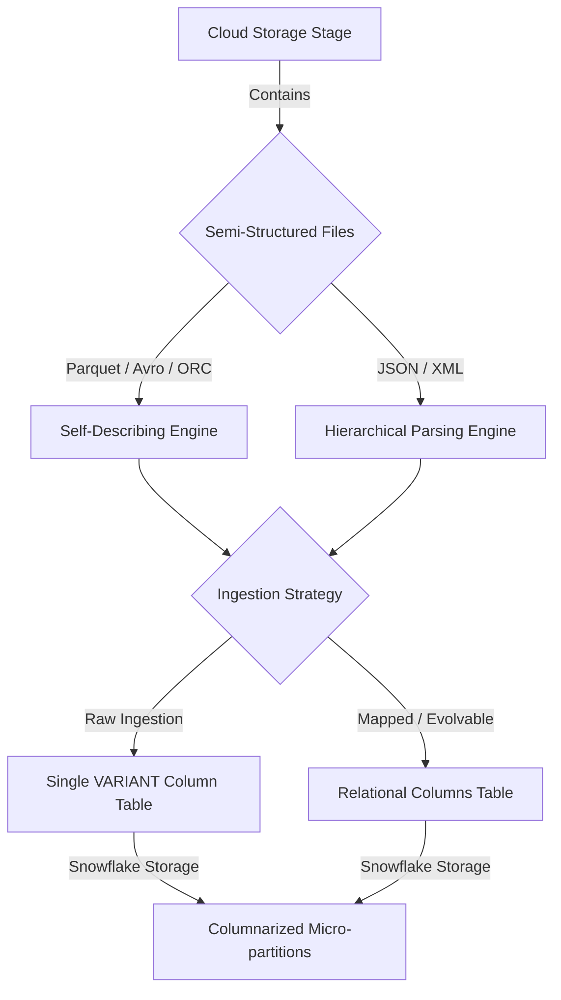

# 1. Retrieving and Ingesting Semi-Structured Data (JSON, Parquet, Avro, ORC, XML)

# 2. Overview
Retrieving and ingesting semi-structured data involves loading self-describing or hierarchical file formats from cloud storage into Snowflake. Unlike structured CSVs, semi-structured formats support nested attributes, arrays, and dynamic schemas without requiring a rigidly predefined table structure.

Snowflake handles this natively using the `VARIANT` data type, which stores the semi-structured payload in an optimized, columnar format. This pattern is foundational for ELT pipelines processing streaming data, IoT telemetry, or NoSQL database exports. For SnowPro Advanced exams, mastering schema inference, parsing parameters, size limits, and the `VARIANT` engine is critical.

# 3. SQL Object Summary

| Object / Feature | Type | Purpose | Inputs | Outputs | Execution Mode |
| :--- | :--- | :--- | :--- | :--- | :--- |
| [`VARIANT`](SQL Object Summary/VARIANT.md) | Data Type | Universal type for storing semi-structured data. | JSON, Parquet, Avro, ORC, XML | Columnarized payload | Storage/Runtime |
| [`COPY INTO`](SQL Object Summary/COPY INTO.md) | DML Command | Loads files into `VARIANT` or typed relational columns. | Stage | Populated Table | Batch / Micro-batch |
| [`INFER_SCHEMA`](SQL Object Summary/INFER_SCHEMA.md) | Table Function | Detects schema from staged self-describing files. | Stage, File Format | Column definitions | Ad-hoc / Procedural |
| [`ENABLE_SCHEMA_EVOLUTION`](SQL Object Summary/ENABLE_SCHEMA_EVOLUTION.md)| Table Parameter | Allows table schema to automatically adapt to new file keys. | Table definition | Schema modifications | Triggered on COPY |

# 4. Architecture
Semi-structured ingestion maps dynamic source objects either into a single `VARIANT` column for downstream processing (schema-on-read) or maps them directly into relational columns via schema detection (schema-on-write).



# 5. Data Flow / Process Flow
1. **File Staging:** Files are deposited into a Snowflake internal or external stage.
2. **Schema Inference (Optional):** The `INFER_SCHEMA` function is executed against the stage to generate a relational DDL definition based on the keys and types in the file.
3. **Execution Invocation:** A `COPY INTO` command is executed.
4. **Parsing & Size Validation:** The compute engine parses the files. The engine verifies that no single uncompressed object/document exceeds the 16 MB maximum size limit for a `VARIANT` column.
5. **Array Stripping:** If the file contains a single JSON array, and `STRIP_OUTER_ARRAY = TRUE` is configured, Snowflake splits the array into individual row objects.
6. **Columnarization:** The data is ingested into a `VARIANT` column. Snowflake automatically extracts the most frequently occurring primitive keys and stores them in hidden columnar structures within the micro-partition to optimize future query pruning.
7. **Materialization:** Data is committed to the target table and the load history is recorded.

# 6. Logical Breakdown

**Schema Evolution Layer**
Responsibility: Automatically adds new columns or drops the `NOT NULL` constraint if incoming files contain new attributes.
Dependencies: Requires `ENABLE_SCHEMA_EVOLUTION = TRUE` on the target table. Source files must be self-describing (Parquet, Avro, ORC) or JSON.
Constraints: Does not alter existing column data types.

**Data Type Casting / Traversal Layer**
Responsibility: Extracts nested values during load using Snowflake path notation.
Mechanics: Uses the `$` identifier to reference the stage column, and `:` to traverse keys (e.g., `SELECT $1:user.address.city::VARCHAR FROM @stage`).
Outputs: Strongly typed SQL fields derived from the `VARIANT` source.

**Parsing Control Layer**
Responsibility: Dictates how Snowflake interprets structural ambiguity (null representations, outer arrays, white space).
Dependencies: Controlled entirely by the `FILE FORMAT` definition.

# 7. Data Model
When loading semi-structured data, the target data model typically follows one of two patterns:

**Pattern A: Raw VARIANT Model (Schema-on-Read)**
- Grain: One row per JSON object, Parquet record, or XML element.
- Table Structure: `(src_variant VARIANT, loaded_timestamp TIMESTAMP_NTZ)`
- Advantages: Immune to upstream schema drift. All keys are preserved dynamically.

**Pattern B: Flattened Relational Model (Schema-on-Write)**
- Grain: One row per object, flattened via `MATCH_BY_COLUMN_NAME` or `COPY INTO ... SELECT`.
- Table Structure: Explicitly defined columns (e.g., `user_id INT`, `city VARCHAR`).
- Advantages: Immediately accessible to BI tools that do not support variant traversal.

# 8. Execution Logic
**Element Mapping Defaults:**
For semi-structured formats, the entire document or record defaults to column `$1` in the stage.
Unlike CSV, where `$1`, `$2`, `$3` represent delimited columns, in JSON or Parquet, `$1` represents the entire payload row, which must then be traversed.

**Case Sensitivity:**
Keys within a `VARIANT` object are strictly case-sensitive. Retrieving `$1:UserID` will return `NULL` if the source key is `userid`.

**SQL NULL vs JSON null:**
A critical exam and implementation detail. A JSON file might contain `"status": null`. When loaded into Snowflake, this becomes a `VARIANT` containing the JSON null value, not a SQL `NULL`. Standard SQL checks like `IS NULL` will fail. It must be checked using `IS_NULL_VALUE(src:status)`.

# 9. Transformations 
During a `COPY INTO` operation using a `SELECT` statement, the following transformation rules apply to semi-structured data:
- **Allowed:** Path traversal (e.g., `$1:key.subkey`), explicit casting (e.g., `::INT`), standard scalar functions (e.g., `COALESCE`).
- **Disallowed (Exam Trap):** `LATERAL FLATTEN` cannot be used in the `SELECT` clause of a `COPY INTO` command. To unnest arrays into multiple rows, data must first be loaded into a staging table and flattened via a subsequent `INSERT INTO ... SELECT ... FROM ... , LATERAL FLATTEN()` statement.

# 10. Parameters / Configuration
Key parameters in the `FILE FORMAT` definition for semi-structured data:

| Parameter | Type | Default Value | Format Focus | Purpose |
| :--- | :--- | :--- | :--- | :--- |
| [`STRIP_OUTER_ARRAY`](Parameters  Configuration/STRIP_OUTER_ARRAY.md) | Boolean | `FALSE` | JSON | If the entire file is enclosed in `[ ]`, strips the brackets to load each element as a discrete row. |
| [`STRIP_NULL_VALUES`](Parameters  Configuration/STRIP_NULL_VALUES.md) | Boolean | `FALSE` | JSON | If TRUE, removes object keys containing JSON null values. |
| [`IGNORE_UTF8_ERRORS`](Parameters  Configuration/IGNORE_UTF8_ERRORS.md)| Boolean | `FALSE` | JSON, XML | Replaces invalid UTF-8 characters with Unicode replacement character. |
| [`PRESERVE_SPACE`](Parameters  Configuration/PRESERVE_SPACE.md) | Boolean | `FALSE` | XML | Retains leading/trailing spaces in XML element values. |
| [`MATCH_BY_COLUMN_NAME`](Parameters  Configuration/MATCH_BY_COLUMN_NAME.md)| String | `NONE` | JSON, Avro, ORC, Parquet | Values: `CASE_SENSITIVE` or `CASE_INSENSITIVE`. Maps JSON/Parquet keys directly to table columns by name. |

# 11. APIs / Interfaces

**INFER_SCHEMA Invocation**
Used to automatically generate table structures from staged files.
Input:
```sql
SELECT * FROM TABLE(INFER_SCHEMA(
  LOCATION=>'@my_stage/data/', 
  FILE_FORMAT=>'my_parquet_format'
));
```
Output: A result set containing `COLUMN_NAME`, `TYPE`, and `NULLABLE` flags. Often wrapped in a `GENERATE_COLUMN_DESCRIPTION()` function to dynamically build a `CREATE TABLE` DDL.

# 12. Execution / Deployment
- **Schema Validation Phase:** Before executing production pipelines, engineers often run `SELECT $1 FROM @stage LIMIT 10` to verify JSON structure and path notation.
- **Continuous Ingestion:** Snowpipe is natively designed for streaming JSON/Parquet logs into raw `VARIANT` tables. Snowpipe automatically tracks file ETags and prevents duplicate ingestion of the same semi-structured payload.

# 13. Observability
- **Storage Metrics:** Snowflake captures metadata on `VARIANT` usage. Since the engine columnarizes common paths, querying `ACCOUNT_USAGE.TABLE_STORAGE_METRICS` will reflect highly compressed sizes for repetitive JSON/Parquet.
- **Schema Evolution Tracking:** When `ENABLE_SCHEMA_EVOLUTION` triggers, it modifies the table DDL. This change can be tracked via `INFORMATION_SCHEMA.COLUMNS` or by querying query history for the evolution event.

# 14. Failure Handling & Recovery
**Failure Scenario: 16 MB Variant Limit Exceeded**
- Behavior: The `COPY INTO` command fails if any single parsed document exceeds 16 MB (compressed).
- Detection: Explicit error message stating payload exceeds limits.
- Recovery: The file must be split upstream. Snowflake cannot dynamically split a single monolithic JSON object at load time.

**Failure Scenario: Badly Formatted JSON / Missing End Tags in XML**
- Behavior: File parsing fails at the compute layer.
- Recovery: Controlled by the `ON_ERROR` parameter (`SKIP_FILE`, `CONTINUE`). The file must be corrected upstream or rejected to a dead-letter queue.

**Failure Scenario: Case Mismatch during `MATCH_BY_COLUMN_NAME`**
- Behavior: If `MATCH_BY_COLUMN_NAME = CASE_SENSITIVE`, and the Parquet file has `UserId` while the Snowflake table has `USERID` (which defaults to uppercase), the mapping fails, and the column remains `NULL`.
- Recovery: Use `CASE_INSENSITIVE` or quote the table columns upon creation to match exact casing.

# 15. Security & Access Control
No specialized privileges beyond standard ingestion (usage on stage, file format, insert on table). However, masking policies can be applied to elements extracted from `VARIANT` columns during subsequent views.

# 16. Performance / Scalability Considerations
- **Columnarization Engine:** Querying `SELECT src:key::string FROM raw_table` is almost as fast as querying a relational column because Snowflake automatically stores `src:key` in its own hidden physical column if it exists in a majority of the rows.
- **Avoid Querying Raw Stages:** Always ingest semi-structured data into a table before performing analytical workloads. Querying `@stage` directly with path traversal (e.g., `SELECT $1:key FROM @stage`) bypasses the columnar metadata extraction, forcing a full file scan and massive performance degradation.
- **Parquet Efficiency:** Parquet is already columnar. When loading Parquet into Snowflake, the ingestion is highly optimized, requiring less compute overhead compared to parsing large JSON text files.

# 17. Assumptions & Constraints
- `VARIANT` types cannot exceed 16 MB compressed per row.
- Nested structures beyond 16 MB must be split before reaching Snowflake.
- `MATCH_BY_COLUMN_NAME` ignores keys in the source file that do not have a matching target column in the table (it does not cause a failure, the extra data is simply discarded during relational mapping unless schema evolution is enabled).
- `FLATTEN` operations cannot be performed inside the `SELECT` query of a `COPY INTO` statement.

# 18. Future Enhancements
- Implement dynamic table materialized views over the raw `VARIANT` table to continually flatten arrays (`LATERAL FLATTEN`) incrementally without managing manual staging tasks.
- Enable `ENABLE_SCHEMA_EVOLUTION` on target tables to automatically capture newly added fields in upstream Parquet/JSON logs without pipeline failure.
