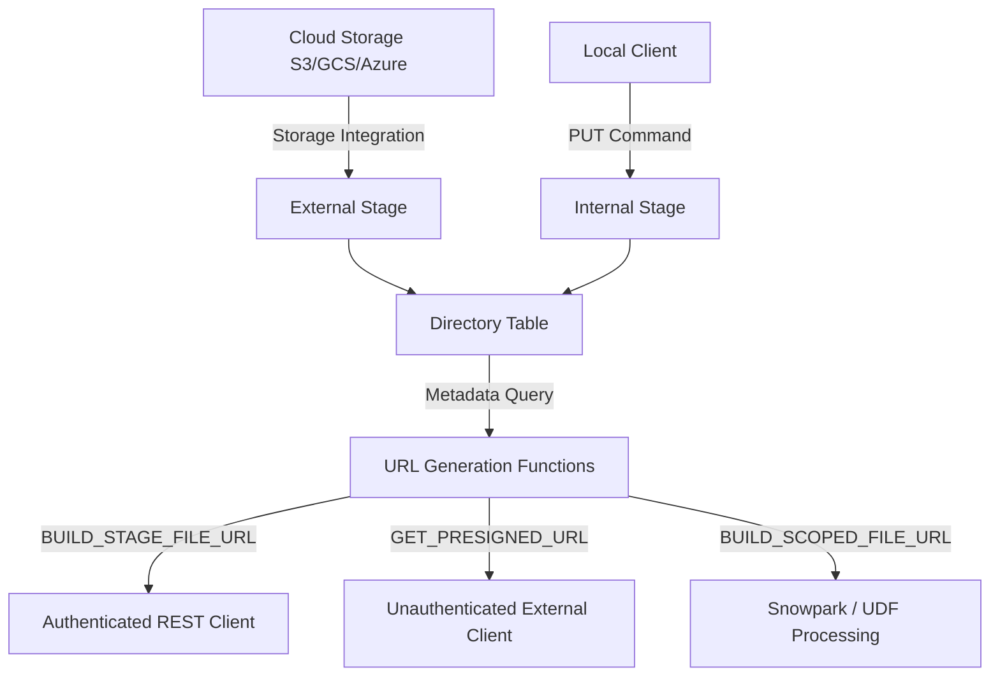

# 1. Retrieving and Managing Unstructured Data

# 2. Overview
Retrieving and managing unstructured data in Snowflake allows organizations to securely store, govern, and process files that do not conform to relational or semi-structured schemas (e.g., PDFs, images, audio, video, machine learning models). 

Instead of parsing the internal content of these files during ingestion, Snowflake treats the files as raw objects. Snowflake manages the metadata via Directory Tables and provides secure, granular access to the raw files through specialized URL generation functions. This feature enables data engineering and data science teams to build pipelines that pass unstructured files to Snowpark UDFs, External Functions, or external clients for machine learning inference, document parsing, or media serving.

# 3. SQL Object Summary

| Object / Feature | Type | Purpose | Inputs | Outputs | Execution Mode |
| :--- | :--- | :--- | :--- | :--- | :--- |
| `DIRECTORY TABLE` | Implicit View | Provides a queryable catalog of file metadata on a stage. | Stage | Relational metadata set | Ad-hoc / Auto-refresh |
| `GET_PRESIGNED_URL` | System Function | Generates a time-limited, externally accessible URL. | Stage Name, File Path | Expiring URL string | Ad-hoc |
| `BUILD_SCOPED_FILE_URL`| System Function | Generates a temporary URL valid only for the active query/session. | Stage Name, File Path | Scoped URL string | Query Runtime |
| `BUILD_STAGE_FILE_URL` | System Function | Generates a permanent REST API URL requiring Snowflake authentication. | Stage Name, File Path | Permanent URL string | Ad-hoc |
| `SnowflakeFile` | Snowpark API | Allows Python/Java/Scala compute to dynamically open and read staged files. | Stage URL | File stream / bytes | Procedural |

# 4. Architecture
The architecture decoupling storage from metadata allows Snowflake to govern unstructured files using standard Role-Based Access Control (RBAC) while delegating the physical file retrieval to specialized URLs or Snowpark compute.



# 5. Data Flow / Process Flow
1. **File Placement:** Unstructured files are written to a cloud bucket or uploaded via `PUT` to an internal stage.
2. **Directory Registration:** The stage's Directory Table is refreshed (manually or automatically via cloud events), registering the file's path, size, and MD5 hash in the metadata catalog.
3. **Metadata Querying:** A user or application queries the Directory Table to locate specific files.
4. **URL Generation:** Based on the access requirement, a specific URL function is invoked against the file path.
5. **File Retrieval / Processing:** 
   - *External Flow:* An application downloads the file using the Pre-signed URL.
   - *Internal Flow:* A Snowpark UDF uses a Scoped URL and the `SnowflakeFile` class to open the file in memory, extract text or features, and return structured tabular data.

# 6. Logical Breakdown

**Directory Table Layer**
Responsibility: Maintains an up-to-date catalog of all files present in the configured stage path.
Dependencies: Requires `DIRECTORY = (ENABLE = TRUE)` on the stage.
Failure Modes: If the directory table is not refreshed after files are added or deleted, queries will return stale metadata, leading to 404 errors when attempting to access URLs.

**Access Authorization Layer**
Responsibility: Evaluates RBAC privileges when a URL is requested and determines the authentication mechanism required for retrieval.
Dependencies: Varies heavily by URL type. Pre-signed URLs encode the permission into the token. Stage File URLs require the requester to present a valid Snowflake OAuth or session token at retrieval time.

**Compute / Processing Layer (Snowpark)**
Responsibility: Provides the compute context to execute custom Python, Java, or Scala code that physically reads the raw bytes of the unstructured file.
Inputs: File URLs passed to a User-Defined Function (UDF) or User-Defined Table Function (UDTF).
Outputs: Structured SQL data types derived from the unstructured payload.

# 7. Data Model
When querying a Directory Table, Snowflake exposes a predefined relational state model. 
Grain: One row per physical file in the stage.

| Column Name | Type | Purpose |
| :--- | :--- | :--- |
| `RELATIVE_PATH` | VARCHAR | The path to the file relative to the stage root. |
| `SIZE` | NUMBER | Size of the file in bytes. |
| `LAST_MODIFIED` | TIMESTAMP_LTZ | The timestamp when the file was created or last updated. |
| `MD5` | VARCHAR | The MD5 checksum of the file. |
| `FILE_URL` | VARCHAR | A pre-generated Stage File URL for immediate authenticated access. |

# 8. Execution Logic
**URL Generation & Authentication Rules (Exam Critical):**

1. **Pre-signed URLs (`GET_PRESIGNED_URL`)**
   - Authentication: Bypasses Snowflake at download time. Anyone with the URL can access the file until expiration.
   - Expiration: Configurable via the `expiration_time` parameter (default 3600 seconds / 60 minutes).
   - Use Case: Passing a URL to an external application, BI tool, or end-user browser that does not have a Snowflake connection.

2. **Scoped URLs (`BUILD_SCOPED_FILE_URL`)**
   - Authentication: Requires active Snowflake session.
   - Expiration: Expires immediately when the generating query or session ends.
   - Use Case: Feeding files securely to a UDF/UDTF or passing temporary links inside an active BI dashboard connection. 

3. **Stage File URLs (`BUILD_STAGE_FILE_URL`)**
   - Authentication: Requires the client to authenticate with Snowflake and possess `READ` privileges on the stage.
   - Expiration: Permanent (does not expire).
   - Use Case: Long-term REST API integrations, embedding links in permanent metadata tables.

# 9. Transformations 
Unstructured data natively undergoes no transformations in Snowflake. To transform unstructured data into structured state:
- Source State: Raw bytes accessed via Directory Table URL.
- Process: A Snowpark Python UDTF imports a library (e.g., `PyPDF2` for PDFs, or `Pillow` for images). The UDTF opens the file stream using `SnowflakeFile.open()`, extracts the target features (text, metadata, image dimensions), and yields rows.
- Derived Output: Relational rows inserted into a standard Snowflake table.

# 10. Parameters / Configuration

| Parameter | Type | Default Value | Purpose |
| :--- | :--- | :--- | :--- |
| `DIRECTORY = (ENABLE = TRUE)` | Boolean | `FALSE` | Must be set on the `STAGE` to activate directory table metadata tracking. |
| `AUTO_REFRESH` | Boolean | `FALSE` | Configures the directory table to listen to cloud storage event notifications (e.g., SQS, Event Grid). |
| `EXPIRATION_TIME` | Integer | `3600` | Used in `GET_PRESIGNED_URL`. Defines the valid lifespan of the URL in seconds. |

# 11. APIs / Interfaces

**GET_PRESIGNED_URL**
- Invocation: `SELECT GET_PRESIGNED_URL(@my_stage, relative_path, 3600) FROM directory(@my_stage);`
- Input: Stage name, file path, optional expiration in seconds.
- Output: A string URL pointing to the cloud provider (or Snowflake gateway) containing a cryptographic access token.

**SnowflakeFile (Snowpark Python)**
- Invocation: Inside a Python UDF.
- Input: `BUILD_SCOPED_FILE_URL` passed as a string argument.
- Structure:
  ```python
  from snowflake.snowpark.files import SnowflakeFile
  def read_file(file_url: str):
      with SnowflakeFile.open(file_url, 'rb') as f:
          return f.read()
  ```

# 12. Execution / Deployment
Unstructured file management relies heavily on the Directory Table refresh lifecycle:
- **Batch / Manual:** Executed via `ALTER STAGE my_stage REFRESH;` after a batch upload process.
- **Continuous / Automated:** Event-driven. An AWS SQS, Azure Event Grid, or GCP Pub/Sub notification is mapped to the stage. When a file lands in the cloud bucket, the cloud provider signals Snowflake, which automatically adds the row to the Directory Table metadata without compute warehouse overhead.

# 13. Observability
- `INFORMATION_SCHEMA.DIRECTORY_TABLE_REFRESH_HISTORY`: Tracks the status, file counts, and errors of automatic directory table refreshes across the account.
- File access auditing is tracked in Snowflake's access history only when a user or UDF interacts with the stage. If a Pre-signed URL is generated, the *generation* is logged, but the subsequent *downloads* by external clients via the URL are handled by the cloud provider and not explicitly logged in Snowflake query history.

# 14. Failure Handling & Recovery
**Failure Scenario: 404 File Not Found on Valid URL**
- Cause: The file was physically deleted from the cloud bucket, but the Directory Table was not refreshed. The URL generation function succeeded because it built the URL based on stale metadata.
- Recovery: Run `ALTER STAGE <name> REFRESH` to synchronize metadata, and implement automated event-driven refreshes.

**Failure Scenario: Pre-signed URL Access Denied**
- Cause: The URL has exceeded its `expiration_time`.
- Recovery: The URL must be regenerated. It cannot be extended.

**Failure Scenario: UDF Fails to Open File**
- Cause: A Stage File URL or Pre-signed URL was passed to a UDF. Snowpark `SnowflakeFile` API requires Scoped URLs for memory efficiency and secure credential delegation.
- Recovery: Switch the query feeding the UDF to use `BUILD_SCOPED_FILE_URL`.

# 15. Security & Access Control
Access to unstructured data is strictly governed by stage privileges:
- `USAGE` and `READ` on the stage are required to query the Directory Table.
- Generating a URL requires `READ` on the stage.
- Generating a Pre-signed URL essentially delegates the user's `READ` access to whoever possesses the URL. Extreme caution must be applied when generating Pre-signed URLs for highly sensitive documents.
- Row-Level Security (RLS) can be simulated by wrapping the Directory Table in a Secure View and filtering the `RELATIVE_PATH` based on the `CURRENT_ROLE()`.

# 16. Performance / Scalability Considerations
- **Metadata Limits:** Directory tables perform optimally up to a few million files. If a stage contains tens of millions of small unstructured files, `REFRESH` operations and metadata queries will degrade. Files should be partitioned into separate stages or folders.
- **Compute Offloading:** When using `GET_PRESIGNED_URL`, the actual file download bandwidth bypasses the Snowflake virtual warehouse. The client pulls directly from the cloud storage bucket (or Snowflake gateway for internal stages), meaning massive file downloads do not consume Snowflake compute credits.
- **UDF Memory Boundaries:** When processing unstructured files via Snowpark, the file must fit within the memory limits of the Virtual Warehouse node. For exceptionally large files (e.g., massive video files), the UDF must stream the processing in chunks rather than loading the entire file payload into memory.

# 17. Assumptions & Constraints
- Snowflake does not inherently index or search the contents of unstructured files (e.g., no native full-text search across PDFs without extracting the text via a UDF first).
- Directory tables do not automatically update unless `AUTO_REFRESH` is configured with cloud-native event messaging.
- Pre-signed URLs for internal stages route through the Snowflake control plane. Pre-signed URLs for external stages route directly to the cloud provider (S3/GCS/Azure).
- Exam Trap: Directory tables are not physical tables. You cannot run `INSERT`, `UPDATE`, or `DELETE` against them. Their state is entirely dependent on the underlying stage contents.

# 18. Future Enhancements
- Implement Document AI to natively extract text, key-value pairs, and structure from PDFs and image files using built-in Snowflake LLM capabilities, bypassing custom Snowpark PDF parsing logic.
- Implement partitioning logic on Directory Tables to accelerate URL retrieval in extremely large data lakes.
