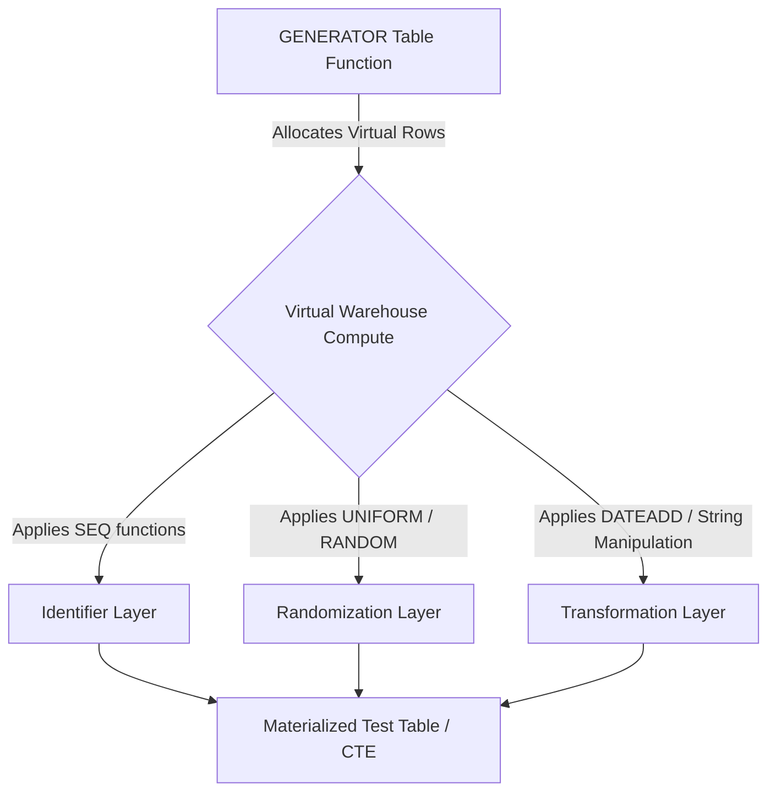

# 1. Synthetic Data Generation

# 2. Overview
Synthetic data generation in Snowflake is the process of natively creating mock, randomized, or sequentially structured datasets directly within the compute engine, without loading external files. 

This capability exists to facilitate scale-testing, performance benchmarking, proof-of-concept development, and the creation of anonymized test environments. By generating data natively, data engineering teams avoid the latency, storage overhead, and security risks associated with extracting and loading production data or massive flat files. For SnowPro Advanced exams, candidates must thoroughly understand the performance characteristics, deterministic limits, and syntax of the `GENERATOR` table function and associated randomization functions.

# 3. SQL Object Summary

| Object / Feature | Type | Purpose | Inputs | Outputs | Execution Mode |
| :--- | :--- | :--- | :--- | :--- | :--- |
| `GENERATOR` | Table Function | Creates a specified number of empty rows to act as a multiplier. | `ROWCOUNT` or `TIMELIMIT` | Virtual rows | Compute runtime |
| `SEQ1` to `SEQ8` | System Function | Generates unique (but not gapless) auto-incrementing integers. | None | Integer | Compute runtime |
| `RANDOM` | System Function | Generates a 64-bit pseudo-random integer. | Optional Seed | Integer | Compute runtime |
| `UNIFORM` | System Function | Generates a random number uniformly distributed within a specified range. | Min, Max, Random Generator | Integer / Float | Compute runtime |
| `NORMAL` / `ZIPF` | System Function | Generates random numbers matching a specific statistical distribution. | Mean/Stdev, Random Generator | Float / Integer | Compute runtime |

# 4. Architecture
Synthetic generation relies entirely on Snowflake's Virtual Warehouse compute layer. It does not scan the storage layer. The engine creates virtual rows in memory and applies scalar functions to project values into those rows before materializing the result.



# 5. Data Flow / Process Flow
1. **Row Allocation:** The `GENERATOR` function instructs the compute engine to instantiate a specific number of rows in memory based on a count or a time limit.
2. **Column Projection:** The `SELECT` statement evaluates sequence, random, or mathematical functions for each generated row.
3. **Type Coercion and Transformation:** Base integers or floats are cast to target data types (e.g., converting a random integer into an offset for a `DATE` column).
4. **Materialization:** The synthetic rows are written to a target table via a `CREATE TABLE AS SELECT` (CTAS) or `INSERT INTO` operation, or returned directly as a query result.

# 6. Logical Breakdown

**Row Generation Layer (`GENERATOR`)**
Responsibility: Bootstraps the query by providing a scalable base table of empty rows.
Inputs: Execution bounds (`ROWCOUNT` or `TIMELIMIT`).
Dependencies: Bounded entirely by Virtual Warehouse memory and cluster size.

**Identifier Generation Layer (`SEQ` functions)**
Responsibility: Creates primary keys or unique identifiers for the synthetic rows.
Mechanics: Uses sequence counters distributed across parallel warehouse threads.
Failure Modes: Cannot guarantee continuous numerical sequences.

**Randomization and Distribution Layer**
Responsibility: Generates realistic variance in the synthetic dataset.
Mechanics: Applies statistical algorithms (`UNIFORM` for flat probability, `NORMAL` for bell-curve, `ZIPF` for power-law/heavy-tail distributions common in web traffic or text frequency).
Outputs: Random integers or floating-point values.

# 7. Data Model
The output data model is entirely user-defined by the `SELECT` projection. 
Grain: One row per cycle of the `GENERATOR` function.

Example schema produced via synthetic generation:
- `transaction_id`: Integer (via `SEQ8()`)
- `transaction_date`: Date (via `DATEADD` and `UNIFORM`)
- `amount`: Float (via `NORMAL` distribution)
- `category_code`: String (via `DECODE` and `UNIFORM`)

# 8. Business Logic (Execution Logic & Exam Focus)
**GENERATOR Parameter Logic:**
- `ROWCOUNT`: Explicitly defines the exact number of rows to generate. Deterministic.
- `TIMELIMIT`: Generates rows continuously until the specified time (in seconds) elapses. Non-deterministic (row count varies by warehouse size and load).
- **Exam Trap:** You cannot use `ROWCOUNT` and `TIMELIMIT` in the same `GENERATOR` call. 

**Sequence Logic (The "Gapless" Trap):**
- Snowflake provides `SEQ1()`, `SEQ2()`, `SEQ4()`, and `SEQ8()` (indicating byte size).
- These functions generate unique integers, making them excellent for primary keys.
- **Exam Trap:** `SEQ` functions are *not gapless*. Because Snowflake processes rows in parallel across independent micro-partitions and compute nodes, sequences will have gaps. If a strict, gapless sequence (1, 2, 3, 4...) is required, `ROW_NUMBER() OVER (ORDER BY NULL)` must be used, which fundamentally changes performance.

# 9. Transformations 
Synthetic data usually requires mapping base integers to business data types:

- **Date Generation:** 
  - Source: `UNIFORM(1, 365, RANDOM())`
  - Transformation: `DATEADD(day, UNIFORM(1, 365, RANDOM()), '2023-01-01'::DATE)`
  - Meaning: Generates random dates within the year 2023.

- **Categorical Data Generation:**
  - Source: `UNIFORM(1, 3, RANDOM())`
  - Transformation: `CASE WHEN val = 1 THEN 'Active' WHEN val = 2 THEN 'Pending' ELSE 'Closed' END`
  - Meaning: Translates a uniform integer distribution into a realistic dimension attribute.

- **UUID Generation:**
  - Source: `UUID_STRING()`
  - Meaning: Generates a cryptographically random v4 UUID for globally unique identifiers.

# 10. Parameters / Configuration
Key parameters used in the `GENERATOR` function:

| Parameter | Type | Allowed Values | Purpose |
| :--- | :--- | :--- | :--- |
| `ROWCOUNT` | Integer | > 0 | Generates exactly this many rows. |
| `TIMELIMIT` | Integer | > 0 | Generates as many rows as possible within this time limit (in seconds). |
| `Seed` | Integer | Any valid integer | An optional argument passed to `RANDOM(seed)` to guarantee the same pseudo-random output across executions for reproducibility. |

# 11. APIs / Interfaces

**SQL GENERATOR Invocation**
- Structure:
  ```sql
  SELECT 
    SEQ8() as id, 
    UNIFORM(1, 100, RANDOM()) as metric
  FROM TABLE(GENERATOR(ROWCOUNT => 1000000));
  ```
- Output: 1,000,000 rows containing an ID and a random metric.

**Snowpark Python Interface (Faker Integration)**
- While SQL is standard, engineering teams often use Snowpark UDTFs combined with the Python `Faker` library to generate realistic PII (names, addresses, emails).
- Invocation: Python UDTF executed over a standard `GENERATOR` SQL call.

# 12. Execution / Deployment
Synthetic data generation is typically executed as a batch script during the CI/CD pipeline of a data warehouse deployment, or as a setup step for performance benchmarking tools.
It is commonly deployed via `CREATE OR REPLACE TABLE ... AS SELECT ...` to instantly materialize a test environment.

# 13. Observability
When viewing a query profile for synthetic generation, the execution plan will prominently feature a **Generator** node. Because there is no underlying table scan, storage metrics (like partitions scanned or bytes read) will be zero. The primary metrics to monitor are:
- Bytes Written (if materialized to a table).
- Execution Time (dependent on `ROWCOUNT` size and warehouse tier).

# 14. Failure Handling & Recovery
**Failure Scenario: Out of Memory / Excessive Spilling**
- Cause: Using `ROW_NUMBER() OVER()` instead of `SEQ8()` to generate IDs for billions of rows. Window functions force single-threaded execution or heavy sorting, causing the warehouse to spill to local or remote storage, severely degrading performance.
- Mitigation: Always default to `SEQ8()` or `UUID_STRING()` for massive synthetic identifiers unless business logic strictly mandates gapless incrementing.

**Failure Scenario: Non-Reproducible Test Data**
- Cause: Using `RANDOM()` without a seed during automated testing where consistent outputs are required.
- Mitigation: Use `RANDOM(1234)` (or any static integer seed) to ensure the generated distributions match on every execution.

# 15. Security & Access Control
Generating synthetic data requires no special privileges beyond `USAGE` on the warehouse and `CREATE TABLE` / `INSERT` privileges in the target schema. Because it creates data from scratch, it mitigates the need to grant developers access to production PII or secure views.

# 16. Performance / Scalability Considerations
- **Parallelism:** The `GENERATOR` function scales linearly with warehouse size. A Medium warehouse will generate 1 billion rows significantly faster than an X-Small because the row allocation and sequence functions are inherently parallelizable.
- **Pushdown and Pruning:** Since the data is generated in memory and written sequentially, the resulting table is naturally clustered by the generated sequences (if using `SEQx()`). Subsequent queries against the synthetic table will benefit heavily from micro-partition pruning on that ID column.

# 17. Assumptions & Constraints
- `GENERATOR` does not guarantee any specific ordering of the output rows.
- `SEQ` functions cannot guarantee gapless sequences.
- `TIMELIMIT` is highly dependent on warehouse contention; running the same query twice with `TIMELIMIT => 10` may produce vastly different row counts.
- `ROWCOUNT` cannot exceed the system limits for numerical bounds (though practical limits are bounded by time and warehouse credits, not maximum integer sizes).

# 18. Future Enhancements
- Encapsulate repetitive generation logic (e.g., date-dimension generation) into reusable SQL macros or User-Defined Table Functions (UDTFs).
- Leverage Snowflake's Cortex ML functions to generate context-aware synthetic text (e.g., generating mock customer reviews based on specific sentiment prompts) directly in the SQL pipeline.
