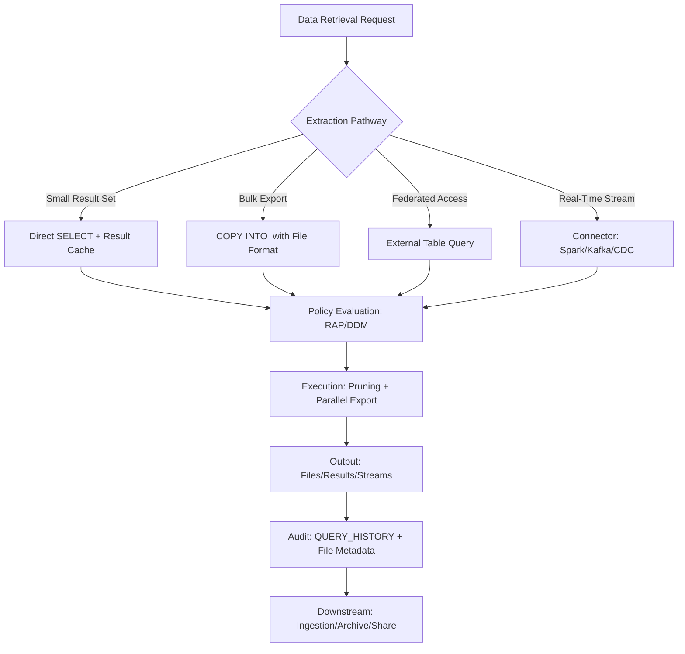

# 1. Title
Retrieving Data for Ingestion Preparation in Snowflake: Extraction, Staging, and Export Patterns

# 2. Overview
This pattern defines the procedural architecture for extracting, staging, and exporting data from Snowflake as a preparatory step for downstream ingestion workflows. It exists to enable reliable data retrieval for ETL/ELT pipelines, data sharing, archival, or migration scenarios while maintaining governance, optimizing transfer performance, and minimizing compute costs. The pattern operates at the data extraction layer, bridging curated Snowflake objects with external consumption systems. It is consumed by data engineers building ingestion pipelines, platform architects designing data movement strategies, compliance teams auditing data exports, and SnowPro Advanced candidates evaluating extraction mechanics, result caching behavior, and security boundary enforcement during data retrieval.

# 3. SQL Object Summary
| Object/Pattern | Type | Purpose | Source Objects/Inputs | Output Objects/Behavior | Execution Mode |
|----------------|------|---------|------------------------|--------------------------|----------------|
| [Data Retrieval Pipeline](SQL Object Summary/Data Retrieval Pipeline.md) | Extraction Pattern / Query Orchestration | Extract, transform, and export Snowflake data to internal/external stages or downstream systems | Curated tables/views, query filters, file format specs, stage configurations | Files in internal/external stages, result sets, or streamed outputs with metadata | Synchronous query execution; asynchronous bulk export via `COPY INTO <location>` |

# 4. Architecture
Data retrieval in Snowflake operates through multiple extraction pathways: direct `SELECT` for small result sets, `COPY INTO <location>` for bulk exports to stages, external table queries for federated access, and connector-based streaming for real-time extraction. All pathways enforce Row Access Policies and Dynamic Data Masking at query time, leverage result caching for repeated extractions, and support parallel export for large volumes. The architecture implements a validation layer to ensure extraction queries are deterministic, sargable, and governance-compliant before execution.

# 5. Data Flow / Process Flow
1. **Extraction Specification & Validation**
   - Input: Source object, filter predicates, output format, destination stage
   - Transformation: Validate query determinism, sargability, policy compatibility, and file format support
   - Output: Approved extraction plan with execution parameters
   - Purpose: Prevent runtime failures, governance violations, or performance issues during data retrieval

2. **Query Compilation & Policy Evaluation**
   - Input: Validated extraction query, session role, warehouse assignment
   - Transformation: Append Row Access Policy predicates, wrap Dynamic Data Masking expressions, optimize with pruning
   - Output: Secured, optimized query plan ready for execution
   - Purpose: Enforce security boundaries and performance optimization before data movement

3. **Parallel Execution & Result Materialization**
   - Input: Optimized query plan, warehouse resources, file format configuration
   - Transformation: Execute query with parallel scan; format results per specification (CSV, JSON, Parquet, etc.)
   - Output: Files in internal stage, external stage, or streamed result set
   - Purpose: Efficiently materialize extracted data with minimal latency and compute cost

4. **Metadata Enrichment & Audit Logging**
   - Input: Exported files, execution telemetry, user context
   - Transformation: Append file metadata (row count, size, checksum), log to `ACCOUNT_USAGE`
   - Output: Audit-ready extraction record with lineage and quality metrics
   - Purpose: Enable compliance reporting, reconciliation, and incident investigation

5. **Downstream Handoff & Cleanup**
   - Input: Exported files, destination system configuration, retention policy
   - Transformation: Trigger downstream ingestion, archive, or sharing workflow; clean up temporary stages
   - Output: Data delivered to target system with confirmation
   - Purpose: Complete the retrieval-to-ingestion handoff with traceability

# 6. Logical Breakdown
| Component | Responsibility | Inputs | Outputs | Dependencies | Failure Modes / Risks |
|-----------|----------------|--------|---------|--------------|------------------------|
| [`extraction_validator`](Logical Breakdown/extraction_validator.md) | Validate extraction query for governance and performance | Query text, source schema, policy definitions, file format specs | Approved extraction plan or rejection with remediation | Policy attachment status; clustering metadata; format compatibility | Non-deterministic queries bypass cache; non-sargable predicates cause full scans |
| [`policy_enforcer`](Logical Breakdown/policy_enforcer.md) | Apply Row Access Policies and Dynamic Data Masking at extraction time | Session role, RAP/DDM definitions, query plan | Secured query with policy predicates and masking expressions | Policy attachment to source objects; role privilege resolution | Missing policies expose unauthorized data; masking breaks downstream schema expectations |
| [`parallel_exporter`](Logical Breakdown/parallel_exporter.md) | Execute bulk export with parallel file generation | Optimized query, warehouse, file format, stage config | Files in stage with metadata (row count, size, checksum) | Warehouse sizing; stage accessibility; network bandwidth | Undersized warehouse causes spill; network throttling slows export; stage permission errors block write |
| [`result_cache_manager`](Logical Breakdown/result_cache_manager.md) | Reuse cached results for repeated extraction requests | Query hash, session context, cache TTL | Cached result set or cache miss triggering re-execution | Result cache enabled; query determinism; role context consistency | Non-deterministic functions bypass cache; role context mismatch causes cache fragmentation |
| [`audit_logger`](Logical Breakdown/audit_logger.md) | Record extraction activity for compliance and reconciliation | Execution telemetry, file metadata, user context | Audit entry in `ACCOUNT_USAGE.QUERY_HISTORY` + custom log table | Logging configuration; privilege to write audit tables | Missing audit entries break compliance; incomplete metadata hinders reconciliation |

# 7. Data Model (State Model)
| Object | Role | Important Fields | Grain | Relationships | Null Handling |
|--------|------|------------------|-------|---------------|---------------|
| [`extraction_specification`](Data Model (State Model)/extraction_specification.md) | Pre-execution extraction plan | `spec_id`, `source_object`, `filter_predicate`, `output_format`, `destination_stage`, `determinism_flag` | Per extraction request | References source tables; linked to file format definitions | `filter_predicate` is `NULL` for full-table exports; `determinism_flag` defaults to `FALSE` |
| [`exported_file_metadata`](Data Model (State Model)/exported_file_metadata.md) | Runtime export telemetry | `file_id`, `extraction_id`, `file_path`, `row_count`, `size_bytes`, `checksum`, `exported_at` | Per exported file | Links to `extraction_specification`; used for downstream reconciliation | `checksum` is `NULL` if not computed; `size_bytes` always populated |
| [`extraction_audit_record`](Data Model (State Model)/extraction_audit_record.md) | Compliance and lineage tracking | `audit_id`, `user_role`, `query_hash`, `bytes_scanned`, `partitions_scanned`, `policy_evaluated`, `executed_at` | Per extraction execution | Links to `ACCOUNT_USAGE.QUERY_HISTORY`; enriched with extraction context | `policy_evaluated` is `FALSE` if no RAP/DDM attached; `partitions_scanned` is `NULL` for non-table queries |

Output Grain: One specification per extraction request. One metadata record per exported file. One audit record per extraction execution.

# 8. Business Logic (Execution Logic)
- **Determinism Requirements**: Extraction queries intended for caching or incremental sync must avoid non-deterministic functions (`RANDOM()`, `CURRENT_TIMESTAMP()`, `UUID_STRING()`) unless parameterized. Non-deterministic queries bypass result cache and may produce inconsistent exports.
- **Sargable Predicate Patterns**: Use `col = value`, `col IN (...)`, `col BETWEEN a AND b`, `col >= value` for pruning eligibility. Avoid function-wrapped columns (`DATE_TRUNC('day', ts) = ...`) or implicit casts that bypass micro-partition elimination.
- **File Format Compatibility**: Snowflake supports CSV, JSON, Avro, ORC, Parquet, and XML for export. Parquet and Avro preserve schema and data types; CSV requires explicit column ordering and type handling. Compression (GZIP, SNAPPY, ZSTD) reduces transfer size but adds CPU overhead.
- **Parallel Export Behavior**: `COPY INTO <location>` automatically parallelizes across warehouse nodes. File count scales with warehouse size and data volume; configure `MAX_FILE_SIZE` and `SPLIT_SIZE` to control output granularity.
- **Policy Evaluation Order**: Row Access Policies append via `AND` to extraction filters; they cannot be bypassed by query logic. Dynamic Data Masking evaluates after filtering; masked values preserve data type for downstream compatibility.
- **Result Caching Semantics**: Cache is keyed by query text + session context (role, warehouse, database). TTL defaults to 24h. Identical extraction queries from different roles receive separate cache entries.
- **Exam-Relevant Defaults**: `COPY INTO <location>` requires `WRITE` privilege on stage and `SELECT` on source. Result cache TTL is 24h unless overridden by `RESULT_CACHE_ACTIVE`. `CURRENT_ROLE()` returns primary role only; secondary roles require explicit `USE ROLE`. `COPY` does not enforce foreign keys or constraints; data integrity is caller responsibility.

# 9. Transformations (State Transitions)
| Source State | Derived State | Rule / Evaluation Logic | Meaning | Impact |
|--------------|---------------|-------------------------|---------|--------|
| [`raw_table_data`](Transformations (State Transitions)/raw_table_data.md) | `filtered_export_subset` | `SELECT ... WHERE date >= '2024-01-01'` with sargable predicate | Extract only relevant rows for downstream ingestion | Reduces transfer volume and compute cost; enables incremental sync |
| [`structured_query_result`](Transformations (State Transitions)/structured_query_result.md) | `formatted_file_output` | `COPY INTO @stage FORMAT = (TYPE = 'PARQUET', COMPRESSION = 'SNAPPY')` | Convert row set to columnar file format with compression | Preserves schema; reduces storage/transfer cost; accelerates downstream load |
| [`cached_result_entry` + `identical_query`](Transformations (State Transitions)/cached_result_entry + identical_query.md) | `reused_result_set` | Match query hash + session context; return cached bytes | Avoid redundant compute for repeated extraction requests | Cuts warehouse credits by 50–90% for cached queries; requires determinism |
| [`exported_files` + `audit_metadata`](Transformations (State Transitions)/exported_files + audit_metadata.md) | `compliance_record` | Log file checksums, row counts, policy evaluation status | Enable reconciliation and audit trail for data movement | Supports governance, incident investigation, and SLA reporting |
| [`stage_files` + `downstream_config`](Transformations (State Transitions)/stage_files + downstream_config.md) | `ingestion_trigger` | Notify target system of available files; provide access credentials | Complete handoff from Snowflake retrieval to external ingestion | Enables end-to-end pipeline automation with traceability |

# 10. Parameters / Variables / Configuration
| Name | Type | Purpose | Allowed Values | Default | Where Used | Effect |
|------|------|---------|----------------|---------|------------|--------|
| [`FILE_FORMAT`](Parameters  Variables  Configuration/FILE_FORMAT.md) | Copy Option | Define output file structure and encoding | `TYPE = CSV|JSON|PARQUET|AVRO|ORC|XML`, compression, field delimiters | `TYPE = CSV` | `COPY INTO <location>` | Determines downstream compatibility; Parquet/Avro preserve schema |
| [`MAX_FILE_SIZE`](Parameters  Variables  Configuration/MAX_FILE_SIZE.md) | Copy Option | Control maximum size per exported file | Integer bytes (e.g., `1073741824` for 1GB) | `16777216` (16MB) | `COPY INTO <location>` | Larger files reduce metadata overhead; smaller files enable parallel downstream load |
| [`SPLIT_SIZE`](Parameters  Variables  Configuration/SPLIT_SIZE.md) | Copy Option | Set row count threshold for file splitting | Integer rows | `16777216` (16M rows) | `COPY INTO <location>` | Controls output granularity; affects downstream partitioning strategy |
| [`RESULT_CACHE_ACTIVE`](Parameters  Variables  Configuration/RESULT_CACHE_ACTIVE.md) | Session Parameter | Enable/disable result caching for extraction queries | `TRUE`, `FALSE` | `TRUE` | Query execution | `FALSE` forces re-execution; ensures freshness but increases credits |
| [`STATEMENT_TIMEOUT_IN_SECONDS`](Parameters  Variables  Configuration/STATEMENT_TIMEOUT_IN_SECONDS.md) | Session Parameter | Limit extraction query duration | 0 (unlimited) to 172800 (48h) | 172800 | Query execution | Prevents runaway exports from consuming excessive credits |
| [`ENCRYPTION`](Parameters  Variables  Configuration/ENCRYPTION.md) | Stage Option | Encrypt exported files at rest | `AES_256_GCM`, `NONE` | `AES_256_GCM` for external stages | Stage definition | Protects sensitive data during transfer and storage; adds minimal CPU overhead |
| [`COPY_OPTIONS`](Parameters  Variables  Configuration/COPY_OPTIONS.md) | Copy Parameter | Control export behavior: overwrite, single file, header row | `OVERWRITE = TRUE`, `SINGLE = TRUE`, `HEADER = TRUE` | `OVERWRITE = FALSE`, `SINGLE = FALSE`, `HEADER = FALSE` | `COPY INTO <location>` | `SINGLE = TRUE` forces serial export; `HEADER = TRUE` adds CSV column names |

# 11. APIs / Interfaces
| Interface | Invocation Method | Input Structure | Output Structure | Error Behavior | Consumers |
|-----------|-------------------|-----------------|------------------|----------------|-----------|
| [`COPY INTO <location>`](APIs  Interfaces/COPY INTO location.md) | SQL Statement | Source query, stage path, file format, copy options | Export confirmation + file metadata | Fails on permission errors, format mismatch, or network issues | Data engineers, pipeline operators |
| [`SELECT ... INTO RESULT`](APIs  Interfaces/SELECT ... INTO RESULT.md) | SQL Query | Extraction query, session context | Result set (small volumes) | Fails on privilege errors or result size limits | Analysts, ad-hoc extraction |
| [External Stage Integration](APIs  Interfaces/External Stage Integration.md) | Cloud Provider API | Stage URL, credentials, encryption config | Accessible stage path | Fails on auth errors, network policy blocks, or quota exceeded | Platform architects configuring cross-cloud export |
| [`SYSTEM$RESULT_CACHE_INFO`](APIs  Interfaces/SYSTEM$RESULT_CACHE_INFO.md) | SQL Function | Query hash or text | Cache status, TTL remaining, size bytes | Returns `NULL` if caching disabled or query not cached | Performance analysts validating cache hits |
| [`ACCOUNT_USAGE.QUERY_HISTORY`](APIs  Interfaces/ACCOUNT_USAGE.QUERY_HISTORY.md) | System View | Filter on `QUERY_TEXT`, `WAREHOUSE_NAME` | Query telemetry with extraction metrics | Requires `ACCOUNTADMIN` or `VIEW SERVER STATE` | Auditors tracking data export activity |
| [Snowflake Connector APIs](APIs  Interfaces/Snowflake Connector APIs.md) | Python/Java/Spark | Connection config, query, batch size | Streamed result set or DataFrame | Returns connector-specific errors; retries on transient failures | Data engineers building custom ingestion pipelines |

# 12. Execution / Deployment
- Small extractions (<10K rows) execute synchronously via `SELECT`; large exports use `COPY INTO <location>` with asynchronous file generation.
- Parallel export scales with warehouse size; multi-cluster warehouses enable concurrent extraction jobs without queueing.
- Upstream dependency: Source objects must be accessible to executing role; stage must have `WRITE` privilege and network accessibility.
- Environment behavior: Dev/test may export to internal stages; production mandates external stages with encryption and audit logging.
- Runtime assumption: Extraction queries are optimized for pruning; non-sargable predicates cause full scans regardless of warehouse size.

# 13. Observability
- Track export volume: Monitor `ACCOUNT_USAGE.QUERY_HISTORY` filtered on `COPY` operations to measure `BYTES_SCANNED` vs `BYTES_WRITTEN` efficiency.
- Validate pruning effectiveness: Compare `PARTITIONS_SCANNED` vs `TOTAL_PARTITIONS` for extraction queries; alert on ratios >0.5 for selective filters.
- Monitor cache efficiency: Query `SYSTEM$RESULT_CACHE_INFO` for repeated extraction patterns; low hit rates indicate non-deterministic logic.
- Audit policy compliance: Log `policy_evaluated` flag in custom audit table to confirm RAP/DDM enforcement during exports.
- Implement reconciliation: Compare source row counts with exported file metadata; flag mismatches indicating partial exports or truncation.

# 14. Failure Handling & Recovery
- **Stage permission error blocks export**: `COPY INTO` fails with "insufficient privileges" on stage write. Detection: Query execution error code `100096`. Recovery: Grant `WRITE` on stage to executing role; validate with `SHOW GRANTS ON STAGE`.
- **Non-sargable predicate causes full scan**: Filter on `DATE_TRUNC('day', ts) = ...` bypasses pruning. Detection: High `PARTITIONS_SCANNED` in `QUERY_HISTORY`. Recovery: Rewrite to sargable form (`ts >= ... AND ts < ...`); add derived clustered column.
- **Result cache miss due to non-deterministic query**: Repeated extraction re-executes instead of using cache. Detection: `cache_hit = FALSE` despite identical query text. Recovery: Remove `RANDOM()`, `CURRENT_TIMESTAMP()`, or session variables; ensure `RESULT_CACHE_ACTIVE = TRUE`.
- **File format mismatch breaks downstream ingestion**: Exported Parquet schema differs from consumer expectation. Detection: Downstream load fails with schema error. Recovery: Validate file format spec before export; use `DESCRIBE FILE FORMAT` to confirm settings.
- **Network throttling slows external stage export**: Large export to S3/GCS/Azure times out. Detection: `COPY` progress stalls; network metrics show throttling. Recovery: Increase `MAX_FILE_SIZE` to reduce file count; enable compression; use VPC endpoint for private transfer.

# 15. Security & Access Control
- Extraction queries inherit standard RBAC: executing role must have `SELECT` on source objects and `WRITE` on target stage.
- Row Access Policies and Dynamic Data Masking evaluate at extraction time; exported data reflects role-based restrictions.
- External stages require cloud credentials stored in Snowflake integration objects; never embed secrets in query text.
- Encrypted exports (`ENCRYPTION = 'AES_256_GCM'`) protect data at rest; decryption keys managed by cloud provider or Snowflake.
- Audit extraction activity via `ACCOUNT_USAGE.QUERY_HISTORY` and custom logging; retain for compliance and incident investigation.

# 16. Performance / Scalability Considerations
- Pruning eligibility dominates extraction performance: sargable predicates on `CLUSTER BY` columns reduce scanned data by 90%+; non-sargable patterns cause full scans.
- Warehouse sizing scales parallel export: larger warehouses generate more files concurrently but consume more credits; right-size based on SLA.
- File format choice impacts downstream load: Parquet/Avro preserve schema and enable predicate pushdown in consumers; CSV requires post-load type casting.
- Compression reduces transfer size but adds CPU overhead: GZIP offers best ratio; SNAPPY balances speed and size; ZSTD for archival.
- Result cache reduces redundant extraction: identical queries from same role reuse cached bytes; cache fragmentation occurs across roles.
- Exam trap: `COPY INTO <location>` does not support `ORDER BY`; output file row order is non-deterministic. Result cache requires identical query text + session context; different roles do not share cache. `CURRENT_ROLE()` returns primary role only; secondary roles require explicit `USE ROLE`.

# 17. Assumptions & Constraints
- Assumes source tables have clustering keys defined for pruning assessment; unclustered tables cannot leverage partition elimination regardless of filter design.
- Assumes extraction queries are deterministic if caching is required; non-deterministic functions bypass cache and may produce inconsistent exports.
- Assumes stage permissions are pre-configured; `COPY INTO` fails immediately if `WRITE` privilege is missing.
- Assumes downstream systems can consume exported file formats; schema mismatches cause ingestion failures post-export.
- Assumes network path to external stage is stable; intermittent connectivity causes export retries or partial files.
- Exam trap: `COPY INTO <location>` output order is non-deterministic; use `ORDER BY` in source query if order matters (but order not preserved in files). `RESULT_CACHE_ACTIVE` defaults to `TRUE`; disabling forces re-execution. `ENCRYPTION` defaults to `AES_256_GCM` for external stages; internal stages use Snowflake-managed encryption.

# 18. Future Enhancements
- Implement extraction query optimization recommendations: Analyze `QUERY_HISTORY` to suggest sargable predicate rewrites or clustering adjustments for frequent exports.
- Add automated file format validation: Pre-export check that exported schema matches downstream consumer expectations; block mismatched exports.
- Develop incremental extraction patterns: Leverage `STREAM` objects or watermark columns to export only changed data since last run, reducing volume and cost.
- Integrate extraction auditing into governance dashboards: Visualize export volume, policy compliance, and cache efficiency by team or business unit for chargeback.
- Enable cross-account extraction with Data Sharing: Allow authorized accounts to query shared data directly without export, reducing duplication and latency.
- Add predictive export cost modeling: Estimate `BYTES_SCANNED`, warehouse credits, and transfer costs for candidate extraction queries before execution to guide optimization.
