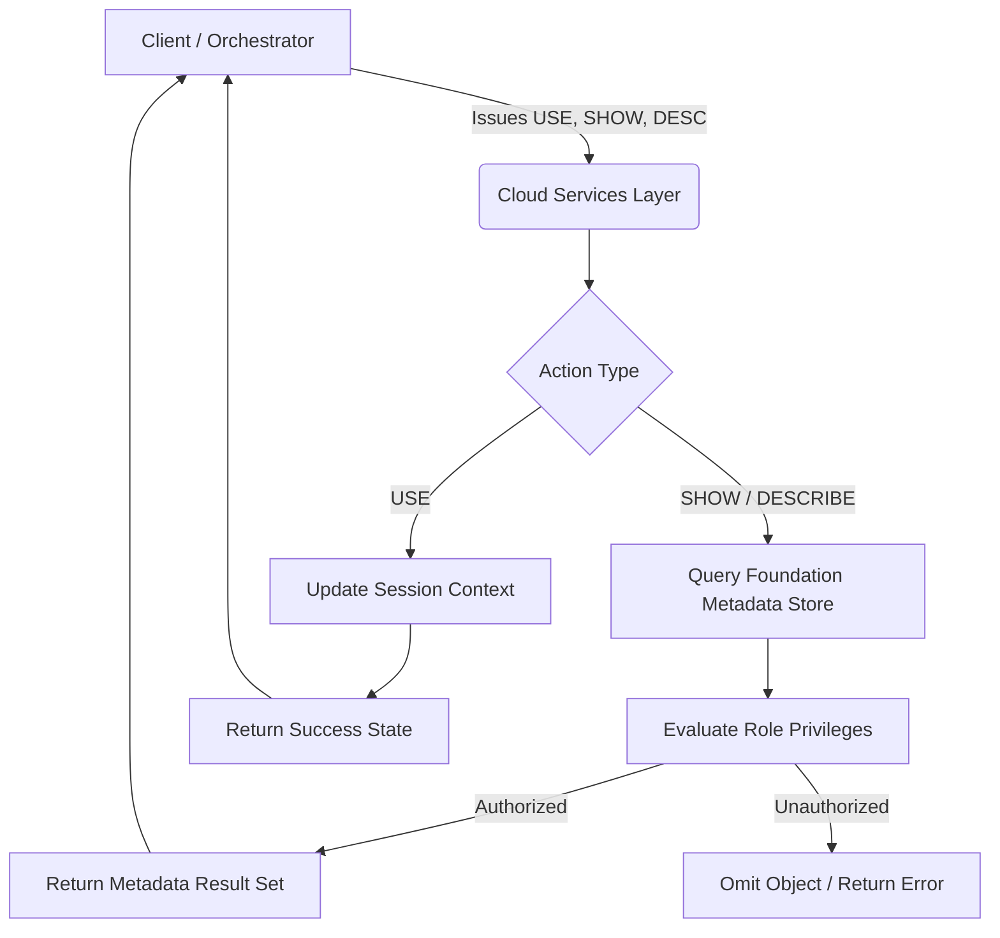

# 1. Snowflake Metadata and Context Commands (DESCRIBE, SHOW, USE)

# 2. Overview
During the data ingestion and discovery phase, `DESCRIBE`, `SHOW`, and `USE` commands are utilized to inspect object architecture, validate schema definitions, and configure the execution environment. 

These commands operate almost entirely within the Snowflake Cloud Services Layer (CSL) using cached metadata. They do not typically require a running Virtual Warehouse, making them highly efficient for pipeline orchestration, dynamic schema discovery, and environment routing prior to executing heavy DML or data loading operations.

For SnowPro Advanced candidates, understanding the execution boundaries, privilege constraints, and programmatic integration of these commands is critical for designing dynamic, cost-effective ingestion pipelines.

# 3. Command Pattern Summary

| Command | Type | Purpose | Execution Layer | Observable Output |
| :--- | :--- | :--- | :--- | :--- |
| `USE <object>` | Context Setter | Modifies the active session namespace or compute context. | Cloud Services | Success message; updated session state. |
| `SHOW <objects>` | Metadata List | Retrieves a list of objects and their high-level metadata (rows, size, owner). | Cloud Services | Tabular result set (1 row per object). |
| `DESCRIBE <object>` | Schema Inspection | Retrieves the structural definition, data types, and defaults of a specific object. | Cloud Services | Tabular result set (1 row per column/property). |

# 4. Architecture
The following flowchart illustrates how metadata and context commands bypass the Virtual Warehouse and interact directly with the Cloud Services Layer.

# 5. Process Flow
A standard dynamic data discovery sequence utilizes these commands in a specific order:

1.  **Context Initialization:** The pipeline issues `USE ROLE <role>` and `USE WAREHOUSE <wh>` to establish permissions and compute resources for downstream tasks.
2.  **Namespace Targeting:** The pipeline issues `USE DATABASE <db>` and `USE SCHEMA <schema>` to set the default path, avoiding the need for fully qualified object names in subsequent queries.
3.  **Object Discovery:** The pipeline executes `SHOW TABLES LIKE 'STG_%'` to dynamically discover all staging tables awaiting processing.
4.  **Schema Validation:** For a specific table, the pipeline executes `DESCRIBE TABLE <table_name>` to extract column names, data types, and nullability constraints.
5.  **Result Extraction:** The pipeline uses `RESULT_SCAN(LAST_QUERY_ID())` to treat the output of the `SHOW` or `DESCRIBE` command as a standard relational table, allowing programmatic filtering or mapping.

# 6. Logical Breakdown

### Component 1: Context Alteration (`USE`)
*   **Responsibility:** Modifies the session environment for the duration of the connection.
*   **Mechanics:** Overrides the default configuration established during the initial driver/connection handshake.
*   **Scope:** Applies only to the current session. Does not affect other concurrent connections by the same user.
*   **Exam Relevance:** Executing `USE WAREHOUSE <wh_name>` does not resume a suspended warehouse. It only sets the warehouse as the active compute resource for the next query that requires compute.

### Component 2: Object Enumeration (`SHOW`)
*   **Responsibility:** Returns a list of objects matching a specified type and optional pattern.
*   **Mechanics:** Supports `LIKE '<pattern>'` for wildcard matching, `STARTS WITH '<string>'` for prefix matching, and `IN <scope>` to restrict the search boundary (e.g., `IN SCHEMA <schema_name>`).
*   **Dependencies:** Strongly dependent on Role-Based Access Control (RBAC). 
*   **Failure Modes:** `SHOW` commands do not fail if an object exists but the user lacks privileges; instead, Snowflake silently omits the unauthorized objects from the result set.

### Component 3: Structural Inspection (`DESCRIBE` / `DESC`)
*   **Responsibility:** Extracts the DDL-level definition of a single entity.
*   **Mechanics:** When applied to tables or views, returns columns, data types, null constraints, default values, and primary key declarations. When applied to Stages or Pipes, returns configuration parameters.
*   **Failure Modes:** Fails with an "Object does not exist" error if the object is missing or if the active role lacks sufficient privileges (typically `OWNERSHIP`, `USAGE`, or `MONITOR`).

# 8. Business Logic (Execution Logic)
*   **Dynamic Pipeline Generation:** Engineers use `SHOW` and `DESCRIBE` in combination with Snowflake Scripting (Stored Procedures) to read a source table's schema, map it to a target schema, and dynamically generate a `MERGE` or `COPY INTO` statement without hardcoding column names.
*   **Context Precedence:** A fully qualified object name (e.g., `SELECT * FROM db.schema.table`) completely ignores the active database and schema set by `USE DATABASE` or `USE SCHEMA`, but it still strictly relies on the active `USE ROLE` for privilege evaluation.

# 9. Transformations (State Transitions)
*   **Session State Transition:** Executing a `USE` command creates an immediate state change in the connection parameters. Any relative object references (e.g., `SELECT * FROM my_table`) will now resolve against the newly defined database/schema namespace.

# 10. Parameters / Variables / Configuration
*   **`LIMIT <n>` in SHOW commands:** Exam-relevant constraint. Most `SHOW` commands cap output at 10,000 rows by default unless explicitly overridden with a higher `LIMIT`.
*   **`IN` Scope modifier:** Determines the search boundary for `SHOW`. Valid scopes include `ACCOUNT`, `DATABASE`, `SCHEMA`. If omitted, the default scope varies by object type but typically defaults to the current active schema.

# 11. APIs / Interfaces
*   **`RESULT_SCAN()` Integration:** `SHOW` and `DESCRIBE` outputs cannot be directly inserted into a table or used in a `JOIN`. To process their output using SQL, the command must be executed, followed immediately by:
    `SELECT * FROM TABLE(RESULT_SCAN(LAST_QUERY_ID()));`
    This converts the CSL output into a queryable result set.

# 14. Failure Handling & Recovery
*   **Privilege Masking:** 
    *   *Scenario:* A pipeline runs `SHOW TABLES` and receives 0 rows, but the tables exist.
    *   *Cause:* The session's active role (set via `USE ROLE`) lacks `USAGE` on the parent database/schema or `SELECT`/`OWNERSHIP` on the tables.
    *   *Recovery:* Inject `USE ROLE <appropriate_role>` prior to the `SHOW` command.
*   **Invalid Context Errors:**
    *   *Scenario:* `DESCRIBE TABLE my_table` fails with "Object does not exist".
    *   *Cause:* The session lacks an active schema context, or the table exists in a different namespace.
    *   *Recovery:* Fully qualify the table name in the command (`DESCRIBE TABLE db.schema.my_table`) or execute `USE SCHEMA <schema>` beforehand.

# 15. Security & Access Control
*   **Principle of Least Privilege Visibility:** `SHOW` is safe to run by any user, as the Snowflake engine filters the output at the CSL level based on the user's active role grants. No sensitive data is exposed, and unauthorized schema structures remain hidden.
*   **External Stage Credentials:** Executing `DESCRIBE STAGE` on an external stage will reveal the stage properties but will intentionally mask AWS Secret Keys, Azure SAS tokens, or GCP credentials, returning asterisks or empty fields for security.

# 16. Performance / Scalability Considerations
*   **Cloud Services Quota (10% Rule):** `SHOW`, `DESCRIBE`, and `USE` do not consume Virtual Warehouse compute credits. However, they do consume Cloud Services compute. If a heavy orchestration tool submits hundreds of thousands of `SHOW` commands a day, resulting in Cloud Services compute exceeding 10% of total daily Virtual Warehouse compute, the account will be billed for the overage.
*   **`SHOW` vs. `INFORMATION_SCHEMA`:** `SHOW` commands are generally faster and more strictly bound to the CSL cache. Querying `INFORMATION_SCHEMA` views provides more standard SQL filtering capabilities but can occasionally trigger Virtual Warehouse compute if complex joins or string manipulations are applied to the views.

# 17. Assumptions & Constraints
*   **Non-standard Output Columns:** The column names returned by `SHOW` and `DESCRIBE` can change between Snowflake versions or object types. Hardcoding pipeline logic to specific column indexes (e.g., `SELECT $2 FROM TABLE(RESULT_SCAN...)`) is fragile. Reference output columns by name.
*   **Variant Opacity:** `DESCRIBE TABLE` identifies a column as `VARIANT`, `ARRAY`, or `OBJECT`. It does not and cannot describe the semi-structured schema *inside* the variant payload. Schema-on-read must be evaluated via querying the data itself, not via `DESCRIBE`.
*   **Quotation Requirements:** If an object was created with a case-sensitive, quoted identifier (e.g., `"My Table"`), the `DESCRIBE` command must use exact casing and quotes: `DESCRIBE TABLE "My Table"`. Failing to do so forces Snowflake to upper-case the search, resulting in an object-not-found error.
