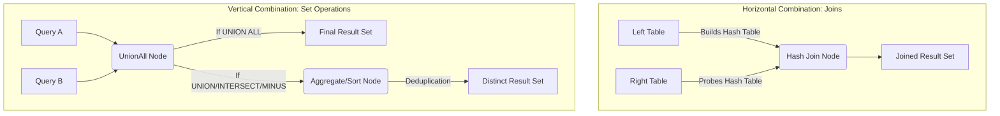

# 1. Table Joins and Set Operations

# 2. Overview
Table joins and set operations form the core transformation mechanics for combining datasets within Snowflake. 
- **Joins** combine datasets horizontally by appending columns from one table to another based on relational keys.
- **Set Operations** combine datasets vertically by appending rows from one query result to another based on ordinal column alignment.

These operations are evaluated by the Cloud Services optimizer and executed by Virtual Warehouses. Understanding their mechanics, performance tradeoffs, and query profile behavior is critical for data engineers optimizing ELT pipelines and for SnowPro Advanced candidates, as the exam heavily tests join cardinality risks, deduplication overhead, and null handling.

# 3. SQL Object Summary

| Operation Type | Command | Purpose | Row Output Behavior | Query Profile Node |
| :--- | :--- | :--- | :--- | :--- |
| **Join** | `INNER`, `LEFT/RIGHT/FULL OUTER` | Matches rows based on key predicates. | Multiplies, preserves, or drops rows based on match cardinality. | `Hash Join` (Typically) |
| **Join** | `CROSS JOIN` | Produces a Cartesian product of both tables. | Rows A × Rows B. | `Cartesian Join` / `Nested Loop` |
| **Join** | `ASOF JOIN` | Matches time-series data to the closest prior or exact timestamp. | Single nearest match per row. | `ASOF Join` |
| **Set** | `UNION ALL` | Appends rows from Query B to Query A. | Rows A + Rows B. | `UnionAll` |
| **Set** | `UNION` | Appends rows and removes all duplicates. | (Rows A + Rows B) - Duplicates. | `UnionAll` followed by `Aggregate` |
| **Set** | `INTERSECT` | Returns only distinct rows present in both queries. | Overlapping distinct rows. | `Aggregate` |
| **Set** | `MINUS` / `EXCEPT` | Returns distinct rows from Query A absent in Query B. | Distinct Rows A - Overlap. | `Aggregate` |

# 4. Architecture
Snowflake executes these operations using distinct physical algorithms within the Virtual Warehouse memory. Joins typically use Hash algorithms (Build/Probe), while deduplicating set operations use Hash Aggregation.

# 5. Data Flow / Process Flow
1. **Compilation Phase:** The Cloud Services optimizer analyzes the query, checks table statistics, and determines the most efficient execution plan (e.g., determining which table should be the "Build" side of a Hash Join based on row count and micro-partition metadata).
2. **Scan Phase:** Compute nodes scan the required micro-partitions. Partition pruning is applied based on filters and join predicates.
3. **Execution Phase (Joins):** 
   - The smaller table is typically hashed into memory (Build phase).
   - The larger table streams through to find matches (Probe phase).
4. **Execution Phase (Sets):**
   - Result sets from the distinct queries are concatenated.
   - If deduplication is required (`UNION`, `INTERSECT`, `MINUS`), a massive sorting or hashing operation groups identical rows and drops duplicates.
5. **Projection:** Output columns are materialized and returned or passed to the next CTE/subquery.

# 6. Logical Breakdown

**Standard Join Layer**
Responsibility: Align records based on exact equality (`=`) or inequality predicates.
Dependencies: Requires specific join keys. Without keys, it degrades to a `CROSS JOIN`.
Failure Modes: Many-to-many relationships cause join explosions (cardinality multiplication).

**ASOF Join Layer (Time-Series)**
Responsibility: Joins records from two tables based on proximity (e.g., the closest preceding timestamp) rather than exact equality.
Inputs: A standard equality condition (e.g., `stock_symbol`) and an inequality match condition (e.g., `trade_time >= quote_time`).
Outputs: A 1-to-1 or 1-to-0 match. Avoids the Cartesian risk of standard inequality joins.

**Set Operation Layer**
Responsibility: Vertically stack result sets.
Inputs: Two or more `SELECT` statements.
Dependencies: The queries must have the exact same number of columns. Corresponding columns must have compatible data types (implicit coercion is applied if possible, otherwise it fails).

# 7. Data Model (Grain Impact)
Transformations via joins and sets fundamentally alter the grain of the output state:
- **Inner/Outer Joins:** The output grain is determined by the cardinality of the relationship. A 1-to-Many join lowers the grain to the "Many" table's level.
- **Cross Join:** Grain becomes the Cartesian product (Rows A * Rows B).
- **UNION ALL:** Grain remains at the row level of the inputs, simply increasing the volume.
- **UNION / INTERSECT / MINUS:** Grain strictly shifts to the *distinct* row level. All exact duplicates across the entire row projection are collapsed into a single state.

# 8. Execution Logic (Exam Focus)

**The `UNION` vs `UNION ALL` Trap:**
- `UNION ALL` strictly appends data. It is computationally cheap.
- `UNION` implicitly applies a `DISTINCT` operator over the entire result set. This forces Snowflake to shuffle data across compute nodes and evaluate every column for equality. Replacing `UNION ALL` with `UNION` unnecessarily is a primary cause of performance degradation.

**The Null Equality Trap:**
- In standard SQL, `NULL = NULL` evaluates to `NULL` (False). A standard `INNER JOIN` on a null key will drop the rows.
- If nulls must be matched as equivalent, use the `EQUAL_NULL(col1, col2)` function or the `IS NOT DISTINCT FROM` operator in the `ON` clause.

**MINUS vs EXCEPT:**
- Snowflake supports both `MINUS` and `EXCEPT`. They are perfectly synonymous and behave identically. They return rows from the first query that do not exist in the second query, returning only distinct records.

# 9. Transformations 
- **Type Coercion in Sets:** If Query A projects a `VARCHAR` and Query B projects a `NUMBER` in the same ordinal position, Snowflake will attempt to coerce the types. If the string cannot be cast to a number, the query aborts.
- **Column Naming:** In set operations, the column names of the final result set are strictly inherited from the *first* query (Query A). Aliases in Query B are ignored by the final projection.

# 10. Parameters / Configuration
While syntax-driven, certain constraints apply:
- **No Direct Parameters:** Joins and sets do not rely on session parameters, but their memory limits are dictated by the Virtual Warehouse size.

# 11. APIs / Interfaces
Invoked via standard ANSI SQL within Snowflake worksheets, stored procedures, or BI tools.

# 12. Execution / Deployment
These operations are heavily used in defining Data Build Tool (dbt) models, building dimensional models (star schemas), and materializing data via `CREATE TABLE AS SELECT` (CTAS) or `MERGE` statements.

# 13. Observability
Execution behavior must be monitored in the **Query Profile**:
- **Hash Join / Cartesian Join:** Check the "Rows produced" vs "Rows read". A massive spike in "Rows produced" indicates a join explosion.
- **Spilling:** If a Hash Join or Aggregate (from a `UNION`) exceeds warehouse memory, it spills to local storage, then to remote storage. This is flagged in the Query Profile and significantly degrades performance.
- **Join Filters:** The profile will show "Join Filter Pushdown" where Snowflake uses Bloom filters to eliminate rows from the probe table before they even reach the join node.

# 14. Failure Handling & Recovery

**Failure Scenario: Join Explosion (OOM / Spilling)**
- Cause: Joining on non-unique keys (many-to-many) multiplies the result set exponentially.
- Detection: Query runs excessively long; Query Profile shows remote spilling and output rows vastly exceeding input rows.
- Recovery: Pre-aggregate one side of the join using a CTE/`GROUP BY`, or apply a window function (`ROW_NUMBER()`) to deduplicate keys before the join.

**Failure Scenario: Set Operation Column Mismatch**
- Cause: Query A has 5 columns, Query B has 6 columns.
- Detection: Compilation error: `Set operation cannot be executed with queries of different column counts`.
- Recovery: Ensure both queries project the same number of columns, using `NULL AS col_name` to pad queries where a corresponding attribute does not exist.

**Failure Scenario: Non-Sargable Join Conditions**
- Cause: Applying scalar functions to join keys (e.g., `ON UPPER(A.key) = UPPER(B.key)`).
- Detection: Slower execution, failure to utilize micro-partition metadata for pruning.
- Recovery: Store keys in a normalized format during ingestion, or create a derived column.

# 15. Security & Access Control
- Executing a query with joins or sets requires `SELECT` (or `USAGE` + `SELECT` for views) on all referenced underlying tables.
- If a Set Operation or Join spans databases, the executing role must have `USAGE` on all respective databases and schemas.
- **Secure Views:** If underlying tables are protected by Secure Views or Row-Level Security (RLS), the Cloud Services layer evaluates the policy *before* the join or set operation, ensuring unauthorized rows are pruned early.

# 16. Performance / Scalability Considerations
- **Join Order:** Snowflake's optimizer automatically handles join ordering. However, manual overrides are generally unnecessary unless dealing with highly skewed data, where pre-filtering via a CTE ensures the optimizer hashes the smallest possible dataset.
- **Inequality Joins:** Conditions like `A.date > B.date` force Nested Loop/Cartesian joins because hash tables require equality. This is highly unscalable. Use `ASOF JOIN` for time-series inequalities.
- **Deduplication Cost:** `INTERSECT` and `MINUS` inherently trigger massive sort/aggregate operations. If mathematical set logic is not strictly required, `LEFT ANTI JOIN` (using `WHERE B.key IS NULL`) is often more performant than `MINUS` because it avoids the global distinct sort overhead.

# 17. Assumptions & Constraints
- Snowflake assumes set operations match columns strictly by **ordinal position**, not by column name. 
- Set operations process `NULL` values as equivalent during their deduplication phase (e.g., a row of `(1, NULL)` is considered a duplicate of another `(1, NULL)` row in a `UNION`).
- The maximum number of tables in a single join is limited only by query complexity limits (compilation memory), but practical performance degrades sharply if dozens of massive fact tables are joined simultaneously.

# 18. Future Enhancements
- Refactoring heavy `UNION` / `MINUS` batch queries into Snowflake Dynamic Tables to allow the engine to incrementally compute set differences rather than performing full table scans and massive hash aggregates on every execution.
