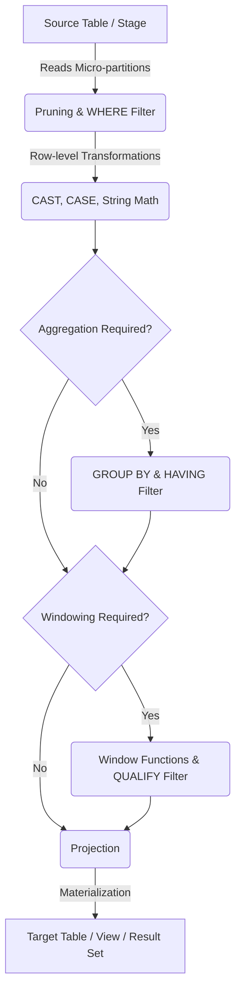

# 1. Perform Data Filtering and Transformation

# 2. Overview
Data filtering and transformation are core mechanics of the ELT (Extract, Load, Transform) paradigm in Snowflake. 
- **Filtering** limits the volume of data processed by applying logical predicates to remove irrelevant, duplicate, or out-of-bounds rows. 
- **Transformation** alters the shape, type, or value of the data, converting raw ingestion payloads into business-ready relational models.

In Snowflake, these operations utilize the decoupled Virtual Warehouse compute layer. They can be applied "on-the-fly" during ingestion (via `COPY INTO ... SELECT`) or post-ingestion via SQL DML, Views, and Dynamic Tables. For SnowPro Advanced exams, mastering the SQL execution order, partition pruning mechanisms (sargability), specific Snowflake functions (e.g., `QUALIFY`, `TRY_CAST`), and handling of semi-structured data is critical.

# 3. SQL Object / Feature Summary

| Feature / Clause | Type | Purpose | Inputs | Outputs | Execution Phase |
| :--- | :--- | :--- | :--- | :--- | :--- |
| `WHERE` | Filter | Eliminates rows based on base column predicates. | Raw rows | Pruned rows | Pre-aggregation |
| `HAVING` | Filter | Eliminates rows based on aggregated values. | Grouped rows | Pruned grouped rows | Post-aggregation |
| `QUALIFY` | Filter | Eliminates rows based on window function results. | Windowed rows | Pruned windowed rows | Post-windowing |
| `CAST` / `TRY_CAST`| Transformation | Coerces data types (e.g., String to Timestamp). | Raw column | Strongly-typed column | Row evaluation |
| `CASE` / `IFF` | Transformation | Applies conditional logic to derive new values. | Multiple columns | Derived scalar value | Row evaluation |
| `COPY INTO ... SELECT` | Ingestion Pipeline | Applies lightweight filtering/transformation during file load. | External/Internal Stage | Target Table | Load time |

# 4. Architecture
Filtering and transformation operations are resolved by the Cloud Services optimizer and executed in memory by Virtual Warehouses before materialization.

# 5. Data Flow / Process Flow
1. **Compilation & Pruning:** The Snowflake Cloud Services layer analyzes the `WHERE` clause against micro-partition metadata (min/max values). Entire micro-partitions are skipped if they do not satisfy the filter.
2. **Row-level Execution:** The Virtual Warehouse scans the remaining micro-partitions. Row-level filters are applied first to minimize memory footprint.
3. **Scalar Transformations:** Functions like `UPPER()`, `COALESCE()`, and `CAST()` evaluate and modify data column by column.
4. **Grouping & Aggregation:** Data is grouped, and aggregate functions (`SUM`, `MAX`) compute results. `HAVING` filters are applied immediately after.
5. **Windowing & Deduplication:** Window functions (`ROW_NUMBER()`, `RANK()`) calculate relative positions. The `QUALIFY` clause filters the results of these window functions.
6. **Final Projection:** The `SELECT` list formats the final output, returning the derived state.

# 6. Logical Breakdown

**Filtering Layer**
- Responsibility: Reduce row volume and eliminate noise.
- Mechanics: Evaluates boolean logic (`TRUE`, `FALSE`, `NULL`). Only rows evaluating to `TRUE` are passed forward.
- Constraints: Filters on `NULL` must use `IS NULL` or `IS NOT NULL`, as `= NULL` evaluates to `NULL` (False).

**Type Coercion Layer**
- Responsibility: Ensure strict typing for downstream analytics and storage efficiency.
- Mechanics: Uses `::` notation or `CAST()`.
- Failure Modes: Standard `CAST` fails the entire query if a single value cannot be converted. `TRY_CAST` returns `NULL` on failure, allowing the pipeline to continue.

**Conditional Logic Layer**
- Responsibility: Implements business logic and classification.
- Mechanics: Uses `CASE WHEN ... THEN ... ELSE ... END`, or the Snowflake-specific `IFF(condition, true_val, false_val)`.
- Exam Focus: `COALESCE(val1, val2, ...)` returns the first non-null value. `NULLIF(val1, val2)` returns `NULL` if both values are equal (crucial for preventing division-by-zero errors).

# 7. Data Model / State Model
Transformations fundamentally alter the state of the data:
- **Grain Reduction:** Aggregations and distinct filters reduce the row grain from transactional (e.g., one row per click) to analytical (e.g., one row per user per day).
- **Schema Enrichment:** Case statements and string manipulations add derived columns (e.g., mapping `status_code_1` to `Status: Active`), expanding the horizontal schema.

# 8. Execution Logic (Exam Focus)

**Order of Execution:**
Snowflake evaluates SQL queries in a strict logical order, which dictates where transformations and filters can be applied:
1. `FROM` / `JOIN`
2. `WHERE` (Row filtering)
3. `GROUP BY`
4. **`HAVING`** (Aggregate filtering)
5. Window Functions
6. **`QUALIFY`** (Window filtering - Exam Critical)
7. `SELECT` (Final projection and renaming)
8. `ORDER BY`
9. `LIMIT`

**The `QUALIFY` Clause Trap:**
`QUALIFY` is a Snowflake-specific extension that eliminates the need to wrap window functions in a CTE or subquery just to filter on them.
*Valid:* `SELECT id, val FROM t QUALIFY ROW_NUMBER() OVER(PARTITION BY id ORDER BY val DESC) = 1;`
*Trap:* You cannot use `QUALIFY` unless at least one window function is present in the `SELECT` list or the `QUALIFY` clause itself.

**Transformation during `COPY INTO` Limits:**
During data ingestion, `COPY INTO <table> FROM @stage SELECT ...` supports basic transformations (CAST, SUBSTR, CASE).
*Exam Trap:* It does **not** support joins, aggregations, window functions, or `FLATTEN` operations. Complex transformations must be staged first.

# 9. Transformations (State Transitions)

- **Date/Time Truncation:** 
  - Source: `2023-10-24 14:30:00`
  - Rule: `DATE_TRUNC('MONTH', timestamp_col)`
  - Output State: `2023-10-01 00:00:00` (Normalizes time-series data to the month grain).
- **JSON Parsing (Semi-Structured):**
  - Source: `VARIANT` column containing `{"user": {"id": 123}}`
  - Rule: `src:user.id::INT`
  - Output State: Relational `INTEGER` column containing `123`.
- **String Parsing (Extraction):**
  - Source: `user_name@domain.com`
  - Rule: `SPLIT_PART(email_col, '@', 2)`
  - Output State: `domain.com`

# 10. Parameters / Configuration
Session parameters strongly influence transformation behaviors, especially date and type coercion.

| Parameter | Type | Purpose | Default |
| :--- | :--- | :--- | :--- |
| `TIMESTAMP_INPUT_FORMAT` | String | Defines how strings are parsed into timestamps during `CAST` or `COPY INTO`. | `AUTO` |
| `DATE_OUTPUT_FORMAT` | String | Defines how dates are transformed into strings for final projection. | `YYYY-MM-DD` |
| `ERROR_ON_NONDETERMINISTIC_MERGE` | Boolean | Forces a `MERGE` transform to fail if multiple source rows match a single target row. | `TRUE` |

# 11. APIs / Interfaces
Transformations are invoked natively via standard ANSI SQL, Snowpark DataFrames (Python/Java/Scala), or External Functions (calling API endpoints for transformations Snowflake cannot natively perform, like ML sentiment analysis).

# 12. Execution / Deployment
Transformations are deployed in Snowflake pipelines via:
- **Views / Secure Views:** Logical transformations executed dynamically at query time. No storage cost, but consumes compute on every query.
- **Dynamic Tables / CTAS:** Physical transformations materialized to storage. Consumes storage cost, but saves compute on downstream reads.
- **Tasks + Stored Procedures:** Procedural ELT execution orchestrating sequential `MERGE`, `INSERT`, and `UPDATE` transformations.

# 13. Observability
In the Snowflake Query Profile:
- **Filter Node:** Indicates a `WHERE`, `HAVING`, or `QUALIFY` operation. High "Rows input" with very low "Rows output" indicates a highly selective, efficient filter.
- **Partition Pruning:** Found in the `TableScan` node details. If `Partitions scanned` is close to `Partitions total`, the `WHERE` clause was ineffective at leveraging clustering metadata.
- **Result Node:** Represents the final projection of the transformation.

# 14. Failure Handling & Recovery

**Failure Scenario: Unsafe Cast Operations**
- Risk: A raw CSV contains text in a numeric column, causing `CAST(col AS INT)` to fail the entire ELT job.
- Mitigation: Always use `TRY_CAST(col AS INT)` or `TRY_TO_NUMBER()`. Invalid values become `NULL`, which can be handled downstream (e.g., `WHERE col IS NULL`).

**Failure Scenario: Division by Zero in Mathematical Transforms**
- Risk: Calculating ratios (e.g., `revenue / clicks`) where clicks are 0 throws an execution error.
- Mitigation: Wrap the denominator in `NULLIF()`. `revenue / NULLIF(clicks, 0)` evaluates to `NULL` safely without halting the pipeline.

**Failure Scenario: Non-Sargable Filters**
- Risk: Writing `WHERE YEAR(date_col) = 2023`. Wrapping a column in a function prevents Snowflake from reading micro-partition metadata. Full table scan occurs.
- Mitigation: Rewrite as a sargable filter: `WHERE date_col >= '2023-01-01' AND date_col < '2024-01-01'`.

# 15. Security & Access Control
- **Dynamic Data Masking:** Acts as an automatic transformation applied at query time based on role. (e.g., transforming a social security number into `XXX-XX-1234` for non-privileged roles).
- **Row-Level Security:** Acts as an automatic `WHERE` filter implicitly appended to queries based on the executing user's role and mapping tables.

# 16. Performance / Scalability Considerations
- **Filter Early, Transform Late:** Apply `WHERE` filters as early as possible in CTEs before performing expensive string manipulations, regex evaluations, or multi-table joins. 
- **Short-Circuit Evaluation:** Snowflake `CASE` and `IFF` statements short-circuit. Place the most frequent or computationally cheapest condition first. If it evaluates to TRUE, subsequent complex conditions are skipped.
- **Regular Expressions:** Functions like `REGEXP_REPLACE` or `REGEXP_LIKE` are extremely CPU intensive. Use standard string functions (`LIKE`, `CONTAINS`, `REPLACE`, `SPLIT`) whenever possible for faster execution.

# 17. Assumptions & Constraints
- `QUALIFY` cannot be used to filter on standard column values; it must evaluate a window function.
- Filtering limits applied inside a `COPY INTO` command are restricted strictly to row-by-row logical evaluations (no aggregation context exists during load time).
- Snowflake assumes data types are correct when functions are applied; implicit casting occurs (e.g., adding an integer to a float), but relying on implicit casting is an anti-pattern that can lead to unexpected truncation.

# 18. Future Enhancements
- Migrate complex, procedural SQL transformations (e.g., heavy JSON parsing, custom mathematical models) into Snowpark Python User-Defined Functions (UDFs) to utilize vectorized processing libraries like Pandas.
- Implement Snowflake Dynamic Tables to transition from manual Task-based scheduled transformations to declarative, engine-managed incremental transformations.
