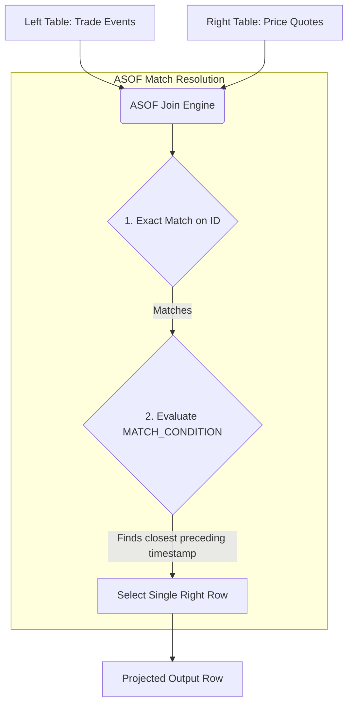

# 1. ASOF Joins (Time-Series / Proximity Joins)

# 2. Overview
An `ASOF JOIN` (As-Of Join) is a specialized Snowflake join operation designed to merge two tables based on proximity rather than exact equality. It retrieves the most recent (or nearest) record from a right table relative to a timestamp or sequence in a left table. 

This feature exists to solve a classic data engineering problem in time-series, financial tick data, and Slowly Changing Dimensions (SCDs): matching events to the state of a system at an exact point in time. Natively executing this proximity match eliminates the need for expensive cross joins, inequality joins (`<=`), and resource-heavy window functions (`QUALIFY ROW_NUMBER()`) that cause join explosions and query spilling.

# 3. SQL Object Summary

| Feature | Type | Purpose | Inputs | Outputs | Query Profile Node |
| :--- | :--- | :--- | :--- | :--- | :--- |
| `ASOF JOIN` | SQL Join Operator | Matches records based on closest preceding/succeeding time or sequence. | Left Table (Events), Right Table (State/Lookup) | Result set with strict 1:1 or 1:0 cardinality | `ASOFJoin` |
| `MATCH_CONDITION` | Clause | Defines the inequality constraint for proximity matching. | Two comparable numeric or temporal columns | Boolean (Nearest match evaluation) | Evaluated within `ASOFJoin` |

# 4. Architecture
The physical execution of an `ASOF JOIN` avoids the Cartesian product (NxN) generated by standard inequality joins. Instead, the Snowflake compute engine hashes the equality keys, sorts the micro-partitions by the proximity keys, and streams the left table to find the immediate nearest neighbor in the right table.



# 5. Data Flow / Process Flow
1. **Compilation Phase:** The Cloud Services optimizer validates that the `MATCH_CONDITION` contains exactly one inequality operator and that the data types are valid temporal or numeric types.
2. **Equality Partitioning:** The Virtual Warehouse groups rows from both tables using the `ON` clause (equality condition). 
3. **Proximity Sorting:** Within those partitioned groups, the engine sorts the rows based on the column specified in the `MATCH_CONDITION`.
4. **Nearest-Neighbor Match:** For every row in the Left Table, the engine scans the sorted Right Table group. It identifies the single row that satisfies the inequality condition and is closest to the Left Table's value.
5. **Output Materialization:** The engine outputs the merged row. If no Right Table row satisfies the condition, the output depends on whether it is an `INNER` (drops row) or `LEFT` (projects `NULL`s) `ASOF JOIN`.

# 6. Logical Breakdown

**Equality Layer (`ON` Clause)**
- Responsibility: Defines the strict equality grouping (e.g., matching the same `stock_symbol` or `device_id`).
- Inputs: One or more column equivalencies (`t1.id = t2.id`).
- Constraints: Optional, but highly recommended for performance. If omitted, the query evaluates the proximity across the entire table.

**Proximity Layer (`MATCH_CONDITION` Clause)**
- Responsibility: Defines the temporal or sequential relationship.
- Inputs: A single boolean expression using `<`, `<=`, `>`, or `>=`.
- Mechanics: Compares a column from the left table to a column from the right table.
- Constraints: Must be exactly one condition. Cannot use `BETWEEN`. Cannot use string/varchar data types.

**Cardinality Control (Implicit deduplication)**
- Responsibility: Ensures that even if multiple rows in the right table have the exact same timestamp, only *one* row is joined to the left table.
- Mechanics: The engine deterministically picks one row (though the specific row chosen among exact ties is non-deterministic unless additional sorting is natively present).

# 7. Data Model / State Model
The primary business value of `ASOF JOIN` is that it preserves the exact grain of the Left Table.
- **Grain:** One row per record in the Left Table.
- **Relationships:** Many-to-One or One-to-One based strictly on time/sequence.
- **Null Handling:** If `LEFT ASOF JOIN` is used, and no preceding record exists in the right table (e.g., a trade occurred before any price quote was recorded), the right table columns populate with `NULL`.

# 8. Business Logic (Execution Logic & Exam Focus)

**Exam Traps & Constraints:**
- **Join Types:** Snowflake supports `INNER ASOF JOIN` and `LEFT ASOF JOIN`. It **does not** support `RIGHT ASOF JOIN` or `FULL OUTER ASOF JOIN`. A standard `ASOF JOIN` defaults to `LEFT`.
- **Data Types:** The columns evaluated in the `MATCH_CONDITION` must be `DATE`, `TIME`, `TIMESTAMP`, or `NUMBER`. Attempting an ASOF join on a `VARCHAR` column will result in a compilation error.
- **Table Order:** The left side of the `MATCH_CONDITION` operator *must* reference the left table, and the right side *must* reference the right table. 
  - *Valid:* `MATCH_CONDITION (left.time >= right.time)`
  - *Invalid:* `MATCH_CONDITION (right.time <= left.time)`

# 9. Transformations (State Transitions)
The operation transitions an event log into a state-aware dataset.
- **Input State:** A stream of events (Left) and a distinct log of state changes (Right).
- **Rule:** `MATCH_CONDITION (event.timestamp >= state.timestamp)`
- **Derived Output:** Every event is horizontally enriched with the exact state of the system at the millisecond the event occurred, effectively transforming asynchronous logs into a unified, flat analytical model.

# 11. APIs / Interfaces
**Standard Invocation Pattern**
```sql
SELECT 
    t.trade_id,
    t.symbol,
    t.trade_time,
    q.quote_price
FROM trades t
LEFT ASOF JOIN quotes q
    MATCH_CONDITION (t.trade_time >= q.quote_time)
    ON t.symbol = q.symbol;
```

# 12. Execution / Deployment
`ASOF JOIN` is frequently deployed in:
- **Dynamic Tables:** To continuously calculate point-in-time enrichments for streaming data.
- **Feature Engineering Pipelines (Snowpark/SQL):** Generating point-in-time correct (PIT) training data for machine learning models to prevent "future leakage" (where future state accidentally joins to past events).

# 13. Observability
- **Query Profile Node:** The execution plan will show an **ASOFJoin** node. 
- **Efficiency Metric:** Unlike a standard Cartesian join, the "Rows produced" by the `ASOFJoin` node will perfectly match (or be less than) the "Rows read" from the Left table.
- **Spilling:** Because `ASOF JOIN` requires sorting the right table partitions, extreme skew (e.g., billions of quotes for one symbol and none for another) may cause the grouping to exceed memory and spill to local storage.

# 14. Failure Handling & Recovery

**Failure Scenario: Cartesian Join Explosion (Pre-ASOF Legacy Code)**
- Symptom: A query joining time-series data using standard inequality (`LEFT JOIN ... ON a.id = b.id AND a.time >= b.time`) runs for hours and spills terabytes of data to remote storage, attempting to match every event to *all* preceding quotes before deduplicating.
- Recovery: Rewrite the query replacing the `LEFT JOIN` and `QUALIFY ROW_NUMBER() = 1` logic with a native `LEFT ASOF JOIN`.

**Failure Scenario: Syntax Compilation Error on Table Order**
- Symptom: `SQL compilation error: invalid MATCH_CONDITION`.
- Cause: The developer wrote `MATCH_CONDITION (right_table.time <= left_table.time)`.
- Recovery: Swap the operands. The left table reference must explicitly sit on the left side of the comparison operator.

**Failure Scenario: Non-Deterministic Tie-Breaking**
- Symptom: If the Right Table contains exact duplicate timestamps for the same ID, the join may return different right-table values on subsequent runs.
- Mitigation: Snowflake does not guarantee which row is returned in a true time collision. The upstream data must be deduplicated, or a more granular timestamp/sequence ID must be used.

# 15. Security & Access Control
No specialized privileges apply. Standard `SELECT` privileges on the underlying tables and views are evaluated by the Cloud Services layer prior to query execution.

# 16. Performance / Scalability Considerations
- **Elimination of Cross Joins:** This is the most performant way to conduct proximity analysis in Snowflake. It replaces `O(N * M)` comparison complexity with `O(N log M)` search complexity.
- **Clustering:** For massive datasets, clustering the Right Table (Lookup table) on the Equality Key (`ON` clause) and the Proximity Key (`MATCH_CONDITION` clause) allows Snowflake to heavily prune micro-partitions, dramatically reducing the memory required for the internal sort and hash phases.
- **Filtering Early:** Ensure `WHERE` clauses apply to the base tables before the `ASOF JOIN` is executed, either by placing filters in a CTE or ensuring the optimizer pushes the predicates down effectively.

# 17. Assumptions & Constraints
- Assumes the Left Table is the driving table and defines the final row count.
- Constrained strictly to one proximity condition. You cannot evaluate `ASOF` across both a timestamp and an independent sequential ID simultaneously.
- Does not support `OR` logic within the `MATCH_CONDITION` or `ON` clauses.
- Only supports the four standard inequality operators. Equality (`=`) or non-equality (`!=`) are not valid in the `MATCH_CONDITION`.
