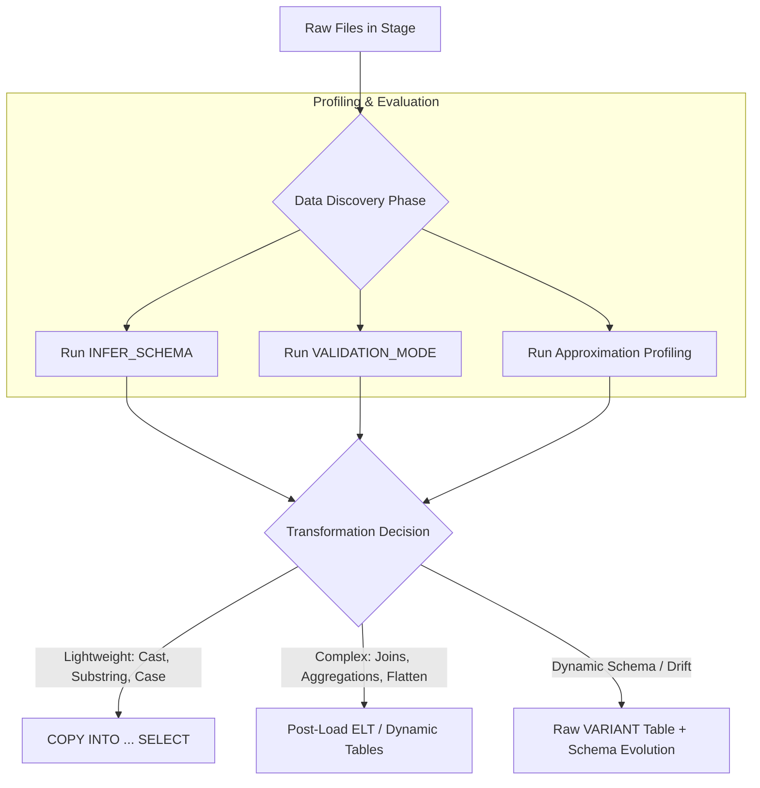

# 1. Data Discovery: Evaluating Required Transformations

# 2. Overview
In the Snowflake ELT (Extract, Load, Transform) architecture, evaluating required transformations during the data discovery phase is the process of profiling raw data in cloud storage to determine the necessary data type coercions, structural flattening, and cleansing rules before operationalizing a pipeline.

This evaluation dictates the architectural design of the pipeline: whether transformations should be pushed left to the source, handled during ingestion (`COPY INTO ... SELECT`), or executed post-load via Snowflake compute (Dynamic Tables, Tasks, Views). For SnowPro Advanced exams, candidates must understand how to leverage schema inference, approximation functions for profiling, and the strict boundaries of load-time versus post-load transformations.

# 3. Feature Summary

| Feature / Pattern | Type | Purpose | Inputs | Execution Phase |
| :--- | :--- | :--- | :--- | :--- |
| [`INFER_SCHEMA`](Feature Summary/INFER_SCHEMA.md) | Table Function | Detects column names and data types from raw files. | Staged files | Pre-ingestion (Discovery) |
| [`VALIDATION_MODE`](Parameters  Configuration/VALIDATION_MODE.md) | COPY Parameter | Tests parsing rules and discovers malformed records without loading. | `COPY INTO` Command | Pre-ingestion (Discovery) |
| [Approximation Functions](Feature Summary/Approximation Functions.md) | SQL Functions | Profiles cardinality and distribution rapidly on massive datasets. | Raw / Staged Data | Pre-ingestion / Profiling |
| [`COPY INTO ... SELECT`](Feature Summary/COPY INTO ... SELECT.md) | DML Pattern | Applies lightweight, row-by-row transformations during load. | Stage | Load time |
| [Post-Load ELT](Feature Summary/Post-Load ELT.md) | DDL / DML | Applies complex relational transformations (Joins, Aggregations, Flattening). | Raw Tables | Post-ingestion |

# 4. Architecture
The evaluation process acts as a decision gate, routing data through different transformation vehicles based on structural complexity and business logic requirements discovered during profiling.



# 5. Data Flow / Process Flow
1. **File Inspection:** Engineers query the stage directly (`SELECT $1, $2 FROM @stage LIMIT 100`) to inspect delimiters, null representations, and text enclosures.
2. **Schema Inference:** The `INFER_SCHEMA` function is executed against self-describing files (Parquet, JSON, Avro) or CSVs with headers to propose a target relational DDL.
3. **Validation & Error Discovery:** A `COPY INTO` command is executed with `VALIDATION_MODE = RETURN_ERRORS` to discover data type mismatches, truncation risks, or column count misalignments across the entire dataset.
4. **Cardinality & Distribution Profiling:** Data is either queried directly from the stage or loaded into a temporary raw table to evaluate skew, null distribution, and distinct values using HyperLogLog (`APPROX_COUNT_DISTINCT`).
5. **Pipeline Design:** Based on the discovered anomalies, specific transformation rules (e.g., `NULLIF`, `TRY_CAST`, `COALESCE`) are codified into the final ingestion script or downstream ELT models.

# 6. Logical Breakdown

**Schema and Type Discovery Layer**
- Responsibility: Determine the physical data types required to store the source data efficiently.
- Tools: `INFER_SCHEMA`, `GENERATE_COLUMN_DESCRIPTION`.
- Output: Target table DDL.
- Risk: Over-allocating data types (e.g., using `VARCHAR(16777216)` for everything) which degrades downstream pruning performance.

**Quality & Anomaly Evaluation Layer**
- Responsibility: Identify missing values, format inconsistencies, and boundary violations.
- Tools: `TRY_CAST` (to discover non-castable strings), `IS_NULL_VALUE()` (for JSON nulls), string length checks.
- Output: Transformation mapping rules (e.g., deciding to map `\N` to `NULL`).

**Structural Evaluation Layer (Semi-Structured)**
- Responsibility: Determine if nested structures (Arrays/Objects) should be preserved as `VARIANT` or flattened into relational rows.
- Mechanics: Analyzing array depths and key consistency.
- Decision Rule: If keys are highly variable or unpredictable, use `VARIANT`. If the structure is rigid, use `LATERAL FLATTEN` post-load.

# 8. Execution Logic (Exam Focus)

**Transformation Boundary Rules (Crucial for pipeline placement):**
During discovery, you must evaluate if the required transformation violates the rules of `COPY INTO ... SELECT`.
- **Allowed in `COPY`:** Explicit type casting (`::INT`), string manipulation (`SUBSTR`), basic math, scalar functions (`CASE`, `COALESCE`), and metadata injection (`METADATA$FILENAME`).
- **Disallowed in `COPY` (Forces Post-Load ELT):** 
  - `JOIN` operations to reference tables.
  - `GROUP BY` or aggregate functions (`SUM`, `MAX`).
  - Window functions (`ROW_NUMBER`).
  - `FLATTEN` operations on semi-structured arrays.
  - Multi-table inserts (`INSERT ALL`).

**Determinism in Discovery:**
When profiling data from a stage, queries without an `ORDER BY` are non-deterministic. Running `SELECT $1 FROM @stage LIMIT 10` will not guarantee the same 10 rows on subsequent executions. 

# 9. Transformations (State Mapping Rules)
Based on discovery, transformation rules are mapped.

- **Discovery:** Source CSV uses `"N/A"` or `""` (empty string) to represent missing data.
  - Required Transformation State: SQL `NULL`.
  - Implementation: `NULL_IF = ('N/A', '')` in the File Format, or `NULLIF(col, 'N/A')` in SQL.
  
- **Discovery:** Source system exports timestamps in non-standard string formats (e.g., `24-Oct-2023`).
  - Required Transformation State: `TIMESTAMP_NTZ`.
  - Implementation: `TO_TIMESTAMP(col, 'DD-Mon-YYYY')` during ingestion.

- **Discovery:** JSON payloads contain varying schemas (schema drift).
  - Required Transformation State: Evolvable relational table.
  - Implementation: `ENABLE_SCHEMA_EVOLUTION = TRUE` on the target table, loading via `COPY INTO` with `MATCH_BY_COLUMN_NAME`.

# 10. Parameters / Configuration
Key parameters evaluated and tuned during discovery:

| Parameter | Type | Purpose |
| :--- | :--- | :--- |
| [`VALIDATION_MODE`](Parameters  Configuration/VALIDATION_MODE.md) | String | Values: `RETURN_n_ROWS`, `RETURN_ERRORS`. Evaluates parsing rules without altering table state. |
| [`ON_ERROR`](Parameters  Configuration/ON_ERROR.md) | String | Determines pipeline resilience based on discovery (e.g., `SKIP_FILE`, `CONTINUE`, `ABORT_STATEMENT`). |
| [`STRIP_OUTER_ARRAY`](Parameters  Configuration/STRIP_OUTER_ARRAY.md)| Boolean | Evaluated if discovery reveals JSON files are wrapped entirely in `[ ]` brackets. |

# 11. APIs / Interfaces

**Schema Inference Invocation**
```sql
SELECT *
FROM TABLE(
  INFER_SCHEMA(
    LOCATION => '@my_stage',
    FILE_FORMAT => 'my_parquet_format'
  )
);
```

**Dynamic DDL Generation based on Discovery**
```sql
SELECT GENERATE_COLUMN_DESCRIPTION(
  ARRAY_AGG(OBJECT_CONSTRUCT(*)), 'table'
)
FROM TABLE(INFER_SCHEMA(...));
```

# 12. Execution / Deployment
Data discovery queries are typically executed manually in Snowsight worksheets during the development phase. Once the required transformations are evaluated, they are codified into idempotent CI/CD scripts (e.g., Terraform, dbt, or Flyway) that deploy the finalized `FILE FORMAT`, `STAGE`, and `COPY INTO` or `Dynamic Table` definitions.

# 13. Observability
- **Query Profile:** When running discovery queries against an external stage, the entire file or subset of files must be downloaded to the Virtual Warehouse. High network I/O in the profile indicates heavy stage scanning.
- **SYSTEM$VERIFY_EXTERNAL_LINKS:** Used to evaluate unstructured data directories to ensure generated URLs point to valid physical files before building downstream transformation logic.

# 14. Failure Handling & Recovery
**Failure Scenario: Discovery Queries Time Out**
- Cause: Running exact count or distinct aggregations (`COUNT(DISTINCT user_id)`) directly against terabytes of staged files.
- Mitigation: Replace with `APPROX_COUNT_DISTINCT(user_id)`. The HyperLogLog algorithm uses significantly less memory and completes rapidly, providing cardinality estimates accurate within ~1.6%, which is sufficient for discovery and data modeling decisions.

**Failure Scenario: Hidden Non-Printable Characters**
- Cause: Discovery via `LIMIT 10` looks clean, but downstream `CAST` fails due to hidden carriage returns (`\r`) or zero-width spaces in the raw files.
- Mitigation: Use `HEX_ENCODE()` during discovery profiling to reveal hidden byte characters, and implement `REGEXP_REPLACE()` or `TRIM()` transformations in the load logic.

# 16. Performance / Scalability Considerations
- **Avoid Querying Stages for Deep Profiling:** Querying `@stage` heavily for profiling is an anti-pattern. If extensive evaluation (multiple aggregations, string regex checks) is required across millions of rows, it is vastly more performant to load the raw data exactly as-is into a transient `VARIANT` or single-column `VARCHAR` table first. Snowflake's micro-partition metadata (min/max/count) will then accelerate the profiling queries.
- **Partition Pruning in Discovery:** If a stage is partitioned (e.g., `@stage/year=2023/`), explicitly include the path in the discovery query (`SELECT * FROM @stage/year=2023/`) to prevent the compute warehouse from scanning the entire historical data lake.

# 17. Assumptions & Constraints
- `INFER_SCHEMA` assumes a consistent schema across the sampled files. If file schemas differ widely within the same stage path, the inferred schema may result in a superset of columns or fail to accurately represent all data types.
- Evaluating JSON structures using `$1` assumes the maximum compressed size of any single JSON document in the stage does not exceed the 16 MB `VARIANT` limit. If it does, the discovery query will fail, and the file must be split externally.
