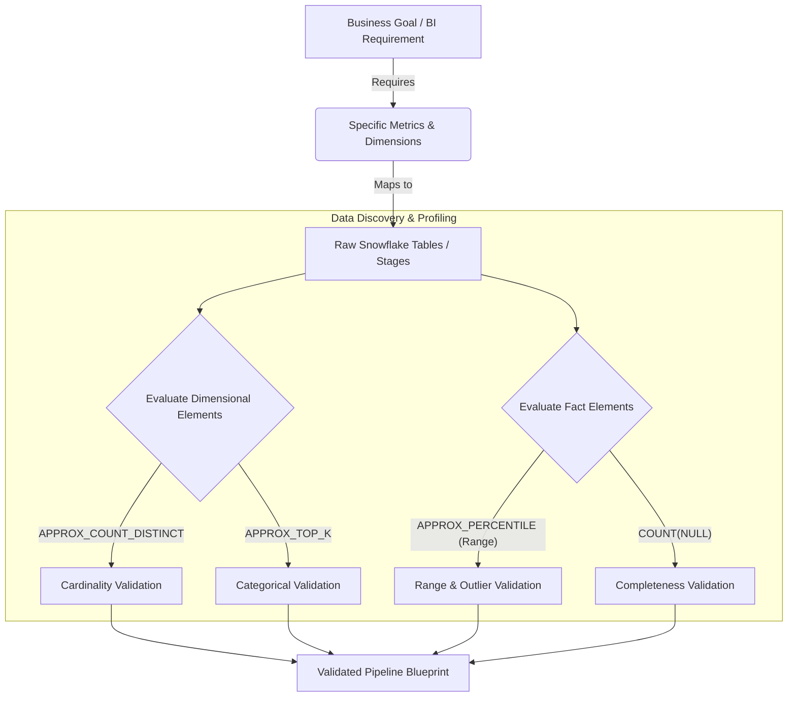

# 1. Assessing Data Elements for Business Goals

# 2. Overview
Assessing data elements for business goals is the process of querying raw or staged data in Snowflake to verify that it contains the specific attributes (dimensions, facts, keys) required to fulfill downstream analytics, BI reports, or machine learning objectives.

Before engineering complex ELT pipelines, data engineers and analysts must map business requirements (e.g., "Daily Active Users", "Revenue by Region") to physical raw data structures. In Snowflake, this discovery phase leverages SQL approximations, semi-structured data traversal, and metadata analysis to validate the presence, quality, and granularity of the required elements without incurring massive compute costs. For SnowPro Advanced candidates, understanding how to efficiently profile cardinality, distributions, and semi-structured schemas is critical.

# 3. SQL Object / Feature Summary

| Feature / Function | Type | Purpose | Inputs | Execution Phase |
| :--- | :--- | :--- | :--- | :--- |
| [`APPROX_COUNT_DISTINCT`](SQL Object  Feature Summary/APPROX_COUNT_DISTINCT.md) | Function | Estimates cardinality for dimensional analysis with high speed. | Column | Data Discovery |
| [`APPROX_PERCENTILE`](SQL Object  Feature Summary/APPROX_PERCENTILE.md) | Function | Estimates numeric distribution and outliers for fact validation. | Column, Float (0.0-1.0) | Data Discovery |
| [`APPROX_TOP_K`](SQL Object  Feature Summary/APPROX_TOP_K.md) | Function | Identifies the most frequent categorical values. | Column | Data Discovery |
| [`VARIANT` Path Traversal](SQL Object  Feature Summary/VARIANT Path Traversal.md) | DQL Syntax | Extracts nested JSON/Parquet elements required by BI tools. | `VARIANT` Column | Data Discovery |
| [`GET_DDL`](SQL Object  Feature Summary/GET_DDL.md) | Function | Extracts table/view structures to assess available columns. | Object Name | Metadata Assessment |

# 4. Architecture
The assessment architecture maps abstract business logic into concrete Snowflake SQL profiling operations against the raw storage layer.



# 5. Data Flow / Process Flow
1. **Requirement Mapping:** A BI report requires "Revenue grouped by User Region over Time."
2. **Target Identification:** The engineer locates the raw tables (e.g., `raw_transactions`, `raw_users`).
3. **Element Validation (Presence):** The engineer queries the table structures or `VARIANT` schemas to confirm `revenue`, `user_id`, `region`, and `timestamp` exist.
4. **Element Validation (Quality/State):** SQL queries assess the fill-rate (nulls), data types, and distinct values of these columns.
5. **Grain Assessment:** The engineer validates if the raw row grain (e.g., individual clicks) matches the BI grain, or if aggregation logic is required.
6. **BI Mockup:** A temporary Secure View or SQL query is exposed to the BI tool in direct-query mode to prototype the business logic before materializing a pipeline.

# 6. Logical Breakdown

**Dimensional Element Assessment**
- Responsibility: Validate keys, categorical groupings, and hierarchies.
- Mechanics: Checking for uniqueness, identifying slowly changing attributes, and ensuring foreign keys exist to support joins.
- Risks: Identifying join explosions if foreign keys are not perfectly unique in the dimension table.

**Fact Element Assessment**
- Responsibility: Validate numerical measures required for KPI calculations.
- Mechanics: Checking boundaries (min/max), distributions, and handling of negative values or zeroes (which disrupt division logic in BI tools).
- Risks: Overflow errors during BI aggregation if base data types are misaligned.

**Temporal Element Assessment**
- Responsibility: Validate time-series continuity.
- Mechanics: Ensuring timestamps are in standard formats (e.g., ISO-8601) and identifying missing days or timezone mismatches (NTZ vs LTZ).

# 7. Data Model / State Model
During assessment, engineers must map the **Raw State** to the **Required BI State**.
- **Raw Grain:** One row per API event payload (JSON).
- **Required BI Grain:** One row per User per Day.
- **Assessment Task:** Verify the `VARIANT` payload contains both a `user_id` and a `timestamp`. If the payload only contains a `session_id`, the business goal cannot be met without joining an external session-mapping table.

# 8. Business Logic (Execution Logic & Exam Focus)

**Handling BI Tool Limitations (Semi-Structured Data):**
Most BI tools (Tableau, PowerBI) cannot natively parse Snowflake `VARIANT` columns. If a business goal requires an element stored inside a JSON payload (e.g., `raw_data:customer.region`), the engineer must assess this and define a relational projection (View or Dynamic Table) to extract and cast it (`raw_data:customer.region::VARCHAR`) before the BI tool can consume it.

**The JSON Null Trap (Exam Critical):**
When profiling for missing elements, checking `WHERE raw_data:email IS NULL` will fail to identify records where the JSON explicitly contains `"email": null`. The business goal will report inaccurate completeness unless assessed using `IS_NULL_VALUE(raw_data:email)`.

**Approximation vs. Exact Calculation:**
When verifying cardinality for a dashboard drop-down filter, calculating exact distinct counts across billions of rows is computationally expensive. Snowflake provides HyperLogLog and Space-Saving algorithms.
- *Exam Rule:* Use `APPROX_COUNT_DISTINCT` for discovery. It provides an estimate with a ~1.62% error rate but executes exponentially faster and with less memory overhead than `COUNT(DISTINCT)`.

# 9. Transformations (State Transitions)
During discovery, engineers simulate the transformations required to meet business goals:

- **Goal:** Dashboard needs a clean "Status" grouping.
- **Discovery Query:** `SELECT APPROX_TOP_K(status_code, 5) FROM raw_orders;`
- **Discovered State:** Returns `['A', 'P', 'C', 'X', 'Y']`.
- **Derived Transformation Plan:** Implement a `CASE` statement in the ELT pipeline mapping 'A' to 'Active', 'P' to 'Pending', etc., for BI consumption.

# 10. Parameters / Configuration
While assessing elements, session parameters may need adjustment to mimic BI tool behavior:

| Parameter | Type | Purpose |
| :--- | :--- | :--- |
| [`TIMEZONE`](Parameters  Configuration/TIMEZONE.md) | String | Sets the session timezone. Critical for assessing if daily aggregations will match business expectations (e.g., UTC vs America/New_York). |
| [`QUOTED_IDENTIFIERS_IGNORE_CASE`](Parameters  Configuration/QUOTED_IDENTIFIERS_IGNORE_CASE.md) | Boolean | BI tools often generate strict, quoted SQL. Assessing casing rules prevents compilation errors downstream. |

# 11. APIs / Interfaces

**Profiling Categorical Elements for BI Filters**
```sql
-- Quickly assessing the top 10 most common regions for a dashboard filter
SELECT value[0]::VARCHAR AS region, value[1]::INT AS estimated_count
FROM TABLE(FLATTEN(
    INPUT => (SELECT APPROX_TOP_K(raw_data:region::VARCHAR, 10) FROM raw_users)
));
```

**Profiling Numerical Distributions for KPIs**
```sql
-- Assessing the median and 90th percentile revenue to define BI chart scales
SELECT 
    APPROX_PERCENTILE(revenue, 0.5) AS median_revenue,
    APPROX_PERCENTILE(revenue, 0.9) AS p90_revenue
FROM raw_sales;
```

# 12. Execution / Deployment
Data element assessment is generally an interactive process executed in Snowsight. 
Once elements are verified, the queries are formalized into:
- **dbt tests:** Assertions running in CI/CD to ensure the required elements never disappear.
- **Data Contracts:** Enforcing the presence of the required business elements at the point of ingestion.

# 13. Observability
- **Query Profile:** When running approximation functions, the query profile will show highly efficient aggregation nodes (HyperLogLog). If full `COUNT(DISTINCT)` is used during discovery on large tables, the profile will likely show memory spilling to local storage.

# 14. Failure Handling & Recovery
**Failure Scenario: Granularity Mismatch Discovered**
- Issue: The BI goal requires "Daily Ad Spend by Campaign," but the raw data only provides "Monthly Ad Spend by Campaign."
- Mitigation: The data element assessment fails. The engineer must either reject the business requirement, source a new granular data feed, or negotiate an allocation logic (e.g., dividing monthly spend by the number of days in the month).

**Failure Scenario: Unstructured Blobs Discovered**
- Issue: A required business element (e.g., "Customer Sentiment") is locked inside a free-text comment block or PDF, rather than a structured or semi-structured field.
- Mitigation: Natively querying the table cannot fulfill the goal. The pipeline must be redesigned to pass the unstructured data through a Snowpark UDF (e.g., utilizing LLMs/Cortex) to extract the sentiment score into a relational column.

# 15. Security & Access Control
When assessing data elements, the engineer may be exposed to PII (Personally Identifiable Information).
- **Dynamic Data Masking:** Ensure masking policies are active on production data clones. Engineers can assess the *presence* and *cardinality* of masked elements (e.g., counting distinct emails) without seeing the raw values, provided the masking policy allows structural queries while masking projections.

# 16. Performance / Scalability Considerations
- **Avoid Full Table Scans:** When assessing massive fact tables to verify elements, always append a bounded `WHERE` clause on the partition key (e.g., `WHERE date_col > CURRENT_DATE - 7`). Profiling 7 days of data is usually sufficient to assess element presence and structural quality.
- **Sample Clauses:** Use the `SAMPLE` clause (e.g., `SELECT * FROM massive_table SAMPLE(1)`) to pull a 1% subset of data for rapid visual assessment of column values, bypassing the need to read entire micro-partitions.

# 17. Assumptions & Constraints
- Approximations (`APPROX_COUNT_DISTINCT`, `APPROX_PERCENTILE`) are not exact. They are strictly for discovery and sizing, not for calculating final financial KPIs.
- The `SAMPLE` function in Snowflake is not perfectly uniform at the row level; block-based sampling (`SAMPLE SYSTEM`) is much faster but returns entire micro-partitions, which may heavily skew data distribution assessments if the table is clustered.
