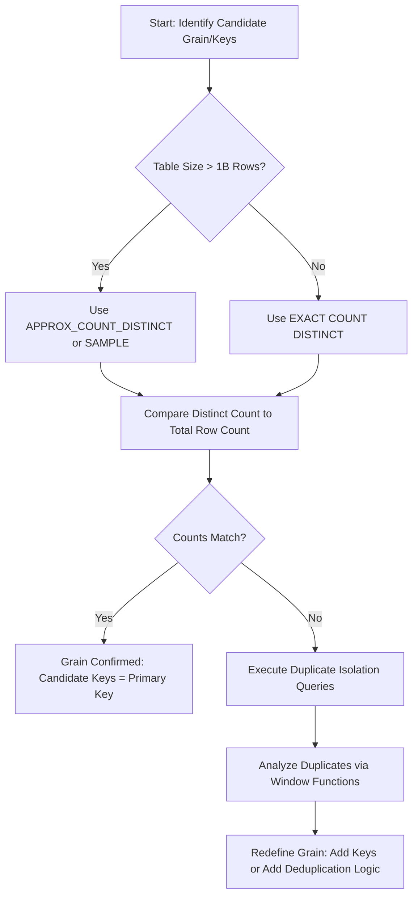

# 1. Assessing Data Granularity in Snowflake

# 2. Overview
Assessing data granularity is a critical data discovery phase during ingestion preparation. Granularity (or "grain") defines what a single row in a dataset represents. Establishing the grain is required to identify primary keys, prevent join fan-outs, ensure accurate aggregations, and design idempotent transformation pipelines.

Because Snowflake does not natively enforce `PRIMARY KEY` or `UNIQUE` constraints during DML operations, engineers cannot rely on table DDL to determine the actual grain of a dataset. The grain must be empirically validated by querying the data using distinct counts, grouping, and window functions to detect cardinality and duplicates.

This documentation outlines the procedural query patterns used to assess granularity, identify candidate keys, and validate data models prior to formal ingestion and transformation.

# 3. Assessment Pattern Summary

| Pattern / Function | Type | Purpose | Input | Output / Observable Behavior |
| :--- | :--- | :--- | :--- | :--- |
| `COUNT(*)` vs `COUNT(DISTINCT)` | Aggregate Comparison | Validate if candidate keys uniquely identify every row. | Raw staging table | Ratio of distinct rows to total rows. A 1:1 ratio confirms the grain. |
| `APPROX_COUNT_DISTINCT` | Estimation Function | Rapidly estimate cardinality on massive datasets without heavy memory overhead. | Large raw tables | Approximate distinct count (HyperLogLog algorithm). |
| `GROUP BY ... HAVING` | Aggregation Filter | Isolate specific candidate key combinations that violate uniqueness. | Candidate key columns | Result set of duplicated keys and their frequency. |
| `QUALIFY ROW_NUMBER()` | Window Filter | Extract the full row payload of duplicated records for context analysis. | Full table | Result set of duplicate rows, preserving all columns. |
| `HASH(*)` | Hashing Function | Condense composite keys into a single integer for faster distinct counting. | Multiple columns | Single 64-bit integer hash representing the row state. |

# 4. Architecture
The following flowchart illustrates the procedural logic for discovering and validating data granularity.

# 5. Process Flow
Assessing granularity requires moving from macro-level row counts to micro-level duplicate isolation.

1.  **Baseline Row Count Retrieval:** Retrieve the total number of rows in the table. If possible, derive this from metadata (`INFORMATION_SCHEMA.TABLES` or `TABLE()`) to avoid computing a full table scan.
2.  **Candidate Key Evaluation:** Execute a distinct count against the column(s) hypothesized to uniquely identify a row.
3.  **Variance Check:** Compare the distinct key count to the total table row count. If `COUNT(DISTINCT candidate_keys) < COUNT(*)`, the dataset is at a lower grain than hypothesized (duplicates exist).
4.  **Duplicate Isolation:** If variance exists, group by the candidate keys and filter for counts greater than one to isolate the violating records.
5.  **Payload Inspection:** Use window functions to pull the full rows for the violating keys to determine if the rows are true duplicates or if another dimension (e.g., a timestamp or status column) is required to define the grain.

# 6. Logical Breakdown
The following logical query patterns are used to execute the process flow.

### Component 1: Exact Grain Validation
*   **Responsibility:** Determine if a set of columns strictly defines the grain.
*   **Mechanics:** Compares `COUNT(*)` against `COUNT(DISTINCT col1, col2)`.
*   **Exam Relevance:** `COUNT(DISTINCT)` ignores `NULL` values. If candidate keys contain nulls, the distinct count will underreport, artificially skewing the grain assessment.

### Component 2: High-Volume Approximate Profiling
*   **Responsibility:** Quickly assess cardinality on multi-billion row tables where exact counting would cause memory spills or excessive compute.
*   **Mechanics:** Utilizes `APPROX_COUNT_DISTINCT(col)`.
*   **Dependencies:** Relies on Snowflake's HyperLogLog implementation.
*   **Failure Modes:** Produces an estimated result. It cannot be used for strict data quality gates that require zero tolerance for duplicates.

### Component 3: Composite Key Hashing
*   **Responsibility:** Simplify distinct counts across many columns (e.g., checking if a row is entirely duplicated across 20 columns).
*   **Mechanics:** Wraps columns in `HASH(col1, col2, ...)` or `HASH(*)` and performs the distinct count on the resulting 64-bit integer.
*   **Exam Relevance:** `HASH(*)` is sensitive to column order.

### Component 4: Duplicate Record Extraction
*   **Responsibility:** Retrieve the actual rows violating the assumed grain to understand why they duplicated.
*   **Mechanics:** Uses `QUALIFY ROW_NUMBER() OVER (PARTITION BY candidate_keys ORDER BY timestamp_col) > 1`.
*   **Outputs:** The exact rows that cause fan-outs, allowing analysts to identify missing dimensions (e.g., discovering that a dataset is actually at the `Order + LineItem` grain, not just the `Order` grain).

# 8. Business & Execution Logic
*   **The 1:1 Rule:** A candidate key perfectly describes the grain if and only if the exact distinct count of that key equals the total row count of the table, AND the key contains no nulls.
*   **Handling Nulls in Keys:** If a proposed granularity column allows `NULL`, it violates standard primary key logic. Granularity assessment queries must account for this using `NVL()` or explicit `IS NOT NULL` filters during evaluation.
*   **Temporal Grain:** If duplicate keys are found, but a `LAST_MODIFIED_DATE` column exists, the dataset is likely at a *transactional* or *Change Data Capture (CDC)* grain rather than a dimensional grain. The true grain is `Key + Timestamp`.

# 10. Parameters / Configuration
*   **`APPROX_COUNT_DISTINCT` Error Bound:** The HyperLogLog algorithm in Snowflake has a standard error of **1.62%**. This is highly relevant for SnowPro exams. It should be used for exploratory sizing, not definitive uniqueness checks.
*   **`SAMPLE` / `TABLESAMPLE`:** Used as an alternative profiling parameter. Using `SELECT COUNT(DISTINCT col) FROM table SAMPLE SYSTEM (10)` evaluates the grain on a 10% block-level sample of the data, vastly reducing assessment costs.

# 14. Failure Handling & Recovery
*   **Join Explosions (Fan-outs):** Failing to correctly identify the grain before joining tables results in cartesian products.
    *   *Detection:* The output row count of a join vastly exceeds the input row counts.
    *   *Mitigation:* Re-evaluate the join condition against the distinct keys identified during granularity assessment.
*   **Memory Spills on `COUNT(DISTINCT)`:** Assessing the grain on massive multi-column composite keys can exceed warehouse memory.
    *   *Detection:* Query profile shows significant bytes spilled to local or remote storage.
    *   *Mitigation:* Scale up the warehouse, switch to `APPROX_COUNT_DISTINCT`, or use the `HASH()` technique to reduce the memory footprint of the grouping operation.

# 16. Performance / Scalability Considerations
*   **Avoid Raw Table Scans for Total Counts:** Never use `SELECT COUNT(*) FROM table` on massive tables if you only need the total row count. Snowflake caches table row counts in the cloud services layer. It executes in milliseconds without requiring a virtual warehouse if no other predicates are applied.
*   **Sorting and Grouping Costs:** `COUNT(DISTINCT)` and `GROUP BY` are blocking operations. The warehouse must read all data into memory before returning a result.
*   **Micro-partition Pruning:** If assessing the grain of a specific temporal slice (e.g., checking uniqueness for yesterday's batch), always include the clustering key (typically a date/timestamp) in the `WHERE` clause to maximize partition pruning during the discovery phase.

# 17. Assumptions & Constraints
*   **Constraint Non-Enforcement (Exam Critical):** Snowflake allows the definition of `PRIMARY KEY`, `UNIQUE`, and `FOREIGN KEY` constraints, but **does not enforce them** during `INSERT`, `UPDATE`, `MERGE`, or `COPY INTO` operations (only `NOT NULL` is enforced). Granularity cannot be trusted based on DDL; it must be assessed via querying.
*   **Case Sensitivity:** Distinct counts and hashes are strictly case-sensitive and space-sensitive. 'Apple', 'apple', and 'Apple ' will be evaluated as three separate grains unless standardized via `TRIM()` and `UPPER()` during the assessment query.
*   **Time Travel Limitations:** Granularity assessments run against the current state of the table. If trying to assess the grain of a previous ingestion batch, `AT (OFFSET => ...)` or `AT (TIMESTAMP => ...)` must be used in the `FROM` clause.
