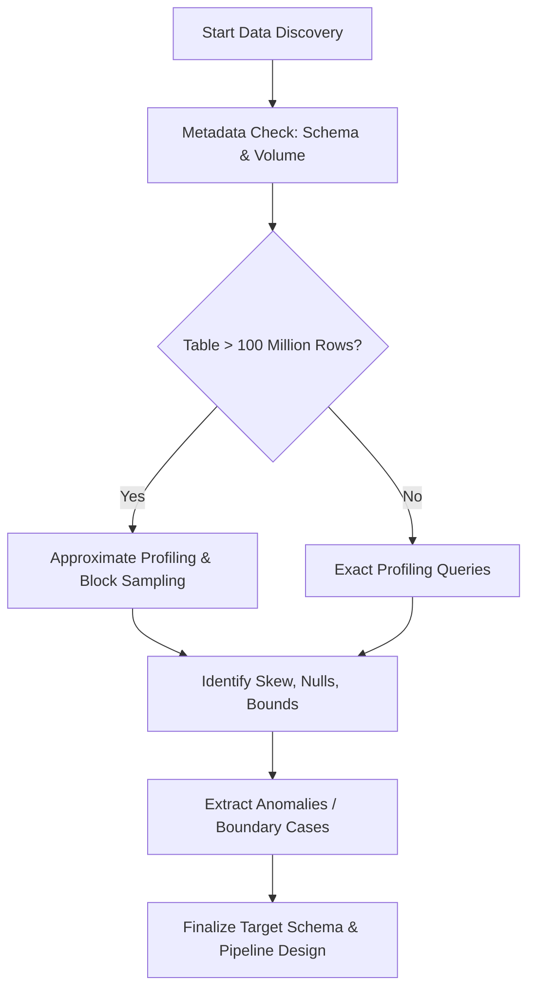

# 1. Data Discovery: Table Assessment and Profiling in Snowflake

# 2. Overview
During the data ingestion preparation phase, data discovery is the procedural evaluation of source tables or raw staging data to determine its volume, shape, cardinality, and quality. Querying tables for assessment allows engineers to define appropriate target data models, choose optimal data types, establish clustering keys, and design resilient transformation pipelines.

Because source data often diverges from expected documentation, empirical querying is required to validate assumptions before building automated ingestion workloads. This process relies on a combination of zero-compute metadata queries, approximate aggregate functions, and targeted exact aggregations.

For SnowPro Advanced candidates, understanding the cost, performance, and memory implications of different data profiling queries is critical.

# 3. Assessment Pattern Summary

| Assessment Type | Purpose | Key Snowflake Objects / Functions | Execution Cost Profile |
| :--- | :--- | :--- | :--- |
| [**Metadata Profiling**](Assessment Pattern Summary/Metadata Profiling.md) | Determine table schema, data types, and total volume without scanning data. | `INFORMATION_SCHEMA.COLUMNS`, `SHOW TABLES`, `COUNT(*)` (no predicates) | Cloud Services only (Zero Warehouse Compute) |
| [**Approximate Profiling**](Assessment Pattern Summary/Approximate Profiling.md) | Estimate cardinality and data distribution on massive datasets quickly. | `APPROX_COUNT_DISTINCT`, `APPROX_PERCENTILE` | Low compute / Low memory overhead |
| [**Sample Profiling**](Assessment Pattern Summary/Sample Profiling.md) | Perform complex anomaly detection on a representative subset of data. | `SAMPLE` / `TABLESAMPLE` (Row or Block) | Variable, based on sample size |
| [**Exact Profiling**](Assessment Pattern Summary/Exact Profiling.md) | Validate strict business keys, null ratios, and specific string patterns. | `COUNT(DISTINCT)`, `MIN()`, `MAX()`, `RLIKE`, RegEx functions | High compute / High memory footprint (blocking operations) |

# 4. Architecture
The following flowchart illustrates the optimal routing for data discovery queries to minimize warehouse compute costs while maximizing analytical value.

# 5. Data Flow / Process Flow
1.  **Schema Retrieval:** Query `INFORMATION_SCHEMA.COLUMNS` to extract the declared data types, ordinal positions, and theoretical nullability of the source data.
2.  **Volume Check:** Execute standard `COUNT(*)` or `SHOW TABLES` to establish the absolute row limit.
3.  **Boundary Evaluation:** Execute `MIN()`, `MAX()`, and `APPROX_PERCENTILE()` on date, numeric, and string columns to identify the valid range of data and locate structural outliers.
4.  **Cardinality Assessment:** Execute distinct counts on candidate dimension keys to establish granularity and detect potential join fan-out risks.
5.  **Null & Empty String Assessment:** Query the ratio of `NULL` or empty strings (`''`) against total rows to determine if columns are safe to use in predicates or if `COALESCE` logic is required in downstream pipelines.
6.  **Semi-Structured Evaluation:** If querying `VARIANT` columns, execute `TYPEOF()`, `OBJECT_KEYS()`, and `IS_ARRAY()` to dynamically map the JSON document structure.

# 6. Logical Breakdown

### Component 1: Zero-Compute Metadata Extraction
*   **Responsibility:** Establish baseline table statistics using Snowflake's Cloud Services layer rather than Virtual Warehouses.
*   **Mechanics:** Uses `SHOW TABLES LIKE '...'` or `SELECT COUNT(*) FROM table` (without `WHERE` clauses).
*   **Dependencies:** Relies on up-to-date Cloud Services metadata cache.
*   **Exam Relevance:** `COUNT(*)` queries with no filters do not require a running warehouse.

### Component 2: Distribution and Skew Assessment
*   **Responsibility:** Identify how data is distributed across distinct values, which dictates clustering key strategy and join performance.
*   **Mechanics:** Uses `APPROX_TOP_K(column, <N>)` to find the most frequent values. Uses `APPROX_PERCENTILE(column, 0.5)` to find the median.
*   **Outputs:** A list of heavy hitters (skewed values) that could cause warehouse hot-spotting during `GROUP BY` or `JOIN` operations.

### Component 3: Semi-Structured Data Profiling
*   **Responsibility:** Assess schema drift or variable structures inside raw JSON/XML ingested into `VARIANT` columns.
*   **Mechanics:** Uses the `FLATTEN()` table function combined with `DISTINCT path` to list all observed JSON keys in a dataset. Uses `TYPEOF(variant_col:key)` to determine if a dynamic field contains strings, integers, arrays, or objects.
*   **Failure Modes:** Attempting to cast heavily drifted `VARIANT` keys directly to strict relational types without first checking `TYPEOF()` will cause pipeline failure during ingestion.

### Component 4: Sampling Mechanisms
*   **Responsibility:** Reduce discovery query execution time.
*   **Mechanics:** 
    *   *Row Sampling:* `SAMPLE (10)` pulls a random 10% of rows.
    *   *Block Sampling:* `SAMPLE SYSTEM (10)` pulls a random 10% of underlying micro-partitions.
*   **Exam Relevance:** Block sampling (`SYSTEM`) is significantly faster and less resource-intensive than row sampling (BERNOULLI), but is only effective on large tables.

# 8. Business Logic (Execution Logic)
*   **Type Coercion Discovery:** Raw data often arrives as strings (e.g., `VARCHAR` containing '2023-01-01'). Discovery queries use `TRY_CAST(col AS DATE)` coupled with a `WHERE TRY_CAST(col AS DATE) IS NULL AND col IS NOT NULL` to specifically isolate records that fail type coercion.
*   **The Blank vs. Null Rule:** Snowflake treats `NULL` and the empty string `''` as distinct values. Discovery queries must explicitly check both: `SUM(IFF(col IS NULL OR col = '', 1, 0)) / COUNT(*)`.
*   **Cardinality Thresholds:** If the distinct count of a column approaches the total row count (high cardinality), the column is a candidate for a Primary Key but a poor candidate for a clustering key (unless queried exclusively by point lookups).

# 10. Parameters / Configuration
*   **`APPROX_COUNT_DISTINCT` Error Bound:** Generates distinct counts using the HyperLogLog algorithm. Has a standard error of **1.62%**.
*   **`APPROX_PERCENTILE` / `APPROX_TOP_K`:** Used to generate approximate histograms and frequency distributions without blocking memory operations.
*   **`USE_CACHED_RESULT`:** Session parameter (default `TRUE`). When running iterative discovery queries (e.g., pulling the exact same aggregated profile), Snowflake will return results from the 24-hour result cache, bypassing warehouse compute.

# 14. Failure Handling & Recovery
*   **Warehouse Out-of-Memory (OOM) on Profiling:** 
    *   *Scenario:* Running multiple exact `COUNT(DISTINCT)` functions across hundreds of columns on a billion-row table causes local storage spill and extreme query latency.
    *   *Mitigation:* Use `APPROX_COUNT_DISTINCT`, switch to Block Sampling (`SYSTEM`), or increase Virtual Warehouse size (e.g., Small to Large) temporarily during discovery.
*   **Metadata vs Active State Mismatch:**
    *   *Scenario:* Querying `SNOWFLAKE.ACCOUNT_USAGE.TABLES` shows different row counts than a live `SELECT COUNT(*)`.
    *   *Recovery:* Understand latency. `ACCOUNT_USAGE` views can have up to 90 minutes of latency. For live discovery of newly ingested data, always use `INFORMATION_SCHEMA` or `SHOW` commands.

# 16. Performance / Scalability Considerations
*   **Micro-Partition Pruning during Discovery:** If a staging table contains years of data, running discovery queries across the entire table is inefficient. Always filter on the ingestion timestamp (e.g., `WHERE load_date >= CURRENT_DATE() - 7`) to maximize partition pruning.
*   **Regex Processing Costs:** Using `RLIKE` or `REGEXP_COUNT` to profile string patterns (e.g., checking for valid email formats) is highly CPU-intensive. Restrict regular expression queries to sampled subsets rather than full table scans.
*   **FLATTEN Expansions:** Flattening large `VARIANT` arrays across millions of rows can cause massive memory expansion. Profile semi-structured data using a `LIMIT` clause coupled with `SAMPLE`.

# 17. Assumptions & Constraints
*   **Unenforced Constraints:** Discovery cannot rely on table DDL for `UNIQUE`, `PRIMARY KEY`, or `FOREIGN KEY` constraints, as Snowflake does not enforce them. Query evaluation is mandatory.
*   **Collation Limitations:** Aggregate profiling on string columns depends on collation settings. `COUNT(DISTINCT)` on a column with `en-ci` (case-insensitive) collation will yield different results than the default case-sensitive collation.
*   **Time Travel State:** Discovery queries evaluate the table's current state. If the data is being updated concurrently by continuous ingestion (e.g., Snowpipe), the results of two identical `COUNT(*)` queries run minutes apart may differ. Use `AT (OFFSET => 0)` to peg the discovery queries to a specific snapshot if absolute consistency is required during the profiling session.
