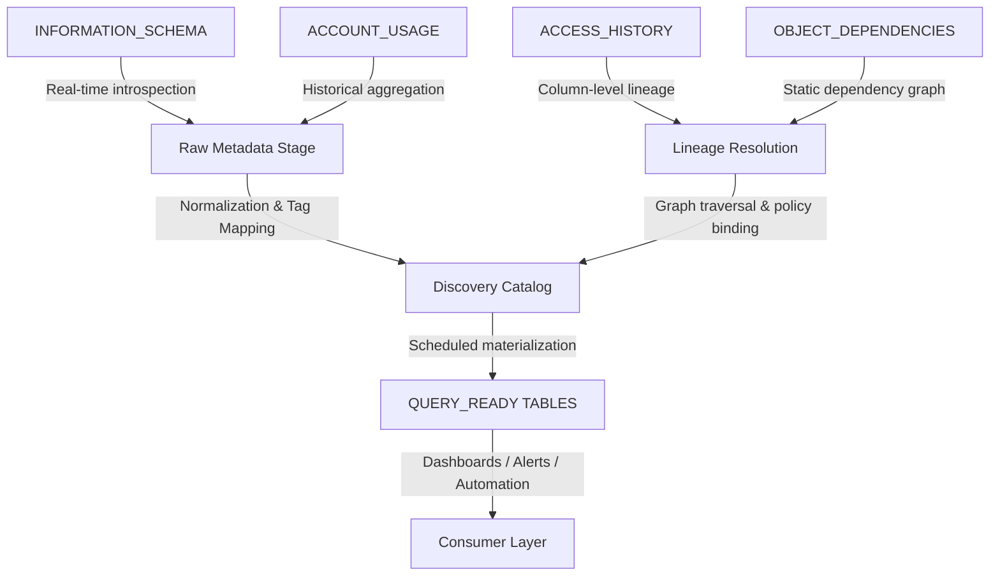

# Data Discovery

# 1. Title
SnowPro Advanced: Data Discovery & Metadata Intelligence – Architectural Reference

# 2. Overview
- **What it does**: Extracts, normalizes, and surfaces schema structure, data lineage, query performance, storage consumption, access patterns, and governance metadata across Snowflake accounts.
- **Why it exists**: Data discovery is the prerequisite for optimization, compliance, cost control, and reliable pipeline design. Without systematic metadata extraction, engineering teams operate blind to unused objects, lineage gaps, performance bottlenecks, and policy violations.
- **Where it fits**: Operates continuously alongside ingestion and transformation layers. Queries system views, materializes metadata into dedicated discovery schemas, and feeds dashboards, automation rules, and audit pipelines.
- **Intended consumer**: Data engineers, platform architects, security/compliance teams, FinOps, and SnowPro Advanced candidates who must audit, optimize, and govern Snowflake environments deterministically.

# 3. SQL Object Summary
| Field | Value |
|-------|-------|
| [Object Scope](SQL Object Summary/Object Scope.md) | Metadata Extraction & Discovery Pipeline (Conceptual) |
| [Type](SQL Object Summary/Type.md) | System View Queries + Materialized Discovery Tables |
| [Purpose](SQL Object Summary/Purpose.md) | Centralize schema, lineage, usage, cost, and policy metadata for audit and optimization |
| [Source Objects](SQL Object Summary/Source Objects.md) | `ACCOUNT_USAGE.*`, `INFORMATION_SCHEMA.*`, `SNOWFLAKE.CORE.*`, `SNOWFLAKE.DATA_CATALOG` |
| [Output Object](SQL Object Summary/Output Object.md) | Discovery tables: `METADATA_SCHEMA.OBJECT_CATALOG`, `LINEAGE_GRAPH`, `USAGE_METRICS`, `POLICY_AUDIT` |
| [Execution Mode](SQL Object Summary/Execution Mode.md) | Scheduled (`TASK`), Incremental (time-windowed), On-demand (ad-hoc audit) |

# 4. Architecture
Discovery in Snowflake relies on two metadata tiers:
1. **`INFORMATION_SCHEMA`**: Real-time, database-scoped, reflects current state. Lower latency, no historical retention.
2. **`ACCOUNT_USAGE`**: Account-scoped, historical, 365-day retention. Up to 45-minute latency. Required for audit, trend analysis, and cross-database discovery.

The pipeline extracts raw metadata, resolves lineage and dependencies, normalizes storage/cost metrics, and materializes query-ready discovery tables.

# 5. Data Flow / Process Flow
| Step | Input | Transformation | Output | Purpose |
|------|-------|----------------|--------|---------|
| [1. Privilege Validation](Data Flow  Process Flow/1. Privilege Validation.md) | Current role, `GRANT` inventory | `SHOW GRANTS`, `ACCOUNT_USAGE.GRANTS_TO_ROLES` | Validated discovery scope | Ensure `ACCOUNT_USAGE`/`INFORMATION_SCHEMA` access before extraction |
| [2. Metadata Extraction](Data Flow  Process Flow/2. Metadata Extraction.md) | System views (tables, views, columns, stages, pipes) | `SELECT * FROM ACCOUNT_USAGE.TABLES/COLUMNS/STAGES` | Raw metadata rows | Capture current schema state and object properties |
| [3. Lineage Resolution](Data Flow  Process Flow/3. Lineage Resolution.md) | `ACCESS_HISTORY`, `OBJECT_DEPENDENCIES` | JSON flattening, graph traversal, dynamic SQL exclusion | Column-to-table lineage graph | Trace data movement, identify upstream sources, detect orphaned objects |
| [4. Usage & Cost Aggregation](Data Flow  Process Flow/4. Usage & Cost Aggregation.md) | `QUERY_HISTORY`, `TABLE_STORAGE_METRICS`, `WAREHOUSE_METERING_HISTORY` | `SUM(bytes_scanned)`, credit allocation, time-window grouping | Usage metrics per object/warehouse | Identify hot/cold data, optimize clustering, allocate FinOps budgets |
| [5. Policy & Tag Mapping](Data Flow  Process Flow/5. Policy & Tag Mapping.md) | `POLICY_REFERENCES`, `TAG_REFERENCES`, `TAGS` | Tag inheritance resolution, policy binding validation | Governance audit table | Verify masking/row-level policies, track PII coverage, enforce contracts |

# 6. Logical Breakdown of the SQL
| Component | Responsibility | Inputs | Outputs | Dependencies | Failure Modes / Risks |
|-----------|----------------|--------|---------|--------------|-----------------------|
| [`ACCOUNT_USAGE` Queries](Logical Breakdown of the SQL/ACCOUNT_USAGE Queries.md) | Historical metadata & usage extraction | `TABLES`, `QUERY_HISTORY`, `STORAGE_METRICS` | Time-series metadata rows | `MONITOR`/`USAGE` privileges, 45-min latency | Missing recent objects, delayed metrics, privilege gaps |
| [`INFORMATION_SCHEMA` Queries](Logical Breakdown of the SQL/INFORMATION_SCHEMA Queries.md) | Real-time schema introspection | `TABLES`, `COLUMNS`, `VIEWS`, `ROUTINES`, `CONSTRAINTS` | Current object state | Database/Schema `USAGE` | No historical context, fails on cross-database scope |
| [`ACCESS_HISTORY` Flattening](Logical Breakdown of the SQL/ACCESS_HISTORY Flattening.md) | Column-level lineage extraction | `QUERY_HISTORY` join + `DIRECT_OBJECTS_ACCESSED` JSON | `source_db.schema.table.column` -> `target` mapping | Query must be `SELECT`/`COPY`, JSON must parse | Dynamic SQL breaks lineage, UDFs obscure sources, truncation after retention |
| [`OBJECT_DEPENDENCIES` Traversal](Logical Breakdown of the SQL/OBJECT_DEPENDENCIES Traversal.md) | Static dependency graph resolution | View-to-table, task-to-stream, materialized view sources | Directed acyclic graph (DAG) nodes/edges | Only tracks static SQL references | Misses dynamic SQL, temp tables, external functions |
| [`TABLE_STORAGE_METRICS` Aggregation](Logical Breakdown of the SQL/TABLE_STORAGE_METRICS Aggregation.md) | Storage trend & cold data detection | `ACTIVE_BYTES`, `TIME_TRAVEL_BYTES`, `FAILSAFE_BYTES` | Daily storage footprint per table | Table must be >24h old, metadata refresh delay | Overestimates active storage if time travel not cleared |
| [Tag & Policy Resolution](Logical Breakdown of the SQL/Tag & Policy Resolution.md) | Governance mapping | `TAG_REFERENCES`, `POLICY_REFERENCES`, `OBJECTS` | Tagged objects, applied masking/RLS policies | Roles must have `APPLY`/`OWNERSHIP` | Inherited tags not resolved, policy binding gaps, false negatives |

# 7. Data Model
| Entity | Role | Important Fields | Grain | Relationships | Keys | Null Handling |
|--------|------|------------------|-------|---------------|------|---------------|
| [`OBJECT_CATALOG`](Data Model/OBJECT_CATALOG.md) | Unified schema inventory | `OBJECT_ID`, `DATABASE_NAME`, `SCHEMA_NAME`, `OBJECT_TYPE`, `CREATED_ON`, `CLUSTERING_KEY`, `RETENTION_TIME` | 1 row = 1 database object | Feeds lineage, usage, policy tables | `OBJECT_ID` (internal), `FQN` (fully qualified name) | `NULL` on dropped objects; filter `DELETED_ON IS NULL` |
| [`LINEAGE_GRAPH`](Data Model/LINEAGE_GRAPH.md) | Column-level data flow | `QUERY_ID`, `SOURCE_COLUMN`, `TARGET_COLUMN`, `QUERY_TYPE`, `EXECUTION_TIME` | 1 row = 1 column reference in a query | Maps to `OBJECT_CATALOG` via `FQN` | Composite: `QUERY_ID` + `SOURCE_COLUMN` + `TARGET_COLUMN` | `NULL` if lineage obscured by `*` or dynamic SQL |
| [`USAGE_METRICS`](Data Model/USAGE_METRICS.md) | Query & storage consumption | `QUERY_ID`, `WAREHOUSE_NAME`, `BYTES_SCANNED`, `CREDITS_USED`, `EXECUTION_STATUS`, `PARTITIONS_SCANNED/TOTAL` | 1 row = 1 query execution or daily storage snapshot | Joins to `WAREHOUSE_METERING_HISTORY` | `QUERY_ID`, `DATE_BUCKET` | `NULL` on canceled/failed queries; filter `EXECUTION_STATUS = 'SUCCESS'` |
| [`POLICY_AUDIT`](Data Model/POLICY_AUDIT.md) | Governance & tagging state | `OBJECT_ID`, `TAG_NAME`, `TAG_VALUE`, `POLICY_NAME`, `POLICY_TYPE`, `APPLIED_AT` | 1 row = 1 tag/policy binding | References `OBJECT_CATALOG`, `ACCESS_HISTORY` | Composite: `OBJECT_ID` + `TAG_NAME`/`POLICY_NAME` | `NULL` if untagged or policy not enforced |

**Output Grain**: Determined at materialization. `OBJECT_CATALOG` = 1:1 with live database objects. `LINEAGE_GRAPH` = query execution scoped. `USAGE_METRICS` = query or daily aggregate. Grain mismatch causes duplicate lineage counts or inflated storage metrics.

# 8. Business Logic
| Rule | Effect | Implementation Pattern | Edge Case |
|------|--------|------------------------|-----------|
| [**Inclusion/Exclusion**](Business Logic/InclusionExclusion.md) | Filters system-generated, temporary, or dropped objects | `WHERE OBJECT_TYPE IN ('TABLE','VIEW','MATERIALIZED_VIEW') AND DELETED_ON IS NULL` | Transient tables auto-expire; `DELETED_ON` latency causes false inclusion |
| [**Lineage Depth**](Business Logic/Lineage Depth.md) | Limits traversal to avoid query explosion | `CONNECT BY` or recursive CTE with `MAX_DEPTH = 5` | Circular dependencies in view chains cause stack overflow |
| [**Cost Allocation**](Business Logic/Cost Allocation.md) | Maps warehouse credits to business units | `TAG('FINANCE_OWNER')` + `WAREHOUSE_METERING_HISTORY` join | Untagged warehouses default to `UNKNOWN`, skewing FinOps |
| [**Cold Data Detection**](Business Logic/Cold Data Detection.md) | Identifies tables with zero queries in N days | `NOT IN (SELECT DISTINCT TABLE_NAME FROM USAGE_METRICS WHERE LAST_QUERY > DATEADD(DAY, -30, CURRENT_DATE()))` | Tables accessed via external tools bypass `QUERY_HISTORY` |
| [**Policy Enforcement**](Business Logic/Policy Enforcement.md) | Validates masking/RLS coverage on PII | `POLICY_REFERENCES` join + `TAG('DATA_CLASSIFICATION')` filter | Dynamic SQL or `COPY INTO` bypasses row-level policy logging |
| [**Prioritization**](Business Logic/Prioritization.md) | Ranks objects for optimization or archival | `SUM(BYTES_SCANNED) DESC`, `STORAGE_GROWTH_RATE`, `LAST_ALTERED` | High-scan but low-cost queries (cached) misranked if not filtered by `RESULT_SOURCE` |

# 9. Transformations
| Source | Derived | Formula / Rule | Business Meaning | Impact |
|--------|---------|----------------|------------------|--------|
| [`ACCESS_HISTORY.DIRECT_OBJECTS_ACCESSED`](Transformations/ACCESS_HISTORY.DIRECT_OBJECTS_ACCESSED.md) | `SOURCE_COLUMN_FQN` | `GET_PATH(VALUE, 'objectName') || '.' || GET_PATH(VALUE, 'columnName')` | Resolves JSON lineage to fully qualified names | Enables graph traversal, breaks lineage if JSON schema changes |
| [`TABLE_STORAGE_METRICS.ACTIVE_BYTES`](Transformations/TABLE_STORAGE_METRICS.ACTIVE_BYTES.md) | `STORAGE_GB` | `ACTIVE_BYTES / 1073741824` | Human-readable storage footprint | Required for cost reporting, precision loss if truncated prematurely |
| [`QUERY_HISTORY.PARTITIONS_SCANNED / PARTITIONS_TOTAL`](Transformations/QUERY_HISTORY.PARTITIONS_SCANNED  PARTITIONS_TOTAL.md) | `PRUNING_EFFICIENCY` | `1 - (PARTITIONS_SCANNED / NULLIF(PARTITIONS_TOTAL, 0))` | Measures clustering/search opt effectiveness | Values >0.3 indicate poor pruning, triggers re-clustering |
| [`WAREHOUSE_METERING_HISTORY.CREDITS_USED_COMPUTE`](Transformations/WAREHOUSE_METERING_HISTORY.CREDITS_USED_COMPUTE.md) | `COST_USD` | `CREDITS * CREDIT_RATE(WAREHOUSE_SIZE, REGION)` | Financial impact mapping | Requires rate table; regional pricing drift causes misallocation |
| [`OBJECT_CATALOG.CLUSTERING_KEY`](Transformations/OBJECT_CATALOG.CLUSTERING_KEY.md) | `CLUSTERING_STATUS` | `CASE WHEN CLUSTERING_KEY IS NULL THEN 'NONE' WHEN CLUSTERING_DEPTH < 0.5 THEN 'DEGRADED' ELSE 'OPTIMAL' END` | Clustering health classification | Drives automated maintenance tasks, ignores search optimization |

# 10. Parameters / Variables / Macros
| Name | Type | Purpose | Allowed Format | Default | Usage | Effect on Output |
|------|------|---------|----------------|---------|-------|------------------|
| [`DISCOVERY_WINDOW`](Parameters  Variables  Macros/DISCOVERY_WINDOW.md) | Integer | Time range for historical metadata extraction | Days (1–365) | 30 | `WHERE START_TIME >= DATEADD(DAY, -DISCOVERY_WINDOW, CURRENT_DATE())` | Controls `ACCOUNT_USAGE` scan volume, older data excluded |
| [`INCLUDE_SYSTEM_SCHEMAS`](Parameters  Variables  Macros/INCLUDE_SYSTEM_SCHEMAS.md) | Boolean | Include `INFORMATION_SCHEMA`, `SNOWFLAKE` in catalog | TRUE / FALSE | FALSE | `WHERE DATABASE_NAME NOT IN ('SNOWFLAKE')` | Prevents noise from system objects, reduces false lineage |
| [`LINEAGE_RESOLUTION_DEPTH`](Parameters  Variables  Macros/LINEAGE_RESOLUTION_DEPTH.md) | Integer | Max hops for dependency traversal | 1–10 | 3 | Recursive CTE limit | Prevents exponential blowup, truncates deep view chains |
| [`COST_ALLOCATION_TAG`](Parameters  Variables  Macros/COST_ALLOCATION_TAG.md) | String | FinOps mapping key | `FINANCE_OWNER`, `COST_CENTER` | `COST_CENTER` | Join with `TAG_REFERENCES` | Missing tag = `UNALLOCATED`, requires manual reconciliation |
| [`PRUNE_THRESHOLD`](Parameters  Variables  Macros/PRUNE_THRESHOLD.md) | Float | Minimum pruning efficiency to flag | 0.0–1.0 | 0.3 | `WHERE PRUNING_EFFICIENCY < PRUNE_THRESHOLD` | Drives clustering recommendations, false positives on small tables |

# 11. APIs / Interfaces
| Interface | Invocation Method | Input Structure | Output Structure | Error Behavior | Consumers |
|-----------|-------------------|-----------------|------------------|----------------|-----------|
| [`ACCOUNT_USAGE` Views](APIs  Interfaces/ACCOUNT_USAGE Views.md) | `SELECT` | Date filters, object type filters | Historical metadata rows | Returns empty if privilege missing, latency up to 45 min | Discovery pipelines, audit reports, FinOps dashboards |
| [`INFORMATION_SCHEMA` Views](APIs  Interfaces/INFORMATION_SCHEMA Views.md) | `SELECT` | Database/Schema scope | Current object state | Fails on cross-database queries, no historical data | Schema validation, deployment checks, ad-hoc introspection |
| [`ACCESS_HISTORY`](APIs  Interfaces/ACCESS_HISTORY.md) | `SELECT` + JSON parsing | `QUERY_ID`, time window | Column-level lineage records | Skips dynamic SQL, UDFs, external functions; truncated after 365 days | Lineage tools, compliance audits, impact analysis |
| [`OBJECT_DEPENDENCIES`](APIs  Interfaces/OBJECT_DEPENDENCIES.md) | `SELECT` | Object type filters | Static dependency edges | Misses temp tables, dynamic SQL, external stages | DAG generation, refresh ordering, orphan detection |
| [Snowsight Data Catalog UI](APIs  Interfaces/Snowsight Data Catalog UI.md) | Web | Search, filters, tags | Visual lineage, metadata cards | Relies on same backend views, UI latency | Business users, non-technical stakeholders, governance teams |

# 12. Execution / Deployment
- **Manual vs Scheduled**: Ad-hoc discovery runs via direct `SELECT`. Production pipelines schedule via `TASK` with cron intervals (daily/weekly).
- **Batch vs Incremental**: `ACCOUNT_USAGE` queries are time-windowed incremental. `INFORMATION_SCHEMA` is full scan (lightweight). Materialized views refresh incrementally on base table changes.
- **Orchestration**: Native `TASK` graphs, Airflow `SnowflakeOperator`, dbt metadata snapshots. Dependencies: `WAREHOUSE` resume, privilege grants, metadata latency alignment.
- **Upstream Dependencies**: Account role privileges (`ACCOUNTADMIN` or custom `MONITOR` grants), storage retention policies, cloud region metadata sync.
- **Environment Behavior**: Dev/Prod differ in `ACCOUNT_USAGE` retention (trial vs production), tag coverage, and policy enforcement. Test with production-scale data volumes.
- **Runtime Assumptions**: `ACCOUNT_USAGE` latency < 45 min. `ACCESS_HISTORY` truncates at 365 days. Materialized views require `REFRESH` warehouse. Query history sampling excludes canceled/failed queries by default.

# 13. Observability
| Metric | Implementation | Detection Method | Operational Threshold |
|--------|----------------|------------------|------------------------|
| [Metadata freshness](Observability/Metadata freshness.md) | `MAX(START_TIME)` in `QUERY_HISTORY` vs `CURRENT_TIMESTAMP()` | Query `ACCOUNT_USAGE.QUERY_HISTORY` for latest entry | >60 min gap = pipeline delay or ingestion failure |
| [Lineage completeness](Observability/Lineage completeness.md) | `% of queries with parsed DIRECT_OBJECTS_ACCESSED` | Count `QUERY_ID` with non-null lineage vs total | <70% = dynamic SQL/UDF dominance, lineage tool ineffective |
| [Tag coverage ratio](Observability/Tag coverage ratio.md) | `COUNT(DISTINCT OBJECT_ID) tagged / total` | `TAG_REFERENCES` vs `OBJECT_CATALOG` | <50% = governance gap, FinOps inaccurate |
| [Pruning degradation](Observability/Pruning degradation.md) | `AVG(PRUNING_EFFICIENCY)` per table | `QUERY_HISTORY` partition metrics | <0.3 sustained = re-cluster or add search optimization |
| [Policy drift](Observability/Policy drift.md) | `POLICY_REFERENCES` count vs expected | Compare applied policies to compliance baseline | Missing masking on tagged PII columns = security violation |

# 14. Failure Handling & Recovery
| Failure Scenario | What Breaks | Detection | Fallback Behavior | Recovery Approach |
|------------------|-------------|-----------|-------------------|-------------------|
| [Missing `ACCOUNT_USAGE` privileges](Failure Handling & Recovery/Missing ACCOUNT_USAGE privileges.md) | Discovery returns empty | `0 ROWS` on `SELECT COUNT(*)` | No metadata extracted | Grant `MONITOR` or `USAGE` on `ACCOUNT_USAGE` schema |
| [Delayed metadata ingestion](Failure Handling & Recovery/Delayed metadata ingestion.md) | Stale catalog, missed lineage | `START_TIME` lag > 60 min | Decisions based on old state | Wait for refresh, schedule after peak load, use `INFORMATION_SCHEMA` for real-time fallback |
| [Dynamic SQL lineage break](Failure Handling & Recovery/Dynamic SQL lineage break.md) | `DIRECT_OBJECTS_ACCESSED` empty | `QUERY_HISTORY` with `EXECUTION_STATUS='SUCCESS'` but null lineage | Lineage graph incomplete | Instrument application to log resolved queries, use `OBJECT_DEPENDENCIES` for static fallback |
| [Retention truncation](Failure Handling & Recovery/Retention truncation.md) | Loss of historical usage | `MAX(START_TIME)` < expected window | Trend analysis breaks | Export to external table/data lake before 365-day cutoff, implement archival pipeline |
| [Schema drift in system views](Failure Handling & Recovery/Schema drift in system views.md) | Column name/type change | Query fails with `invalid column name` | Pipeline halts | Version-lock queries, use `GET()` on variant columns, monitor Snowflake release notes |
| [Tag inheritance gap](Failure Handling & Recovery/Tag inheritance gap.md) | Child objects missing parent tags | `TAG_REFERENCES` count mismatch | FinOps misallocated, policy gaps | Enforce tag inheritance via `ALTER ... SET TAG`, audit quarterly, automate via `TASK` |
| [Partial materialized view refresh](Failure Handling & Recovery/Partial materialized view refresh.md) | Stale discovery output | `REFRESH_STATE != 'SUCCESS'` | Downstream dashboards show old data | Trigger manual `ALTER MATERIALIZED VIEW ... REFRESH`, check warehouse state, debug query plan |

# 15. Security & Access Control
| Control | Implementation | Effect |
|---------|----------------|--------|
| [Role-based view access](Security & Access Control/Role-based view access.md) | `GRANT USAGE ON DATABASE SNOWFLAKE TO ROLE MONITOR_ROLE` | Limits `ACCOUNT_USAGE` exposure to authorized engineers |
| [Row-level security](Security & Access Control/Row-level security.md) | `ROW ACCESS POLICY` on discovery tables | Filters metadata by business unit or data domain |
| [Dynamic data masking](Security & Access Control/Dynamic data masking.md) | `MASKING POLICY` on `QUERY_TEXT`, `ACCESS_HISTORY` columns | Redacts sensitive SQL, PII references in logs |
| [Tag governance](Security & Access Control/Tag governance.md) | `TAG` ownership restricted to `DATA_GOVERNANCE` role | Prevents unauthorized cost/PII classification |
| [Secure data sharing lineage](Security & Access Control/Secure data sharing lineage.md) | `OBJECT_DEPENDENCIES` excludes shared objects unless `IMPORTED_PRIVILEGES` granted | Prevents cross-account metadata leakage |
| [Audit logging](Security & Access Control/Audit logging.md) | `ACCESS_HISTORY` + `LOGIN_HISTORY` join | Tracks who queried discovery metadata, when, and why |

# 16. Performance / Scalability Considerations
| Bottleneck | Cause | Tradeoff | Mitigation |
|------------|-------|----------|------------|
| [Large `ACCOUNT_USAGE` scans](Performance  Scalability Considerations/Large ACCOUNT_USAGE scans.md) | Unfiltered `SELECT *`, wide date ranges | High compute cost, slow refresh | Filter by `START_TIME`, `OBJECT_TYPE`, `WAREHOUSE_NAME`; use materialized views |
| [JSON parsing overhead](Performance  Scalability Considerations/JSON parsing overhead.md) | `ACCESS_HISTORY.DIRECT_OBJECTS_ACCESSED` flattening | Memory pressure, spill on large history | Pre-parse into staging table, use `LATERAL FLATTEN` with `PATH` limits, batch process |
| [Repeated metadata scans](Performance  Scalability Considerations/Repeated metadata scans.md) | Multiple discovery queries hitting same system views | Wasted credits, cache bypass | Centralize into single `TASK`-driven materialization, cache results in dedicated schema |
| [Non-sargable filters](Performance  Scalability Considerations/Non-sargable filters.md) | `WHERE TO_DATE(START_TIME) = CURRENT_DATE()` | Disables micro-partition pruning | Filter on native `TIMESTAMP_NTZ`, use `DATEADD` on column directly |
| [Cross-join lineage expansion](Performance  Scalability Considerations/Cross-join lineage expansion.md) | Unbounded recursive CTE on `OBJECT_DEPENDENCIES` | Exponential row growth, timeout | Cap depth, use `DISTINCT`, validate DAG acyclicity before traversal |
| [Late filtering in CTEs](Performance  Scalability Considerations/Late filtering in CTEs.md) | Aggregating before `WHERE` on usage metrics | Unnecessary compute, skewed results | Push filters to base `ACCOUNT_USAGE` queries, use `QUALIFY` for window ranking |
| [Partition pruning failure](Performance  Scalability Considerations/Partition pruning failure.md) | Filtering on `WAREHOUSE_NAME` without clustering | Full scan of `WAREHOUSE_METERING_HISTORY` | Cluster on `WAREHOUSE_NAME`, `DATE_BUCKET`, use search optimization for frequent predicates |

# 17. Assumptions & Constraints
- **No concrete SQL provided**: Documentation reflects canonical discovery patterns for SnowPro Advanced. Exact behavior depends on account privileges, retention settings, and tag/policy configuration.
- `ACCOUNT_USAGE` latency is assumed ≤ 45 minutes. Network partitions, region sync delays, or heavy load can extend this window.
- **Retention limits are enforced**: `ACCOUNT_USAGE` retains 365 days. `INFORMATION_SCHEMA` has no historical retention. Older data requires external archival.
- **Dynamic SQL breaks lineage**: `ACCESS_HISTORY` only logs static column references. Applications using prepared statements or ORM abstractions will show incomplete lineage.
- **Tag inheritance is not automatic**: Parent schema/database tags do not propagate to child objects unless explicitly applied or governed via automation.
- **Result cache bypasses query history**: Repeated identical queries do not generate new `QUERY_HISTORY` rows. Usage metrics will undercount cached workloads.
- **Exam trap assumptions**: SnowPro Advanced tests `ACCOUNT_USAGE` vs `INFORMATION_SCHEMA` latency, `ACCESS_HISTORY` JSON structure, `OBJECT_DEPENDENCIES` limitations, retention windows, privilege requirements, and cache behavior. Memorize defaults and edge cases.

# 18. Future Enhancements
- **Automate tag inheritance**: Build `TASK`-driven pipeline that syncs parent tags to child objects on `ALTER`/`CREATE` events. Reduces governance gaps.
- **Implement column-level cost tracking**: Extend `ACCESS_HISTORY` parsing with `QUERY_HISTORY.BYTES_SCANNED` allocation. Maps storage to business value per column.
- **Integrate external catalog sync**: Export discovery tables to S3/GCS, sync with DataHub/Amundsen. Centralizes metadata for non-Snowflake tools.
- **Build predictive storage models**: Apply time-series forecasting on `TABLE_STORAGE_METRICS`. Triggers auto-archival before retention cutoff.
- **Harden lineage for dynamic SQL**: Instrument application layer to emit resolved query plans. Feed into Snowflake via `PUT` or external stage for complete graph.
- **Optimize JSON extraction**: Replace `LATERAL FLATTEN` with `GET_PATH()` + pre-parsed staging table. Reduces refresh latency and warehouse spill risk.
- **Add policy drift alerts**: Compare `POLICY_REFERENCES` against compliance baseline. Trigger `SNOWFLAKE.ALERT` on untagged PII or missing masking policies.

