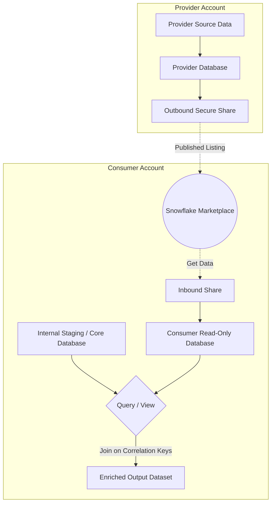

# 1. Snowflake Marketplace: Discovering and Correlating External Datasets

# 2. Overview
During data ingestion preparation, engineers evaluate whether internal datasets require external enrichment (e.g., appending weather data to sales records, or demographic data to customer profiles). 

The Snowflake Marketplace provides a mechanism to discover, evaluate, and immediately query third-party datasets without building traditional ETL/ELT pipelines. Underneath the marketplace interface, the architecture relies entirely on Snowflake's Secure Data Sharing capabilities. 

For SnowPro Advanced candidates, it is critical to understand how marketplace data is materialized in the consumer account, the privilege models required to mount it, the engine boundaries of read-only shared objects, and the SQL patterns used to correlate external provider data with internal consumer data.

# 3. Feature Summary

| Feature | Type | Purpose | Underlying Technology | Observable Output |
| :--- | :--- | :--- | :--- | :--- |
| **Standard Listing** | Data Product | Instant access to free or open datasets for enrichment. | Secure Data Sharing | Inbound Share -> Read-only Database |
| **Personalized Listing** | Data Product | Requested access for customized, premium, or account-specific datasets. | Secure Data Sharing | Inbound Share -> Read-only Database |
| **Data Correlation** | SQL Pattern | Joining external shared data with internal tables. | standard `JOIN` execution | Unified result set combining internal and external fields |

# 4. Architecture
The Snowflake Marketplace abstracts the complexity of creating shares and cross-region replication. The following diagram illustrates the logical architecture when a consumer mounts and correlates marketplace data.

# 5. Data Flow / Process Flow
1.  **Discovery:** The consumer searches the Snowflake Marketplace (via Snowsight) for datasets that match enrichment requirements (e.g., historical weather patterns).
2.  **Provisioning:** The consumer clicks "Get Data". Snowflake automatically creates an inbound share in the consumer's account and provisions a database from that share.
3.  **Exploration:** The consumer queries the newly created read-only database to analyze the schema, granularity, and available keys.
4.  **Correlation Identification:** The engineer identifies the "Correlation Keys"—common dimensions between the internal data and the marketplace data (e.g., Date, ZIP Code, ISO Country Code, Ticker Symbol).
5.  **Execution:** The engineer writes a SQL query or creates a secure view that `JOIN`s the internal database table with the marketplace database table using the identified correlation keys.
6.  **Materialization (Optional):** If the combined dataset requires heavy downstream processing, the consumer may write the result of the join into an internal table using `CREATE TABLE AS SELECT` (CTAS).

# 6. Logical Breakdown

### Component 1: The Marketplace Listing
*   **Responsibility:** Acts as a catalog entry and provisioning trigger.
*   **Mechanics:** Abstracts the `SHOW SHARES` and `CREATE DATABASE ... FROM SHARE` commands.
*   **Dependencies:** Requires the consumer account to be in a supported Snowflake region, or relies on the provider to have enabled cross-region auto-fulfillment.

### Component 2: The Consumer Shared Database
*   **Responsibility:** Materializes the external dataset in the consumer's namespace.
*   **Mechanics:** Exists as a first-class database object, but is entirely backed by the provider's storage.
*   **Constraints:** Strictly read-only. Consumers cannot execute `INSERT`, `UPDATE`, `DELETE`, or `GRANT` privileges on objects *inside* the database (though they can grant `IMPORTED PRIVILEGES` on the database itself).

### Component 3: Correlation Logic (The `JOIN`)
*   **Responsibility:** Merges the provider and consumer data domains.
*   **Mechanics:** A standard SQL `JOIN` spanning two distinct databases (`consumer_db.schema.table` joined with `marketplace_db.schema.table`).
*   **Failure Modes:** Join fan-outs due to grain mismatches (e.g., joining an internal daily sales table to a marketplace monthly demographic table without aggregating the sales data first).

# 8. Business Logic (Execution Logic)
*   **Entity Resolution:** Correlating external data often requires standardizing join keys. For example, internal data might store a state as "California", while the marketplace data uses "CA". The consumer must apply transformation logic (e.g., `CASE` statements or reference lookup tables) during the correlation query.
*   **Temporal Matching:** External datasets are often time-series based. Correlation requires joining on a standardized date field (`DATE_TRUNC('DAY', internal.timestamp) = marketplace.date`).
*   **Billing & Compute:** The provider pays for the storage of the underlying data. The consumer pays for the Virtual Warehouse compute credits used to query the marketplace database and perform the join.

# 10. Parameters / Variables / Configuration
*   **Cross-Region Auto-Fulfillment:** If the provider and consumer are in different cloud regions (e.g., AWS US-East vs. Azure West-Europe), standard listings can be automatically replicated to the consumer's region by Snowflake. The provider bears the replication cost.
*   **Trial Periods:** Personalized listings can be configured with trial access, automatically revoking the inbound share after a predefined timeframe.

# 14. Failure Handling & Recovery
*   **Provider Schema Drift:** 
    *   *Risk:* The provider alters a table structure (e.g., renames or drops a column) in the shared database, breaking the consumer's correlation queries or views.
    *   *Detection:* Scheduled tasks or downstream queries fail with "Invalid identifier" errors.
    *   *Mitigation:* Consumers should wrap marketplace data in abstracting views (`CREATE VIEW internal_view AS SELECT col1 FROM marketplace_db.table`). If the provider schema changes, the consumer only needs to update the view definition, preserving downstream pipeline integrity.
*   **Data Latency:**
    *   *Risk:* The provider delays their ETL process, meaning the marketplace data is stale relative to the consumer's internal data.
    *   *Mitigation:* Always validate the max timestamp or provider-supplied metadata tables before executing state-dependent transformations.

# 15. Security & Access Control
*   **Provisioning Privileges (Exam Critical):** By default, only the `ACCOUNTADMIN` role can "Get Data" from the marketplace or mount an inbound share.
*   **Delegation:** `ACCOUNTADMIN` can delegate this ability by granting the `IMPORT SHARE` privilege to a custom role.
*   **Query Access:** Once the database is created from the marketplace, the creating role must grant `IMPORTED PRIVILEGES ON DATABASE <marketplace_db>` to other internal roles to allow them to query the correlated data.
*   **Data Privacy:** Correlating data via joins is perfectly secure for the consumer. The provider has zero visibility into the consumer's queries, the consumer's internal data, or the results of the correlation.

# 16. Performance / Scalability Considerations
*   **Provider-Managed Clustering:** Because the consumer cannot alter the shared database, they cannot define clustering keys or materialized views directly on the marketplace tables. Join performance is highly dependent on how the provider clustered the source data.
*   **Local Materialization Strategy:** If a consumer queries a massive, poorly clustered marketplace dataset frequently, the consumer should use a scheduled task to extract the required slice of data into a local, consumer-owned table (`CTAS`) where the consumer can apply their own clustering keys and optimize for their specific query patterns.
*   **Cross-Database Join Overheads:** Joining massive tables across two databases (internal and marketplace) executes efficiently within the Snowflake engine, provided standard pruning and sargable predicates are applied to the `WHERE` clauses of both tables.

# 17. Assumptions & Constraints
*   **No Direct Cloning:** Consumers cannot use `CREATE DATABASE ... CLONE` or `CREATE TABLE ... CLONE` on objects derived from a marketplace share. Data must be explicitly copied using `SELECT` if a local, mutable copy is required.
*   **No Native Time Travel:** Consumers cannot use `AT` or `BEFORE` clauses to perform Time Travel queries on a marketplace database unless the provider explicitly maintains history tables or point-in-time snapshots in the share.
*   **Regional Availability:** Not all listings are available in all cloud regions. If a provider does not enable auto-fulfillment for a consumer's specific cloud provider and region, the listing will not appear or will require manual request processing.
