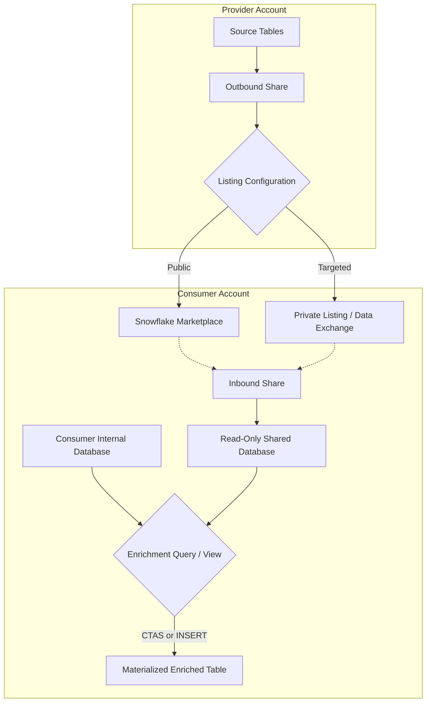

# 1. Secure Data Sharing for Data Enrichment

# 2. Overview
Secure Data Sharing is the underlying architecture that powers the Snowflake Marketplace, Internal Marketplaces (Data Exchanges), and Private Listings. It allows a consumer account to mount read-only, zero-copy datasets provided by external or internal entities. 

During the ingestion preparation phase, engineers use this feature to enrich existing internal datasets without building traditional ETL extraction pipelines. Enrichment occurs procedurally by joining consumer-owned tables with provider-owned shared tables.

For SnowPro Advanced candidates, mastering the distinctions between listing types, the specific privilege models required to mount and query shares, and the engine constraints on shared objects is mandatory.

# 3. Sharing and Listing Pattern Summary

| Listing / Share Type | Purpose / Audience | Visibility | Auto-Fulfillment (Cross-Region) |
| :--- | :--- | :--- | :--- |
| [**Standard Listing (Marketplace)**](Sharing and Listing Pattern Summary/Standard Listing (Marketplace).md) | Public, generic enrichment (e.g., weather, demographics). | Available to all Snowflake customers via Snowflake Marketplace. | Supported (if enabled by provider). |
| [**Private Listing**](Sharing and Listing Pattern Summary/Private Listing.md) | Direct, customized data sharing between specific businesses. | Visible only to specific, designated consumer account locator(s). | Supported. |
| [**Internal Marketplace (Data Exchange)**](Sharing and Listing Pattern Summary/Internal Marketplace (Data Exchange).md) | Hub-and-spoke sharing within a single corporate entity or conglomerate. | Visible only to invited member accounts within the Exchange hub. | Supported. |
| [**Direct Share**](Sharing and Listing Pattern Summary/Direct Share.md) | Legacy account-to-account sharing without the Listing wrapper. | No discoverability wrapper; direct DDL (`CREATE SHARE`). | Not natively supported (requires manual provider replication). |

# 4. Architecture
The following flowchart illustrates the architecture of data enrichment using shared datasets. Regardless of the listing type, the underlying metadata mechanism is identical.

# 5. Process Flow
1.  **Discovery/Targeting:** The consumer locates the dataset via the Marketplace UI, a Private Listing link, or an Internal Data Exchange hub.
2.  **Provisioning:** The consumer executes "Get Data" or the equivalent SQL (`CREATE DATABASE ... FROM SHARE`). Snowflake creates a read-only database referencing the provider's storage layer.
3.  **Privilege Delegation:** The provisioning role grants `IMPORTED PRIVILEGES` on the new database to the engineering or reporting roles.
4.  **Correlation Logic:** The engineer identifies the primary join keys between the shared dataset and the internal dataset.
5.  **Enrichment Execution:** A `JOIN` is executed. The engine pulls the required micro-partitions from the provider's storage, processes the join using the consumer's Virtual Warehouse, and returns the enriched result.
6.  **Materialization (Optional):** If the data requires transformation, re-clustering, or frequent access, the consumer writes the enriched output into a local table.

# 6. Logical Breakdown

### Component 1: The Inbound Share
*   **Responsibility:** Establishes the cross-account trust and metadata pointer.
*   **Mechanics:** Exists purely in the Cloud Services Layer. Consumes zero storage in the consumer account.
*   **Failure Modes:** Fails to mount if the provider account is in a different region/cloud and auto-fulfillment is not enabled.

### Component 2: The Shared Database
*   **Responsibility:** Materializes the share into the consumer's namespace.
*   **Mechanics:** Behaves like a standard database but is strictly immutable from the consumer's perspective.
*   **Dependencies:** Requires active provider maintenance. If the provider drops the underlying source table, the shared database instantly reflects the loss.

### Component 3: The Enrichment Object (View or Table)
*   **Responsibility:** Persists the correlation between internal and external data.
*   **Mechanics:** Typically implemented as a secure view (`CREATE SECURE VIEW enriched_data AS SELECT a.*, b.* FROM internal a JOIN shared_db.schema.b ON a.id = b.id`) or a materialized copy (`CTAS`).

# 8. Business Logic (Execution Logic)
*   **Grain Alignment:** External data often exists at a different granularity than internal data (e.g., internal transaction-level data vs. marketplace zip-code-level demographic data). The consumer must write SQL to handle one-to-many or many-to-one join relationships to prevent unintentional fan-outs (duplicate rows).
*   **Compute Cost Allocation:** In any data sharing scenario, the **Provider** pays for the physical storage of the data. The **Consumer** pays for the Virtual Warehouse compute credits required to query, join, and process the data.

# 10. Parameters / Variables / Configuration
*   **Cross-Region Auto-Fulfillment:** A provider parameter. If the consumer is in AWS US-East and the provider is in Azure West-Europe, Snowflake can automatically replicate the data to AWS US-East so the consumer can mount it. The provider incurs the replication compute and target storage costs.
*   **Listing Access Requests:** Private Listings can be configured to require approval. The consumer requests access, and the provider manually approves the consumer's account locator.

# 14. Failure Handling & Recovery
*   **Provider Schema Drift:**
    *   *Risk:* The provider renames or drops a column in the shared table, breaking the consumer's enrichment pipelines.
    *   *Detection:* Scheduled pipelines fail with "Invalid identifier" or missing object errors.
    *   *Recovery:* Consumers cannot control provider schemas. Mitigation requires building abstraction views over shared tables and monitoring provider release notes.
*   **Share Revocation:**
    *   *Risk:* The provider unpublishes the listing or revokes the share.
    *   *Detection:* The shared database becomes inaccessible.
    *   *Mitigation:* If continuous availability is critical, consumers must materialize (copy) the shared data into local tables periodically.

# 15. Security & Access Control
*   **Provisioning Role (Exam Critical):** Only the `ACCOUNTADMIN` role can mount a share or "Get Data" from a listing by default.
*   **Delegating Mount Privileges:** To allow non-admins to mount listings, `ACCOUNTADMIN` must execute: `GRANT IMPORT SHARE ON ACCOUNT TO ROLE <role_name>;`
*   **Querying Privileges (Exam Critical):** A database created from a share does not use standard `GRANT SELECT ON TABLE...` mechanics. The consumer must grant access to the entire database object using: `GRANT IMPORTED PRIVILEGES ON DATABASE <shared_db> TO ROLE <role_name>;`
*   **Data Privacy Boundary:** The provider cannot see the consumer's queries, execution plans, or internal tables.

# 16. Performance / Scalability Considerations
*   **Clustering Limitations:** Consumers cannot define clustering keys or run automatic clustering on tables inside a shared database. If the provider's clustering strategy does not align with the consumer's correlation keys, join performance will degrade.
*   **Materialization for Performance:** If joining a massively unoptimized shared table repeatedly, the consumer should execute a `CREATE TABLE AS SELECT` (CTAS) to localize the data. The consumer can then apply their own clustering keys to the local copy, trading storage cost for compute optimization.
*   **Result Caching:** Queries against shared tables utilize the consumer's 24-hour result cache. However, if the provider updates the underlying table, the consumer's cache is immediately invalidated.

# 17. Assumptions & Constraints
*   **Strictly Read-Only:** Consumers cannot execute `INSERT`, `UPDATE`, `DELETE`, `MERGE`, `TRUNCATE`, or `GRANT` (other than `IMPORTED PRIVILEGES`) on the shared database.
*   **No Cloning:** Consumers cannot execute `CREATE DATABASE ... CLONE` or `CREATE TABLE ... CLONE` against shared objects.
*   **No Time Travel (Consumer Side):** Consumers cannot use the `AT` or `BEFORE` clauses to query historical states of a shared table. The share always reflects the provider's current state. (Exception: if the provider explicitly shares a historical snapshot table).
*   **Region Matching:** Without Auto-Fulfillment enabled by the provider, data sharing strictly requires the provider and consumer to reside in the same cloud provider and identical region.
