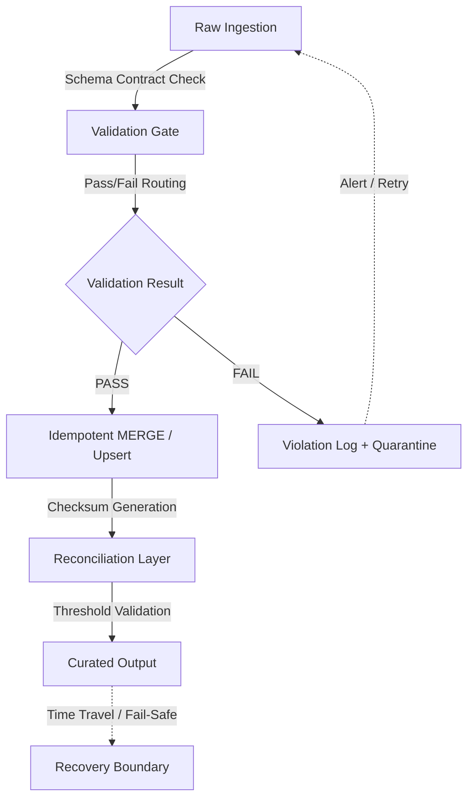

# Data Integrity

# 1. Title
SnowPro Advanced: Data Integrity & Quality Assurance Architecture

# 2. Overview
- **What it does**: Defines validation, constraint management, idempotent transformation, reconciliation, and recovery mechanisms for data entering and moving through Snowflake.
- **Why it exists**: Snowflake’s storage engine enforces `NOT NULL` and `DEFAULT` but treats primary keys, foreign keys, and unique constraints as informational. Without explicit pipeline-level integrity controls, pipelines silently ingest duplicates, break referential assumptions, and produce un-auditable results.
- **Where it fits**: Operates as a gate between raw ingestion and curated transformation. Validates schema contracts, enforces deduplication, computes checksums, and maintains recoverable state via Time Travel and Fail-Safe.
- **Intended consumer**: Data engineers, analytics engineers, QA/compliance teams, FinOps, and SnowPro Advanced candidates evaluating constraint behavior, transaction isolation, and recovery mechanics.

# 3. SQL Object Summary
| Field | Value |
|-------|-------|
| Object Scope | Data Integrity & Validation Pipeline |
| Type | Validation Gates + Constraint Auditing + Reconciliation Logic |
| Purpose | Prevent silent corruption, enforce pipeline idempotency, enable deterministic rollback |
| Source Objects | Landing tables, raw ingestion outputs, provider shares, intermediate CTEs |
| Output Object | Validated staging, checksum registry, constraint violation logs, curated tables |
| Execution Mode | Batch validation, incremental `MERGE`, scheduled reconciliation, on-demand Time Travel recovery |

# 4. Architecture
Integrity in Snowflake is not enforced by the storage engine for relational constraints. It must be architected into the pipeline through validation stages, deterministic joins, hash-based reconciliation, and controlled recovery windows.

# 5. Data Flow / Process Flow
| Step | Input | Transformation | Output | Purpose |
|------|-------|----------------|--------|---------|
| 1. Schema Contract Validation | Raw table, expected column/types | `TRY_CAST`, `NOT NULL` checks, `STRICT` mode alignment | Valid/invalid row flags | Enforce ingestion contract before transformation |
| 2. Deduplication & Key Resolution | Validated rows, business keys | `ROW_NUMBER() OVER(PARTITION BY key ORDER BY ts DESC) = 1` | Unique record set | Prevent double-counting on pipeline reruns |
| 3. Referential Check | Fact table, dimension keys | `LEFT JOIN` + `WHERE dim_key IS NULL` | Orphaned record log | Detect missing foreign references early |
| 4. Checksum & Aggregation Reconciliation | Curated batch, historical baseline | `MD5(CONCAT_WS('|', col1, col2))`, `SUM(metric)` vs threshold | Integrity score, drift flag | Validate row-level and aggregate consistency |
| 5. Commit & Retention Policy Application | Final curated table | `ALTER TABLE ... SET DATA_RETENTION_TIME_IN_DAYS`, `COMPRESS` | Optimized storage, recoverable state | Balance recovery window against storage cost |

# 6. Logical Breakdown of the SQL
| Component | Responsibility | Inputs | Outputs | Dependencies | Failure Modes / Risks |
|-----------|----------------|--------|---------|--------------|-----------------------|
| `CREATE TABLE ... CONSTRAINT` | Define informational PK/FK/Unique | Table DDL, column names | Metadata-only constraint registry | `INFORMATION_SCHEMA.TABLE_CONSTRAINTS` | Engineers assume enforcement; pipeline must handle violations manually |
| `NOT NULL` / `DEFAULT` Enforcement | Storage-level validation | Insert/load values, column definitions | Rejected rows or applied defaults | `COPY INTO`, `INSERT`, `MERGE` | `DEFAULT` masks missing data; `NOT NULL` halts load if `ON_ERROR = ABORT` |
| Deduplication CTE | Resolve duplicate keys | Raw/validated rows, business keys, timestamp | Ranked rows, `QUALIFY` filter | Deterministic `ORDER BY`, timezone alignment | Ties on timestamp produce non-deterministic winners |
| `MERGE` Idempotency | Upsert without duplication | Source staging, target curated | `INSERT`, `UPDATE`, `DELETE` actions | Exact join keys, `IS DISTINCT FROM` checks | Missing `IS DISTINCT FROM` triggers unnecessary updates, inflates Time Travel |
| Checksum Generation | Row-level integrity tracking | Curated columns, hash function | `MD5`/`SHA2` hash column | Consistent column order, null handling | `NULL` changes hash; requires `COALESCE` or `NVL` for stability |
| Reconciliation Query | Aggregate validation | Checksum registry, historical totals | Variance %, pass/fail flag | Stable grain, consistent aggregation window | Grain mismatch produces false positives, triggers unnecessary alerts |
| Time Travel Query | State recovery | Table name, timestamp/offset | Historical snapshot | `DATA_RETENTION_TIME_IN_DAYS` > 0, valid offset | Expired window returns error; storage cost scales with retention |

# 7. Data Model
| Entity | Role | Important Fields | Grain | Relationships | Keys | Null Handling |
|--------|------|------------------|-------|---------------|------|---------------|
| `VALIDATION_LOG` | Capture contract violations | `QUERY_ID`, `FILENAME`, `ROW_NUMBER`, `COLUMN_NAME`, `VIOLATION_TYPE` | 1 row = 1 validation failure | Feeds alerting pipeline | `VALIDATION_ID` (surrogate) | `NULL` allowed for optional fields; mandatory fields trigger quarantine |
| `CHECKSUM_REGISTRY` | Track row/aggregate integrity | `BATCH_ID`, `TABLE_NAME`, `ROW_COUNT`, `HASH_SUM`, `CREATED_TS` | 1 row = 1 validated batch | Compares to historical baselines | `BATCH_ID` + `TABLE_NAME` | `NULL` on failed batches; excluded from reconciliation |
| `CURATED_BASE` | Business-ready, deduplicated dataset | Surrogate keys, effective dates, metrics, `IS_ACTIVE` | Defined by business logic (e.g., daily per entity) | Consumed by BI/ML | Surrogate key, business key | Explicit defaults, `COALESCE` on critical paths |
| `CONSTRAINT_AUDIT` | Track informational constraint coverage | `TABLE_NAME`, `CONSTRAINT_TYPE`, `COLUMN_NAME`, `IS_ENFORCED` | 1 row = 1 constraint definition | Maps to `INFORMATION_SCHEMA` | `CONSTRAINT_NAME` | `NULL` if constraint dropped or altered |

**Output Grain**: Explicitly defined at `CURATED_BASE`. Integrity checks fail if upstream validation alters grain (e.g., dedup collapses 1:N into 1:1 without aggregation). Reconciliation must match the exact grain of the business metric.

# 8. Business Logic
| Rule | Effect | Implementation Pattern | Edge Case |
|------|--------|------------------------|-----------|
| **Constraint Behavior** | PK/FK/Unique act as optimizer hints, not enforcement | `PRIMARY KEY (...) NOT ENFORCED` | Pipeline assumes uniqueness; duplicate keys cause downstream join explosion |
| **Deduplication Priority** | Determines which record survives conflict | `ROW_NUMBER() ... ORDER BY load_ts DESC, source_priority ASC` | Equal priority + identical timestamp = non-deterministic result |
| **Null Propagation** | Controls missing data impact | `COALESCE(col, 'UNKNOWN')`, `NULLIF(col, '')` | Aggregations ignore `NULL`; division by zero if not guarded |
| **Effective Dating** | Tracks state changes over time | `MERGE` with `END_DATE` update, `CURRENT_FLAG` toggle | Overlapping ranges if `MERGE` order incorrect or timezones mismatched |
| **Reconciliation Threshold** | Defines acceptable variance before alert | `ABS(current - baseline) / NULLIF(baseline, 0) < 0.02` | Small baselines amplify variance; requires minimum row count guard |
| **Idempotent Upsert** | Ensures reruns don't duplicate or overwrite incorrectly | `MERGE ... WHEN MATCHED AND source IS DISTINCT FROM target THEN UPDATE` | Missing `IS DISTINCT FROM` causes unnecessary writes, inflating Time Travel storage |

# 9. Transformations
| Source | Derived | Formula / Rule | Business Meaning | Impact |
|--------|---------|----------------|------------------|--------|
| Raw string IDs | Surrogate keys | `MD5(CONCAT_WS('|', COALESCE(col1,''), COALESCE(col2,'')))` | Stable, deterministic join keys | Prevents drift across sources; `NULL` must be normalized first |
| Multiple timestamp columns | Unified event time | `GREATEST(created_ts, updated_ts, event_ts) AT TIME ZONE 'UTC'` | Single source of truth for sequencing | Eliminates late-arriving data ordering issues |
| Decimal metrics | Precision-aligned values | `CAST(col AS NUMBER(38,10))`, `ROUND()` after aggregation | Consistent financial/scientific rounding | Premature rounding causes cumulative drift in aggregates |
| Violation rows | Quarantine table | `INSERT INTO quarantine SELECT * FROM source WHERE TRY_CAST(col) IS NULL` | Isolate bad data without halting pipeline | Storage grows if source quality degrades; requires retention policy |
| Historical baseline | Current snapshot comparison | `LEFT JOIN current ON key WHERE current.hash <> historical.hash` | Detects delta without full re-scan | Reduces compute for integrity checks; requires stable hashing |

# 10. Parameters / Variables / Macros
| Name | Type | Purpose | Allowed Format | Default | Usage | Effect on Output |
|------|------|---------|----------------|---------|-------|------------------|
| `ON_ERROR` | Enum | Load failure behavior | `ABORT_STATEMENT`, `CONTINUE`, `SKIP_FILE_N`, `SKIP_FILE` | `ABORT_STATEMENT` | `COPY INTO` | Determines pipeline halt vs silent skip; affects validation log volume |
| `RETENTION_TIME` | Integer | Time Travel window | 0–90 days | 1 (Standard), 90 (Enterprise+) | `ALTER TABLE` | Controls recovery scope; scales storage linearly with duration |
| `STRICT` | Boolean | Column matching enforcement | `TRUE` / `FALSE` | `FALSE` | `COPY INTO` | `TRUE` fails on extra/missing columns; prevents silent schema drift |
| `ALLOW_DUPLICATES` | Boolean | Idempotency control during load | `TRUE` / `FALSE` | `FALSE` | `COPY INTO`, `INSERT` | `FALSE` errors on duplicate keys if constraint marked `ENFORCED` (rare) |
| `ISOLATION_LEVEL` | Enum | Transaction visibility | `READ_COMMITTED` (default), `SERIALIZABLE` (preview) | `READ_COMMITTED` | Session parameter | `READ_COMMITTED` sees data committed before query start; affects concurrent writes |
| `MAX_FAILSAFE_DAYS` | Integer | Post-Time Travel recovery | Fixed 7 days | 7 | System-enforced | Non-configurable; accessed via Snowflake Support only |

# 11. APIs / Interfaces
| Interface | Invocation Method | Input Structure | Output Structure | Error Behavior | Consumers |
|-----------|-------------------|-----------------|------------------|----------------|-----------|
| `INFORMATION_SCHEMA.TABLE_CONSTRAINTS` | `SELECT` | Table filters, constraint type filters | Constraint definitions, enforcement status | Returns informational only; no validation results | Schema auditors, CI/CD pipelines |
| `SYSTEM$CHECK_ROLES` / `GRANT` | SQL | Role names, privilege lists | Access validation | Fails if role lacks `OWNERSHIP`/`USAGE` | Security teams, pipeline automation |
| `AT` / `BEFORE` Time Travel Syntax | SQL | Table/view, timestamp, offset, or query ID | Historical snapshot | `Time travel data expired` if outside window | Data recovery, audit reconciliation, debugging |
| `VALIDATION_MODE` (Copy) | SQL | `RETURN_N_ROWS`, `RETURN_ERRORS`, `RETURN_ALL_ERRORS` | Error report without loading | Does not modify data; returns violations only | Pre-ingestion validation, dry runs |
| `ACCOUNT_USAGE.TABLE_STORAGE_METRICS` | `SELECT` | Table filters, date range | `ACTIVE_BYTES`, `TIME_TRAVEL_BYTES` | 45-min latency, requires `MONITOR` role | FinOps, retention optimization, cost tracking |

# 12. Execution / Deployment
- **Manual vs Scheduled**: Validation gates run inline with ingestion tasks. Reconciliation and checksum generation run post-merge on scheduled intervals.
- **Batch vs Incremental**: Initial load uses full validation. Subsequent runs use incremental `MERGE` with `STREAM` offset tracking. Checksums computed per batch, not per row.
- **Orchestration**: CI/CD pipelines inject validation SQL before `dbt run`. Airflow/Dagster manage dependency ordering: Ingest -> Validate -> Merge -> Checksum -> Alert.
- **Upstream Dependencies**: Source data quality, timezone consistency, warehouse availability, stream consumption state, retention policy alignment.
- **Environment Behavior**: Dev/Prod retention windows often differ. Test validation logic with production-scale duplicates and null patterns before deployment.
- **Runtime Assumptions**: `READ_COMMITTED` isolation means concurrent `MERGE` operations may overwrite each other if not ordered. Time Travel storage is billed separately from active storage.

# 13. Observability
| Metric | Implementation | Detection Method | Operational Threshold |
|--------|----------------|------------------|------------------------|
| Validation failure rate | `COUNT(*) FROM validation_log WHERE created_ts > NOW() - INTERVAL 1 DAY` | Task logs, alerting system | >5% = source degradation or schema drift |
| Deduplication collision rate | `COUNT(*) WHERE rn > 1 GROUP BY key HAVING COUNT(*) > 1` | Pre-merge CTE analysis | >0% non-deterministic ties = ordering rule insufficient |
| Time Travel storage ratio | `TIME_TRAVEL_BYTES / NULLIF(ACTIVE_BYTES, 0)` | `ACCOUNT_USAGE.TABLE_STORAGE_METRICS` | >30% = excessive reruns or retention misconfiguration |
| Checksum drift | `ABS(current_hash - baseline_hash) / NULLIF(baseline_hash, 0)` | Reconciliation query | >2% variance triggers investigation; 0% expected for identical loads |
| Orphaned foreign keys | `COUNT(*) FROM fact LEFT JOIN dim ON key WHERE dim.key IS NULL` | Referential check query | >0% = missing dimension records or late-arriving facts |

# 14. Failure Handling & Recovery
| Failure Scenario | What Breaks | Detection | Fallback Behavior | Recovery Approach |
|------------------|-------------|-----------|-------------------|-------------------|
| Constraint violation ignored | Duplicate keys inserted, joins explode | Row count spike, `MERGE` update count > expected | Pipeline continues silently; downstream breaks | Add pre-merge `QUALIFY` dedup, enforce `IS DISTINCT FROM`, log violations |
| Time Travel window expired | Cannot rollback to prior state | `AT`/`BEFORE` query returns error | No historical data available; must rely on backups | Export critical tables to external stage before window cutoff |
| Fail-Safe activation | Data corrupted beyond Time Travel | Storage engine flags corruption or manual request | 7-day non-configurable retention; accessed via Snowflake Support | Contact support; prepare audit logs and pipeline state for investigation |
| Non-deterministic dedup | Different record selected on rerun | Checksum drift, row count variance | Inconsistent downstream aggregations | Add deterministic tiebreaker (e.g., `METADATA$FILE_ROW_NUMBER`, `load_ts DESC, source_priority DESC`) |
| Schema drift with `STRICT=TRUE` | Load fails entirely | `COPY INTO` error, pipeline halt | No data loaded until schema aligned | Update `FILE_FORMAT`, coordinate with source, or temporarily switch to `STRICT=FALSE` with validation log |
| Concurrent `MERGE` race condition | Overlapping updates, lost writes | Update count mismatch, audit log shows duplicate actions | Data state inconsistent | Serialize `MERGE` via `TASK` dependency, use `STREAM` offset, or apply `LOCK` pattern if applicable |

# 15. Security & Access Control
| Control | Implementation | Effect |
|---------|----------------|--------|
| Role-based recovery access | `GRANT IMPORTED PRIVILEGES` on `ACCOUNT_USAGE`, restrict `UNDROP` to `ACCOUNTADMIN`/`SYSADMIN` | Prevents unauthorized rollback or schema restoration |
| Time Travel data isolation | Encrypted at rest, scoped to account region | Complies with data residency; accessible only via authenticated queries |
| Validation log masking | `DYNAMIC DATA MASKING` on `validation_log` sensitive fields | Hides PII or raw payloads from engineering roles without audit privileges |
| Constraint metadata exposure | `INFORMATION_SCHEMA` restricted to `USAGE` role | Limits schema visibility to authorized engineers and auditors |
| Fail-Safe access control | Non-user accessible; Snowflake internal process only | Ensures compliance with data retention regulations; prevents manual bypass |

# 16. Performance / Scalability Considerations
| Bottleneck | Cause | Tradeoff | Mitigation |
|------------|-------|----------|------------|
| Large dedup windows | Unbounded `PARTITION BY` in window functions | Memory spill, warehouse timeout | Narrow partitions, push filters before window, use `QUALIFY` instead of outer `WHERE` |
| Checksum computation cost | Hashing wide tables, frequent recomputation | High compute, pipeline latency | Hash only business-critical columns, compute incrementally on delta loads |
| `MERGE` key skew | Hot keys dominate update pattern | Warehouse spill, uneven partition distribution | Pre-cluster on join key, use `HASH` partitioning, split hot keys into separate batches |
| Repeated validation scans | Multiple CTEs re-reading raw table | Unnecessary compute, cache miss | Materialize validation gate, use `STREAM` for incremental checks, push filters early |
| Time Travel storage growth | High update frequency, long retention | Increased cost, slower metadata queries | Reduce retention to minimum viable, archive historical state to external storage, use zero-copy cloning for snapshots |
| Non-sargable null checks | `WHERE COALESCE(col, '') = ''` | Disables pruning, full scan | Filter on native type, use `IS NULL` or `IS NOT NULL` directly, add clustering if high cardinality |

# 17. Assumptions & Constraints
- **PK/FK/Unique constraints are informational**: Snowflake’s storage engine does not enforce relational constraints. Only `NOT NULL` and `DEFAULT` are enforced at load/insert time. All other integrity must be handled in pipeline logic.
- **Transaction isolation is `READ_COMMITTED`**: Statements see committed data at query start time. Concurrent `MERGE` operations may conflict if not serialized or keyed properly.
- **Time Travel maxes at 90 days**: Standard accounts default to 1 day. Enterprise+ allows up to 90. Fail-Safe is a fixed 7-day non-configurable period after Time Travel expires.
- **Hash collisions are mathematically possible**: `MD5`/`SHA2` are used for checksums, not cryptographic verification. Collision probability is negligible for BI workloads but not zero.
- `STRICT` mode applies to column matching during `COPY INTO`, not to data type enforcement at query runtime. Type coercion still occurs during `SELECT`.
- **Exam trap assumptions**: SnowPro Advanced explicitly tests constraint enforcement behavior, `READ_COMMITTED` isolation, Time Travel vs Fail-Safe boundaries, `ON_ERROR` routing, `STRICT` vs `ALLOW_DUPLICATES`, and `IS DISTINCT FROM` in `MERGE`. Memorize defaults and engine limits.

# 18. Future Enhancements
- **Automate constraint validation testing**: Integrate `INFORMATION_SCHEMA` constraint audits into CI/CD. Fail deployments if `NOT ENFORCED` constraints lack pipeline-level validation.
- **Implement probabilistic deduplication**: Use Bloom filters or approximate distinct functions for large-scale streaming ingestion where exact window dedup is cost-prohibitive.
- **Dynamic validation thresholds**: Replace static reconciliation percentages with time-series anomaly detection. Reduces false alerts during seasonal volume spikes.
- **Harden `MERGE` idempotency**: Standardize `IS DISTINCT FROM` across all upsert patterns. Add automated linting to detect unnecessary updates that inflate Time Travel storage.
- **Tiered retention policies**: Apply longer Time Travel windows only to curated tables requiring audit recovery. Reduce landing/staging retention to 1–7 days to control storage costs.
- **Integrate zero-copy cloning for snapshots**: Replace `CTAS` backups with `CREATE TABLE ... CLONE` for point-in-time validation. Eliminates storage duplication, accelerates recovery testing.
