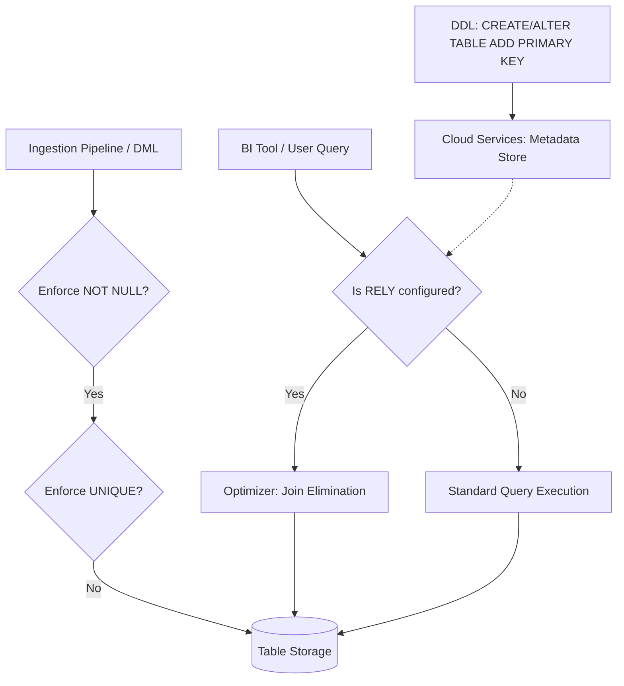

# 1. Defining Primary Keys for Data Integrity

# 2. Overview
In standard relational databases, primary keys are strictly enforced to guarantee row uniqueness. **In Snowflake, primary keys are not enforced during DML operations** (`INSERT`, `UPDATE`, `MERGE`, `COPY INTO`). 

Despite non-enforcement, defining primary keys is a critical step in the data ingestion preparation phase. Primary keys serve three primary purposes in Snowflake:
1.  **Metadata and Documentation:** Providing explicit entity resolution rules for data consumers and BI tools (e.g., Tableau, Looker) to auto-generate correct join paths.
2.  **Query Optimization:** Enabling the Snowflake query optimizer to perform Join Elimination when the `RELY` property is enabled.
3.  **Data Modeling:** Defining the required grain of the dataset, which dictates how downstream transformation pipelines must handle deduplication and idempotency.

For SnowPro Advanced candidates, understanding the distinction between constraint definition, constraint enforcement, and the `RELY` parameter is heavily tested.

# 3. Feature Summary

| Feature | Type | Purpose | Enforcement Level | Observable Behavior |
| :--- | :--- | :--- | :--- | :--- |
| **`PRIMARY KEY`** | Table Constraint | Uniquely identify a row logically. | **Not enforced** (Allows duplicates) | Visible in `SHOW PRIMARY KEYS` and `GET_DDL()`. |
| **`NOT NULL`** | Column Constraint | Prevent missing values in the key. | **Strictly enforced** | DML fails if `NULL` is inserted. Automatically applied to PK columns. |
| **`RELY`** | Constraint Property | Instructs the optimizer to trust the key for query rewrites. | Metadata directive | Optimizer eliminates unnecessary joins in the query plan. |

# 4. Architecture
The following diagram illustrates how primary keys function purely as metadata and optimizer directives, bypassing DML validation.

# 5. Process Flow
1.  **Granularity Definition:** The engineer determines the exact grain of the target table (e.g., `transaction_id` or `customer_id` + `date`).
2.  **Constraint Application:** The primary key is declared during `CREATE TABLE` or added via `ALTER TABLE ... ADD PRIMARY KEY`.
3.  **RELY Configuration (Optional):** If the upstream ingestion pipeline absolutely guarantees uniqueness (e.g., via a strict `MERGE` with deduplication), the engineer alters the constraint to add the `RELY` property.
4.  **Ingestion Execution:** Data is loaded. Snowflake enforces `NOT NULL` on the primary key columns but allows duplicate values.
5.  **Deduplication (Pipeline Logic):** Because Snowflake does not enforce uniqueness, the ingestion pipeline (tasks, stored procedures, or DBT models) must explicitly handle deduplication using `QUALIFY ROW_NUMBER()` or `MERGE` statements prior to or during the final load.

# 6. Logical Breakdown

### Component 1: Single-Column Primary Key
*   **Responsibility:** Define a standard surrogate or natural key.
*   **Mechanics:** `CREATE TABLE sales (sale_id VARCHAR PRIMARY KEY, amount NUMBER);`
*   **Exam Relevance:** Automatically applies the `NOT NULL` constraint to `sale_id`.

### Component 2: Composite Primary Key
*   **Responsibility:** Define uniqueness across multiple dimensions (e.g., a fact table grain).
*   **Mechanics:** Defined at the table level, not the column level.
    `CREATE TABLE daily_sales (date DATE, store_id INT, amount NUMBER, PRIMARY KEY (date, store_id));`

### Component 3: Out-of-Line vs Inline Declaration
*   **Responsibility:** Syntax structure for constraint creation.
*   **Mechanics:**
    *   *Inline:* Declared directly on the column (`col1 INT PRIMARY KEY`).
    *   *Out-of-line:* Declared at the end of the DDL or via `ALTER TABLE`. Required for composite keys.

# 8. Business Logic (Execution Logic)
*   **The Uniqueness Contract:** When an engineer defines a primary key in Snowflake, they are creating a contract that the *data pipeline* is responsible for enforcing uniqueness, not the *database engine*. 
*   **One Per Table:** A table can only have one active `PRIMARY KEY`. Attempting to add a second primary key will result in a compilation error. (Multiple `UNIQUE` constraints are allowed, but also unenforced).

# 10. Parameters / Variables / Configuration
*   **`RELY` / `NORELY` (Exam Critical):**
    *   *Default:* `NORELY`.
    *   *Purpose:* Tells the Snowflake Query Optimizer whether it can assume the data is perfectly unique despite the lack of engine enforcement. 
    *   *Usage:* `ALTER TABLE my_table ALTER PRIMARY KEY RELY;`
    *   *Effect:* If `RELY` is set on a Primary Key and a corresponding Foreign Key, the optimizer can perform "Join Elimination" (pruning a table from the execution plan if no columns from that table are projected and the join is guaranteed to be 1:1).

# 14. Failure Handling & Recovery
*   **Duplicate Key Ingestion (Silent Failure):**
    *   *Risk:* An upstream system sends duplicate records. Because the PK is not enforced, `COPY INTO` or `INSERT` will succeed, resulting in a join fan-out for downstream consumers.
    *   *Detection:* Requires scheduled data quality checks: `SELECT pk_col FROM table GROUP BY pk_col HAVING COUNT(*) > 1;`
    *   *Recovery:* Execute a deduplication query using `QUALIFY ROW_NUMBER() OVER (PARTITION BY pk_col ORDER BY update_timestamp DESC) = 1` and overwrite the table or delete the older duplicates.
*   **NULL Value Rejection (Hard Failure):**
    *   *Risk:* Upstream data contains `NULL` in the primary key column.
    *   *Detection:* The `COPY INTO` or `INSERT` statement fails explicitly with a constraint violation.
    *   *Mitigation:* Use `NULL_IF` during `COPY INTO` to handle specific string representations of null, or handle missing keys in a staging layer before loading into the core model.

# 16. Performance / Scalability Considerations
*   **Join Elimination with `RELY`:** Setting `RELY` on perfectly clean, deduplicated datasets is a zero-cost performance enhancement. If a BI tool generates bloated SQL joining 5 tables, but the user only selects columns from 3, Snowflake will drop the other 2 tables from the execution plan entirely, saving massive compute resources.
*   **Constraint Checking Overhead:** Because Snowflake skips uniqueness checks during load, ingestion performance (e.g., Snowpipe) scales linearly without the bottleneck of checking massive B-trees or hash indexes for duplicate values. The performance tradeoff is shifted from write-time to read/transformation-time.

# 17. Assumptions & Constraints
*   **Non-Enforcement Rule:** It is assumed the engineer understands that defining a PK does not physically prevent duplicates. This is the most frequently tested concept regarding constraints.
*   **Time Travel & Cloning:** When a table is cloned (`CREATE TABLE ... CLONE`), primary key constraints are cloned with it.
*   **CTAS Constraints:** `CREATE TABLE ... AS SELECT` (CTAS) **does not** copy primary key constraints from the source table to the new table. Constraints must be explicitly recreated using `ALTER TABLE`.
*   **Data Sharing:** Primary keys defined on a provider's table are visible to consumers in the shared database metadata (`SHOW PRIMARY KEYS IN DATABASE shared_db`), aiding consumer-side entity resolution.
