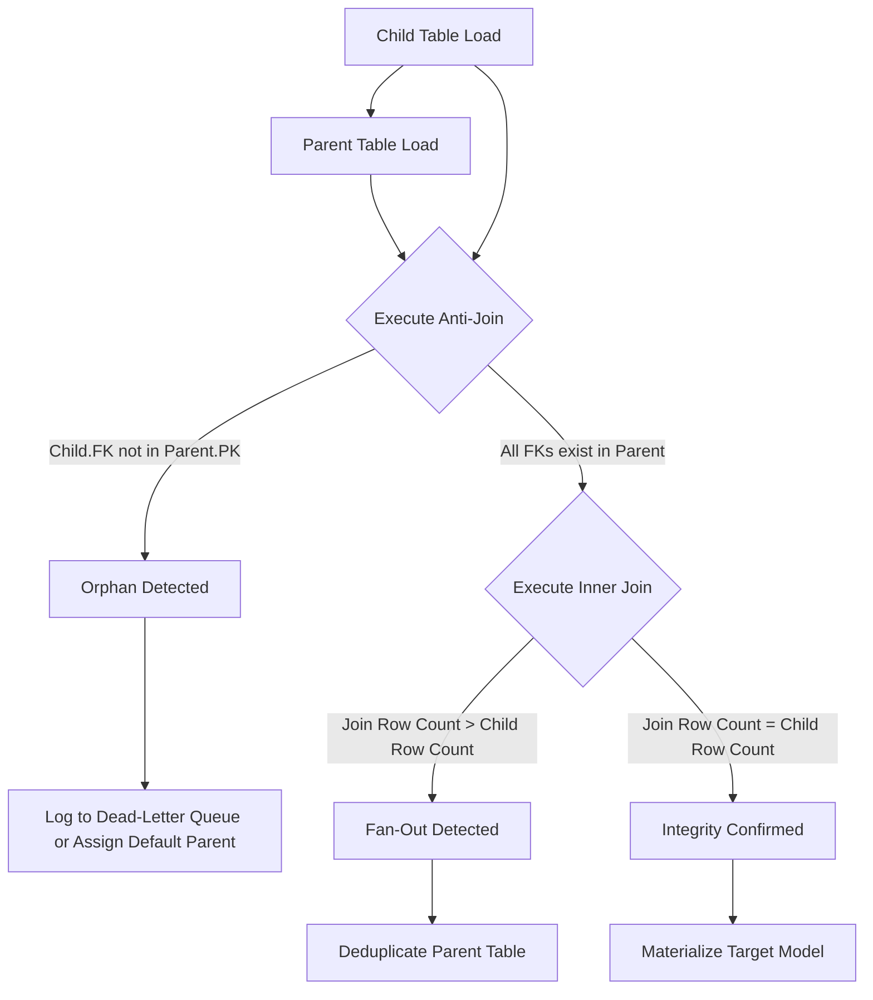

# 1. Table Joins for Parent-Child Data Integrity

# 2. Overview
In data warehousing, parent-child relationships typically represent one-to-many (1:N) hierarchies, such as Customers (parent) to Orders (child). In Snowflake, because `FOREIGN KEY` constraints are **not enforced** during data loading, referential integrity is not guaranteed by the storage engine. 

During the data ingestion preparation phase, engineers must perform declarative table joins to empirically validate data integrity. These joins are used to detect orphaned child records, identify missing parent records, and prevent join explosions (fan-outs) caused by duplicate primary keys before the data is materialized into final target tables or exposed to BI tools.

For SnowPro Advanced candidates, understanding how to use joins for integrity validation, how Snowflake handles `NULL` values in joins, and the performance implications of large parent-child aggregations is highly testable.

# 3. Join Pattern Summary

| Join Pattern | SQL Syntax Focus | Purpose in Integrity Checking | Observable Output |
| :--- | :--- | :--- | :--- |
| **Integrity Check (Missing Parent)** | `LEFT JOIN parent ON... WHERE parent.id IS NULL` | Identify "orphaned" child records that reference a non-existent parent. | Result set of invalid child records. |
| **Integrity Check (Missing Child)** | `LEFT JOIN child ON... WHERE child.id IS NULL` | Identify parent records with no associated activity/children. | Result set of childless parents. |
| **Cardinality Check (Fan-out Risk)** | `INNER JOIN` (coupled with row count compares) | Validate that the parent table does not contain duplicate keys. | Output row count > input child row count indicates failure. |
| **Standard Denormalization** | `LEFT JOIN parent ON child.fk = parent.pk` | Safely enrich child transaction data with parent dimensions. | Flattened dataset preserving all child records. |

# 4. Architecture
The following flowchart illustrates the procedural validation of a parent-child relationship during ingestion preparation.



# 5. Process Flow
Validating a parent-child relationship requires a sequence of analytical joins:

1.  **Orphan Detection (Anti-Join):** Execute a query selecting from the child table, left joining to the parent table, and filtering for where the parent key `IS NULL`. This identifies referential integrity violations.
2.  **Orphan Resolution:** If orphans exist, the pipeline must either drop them, quarantine them in an error table, or assign a surrogate "Unknown" parent record to preserve the facts.
3.  **Parent Uniqueness Check (Cardinality):** Ensure the parent table has strictly unique keys. If the parent table has duplicates, joining the child will multiply the child records (fan-out).
4.  **Join Execution:** Perform the final `INNER JOIN` or `LEFT JOIN` to combine the datasets.
5.  **Output Validation:** Verify that the output row count aligns with the expected grain (e.g., if enriching a child table with a 1:1 parent lookup, the output row count must exactly match the child table's initial row count).

# 6. Logical Breakdown

### Component 1: The Left Anti-Join (Orphan Check)
*   **Responsibility:** Detect referential integrity failures.
*   **Mechanics:** 
    ```sql
    SELECT c.* 
    FROM child_orders c 
    LEFT JOIN parent_customers p ON c.customer_id = p.customer_id 
    WHERE p.customer_id IS NULL;
    ```
*   **Outputs:** Returns only the rows in the child table that have an invalid or missing `customer_id`.

### Component 2: The Fan-Out Validation
*   **Responsibility:** Prevent data duplication during denormalization.
*   **Mechanics:** Compare `SELECT COUNT(*) FROM child` with `SELECT COUNT(*) FROM child JOIN parent ON...`.
*   **Failure Modes:** If the joined count is higher, the parent table violates its Primary Key constraint and must be deduplicated using `QUALIFY ROW_NUMBER() OVER(PARTITION BY parent_id ORDER BY load_date DESC) = 1` before proceeding.

### Component 3: Null-Safe Equivalence
*   **Responsibility:** Handle keys that may legitimately be `NULL` (though rare for PK/FK).
*   **Mechanics:** Standard Snowflake `JOIN ON a.id = b.id` evaluates `NULL = NULL` as `FALSE`. If null keys are expected to match, the join must use `EQUAL_NULL(a.id, b.id)` or `a.id IS NOT DISTINCT FROM b.id`.

# 8. Business Logic (Execution Logic)
*   **Left vs. Inner Join Semantics:** When enriching a child table (e.g., adding Customer Name to an Order), a `LEFT JOIN` from Child to Parent is standard to ensure no orders are dropped if a customer record is missing. An `INNER JOIN` acts as a strict filter, silently dropping orphaned child records. The choice depends on business rules for data loss tolerance.
*   **Surrogate Key Mapping:** In modern ELT, joins between parent and child are often executed on business keys (Natural Keys) during the staging phase to generate and assign deterministic Surrogate Keys (hashes) for the final dimensional model.

# 10. Parameters / Variables / Configuration
*   **`FOREIGN KEY` Constraint & `RELY`:** 
    *   Engineers can define the parent-child relationship via DDL: `ALTER TABLE child ADD FOREIGN KEY (parent_id) REFERENCES parent(id) RELY;`
    *   *Exam Critical:* Defining the FK does not enforce integrity. However, adding the `RELY` parameter instructs the Snowflake optimizer that it can trust the relationship.
    *   *Effect:* If a user queries the child table and joins the parent table, but *does not select any columns from the parent table*, the optimizer will skip the join execution entirely (Join Elimination), saving compute. This only works if `RELY` is set on both the PK and FK.

# 14. Failure Handling & Recovery
*   **Join Explosions (Cartesian Risk):**
    *   *Scenario:* A parent table with 1,000 duplicate keys joins to a child table with 1,000,000 rows. The result set balloons to billions of rows, consuming excessive compute and failing tasks.
    *   *Detection:* The query profile shows massive output rows from the JOIN node compared to the input nodes.
    *   *Recovery:* Abort the query. Cleanse the parent table of duplicates before attempting the join again.
*   **Data Type Mismatches:**
    *   *Scenario:* The parent key is a `VARCHAR` ('123') and the child key is a `NUMBER` (123).
    *   *Detection:* Snowflake will attempt implicit casting, but it can degrade join performance or fail entirely if the `VARCHAR` contains non-numeric characters.
    *   *Mitigation:* Explicitly cast the keys during the join (`ON CAST(c.id AS VARCHAR) = p.id`) or permanently alter the table columns to match.

# 16. Performance / Scalability Considerations
*   **Hash Joins and Memory Spills:** Snowflake executes most parent-child equijoins as Hash Joins. The engine builds a hash table of the smaller table (usually the Parent) in memory, and probes it with the larger table (Child). If the Parent table is too large for the warehouse's RAM, the operation spills to local disk (SSD) or remote disk (object storage), severely degrading performance. 
    *   *Mitigation:* Scale up the warehouse to provide more memory per node.
*   **Bloom Filtering:** Snowflake automatically utilizes bloom filters during hash joins. Filtering the parent table early in the query (e.g., `WHERE parent.status = 'ACTIVE'`) allows Snowflake to pass that filter down to the child table scan, pruning unnecessary micro-partitions before the join even occurs.
*   **Clustering on Join Keys:** If parent and child tables are massive (terabytes) and frequently joined, clustering both tables on their respective join keys (`parent_id`) colocates related records in micro-partitions, significantly speeding up join execution.

# 17. Assumptions & Constraints
*   **No Enforcement:** It is assumed the pipeline orchestrator handles all referential integrity logic, as Snowflake will allow `INSERT` statements that violate parent-child relationships.
*   **Case Sensitivity:** String-based join keys are strictly case-sensitive. 'A123' will not join to 'a123'. Standardize casing (`UPPER()`) before joining if the source data is volatile.
*   **Collation Limitations:** If the parent and child join keys have different collation settings (e.g., one is case-insensitive `en-ci`, the other is default), Snowflake cannot utilize optimal join algorithms or partition pruning, leading to performance degradation. Ensure collations match across PK/FK pairs.
