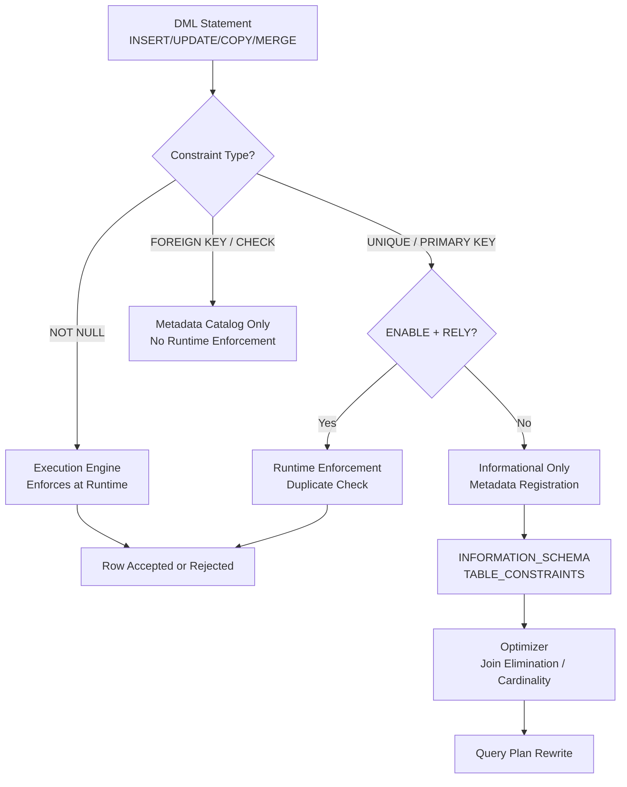

# 1. Implement Constraints in Snowflake

# 2. Overview

Snowflake supports table constraints to enforce or document data integrity rules during ingestion and storage. Constraints include `NOT NULL`, `UNIQUE`, `PRIMARY KEY`, `FOREIGN KEY`, and `CHECK`. However, Snowflake enforces only `NOT NULL` automatically. All other constraints are informational unless explicitly enabled via `ENABLE` or `RELY` properties, and even then, enforcement is limited.

This feature exists to:
- Prevent null values in critical columns during load operations
- Document relational integrity for query optimization and BI tools
- Support ETL frameworks and external tools that read constraint metadata from `INFORMATION_SCHEMA`
- Enable the Snowflake optimizer to use constraint metadata for join elimination and query rewrite

The intended consumers are data engineers designing ingestion pipelines, architects enforcing data contracts, and SnowPro Advanced exam candidates who must understand Snowflake's constraint enforcement boundaries.

# 3. SQL Object Summary

| Object/Feature | Type | Purpose | Source Objects or Inputs | Output Object or Observable Behavior | Execution Mode or Invocation Method |
|---|---|---|---|---|---|
| [`NOT NULL` constraint](SQL Object Summary/NOT NULL constraint.md) | Column constraint | Prevents null values in specified columns | `INSERT`, `UPDATE`, `COPY INTO`, `MERGE` statements | Rejected row with error `NULL result in a non-nullable column` | Enforced at DML execution time |
| [`UNIQUE` constraint](SQL Object Summary/UNIQUE constraint.md) | Table/column constraint | Documents uniqueness requirement; optionally enforced | `CREATE TABLE`, `ALTER TABLE` | Informational by default; enforced only if `ENABLE` is set and no duplicates exist | Metadata-only unless explicitly enabled |
| [`PRIMARY KEY` constraint](SQL Object Summary/PRIMARY KEY constraint.md) | Table constraint | Documents unique non-null identifier; optionally enforced | `CREATE TABLE`, `ALTER TABLE` | Informational by default; composite of `UNIQUE` + `NOT NULL` semantics | Metadata-only unless explicitly enabled |
| [`FOREIGN KEY` constraint](SQL Object Summary/FOREIGN KEY constraint.md) | Table constraint | Documents referential integrity between tables | `CREATE TABLE`, `ALTER TABLE` | Informational only; never enforced by Snowflake engine | Metadata registration only |
| [`CHECK` constraint](SQL Object Summary/CHECK constraint.md) | Column/table constraint | Validates expression evaluates to TRUE | `CREATE TABLE`, `ALTER TABLE` | Informational only; never enforced by Snowflake engine | Metadata registration only |
| [`RELY` property](SQL Object Summary/RELY property.md) | Constraint attribute | Signals to optimizer that constraint is trusted | `CREATE TABLE`, `ALTER TABLE` | Enables join elimination and cardinality estimation optimizations | Query planning time |

# 4. Architecture

Snowflake constraints operate at two layers: the metadata catalog layer, where constraints are registered in `INFORMATION_SCHEMA`, and the execution layer, where only `NOT NULL` is actively enforced during DML. The optimizer may read constraint metadata for query rewrite when `RELY` is specified.

# 5. Data Flow / Process Flow

## Step 1: Constraint Definition
- **Input:** `CREATE TABLE` or `ALTER TABLE` statement with constraint clause
- **Transformation:** Parser validates syntax and registers constraint in metadata catalog
- **Output:** Table definition with constraint metadata stored in `INFORMATION_SCHEMA.TABLE_CONSTRAINTS`
- **Purpose:** Establish data integrity rules or documentation

## Step 2: Data Ingestion
- **Input:** `INSERT`, `UPDATE`, `COPY INTO`, or `MERGE` statement
- **Transformation:** Execution engine evaluates each row against enforced constraints
- **Output:** Accepted rows committed; rejected rows raise error
- **Purpose:** Prevent invalid data from persisting

## Step 3: Constraint Validation (Optional)
- **Input:** Existing table data plus new `ENABLE` or `ADD CONSTRAINT` statement
- **Transformation:** Engine scans table to verify compliance with constraint rule
- **Output:** Constraint enabled if valid; error if violations found
- **Purpose:** Transition informational constraint to enforced state

## Step 4: Query Optimization
- **Input:** `SELECT` query with joins or filters referencing constrained columns
- **Transformation:** Optimizer reads `RELY` constraints to eliminate joins or refine cardinality
- **Output:** Optimized query plan
- **Purpose:** Improve execution performance using trusted metadata

# 6. Logical Breakdown

## Component: NOT NULL Enforcement
- **Responsibility:** Reject any DML operation that produces a null value in a constrained column
- **Inputs:** Row values, column metadata
- **Outputs:** Committed row or error `NULL result in a non-nullable column`
- **Dependencies:** None
- **Failure Modes:** `COPY INTO` with `ON_ERROR = 'CONTINUE'` may skip null rows silently depending on configuration

## Component: UNIQUE Constraint Metadata
- **Responsibility:** Document that column values must be unique
- **Inputs:** Column list, optional `ENABLE`/`DISABLE`/`RELY`/`NORELY`
- **Outputs:** Entry in `INFORMATION_SCHEMA.TABLE_CONSTRAINTS`
- **Dependencies:** Table must exist; columns must be valid
- **Failure Modes:** Enabling `UNIQUE` on a table with duplicates fails with constraint violation error

## Component: PRIMARY KEY Metadata
- **Responsibility:** Document unique non-null identifier for the table
- **Inputs:** Column list
- **Outputs:** Metadata entry implying `NOT NULL` + `UNIQUE`
- **Dependencies:** Implicitly requires `NOT NULL` on all key columns
- **Failure Modes:** BI tools may assume enforcement; Snowflake does not validate referential integrity

## Component: FOREIGN KEY Metadata
- **Responsibility:** Document parent-child relationship between tables
- **Inputs:** Child column(s), parent table, parent column(s)
- **Outputs:** Metadata entry only
- **Dependencies:** Parent table and columns must exist
- **Failure Modes:** Orphan inserts succeed; no cascade behavior exists

## Component: CHECK Constraint Metadata
- **Responsibility:** Document expression-based validation rule
- **Inputs:** Boolean expression
- **Outputs:** Metadata entry only
- **Dependencies:** Expression must be deterministic
- **Failure Modes:** Invalid expressions allowed at creation; never evaluated at runtime

## Component: Optimizer Constraint Utilization
- **Responsibility:** Use `RELY` constraints to improve query plans
- **Inputs:** Query plan, constraint metadata with `RELY = 'YES'`
- **Outputs:** Optimized plan with potential join elimination
- **Dependencies:** Accurate constraint metadata; user must ensure data actually complies
- **Failure Modes:** Incorrect `RELY` on non-compliant data produces wrong results

# 7. Data Model

## INFORMATION_SCHEMA.TABLE_CONSTRAINTS

| Column | Role | Important for |
|---|---|---|
| [`CONSTRAINT_NAME`](INFORMATION_SCHEMA.CONSTRAINT_COLUMN_USAGE/CONSTRAINT_NAME.md) | Identifier | Debugging constraint violations |
| [`CONSTRAINT_TYPE`](INFORMATION_SCHEMA.TABLE_CONSTRAINTS/CONSTRAINT_TYPE.md) | Classification | `PRIMARY KEY`, `UNIQUE`, `FOREIGN KEY`, `CHECK` |
| [`TABLE_NAME`](INFORMATION_SCHEMA.CONSTRAINT_COLUMN_USAGE/TABLE_NAME.md) | Context | Target table |
| [`ENFORCED`](INFORMATION_SCHEMA.TABLE_CONSTRAINTS/ENFORCED.md) | Enforcement flag | `YES` only for enabled `NOT NULL` and explicitly enabled `UNIQUE`/`PRIMARY KEY` |
| [`RELY`](Parameters  Variables  Configuration/RELY.md) | Optimizer hint | `YES` enables optimizer trust |

## Grain
One row per constraint per table.

## INFORMATION_SCHEMA.CONSTRAINT_COLUMN_USAGE

| Column | Role |
|---|---|
| [`CONSTRAINT_NAME`](INFORMATION_SCHEMA.CONSTRAINT_COLUMN_USAGE/CONSTRAINT_NAME.md) | Links to `TABLE_CONSTRAINTS` |
| [`TABLE_NAME`](INFORMATION_SCHEMA.CONSTRAINT_COLUMN_USAGE/TABLE_NAME.md) | Target table |
| [`COLUMN_NAME`](INFORMATION_SCHEMA.CONSTRAINT_COLUMN_USAGE/COLUMN_NAME.md) | Constrained column |

## Grain
One row per column per constraint.

# 8. Business Logic

## NOT NULL Enforcement Rule
- Any DML producing `NULL` in a `NOT NULL` column is rejected at the row level
- `COPY INTO` behavior depends on `ON_ERROR` mode; `SKIP_FILE` or `CONTINUE` may bypass individual rows
- Default column values do not satisfy `NOT NULL` unless explicitly defined via `DEFAULT`

## UNIQUE Enforcement Rule
- By default, `UNIQUE` is informational
- To enforce: create constraint with `ENABLE` or run `ALTER TABLE ... ENABLE CONSTRAINT`
- Enforcement requires a full table scan to validate existing data
- Snowflake does not create an implicit index for `UNIQUE`; enforcement is scan-based

## PRIMARY KEY Semantics
- Logically combines `NOT NULL` and `UNIQUE`
- Only one `PRIMARY KEY` per table
- Columns must explicitly or implicitly be `NOT NULL`

## FOREIGN Key Semantics
- Purely informational in Snowflake
- No referential integrity checking during insert, update, or delete
- No cascade delete or update behavior
- BI tools and query generators may use FK metadata for join suggestions

## CHECK Constraint Semantics
- Purely informational
- Expression is stored but never evaluated during DML
- Useful for documentation and external schema validation tools

## RELY Behavior
- When `RELY` is set, the optimizer assumes the constraint is accurate
- Enables join elimination: if a `PRIMARY KEY` - `FOREIGN KEY` relationship exists and `RELY` is set, redundant joins may be removed
- User is responsible for ensuring data actually complies; incorrect `RELY` produces incorrect results

# 9. Transformations

## Constraint Definition to Metadata Registration
- **Source:** SQL DDL statement
- **Output:** Catalog entry in `INFORMATION_SCHEMA`
- **Logic:** Parser extracts constraint type, columns, expression, and flags
- **Meaning:** Constraint is visible to tools and optimizer but may not be enforced
- **Impact:** Downstream ETL tools can read metadata to generate validation logic

## Informational to Enforced (UNIQUE/PRIMARY KEY)
- **Source:** Constraint with `ENABLE` flag or `ALTER TABLE ... ENABLE`
- **Output:** Enforced constraint with duplicate rejection
- **Logic:** Full table scan validates no duplicates exist; subsequent DML checks for duplicates
- **Meaning:** Data integrity is actively protected
- **Impact:** Insert performance degrades due to duplicate checking overhead

## DML Row to Validated Row
- **Source:** Input row from `INSERT`, `COPY INTO`, etc.
- **Output:** Committed row or error
- **Logic:** Engine checks `NOT NULL` columns; if enabled, checks `UNIQUE`/`PRIMARY KEY`
- **Meaning:** Only compliant data persists
- **Impact:** Failed rows must be handled via error tables or `VALIDATION_MODE`

# 10. Parameters / Variables / Configuration

| Name | Type | Purpose | Allowed Values | Default | Where Used | Effect |
|---|---|---|---|---|---|---|
| [`ENABLE`](Parameters  Variables  Configuration/ENABLE.md) | Constraint property | Activates runtime enforcement | `ENABLE`, `DISABLE` | `DISABLE` for `UNIQUE`/`PRIMARY KEY` | DDL | Enables duplicate rejection |
| [`DISABLE`](Parameters  Variables  Configuration/DISABLE.md) | Constraint property | Deactivates runtime enforcement | `ENABLE`, `DISABLE` | Default | DDL | Constraint is informational only |
| [`RELY`](Parameters  Variables  Configuration/RELY.md) | Constraint property | Signals optimizer to trust constraint | `RELY`, `NORELY` | `NORELY` | DDL | Enables query optimization |
| [`NORELY`](Parameters  Variables  Configuration/NORELY.md) | Constraint property | Prevents optimizer from using constraint | `RELY`, `NORELY` | Default | DDL | Constraint ignored by optimizer |
| [`ON_ERROR`](Parameters  Variables  Configuration/ON_ERROR.md) | COPY option | Controls behavior on constraint violation | `CONTINUE`, `SKIP_FILE`, `SKIP_FILE_<n>`, `ABORT_STATEMENT` | `ABORT_STATEMENT` | `COPY INTO` | Determines whether null violations abort load or skip rows |
| [`VALIDATION_MODE`](Parameters  Variables  Configuration/VALIDATION_MODE.md) | COPY option | Validates without loading | `RETURN_<n>_ROWS`, `RETURN_ALL_ERRORS` | None | `COPY INTO` | Preview errors without persisting data |

# 11. APIs / Interfaces

## Interface: INFORMATION_SCHEMA.TABLE_CONSTRAINTS
- **Invocation:** `SELECT * FROM INFORMATION_SCHEMA.TABLE_CONSTRAINTS WHERE TABLE_NAME = '...'`
- **Input:** Table name filter
- **Output:** Constraint metadata including type, enforced status, rely status
- **Error Behavior:** Returns empty set if no constraints or insufficient privileges
- **Consumers:** ETL tools, schema crawlers, DBAs

## Interface: SHOW PRIMARY KEYS
- **Invocation:** `SHOW PRIMARY KEYS IN TABLE <table_name>`
- **Input:** Table identifier
- **Output:** Primary key column list
- **Error Behavior:** Fails if table does not exist
- **Consumers:** BI tools, query generators

## Interface: SHOW FOREIGN KEYS
- **Invocation:** `SHOW FOREIGN KEYS IN TABLE <table_name>` or `SHOW IMPORTED KEYS`
- **Input:** Table identifier
- **Output:** Foreign key relationships
- **Error Behavior:** Fails if table does not exist
- **Consumers:** Data lineage tools, schema documentation

## Interface: ENABLE/DISABLE CONSTRAINT
- **Invocation:** `ALTER TABLE <t> {ENABLE | DISABLE} CONSTRAINT <name>`
- **Input:** Table and constraint names
- **Output:** DDL success or constraint violation error
- **Error Behavior:** Fails if existing data violates constraint
- **Consumers:** DBAs, deployment scripts

# 12. Execution / Deployment

## Manual Deployment
- Constraints are defined via `CREATE TABLE` or `ALTER TABLE` DDL
- `NOT NULL` is enforced immediately upon creation
- `UNIQUE` and `PRIMARY KEY` constraints require explicit `ENABLE` to enforce

## Batch Ingestion Impact
- `COPY INTO` operations against tables with `NOT NULL` constraints fail rows containing nulls
- Use `VALIDATION_MODE = 'RETURN_ALL_ERRORS'` to pre-validate files before loading
- For large loads, consider staging data in a temporary table without constraints, cleaning, then `INSERT` into constrained table

## Incremental Loads
- Incremental pipelines must handle constraint violations from source data drift
- `MERGE` operations evaluate `NOT NULL` constraints on both insert and update paths

## Environment Behavior
- Dev environments may omit constraints for flexibility; prod should enforce `NOT NULL` and enabled `UNIQUE` where required
- Constraint names must be unique per schema; deployment scripts should handle `IF NOT EXISTS` logic

# 13. Observability

## Row Count and Validation Checks
- Monitor rejected rows during `COPY INTO` via `VALIDATION_MODE` or error tables
- Query `INFORMATION_SCHEMA.LOAD_HISTORY` for load outcomes

## Metadata Monitoring
- Query `INFORMATION_SCHEMA.TABLE_CONSTRAINTS` to audit which constraints are enforced vs informational
- Compare constraint definitions across environments using `SHOW CONSTRAINTS`

## Data Quality Integration
- Since `CHECK` and `FOREIGN KEY` are not enforced, implement equivalent checks in ETL or use Stream/Task patterns for post-load validation

## Key Metrics
- Load rejection rate due to null violations
- Time to enable constraints on large tables (full scan duration)
- Query performance improvement from `RELY` join elimination

# 14. Failure Handling & Recovery

## Missing Source Data Leading to Nulls
- **What breaks:** `NOT NULL` constraint causes row rejection during load
- **Detection:** `COPY INTO` error output or `VALIDATION_MODE` preview
- **Fallback:** Load to staging table without constraints, apply `COALESCE` or default values, then insert
- **Recovery:** Fix source data or relax constraint temporarily

## Duplicate Rows in Source
- **What breaks:** Enabling `UNIQUE` or `PRIMARY KEY` fails if duplicates exist
- **Detection:** `ALTER TABLE ... ENABLE CONSTRAINT` returns violation error
- **Fallback:** Identify duplicates using `QUALIFY ROW_NUMBER() OVER (PARTITION BY ...)` and deduplicate before enabling
- **Recovery:** Clean data, then re-enable constraint

## Schema Drift
- **What breaks:** ETL adds new columns without `NOT NULL` defaults; existing loads fail
- **Detection:** Load errors or `VALIDATION_MODE` output
- **Fallback:** Add `DEFAULT` values or make new columns nullable initially
- **Recovery:** Backfill data, then apply `NOT NULL`

## Incorrect RELY Constraints
- **What breaks:** Optimizer eliminates joins or computes incorrect cardinality based on false constraint metadata
- **Detection:** Query results appear incorrect or cardinality estimates are wrong in query profile
- **Fallback:** Set `NORELY` to disable optimizer trust
- **Recovery:** Verify data compliance, then re-enable `RELY`

## Partial Execution
- **What breaks:** Multi-statement transaction aborts after constraint violation
- **Detection:** Transaction rollback
- **Fallback:** Use autonomous transactions or split into smaller batches
- **Recovery:** Identify violating rows, fix, and retry

# 15. Security & Access Control

## Privilege Requirements
- `CREATE TABLE` or `ALTER` privilege on the table to add constraints
- `OWNERSHIP` on the table to enable or disable constraints
- `SELECT` on `INFORMATION_SCHEMA.TABLE_CONSTRAINTS` to read metadata

## Sensitive Data
- Constraint definitions may expose business rules (e.g., `CHECK` expressions referencing sensitive columns)
- Metadata is visible to users with `SELECT` on `INFORMATION_SCHEMA`

## Row Access Policies
- Constraints are evaluated before row access policies; a null violation may prevent a row from being visible to policy evaluation
- Ensure `NOT NULL` constraints align with row access policy predicates

# 16. Performance / Scalability Considerations

## NOT NULL Overhead
- Minimal overhead; evaluated per row during DML with no additional I/O

## UNIQUE / PRIMARY KEY Enablement
- Requires full table scan to validate uniqueness
- On large tables, this is a long-running, warehouse-consuming operation
- No automatic index creation; enforcement relies on scan-based duplicate detection

## COPY INTO with Constraints
- `NOT NULL` validation is inline and efficient
- Large files with many null violations generate extensive error output; consider `ON_ERROR = 'SKIP_FILE'` to fail fast

## RELY and Query Optimization
- `RELY` constraints consume optimizer memory during plan generation
- Excessive or incorrect `RELY` constraints may lead to suboptimal plans if data does not actually comply

## Partition Pruning
- Constraints do not directly affect micro-partition pruning
- However, accurate cardinality from `RELY` constraints may improve join order selection

## Late Filtering
- Since `CHECK` constraints are not enforced, do not rely on them for filter pushdown
- Explicit `WHERE` clauses remain necessary for pruning

# 17. Assumptions & Constraints

## Explicit Assumptions
- The reader is implementing constraints as part of a data ingestion pipeline
- Source data may contain nulls, duplicates, or referential orphans that must be handled
- The environment uses Snowflake Enterprise or higher (required for some constraint features)

## Engine Boundaries
- `FOREIGN KEY` and `CHECK` constraints are **never enforced** by the Snowflake engine
- Only one `PRIMARY KEY` per table
- `UNIQUE` enforcement is opt-in via `ENABLE`
- Constraints do not support `DEFERRABLE` semantics

## Exam-Relevant Defaults
- Default for `UNIQUE` and `PRIMARY KEY`: `DISABLE` (informational only)
- Default for `RELY`: `NORELY`
- `NOT NULL` is the only constraint enforced by default
- `FOREIGN KEY` and `CHECK` are purely informational on all editions

## Ambiguities
- Snowflake documentation does not specify exact duplicate detection algorithm for enabled `UNIQUE` constraints
- Behavior of `COPY INTO` with `ON_ERROR` and `NOT NULL` may vary slightly based on file format and parsing options

# 18. Future Enhancements

- Implement pre-load validation using `VALIDATION_MODE` in all production pipelines to catch nulls before they hit constrained tables
- Replace informational `CHECK` constraints with actual ETL validation logic or external data quality frameworks
- For `UNIQUE` enforcement on large tables, consider using a hash-based deduplication staging pattern instead of relying solely on constraint enablement scans
- Add automated reconciliation queries that compare `FOREIGN KEY` metadata against actual parent-child data completeness
- Standardize `RELY` usage with data quality scorecards to ensure optimizer trust is justified
- Refactor ingestion pipelines to load into unconstrained staging tables, apply transformations and validation, then insert into production tables with enforced constraints
