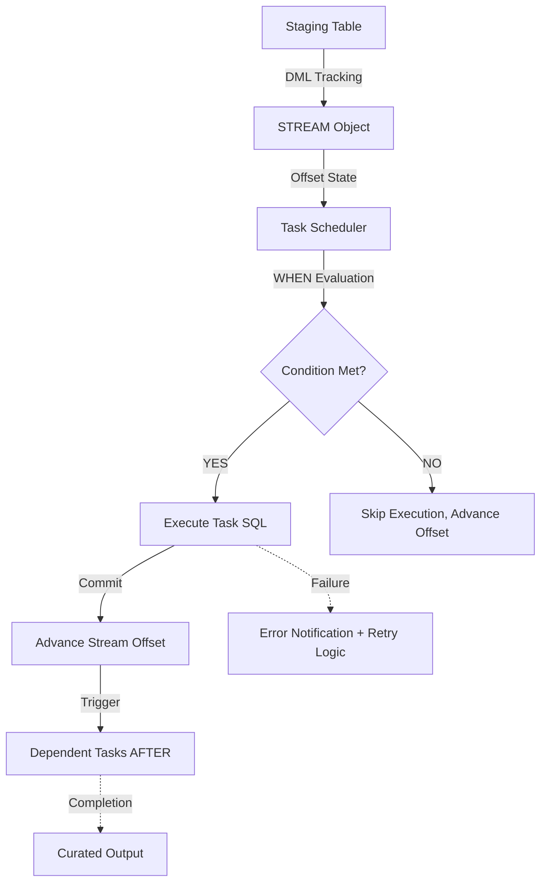

# Data Processing Pipelines

# 1. Title
SnowPro Advanced: Data Processing Pipelines & Orchestration Architecture

# 2. Overview
- **What it does**: Defines the execution framework, dependency resolution, state tracking, and error routing for incremental data transformation within Snowflake.
- **Why it exists**: Pipelines without explicit state management, idempotent design, or dependency controls produce duplicate data, silent failures, and untraceable lineage. Snowflake’s native task/stream model replaces external schedulers for many workloads, but requires strict operational discipline to avoid offset drift, warehouse contention, and DAG deadlocks.
- **Where it fits**: Sits between validated staging layers and curated consumption models. Orchestrates incremental extraction, transformation scheduling, conditional branching, and downstream triggering.
- **Intended consumer**: Data engineers, platform architects, orchestration leads, and SnowPro Advanced candidates evaluating task state management, stream offset semantics, serverless execution, and DAG topology.

# 3. SQL Object Summary
| Field | Value |
|-------|-------|
| Object Scope | Pipeline Orchestration & Incremental Execution Framework |
| Type | Task DAG + Stream Tracking + Conditional Execution |
| Purpose | Automate incremental transformation, enforce dependency ordering, manage execution state |
| Source Objects | `STREAM` objects, staging tables, materialized views, external orchestration triggers |
| Output Object | Curated tables, pipeline execution logs, offset registry, error notification payloads |
| Execution Mode | Scheduled (`SCHEDULE`), Event-driven (`STREAM` delta), Conditional (`WHEN`), Serverless or Warehouse-backed |

# 4. Architecture
Pipeline execution in Snowflake operates as a directed acyclic graph (DAG) where stream offsets track state, tasks define execution boundaries, and warehouses or serverless compute provide runtime resources. Dependency resolution and conditional branching prevent unnecessary execution and control fan-out.

# 5. Data Flow / Process Flow
| Step | Input | Transformation | Output | Purpose |
|------|-------|----------------|--------|---------|
| 1. Stream Initialization | Source table/view | `CREATE STREAM ... ON TABLE` | Offset pointer at current transaction ID | Establish incremental baseline for delta tracking |
| 2. Task Definition & Scheduling | Stream delta, SQL block, schedule | `CREATE TASK ... SCHEDULE` + `WHEN` condition | Scheduled task object with dependency graph | Bind execution cadence, resource allocation, and conditional logic |
| 3. Conditional Evaluation | `SYSTEM$STREAM_HAS_DATA`, stream metadata | `WHEN (SYSTEM$STREAM_HAS_DATA('STREAM_NAME'))` | Boolean execution gate | Skip empty runs, prevent offset advancement without work |
| 4. Execution & Offset Management | Task SQL, warehouse/serverless compute | DML execution, transaction commit | Stream offset advances only on success | Guarantee idempotency, prevent partial state corruption |
| 5. Dependency Resolution | `AFTER` task links | Scheduler evaluates completion status | Dependent tasks queue for execution | Enforce DAG ordering, prevent race conditions |
| 6. Error Routing & Recovery | Task failure, notification integration | Webhook, email, or Snowflake alert | Pipeline state logged, offset unadvanced | Enable retry, preserve recoverable state, notify operators |

# 6. Logical Breakdown of the SQL
| Component | Responsibility | Inputs | Outputs | Dependencies | Failure Modes / Risks |
|-----------|----------------|--------|---------|--------------|-----------------------|
| `CREATE STREAM` | Delta tracking & offset management | Source table/view, `APPEND_ONLY` flag | Offset pointer, `METADATA$ACTION` column | Source table must exist, role needs `OWNERSHIP` | Offset drift if task fails without rollback, stream retention expiry |
| `CREATE TASK` | Execution definition & scheduling | SQL block, schedule, warehouse/serverless flag | Task object, DAG node | Valid schedule syntax, role privileges | Syntax errors in `SCHEDULE` halt creation, missing warehouse blocks serverless fallback |
| `WHEN` Clause | Conditional execution gating | Stream state, system functions, variable checks | Boolean evaluation before task run | Functions must be deterministic, state accessible | Non-deterministic `WHEN` causes unpredictable skips; complex logic adds scheduler overhead |
| `AFTER` Dependency | DAG topology & execution ordering | Parent task name | Directed edge in task graph | Parent task must exist, no circular references | Circular dependencies halt DAG, missing parent breaks chain |
| `SYSTEM$TASK_DEPENDENTS_ENABLE/DISABLE` | DAG execution control | Task name | Activation/deactivation of child tasks | `ACCOUNTADMIN`/`TASK` role | Disabling root task silently halts entire downstream chain |
| `ERROR_NOTIFICATION` | Failure alerting | Integration object name | Webhook/email payload on task failure | Valid integration, network egress allowed | Missing integration causes silent failures, no retry visibility |
| `ALLOW_OVERLAPPING_EXECUTION` | Concurrency control | Boolean flag | Parallel vs serialized task runs | Task duration vs schedule interval | `FALSE` prevents queue buildup but causes schedule drift; `TRUE` risks resource contention |

# 7. Data Model
| Entity | Role | Important Fields | Grain | Relationships | Keys | Null Handling |
|--------|------|------------------|-------|---------------|------|---------------|
| `STREAM_METADATA` | Track incremental state | `STREAM_NAME`, `TABLE_NAME`, `STALE_AFTER`, `MODE` | 1 row = 1 stream definition | Maps to source table, consumed by tasks | `STREAM_ID` (internal), fully qualified name | `NULL` if stream dropped or source truncated |
| `TASK_EXECUTION_LOG` | Record run state & timing | `QUERY_ID`, `SCHEDULED_TIME`, `COMPLETED_TIME`, `STATE`, `ERROR_CODE` | 1 row = 1 task execution | Links to parent/child via `AFTER`, maps to `WAREHOUSE_METERING_HISTORY` | `QUERY_ID`, `TASK_RUN_ID` | `ERROR_CODE` null on success; `COMPLETED_TIME` null on running/queued |
| `OFFSET_REGISTRY` | Maintain consumption boundary | `STREAM_NAME`, `OFFSET_TS`, `LAST_COMMIT_QUERY_ID` | 1 row = 1 stream offset state | Updates only on successful task commit | `STREAM_NAME` + `OFFSET_TS` | `NULL` on initial creation; updated atomically with transaction |
| `DAG_DEPENDENCY_MAP` | Topology tracking | `PARENT_TASK`, `CHILD_TASK`, `ENABLED`, `DEPENDENCY_TYPE` | 1 row = 1 task link | References `TASK_DEFINITION` table, resolves execution order | Composite: `PARENT_TASK` + `CHILD_TASK` | `NULL` if task orphaned or dependency removed |

**Output Grain**: Determined at task completion. Each successful execution advances the stream offset to the transaction boundary. Failed executions preserve the offset, enabling exact rerun semantics. Grain mismatch between stream source and target causes duplicate inserts or skipped records.

# 8. Business Logic
| Rule | Effect | Implementation Pattern | Edge Case |
|------|--------|------------------------|-----------|
| **Idempotent Execution** | Reruns produce identical state | Stream consumption within single transaction, `MERGE` with `IS DISTINCT FROM` | Partial commits leave stream offset advanced; requires manual rollback or `SYSTEM$STREAM_RESET` |
| **Conditional Skip** | Prevents empty or unnecessary runs | `WHEN (SYSTEM$STREAM_HAS_DATA('STREAM_NAME'))` | Stream marked stale after retention expiry; `WHEN` evaluates false, offset never advances |
| **Dependency Ordering** | Enforces DAG execution sequence | `AFTER task_name` | Parent task fails; children remain queued until parent succeeds or is manually skipped |
| **Overlap Prevention** | Controls concurrent resource usage | `ALLOW_OVERLAPPING_EXECUTION = FALSE` (default) | Long-running task misses next schedule window; execution drifts until completion |
| **Offset Advancement** | Tracks consumed data boundary | Transaction commit advances offset only on success | Explicit `ALTER STREAM ... SET OFFSET` breaks pipeline state; requires audit trail |
| **Error Isolation** | Prevents failure cascades | Task-level retry, `ERROR_NOTIFICATION`, dependent task suspension | Downstream tasks continue if parent configured to ignore errors; data integrity compromised |

# 9. Transformations
| Source | Derived | Formula / Rule | Business Meaning | Impact |
|--------|---------|----------------|------------------|--------|
| `METADATA$ACTION` | Insert/Update/Delete routing | `CASE WHEN METADATA$ISUPDATE = TRUE THEN 'UPDATE' ELSE 'INSERT' END` | Stream delta classification | Enables `MERGE` logic, filters out deletes if `APPEND_ONLY` |
| `METADATA$ROW_ID` | Row-level deduplication key | Direct use in `ROW_NUMBER()` or `MERGE` join | Stable identifier across stream generations | Prevents duplicate processing during pipeline reruns |
| Stream offset timestamp | Execution boundary marker | `CURRENT_TIMESTAMP()` at commit | Marks exact consumption cutoff | Enables point-in-time recovery, audit trail alignment |
| `QUERY_HISTORY` join | Task performance attribution | `QUERY_ID` match to `WAREHOUSE`, `ROWS_INSERTED`, `EXECUTION_TIME` | Maps pipeline work to cost | Identifies bottlenecks, enables warehouse right-sizing |
| `SYSTEM$STREAM_HAS_DATA` | Execution gate state | Boolean evaluation against stream metadata | Controls task skip vs run | Reduces warehouse cold-start cost on empty cycles |

# 10. Parameters / Variables / Macros
| Name | Type | Purpose | Allowed Format | Default | Usage | Effect on Output |
|------|------|---------|----------------|---------|-------|------------------|
| `SCHEDULE` | String | Execution cadence | Cron syntax or `NUMBER MINUTE`/`HOUR` | None (required) | `CREATE TASK` | Determines run frequency; misalignment causes schedule drift or overlap |
| `WHEN` | Boolean Expression | Conditional execution gate | Deterministic SQL expression | None (optional) | Task definition | Skips execution if false; prevents offset advancement on empty deltas |
| `WAREHOUSE` | String | Compute allocation | Existing warehouse name | Serverless (if omitted) | Task definition | Warehouse tasks incur credit cost; serverless scales automatically but cold-starts |
| `ALLOW_OVERLAPPING_EXECUTION` | Boolean | Concurrency control | `TRUE` / `FALSE` | `FALSE` | Task creation | `FALSE` serializes runs; `TRUE` enables parallel execution, risks resource contention |
| `USER_TASK_TIMEOUT_MS` | Integer | Max execution duration | 0–86400000 ms | 3600000 (1 hour) | Account/Task parameter | Exceeding limit kills task, offsets remain unadvanced, triggers error notification |
| `ERROR_NOTIFICATION` | String | Failure alerting integration | Integration object name | None (optional) | Task definition | Enables webhook/email on failure; missing integration logs silently |

# 11. APIs / Interfaces
| Interface | Invocation Method | Input Structure | Output Structure | Error Behavior | Consumers |
|-----------|-------------------|-----------------|------------------|----------------|-----------|
| `CREATE/ALTER/DROP TASK` | SQL | Task name, schedule, SQL, dependencies | Task metadata object | Fails on invalid syntax, missing privileges, circular dependencies | Pipeline engineers, IaC tools |
| `SYSTEM$TASK_DEPENDENTS_ENABLE/DISABLE` | SQL | Task name, boolean flag | Success/failure status | Fails if task doesn't exist or role lacks privilege | Orchestration control, maintenance windows |
| `TABLE(INFORMATION_SCHEMA.TASK_HISTORY)` | SQL | Time range, task name, state filters | Execution records, state, error codes | Returns empty if no runs; requires `MONITOR`/`TASK` role | Auditing, alerting systems, FinOps |
| `SYSTEM$STREAM_HAS_DATA` | SQL | Stream name | Boolean | Returns `FALSE` on stale/empty streams | `WHEN` clause evaluation, conditional gating |
| `ALTER STREAM ... SET OFFSET` | SQL | Stream name, offset value | Offset reset confirmation | Breaks pipeline state if misused; requires audit | Recovery operations, manual offset correction |

# 12. Execution / Deployment
- **Manual vs Scheduled**: Tasks run automatically via `SCHEDULE`. Manual execution uses `EXECUTE TASK`. Serverless tasks auto-suspend; warehouse tasks require explicit resume or auto-resume configuration.
- **Batch vs Incremental**: Streams enable true incremental processing. Offset advances only after successful transaction commit, guaranteeing exactly-once semantics within task boundaries.
- **Orchestration**: Native DAGs use `AFTER` dependencies. External tools (Airflow, dbt, Dagster) trigger `EXECUTE TASK` or monitor `TASK_HISTORY`. Hybrid patterns combine Snowflake tasks for incremental loads and external schedulers for cross-system coordination.
- **Upstream Dependencies**: Stream availability, warehouse state, schedule validity, network egress for error notifications, role privileges.
- **Environment Behavior**: Dev/test often use smaller schedules, disabled error notifications, and manual offset resets. Prod requires serverless or auto-resume warehouses, strict `WHEN` gating, and integration-linked alerting.
- **Runtime Assumptions`: `READ_COMMITTED` isolation applies. Tasks cannot reference other tasks’ intermediate state. Stream retention defaults to 14 days; expired streams become stale and skip execution until reset. Max 1000 tasks per DAG. Scheduling precision: 1 minute (serverless), variable (warehouse-backed).

# 13. Observability
| Metric | Implementation | Detection Method | Operational Threshold |
|--------|----------------|------------------|------------------------|
| Task execution latency | `COMPLETED_TIME - SCHEDULED_TIME` in `TASK_HISTORY` | Query history, alerting system | >150% of baseline duration = warehouse contention or stream delta spike |
| Stream lag | `CURRENT_TIMESTAMP() - OFFSET_TS` | Stream metadata query | >2x schedule interval = pipeline bottleneck or task failure |
| Failure rate | `COUNT(*) WHERE STATE = 'FAILED' / TOTAL RUNS` | `TASK_HISTORY` aggregation | >5% sustained = SQL error, timeout, or upstream dependency failure |
| Schedule drift | `ACTUAL_START` vs `SCHEDULED_TIME` deviation | `TASK_HISTORY` timestamp comparison | >1 interval drift = long-running task, overlap misconfiguration, or warehouse cold start |
| Error notification delivery | Integration webhook response logs, `TASK_HISTORY` `ERROR_CODE` | External alert system verification | 0% delivery = misconfigured integration, network block, or missing privileges |

# 14. Failure Handling & Recovery
| Failure Scenario | What Breaks | Detection | Fallback Behavior | Recovery Approach |
|------------------|-------------|-----------|-------------------|-------------------|
| Task timeout | Execution killed mid-transaction | `STATE = 'FAILED'`, `ERROR_CODE` = timeout | Offset unadvanced, stream retains delta | Increase `USER_TASK_TIMEOUT_MS`, optimize SQL, split task into smaller stages |
| Stream staleness | Stream expired beyond retention | `SYSTEM$STREAM_HAS_DATA` returns `FALSE` despite source data | Task skips indefinitely, pipeline halts | `ALTER STREAM ... SET OFFSET` to current, re-validate delta, monitor retention |
| Warehouse unavailable | Task cannot acquire compute | `STATE = 'SCHEDULED'`, never transitions | Queue backs up, dependent tasks stall | Enable `AUTO_RESUME`, switch to serverless, verify warehouse status |
| Dependency failure cascade | Parent task fails, children queue indefinitely | `TASK_HISTORY` shows `BLOCKED`/`QUEUED` state | Pipeline stalls until parent succeeds or is manually skipped | Fix parent SQL, `EXECUTE TASK` manually, or `SYSTEM$TASK_DEPENDENTS_DISABLE` + re-enable |
| Overlapping execution resource contention | Multiple task instances run simultaneously | Warehouse queue spikes, query spill increases | Performance degradation, timeout risk | Set `ALLOW_OVERLAPPING_EXECUTION = FALSE`, adjust schedule, right-size warehouse |
| Error notification failure | Silent task failures, no alerts | External integration logs show 4xx/5xx, `TASK_HISTORY` shows error | Operators unaware of pipeline state | Verify integration credentials, test webhook, add secondary alerting via email |

# 15. Security & Access Control
| Control | Implementation | Effect |
|---------|----------------|--------|
| Role-based task ownership | `GRANT OWNERSHIP ON TASK TO ROLE` | Restricts modification to authorized engineers |
| Stream privilege separation | `SELECT` on stream, `USAGE` on source table | Prevents unauthorized offset manipulation |
| Warehouse execution grants | `USAGE`/`MONITOR` on warehouse assigned to task | Controls compute allocation, enforces cost boundaries |
| Error integration credentials | Secure integration with IAM/role binding | Protects webhook/auth secrets from pipeline SQL |
| Audit logging | `TASK_HISTORY` + `ACCESS_HISTORY` join | Tracks who created/modified tasks, when, and execution outcomes |

# 16. Performance / Scalability Considerations
| Bottleneck | Cause | Tradeoff | Mitigation |
|------------|-------|----------|------------|
| Large stream delta processing | High DML volume in single task execution | Warehouse timeout, spill, long offset lock | Split delta into batches using `LIMIT`/`OFFSET`, increase timeout, use serverless auto-scaling |
| Warehouse cold start latency | Serverless or suspended warehouse activation | Schedule drift, delayed dependent tasks | Pre-warm warehouse, use `AUTO_RESUME`, schedule tasks offset from peak load |
| Dependency chain bottlenecks | Linear DAG with sequential tasks | Total pipeline runtime = sum of task durations | Parallelize independent branches, merge small tasks, optimize critical path |
| Overlapping execution queue buildup | `ALLOW_OVERLAPPING_EXECUTION = TRUE` with long runs | Resource contention, credit overage | Serialize runs, adjust schedule interval, implement dynamic timeout scaling |
| Non-sargable `WHEN` conditions | Complex expressions in conditional gate | Scheduler overhead, evaluation latency | Use `SYSTEM$` functions, keep `WHEN` lightweight, push heavy logic into task SQL |
| Stream retention expiry | Default 14-day retention exceeded | Offset becomes stale, pipeline skips | Increase `RETENTION_TIME` on source table, implement offset archival, monitor staleness |

# 17. Assumptions & Constraints
- **No concrete SQL provided**: Documentation reflects canonical pipeline patterns for SnowPro Advanced. Exact behavior depends on schedule configuration, warehouse type, stream retention, and dependency topology.
- **Stream offset advances only on successful commit**: Failed or canceled tasks do not advance the offset. This guarantees idempotent reruns but requires explicit offset reset if stream staleness occurs.
- **Task isolation is transaction-scoped**: Each task runs as an independent transaction. Tasks cannot share temporary tables or session variables across executions.
- **Serverless tasks scale automatically but incur cold-start latency**: No warehouse management required, but first run after inactivation takes longer. Pricing is credit-based per execution duration.
- **Max DAG depth and task count limits**: Snowflake enforces limits on task chains and total tasks per account. Circular dependencies are rejected at creation.
- `READ_COMMITTED` isolation applies to all task executions. Concurrent DML on source tables may affect stream delta calculation if not sequenced.
- **Exam trap assumptions**: SnowPro Advanced tests stream offset advancement rules, `WHEN` clause evaluation timing, `ALLOW_OVERLAPPING_EXECUTION` behavior, `SYSTEM$` function usage, task state transitions, error notification setup, and DAG dependency resolution. Memorize defaults and state semantics.

# 18. Future Enhancements
- **Automate DAG visualization & dependency auditing**: Parse `TASK_HISTORY` and `INFORMATION_SCHEMA` to generate live dependency maps. Detect orphaned tasks, circular risks, and critical path bottlenecks.
- **Implement dynamic timeout scaling**: Adjust `USER_TASK_TIMEOUT_MS` based on historical execution duration and stream delta size. Reduces premature failures and unnecessary resource allocation.
- **Harden offset recovery workflows**: Build standardized `ALTER STREAM ... SET OFFSET` procedures with audit logging, pre-validation, and rollback safeguards. Prevents manual state corruption.
- **Integrate data quality gates**: Add pre-execution `WHEN` conditions that query validation tables. Skip tasks if source data fails contract checks, preventing downstream contamination.
- **Optimize serverless task scheduling**: Align task intervals with cloud provider auto-scaling cooldown periods. Reduces cold-start latency and credit waste.
- **Standardize error notification routing**: Centralize task failure alerts through a single integration object with retry logic, severity tagging, and escalation rules. Eliminates alert fatigue and silent failures.
