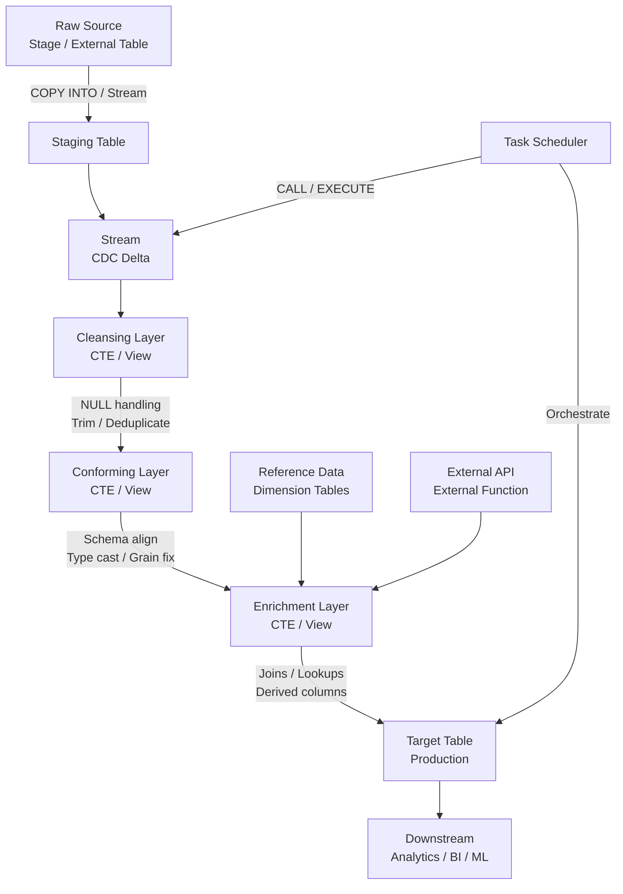

# 1. Cleanse, Conform, and Enrich Data in Snowflake

# 2. Overview

The cleanse-conform-enrich pipeline is a three-stage SQL transformation pattern that refines raw ingested data into production-ready datasets. It operates within Snowflake's elastic compute layer using standard SQL, user-defined functions (UDFs), streams, and tasks.

- **Cleanse:** Removes or repairs structural defects (nulls, malformed values, inconsistent casing, extraneous whitespace, duplicate rows, invalid types) before downstream consumption.
- **Conform:** Aligns data to a target schema, standardizes codes and formats, resolves grain mismatches, and applies business rules to ensure semantic consistency across sources.
- **Enrich:** Derives computed columns, integrates reference data, adds temporal or geospatial context, and supplements records with external or lookup-based attributes.

This pattern exists because raw data from `COPY INTO`, external tables, or streaming sources rarely meets quality, schema, or completeness requirements for analytics, ML, or operational reporting. The intended consumers are data engineers building ELT pipelines, analytics engineers modeling data, and SnowPro Advanced exam candidates who must understand incremental processing, stream semantics, and task orchestration.

# 3. SQL Object Summary

| Object/Feature | Type | Purpose | Source Objects or Inputs | Output Object or Observable Behavior | Execution Mode or Invocation Method |
|---|---|---|---|---|---|
| Staging Table | Table | Landing zone for raw data | `COPY INTO`, external tables, streams | Unvalidated rows in source format | Batch or continuous |
| Stream (CDC) | Stream object | Captures change set on source table | DML on staging or source table | Delta rows with metadata columns | Automatic, transaction-bound |
| Cleansing CTE/View | SQL pattern | Applies null handling, trimming, deduplication | Staging table or stream | Validated, standardized rows | Query-time or materialized |
| Conforming CTE/View | SQL pattern | Schema alignment, type coercion, grain fix | Cleansed output | Structurally consistent rows | Query-time or materialized |
| Enrichment CTE/View | SQL pattern | Joins, lookups, derived columns | Conformed output plus reference tables | Augmented rows with new attributes | Query-time or materialized |
| Target Table | Table | Production-ready dataset | Enrichment output | Clean, conformed, enriched rows | `INSERT` / `MERGE` / `CREATE TABLE` |
| Task | Schema object | Schedules or chains pipeline execution | SQL statement or stored procedure | Executed DML at interval or trigger | Time-based or predecessor-based |
| UDF / External Function | Function | Encapsulates complex transformation logic | Input row or column value | Transformed or looked-up value | Per-row invocation during query |
| MERGE Statement | DML pattern | Incremental upsert into target | Source stream/CTEs plus target table | Inserted, updated, or unchanged rows | Transactional |

# 4. Architecture

The pipeline follows a source-to-target ELT pattern with optional stream-based change data capture and task-based orchestration. Each stage is a logical SQL layer that can be executed as a single statement or decomposed into views/CTEs.

# 5. Data Flow / Process Flow

## Step 1: Ingestion to Staging
- **Input:** Raw files, streaming payloads, or external table scans
- **Transformation:** `COPY INTO` loads data into a staging table with VARIANT or loose typing; streams capture the delta
- **Output:** Staging table rows plus stream metadata (`METADATA$ACTION`, `METADATA$ISUPDATE`, `METADATA$ROW_ID`)
- **Purpose:** Isolate raw data from production schema and enable incremental processing

## Step 2: Cleansing
- **Input:** Staging table or stream delta
- **Transformation:** Apply `TRIM`, `NULLIF`, `COALESCE`, `TRY_CAST`, `REGEXP_REPLACE`, `IFF`, and window functions for deduplication
- **Output:** Rows with repaired nulls, standardized strings, removed duplicates, and validated types
- **Purpose:** Eliminate structural defects that break conforming logic or cause query failures

## Step 3: Conforming
- **Input:** Cleansed rows
- **Transformation:** Cast to target types, rename columns, align grain using aggregation or explosion, apply business rules via `CASE`, standardize codes via mapping joins
- **Output:** Rows that match the target schema and business semantics
- **Purpose:** Ensure semantic consistency and schema compatibility with downstream models

## Step 4: Enrichment
- **Input:** Conformed rows plus reference dimensions, geospatial data, or external function results
- **Transformation:** `LEFT JOIN` to dimension tables, invoke UDFs or external functions, compute derived columns (age, flags, categories), add `CURRENT_TIMESTAMP()` or region metadata
- **Output:** Augmented rows with additional context and computed attributes
- **Purpose:** Increase analytical value and reduce runtime computation in BI tools

## Step 5: Load to Target
- **Input:** Enriched rows
- **Transformation:** `MERGE` (upsert), `INSERT OVERWRITE`, or `CREATE OR REPLACE TABLE` into target
- **Output:** Production table with clean, conformed, enriched data
- **Purpose:** Persist results for downstream consumption

## Step 6: Orchestration (Optional)
- **Input:** Task schedule or predecessor completion
- **Transformation:** Task executes the pipeline SQL or calls a stored procedure
- **Output:** Executed DML, task history in `INFORMATION_SCHEMA.TASK_HISTORY`
- **Purpose:** Automate execution and maintain pipeline cadence

# 6. Logical Breakdown

## Component: Staging Table
- **Responsibility:** Hold raw data in its closest-to-source form
- **Inputs:** Files, streams, external queries
- **Outputs:** Unvalidated rows
- **Dependencies:** File format, stage, and load credentials
- **Failure Modes:** Schema drift in source files breaks `COPY INTO`; oversized VARIANT columns exceed 16MB limit

## Component: Stream (Change Data Capture)
- **Responsibility:** Expose only new or changed rows since last pipeline run
- **Inputs:** DML on source table
- **Outputs:** Delta rows with action flags
- **Dependencies:** Source table must exist; stream must be consumed to advance offset
- **Failure Modes:** Unconsumed stream grows stale; `METADATA$ISUPDATE` may present as delete+insert pair

## Component: Cleansing CTE
- **Responsibility:** Repair structural defects
- **Inputs:** Staging rows
- **Outputs:** Validated rows
- **Dependencies:** Business rules for null handling and format standards
- **Failure Modes:** Over-aggressive `TRIM` or `NULLIF` may discard valid data; `TRY_CAST` silently produces nulls on failure

## Component: Deduplication Logic
- **Responsibility:** Remove duplicate source rows
- **Inputs:** Rows with potential duplicates
- **Outputs:** Distinct rows
- **Dependencies:** Determination of uniqueness key
- **Failure Modes:** Wrong window partition causes false deduplication or retention of bad rows; `QUALIFY ROW_NUMBER()` requires careful ordering

## Component: Conforming CTE
- **Responsibility:** Align schema and semantics
- **Inputs:** Cleansed rows
- **Outputs:** Schema-compliant rows
- **Dependencies:** Target schema definition, code mapping tables
- **Failure Modes:** Type casts fail on unexpected formats; grain mismatches cause fan-out or fan-in errors

## Component: Enrichment CTE
- **Responsibility:** Add computed and looked-up attributes
- **Inputs:** Conformed rows, dimension tables, UDFs
- **Outputs:** Augmented rows
- **Dependencies:** Reference data availability, UDF determinism
- **Failure Modes:** `LEFT JOIN` to missing dimensions produces nulls; external function timeouts or rate limits stall query

## Component: MERGE Logic
- **Responsibility:** Incrementally load target table
- **Inputs:** Enriched source rows, existing target rows
- **Outputs:** Inserted or updated target rows
- **Dependencies:** Match key(s) and update predicates
- **Failure Modes:** Non-unique match keys cause join explosion; omitted `DELETE` clause leaves orphaned rows

## Component: Task Orchestrator
- **Responsibility:** Schedule and chain pipeline execution
- **Inputs:** Cron expression or predecessor task state
- **Outputs:** SQL execution, task history
- **Dependencies:** Warehouse availability, task owner privileges
- **Failure Modes:** Task suspension, warehouse auto-suspend mid-run, privilege revocation

# 7. Data Model

## Staging Table (Example Structure)

| Column | Role | Grain | Null Handling |
|---|---|---|---|
| `RAW_DATA` | VARIANT | One per source record | Nullable; holds entire payload |
| `LOAD_TIMESTAMP` | TIMESTAMP_NTZ | One per load batch | `DEFAULT CURRENT_TIMESTAMP()` |
| `FILE_NAME` | VARCHAR | One per source file | From `METADATA$FILENAME` |
| `ROW_NUMBER` | NUMBER | One per record | Computed during load |

## Stream on Staging Table

| Column | Role | Notes |
|---|---|---|
| `METADATA$ACTION` | Delta type | `INSERT` or `DELETE` |
| `METADATA$ISUPDATE` | Update flag | `TRUE` if update presented as delete+insert |
| `METADATA$ROW_ID` | Unique delta ID | Identifies specific change record |

## Target Production Table

| Column | Role | Grain | Source |
|---|---|---|---|
| `SURROGATE_KEY` | Primary identifier | One per business entity | Hash or sequence |
| `BUSINESS_KEY` | Natural identifier | One per business entity | Source system |
| `CLEANSED_ATTRIBUTE` | Cleaned value | One per entity attribute | Cleansing CTE |
| `CONFORMED_CODE` | Standardized code | One per entity attribute | Conforming CTE + mapping table |
| `ENRICHED_ATTRIBUTE` | Derived value | One per entity attribute | Enrichment CTE |
| `VALID_FROM` | Temporal start | One per entity version | Enrichment CTE |
| `VALID_TO` | Temporal end | One per entity version | Enrichment CTE |
| `LOAD_TIMESTAMP` | Audit timestamp | One per record | Pipeline execution time |

# 8. Business Logic

## Cleansing Rules
- **Null handling:** Replace empty strings, literal `'NULL'`, or whitespace-only values with SQL `NULL` using `NULLIF(TRIM(col), '')`
- **Whitespace:** Apply `TRIM`, `LTRIM`, `RTRIM` to all string fields; remove non-printable characters with `REGEXP_REPLACE`
- **Case standardization:** Convert codes and categories to uppercase or lowercase consistently using `UPPER`/`LOWER`
- **Date repair:** Use `TRY_TO_DATE` or `TRY_TO_TIMESTAMP` to catch malformed dates; apply fallback logic for known format variations
- **Type safety:** Use `TRY_CAST` instead of `CAST` to prevent query abortion on dirty data; route failed casts to error log or quarantine
- **Deduplication:** Identify duplicates by business key using `QUALIFY ROW_NUMBER() OVER (PARTITION BY business_key ORDER BY load_timestamp DESC) = 1`

## Conforming Rules
- **Schema alignment:** Map source column names to target schema using explicit aliases; ensure data types match target table definitions
- **Code standardization:** Join to mapping tables to convert source codes to canonical values (e.g., country codes, status codes)
- **Grain enforcement:** Aggregate to target grain when source is finer; explode or allocate when source is coarser
- **Business rule application:** Use `CASE` expressions to classify records, flag exceptions, or compute status based on attribute combinations
- **Unit conversion:** Standardize measurements to base units (e.g., currency to USD, weight to kg) using conversion tables or hardcoded rates with effective dates

## Enrichment Rules
- **Reference joins:** `LEFT JOIN` to dimension tables on business keys; validate that joins do not inadvertently filter source rows
- **Temporal enrichment:** Add `CURRENT_TIMESTAMP()` for processing time, or derive event timestamps using timezone conversions
- **Geospatial enrichment:** Use `ST_MAKEPOINT` or `ST_GEOGRAPHYFROMTEXT` if coordinates are present; join to spatial reference data
- **Derived flags:** Compute boolean indicators (e.g., `IS_PREMIUM`, `IS_OVERDUE`) using `CASE` or `IFF`
- **External augmentation:** Invoke external functions for data not available in Snowflake (e.g., API-based geocoding, scoring); handle null returns gracefully

## Incremental Load Rules
- **Stream consumption:** Read from stream to process only delta rows; ensure stream is consumed in same transaction as target `MERGE`
- **Upsert matching:** Match on business key or surrogate key; update when matched and changed; insert when not matched
- **Soft delete handling:** If source sends deletes, capture `METADATA$ACTION = 'DELETE'` and apply `VALID_TO` timestamp or status flag rather than hard delete

# 9. Transformations

## Raw to Cleansed
- **Source:** Staging table rows with potential defects
- **Output:** Rows with standardized formats and repaired nulls
- **Formula:** `COALESCE(NULLIF(TRIM(src_col), ''), 'DEFAULT')` or `TRY_CAST(src_col AS NUMBER)`
- **Meaning:** Structural normalization without semantic change
- **Impact:** Downstream conforming logic receives predictable inputs

## Cleansed to Conformed
- **Source:** Validated rows
- **Output:** Schema-aligned rows with standardized codes and correct grain
- **Formula:** `CASE WHEN status_code = 'A' THEN 'ACTIVE' ELSE 'INACTIVE' END`; `AGGREGATE(measure) GROUP BY grain_key`
- **Meaning:** Semantic alignment to business model
- **Impact:** Target table schema is satisfied; BI tools receive consistent dimensions

## Conformed to Enriched
- **Source:** Schema-compliant rows
- **Output:** Rows with additional computed and looked-up columns
- **Formula:** `LEFT JOIN dim_region r ON c.region_code = r.code`; `DATEDIFF(day, order_date, ship_date) AS fulfillment_days`
- **Meaning:** Augmentation with analytical context
- **Impact:** Reduces runtime computation; enables richer filtering and grouping

## Delta to Target (MERGE)
- **Source:** Stream or enriched CTE output
- **Output:** Inserted or updated target table rows
- **Formula:** `MERGE INTO target t USING source s ON t.key = s.key WHEN MATCHED AND t.hash <> s.hash THEN UPDATE ... WHEN NOT MATCHED THEN INSERT ...`
- **Meaning:** Idempotent incremental load
- **Impact:** Target reflects source state without full refresh; history preserved if type-2 logic applied

# 10. Parameters / Variables / Configuration

| Name | Type | Purpose | Allowed Values | Default | Where Used | Effect |
|---|---|---|---|---|---|---|
| `ON_ERROR` | COPY option | Controls load behavior on error | `CONTINUE`, `SKIP_FILE`, `ABORT_STATEMENT` | `ABORT_STATEMENT` | `COPY INTO` staging | Determines whether bad rows halt load or are quarantined |
| `PURGE` | COPY option | Removes files after load | `TRUE`, `FALSE` | `FALSE` | `COPY INTO` | Prevents reprocessing if `TRUE` |
| `VALIDATION_MODE` | COPY option | Pre-validate without loading | `RETURN_N_ROWS`, `RETURN_ALL_ERRORS` | None | `COPY INTO` | Catches errors before staging |
| `WAREHOUSE` | Task property | Compute for task execution | Valid warehouse name | None | `CREATE TASK` | Determines performance and cost |
| `SCHEDULE` | Task property | Execution cadence | `USING CRON ...` or `N MINUTES` | None | `CREATE TASK` | Defines pipeline frequency |
| `ERROR_INTEGRATION` | Task property | Notification target | Notification integration name | None | `CREATE TASK` | Alerts on task failure |
| `TIMEZONE` | Session parameter | Timestamp context | IANA timezone | `UTC` | Session | Affects `CURRENT_TIMESTAMP` and date functions |
| `TIMESTAMP_TYPE_MAPPING` | Session parameter | TIMESTAMP semantics | `TIMESTAMP_LTZ`, `TIMESTAMP_NTZ` | `TIMESTAMP_NTZ` | Session | Controls implicit timestamp types |
| `QUERY_TAG` | Session parameter | Pipeline identification | String | None | Session | Enables workload monitoring and cost attribution |

# 11. APIs / Interfaces

## Interface: Stream Query
- **Invocation:** `SELECT * FROM staging_table_stream WHERE METADATA$ACTION = 'INSERT'`
- **Input:** Stream object
- **Output:** Delta rows with metadata columns
- **Error Behavior:** Empty result if no new data or stream not consumed
- **Consumers:** Incremental pipeline SQL, task definitions

## Interface: MERGE Statement
- **Invocation:** `MERGE INTO target USING (SELECT ... FROM stream) ON key WHEN MATCHED ... WHEN NOT MATCHED ...`
- **Input:** Source subquery and target table
- **Output:** Applied insert/update/delete operations
- **Error Behavior:** Fails on constraint violation, join explosion, or warehouse timeout
- **Consumers:** Incremental load procedures, task bodies

## Interface: Task Definition
- **Invocation:** `CREATE TASK pipeline_task WAREHOUSE = '...' SCHEDULE = '...' AS <SQL>`
- **Input:** SQL statement or `CALL` to procedure
- **Output:** Scheduled execution, history in `INFORMATION_SCHEMA.TASK_HISTORY`
- **Error Behavior:** Suspends after consecutive failures if configured
- **Consumers:** Orchestration layer, DBAs

## Interface: UDF / External Function
- **Invocation:** `SELECT cleanse_udf(col), external_enrich(col) FROM staging`
- **Input:** Column values or row structures
- **Output:** Transformed or looked-up values
- **Error Behavior:** UDF exception aborts query; external function timeout returns null or error per configuration
- **Consumers:** Enrichment CTEs, conforming views

## Interface: INFORMATION_SCHEMA.TASK_HISTORY
- **Invocation:** `SELECT * FROM INFORMATION_SCHEMA.TASK_HISTORY(TASK_NAME => '...')`
- **Input:** Task name filter, date range
- **Output:** Execution records with state, duration, error details
- **Error Behavior:** Returns empty set if no history or insufficient privileges
- **Consumers:** Monitoring dashboards, operational alerts

# 12. Execution / Deployment

## Manual Execution
- Engineers run pipeline SQL ad hoc during development or backfill
- Uses explicit warehouse sizing for large transformations
- `CREATE OR REPLACE TABLE target AS SELECT ...` for full refresh

## Scheduled Execution (Tasks)
- Task executes pipeline on cron schedule or after predecessor task
- Task owner must have `EXECUTE TASK` privilege and warehouse usage rights
- Task tree can be suspended/resumed for maintenance windows

## Incremental Execution
- Stream-driven pipelines process only changed rows
- Stream must be consumed in same transaction as target DML to advance offset
- If stream is read without DML, offset does not advance and rows are reprocessed on next run

## Batch vs. Micro-batch
- Batch: Hourly or daily task execution reading accumulated stream data
- Micro-batch: Near-real-time using short task intervals (minimum 1 minute) or external orchestrators (Airflow, dbt) calling Snowflake

## Environment Behavior
- Development: Load to temporary targets, validate row counts and distributions
- Production: Enforce target constraints, use larger warehouses, enable task error integrations

# 13. Observability

## Row Count Validation
- Compare `SOURCE_COUNT`, `CLEANSED_COUNT`, `TARGET_COUNT` after each run
- Use `COUNT(*)` on stream before consumption to estimate delta size

## Data Quality Checks
- Null rate monitoring: `SELECT COUNT(*) / (SELECT COUNT(*) FROM target) FROM target WHERE col IS NULL`
- Distinct value checks on conformed codes to detect mapping gaps
- Referential integrity checks between enriched facts and dimension tables

## Task Monitoring
- Query `INFORMATION_SCHEMA.TASK_HISTORY` for run duration, success/failure states, and error messages
- Correlate with `QUERY_HISTORY` using `QUERY_TAG` to trace pipeline queries

## Stream Monitoring
- Check stream staleness: if `SYSTEM$STREAM_HAS_DATA('stream_name')` remains true unexpectedly, pipeline may be failing to consume

## Key Metrics
- Rows ingested vs. rows cleansed vs. rows loaded (drop-off indicates quality issues)
- Pipeline latency: time from source change to target availability
- Task failure rate and error categorization
- Warehouse credit consumption per pipeline stage

# 14. Failure Handling & Recovery

## Malformed Source Data
- **What breaks:** `COPY INTO` fails or `TRY_CAST` produces unexpected nulls
- **Detection:** `VALIDATION_MODE` preview, load error files, null rate spikes
- **Fallback:** Load to VARIANT staging column; apply cleansing logic before casting
- **Recovery:** Fix source file or adjust parsing logic; reprocess failed files

## Stream Offset Drift
- **What breaks:** Stream not consumed; delta grows large; pipeline processes stale data
- **Detection:** `SYSTEM$STREAM_HAS_DATA` remains true; target lag increases
- **Fallback:** Manual stream consumption or full refresh
- **Recovery:** Resume task, verify task owner privileges, check warehouse availability

## Join Explosion During Enrichment
- **What breaks:** `LEFT JOIN` to dimension table on non-unique key duplicates target rows
- **Detection:** Target row count exceeds source count unexpectedly
- **Fallback:** Add `QUALIFY ROW_NUMBER()` on dimension or validate key uniqueness
- **Recovery:** Deduplicate dimension, reload affected partition

## MERGE Match Key Collision
- **What breaks:** Non-unique match keys in source cause `MERGE` to fail with non-deterministic update
- **Detection:** Query error or unexpected target state
- **Fallback:** Pre-aggregate or deduplicate source before `MERGE`
- **Recovery:** Fix source grain, re-run pipeline

## External Function Failure
- **What breaks:** Enrichment API timeout or rate limit; external function returns null
- **Detection:** Null rate increase in enriched columns
- **Fallback:** Use cached lookup table or default values
- **Recovery:** Retry with backoff, or switch to batch enrichment pattern

## Task Suspension
- **What breaks:** Task enters suspended state after consecutive failures
- **Detection:** `TASK_HISTORY` shows `SUSPENDED` state
- **Fallback:** Manual task resume after root cause fix
- **Recovery:** Check error integration notifications, fix SQL or privileges, `ALTER TASK ... RESUME`

## Schema Drift
- **What breaks:** Source adds columns or changes types; conforming logic fails
- **Detection:** `COPY INTO` errors or `TRY_CAST` null spikes
- **Fallback:** Use VARIANT staging to absorb schema changes
- **Recovery:** Update conforming logic, alter target table if necessary

# 15. Security & Access Control

## Privilege Requirements
- `SELECT` on staging tables and streams
- `INSERT`, `UPDATE`, `DELETE` on target tables
- `USAGE` on warehouse and database
- `EXECUTE` on UDFs and external functions
- `OPERATE` on tasks for non-owners to resume/suspend

## Data Masking
- Apply masking policies on sensitive staging columns before enrichment
- Ensure derived columns in enrichment do not expose masked underlying data (e.g., partial email reconstruction)

## Row Access Policies
- If target table has row access policies, pipeline owner must have bypass privilege or policy must allow service role
- Test pipeline with same role as production task owner

## External Function Security
- External functions invoke AWS/Azure/GCP API gateways; ensure network policies and authentication tokens are scoped appropriately
- Do not pass PII to external enrichment APIs unless contractually approved and encrypted

## Secure UDFs
- Use `SECURE` keyword on UDFs containing sensitive business logic to prevent SQL introspection
- Grant `USAGE` on UDFs without exposing source code

# 16. Performance / Scalability Considerations

## Staging Table Scans
- Large staging tables scanned repeatedly for full refresh; use streams or partition pruning on `LOAD_DATE` to limit scan scope
- Clustering keys on staging tables improve stream consumption if filtered by load time

## Deduplication Overhead
- Window functions (`ROW_NUMBER`, `RANK`) for deduplication require sorting; expensive on large datasets
- Consider `QUALIFY` in CTE with appropriate `PARTITION BY` to minimize shuffle

## Join Performance in Enrichment
- `LEFT JOIN` to large dimension tables may trigger broadcast vs. shuffle decisions
- Ensure dimension tables have appropriate clustering or are small enough to broadcast
- Avoid cross-joins during grain alignment; verify join cardinality before production

## MERGE Performance
- `MERGE` on large target tables is expensive; ensure match keys are clustered or micro-partition pruning is effective
- Use `WHEN MATCHED AND source.hash <> target.hash THEN UPDATE` to avoid no-op updates that rewrite micro-partitions

## UDF and External Function Latency
- Row-level UDFs execute per row; scalar SQL UDFs may be inlined, but JavaScript/Python UDFs have invocation overhead
- External functions introduce network latency; batch enrichment via lookup tables is preferred for high-volume pipelines

## Warehouse Sizing
- Cleansing and conforming are CPU-bound (string manipulation, casts); larger warehouses help
- Enrichment with large joins is memory-bound; scale up to avoid spilling
- Tasks should use appropriately sized warehouses; avoid over-provisioning for small incremental batches

## Caching
- Result cache may return stale data if pipeline SQL is not deterministic; use `QUERY_TAG` to bypass cache during testing
- Warehouse cache benefits repeated pipeline stages in same session

# 17. Assumptions & Constraints

## Explicit Assumptions
- The reader is implementing an ELT pipeline within Snowflake using SQL-native transformations
- Source data lands in a staging table before cleansing begins
- Incremental processing is desired but not mandatory; full refresh is acceptable for small datasets

## Engine Boundaries
- Streams capture DML changes but not DDL; altering source table schema may require recreating stream
- Task minimum interval is 1 minute; sub-minute latency requires external orchestration
- `MERGE` supports at most one `UPDATE` and one `DELETE` clause per match condition
- External functions have timeout limits and concurrency limits per API gateway
- VARIANT columns limited to 16MB per row

## Exam-Relevant Defaults
- Stream offset advances only when stream is queried inside a DML transaction
- Task default state is `SUSPENDED`; must be explicitly resumed
- `COPY INTO` default `ON_ERROR` is `ABORT_STATEMENT`
- `TRY_CAST` returns `NULL` on failure rather than raising error
- `CURRENT_TIMESTAMP()` returns `TIMESTAMP_LTZ` by default; use `CURRENT_TIMESTAMP` for `TIMESTAMP_NTZ` depending on session parameter

## Ambiguities
- Snowflake does not guarantee stream ordering across multiple DML statements; pipeline must not assume strict temporal order
- Behavior of `METADATA$ISUPDATE` depends on source DML pattern; updates may appear as delete+insert pairs
- Exact optimizer behavior for view-defined pipelines vs. inline SQL may vary; materialized CTEs or tables may be needed for stability

# 18. Future Enhancements

- Replace inline cleansing logic with reusable SQL UDFs for standard transformations (trim, null-repair, date parsing) to reduce duplication across pipelines
- Implement quarantine tables for rows failing `TRY_CAST` or business rule validation, with automated alerting
- Add hash-based change detection (`HASH(*)`) in `MERGE` `WHEN MATCHED` clause to skip no-op updates and reduce micro-partition rewriting
- Migrate enrichment from row-level external functions to bulk lookup tables refreshed via external table or pipe for better throughput
- Implement dynamic SQL stored procedures for schema drift handling, where staging VARIANT is introspected and mapped automatically
- Add task error integration with Slack/PagerDuty for operational visibility
- Refactor monolithic pipeline SQL into layered views (cleansing view, conforming view, enrichment view) for easier testing and debugging
- Use `CLUSTER BY` on target table match keys to improve `MERGE` performance and partition pruning
- Implement type-2 slowly changing dimension logic using `VALID_FROM`/`VALID_TO` timestamps instead of destructive updates
- Add `QUERY_TAG` to all pipeline statements for unified cost and performance tracking in `ACCOUNT_USAGE.QUERY_HISTORY`
