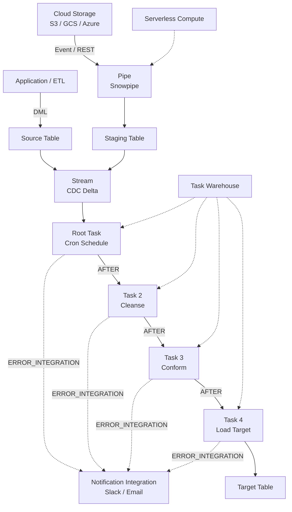

# 1. Automate and Implement Data Pipelines in Snowflake

# 2. Overview

Snowflake provides native automation primitives—**Tasks**, **Streams**, **Stored Procedures**, **Pipes**, and **Error Integrations**—to orchestrate data pipelines without external schedulers. These objects enable incremental, event-driven, or time-based execution of SQL transformations from ingestion through curation.

- **Tasks** execute SQL or call procedures on a schedule or after a predecessor task completes, forming directed acyclic graphs (DAGs) of pipeline stages.
- **Streams** capture change-data-capture (CDC) deltas on tables, views, or external tables, enabling incremental processing.
- **Stored Procedures** encapsulate multi-step logic in JavaScript, Python, SQL, or Scala, allowing conditional branching, dynamic SQL, and error handling.
- **Pipes** automate continuous micro-batch loading from cloud storage via Snowpipe.
- **Error Integrations** route task failure notifications to external systems (email, Slack, PagerDuty).

This feature set exists to eliminate manual pipeline execution, ensure repeatable data refreshes, enforce SLAs, and reduce latency between data arrival and availability. The intended consumers are data engineers designing production ELT/ETL workflows, platform architects building dataOps frameworks, and SnowPro Advanced exam candidates who must understand task graphs, stream semantics, privilege boundaries, and automation limits.

# 3. SQL Object Summary

| Object/Feature | Type | Purpose | Source Objects or Inputs | Output Object or Observable Behavior | Execution Mode or Invocation Method |
|---|---|---|---|---|---|
| Task | Schema object | Schedules or chains SQL/procedure execution | SQL statement, stored procedure call, predecessor task state | Executed DML/DDL, task history entry | Time-based cron or predecessor trigger |
| Stream | Schema object | Captures row-level changes on source object | DML on table, view, or external table | Delta rows with metadata action flags | Automatic, transaction-scoped |
| Stored Procedure | Schema object | Encapsulates imperative or dynamic SQL logic | Input arguments, session context | Result set, output parameters, side effects | `CALL` from task, SQL, or API |
| Pipe | Schema object | Automates file ingestion from external stage | Cloud storage events or REST call | Loaded rows in target table | Snowpipe serverless or pipe REST API |
| Error Integration | Notification object | Routes task failure/success alerts | Task state transitions | Notification payload to external endpoint | Automatic on task completion/failure |
| Task DAG / Tree | Dependency graph | Defines execution order across pipeline stages | Root task schedule, child task definitions | Serialized or parallel task execution | Implicit via `AFTER` clause |

# 4. Architecture

The automation architecture separates event capture (streams, pipes), orchestration (tasks), compute (warehouses or serverless), and observability (history views, error integrations). Tasks form a DAG where root tasks trigger on schedule and child tasks trigger on predecessor completion.

# 5. Data Flow / Process Flow

## Step 1: Event Ingestion
- **Input:** File arrival in cloud storage or DML on source table
- **Transformation:** Pipe loads files via Snowpipe, or application issues `INSERT`/`UPDATE`/`MERGE`
- **Output:** Rows in staging or source table; stream offset advanced
- **Purpose:** Make data available for downstream processing

## Step 2: Change Capture
- **Input:** DML transaction on source object
- **Transformation:** Stream appends metadata columns (`METADATA$ACTION`, `METADATA$ISUPDATE`, `METADATA$ROW_ID`) to changed rows
- **Output:** Queryable delta set in stream object
- **Purpose:** Isolate incremental changes from full table scans

## Step 3: Task Evaluation
- **Input:** Cron schedule fires or predecessor task completes successfully
- **Transformation:** Task scheduler evaluates whether stream has data (optional `WHEN SYSTEM$STREAM_HAS_DATA('stream_name')`) or executes unconditionally
- **Output:** Task enters `RUNNING` state; SQL or procedure is invoked
- **Purpose:** Trigger pipeline execution only when needed or on schedule

## Step 4: Pipeline Execution
- **Input:** Stream delta or full source table
- **Transformation:** Task SQL or stored procedure performs cleanse, conform, enrich, and load operations
- **Output:** Inserted, updated, or merged rows in target table
- **Purpose:** Transform and persist production-ready data

## Step 5: Error Handling
- **Input:** Task execution state (success, failure, skipped)
- **Transformation:** Error integration formats notification payload; failed tasks may suspend after consecutive failures
- **Output:** Alert to external system; task state updated in history
- **Purpose:** Notify operators and prevent cascading failures

## Step 6: Downstream Propagation
- **Input:** Target table state change
- **Transformation:** Subsequent streams capture target changes for further DAG stages
- **Output:** Cascading incremental updates through task tree
- **Purpose:** Maintain end-to-end data freshness

# 6. Logical Breakdown

## Component: Stream (CDC)
- **Responsibility:** Capture insert, update, and delete deltas on a table or view
- **Inputs:** DML transactions on source object
- **Outputs:** Virtual table of changes with metadata columns
- **Dependencies:** Source object must exist; stream must be consumed to advance offset
- **Failure Modes:** Unconsumed stream grows stale; DDL on source (drop/recreate) invalidates stream; `METADATA$ISUPDATE` presents updates as delete+insert pairs

## Component: Task (Scheduler)
- **Responsibility:** Execute SQL or procedure at defined intervals or upon predecessor completion
- **Inputs:** Schedule expression, warehouse specification, SQL body, optional `WHEN` condition
- **Outputs:** Query execution, task history record
- **Dependencies:** Warehouse must be available; task owner must have required privileges
- **Failure Modes:** Warehouse suspended or insufficient size; SQL error; privilege revocation; task suspended after consecutive failures

## Component: Task Graph (DAG)
- **Responsibility:** Define execution order and dependencies across pipeline stages
- **Inputs:** Root task with schedule, child tasks with `AFTER` clause
- **Outputs:** Serialized or parallel task execution
- **Dependencies:** All predecessor tasks must complete successfully for child to trigger
- **Failure Modes:** Broken predecessor chain halts downstream execution; cyclic dependencies prevent creation

## Component: Stored Procedure
- **Responsibility:** Encapsulate complex logic, dynamic SQL, error handling, and control flow
- **Inputs:** Arguments, session context, SQL statements
- **Outputs:** Result sets, return values, side effects (DML/DDL)
- **Dependencies:** Language runtime (JavaScript, Python, SQL, Scala); caller privileges
- **Failure Modes:** Uncaught exceptions abort transaction; JavaScript memory limits exceeded; dynamic SQL injection if inputs not sanitized

## Component: Pipe (Snowpipe)
- **Responsibility:** Automate file ingestion from cloud storage into staging tables
- **Inputs:** Cloud storage events (S3 SNS/SQS, GCS Pub/Sub, Azure Event Grid) or REST `insertFiles` calls
- **Outputs:** Loaded rows in target table; pipe history
- **Dependencies:** Stage, file format, target table, IAM/role trust
- **Failure Modes:** File format mismatch; authentication expiration; queue backlog; duplicate file loading if `FORCE = TRUE` misused

## Component: Error Integration
- **Responsibility:** Deliver task state change notifications to external endpoints
- **Inputs:** Task completion or failure event
- **Outputs:** JSON payload to notification integration (email, Slack, PagerDuty)
- **Dependencies:** Notification integration object; task `ERROR_INTEGRATION` binding
- **Failure Modes:** Notification integration misconfigured; network unreachable; payload size limits

## Component: Warehouse Provisioning
- **Responsibility:** Provide compute for task execution
- **Inputs:** Task `WAREHOUSE` parameter or serverless compute assignment
- **Outputs:** Query execution resources
- **Dependencies:** Warehouse must be running or set to auto-resume; credits available
- **Failure Modes:** Auto-suspend mid-query; resource monitor throttling; insufficient privileges to use warehouse

# 7. Data Model

## INFORMATION_SCHEMA.TASK_HISTORY

| Column | Role | Grain | Notes |
|---|---|---|---|
| `NAME` | Task identifier | One per task execution | Includes schema-qualified name |
| `DATABASE_NAME` | Context | One per task | Task database |
| `SCHEMA_NAME` | Context | One per task | Task schema |
| `QUERY_ID` | Execution trace | One per task run | Joins to `QUERY_HISTORY` |
| `CONDITION_TEXT` | WHEN clause | One per task definition | Stream condition or boolean |
| `STATE` | Outcome | One per run | `SCHEDULED`, `RUNNING`, `SUCCEEDED`, `FAILED`, `CANCELLED`, `SKIPPED` |
| `ERROR_CODE` | Failure classification | One per failed run | Null if succeeded |
| `ERROR_MESSAGE` | Failure detail | One per failed run | Null if succeeded |
| `SCHEDULED_TIME` | Intended start | One per run | Cron-derived or predecessor-derived |
| `COMPLETED_TIME` | Actual end | One per run | Used for duration calculation |
| `RUN_ID` | Instance identifier | One per run | Unique within task history |

## Grain
One row per task execution per task.

## INFORMATION_SCHEMA.STREAMS

| Column | Role | Notes |
|---|---|---|
| `STREAM_NAME` | Identifier | |
| `TABLE_NAME` | Source object | Table, view, or external table |
| `TABLE_DATABASE` | Source context | |
| `TABLE_SCHEMA` | Source context | |
| `STALE` | Offset status | `TRUE` if source DDL changed |
| `OWNER` | Privilege context | |

## Target Audit Table (Recommended Pattern)

| Column | Role | Grain | Source |
|---|---|---|---|
| `SURROGATE_KEY` | Primary key | One per record | Hash or sequence |
| `BUSINESS_KEY` | Natural key | One per entity | Source system |
| `PIPELINE_NAME` | Traceability | One per record | Task name or procedure |
| `RUN_ID` | Execution trace | One per record | Task run or session |
| `LOAD_TIMESTAMP` | Audit time | One per record | `CURRENT_TIMESTAMP()` |
| `SOURCE_STREAM` | Provenance | One per record | Stream or table name |

## Grain
One row per business entity per load cycle.

# 8. Business Logic

## Task Scheduling Logic
- Root tasks trigger based on cron expression (`USING CRON '...'`) or interval (`N MINUTES`)
- Cron uses UTC unless timezone specified
- Child tasks trigger only after all predecessor tasks in `AFTER` clause complete successfully
- A task with `WHEN` clause executes only if the boolean condition evaluates to `TRUE`; if `FALSE`, state is `SKIPPED`

## Stream Consumption Semantics
- Stream offset advances only when the stream is queried inside a DML transaction that commits
- Reading a stream in a `SELECT` without DML does not advance the offset
- If a task reads a stream but the DML fails and rolls back, the offset does not advance; rows remain in stream for next run
- `SYSTEM$STREAM_HAS_DATA('stream_name')` returns `TRUE` if unconsumed deltas exist

## Task Graph Execution Rules
- Predecessor tasks must all succeed for a child task to be scheduled
- If any predecessor fails, the child is not scheduled until the predecessor succeeds on a subsequent run
- Tasks in a graph execute with the privileges of the task owner, not the user who created the DAG
- Task trees are acyclic; cyclic dependencies are rejected at creation time

## Error and Retry Logic
- Tasks do not automatically retry on failure unless implemented within a stored procedure
- After a configurable number of consecutive failures, a task automatically suspends
- Error integrations fire on state transitions to `FAILED` (and optionally `SUCCEEDED`)
- A suspended task must be manually resumed via `ALTER TASK ... RESUME`

## Idempotency Requirements
- Pipelines must be designed to be rerunnable without duplicating data
- Use `MERGE` with hash-based change detection or stream-driven deltas to ensure idempotency
- Avoid unconditional `INSERT` from stream without deduplication if task may rerun

## Pipe Ingestion Logic
- Snowpipe loads files in micro-batches as they arrive
- Pipe maintains a ledger of loaded files to prevent duplicates; do not use `FORCE = TRUE` in production
- File ordering is not guaranteed; downstream tasks must handle out-of-order arrival if business logic requires sequencing

# 9. Transformations

## Source Change to Stream Delta
- **Source:** DML on table or view
- **Output:** Stream rows with metadata flags
- **Logic:** Stream captures before/after images for updates, inserts for new rows, deletes for removed rows
- **Meaning:** Isolation of incremental changes from base table state
- **Impact:** Enables efficient incremental pipelines without full table scans

## Schedule Event to Task Execution
- **Source:** Cron timer or predecessor completion signal
- **Output:** SQL statement or procedure call submitted to warehouse
- **Logic:** Scheduler evaluates `WHEN` condition; if true, executes task body
- **Meaning:** Automation trigger decoupled from data arrival
- **Impact:** Pipeline runs on predictable schedule or event cascade

## Procedure Logic to Target State
- **Source:** Stream delta or staging table
- **Output:** Transformed and loaded target rows
- **Logic:** SQL transformations or imperative logic in stored procedure
- **Meaning:** Business rules applied procedurally
- **Impact:** Target table reflects cleansed, conformed, enriched data

## Failure State to Notification
- **Source:** Task execution error or state transition
- **Output:** JSON payload to notification integration
- **Logic:** Error integration captures error code, message, task name, timestamp
- **Meaning:** Operational visibility into pipeline health
- **Impact:** Enables rapid incident response and debugging

# 10. Parameters / Variables / Configuration

| Name | Type | Purpose | Allowed Values | Default | Where Used | Effect |
|---|---|---|---|---|---|---|
| `WAREHOUSE` | Task property | Compute for task | Warehouse name or omitted for serverless | None (serverless if omitted) | `CREATE TASK` | Determines execution compute and cost model |
| `SCHEDULE` | Task property | Execution cadence | `USING CRON '...'` or `N MINUTES` | None (must specify or use AFTER) | `CREATE TASK` | Defines trigger timing for root tasks |
| `AFTER` | Task property | Predecessor dependency | Comma-separated task names | None | `CREATE TASK` | Creates DAG edges |
| `WHEN` | Task property | Conditional execution | Boolean expression | None (always run) | `CREATE TASK` | Skips execution if false |
| `ERROR_INTEGRATION` | Task property | Notification target | Notification integration name | None | `CREATE TASK` | Routes failure alerts |
| `USER_TASK_MANAGED_INITIAL_WAREHOUSE_SIZE` | Task property | Serverless task sizing | `XSMALL`, `SMALL`, `MEDIUM`, `LARGE`, etc. | `XSMALL` | `CREATE TASK` | Determines serverless compute allocation |
| `USER_TASK_TIMEOUT_MS` | Account parameter | Max task runtime | Milliseconds | 3600000 (1 hour) | Account | Aborts long-running tasks |
| `SUSPEND_TASK_AFTER_NUM_FAILURES` | Task property | Auto-suspend threshold | Integer >= 0 | 10 | `CREATE TASK` | Suspends task after N consecutive failures |
| `COPY_OPTIONS` | Pipe property | Load behavior | `ON_ERROR`, `SIZE_LIMIT`, `PURGE`, etc. | Varies | `CREATE PIPE` | Controls file ingestion handling |
| `COMMENT` | Object property | Documentation | String | None | Task, Stream, Pipe | Metadata for operational context |
| `ENABLE` | Task state | Active/inactive | `TRUE` (resume), `FALSE` (suspend) | `FALSE` (suspended on creation) | `CREATE/ALTER TASK` | New tasks are suspended by default |

# 11. APIs / Interfaces

## Interface: CREATE TASK
- **Invocation:** `CREATE TASK task_name WAREHOUSE = '...' SCHEDULE = '...' [WHEN ...] [ERROR_INTEGRATION = ...] AS <sql_statement>`
- **Input:** Task definition parameters and SQL body
- **Output:** Task object in suspended state
- **Error Behavior:** Fails on invalid cron syntax, missing warehouse, insufficient privileges, or cyclic `AFTER` references
- **Consumers:** Pipeline deployment scripts, infrastructure-as-code

## Interface: CREATE STREAM
- **Invocation:** `CREATE STREAM stream_name ON TABLE source_table [APPEND_ONLY = TRUE]`
- **Input:** Source table or view, optional append-only flag
- **Output:** Stream object capturing deltas
- **Error Behavior:** Fails if source does not exist or insufficient privileges
- **Consumers:** Incremental pipeline tasks, CDC patterns

## Interface: SYSTEM$STREAM_HAS_DATA
- **Invocation:** `SELECT SYSTEM$STREAM_HAS_DATA('stream_name')`
- **Input:** Stream name
- **Output:** Boolean `TRUE`/`FALSE`
- **Error Behavior:** Fails if stream does not exist
- **Consumers:** Task `WHEN` clauses, conditional pipeline logic

## Interface: CALL Stored Procedure
- **Invocation:** `CALL procedure_name(arg1, arg2)` within task body or ad hoc
- **Input:** Arguments matching procedure signature
- **Output:** Return value, result sets, side effects
- **Error Behavior:** Uncaught exception rolls back transaction and fails calling task
- **Consumers:** Complex pipeline logic, dynamic SQL execution

## Interface: INFORMATION_SCHEMA.TASK_HISTORY
- **Invocation:** `SELECT * FROM INFORMATION_SCHEMA.TASK_HISTORY(TASK_NAME => '...')`
- **Input:** Task name, optional date range
- **Output:** Execution history with state, timing, and error details
- **Error Behavior:** Returns empty set if no history or insufficient privileges
- **Consumers:** Monitoring dashboards, operational triage

## Interface: ALTER TASK ... RESUME/SUSPEND
- **Invocation:** `ALTER TASK task_name RESUME` or `SUSPEND`
- **Input:** Task identifier
- **Output:** State change in task metadata
- **Error Behavior:** Fails if task does not exist or user lacks `OPERATE` privilege
- **Consumers:** Deployment pipelines, incident response runbooks

## Interface: CREATE PIPE
- **Invocation:** `CREATE PIPE pipe_name AUTO_INGEST = TRUE AS COPY INTO target FROM @stage`
- **Input:** Stage, file format, target table, optional cloud notification channel
- **Output:** Pipe object loading files automatically
- **Error Behavior:** Fails on stage permission issues, invalid file format, or missing credentials
- **Consumers:** Continuous ingestion pipelines

# 12. Execution / Deployment

## Manual Execution
- Engineers run `CALL procedure()` or task SQL ad hoc during development
- Tasks are created in `SUSPENDED` state and must be explicitly resumed
- Use `EXECUTE TASK task_name` to trigger a task manually for testing without waiting for schedule

## Scheduled Execution
- Root tasks use cron or interval schedules
- Cron expressions support standard 5-field syntax with optional timezone
- Intervals of `1 MINUTE` are the minimum supported granularity

## Task Graph Deployment
- Deploy root task first, then child tasks with `AFTER` references
- Tasks must be resumed in dependency order; child tasks can be resumed before root if root is already active
- Use database roles and schema-level grants to control task ownership

## Incremental Execution
- Bind stream to task via `WHEN SYSTEM$STREAM_HAS_DATA('stream')` to skip execution when no deltas exist
- Consume stream in same transaction as target DML to advance offset
- For backfills, bypass stream and run full-refresh task manually

## Environment Behavior
- Development: Smaller warehouses, frequent manual triggers, verbose logging
- Production: Larger warehouses or serverless tasks, strict error integrations, task monitoring via `TASK_HISTORY`
- CI/CD: Tasks defined via Terraform/Snowflake Provider or schemachange; version control task SQL bodies

## Serverless Tasks
- Omit `WAREHOUSE` to use Snowflake-managed serverless compute
- Snowflake automatically scales compute based on workload
- Billed per second of compute used; no warehouse management overhead

# 13. Observability

## Task Execution Monitoring
- Query `INFORMATION_SCHEMA.TASK_HISTORY` for run state, duration, and errors
- Join to `ACCOUNT_USAGE.QUERY_HISTORY` on `QUERY_ID` to correlate task runs with resource consumption and query profiles
- Use `QUERY_TAG` in task SQL to filter pipeline-related queries in history views

## Stream Staleness Monitoring
- Check `STALE` column in `INFORMATION_SCHEMA.STREAMS`; `TRUE` indicates source DDL changed and stream must be recreated
- Monitor `SYSTEM$STREAM_HAS_DATA` duration; persistent `TRUE` may indicate pipeline failure

## Data Quality Checks
- Validate row counts: compare source stream count to target insert count after each run
- Check for unexpected nulls or duplicates in target using post-task validation queries
- Monitor load history via `INFORMATION_SCHEMA.LOAD_HISTORY` for pipe-based ingestion

## Error Integration Monitoring
- Verify notification delivery to Slack, email, or PagerDuty
- Parse notification payload for error codes, messages, and task names
- Set up escalation policies for tasks suspended after consecutive failures

## Key Metrics
- Task success rate and failure rate by pipeline stage
- End-to-end latency: time from source DML to target availability
- Stream backlog: age of oldest unconsumed delta
- Warehouse credit consumption per task or task graph
- Pipe file backlog and duplicate file rate

# 14. Failure Handling & Recovery

## Task Suspension After Consecutive Failures
- **What breaks:** Task automatically suspends after threshold (default 10) consecutive failures
- **Detection:** `TASK_HISTORY` shows `SUSPENDED` state; error integration fires alert
- **Fallback:** Downstream tasks do not execute until predecessor is fixed and resumed
- **Recovery:** Fix root cause (SQL error, privilege, warehouse), then `ALTER TASK ... RESUME`

## Stream Not Advancing
- **What breaks:** Pipeline reprocesses same rows repeatedly because stream offset never advances
- **Detection:** `SYSTEM$STREAM_HAS_DATA` remains `TRUE`; target row counts grow unexpectedly
- **Fallback:** Manual inspection of task SQL to ensure DML is present and transaction commits
- **Recovery:** Fix task to include DML in same transaction as stream read; rerun and verify offset advance

## Warehouse Unavailable
- **What breaks:** Task fails because warehouse is suspended, resized, or resource monitor throttled
- **Detection:** `TASK_HISTORY` error message references warehouse state or insufficient privileges
- **Fallback:** Enable auto-resume on warehouse; use serverless tasks to eliminate warehouse dependency
- **Recovery:** Resume warehouse, verify resource monitor limits, retry task

## Predecessor Task Failure Cascades
- **What breaks:** Child tasks never trigger because upstream task fails
- **Detection:** Gap in `TASK_HISTORY` for downstream tasks; root task shows `FAILED`
- **Fallback:** Manual execution of downstream tasks after fixing root cause
- **Recovery:** Fix predecessor, resume if suspended, allow natural DAG execution to resume

## Stored Procedure Uncaught Exception
- **What breaks:** JavaScript or Python error aborts transaction; all DML in procedure rolls back
- **Detection:** `TASK_HISTORY` shows `FAILED` with procedure error stack
- **Fallback:** Implement `try/catch` in procedure to log errors to error table before re-throwing
- **Recovery:** Debug procedure in worksheet with same role as task owner; deploy fix and rerun

## Pipe Load Failures
- **What breaks:** Files fail to load due to format errors, schema drift, or authentication issues
- **Detection:** `PIPE_USAGE_HISTORY` or `COPY_HISTORY` shows failed loads; pipe may stall
- **Fallback:** Quarantine bad files; use `VALIDATION_MODE` to preview errors
- **Recovery:** Fix file format or schema, reload files via `ALTER PIPE ... REFRESH` or manual `COPY INTO`

## Out-of-Order Data Arrival
- **What breaks:** Pipe loads files non-sequentially; downstream logic assumes chronological order
- **Detection:** Temporal anomalies in target data (future dates, negative durations)
- **Fallback:** Add sequencing metadata to files; use window functions to reorder in task SQL
- **Recovery:** Backfill affected partitions with correct ordering logic

# 15. Security & Access Control

## Privilege Requirements

| Action | Required Privilege | Object |
|---|---|---|
| Create task | `CREATE TASK` | Schema |
| Execute task (resume) | `EXECUTE TASK` | Account (for non-owners) |
| Operate task | `OPERATE` | Task |
| Use warehouse | `USAGE` | Warehouse |
| Read stream | `SELECT` | Source table/stream |
| Modify target | `INSERT`, `UPDATE`, `DELETE` | Target table |
| Create pipe | `CREATE PIPE` | Schema |
| Call procedure | `USAGE` | Procedure |

## Task Owner Context
- Tasks execute with the privileges of the task owner, not the user who resumes the task
- If task owner loses privileges (e.g., role revoked), task fails with authorization errors
- Changing task owner requires `OWNERSHIP` transfer

## Secure Procedures
- Use `SECURE` keyword on stored procedures to prevent SQL introspection via `GET_DDL` or `SHOW`
- Procedures called by tasks should validate inputs to prevent SQL injection in dynamic SQL

## Data Masking and Row Access
- Tasks execute under owner role; ensure row access policies and masking policies behave correctly under that role
- Test task SQL with the owner role before production deployment

## Network and External Access
- External functions or procedures making API calls require external access integrations and network rules
- Pipe authentication uses cloud IAM roles or storage integrations; rotate credentials per security policy

# 16. Performance / Scalability Considerations

## Task Scheduling Granularity
- Minimum interval is 1 minute; sub-minute latency requires external orchestration or continuous pipe loading
- Cron-based tasks may experience slight jitter; do not assume exact second-level precision

## Warehouse Sizing for Tasks
- Under-provisioned warehouses cause task timeouts or excessive queueing
- Over-provisioned warehouses waste credits on frequent small incremental runs
- Serverless tasks auto-scale but may have cold-start latency for first execution

## Stream Overhead
- Streams add minimal storage overhead (metadata only) but unconsumed streams prevent micro-partition pruning cleanup on source table
- Very high-volume tables with streams may see slightly slower DML due to change tracking

## Task Graph Depth and Breadth
- Deep task chains increase end-to-end latency due to serialization
- Wide task graphs (many parallel children) consume more concurrent warehouse resources
- Account limits constrain maximum tasks per graph and concurrent executions

## Pipe Throughput
- Snowpipe is optimized for many small files; very large files (>100MB) may experience slower load times
- File count in queue affects latency; consolidate small files to reduce queue depth

## MERGE Performance in Automated Pipelines
- Repeated `MERGE` from stream into large target tables may degrade if match keys are not clustered
- Use hash-based change detection to avoid rewriting micro-partitions when data is unchanged

## Result Cache Interference
- Tasks running identical SQL may benefit from result cache, but this is undesirable for stream-driven pipelines where fresh data is expected
- Use `QUERY_TAG` or literal changes to bypass result cache when necessary

## Concurrent Task Execution
- Multiple tasks sharing a warehouse may queue if warehouse size limits concurrent queries
- Consider dedicated warehouses for critical pipeline stages to isolate from ad hoc workloads

# 17. Assumptions & Constraints

## Explicit Assumptions
- The reader is building production data pipelines using Snowflake-native automation
- Source data arrives via DML, pipe, or external table and requires scheduled or event-driven transformation
- Pipelines must be incremental where possible to minimize cost and latency

## Engine Boundaries
- Tasks do not support cross-database `AFTER` dependencies directly; tasks must reside in same database or be orchestrated externally
- Streams on views have limitations: not all view types support streams; materialized views do not support streams
- Task history in `INFORMATION_SCHEMA` is limited to recent history; use `ACCOUNT_USAGE` for long-term retention (365 days)
- Serverless tasks do not support all warehouse features (e.g., specific resource monitors must be account-level)
- A task graph must be acyclic; cyclic dependencies are rejected at creation
- Pipes do not support transformations; loaded data lands in target table as-is

## Exam-Relevant Defaults
- Tasks are created in `SUSPENDED` state and must be explicitly resumed
- Default `SUSPEND_TASK_AFTER_NUM_FAILURES` is 10
- Default `USER_TASK_TIMEOUT_MS` is 3600000 (1 hour)
- Serverless tasks default to `XSMALL` equivalent unless overridden
- `SYSTEM$STREAM_HAS_DATA` returns string `'TRUE'` or `'FALSE'`, not boolean; must compare accordingly in `WHEN` clause
- Stream offset advances only on committed DML that references the stream

## Ambiguities
- Exact task graph size limits vary by account edition and are subject to change
- Serverless task pricing is dynamic and not published as fixed rates
- Behavior of `METADATA$ISUPDATE` may vary based on source DML implementation (explicit update vs. underlying rewrite)

# 18. Future Enhancements

- Implement dynamic task creation via stored procedures to spin up temporary tasks for one-off backfills, reducing manual DDL
- Add centralized error logging table that all pipeline procedures write to before re-throwing exceptions, enabling unified observability
- Replace deep task chains with flatter structures using `AFTER` arrays to reduce end-to-end latency
- Migrate appropriate workloads to serverless tasks to eliminate warehouse management overhead and auto-scale costs
- Implement stream staleness monitoring as a scheduled task that alerts when `STALE = TRUE` or `SYSTEM$STREAM_HAS_DATA` persists unexpectedly
- Add pre-task and post-task validation procedures to enforce row-count reconciliation and schema drift detection
- Refactor pipe loading to include file sequencing metadata, enabling deterministic ordering in downstream task SQL
- Use `QUERY_TAG` consistently across all task SQL to enable cost attribution and performance baselining in `ACCOUNT_USAGE.QUERY_HISTORY`
- Implement circuit-breaker logic in procedures to skip processing when upstream quality checks fail, rather than failing the task
- Create reusable task templates for common patterns (stream-to-target MERGE, full-refresh overwrite, SCD Type-2) to standardize pipeline development
