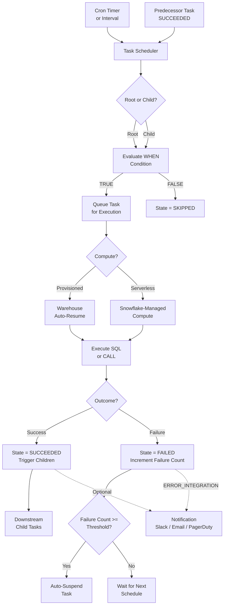

# 1. Scheduling in Snowflake

# 2. Overview

Snowflake scheduling is the time-based and dependency-based orchestration primitive for data pipelines. It is implemented through **Tasks**—schema-level objects that execute SQL statements or stored procedure calls on a recurring schedule or in response to the completion of predecessor tasks. Tasks can be chained into directed acyclic graphs (DAGs) to model multi-stage pipelines.

Scheduling exists to:
- Eliminate manual execution of recurring data transformations
- Enforce predictable refresh cadences for downstream analytics
- Coordinate complex ELT workflows where stage N depends on stage N-1
- Support both batch (hourly, daily) and near-real-time (minute-level) latency requirements

The intended consumers are data engineers designing pipeline orchestration, platform architects defining SLAs, and SnowPro Advanced exam candidates who must understand cron syntax, task graph mechanics, privilege boundaries, and scheduling limits.

# 3. SQL Object Summary

| Object/Feature | Type | Purpose | Source Objects or Inputs | Output Object or Observable Behavior | Execution Mode or Invocation Method |
|---|---|---|---|---|---|
| [Task](SQL Object Summary/Task.md) | Schema object | Executes SQL or procedure on schedule or trigger | SQL body, stored procedure call, predecessor state | DML/DDL execution, task history entry | Cron schedule, interval, or `AFTER` predecessor |
| [Root Task](SQL Object Summary/Root Task.md) | Task subtype | Initiates task graph execution | Cron expression or time interval | Triggers child tasks upon completion | Time-based scheduler |
| [Child Task](SQL Object Summary/Child Task.md) | Task subtype | Executes after predecessor tasks | Predecessor task success state | Runs when all `AFTER` tasks succeed | Dependency-based trigger |
| [Serverless Task](SQL Object Summary/Serverless Task.md) | Task variant | Uses Snowflake-managed compute | Same as standard task | Same as standard task | No warehouse specified; Snowflake provisions compute |
| [Task Graph / DAG](SQL Object Summary/Task Graph  DAG.md) | Dependency structure | Defines execution order across tasks | Root task + child tasks with `AFTER` | Serialized or parallel stage execution | Implicit graph traversal |
| [Cron Schedule](SQL Object Summary/Cron Schedule.md) | Schedule expression | Defines calendar-based execution times | Cron string + optional timezone | Task scheduled at specified times | Parsed by task scheduler |
| [Interval Schedule](SQL Object Summary/Interval Schedule.md) | Schedule expression | Defines fixed-frequency execution | `N MINUTES` | Task scheduled every N minutes | Parsed by task scheduler |
| [WHEN Clause](SQL Object Summary/WHEN Clause.md) | Conditional filter | Skips execution if condition is false | Boolean expression | Task state `SKIPPED` or `RUNNING` | Evaluated at schedule time |
| [ERROR_INTEGRATION](SQL Object Summary/ERROR_INTEGRATION.md) | Notification binding | Alerts on task state changes | Task completion/failure | Notification payload to external system | Automatic on state transition |

# 4. Architecture

The scheduling architecture consists of a metadata-driven scheduler, a warehouse or serverless compute layer, a task graph resolver, and an observability layer. The scheduler evaluates cron expressions and predecessor states to enqueue task execution. Tasks run with the privileges of the task owner, not the user who resumes them.

# 5. Data Flow / Process Flow

## Step 1: Task Definition
- **Input:** `CREATE TASK` DDL with schedule, warehouse, SQL body, and optional graph bindings
- **Transformation:** Parser validates cron syntax, checks for cyclic dependencies, registers task in metadata catalog
- **Output:** Task object in `SUSPENDED` state
- **Purpose:** Establish the automation unit

## Step 2: Task Activation
- **Input:** `ALTER TASK ... RESUME` or initial resume during deployment
- **Transformation:** Scheduler begins evaluating the task's trigger condition
- **Output:** Task enters `SCHEDULED` state awaiting next fire time
- **Purpose:** Enable automated execution

## Step 3: Trigger Evaluation
- **Input:** Cron expression reaches fire time, or all predecessor tasks complete successfully
- **Transformation:** Scheduler evaluates `WHEN` clause if present; checks stream data conditions if applicable
- **Output:** Task queued for execution (`RUNNING`) or skipped (`SKIPPED`)
- **Purpose:** Determine whether execution is warranted

## Step 4: Compute Provisioning
- **Input:** Task execution request
- **Transformation:** If warehouse specified, auto-resume if suspended; if serverless, allocate managed compute
- **Output:** Active compute session
- **Purpose:** Provide resources for SQL execution

## Step 5: SQL Execution
- **Input:** Task body SQL or `CALL` statement
- **Transformation:** Query engine parses, optimizes, and executes the statement
- **Output:** DML/DDL effects, result sets, or side effects
- **Purpose:** Perform the pipeline work

## Step 6: State Propagation
- **Input:** Execution outcome
- **Transformation:** Task state updated to `SUCCEEDED` or `FAILED`; failure counter incremented on failure; children notified on success
- **Output:** Task history record; downstream tasks scheduled; error integration fired if configured
- **Purpose:** Complete the automation cycle and trigger downstream work

# 6. Logical Breakdown

## Component: Cron Scheduler
- **Responsibility:** Evaluate calendar-based schedules and enqueue root tasks
- **Inputs:** Cron expression, optional timezone, task metadata
- **Outputs:** Scheduled execution events
- **Dependencies:** System clock; valid cron syntax
- **Failure Modes:** Invalid cron syntax rejected at creation; timezone misspelling causes parsing failure

## Component: Interval Scheduler
- **Responsibility:** Evaluate fixed-frequency schedules (`N MINUTES`)
- **Inputs:** Interval value, last execution time
- **Outputs:** Periodic execution events
- **Dependencies:** Task history to calculate next run
- **Failure Modes:** Minimum interval is 1 minute; sub-minute intervals rejected

## Component: Task Graph Resolver
- **Responsibility:** Determine execution order and predecessor satisfaction
- **Inputs:** Task `AFTER` clauses, predecessor completion states
- **Outputs:** Child task enqueue events
- **Dependencies:** All predecessors must succeed; graph must be acyclic
- **Failure Modes:** Cyclic dependencies rejected at creation; missing predecessor causes task to never run

## Component: WHEN Condition Evaluator
- **Responsibility:** Conditionally skip task execution
- **Inputs:** Boolean SQL expression, typically `SYSTEM$STREAM_HAS_DATA`
- **Outputs:** `TRUE` (run) or `FALSE` (skip)
- **Dependencies:** Expression must be deterministic and reference accessible objects
- **Failure Modes:** Expression error causes task failure rather than skip; `SYSTEM$STREAM_HAS_DATA` returns string `'TRUE'` not boolean, requiring explicit comparison

## Component: Compute Provisioner
- **Responsibility:** Allocate warehouse or serverless resources
- **Inputs:** Task `WAREHOUSE` parameter or serverless sizing hint
- **Outputs:** Active compute for query execution
- **Dependencies:** Warehouse must exist and be accessible; credits available
- **Failure Modes:** Warehouse suspended and auto-resume disabled; resource monitor throttling; insufficient privileges

## Component: Task State Manager
- **Responsibility:** Track execution outcomes and manage failure counters
- **Inputs:** Query success/failure, current failure count
- **Outputs:** Updated state, history record, suspension decision
- **Dependencies:** `SUSPEND_TASK_AFTER_NUM_FAILURES` threshold
- **Failure Modes:** Rapid consecutive failures exhaust threshold and auto-suspend task

## Component: Error Integration Dispatcher
- **Responsibility:** Send notifications on task state transitions
- **Inputs:** Task state change event, error integration binding
- **Outputs:** JSON payload to external notification endpoint
- **Dependencies:** Notification integration object; network connectivity
- **Failure Modes:** Misconfigured integration; payload size limits; endpoint unavailable

# 7. Data Model

## INFORMATION_SCHEMA.TASK_HISTORY

| Column | Role | Grain | Notes |
|---|---|---|---|
| [`NAME`](ACCOUNT_USAGE.TASK_HISTORY/NAME.md) | Task identifier | One per execution | Schema-qualified task name |
| [`QUERY_ID`](ACCOUNT_USAGE.TASK_HISTORY/QUERY_ID.md) | Execution trace | One per run | Joins to `QUERY_HISTORY` |
| [`DATABASE_NAME`](ACCOUNT_USAGE.TASK_HISTORY/DATABASE_NAME.md) | Context | One per task | |
| [`SCHEMA_NAME`](ACCOUNT_USAGE.TASK_HISTORY/SCHEMA_NAME.md) | Context | One per task | |
| [`SCHEDULED_TIME`](ACCOUNT_USAGE.TASK_HISTORY/SCHEDULED_TIME.md) | Intended start | One per run | Cron-derived or predecessor-derived |
| [`COMPLETED_TIME`](ACCOUNT_USAGE.TASK_HISTORY/COMPLETED_TIME.md) | Actual end | One per run | |
| [`STATE`](ACCOUNT_USAGE.TASK_HISTORY/STATE.md) | Outcome | One per run | `SCHEDULED`, `RUNNING`, `SUCCEEDED`, `FAILED`, `CANCELLED`, `SKIPPED` |
| [`ERROR_CODE`](ACCOUNT_USAGE.TASK_HISTORY/ERROR_CODE.md) | Failure code | One per failed run | Null on success |
| [`ERROR_MESSAGE`](ACCOUNT_USAGE.TASK_HISTORY/ERROR_MESSAGE.md) | Failure detail | One per failed run | Null on success |
| [`RUN_ID`](ACCOUNT_USAGE.TASK_HISTORY/RUN_ID.md) | Instance ID | One per run | Monotonically increasing |
| [`CONFIG`](INFORMATION_SCHEMA.TASK_HISTORY/CONFIG.md) | Task definition | One per run | JSON of warehouse, schedule, etc. |
| [`GRAPH_VERSION`](Parameters  Variables  Configuration/GRAPH_VERSION.md) | DAG version | One per run | Incremented on graph changes |

## Grain
One row per task execution.

## INFORMATION_SCHEMA.TASKS

| Column | Role | Notes |
|---|---|---|
| [`TASK_NAME`](INFORMATION_SCHEMA.TASKS/TASK_NAME.md) | Identifier | |
| [`TASK_SCHEMA`](INFORMATION_SCHEMA.TASKS/TASK_SCHEMA.md) | Context | |
| [`TASK_DATABASE`](INFORMATION_SCHEMA.TASKS/TASK_DATABASE.md) | Context | |
| [`SCHEDULE`](Parameters  Variables  Configuration/SCHEDULE.md) | Trigger definition | Cron or interval string |
| [`WAREHOUSE`](Parameters  Variables  Configuration/WAREHOUSE.md) | Compute target | Null for serverless |
| [`PREDECESSORS`](INFORMATION_SCHEMA.TASKS/PREDECESSORS.md) | Graph edges | Comma-separated task names |
| [`STATE`](ACCOUNT_USAGE.TASK_HISTORY/STATE.md) | Current state | `SUSPENDED` or `STARTED` |
| [`DEFINITION`](INFORMATION_SCHEMA.TASKS/DEFINITION.md) | SQL body | Task execution statement |
| [`CONDITION_TEXT`](INFORMATION_SCHEMA.TASKS/CONDITION_TEXT.md) | WHEN clause | Null if unconditional |
| [`ERROR_INTEGRATION`](Parameters  Variables  Configuration/ERROR_INTEGRATION.md) | Notification target | Null if unconfigured |

## Grain
One row per task.

## ACCOUNT_USAGE.TASK_HISTORY

| Column | Role | Notes |
|---|---|---|
| [`NAME`](ACCOUNT_USAGE.TASK_HISTORY/NAME.md) | Task identifier | |
| [`QUERY_ID`](ACCOUNT_USAGE.TASK_HISTORY/QUERY_ID.md) | Execution trace | |
| [`DATABASE_NAME`](ACCOUNT_USAGE.TASK_HISTORY/DATABASE_NAME.md) | Context | |
| [`SCHEMA_NAME`](ACCOUNT_USAGE.TASK_HISTORY/SCHEMA_NAME.md) | Context | |
| [`SCHEDULED_TIME`](ACCOUNT_USAGE.TASK_HISTORY/SCHEDULED_TIME.md) | Intended start | |
| [`COMPLETED_TIME`](ACCOUNT_USAGE.TASK_HISTORY/COMPLETED_TIME.md) | Actual end | |
| [`STATE`](ACCOUNT_USAGE.TASK_HISTORY/STATE.md) | Outcome | |
| [`ERROR_CODE`](ACCOUNT_USAGE.TASK_HISTORY/ERROR_CODE.md) | Failure code | |
| [`ERROR_MESSAGE`](ACCOUNT_USAGE.TASK_HISTORY/ERROR_MESSAGE.md) | Failure detail | |
| [`RUN_ID`](ACCOUNT_USAGE.TASK_HISTORY/RUN_ID.md) | Instance ID | |
| [`GRAPH_VERSION`](Parameters  Variables  Configuration/GRAPH_VERSION.md) | DAG version | |

## Grain
One row per task execution; retained for 365 days.

# 8. Business Logic

## Cron Expression Rules
- Standard 5-field cron syntax: `minute hour day-of-month month day-of-week`
- Uses UTC by default unless `TIMEZONE = 'Region/Zone'` is specified
- Supports special characters: `*` (any), `,` (list), `-` (range), `/` (step)
- Examples:
  - `0 6 * * *` = daily at 06:00 UTC
  - `0 */4 * * *` = every 4 hours
  - `0 9 * * 1` = Mondays at 09:00 UTC
- Cron tasks schedule the next run at the end of the current execution; overlapping executions are not queued unless explicitly configured

## Interval Schedule Rules
- Syntax: `N MINUTES` where N is an integer
- Minimum value: `1 MINUTE`
- Execution begins approximately N minutes after the previous run completes, not after it starts
- Interval tasks are simpler but less flexible than cron for calendar-based requirements

## Task Graph (DAG) Rules
- Root tasks define the schedule; child tasks define `AFTER` predecessors
- A child task executes only when all tasks in its `AFTER` list have succeeded on the most recent run
- If any predecessor fails, the child is not scheduled until the predecessor succeeds in a future run
- Task graphs must be acyclic; cyclic references are rejected at `CREATE` or `ALTER` time
- Tasks can have multiple predecessors (fan-in) and multiple successors (fan-out)
- The entire graph is versioned; `GRAPH_VERSION` increments when graph structure changes

## Conditional Execution (WHEN)
- `WHEN` clause evaluates a boolean expression before each scheduled execution
- If `FALSE`, task state is `SKIPPED` and children do not trigger
- Common pattern: `WHEN SYSTEM$STREAM_HAS_DATA('my_stream') = 'TRUE'`
- **Exam trap:** `SYSTEM$STREAM_HAS_DATA` returns a string, not a boolean. Must compare to `'TRUE'`.

## State Machine
- `SUSPENDED` (default on creation) → `STARTED` (after resume) → `SCHEDULED` → `RUNNING` → `SUCCEEDED` / `FAILED` / `SKIPPED` / `CANCELLED`
- `CANCELLED` occurs if task is suspended while running or if warehouse is resized/restarted
- Failed tasks increment an internal failure counter; success resets the counter

## Auto-Suspension on Failure
- After `SUSPEND_TASK_AFTER_NUM_FAILURES` consecutive failures (default 10), task automatically suspends
- Applies to the specific task, not the entire graph
- A suspended task must be manually resumed via `ALTER TASK ... RESUME`

## Privilege Context
- Tasks execute with the privileges of the task owner, not the user who resumes the task
- If the owner loses a required privilege (e.g., `SELECT` on a table), the task fails
- `OPERATE` privilege on a task allows non-owners to resume or suspend it

## Serverless vs. Provisioned
- Serverless tasks omit the `WAREHOUSE` parameter; Snowflake manages compute allocation
- Serverless tasks use `USER_TASK_MANAGED_INITIAL_WAREHOUSE_SIZE` (default `XSMALL`) as a starting hint
- Serverless compute scales automatically but may incur cold-start latency
- Provisioned tasks offer predictable performance and resource monitor control

# 9. Transformations

## Cron Expression to Scheduled Time
- **Source:** Cron string and timezone
- **Output:** Next execution timestamp
- **Logic:** Parser evaluates 5 fields against system clock; applies timezone offset
- **Meaning:** Calendar-based automation trigger
- **Impact:** Determines pipeline refresh cadence and SLA alignment

## Predecessor Success to Child Trigger
- **Source:** State transitions of upstream tasks
- **Output:** Child task enqueue event
- **Logic:** Graph resolver monitors `TASK_HISTORY`; when all predecessors show `SUCCEEDED` for the same graph version, child is scheduled
- **Meaning:** Dependency-driven execution order
- **Impact:** Ensures downstream stages process only successfully produced upstream data

## WHEN Evaluation to Run/Skip Decision
- **Source:** Boolean expression and stream state
- **Output:** `RUNNING` or `SKIPPED` state
- **Logic:** Expression evaluated in task owner context; if false, execution bypassed
- **Meaning:** Event-driven scheduling without external orchestrator
- **Impact:** Reduces unnecessary compute consumption when no data changes exist

## Failure Count to Suspension
- **Source:** Consecutive failure records in task history
- **Output:** Task state changed to `SUSPENDED`
- **Logic:** Counter increments on `FAILED`; resets on `SUCCEEDED`; suspension triggered at threshold
- **Meaning:** Automatic circuit breaker to prevent infinite failure loops
- **Impact:** Requires manual intervention to resume after root cause fix

## Task Execution to History Record
- **Source:** Query completion and metadata
- **Output:** Row in `TASK_HISTORY`
- **Logic:** System captures timing, state, query ID, and error details
- **Meaning:** Audit trail for operational monitoring and debugging
- **Impact:** Enables SLA tracking, cost attribution, and incident response

# 10. Parameters / Variables / Configuration

| Name | Type | Purpose | Allowed Values | Default | Where Used | Effect |
|---|---|---|---|---|---|---|
| [`SCHEDULE`](Parameters  Variables  Configuration/SCHEDULE.md) | Task property | Time-based trigger | `USING CRON '...' [TIMEZONE '...']` or `N MINUTES` | None (required for root) | `CREATE/ALTER TASK` | Defines when root task executes |
| [`AFTER`](Parameters  Variables  Configuration/AFTER.md) | Task property | Dependency trigger | Comma-separated task names | None | `CREATE/ALTER TASK` | Defines child task predecessors |
| [`WHEN`](Parameters  Variables  Configuration/WHEN.md) | Task property | Conditional guard | Boolean SQL expression | None (always run) | `CREATE/ALTER TASK` | Skips execution if false |
| [`WAREHOUSE`](Parameters  Variables  Configuration/WAREHOUSE.md) | Task property | Compute target | Warehouse name or omitted | Omitted (serverless) | `CREATE/ALTER TASK` | Determines provisioned vs serverless |
| [`ERROR_INTEGRATION`](Parameters  Variables  Configuration/ERROR_INTEGRATION.md) | Task property | Alert routing | Notification integration name | None | `CREATE/ALTER TASK` | Sends failure/success notifications |
| [`USER_TASK_MANAGED_INITIAL_WAREHOUSE_SIZE`](Parameters  Variables  Configuration/USER_TASK_MANAGED_INITIAL_WAREHOUSE_SIZE.md) | Task property | Serverless hint | `XSMALL`, `SMALL`, `MEDIUM`, `LARGE`, `XLARGE`, `XXLARGE` | `XSMALL` | `CREATE/ALTER TASK` | Initial compute allocation for serverless |
| [`USER_TASK_TIMEOUT_MS`](Parameters  Variables  Configuration/USER_TASK_TIMEOUT_MS.md) | Account parameter | Max runtime | Integer milliseconds | `3600000` (1 hour) | Account | Aborts tasks exceeding limit |
| [`SUSPEND_TASK_AFTER_NUM_FAILURES`](Parameters  Variables  Configuration/SUSPEND_TASK_AFTER_NUM_FAILURES.md) | Task property | Auto-suspend threshold | Integer >= 0 | `10` | `CREATE/ALTER TASK` | Suspends task after N consecutive failures |
| [`TIMEZONE`](Parameters  Variables  Configuration/TIMEZONE.md) | Schedule modifier | Cron timezone | IANA timezone string | `UTC` | `SCHEDULE` clause | Shifts cron fire times from UTC |
| [`GRAPH_VERSION`](Parameters  Variables  Configuration/GRAPH_VERSION.md) | System metadata | DAG versioning | Integer | Auto-incremented | System | Tracks graph structural changes |
| [`QUERY_TAG`](Parameters  Variables  Configuration/QUERY_TAG.md) | Session parameter | Traceability | String | None | Task SQL body | Enables cost and performance tracking |

# 11. APIs / Interfaces

## Interface: CREATE TASK
- **Invocation:** `CREATE [OR REPLACE] TASK [IF NOT EXISTS] name [WAREHOUSE = ...] [SCHEDULE = ...] [CONFIG = ...] [ERROR_INTEGRATION = ...] [COPY GRANTS] [COMMENT = '...'] [AFTER ...] [WHEN ...] AS <sql>`
- **Input:** Task definition parameters and SQL body
- **Output:** Task object in `SUSPENDED` state
- **Error Behavior:** Fails on invalid cron syntax, cyclic `AFTER` references, missing warehouse (if specified), insufficient privileges
- **Consumers:** Deployment scripts, Terraform, infrastructure-as-code

## Interface: ALTER TASK
- **Invocation:** `ALTER TASK name {RESUME | SUSPEND | SET ... | MODIFY AS ... | ADD AFTER ... | REMOVE AFTER ...}`
- **Input:** Task identifier and modification clause
- **Output:** Updated task metadata
- **Error Behavior:** Fails if task does not exist, user lacks `OPERATE` privilege, or modification introduces cycle
- **Consumers:** Operational runbooks, CI/CD pipelines

## Interface: EXECUTE TASK
- **Invocation:** `EXECUTE TASK name`
- **Input:** Task identifier
- **Output:** Immediate task execution independent of schedule
- **Error Behavior:** Fails if task is suspended or user lacks privilege
- **Consumers:** Ad hoc testing, backfill operations, manual recovery

## Interface: SHOW TASKS
- **Invocation:** `SHOW TASKS [LIKE '...'] [IN ...]`
- **Input:** Optional filter pattern
- **Output:** Task metadata including state, schedule, predecessors, warehouse
- **Error Behavior:** Returns empty set if no tasks or insufficient privileges
- **Consumers:** Schema browsers, operational dashboards

## Interface: INFORMATION_SCHEMA.TASK_HISTORY
- **Invocation:** `SELECT * FROM INFORMATION_SCHEMA.TASK_HISTORY(TASK_NAME => '...')`
- **Input:** Task name, optional date range
- **Output:** Execution history with state, timing, errors
- **Error Behavior:** Returns empty set if no history or insufficient privileges
- **Consumers:** Monitoring systems, SLA tracking

## Interface: ACCOUNT_USAGE.TASK_HISTORY
- **Invocation:** `SELECT * FROM SNOWFLAKE.ACCOUNT_USAGE.TASK_HISTORY WHERE NAME = '...'`
- **Input:** Task name filter, date range (up to 365 days)
- **Output:** Long-term execution history
- **Error Behavior:** Requires `ACCOUNTADMIN` or `MONITOR` privileges; latency up to 45 minutes
- **Consumers:** Compliance auditing, long-term trend analysis

## Interface: SYSTEM$STREAM_HAS_DATA
- **Invocation:** `SELECT SYSTEM$STREAM_HAS_DATA('stream_name')`
- **Input:** Stream name
- **Output:** String `'TRUE'` or `'FALSE'`
- **Error Behavior:** Fails if stream does not exist
- **Consumers:** Task `WHEN` clauses, conditional pipeline logic

## Interface: SYSTEM$TASK_DEPENDENTS_ENABLE
- **Invocation:** `SELECT SYSTEM$TASK_DEPENDENTS_ENABLE('task_name')`
- **Input:** Root task name
- **Output:** Success indicator; resumes task and all dependent tasks in graph
- **Error Behavior:** Fails if task does not exist or user lacks privileges
- **Consumers:** Deployment automation, graph activation

# 12. Execution / Deployment

## Root Task Deployment
- Create root task with `SCHEDULE` clause
- Root task must be resumed to begin scheduling
- Use `SYSTEM$TASK_DEPENDENTS_ENABLE('root_task')` to resume an entire graph at once
- Root tasks without schedules (purely `AFTER` tasks) cannot be root tasks; they must have a predecessor or schedule

## Child Task Deployment
- Create child tasks with `AFTER` referencing predecessor task names
- Child tasks can be resumed independently, but will only execute when predecessors succeed
- Multiple children can reference the same predecessor (fan-out)
- A child can reference multiple predecessors (fan-in); all must succeed

## Graph Modification
- Adding or removing `AFTER` clauses increments `GRAPH_VERSION`
- Existing in-flight executions complete under their original graph version
- To rewire dependencies: `ALTER TASK child_task REMOVE AFTER old_task, ADD AFTER new_task`

## Manual Execution
- `EXECUTE TASK` bypasses schedule and `WHEN` clause; runs immediately
- Useful for testing, backfills, or recovery
- Does not trigger child tasks unless the task is part of an active graph and succeeds

## Environment Behavior
- Development: Frequent `EXECUTE TASK` testing, smaller warehouses, verbose `QUERY_TAG`
- Production: Strict cron schedules, error integrations, larger warehouses or serverless, monitoring via `TASK_HISTORY`
- CI/CD: Tasks version-controlled; deployment scripts handle resume/suspend state management

## Serverless Deployment
- Omit `WAREHOUSE` parameter; specify `USER_TASK_MANAGED_INITIAL_WAREHOUSE_SIZE` if needed
- No warehouse management overhead; Snowflake handles provisioning and scaling
- Monitor cost via `ACCOUNT_USAGE.WAREHOUSE_METERING_HISTORY` with serverless compute category

# 13. Observability

## Task Execution Tracking
- Query `INFORMATION_SCHEMA.TASK_HISTORY` for recent runs (typically 7 days)
- Query `ACCOUNT_USAGE.TASK_HISTORY` for up to 365 days
- Join `TASK_HISTORY` to `QUERY_HISTORY` on `QUERY_ID` to correlate execution with resource consumption

## Graph Health Monitoring
- Identify broken chains: tasks with `STATE = 'SUSPENDED'` or persistent `FAILED` states
- Monitor graph version drift: unexpected `GRAPH_VERSION` changes indicate unauthorized modifications
- Track end-to-end latency: `COMPLETED_TIME` of leaf task minus `SCHEDULED_TIME` of root task

## Schedule Drift Detection
- Compare `SCHEDULED_TIME` to `COMPLETED_TIME`; growing gaps indicate resource contention or warehouse queueing
- Cron tasks should show consistent `SCHEDULED_TIME` alignment; drift suggests execution time exceeding interval

## Failure Analysis
- Categorize failures by `ERROR_CODE` and `ERROR_MESSAGE`
- Common patterns: privilege revocation (`SQL access control error`), warehouse unavailable, SQL syntax errors, stream staleness
- Correlate failure spikes with deployment timestamps or schema changes

## Notification Verification
- Confirm error integrations deliver payloads to endpoints
- Test with `EXECUTE TASK` on a task designed to fail
- Verify payload contains task name, database, schema, error code, error message, and timestamp

## Key Metrics
- Task success rate by graph and by stage
- Average and p95 task duration
- Schedule adherence: percentage of tasks starting within 30 seconds of `SCHEDULED_TIME`
- Time from root task start to leaf task completion (pipeline latency)
- Serverless task credit consumption vs. provisioned warehouse credits
- Frequency of `SKIPPED` states (indicates over-scheduling or empty streams)

# 14. Failure Handling & Recovery

## Task Fails Due to SQL Error
- **What breaks:** Syntax error, missing object, or constraint violation in task body
- **Detection:** `TASK_HISTORY` shows `FAILED` with `ERROR_CODE` and `ERROR_MESSAGE`
- **Fallback:** Task does not trigger children; downstream pipeline stalls
- **Recovery:** Fix SQL or schema, test in worksheet with task owner role, `EXECUTE TASK` to verify, then resume if suspended

## Task Suspended After Consecutive Failures
- **What breaks:** Threshold reached (default 10); task stops scheduling
- **Detection:** `SHOW TASKS` shows `STATE = 'SUSPENDED'`; error integration fires alert
- **Fallback:** Entire downstream graph halts if this task is a predecessor
- **Recovery:** Fix root cause, `ALTER TASK ... RESUME`; for graphs, use `SYSTEM$TASK_DEPENDENTS_ENABLE` to resume entire tree

## Warehouse Unavailable or Auto-Suspend
- **What breaks:** Task fails because warehouse is suspended and auto-resume is disabled, or resource monitor limits reached
- **Detection:** Error message references warehouse state or resource monitor
- **Fallback:** Switch to serverless task to eliminate warehouse dependency
- **Recovery:** Enable auto-resume on warehouse, adjust resource monitor, or alter task to use different warehouse

## Predecessor Failure Halts Graph
- **What breaks:** Upstream task fails; child tasks never schedule
- **Detection:** Gap in child task `TASK_HISTORY`; root task shows `FAILED`
- **Fallback:** Manual execution of downstream tasks after fixing upstream
- **Recovery:** Fix and rerun predecessor; allow natural graph propagation to resume

## WHEN Clause Always False
- **What breaks:** Task perpetually `SKIPPED`; pipeline never executes even when data exists
- **Detection:** All `TASK_HISTORY` entries show `SKIPPED`; stream has data but is never consumed
- **Fallback:** Remove `WHEN` clause temporarily to force execution
- **Recovery:** Fix boolean expression; common fix is changing `SYSTEM$STREAM_HAS_DATA(...) = TRUE` to `= 'TRUE'`

## Stream Staleness Blocks Pipeline
- **What breaks:** Source table DDL changed (e.g., `ALTER TABLE`, `CREATE OR REPLACE`); stream becomes stale
- **Detection:** `INFORMATION_SCHEMA.STREAMS.STALE = 'TRUE'`
- **Fallback:** Full table scan without stream; manual backfill
- **Recovery:** Recreate stream, update task to reference new stream, resume task

## Clock Skew or Timezone Issues
- **What breaks:** Cron tasks fire at unexpected local times due to UTC conversion errors
- **Detection:** `SCHEDULED_TIME` does not align with business hours
- **Fallback:** Interval-based scheduling as temporary replacement
- **Recovery:** Correct timezone in cron schedule; verify with `SHOW TASKS`

## Privilege Revocation
- **What breaks:** Task owner loses `SELECT`, `INSERT`, or `USAGE` privilege on required object
- **Detection:** `FAILED` with access control error
- **Fallback:** Grant privileges back to owner role
- **Recovery:** Audit role grants; consider dedicated pipeline service role to isolate from user privilege changes

# 15. Security & Access Control

## Privilege Model

| Action | Required Privilege | Object |
|---|---|---|
| [Create task](Privilege Model/Create task.md) | `CREATE TASK` | Schema |
| [Resume/suspend own task](Privilege Model/Resumesuspend own task.md) | `OPERATE` | Task |
| [Resume/suspend any task](Privilege Model/Resumesuspend any task.md) | `EXECUTE TASK` | Account |
| [Modify task definition](Privilege Model/Modify task definition.md) | `OWNERSHIP` | Task |
| [Use warehouse](Privilege Model/Use warehouse.md) | `USAGE` | Warehouse |
| [Read source data](Privilege Model/Read source data.md) | `SELECT` | Table/Stream/View |
| [Write target data](Privilege Model/Write target data.md) | `INSERT`, `UPDATE`, `DELETE` | Target table |
| [View task history](Privilege Model/View task history.md) | `MONITOR` or `OWNERSHIP` | Task or account |

## Task Owner Isolation
- Tasks execute with owner privileges; changing a user's personal role grants does not affect existing tasks
- Use dedicated service roles (e.g., `PIPELINE_ROLE`) for task ownership to prevent individual user privilege changes from breaking pipelines
- Transfer ownership via `GRANT OWNERSHIP ON TASK ... TO ROLE ...`

## Secure Task Definitions
- Task SQL bodies are visible to users with `SHOW TASKS` or `GET_DDL` unless encapsulated in `SECURE` stored procedures
- Sensitive logic (API keys, business rules) should reside in secure procedures called by tasks, not in task body directly

## Error Integration Security
- Notification integrations may contain webhook URLs or API keys; restrict `USAGE` on integration objects
- Payloads sent to external systems should not contain sensitive row data; limit to metadata (task name, error code)

## Network Policies
- Tasks using external functions or procedures with external access integrations are subject to network policies
- Ensure pipeline service role is exempt or properly scoped for required outbound access

# 16. Performance / Scalability Considerations

## Minimum Schedule Granularity
- 1 minute is the shortest supported interval
- Sub-minute latency requires external orchestration (Airflow, Fivetran, custom poller) or continuous pipe loading with stream-triggered tasks
- Frequent tasks (every 1-5 minutes) on large graphs may saturate scheduler queues

## Warehouse Contention
- Tasks sharing a warehouse with ad hoc queries experience queueing and unpredictable start times
- Dedicated warehouses for task graphs isolate pipeline workloads and improve SLA predictability
- Auto-suspend settings must balance cost with cold-start latency; too aggressive auto-suspend delays task start

## Serverless Cold Start
- Serverless tasks may incur 1-3 seconds of cold-start latency for first execution after idle period
- Subsequent executions within active window are faster
- Not suitable for sub-second latency requirements

## Task Graph Depth
- Deep graphs (many sequential stages) increase end-to-end latency due to serialization overhead
- Each stage adds scheduling and compute provisioning delay
- Flatten where possible; use `AFTER` arrays to fan out parallel stages

## Concurrent Task Limits
- Account limits constrain maximum concurrent task executions
- Wide fan-out graphs may hit concurrency ceilings; monitor `TASK_HISTORY` for `SCHEDULED` but not `RUNNING` states
- Contact Snowflake support to increase limits if needed

## Stream-Driven Overhead
- `WHEN SYSTEM$STREAM_HAS_DATA` adds minimal overhead but requires metadata query on each schedule tick
- For high-frequency schedules (1 minute), the overhead is negligible relative to compute cost
- False positives (stream has data but task logic finds nothing) waste compute; ensure `WHEN` logic aligns with actual pipeline filters

## Long-Running Tasks
- Tasks exceeding `USER_TASK_TIMEOUT_MS` (default 1 hour) are automatically cancelled
- Large backfills or complex transformations may require timeout increase or decomposition into smaller tasks
- Monitor `COMPLETED_TIME - SCHEDULED_TIME` to identify approaching limits

## Result Cache and Tasks
- Identical task SQL may hit result cache, which is undesirable for stream-driven incremental pipelines
- Append a non-deterministic element (e.g., `CURRENT_TIMESTAMP`) or use `QUERY_TAG` changes to bypass cache when freshness is required

## Graph Versioning Impact
- Modifying task graph structure increments `GRAPH_VERSION` and may cause in-flight executions to complete under old version while new versions schedule differently
- Avoid graph modifications during active execution windows; suspend graph, modify, then resume

# 17. Assumptions & Constraints

## Explicit Assumptions
- The reader is designing production pipeline orchestration using Snowflake-native scheduling
- Pipelines require predictable execution order and may need event-driven conditional execution
- Tasks will be owned by service roles rather than individual users

## Engine Boundaries
- Tasks cannot directly trigger tasks in other databases; cross-database orchestration requires external tools or procedures that execute `EXECUTE TASK` with appropriate context
- Streams on views have restrictions; not all view constructs support streaming
- Task history in `INFORMATION_SCHEMA` is limited to recent history (typically 7 days); long-term analysis requires `ACCOUNT_USAGE`
- Serverless tasks do not support all warehouse-level features (e.g., specific resource monitor bindings)
- A task graph must be acyclic; cyclic dependencies are rejected at DDL time
- The scheduler does not guarantee exact second-level precision; cron tasks may fire within a small window of the target time

## Exam-Relevant Defaults
- Tasks are created in `SUSPENDED` state
- Default `SUSPEND_TASK_AFTER_NUM_FAILURES`: `10`
- Default `USER_TASK_TIMEOUT_MS`: `3600000` (1 hour)
- Default serverless task size: `XSMALL`
- Default cron timezone: `UTC`
- Minimum schedule interval: `1 MINUTE`
- `SYSTEM$STREAM_HAS_DATA` returns string `'TRUE'` or `'FALSE'`, not boolean
- Task owner privileges are used for execution, not the resumer's privileges

## Ambiguities
- Exact maximum task graph size (nodes and edges) varies by account edition and is subject to change
- Serverless task pricing is dynamic and not published as fixed rates
- The precise scheduler jitter for cron tasks is not documented as a guaranteed bound

# 18. Future Enhancements

- Implement a centralized task catalog view that joins `INFORMATION_SCHEMA.TASKS`, `TASK_HISTORY`, and `QUERY_HISTORY` to provide single-pane pipeline health monitoring
- Add automated `GRAPH_VERSION` change alerting to detect unauthorized task graph modifications
- Replace deep sequential task chains with flatter `AFTER` arrays where stages are independent, reducing end-to-end pipeline latency
- Migrate appropriate tasks to serverless compute to eliminate warehouse management overhead and reduce operational toil
- Implement dynamic task timeout adjustment via account parameter changes for different workload classes (small incremental vs. large backfill)
- Add pre-task validation procedures that check source data availability and schema compatibility before main transformation, failing fast with descriptive errors
- Create reusable task templates for common patterns (hourly stream merge, daily full refresh, weekly aggregation) to standardize deployment
- Implement circuit-breaker tasks that monitor error rates and auto-suspend entire graphs when upstream quality degrades, rather than failing individually
- Use `QUERY_TAG` consistently across all tasks to enable unified cost attribution and performance baselining in `ACCOUNT_USAGE.QUERY_HISTORY`
- Add post-task reconciliation queries as separate tasks in the graph to validate row counts, checksums, and freshness before marking pipeline complete
