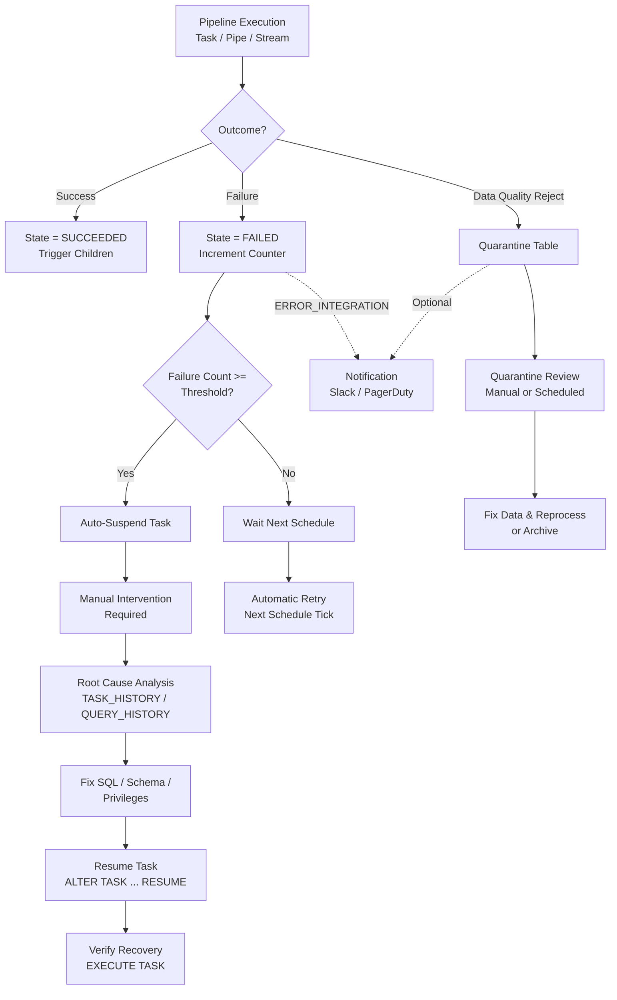

# 1. Respond to Processing Failures in Snowflake

# 2. Overview

Failure response in Snowflake pipelines is the operational discipline of detecting, classifying, containing, and recovering from errors during automated data processing. It encompasses task failures, stream staleness, warehouse unavailability, data quality violations, pipe load errors, and privilege revocation. Effective failure response minimizes data latency, prevents cascading corruption, and maintains pipeline SLAs.

Snowflake provides native primitives for failure detection and alerting—**error integrations**, **task history**, **stream staleness flags**, and **notification integrations**—but leaves remediation logic to the implementer. This means pipelines must be designed with explicit error handling, quarantine patterns, retry semantics, and recovery runbooks.

The intended consumers are data engineers operating production pipelines, SREs managing Snowflake infrastructure, and SnowPro Advanced exam candidates who must understand task failure thresholds, stream behavior under error conditions, and the boundaries of Snowflake's built-in error handling.

# 3. SQL Object Summary

| Object/Feature | Type | Purpose | Source Objects or Inputs | Output Object or Observable Behavior | Execution Mode or Invocation Method |
|---|---|---|---|---|---|
| Error Integration | Notification object | Routes task failure/success alerts to external systems | Task state transition | JSON payload to email/Slack/PagerDuty | Automatic on task completion |
| Notification Integration | Account object | Configures external endpoint for alerts | Task or pipe state | HTTP/HTTPS payload or email | Automatic on bound event |
| TASK_HISTORY | System view | Records task execution outcomes | Task scheduler | Execution state, error codes, timing | Query-time |
| STREAM staleness flag | Metadata property | Indicates source DDL changed | Source table DDL | `STALE = TRUE` in `INFORMATION_SCHEMA.STREAMS` | Automatic |
| Quarantine Table | User table | Isolates failed or suspect rows | Pipeline validation logic | Rows failing quality checks | DML within task or procedure |
| Error Log Table | User table | Captures structured error context | Stored procedure catch blocks | Error code, message, run ID, timestamp | DML within procedure |
| Retry Wrapper Procedure | Stored procedure | Encapsulates idempotent retry logic | Task SQL or CALL | Success or terminal failure after N attempts | Called by task |
| VALIDATION_MODE | COPY option | Pre-validates files without loading | Stage files | Error report without persisted data | `COPY INTO` option |
| PIPE_USAGE_HISTORY | Account view | Tracks pipe load outcomes | Snowpipe operations | File load status, error counts | Query-time |

# 4. Architecture

Failure response operates across three layers: the detection layer (streams, tasks, pipes emit state), the notification layer (error integrations push alerts), and the remediation layer (procedures, quarantine tables, and manual runbooks execute recovery). The pipeline must not assume Snowflake will automatically retry or recover.

# 5. Data Flow / Process Flow

## Step 1: Failure Detection
- **Input:** Task execution error, stream staleness, pipe load failure, or data quality violation
- **Transformation:** System records state in `TASK_HISTORY`, `PIPE_USAGE_HISTORY`, or stream metadata; error integration fires if configured
- **Output:** Alert payload, history record, or quarantine table entry
- **Purpose:** Surface failures before downstream consumers are affected

## Step 2: Alerting and Notification
- **Input:** Task state transition to `FAILED` or pipe error state
- **Transformation:** Error integration formats JSON payload with task name, error code, message, timestamp, and graph version
- **Output:** Notification to Slack, email, PagerDuty, or custom webhook
- **Purpose:** Notify operators with context for triage

## Step 3: Containment
- **Input:** Failed rows, bad files, or suspect batches
- **Transformation:** Pipeline procedure catches errors and writes to quarantine table; task may be suspended to prevent further damage
- **Output:** Isolated bad data; halted or skipped downstream stages
- **Purpose:** Prevent corruption of production tables and cascading failures

## Step 4: Classification and Diagnosis
- **Input:** Error code, message, query history, and task configuration
- **Transformation:** Operator queries `TASK_HISTORY`, `QUERY_HISTORY`, stream staleness, and quarantine tables to classify root cause
- **Output:** Identified root cause category (SQL error, schema drift, privilege, warehouse, data quality)
- **Purpose:** Direct remediation to the correct fix

## Step 5: Remediation
- **Input:** Classified failure
- **Transformation:** Apply fix (correct SQL, grant privilege, recreate stream, resize warehouse), then resume or rerun
- **Output:** Successful task execution, cleared quarantine, or archived bad data
- **Purpose:** Restore pipeline to healthy state

## Step 6: Verification
- **Input:** Remediated pipeline
- **Transformation:** Manual `EXECUTE TASK`, validation queries, row count reconciliation
- **Output:** Confirmed successful end-to-end execution
- **Purpose:** Ensure fix is durable and data is correct

# 6. Logical Breakdown

## Component: Error Integration
- **Responsibility:** Deliver structured notifications on task state changes
- **Inputs:** Task completion/failure event, notification integration endpoint
- **Outputs:** JSON payload to external system
- **Dependencies:** Notification integration must exist and be accessible
- **Failure Modes:** Misconfigured webhook URL; network unreachable; payload exceeds endpoint limits; alert fatigue from noisy failures

## Component: Task History Monitor
- **Responsibility:** Provide audit trail of task executions for debugging
- **Inputs:** Task scheduler events
- **Outputs:** `TASK_HISTORY` rows with state, timing, query ID, error details
- **Dependencies:** Task must have executed at least once
- **Failure Modes:** History retention limited in `INFORMATION_SCHEMA`; long-term analysis requires `ACCOUNT_USAGE` with 45-minute latency

## Component: Auto-Suspend Circuit Breaker
- **Responsibility:** Halt a failing task after threshold to prevent infinite loops
- **Inputs:** Consecutive failure count, `SUSPEND_TASK_AFTER_NUM_FAILURES` threshold
- **Outputs:** Task state changed to `SUSPENDED`
- **Dependencies:** Threshold configured at task creation
- **Failure Modes:** Threshold too high allows prolonged failure; threshold too low causes benign flapping to suspend task

## Component: Quarantine Table
- **Responsibility:** Isolate rows failing validation without aborting entire load
- **Inputs:** Rejected rows from `TRY_CAST`, business rule violations, or referential integrity failures
- **Outputs:** Persisted bad rows with error context and audit metadata
- **Dependencies:** Pipeline procedure must implement catch-and-write logic
- **Failure Modes:** Quarantine table grows unbounded without retention policy; sensitive data in quarantine may violate compliance

## Component: Stream Staleness Detector
- **Input:** Source table DDL changes
- **Output:** `STALE = TRUE` in `INFORMATION_SCHEMA.STREAMS`
- **Responsibility:** Flag when stream offset is invalidated by schema changes
- **Dependencies:** Stream must exist on source object
- **Failure Modes:** Stale streams cause tasks to fail or skip; not automatically recreated

## Component: Retry Wrapper Procedure
- **Responsibility:** Encapsulate idempotent retry logic with exponential backoff
- **Inputs:** SQL statement, max attempts, backoff interval
- **Outputs:** Success or terminal failure after exhaustion
- **Dependencies:** Underlying operation must be idempotent
- **Failure Modes:** Non-idempotent retries cause duplicates; infinite retry without backoff exhausts resources

## Component: Pipe Error Handler
- **Responsibility:** Manage continuous loading failures from cloud storage
- **Inputs:** File format errors, authentication failures, schema mismatches
- **Outputs:** Failed file records in `PIPE_USAGE_HISTORY` or `COPY_HISTORY`
- **Dependencies:** Stage, file format, and IAM trust
- **Failure Modes:** Bad files block pipe queue; duplicate loading if `FORCE = TRUE`; no native dead-letter queue

# 7. Data Model

## Quarantine Table (Recommended Pattern)

| Column | Role | Grain | Notes |
|---|---|---|---|
| `QUARANTINE_ID` | Surrogate key | One per rejected row | Auto-increment or sequence |
| `SOURCE_TABLE` | Provenance | One per row | Origin table or stream |
| `PIPELINE_NAME` | Context | One per row | Task or procedure name |
| `RUN_ID` | Execution trace | One per row | Task run or session ID |
| `REJECTED_ROW` | Raw data | One per row | VARIANT or string representation |
| `ERROR_CODE` | Classification | One per row | SQL error code or custom code |
| `ERROR_MESSAGE` | Detail | One per row | Full error or validation reason |
| `REJECTED_TIMESTAMP` | Audit time | One per row | `CURRENT_TIMESTAMP()` |
| `RESOLVED_TIMESTAMP` | Resolution time | One per row | Null until fixed |
| `RESOLUTION_ACTION` | Disposition | One per row | `REPROCESSED`, `ARCHIVED`, `DISCARDED` |

## Grain
One row per rejected record per pipeline execution.

## Error Log Table (Recommended Pattern)

| Column | Role | Grain | Notes |
|---|---|---|---|
| `LOG_ID` | Surrogate key | One per error | |
| `TASK_NAME` | Context | One per error | |
| `QUERY_ID` | Traceability | One per error | Joins to `QUERY_HISTORY` |
| `ERROR_CODE` | Classification | One per error | |
| `ERROR_MESSAGE` | Detail | One per error | Truncated if necessary |
| `PROCEDURE_STATE` | Debug context | One per error | JSON of variable state |
| `LOGGED_AT` | Timestamp | One per error | |
| `SEVERITY` | Priority | One per error | `ERROR`, `WARN`, `FATAL` |

## Grain
One row per caught exception.

# 8. Business Logic

## Failure Classification Rules
- **SQL execution errors:** Syntax errors, missing objects, constraint violations detected via `TASK_HISTORY.ERROR_CODE` (e.g., `002003` object not found, `100051` constraint violation)
- **Privilege errors:** Access control failures (`SQL access control error`) indicating role or grant issues
- **Warehouse errors:** Resource monitor limits, warehouse suspension, or insufficient size causing timeouts
- **Data quality errors:** `TRY_CAST` returning null, business rule violations, referential orphan detection
- **Stream errors:** Staleness due to source DDL changes, unconsumed stream causing reprocessing
- **Pipe errors:** File format mismatches, authentication expiration, queue backlog

## Retry Logic Rules
- Snowflake tasks do not natively retry; implement retry in stored procedures using `try/catch`
- Exponential backoff prevents overwhelming shared resources
- Retry only idempotent operations; `MERGE` is idempotent if match keys are stable
- Maximum retry attempts should be enforced to prevent infinite loops
- After max retries, write to error log and quarantine, then re-throw to trigger task failure

## Quarantine Rules
- Rows failing `TRY_CAST` or validation should be written to quarantine with full context
- Quarantine table should have a retention policy or partition expiration to prevent unbounded growth
- Do not quarantine rows containing unmasked PII unless compliant with data governance
- Schedule periodic review tasks to process or archive quarantined rows

## Auto-Suspend Rules
- Default threshold is 10 consecutive failures
- Applies per task, not per graph
- Suspended tasks require manual `ALTER TASK ... RESUME`
- Graphs with suspended root tasks halt entirely; suspended child tasks block their downstream subgraph

## Notification Rules
- Error integrations fire on state transitions to `FAILED` and optionally on `SUCCEEDED`
- Payload includes task name, database, schema, error code, error message, scheduled time, completed time
- Configure separate notification integrations for different severity levels or teams

## Recovery Priority Rules
- **Data corruption risk:** Suspend task immediately, fix root cause, backfill if necessary
- **Transient errors:** Retry with backoff; do not suspend for single failures
- **Schema drift:** Fix conforming logic, validate against staging, then resume
- **Privilege issues:** Grant missing privileges to task owner role, verify with `EXECUTE TASK`

# 9. Transformations

## Task Failure to Alert Payload
- **Source:** `TASK_HISTORY` error record
- **Output:** JSON notification to external system
- **Logic:** Error integration extracts `NAME`, `ERROR_CODE`, `ERROR_MESSAGE`, `SCHEDULED_TIME`, `GRAPH_VERSION`
- **Meaning:** Operational signal for human or automated response
- **Impact:** Enables rapid triage and reduces mean time to recovery

## Bad Row to Quarantine Record
- **Source:** Row failing validation in pipeline procedure
- **Output:** Row in quarantine table with error context
- **Logic:** `CATCH` block in procedure writes row to quarantine before re-throwing or continuing
- **Meaning:** Isolation without pipeline abortion
- **Impact:** Good rows load successfully; bad rows are preserved for analysis

## Stale Stream to Recreated Stream
- **Source:** Stream with `STALE = TRUE`
- **Output:** Fresh stream capturing current source state
- **Logic:** `CREATE OR REPLACE STREAM` on source table; update task to reference new stream
- **Meaning:** Restoration of incremental capability after DDL change
- **Impact:** Pipeline resumes incremental processing; full refresh may be needed to bridge gap

## Suspended Task to Resumed Task
- **Source:** Task in `SUSPENDED` state after failures
- **Output:** Task in `STARTED` state
- **Logic:** `ALTER TASK ... RESUME` after root cause fix
- **Meaning:** Restoration of automation
- **Impact:** Scheduler resumes evaluating triggers

## Pipe Failure to Manual Reload
- **Source:** File failing Snowpipe load
- **Output:** Corrected file load or quarantine entry
- **Logic:** Inspect `COPY_HISTORY` for error; fix file or format; use `ALTER PIPE ... REFRESH` or manual `COPY INTO` with `VALIDATION_MODE`
- **Meaning:** Recovery of continuous ingestion
- **Impact:** Data latency reduced; queue cleared

# 10. Parameters / Variables / Configuration

| Name | Type | Purpose | Allowed Values | Default | Where Used | Effect |
|---|---|---|---|---|---|---|
| `SUSPEND_TASK_AFTER_NUM_FAILURES` | Task property | Auto-suspend threshold | Integer >= 0 | `10` | `CREATE/ALTER TASK` | Halts task after N consecutive failures |
| `ERROR_INTEGRATION` | Task property | Notification target | Notification integration name | None | `CREATE/ALTER TASK` | Routes failure alerts |
| `USER_TASK_TIMEOUT_MS` | Account parameter | Max task runtime | Milliseconds | `3600000` (1 hour) | Account | Cancels long-running tasks |
| `ON_ERROR` | COPY option | File load failure handling | `CONTINUE`, `SKIP_FILE`, `SKIP_FILE_<n>`, `ABORT_STATEMENT` | `ABORT_STATEMENT` | `COPY INTO`, Pipe | Determines whether bad files halt load |
| `VALIDATION_MODE` | COPY option | Pre-validate without loading | `RETURN_N_ROWS`, `RETURN_ALL_ERRORS` | None | `COPY INTO` | Catches errors before persistence |
| `FORCE` | COPY option | Override duplicate detection | `TRUE`, `FALSE` | `FALSE` | `COPY INTO` | `TRUE` risks duplicates; avoid in production |
| `PIPE_EXECUTION_PAUSED` | Pipe property | Pause pipe loading | `TRUE`, `FALSE` | `FALSE` | `ALTER PIPE` | Stops new file processing |
| `QUERY_TAG` | Session parameter | Traceability | String | None | Task SQL | Enables failure correlation in history |

# 11. APIs / Interfaces

## Interface: INFORMATION_SCHEMA.TASK_HISTORY
- **Invocation:** `SELECT * FROM INFORMATION_SCHEMA.TASK_HISTORY(TASK_NAME => '...')`
- **Input:** Task name, optional date range
- **Output:** Execution records with state, error details, timing
- **Error Behavior:** Empty set if no executions or insufficient privileges
- **Consumers:** Operational dashboards, incident response

## Interface: ACCOUNT_USAGE.TASK_HISTORY
- **Invocation:** `SELECT * FROM SNOWFLAKE.ACCOUNT_USAGE.TASK_HISTORY WHERE NAME = '...'`
- **Input:** Task name, date range up to 365 days
- **Output:** Long-term execution history
- **Error Behavior:** 45-minute latency; requires `ACCOUNTADMIN` or `MONITOR`
- **Consumers:** Trend analysis, SLA reporting, post-mortems

## Interface: SYSTEM$STREAM_HAS_DATA
- **Invocation:** `SELECT SYSTEM$STREAM_HAS_DATA('stream_name')`
- **Input:** Stream name
- **Output:** String `'TRUE'` or `'FALSE'`
- **Error Behavior:** Fails if stream does not exist
- **Consumers:** Conditional task logic, monitoring checks

## Interface: SHOW TASKS
- **Invocation:** `SHOW TASKS [LIKE '...'] [IN ...]`
- **Input:** Optional filter
- **Output:** Task metadata including current state
- **Error Behavior:** Empty set if no tasks or insufficient privileges
- **Consumers:** Operational checks, health dashboards

## Interface: ALTER TASK ... RESUME/SUSPEND
- **Invocation:** `ALTER TASK task_name {RESUME | SUSPEND}`
- **Input:** Task identifier
- **Output:** State change
- **Error Behavior:** Fails if task missing or user lacks `OPERATE`
- **Consumers:** Incident response runbooks, deployment scripts

## Interface: PIPE_USAGE_HISTORY
- **Invocation:** `SELECT * FROM SNOWFLAKE.ACCOUNT_USAGE.PIPE_USAGE_HISTORY`
- **Input:** Pipe name filter, date range
- **Output:** File load status, credits used, error counts
- **Error Behavior:** 45-minute latency
- **Consumers:** Pipe monitoring, cost analysis

# 12. Execution / Deployment

## Failure Detection Deployment
- Bind `ERROR_INTEGRATION` to all production tasks
- Use separate integrations for different environments (dev alerting vs. prod paging)
- Configure PagerDuty/Slack webhooks with sufficient retry logic on the endpoint side

## Quarantine Pattern Deployment
- Create quarantine tables in a dedicated schema (e.g., `PIPELINE.QUARANTINE`)
- Implement quarantine writes in all pipeline procedures that handle dirty data
- Add retention policy or scheduled cleanup task to archive old quarantine data

## Retry Procedure Deployment
- Implement a generic retry wrapper procedure that accepts SQL text, max attempts, and backoff
- Call wrapper from task bodies instead of raw SQL for critical paths
- Log each retry attempt to error log table for debugging

## Manual Recovery Runbooks
- Document `EXECUTE TASK` steps for each pipeline stage to verify fixes
- Maintain scripts to recreate stale streams, resume suspended graphs, and backfill gaps
- Store runbooks in version control alongside task definitions

## Environment Behavior
- Development: Lower `SUSPEND_TASK_AFTER_NUM_FAILURES` to catch issues early; verbose quarantine logging
- Production: Strict error integrations, higher failure thresholds for transient issues, dedicated quarantine retention

# 13. Observability

## Task Failure Rate Monitoring
- Calculate daily failure rate per task from `TASK_HISTORY`: `COUNT(FAILED) / COUNT(*)`
- Alert when failure rate exceeds threshold (e.g., 5% for critical pipelines)
- Correlate failure spikes with deployment times or schema changes

## Stream Health Monitoring
- Query `INFORMATION_SCHEMA.STREAMS` for `STALE = 'TRUE'`
- Alert when `SYSTEM$STREAM_HAS_DATA` remains true for longer than expected pipeline cycle
- Monitor stream age: time since last consumption indicates pipeline stall

## Quarantine Table Monitoring
- Track quarantine row count growth rate
- Alert on sudden spikes indicating source data quality degradation
- Monitor time-to-resolution for quarantined rows

## Pipe Load Monitoring
- Query `PIPE_USAGE_HISTORY` for files with error status
- Monitor queue depth: files pending load vs. loaded rate
- Alert on authentication failures or persistent format errors

## Query History Correlation
- Join `TASK_HISTORY.QUERY_ID` to `QUERY_HISTORY` to analyze resource consumption of failed vs. successful runs
- Identify whether failures are due to warehouse limits (query aborted, out of memory) or SQL errors

## Key Metrics
- Mean time to detection (MTTD): time from failure to alert receipt
- Mean time to recovery (MTTR): time from alert to resumed successful execution
- Quarantine rate: percentage of rows quarantined per load
- Stream staleness frequency: count of stale stream events per week
- Task auto-suspend frequency: count of manual resumes required per month

# 14. Failure Handling & Recovery

## Task SQL Syntax Error
- **What breaks:** Invalid SQL in task body causes immediate failure
- **Detection:** `TASK_HISTORY` shows `FAILED` with `ERROR_CODE` and line reference
- **Fallback:** Task does not trigger children; downstream data becomes stale
- **Recovery:** Test corrected SQL in worksheet with task owner role; `ALTER TASK ... MODIFY AS ...`; `EXECUTE TASK` to verify; resume graph if suspended

## Consecutive Failures Auto-Suspend
- **What breaks:** Task suspends after threshold, halting automation
- **Detection:** `SHOW TASKS` shows `STATE = 'SUSPENDED'`; error integration fires
- **Fallback:** Manual execution or external orchestrator takes over
- **Recovery:** Analyze `TASK_HISTORY` for error pattern; fix root cause; `ALTER TASK ... RESUME`; for graphs, use `SYSTEM$TASK_DEPENDENTS_ENABLE` to resume tree

## Stream Staleness After DDL
- **What breaks:** Source table altered or recreated; stream becomes stale and unreadable
- **Detection:** `INFORMATION_SCHEMA.STREAMS.STALE = 'TRUE'`; task fails with stream error
- **Fallback:** Full table scan without stream; manual backfill
- **Recovery:** `CREATE OR REPLACE STREAM` on updated source; verify task references new stream; run one-time backfill to capture changes since last good offset

## Data Quality Cascade Failure
- **What breaks:** Source sends unexpected nulls, invalid codes, or wrong types; cleansing logic fails
- **Detection:** `TRY_CAST` null spikes, quarantine table growth, target constraint violations
- **Fallback:** Quarantine bad rows; load good rows; alert data quality team
- **Recovery:** Fix source data or update conforming logic; reprocess quarantined rows via dedicated recovery task; validate target state

## Warehouse Resource Exhaustion
- **What breaks:** Task times out or aborts due to warehouse size or queueing
- **Detection:** `TASK_HISTORY` shows `FAILED` or `CANCELLED`; `QUERY_HISTORY` shows long queue times
- **Fallback:** Retry on next schedule tick may succeed if transient
- **Recovery:** Resize warehouse, enable multi-cluster, move to serverless task, or decompose large task into smaller stages

## Privilege Revocation Mid-Pipeline
- **What breaks:** Task owner loses `SELECT` or `INSERT` privilege on required object
- **Detection:** Access control error in `TASK_HISTORY`
- **Fallback:** Pipeline halts until privileges restored
- **Recovery:** Audit role grants; re-grant to task owner role; verify with `EXECUTE TASK`; implement dedicated service role to prevent user-driven privilege changes

## Pipe File Format Corruption
- **What breaks:** Source system sends files with wrong delimiter, encoding, or schema
- **Detection:** `PIPE_USAGE_HISTORY` shows failed loads; error files generated
- **Fallback:** Pipe skips bad files if `ON_ERROR = 'SKIP_FILE'`; otherwise pipe stalls
- **Recovery:** Quarantine bad files; fix file format or source generator; `ALTER PIPE ... REFRESH` or manual `COPY INTO` with `VALIDATION_MODE`

## Join Explosion Causing Timeout
- **What breaks:** Enrichment join produces cartesian product; task exceeds `USER_TASK_TIMEOUT_MS`
- **Detection:** `CANCELLED` state in `TASK_HISTORY`; query profile shows massive row expansion
- **Fallback:** Task aborts; no partial data committed if within transaction
- **Recovery:** Fix join keys to ensure uniqueness; add pre-join deduplication; test in worksheet with `LIMIT`; rerun task

## Notification Integration Failure
- **What breaks:** Alerts fail to reach operators; silent failures persist
- **Detection:** Task failures without corresponding Slack/email alerts
- **Fallback:** Manual monitoring of `TASK_HISTORY`
- **Recovery:** Test notification integration with dummy payload; verify webhook URL and authentication; check endpoint rate limits

# 15. Security & Access Control

## Privilege Requirements for Recovery

| Action | Required Privilege | Object |
|---|---|---|
| View task history | `MONITOR` or `OWNERSHIP` | Task |
| Resume suspended task | `OPERATE` | Task |
| Modify task SQL | `OWNERSHIP` | Task |
| Read quarantine tables | `SELECT` | Quarantine schema |
| Purge quarantine data | `DELETE` | Quarantine table |
| View pipe history | `MONITOR` or `ACCOUNTADMIN` | Account |

## Quarantine Data Security
- Quarantine tables may contain sensitive or malformed data that bypassed masking
- Apply masking policies to quarantine tables if they contain PII
- Restrict `SELECT` on quarantine to data quality and security teams
- Encrypt quarantine data if it contains raw customer payloads

## Error Integration Payload Security
- Notification payloads should not contain row-level data or sensitive values
- Limit payload to metadata: task name, error code, timestamp, graph version
- Secure webhook endpoints with authentication tokens stored in notification integrations

## Service Role Isolation
- Task owner roles should be dedicated pipeline service accounts, not personal user roles
- Prevent privilege revocation by avoiding direct user grants on objects used by tasks
- Use role hierarchies where pipeline roles inherit from read/write roles

# 16. Performance / Scalability Considerations

## Quarantine Table Growth
- Unbounded quarantine tables degrade query performance and increase storage costs
- Implement retention policies using `DATA_RETENTION_TIME_IN_DAYS` or scheduled purge tasks
- Partition quarantine tables by `REJECTED_TIMESTAMP` for efficient pruning

## Error Integration Rate Limits
- High-frequency failing tasks (every 1 minute) may overwhelm notification endpoints
- Implement deduplication or aggregation in the endpoint rather than relying on per-failure alerts
- Consider suppressing repeated identical errors for a cooldown period

## TASK_HISTORY Query Performance
- `INFORMATION_SCHEMA.TASK_HISTORY` is efficient for recent history
- `ACCOUNT_USAGE.TASK_HISTORY` scans large historical data; filter by date and task name
- Joining to `QUERY_HISTORY` can be expensive; materialize filtered extracts for dashboards

## Retry Overhead
- Excessive retries on transient warehouse issues waste compute credits
- Implement backoff (e.g., 1min, 2min, 4min) rather than immediate retry
- Cap total retry duration to avoid blocking downstream pipelines indefinitely

## Stream Reprocessing After Recovery
- Recreating a stale stream loses the offset; the next run processes all source data
- For large tables, this full refresh may exceed task timeout or warehouse capacity
- Consider incremental backfill using `LOAD_TIMESTAMP` filters instead of full table scan

## Pipe Queue Depth
- Many failed files in a pipe queue block subsequent good files if not skipped
- Monitor and alert on pipe queue depth; implement manual quarantine for persistently bad file patterns

# 17. Assumptions & Constraints

## Explicit Assumptions
- The reader operates production pipelines requiring automated failure detection and human-in-the-loop recovery
- Pipelines use tasks, streams, and pipes as primary automation primitives
- Error integrations are configured and external endpoints are available

## Engine Boundaries
- Snowflake does not provide automatic retry for failed tasks; implementers must build retry logic in procedures
- There is no native dead-letter queue for pipes; bad files must be handled manually or via `ON_ERROR` settings
- Task history retention in `INFORMATION_SCHEMA` is limited; long-term failure analysis requires `ACCOUNT_USAGE` with inherent latency
- Streams cannot recover their offset after staleness; recreation requires full refresh or manual gap bridging
- Error integrations fire on state transitions, not on every retry attempt within a procedure

## Exam-Relevant Defaults
- `SUSPEND_TASK_AFTER_NUM_FAILURES` default: `10`
- `USER_TASK_TIMEOUT_MS` default: `3600000` (1 hour)
- `ON_ERROR` default for `COPY INTO`: `ABORT_STATEMENT`
- Tasks are created `SUSPENDED` and must be resumed
- `SYSTEM$STREAM_HAS_DATA` returns string `'TRUE'` or `'FALSE'`
- `VALIDATION_MODE` does not persist data; use for pre-load error detection

## Ambiguities
- Exact maximum quarantine table size before performance degradation depends on warehouse size and query patterns
- Error integration payload size limits are not explicitly documented and may vary by endpoint type
- The precise behavior of pipe queue ordering when mixed with failed files is not fully deterministic

# 18. Future Enhancements

- Implement a unified pipeline health dashboard joining `TASK_HISTORY`, `STREAMS`, `PIPE_USAGE_HISTORY`, and quarantine metrics into a single monitoring view
- Add automated quarantine retention and archiving tasks that run daily to prevent unbounded growth
- Build a generic retry wrapper procedure with configurable backoff strategies (linear, exponential, jitter) and standardized error logging
- Create stream staleness detection as a scheduled task that alerts and auto-recreates streams for known schema evolution patterns
- Implement circuit-breaker tasks that monitor error rates across a graph and auto-suspend child tasks before cascading failures occur
- Replace per-task error integrations with a centralized error aggregation task that polls `TASK_HISTORY` and batches alerts to reduce notification noise
- Add pre-flight validation tasks at the start of each graph to check source data freshness, schema compatibility, and warehouse availability before executing expensive transformations
- Develop recovery runbook stored procedures that automate common fixes: resume suspended graphs, recreate stale streams, backfill gaps using timestamp filters
- Use `QUERY_TAG` consistently across all pipeline and recovery queries to enable unified cost tracking and performance baselining
- Implement data quality scorecards as tasks that run after load completion and publish metrics to a dashboard table for trend analysis
