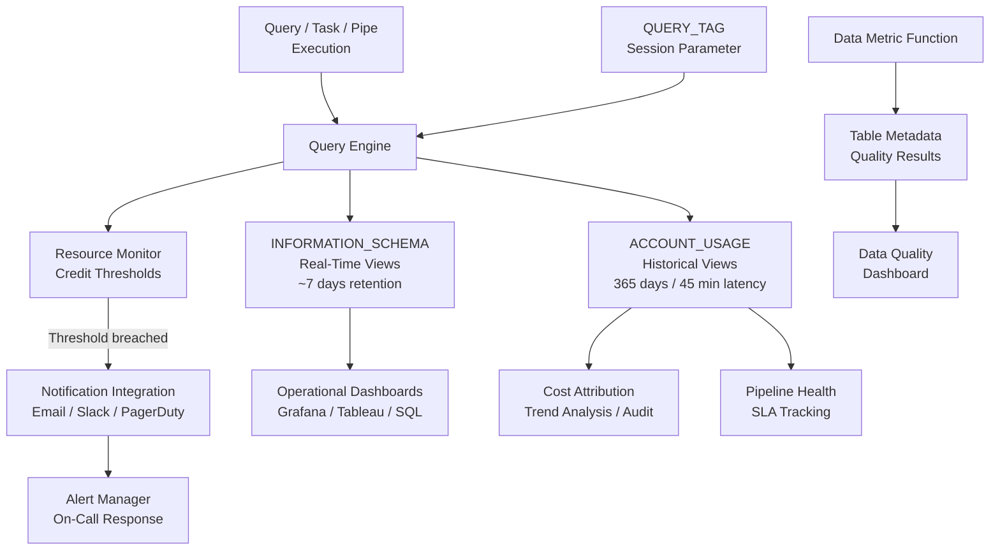

# 1. Use Logging and Monitoring Solutions in Snowflake

# 2. Overview

Snowflake logging and monitoring is the operational telemetry layer that exposes query execution, resource consumption, pipeline health, data quality, and security events through system views, account usage views, session parameters, and notification integrations. It enables engineers to trace pipeline execution, attribute costs, detect anomalies, and enforce SLAs without external agents or log shippers.

Native monitoring is implemented through:
- **INFORMATION_SCHEMA views:** Near-real-time telemetry with short retention (typically 7 days)
- **ACCOUNT_USAGE views:** Long-term historical telemetry with 45-minute latency and 365-day retention
- **Resource Monitors:** Credit consumption thresholds that trigger alerts or suspend warehouses
- **Notification Integrations:** Route alerts to email, Slack, PagerDuty, or webhooks
- **QUERY_TAG and SESSION parameters:** Inject traceability metadata into every executed statement
- **Data Metric Functions:** Programmatic data quality checks embedded in tables

This feature set exists because cloud data platforms require centralized observability to manage elastic compute costs, debug distributed query execution, and prove data freshness to downstream consumers. The intended audience is platform engineers, SREs, dataOps teams, and SnowPro Advanced exam candidates who must understand retention limits, view latency, privilege requirements, and the boundaries between real-time and historical monitoring.

# 3. SQL Object Summary

| Object/Feature | Type | Purpose | Source Objects or Inputs | Output Object or Observable Behavior | Execution Mode or Invocation Method |
|---|---|---|---|---|---|
| [INFORMATION_SCHEMA.QUERY_HISTORY](SQL Object Summary/INFORMATION_SCHEMA.QUERY_HISTORY.md) | System view | Near-real-time query telemetry | Query execution engine | Query text, duration, bytes scanned, warehouse | Query-time |
| [ACCOUNT_USAGE.QUERY_HISTORY](SQL Object Summary/ACCOUNT_USAGE.QUERY_HISTORY.md) | Account view | Long-term query audit trail | Query execution engine | Same as above, 365-day retention | Query-time, 45-min latency |
| [INFORMATION_SCHEMA.TASK_HISTORY](SQL Object Summary/INFORMATION_SCHEMA.TASK_HISTORY.md) | System view | Near-real-time task telemetry | Task scheduler | State, error code, timing, query ID | Query-time |
| [ACCOUNT_USAGE.TASK_HISTORY](SQL Object Summary/ACCOUNT_USAGE.TASK_HISTORY.md) | Account view | Long-term task audit trail | Task scheduler | Same as above, 365-day retention | Query-time, 45-min latency |
| [ACCOUNT_USAGE.WAREHOUSE_METERING_HISTORY](SQL Object Summary/ACCOUNT_USAGE.WAREHOUSE_METERING_HISTORY.md) | Account view | Credit consumption by warehouse | Warehouse usage | Credits used, start/end time | Query-time, 45-min latency |
| [ACCOUNT_USAGE.PIPE_USAGE_HISTORY](SQL Object Summary/ACCOUNT_USAGE.PIPE_USAGE_HISTORY.md) | Account view | Snowpipe load telemetry | Pipe operations | Files loaded, credits used, status | Query-time, 45-min latency |
| [ACCOUNT_USAGE.LOGIN_HISTORY](SQL Object Summary/ACCOUNT_USAGE.LOGIN_HISTORY.md) | Account view | Authentication events | Identity layer | User, IP, status, timestamp | Query-time, 45-min latency |
| [RESOURCE MONITOR](SQL Object Summary/RESOURCE MONITOR.md) | Account object | Credit threshold enforcement | Warehouse consumption | Alert or suspend action | Automatic at threshold |
| [NOTIFICATION INTEGRATION](SQL Object Summary/NOTIFICATION INTEGRATION.md) | Account object | External alert routing | Resource monitor or task state | Payload to email/Slack/webhook | Automatic on trigger |
| [QUERY_TAG](SQL Object Summary/QUERY_TAG.md) | Session parameter | Execution traceability | User-defined string | Tagged queries in history views | Per-session or per-query |
| [DATA METRIC FUNCTION](SQL Object Summary/DATA METRIC FUNCTION.md) | Schema object | Programmatic data quality check | Table column or expression | Pass/fail result in `DATA_METRIC_FUNCTION_REFERENCES` | Automatic or scheduled |
| [STREAM object metadata](SQL Object Summary/STREAM object metadata.md) | System view | Stream health and staleness | Stream state | `STALE` flag, source table | Query-time |

# 4. Architecture

The monitoring architecture separates real-time telemetry (INFORMATION_SCHEMA), historical analytics (ACCOUNT_USAGE), proactive controls (resource monitors), and external alerting (notification integrations). Query tags and session parameters inject contextual metadata that binds pipeline stages to observability records.

# 5. Data Flow / Process Flow

## Step 1: Execution and Metadata Emission
- **Input:** SQL query, task run, pipe load, or user login
- **Transformation:** Snowflake execution engine captures timing, resource consumption, state, and identity metadata
- **Output:** Raw telemetry written to internal system tables
- **Purpose:** Generate the data foundation for observability

## Step 2: Real-Time View Population
- **Input:** Internal system tables
- **Transformation:** INFORMATION_SCHEMA views expose recent records with minimal latency
- **Output:** Queryable near-real-time telemetry
- **Purpose:** Enable operational debugging and immediate pipeline health checks

## Step 3: Historical View Aggregation
- **Input:** Internal system tables
- **Transformation:** ACCOUNT_USAGE views aggregate and retain data for 365 days with 45-minute propagation delay
- **Output:** Long-term audit trail and trend data
- **Purpose:** Support cost analysis, compliance auditing, and capacity planning

## Step 4: Threshold Evaluation
- **Input:** Warehouse credit consumption or task failure events
- **Transformation:** Resource monitors evaluate consumption against thresholds; error integrations evaluate task states
- **Output:** Alert trigger or warehouse suspension
- **Purpose:** Proactively control costs and notify operators

## Step 5: Alert Dispatch
- **Input:** Threshold breach or state transition
- **Transformation:** Notification integration formats and routes payload to external endpoint
- **Output:** Email, Slack message, or PagerDuty incident
- **Purpose:** Human or automated response to anomalies

## Step 6: Traceability Binding
- **Input:** Session-level or query-level `QUERY_TAG`
- **Transformation:** Tag is persisted with query record in history views
- **Output:** Correlated pipeline execution records
- **Purpose:** Attribute queries to pipelines, users, or business units for cost and performance tracking

## Step 7: Data Quality Assessment
- **Input:** Table data and data metric function definitions
- **Transformation:** Functions evaluate column-level quality rules
- **Output:** Quality results in `DATA_METRIC_FUNCTION_REFERENCES`
- **Purpose:** Detect schema drift, null spikes, and distribution anomalies

# 6. Logical Breakdown

## Component: INFORMATION_SCHEMA Views
- **Responsibility:** Provide near-real-time access to query, task, and object metadata
- **Inputs:** System tables updated by execution engine
- **Outputs:** Filtered views with ~7-day retention
- **Dependencies:** Query must execute; user must have appropriate privileges
- **Failure Modes:** Data aged out after retention window; views may be empty for objects in different databases without proper grants

## Component: ACCOUNT_USAGE Views
- **Responsibility:** Provide long-term historical and audit data
- **Inputs:** Same system tables, aggregated with delay
- **Outputs:** 365-day history with 45-minute latency
- **Dependencies:** `ACCOUNTADMIN` or `MONITOR` privileges typically required
- **Failure Modes:** 45-minute delay unsuitable for real-time alerting; large date ranges scan massive data and perform slowly without filtering

## Component: QUERY_TAG Injection
- **Responsibility:** Bind contextual metadata to query execution records
- **Inputs:** User-defined string (pipeline name, run ID, business unit)
- **Outputs:** Tagged history records enabling filtered analysis
- **Dependencies:** Session or statement-level setting
- **Failure Modes:** Tag length limit (256 characters); special characters may require escaping; tags are not indexed, so filtering large history on tag alone is slow

## Component: Resource Monitor
- **Responsibility:** Enforce credit consumption thresholds per warehouse or account
- **Inputs:** Credit usage accumulation, configured limits
- **Outputs:** Alert notification or warehouse suspension
- **Dependencies:** Warehouse must be monitored; notification integration must be bound
- **Failure Modes:** Monitors evaluate periodically, not continuously; brief spikes may exceed limits before suspension; monitors do not retroactively limit already-consumed credits

## Component: Notification Integration
- **Responsibility:** Route Snowflake alerts to external systems
- **Inputs:** Resource monitor event or task state transition
- **Outputs:** JSON or formatted payload to email, Slack, PagerDuty, or webhook
- **Dependencies:** External endpoint must be accessible; integration must be created with appropriate security context
- **Failure Modes:** Network unreachable; endpoint rate limiting; payload schema mismatch; authentication token expiration

## Component: Task History Tracking
- **Responsibility:** Record task execution outcomes for pipeline observability
- **Inputs:** Task scheduler events
- **Outputs:** `TASK_HISTORY` rows with state, error details, timing
- **Dependencies:** Task must execute; stream conditions may cause skips
- **Failure Modes:** History retention limited; suspended tasks still appear in history but do not generate new records until resumed

## Component: Pipe Usage Tracking
- **Responsibility:** Monitor continuous file ingestion health
- **Inputs:** Snowpipe load operations
- **Outputs:** `PIPE_USAGE_HISTORY` with file counts, credits, status
- **Dependencies:** Pipe must exist and be active
- **Failure Modes:** Failed file loads may not appear immediately; queue depth is not directly exposed

## Component: Data Metric Function
- **Responsibility:** Programmatically validate data quality at the table level
- **Inputs:** Table data, metric function definition
- **Outputs:** Pass/fail results stored in metadata
- **Dependencies:** Function must be bound to table; user must have `EXECUTE DATA METRIC FUNCTION` privilege
- **Failure Modes:** Functions add overhead to DML; complex metrics may timeout; results are not automatically alerted without external polling

## Component: Stream Health Monitor
- **Responsibility:** Detect stream staleness and consumption lag
- **Inputs:** Stream metadata, source table DDL changes
- **Outputs:** `STALE` flag, `SYSTEM$STREAM_HAS_DATA` result
- **Dependencies:** Stream must exist; task must query stream
- **Failure Modes:** Stale streams do not self-heal; unconsumed streams grow conceptually but do not consume storage

# 7. Data Model

## ACCOUNT_USAGE.QUERY_HISTORY

| Column | Role | Grain | Notes |
|---|---|---|---|
| [`QUERY_ID`](ACCOUNT_USAGE.TASK_HISTORY/QUERY_ID.md) | Primary identifier | One per query | UUID |
| [`QUERY_TEXT`](ACCOUNT_USAGE.QUERY_HISTORY/QUERY_TEXT.md) | Execution detail | One per query | Truncated at 10,000 characters |
| [`DATABASE_NAME`](ACCOUNT_USAGE.TASK_HISTORY/DATABASE_NAME.md) | Context | One per query | |
| [`SCHEMA_NAME`](ACCOUNT_USAGE.TASK_HISTORY/SCHEMA_NAME.md) | Context | One per query | |
| [`WAREHOUSE_NAME`](ACCOUNT_USAGE.WAREHOUSE_METERING_HISTORY/WAREHOUSE_NAME.md) | Compute target | One per query | |
| [`USER_NAME`](ACCOUNT_USAGE.QUERY_HISTORY/USER_NAME.md) | Identity | One per query | |
| [`ROLE_NAME`](ACCOUNT_USAGE.QUERY_HISTORY/ROLE_NAME.md) | Privilege context | One per query | |
| [`EXECUTION_STATUS`](ACCOUNT_USAGE.QUERY_HISTORY/EXECUTION_STATUS.md) | Outcome | One per query | `SUCCESS`, `FAIL`, `CANCELLED` |
| [`ERROR_CODE`](ACCOUNT_USAGE.TASK_HISTORY/ERROR_CODE.md) | Failure classification | One per failed query | Null on success |
| [`ERROR_MESSAGE`](ACCOUNT_USAGE.TASK_HISTORY/ERROR_MESSAGE.md) | Failure detail | One per failed query | Null on success |
| [`START_TIME`](ACCOUNT_USAGE.WAREHOUSE_METERING_HISTORY/START_TIME.md) | Timing | One per query | |
| [`END_TIME`](ACCOUNT_USAGE.WAREHOUSE_METERING_HISTORY/END_TIME.md) | Timing | One per query | |
| [`TOTAL_ELAPSED_TIME`](ACCOUNT_USAGE.QUERY_HISTORY/TOTAL_ELAPSED_TIME.md) | Duration ms | One per query | |
| [`BYTES_SCANNED`](ACCOUNT_USAGE.QUERY_HISTORY/BYTES_SCANNED.md) | Data volume | One per query | Micro-partition bytes |
| [`ROWS_PRODUCED`](ACCOUNT_USAGE.QUERY_HISTORY/ROWS_PRODUCED.md) | Result volume | One per query | |
| [`CREDITS_USED_CLOUD_SERVICES`](ACCOUNT_USAGE.QUERY_HISTORY/CREDITS_USED_CLOUD_SERVICES.md) | Cost | One per query | Cloud services credits |
| [`QUERY_TAG`](Parameters  Variables  Configuration/QUERY_TAG.md) | Traceability | One per query | User-defined metadata |

## Grain
One row per query executed.

## ACCOUNT_USAGE.WAREHOUSE_METERING_HISTORY

| Column | Role | Grain | Notes |
|---|---|---|---|
| [`WAREHOUSE_ID`](ACCOUNT_USAGE.WAREHOUSE_METERING_HISTORY/WAREHOUSE_ID.md) | Identifier | One per warehouse per interval | |
| [`WAREHOUSE_NAME`](ACCOUNT_USAGE.WAREHOUSE_METERING_HISTORY/WAREHOUSE_NAME.md) | Context | One per warehouse per interval | |
| [`START_TIME`](ACCOUNT_USAGE.WAREHOUSE_METERING_HISTORY/START_TIME.md) | Interval start | One per warehouse per interval | |
| [`END_TIME`](ACCOUNT_USAGE.WAREHOUSE_METERING_HISTORY/END_TIME.md) | Interval end | One per warehouse per interval | |
| [`CREDITS_USED`](ACCOUNT_USAGE.WAREHOUSE_METERING_HISTORY/CREDITS_USED.md) | Cost | One per warehouse per interval | Includes cloud services allocation |
| [`CREDITS_USED_COMPUTE`](ACCOUNT_USAGE.WAREHOUSE_METERING_HISTORY/CREDITS_USED_COMPUTE.md) | Compute cost | One per warehouse per interval | Warehouse compute only |

## Grain
One row per warehouse per metering interval (typically hourly).

## ACCOUNT_USAGE.TASK_HISTORY

| Column | Role | Grain | Notes |
|---|---|---|---|
| [`NAME`](ACCOUNT_USAGE.TASK_HISTORY/NAME.md) | Task identifier | One per execution | |
| [`QUERY_ID`](ACCOUNT_USAGE.TASK_HISTORY/QUERY_ID.md) | Execution trace | One per execution | Joins to `QUERY_HISTORY` |
| [`DATABASE_NAME`](ACCOUNT_USAGE.TASK_HISTORY/DATABASE_NAME.md) | Context | One per execution | |
| [`SCHEMA_NAME`](ACCOUNT_USAGE.TASK_HISTORY/SCHEMA_NAME.md) | Context | One per execution | |
| [`SCHEDULED_TIME`](ACCOUNT_USAGE.TASK_HISTORY/SCHEDULED_TIME.md) | Intended start | One per execution | |
| [`COMPLETED_TIME`](ACCOUNT_USAGE.TASK_HISTORY/COMPLETED_TIME.md) | Actual end | One per execution | |
| [`STATE`](ACCOUNT_USAGE.TASK_HISTORY/STATE.md) | Outcome | One per execution | `SUCCEEDED`, `FAILED`, `SKIPPED`, `CANCELLED` |
| [`ERROR_CODE`](ACCOUNT_USAGE.TASK_HISTORY/ERROR_CODE.md) | Failure code | One per failed execution | |
| [`ERROR_MESSAGE`](ACCOUNT_USAGE.TASK_HISTORY/ERROR_MESSAGE.md) | Failure detail | One per failed execution | |
| [`RUN_ID`](ACCOUNT_USAGE.TASK_HISTORY/RUN_ID.md) | Instance ID | One per execution | |

## Grain
One row per task execution.

## Resource Monitor Configuration

| Property | Role | Allowed Values | Default |
|---|---|---|---|
| [`CREDIT_QUOTA`](Parameters  Variables  Configuration/CREDIT_QUOTA.md) | Threshold | Number of credits | None |
| [`FREQUENCY`](Parameters  Variables  Configuration/FREQUENCY.md) | Evaluation window | `MONTHLY`, `DAILY`, `WEEKLY`, `YEARLY`, `NEVER` | `MONTHLY` |
| [`START_TIMESTAMP`](Resource Monitor Configuration/START_TIMESTAMP.md) | Window anchor | Timestamp | Current time |
| [`TRIGGERS`](Parameters  Variables  Configuration/TRIGGERS.md) | Action bindings | `ON {PERCENT} PERCENT DO {SUSPEND \| SUSPEND_IMMEDIATE \| NOTIFY}` | None |

# 8. Business Logic

## View Retention and Latency Rules
- **INFORMATION_SCHEMA views:** Near-real-time (seconds to minutes latency), ~7-day retention. Suitable for operational debugging.
- **ACCOUNT_USAGE views:** 45-minute latency, 365-day retention. Suitable for cost analysis, auditing, and trend detection.
- **Query pattern:** Operational dashboards should query `INFORMATION_SCHEMA`; monthly cost reports should query `ACCOUNT_USAGE`.

## QUERY_TAG Semantics
- Set via `ALTER SESSION SET QUERY_TAG = '...'` or inline `/*+ QUERY_TAG('...') */` hint
- Maximum length: 256 characters
- Persisted in `QUERY_HISTORY.QUERY_TAG` and `QUERY_HISTORY` variants
- Used for cost attribution, pipeline traceability, and workload classification
- Tags are case-sensitive and stored as-is

## Resource Monitor Evaluation
- Monitors evaluate credit consumption at regular intervals, not continuously
- `SUSPEND` allows running queries to complete before suspending warehouse
- `SUSPEND_IMMEDIATE` aborts running queries
- `NOTIFY` sends alert without suspending
- Multiple triggers can be defined (e.g., notify at 75%, suspend at 100%)
- Monitors can target single warehouse, multiple warehouses, or account level

## Task History Interpretation
- `SKIPPED` indicates `WHEN` clause evaluated to false; not a failure
- `CANCELLED` indicates manual suspension or warehouse restart during execution
- `FAILED` with null `QUERY_ID` indicates failure before query submission (e.g., privilege check)
- `RUN_ID` increments per execution; gaps indicate skipped or failed runs

## Pipe Usage Interpretation
- `PIPE_USAGE_HISTORY` shows credits consumed by Snowpipe serverless compute
- Failed loads appear with error context in `COPY_HISTORY` or `PIPE_USAGE_HISTORY`
- File-level granularity requires joining to `COPY_HISTORY`

## Data Metric Function Semantics
- Bound to tables via `ALTER TABLE ... ADD DATA METRIC FUNCTION`
- Evaluated automatically on DML or on schedule depending on configuration
- Results stored in `DATA_METRIC_FUNCTION_REFERENCES` and `DATA_METRIC_FUNCTION_RESULTS`
- Common metrics: `NULL_COUNT`, `UNIQUE_COUNT`, `ROW_COUNT`, `FRESHNESS`

## Stream Monitoring Logic
- `SYSTEM$STREAM_HAS_DATA('stream')` returns string `'TRUE'` or `'FALSE'`
- `STALE` flag in `INFORMATION_SCHEMA.STREAMS` indicates source DDL changed
- Unconsumed streams do not advance offset; tasks reading streams without DML do not consume them

# 9. Transformations

## Query Execution to Telemetry Record
- **Source:** Query engine processing SQL
- **Output:** Row in `QUERY_HISTORY` with timing, bytes, rows, status
- **Logic:** Engine captures start/end time, execution plan stats, identity, and tag
- **Meaning:** Persistent audit of all compute activity
- **Impact:** Enables cost attribution and performance debugging

## Credit Consumption to Threshold Event
- **Source:** Accumulated warehouse credits over time
- **Output:** Resource monitor trigger firing alert or suspension
- **Logic:** Monitor aggregates `WAREHOUSE_METERING_HISTORY` credits against quota
- **Meaning:** Proactive cost control
- **Impact:** Prevents runaway spending; may abort running queries

## Task State to Notification Payload
- **Source:** Task completion or failure
- **Output:** JSON payload to external endpoint
- **Logic:** Error integration extracts metadata and formats notification
- **Meaning:** Operational alert for pipeline health
- **Impact:** Enables rapid incident response

## Raw Data to Quality Metric
- **Source:** Table column values
- **Output:** Pass/fail result in data metric function store
- **Logic:** Function evaluates rule (e.g., `NULL_COUNT < threshold`)
- **Meaning:** Automated data quality assessment
- **Impact:** Detects degradation without manual querying

## Session Context to Traceable Record
- **Source:** `QUERY_TAG` and session parameters
- **Output:** Annotated history record
- **Logic:** Tag is persisted with query metadata
- **Meaning:** Correlation of queries to business context
- **Impact:** Enables filtered analysis and chargeback

# 10. Parameters / Variables / Configuration

| Name | Type | Purpose | Allowed Values | Default | Where Used | Effect |
|---|---|---|---|---|---|---|
| [`QUERY_TAG`](Parameters  Variables  Configuration/QUERY_TAG.md) | Session parameter | Execution traceability | String <= 256 chars | None | Session or query | Tags history records |
| [`TIMESTAMP_OUTPUT_FORMAT`](Parameters  Variables  Configuration/TIMESTAMP_OUTPUT_FORMAT.md) | Session parameter | Timestamp display format | Format string | `YYYY-MM-DD HH24:MI:SS.FF3 TZHTZM` | Session | Affects timestamp rendering in results |
| [`TIMEZONE`](Parameters  Variables  Configuration/TIMEZONE.md) | Session parameter | Timestamp context | IANA timezone | `UTC` | Session | Affects `CURRENT_TIMESTAMP` and history timestamps |
| [`WAREHOUSE`](Parameters  Variables  Configuration/WAREHOUSE.md) | Session parameter | Default compute | Warehouse name | None | Session | Determines where queries execute |
| [`STATEMENT_TIMEOUT_IN_SECONDS`](Parameters  Variables  Configuration/STATEMENT_TIMEOUT_IN_SECONDS.md) | Session parameter | Query abort threshold | Integer | `172800` (48 hours) | Session | Cancels long-running queries |
| [`CREDIT_QUOTA`](Parameters  Variables  Configuration/CREDIT_QUOTA.md) | Resource monitor | Spending limit | Number | None | `CREATE RESOURCE MONITOR` | Threshold for alert/suspend |
| [`FREQUENCY`](Parameters  Variables  Configuration/FREQUENCY.md) | Resource monitor | Evaluation period | `MONTHLY`, `DAILY`, `WEEKLY`, `YEARLY`, `NEVER` | `MONTHLY` | `CREATE RESOURCE MONITOR` | Reset window for quota |
| [`TRIGGERS`](Parameters  Variables  Configuration/TRIGGERS.md) | Resource monitor | Action bindings | Percent + action pairs | None | `CREATE RESOURCE MONITOR` | Defines alert thresholds |
| [`NOTIFICATION_INTEGRATION`](Parameters  Variables  Configuration/NOTIFICATION_INTEGRATION.md) | Account object | Alert endpoint | Integration name | None | Resource monitor, Task | Routes alerts externally |
| [`DATA_METRIC_SCHEDULE`](Parameters  Variables  Configuration/DATA_METRIC_SCHEDULE.md) | Table property | Quality check cadence | `USING CRON ...` or interval | On DML | `ALTER TABLE` | When metrics evaluate |

# 11. APIs / Interfaces

## Interface: SELECT FROM INFORMATION_SCHEMA.QUERY_HISTORY
- **Invocation:** `SELECT * FROM INFORMATION_SCHEMA.QUERY_HISTORY WHERE START_TIME >= DATEADD(hour, -1, CURRENT_TIMESTAMP())`
- **Input:** Time range, filters
- **Output:** Query execution records
- **Error Behavior:** Empty set if no queries or insufficient privileges
- **Consumers:** Real-time dashboards, operational debugging

## Interface: SELECT FROM ACCOUNT_USAGE.QUERY_HISTORY
- **Invocation:** `SELECT * FROM SNOWFLAKE.ACCOUNT_USAGE.QUERY_HISTORY WHERE START_TIME >= DATEADD(day, -30, CURRENT_TIMESTAMP())`
- **Input:** Date range up to 365 days
- **Output:** Historical query records
- **Error Behavior:** 45-minute latency; requires elevated privileges
- **Consumers:** Cost reports, audit trails, capacity planning

## Interface: CREATE RESOURCE MONITOR
- **Invocation:** `CREATE RESOURCE MONITOR monitor_name WITH CREDIT_QUOTA = N FREQUENCY = MONTHLY START_TIMESTAMP = '...' TRIGGERS ON 75 PERCENT DO NOTIFY ON 100 PERCENT DO SUSPEND`
- **Input:** Quota, frequency, thresholds, actions
- **Output:** Resource monitor object
- **Error Behavior:** Fails if invalid frequency or quota
- **Consumers:** FinOps, platform engineering

## Interface: CREATE NOTIFICATION INTEGRATION
- **Invocation:** `CREATE NOTIFICATION INTEGRATION name TYPE = QUEUE NOTIFICATION_PROVIDER = AWS_SNS/AWS_SQS/GCP_PUBSUB/AZURE_EVENT_GRID DIRECTION = OUTBOUND ...`
- **Input:** Cloud provider, endpoint, credentials
- **Output:** Integration object for alert routing
- **Error Behavior:** Fails if credentials invalid or network unreachable
- **Consumers:** Alerting infrastructure, SRE teams

## Interface: ALTER SESSION SET QUERY_TAG
- **Invocation:** `ALTER SESSION SET QUERY_TAG = 'pipeline=daily_etl;run_id=123'`
- **Input:** Tag string
- **Output:** Session context updated
- **Error Behavior:** Truncated if exceeds 256 characters
- **Consumers:** Pipeline tasks, BI tools, ad hoc queries

## Interface: SYSTEM$STREAM_HAS_DATA
- **Invocation:** `SELECT SYSTEM$STREAM_HAS_DATA('stream_name')`
- **Input:** Stream name
- **Output:** String `'TRUE'` or `'FALSE'`
- **Error Behavior:** Fails if stream missing
- **Consumers:** Monitoring queries, task WHEN clauses

## Interface: SHOW RESOURCE MONITORS
- **Invocation:** `SHOW RESOURCE MONITORS`
- **Input:** None
- **Output:** Monitor list with quotas and states
- **Error Behavior:** Requires `MONITOR` or `ACCOUNTADMIN`
- **Consumers:** Cost management dashboards

# 12. Execution / Deployment

## Monitoring Stack Deployment
- Deploy read-only monitoring roles with `SELECT` on `ACCOUNT_USAGE` for analytics teams
- Create service roles for automated monitoring tasks that query history and publish metrics
- Use `QUERY_TAG` in all production tasks and stored procedures

## Resource Monitor Deployment
- Create monitors for each production warehouse with notify-at-75%, suspend-at-100% triggers
- Bind notification integrations to monitors for real-time cost alerts
- Set `FREQUENCY = DAILY` for development warehouses to prevent overnight runaway costs

## Dashboard Deployment
- Build operational dashboards on `INFORMATION_SCHEMA` for last-24-hour health
- Build cost dashboards on `ACCOUNT_USAGE` for monthly chargeback
- Materialize filtered extracts from `ACCOUNT_USAGE` into reporting tables to avoid repeated full scans

## Alerting Deployment
- Configure Slack or PagerDuty notification integrations for resource monitors
- Configure error integrations on critical tasks
- Implement polling tasks that query `TASK_HISTORY` and publish aggregated alerts to reduce noise

## Data Quality Monitoring Deployment
- Define data metric functions for critical tables (null checks, uniqueness, freshness)
- Bind functions to tables with appropriate schedules
- Create monitoring tasks that query `DATA_METRIC_FUNCTION_RESULTS` and alert on failures

## Environment Behavior
- Development: Aggressive resource monitors with low quotas, verbose `QUERY_TAG`, short statement timeouts
- Production: Comprehensive task error integrations, data metric functions on all fact tables, cost attribution tags

# 13. Observability

## Query Performance Monitoring
- Track `TOTAL_ELAPSED_TIME`, `BYTES_SCANNED`, and `PARTITIONS_SCANNED` vs. `PARTITIONS_TOTAL` in `QUERY_HISTORY`
- Identify queries with high scan ratios indicating poor pruning
- Monitor compilation time vs. execution time to detect optimizer issues

## Cost Attribution
- Aggregate `CREDITS_USED` from `WAREHOUSE_METERING_HISTORY` by warehouse, role, and user
- Join `QUERY_HISTORY` to `WAREHOUSE_METERING_HISTORY` for query-level cost approximation
- Use `QUERY_TAG` to attribute costs to pipelines, teams, or business units

## Pipeline Health Monitoring
- Query `TASK_HISTORY` for success rates, latency trends, and failure patterns
- Monitor `SKIPPED` vs. `FAILED` ratios to distinguish conditional bypass from actual errors
- Track end-to-end pipeline latency: leaf task `COMPLETED_TIME` minus root task `SCHEDULED_TIME`

## Data Quality Monitoring
- Poll `DATA_METRIC_FUNCTION_RESULTS` for table-level quality scores
- Track null rates, cardinality, and freshness over time
- Correlate quality degradation with pipeline deployment timestamps

## Security Monitoring
- Query `LOGIN_HISTORY` for failed authentication attempts, unusual IP addresses, and off-hours access
- Monitor `QUERY_HISTORY` for privilege escalation attempts or unusual object access patterns
- Track role usage to detect dormant or over-provisioned roles

## Stream and Pipe Monitoring
- Monitor `SYSTEM$STREAM_HAS_DATA` for persistent true values indicating pipeline stalls
- Query `PIPE_USAGE_HISTORY` for file backlog and error rates
- Track Snowpipe credit consumption relative to loaded data volume

## Key Metrics
- Query success/failure/cancel rates by warehouse and role
- Average and p95 query duration by query type
- Daily credit consumption by warehouse and pipeline
- Task graph end-to-end latency
- Data quality metric pass rates
- Stream staleness events per week
- Login failure rate and anomaly score

# 14. Failure Handling & Recovery

## History View Query Timeout
- **What breaks:** Unfiltered queries on `ACCOUNT_USAGE` scan 365 days of data and timeout
- **Detection:** Query cancelled after `STATEMENT_TIMEOUT_IN_SECONDS`
- **Fallback:** Query `INFORMATION_SCHEMA` for recent data
- **Recovery:** Add `START_TIME >= DATEADD(day, -7, CURRENT_TIMESTAMP())` filter; cluster or partition materialized extracts

## Resource Monitor False Positives
- **What breaks:** Monitor suspends warehouse during critical pipeline execution
- **Detection:** `CANCELLED` queries in `QUERY_HISTORY`; alert from monitor
- **Fallback:** Use `SUSPEND` (not `SUSPEND_IMMEDIATE`) to allow completion; manually resume warehouse
- **Recovery:** Adjust quota or frequency; move workload to separate warehouse; implement pre-execution credit checks

## Notification Integration Delivery Failure
- **What breaks:** Alerts fail to reach Slack/PagerDuty; silent failures persist
- **Detection:** Missing alerts despite known failures; monitor endpoint logs
- **Fallback:** Manual polling of `TASK_HISTORY` and `WAREHOUSE_METERING_HISTORY`
- **Recovery:** Verify webhook URL and authentication; test integration with `DESCRIBE NOTIFICATION INTEGRATION`; check endpoint rate limits

## QUERY_TAG Loss
- **What breaks:** Queries appear untagged in history, breaking cost attribution
- **Detection:** Null or inconsistent `QUERY_TAG` values for known pipeline queries
- **Fallback:** Reconstruct attribution from `USER_NAME`, `WAREHOUSE_NAME`, and query text patterns
- **Recovery:** Audit task definitions for `QUERY_TAG` setting; add session initialization to procedures

## Data Metric Function Overhead
- **What breaks:** Complex metrics significantly slow DML on monitored tables
- **Detection:** Increased `TOTAL_ELAPSED_TIME` for insert/update operations; warehouse credit spikes
- **Fallback:** Disable metrics temporarily during bulk loads
- **Recovery:** Simplify metric logic; move to scheduled evaluation instead of DML-triggered; use sampling

## ACCOUNT_USAGE Latency Gap
- **What breaks:** 45-minute delay prevents real-time failure detection for critical pipelines
- **Detection:** Known failures not yet visible in `ACCOUNT_USAGE`
- **Fallback:** Use `INFORMATION_SCHEMA` for immediate debugging
- **Recovery:** Implement `INFORMATION_SCHEMA` polling for real-time alerts; use `ACCOUNT_USAGE` for post-hoc analysis only

## Stream Monitoring Blind Spots
- **What breaks:** Stream becomes stale but no alert fires because no task is scheduled to check it
- **Detection:** Downstream data freshness degrades
- **Fallback:** Manual `SHOW STREAMS` or `INFORMATION_SCHEMA.STREAMS` query
- **Recovery:** Implement dedicated monitoring task that polls stream staleness and alerts; recreate stale streams

## Privilege Escalation for Monitoring
- **What breaks:** Users granted `ACCOUNTADMIN` for monitoring pose security risk
- **Detection:** Audit `LOGIN_HISTORY` and `QUERY_HISTORY` for elevated role usage
- **Fallback:** Create custom roles with `MONITOR` privileges scoped to specific views
- **Recovery:** Implement least-privilege monitoring roles; use row access policies on sensitive history data if needed

# 15. Security & Access Control

## Privilege Requirements

| Action | Required Privilege | Object |
|---|---|---|
| [Query ACCOUNT_USAGE](Privilege Requirements/Query ACCOUNT_USAGE.md) | `MONITOR` or `ACCOUNTADMIN` | Account |
| [Query INFORMATION_SCHEMA](Privilege Requirements/Query INFORMATION_SCHEMA.md) | `USAGE` on database/schema | Database/Schema |
| [Create resource monitor](Privilege Requirements/Create resource monitor.md) | `CREATE RESOURCE MONITOR` | Account |
| [Create notification integration](Privilege Requirements/Create notification integration.md) | `CREATE INTEGRATION` | Account |
| [View task history](Privilege Requirements/View task history.md) | `MONITOR` or `OWNERSHIP` | Task |
| [Bind data metric function](Privilege Requirements/Bind data metric function.md) | `OWNERSHIP` on table | Table |
| [Execute data metric function](Privilege Requirements/Execute data metric function.md) | `EXECUTE DATA METRIC FUNCTION` | Function |

## History Data Sensitivity
- `QUERY_HISTORY` contains query text that may include literals, table names, and business logic
- Restrict `SELECT` on `ACCOUNT_USAGE.QUERY_HISTORY` to authorized roles
- `LOGIN_HISTORY` contains IP addresses and authentication outcomes; treat as sensitive

## QUERY_TAG and Privacy
- `QUERY_TAG` may contain business unit names or pipeline identifiers that reveal organizational structure
- Tags are not encrypted at rest separately from history views
- Avoid embedding PII or secrets in query tags

## Resource Monitor Scope
- Account-level monitors can suspend any warehouse; restrict creation to platform teams
- Warehouse-level monitors affect only targeted warehouses
- Monitors do not prevent credit consumption; they only react to it

## Notification Integration Security
- Webhook URLs and API keys in notification integrations should be rotated regularly
- Restrict `USAGE` on integrations to resource monitors and tasks
- Validate payload integrity at the endpoint to prevent spoofing

# 16. Performance / Scalability Considerations

## ACCOUNT_USAGE Scan Performance
- `ACCOUNT_USAGE` views are large, unsorted tables; queries without `START_TIME` filters perform full scans
- Always filter on `START_TIME >= DATEADD(...)` with the narrowest possible window
- For repeated queries, materialize filtered extracts into tables with clustering keys

## INFORMATION_SCHEMA Latency
- Near-real-time but not instantaneous; expect seconds to minutes of delay for very recent queries
- Not suitable for sub-second alerting; use external polling or task-based checks for real-time needs

## Resource Monitor Evaluation Frequency
- Monitors evaluate at fixed intervals, not continuously; credit overruns between evaluations are possible
- Very large warehouses can consume significant credits between evaluation ticks

## Data Metric Function Execution Cost
- DML-triggered metrics execute synchronously and add overhead to every insert/update
- For high-volume tables, prefer scheduled metrics over DML-triggered
- Complex metric functions (custom SQL) may consume substantial compute

## QUERY_TAG Filtering Cost
- `QUERY_TAG` is not indexed in history views; filtering on tag alone is expensive over large date ranges
- Combine `QUERY_TAG` filter with `START_TIME` and `WAREHOUSE_NAME` to reduce scan scope

## Dashboard Refresh Rates
- Operational dashboards querying `INFORMATION_SCHEMA` can refresh every few minutes
- Cost dashboards on `ACCOUNT_USAGE` should refresh hourly or daily due to latency and scan cost
- Cache dashboard results to avoid repeated history view queries

## Notification Volume
- High-frequency tasks with error integrations can generate alert storms
- Implement aggregation tasks that batch failures into single notifications
- Use PagerDuty severity rules to suppress low-priority repeated alerts

## Stream and Pipe Polling
- Repeated `SYSTEM$STREAM_HAS_DATA` calls are lightweight but should not poll more frequently than necessary
- Pipe queue inspection requires `PIPE_USAGE_HISTORY` queries with 45-minute latency; real-time queue depth is not directly available

# 17. Assumptions & Constraints

## Explicit Assumptions
- The reader operates a production Snowflake environment requiring cost control, pipeline observability, and data quality assurance
- External alerting endpoints (Slack, PagerDuty, email) are available and accessible from Snowflake
- Pipelines use tasks, streams, and warehouses as primary compute objects

## Engine Boundaries
- `ACCOUNT_USAGE` latency is approximately 45 minutes and not configurable
- `INFORMATION_SCHEMA` retention is approximately 7 days and not configurable
- Resource monitors evaluate periodically; they cannot prevent credit overruns in real time
- Data metric functions are limited to specific built-in types or custom SQL with performance constraints
- Query tags have a 256-character limit and are not indexed
- Snowflake does not provide a native time-series metrics database; monitoring requires polling history views or external tools

## Exam-Relevant Defaults
- `ACCOUNT_USAGE` retention: 365 days
- `INFORMATION_SCHEMA` retention: ~7 days
- Resource monitor default frequency: `MONTHLY`
- `QUERY_TAG` maximum length: 256 characters
- `STATEMENT_TIMEOUT_IN_SECONDS` default: 172800 (48 hours)
- `SYSTEM$STREAM_HAS_DATA` returns string `'TRUE'` or `'FALSE'`

## Ambiguities
- Exact `INFORMATION_SCHEMA` retention period may vary slightly by view and is not guaranteed
- Resource monitor evaluation interval is not documented as a fixed duration
- The performance characteristics of `ACCOUNT_USAGE` views may vary based on account size and query patterns

# 18. Future Enhancements

- Implement materialized monitoring tables that poll `INFORMATION_SCHEMA` every 15 minutes and retain data beyond the 7-day window for operational trending
- Create unified pipeline health views joining `TASK_HISTORY`, `STREAMS`, `PIPE_USAGE_HISTORY`, and quarantine tables into a single operational dashboard source
- Replace ad hoc `QUERY_TAG` usage with standardized tag schemas (key=value pairs) and parsing functions for consistent cost attribution
- Build automated cost anomaly detection tasks that query `WAREHOUSE_METERING_HISTORY` and alert on unexpected credit spikes relative to historical baselines
- Implement data quality scorecards as scheduled tasks that aggregate `DATA_METRIC_FUNCTION_RESULTS` and publish trend tables for BI consumption
- Add stream staleness detection as a dedicated monitoring task with its own error integration to ensure pipeline blockers are alerted immediately
- Create resource monitor templates per environment (dev/prod) with appropriate quotas and notification channels to standardize FinOps controls
- Develop query performance baselining tasks that track p95 duration and bytes scanned per pipeline and alert on regression
- Migrate from DML-triggered data metrics to scheduled metrics for high-volume tables to reduce write amplification
- Implement least-privilege monitoring roles with scoped `ACCOUNT_USAGE` access instead of granting `ACCOUNTADMIN` to analytics teams
