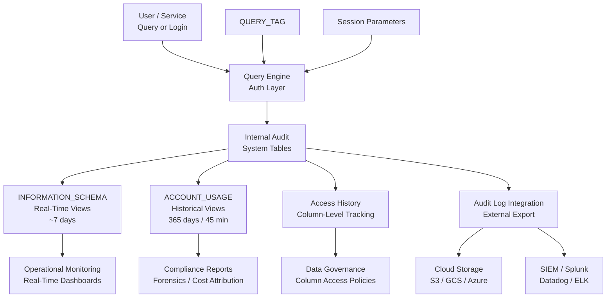

# 1. Auditing in Snowflake

# 2. Overview

Snowflake auditing is the comprehensive telemetry and compliance layer that records who accessed what data, when, from where, and how. It captures query execution, authentication events, column-level data access, privilege changes, and object modifications through system views, account usage views, and optional external log streaming. Auditing exists to satisfy regulatory requirements (SOC 2, GDPR, HIPAA, PCI-DSS), support forensic investigations, enable data governance, and provide operational accountability.

Native auditing is implemented through:
- **ACCOUNT_USAGE views:** Long-term historical records with 365-day retention and 45-minute latency
- **INFORMATION_SCHEMA views:** Near-real-time operational telemetry with ~7-day retention
- **ACCESS_HISTORY:** Column-level and table-level access tracking for data governance
- **LOGIN_HISTORY:** Authentication and authorization events
- **QUERY_HISTORY:** Complete SQL execution audit trail
- **External Log Streaming:** Export audit events to cloud storage or SIEM platforms

The intended consumers are security engineers, compliance officers, data governance teams, platform administrators, and SnowPro Advanced exam candidates who must understand retention limits, view schemas, privilege requirements, and the distinction between real-time and historical audit data.

# 3. SQL Object Summary

| Object/Feature | Type | Purpose | Source Objects or Inputs | Output Object or Observable Behavior | Execution Mode or Invocation Method |
|---|---|---|---|---|---|
| ACCOUNT_USAGE.QUERY_HISTORY | Account view | SQL execution audit | Query engine | Query text, user, role, timing, status, bytes | Query-time, 45-min latency |
| ACCOUNT_USAGE.LOGIN_HISTORY | Account view | Authentication audit | Identity layer | User, IP, status, timestamp, auth method | Query-time, 45-min latency |
| ACCOUNT_USAGE.ACCESS_HISTORY | Account view | Column/table access audit | Query execution | Columns accessed, tables referenced, query ID | Query-time, 45-min latency |
| ACCOUNT_USAGE.WAREHOUSE_METERING_HISTORY | Account view | Compute consumption audit | Warehouse usage | Credits, time intervals, warehouse | Query-time, 45-min latency |
| ACCOUNT_USAGE.COPY_HISTORY | Account view | Load operation audit | COPY and Pipe operations | File names, rows loaded, errors | Query-time, 45-min latency |
| ACCOUNT_USAGE.PIPE_USAGE_HISTORY | Account view | Snowpipe operation audit | Pipe serverless compute | Files processed, credits, status | Query-time, 45-min latency |
| ACCOUNT_USAGE.TASK_HISTORY | Account view | Task execution audit | Task scheduler | State, error code, timing, query ID | Query-time, 45-min latency |
| INFORMATION_SCHEMA.QUERY_HISTORY | System view | Near-real-time query audit | Query engine | Same as account view, shorter retention | Query-time, near real-time |
| INFORMATION_SCHEMA.LOGIN_HISTORY | System view | Near-real-time auth audit | Identity layer | Same as account view, shorter retention | Query-time, near real-time |
| INFORMATION_SCHEMA.TABLE_STORAGE_METRICS | System view | Storage audit | Table metadata | Bytes, rows, clustering info | Query-time |
| QUERY_TAG | Session parameter | Execution traceability | User-defined metadata | Tagged audit records | Per-session or per-query |
| AUDIT_LOG | External integration | Export to SIEM/storage | Internal audit events | Files in external stage | Automatic, continuous |

# 4. Architecture

The auditing architecture separates event generation (query execution, authentication, data access), internal persistence (system tables), real-time exposure (INFORMATION_SCHEMA), historical aggregation (ACCOUNT_USAGE), and external export (audit log integration). Access history provides granular column-level tracking for data governance.

# 5. Data Flow / Process Flow

## Step 1: Event Generation
- **Input:** User login, SQL query execution, privilege grant, object creation
- **Transformation:** Authentication layer and query engine generate audit events with identity, timing, and context
- **Output:** Raw audit records in internal system tables
- **Purpose:** Capture every security-relevant action

## Step 2: Real-Time Population
- **Input:** Internal system tables
- **Transformation:** INFORMATION_SCHEMA views expose recent records with minimal latency
- **Output:** Near-real-time audit data for operational monitoring
- **Purpose:** Enable immediate incident response and debugging

## Step 3: Historical Aggregation
- **Input:** Internal system tables
- **Transformation:** ACCOUNT_USAGE views aggregate and retain data for 365 days with 45-minute propagation delay
- **Output:** Long-term audit trail for compliance and trend analysis
- **Purpose:** Support regulatory reporting and historical forensics

## Step 4: Column-Level Access Tracking
- **Input:** Query execution plans and metadata
- **Transformation:** ACCESS_HISTORY records which columns and tables were referenced by each query
- **Output:** Granular data access records linking queries to specific columns
- **Purpose:** Enable data governance, column-level security reviews, and PII access tracking

## Step 5: External Export
- **Input:** Internal audit events
- **Transformation:** Audit log integration formats and exports events to external cloud storage or SIEM
- **Output:** Files in external stage or streamed to security platform
- **Purpose:** Integrate with enterprise security infrastructure and long-term archival

## Step 6: Audit Analysis
- **Input:** Historical and real-time audit views
- **Transformation:** SQL queries aggregate, filter, and correlate audit events
- **Output:** Compliance reports, anomaly alerts, access reviews
- **Purpose:** Transform raw audit data into actionable intelligence

# 6. Logical Breakdown

## Component: Query History Tracker
- **Responsibility:** Record every SQL statement executed with identity, timing, and resource consumption
- **Inputs:** Query engine execution events
- **Outputs:** Rows in `QUERY_HISTORY` with query text, user, role, warehouse, status, bytes scanned
- **Dependencies:** Query must execute (including failed queries)
- **Failure Modes:** Query text truncated at 10,000 characters; very large queries may not show full text; internal system queries may be excluded based on filters

## Component: Login History Tracker
- **Responsibility:** Record authentication attempts and outcomes
- **Inputs:** Identity provider and Snowflake native authentication events
- **Outputs:** Rows in `LOGIN_HISTORY` with user, IP address, status, timestamp, authentication method
- **Dependencies:** User attempts login
- **Failure Modes:** SSO/SAML events may show intermediate status; IP addresses may be masked by VPNs or proxies

## Component: Access History Tracker
- **Responsibility:** Track column-level and table-level data access for governance
- **Inputs:** Query plan analysis identifying referenced columns and tables
- **Outputs:** Rows in `ACCESS_HISTORY` mapping query IDs to columns and tables
- **Dependencies:** Enterprise edition or higher; query must reference tables/columns
- **Failure Modes:** Views may show underlying table access; dynamic SQL may not resolve columns statically; temporary tables may have limited tracking

## Component: Warehouse Metering Tracker
- **Responsibility:** Record compute credit consumption by warehouse and time
- **Inputs:** Warehouse usage measurements
- **Outputs:** Rows in `WAREHOUSE_METERING_HISTORY` with credits used and time intervals
- **Dependencies:** Warehouse must be running
- **Failure Modes:** Cloud services credits allocated to warehouses may complicate attribution; serverless compute tracked separately

## Component: Real-Time View Provider
- **Responsibility:** Expose recent audit data with minimal latency
- **Inputs:** Internal system tables
- **Outputs:** INFORMATION_SCHEMA views
- **Dependencies:** System table writes
- **Failure Modes:** ~7-day retention means historical analysis requires ACCOUNT_USAGE; views may be empty for cross-database queries without proper grants

## Component: Historical View Provider
- **Responsibility:** Expose long-term audit data for compliance
- **Inputs:** Internal system tables with aggregation delay
- **Outputs:** ACCOUNT_USAGE views
- **Dependencies:** 45-minute propagation pipeline
- **Failure Modes:** 45-minute latency unsuitable for real-time alerting; large unfiltered scans time out; requires elevated privileges

## Component: External Audit Exporter
- **Responsibility:** Stream audit events to external systems
- **Inputs:** Internal audit events
- **Outputs:** Files in external stage or SIEM ingestion
- **Dependencies:** Audit log integration configured; external stage and credentials
- **Failure Modes:** Export lag; credential expiration; storage costs; format incompatibilities with SIEM

## Component: QUERY_TAG Injector
- **Responsibility:** Enrich audit records with business context
- **Inputs:** User-defined metadata string
- **Outputs:** Tagged query records in history views
- **Dependencies:** Session or statement-level setting
- **Failure Modes:** 256-character limit; not indexed for efficient filtering; may contain sensitive metadata

# 7. Data Model

## ACCOUNT_USAGE.QUERY_HISTORY

| Column | Role | Grain | Notes |
|---|---|---|---|
| `QUERY_ID` | Primary identifier | One per query | UUID |
| `QUERY_TEXT` | Execution detail | One per query | Truncated at 10,000 characters |
| `DATABASE_NAME` | Context | One per query | |
| `SCHEMA_NAME` | Context | One per query | |
| `QUERY_TYPE` | Classification | One per query | `SELECT`, `INSERT`, `CREATE`, etc. |
| `SESSION_ID` | Session trace | One per query | Links to login session |
| `USER_NAME` | Identity | One per query | |
| `ROLE_NAME` | Privilege context | One per query | |
| `WAREHOUSE_NAME` | Compute target | One per query | |
| `EXECUTION_STATUS` | Outcome | One per query | `SUCCESS`, `FAIL`, `CANCELLED` |
| `ERROR_CODE` | Failure classification | One per failed query | |
| `ERROR_MESSAGE` | Failure detail | One per failed query | |
| `START_TIME` | Timing | One per query | |
| `END_TIME` | Timing | One per query | |
| `TOTAL_ELAPSED_TIME` | Duration ms | One per query | |
| `BYTES_SCANNED` | Data volume | One per query | |
| `ROWS_PRODUCED` | Result volume | One per query | |
| `QUERY_TAG` | Traceability | One per query | User-defined metadata |

## Grain
One row per query executed.

## ACCOUNT_USAGE.LOGIN_HISTORY

| Column | Role | Grain | Notes |
|---|---|---|---|
| `EVENT_ID` | Primary identifier | One per event | |
| `EVENT_TIMESTAMP` | Timing | One per event | |
| `EVENT_TYPE` | Classification | One per event | `LOGIN`, `LOGOUT` |
| `USER_NAME` | Identity | One per event | |
| `CLIENT_IP` | Source | One per event | May be proxy/VPN address |
| `REPORTED_CLIENT_TYPE` | Client info | One per event | `SNOWSQL`, `UI`, `JDBC`, etc. |
| `IS_SUCCESS` | Outcome | One per event | `YES` or `NO` |
| `ERROR_CODE` | Failure code | One per failed event | |
| `ERROR_MESSAGE` | Failure detail | One per failed event | |
| `AUTHENTICATION_METHOD` | Mechanism | One per event | `PASSWORD`, `SAML`, `OAUTH`, `KEYPAIR` |

## Grain
One row per login/logout event.

## ACCOUNT_USAGE.ACCESS_HISTORY

| Column | Role | Grain | Notes |
|---|---|---|---|
| `QUERY_ID` | Execution link | One per query | Joins to `QUERY_HISTORY` |
| `QUERY_START_TIME` | Timing | One per query | |
| `USER_NAME` | Identity | One per query | |
| `DIRECT_OBJECTS_ACCESSED` | Tables/views | One per query | JSON array of objects |
| `BASE_OBJECTS_ACCESSED` | Underlying tables | One per query | JSON array for views |
| `OBJECTS_MODIFIED` | DML targets | One per query | JSON array |
| `COLUMNS_ACCESSED` | Column detail | One per query | JSON array of column references |

## Grain
One row per query with column access metadata.

## ACCOUNT_USAGE.WAREHOUSE_METERING_HISTORY

| Column | Role | Grain | Notes |
|---|---|---|---|
| `WAREHOUSE_ID` | Identifier | One per warehouse per interval | |
| `WAREHOUSE_NAME` | Context | One per warehouse per interval | |
| `START_TIME` | Interval start | One per warehouse per interval | |
| `END_TIME` | Interval end | One per warehouse per interval | |
| `CREDITS_USED` | Total cost | One per warehouse per interval | |
| `CREDITS_USED_COMPUTE` | Compute cost | One per warehouse per interval | |

## Grain
One row per warehouse per metering interval.

# 8. Business Logic

## Query History Retention Rules
- `ACCOUNT_USAGE.QUERY_HISTORY`: 365-day retention, 45-minute latency
- `INFORMATION_SCHEMA.QUERY_HISTORY`: ~7-day retention, near real-time
- Query text truncated at 10,000 characters; full text not available through standard views
- All queries including failed and cancelled are recorded
- Internal system queries may appear depending on view filters

## Login History Interpretation
- Records both successful and failed authentication attempts
- `CLIENT_IP` shows source address; may be load balancer or proxy IP rather than end user
- `AUTHENTICATION_METHOD` distinguishes password, SAML SSO, OAuth, and key pair
- Failed logins show `IS_SUCCESS = 'NO'` with error code
- Session-level tracking via `SESSION_ID` in `QUERY_HISTORY`

## Access History Semantics
- `DIRECT_OBJECTS_ACCESSED`: Objects explicitly referenced in query (views, tables)
- `BASE_OBJECTS_ACCESSED`: Underlying base tables resolved through views
- `COLUMNS_ACCESSED`: Specific columns read or written
- `OBJECTS_MODIFIED`: Targets of `INSERT`, `UPDATE`, `DELETE`, `MERGE`
- Available on Enterprise edition and higher
- JSON arrays require parsing for analysis; consider flattening for reporting

## Warehouse Metering Attribution
- Credits allocated per warehouse per hour
- `CREDITS_USED` includes compute and cloud services allocation
- `CREDITS_USED_COMPUTE` is warehouse compute only
- Serverless tasks and Snowpipe compute tracked in separate views
- Join to `QUERY_HISTORY` on time range for approximate query-level cost

## Audit Log Export Rules
- Requires Enterprise edition or higher for external log streaming
- Exports to cloud storage (S3, GCS, Azure) or direct SIEM integration
- Contains structured JSON with event types: login, query, privilege changes
- Retention in external system governed by customer policy

## QUERY_TAG Audit Enrichment
- Maximum 256 characters
- Applied at session level or per statement
- Stored in `QUERY_HISTORY.QUERY_TAG` for cost and pipeline attribution
- Case-sensitive; no automatic parsing of key-value pairs

## Privilege Change Tracking
- `GRANT`, `REVOKE`, `CREATE ROLE`, `DROP ROLE` recorded in `QUERY_HISTORY`
- No dedicated privilege history view; infer from query text and `QUERY_TYPE`
- Regular access reviews should query `QUERY_HISTORY` for DDL on roles and grants

# 9. Transformations

## Query Execution to Audit Record
- **Source:** Query engine processing SQL
- **Output:** Row in `QUERY_HISTORY` with identity, timing, status
- **Logic:** Engine captures start/end time, user, role, warehouse, bytes, and result status
- **Meaning:** Immutable record of who ran what and when
- **Impact:** Foundation for compliance, forensics, and cost attribution

## Authentication Event to Login Record
- **Source:** Identity layer handling login request
- **Output:** Row in `LOGIN_HISTORY` with IP, method, outcome
- **Logic:** Auth service validates credentials and records attempt
- **Meaning:** Security audit trail for access control
- **Impact:** Enables detection of brute force, unusual access patterns, and account compromise

## Query Plan to Access History
- **Source:** Query optimizer resolving table and column references
- **Output:** Row in `ACCESS_HISTORY` with column-level metadata
- **Logic:** Planner identifies all columns and tables touched by query, including through views
- **Meaning:** Granular data governance tracking
- **Impact:** Enables PII access reviews, column-level security audits, and data lineage

## Credit Consumption to Metering Record
- **Source:** Warehouse resource usage measurements
- **Output:** Row in `WAREHOUSE_METERING_HISTORY` with credits and time
- **Logic:** System aggregates compute usage into hourly intervals
- **Meaning:** Cost accountability and capacity planning data
- **Impact:** FinOps reporting and budget enforcement

## Internal Event to External Export
- **Source:** System audit events
- **Output:** Structured files in external storage or SIEM
- **Logic:** Audit log integration formats and transmits events
- **Meaning:** Enterprise security integration
- **Impact:** Long-term archival, correlation with other security events, regulatory compliance

## Session Context to Tagged Record
- **Source:** `QUERY_TAG` and session parameters
- **Output:** Annotated audit record
- **Logic:** Tag is persisted with query metadata
- **Meaning:** Business context attached to technical execution
- **Impact:** Enables filtered analysis and chargeback attribution

# 10. Parameters / Variables / Configuration

| Name | Type | Purpose | Allowed Values | Default | Where Used | Effect |
|---|---|---|---|---|---|---|
| `QUERY_TAG` | Session parameter | Audit traceability | String <= 256 chars | None | Session/query | Tags query history |
| `TIMEZONE` | Session parameter | Timestamp context | IANA timezone | `UTC` | Session | Affects audit timestamps |
| `TIMESTAMP_OUTPUT_FORMAT` | Session parameter | Display format | Format string | `YYYY-MM-DD HH24:MI:SS.FF3 TZHTZM` | Session | Affects result rendering |
| `CLIENT_SESSION_KEEP_ALIVE` | Session parameter | Session duration | `TRUE`, `FALSE` | `FALSE` | Session | Extends session for long audits |
| `STATEMENT_TIMEOUT_IN_SECONDS` | Session parameter | Query abort limit | Integer | `172800` | Session | Limits long audit queries |
| `AUDIT_LOG` | Account integration | External export | Integration configuration | None | Account | Exports audit events |
| `DATA_RETENTION_TIME_IN_DAYS` | Object parameter | Time travel retention | 0-90 (Enterprise+) | `1` | Table/schema/database | Determines historical data availability |
| `MAX_DATA_EXTENSION_TIME_IN_DAYS` | Account parameter | Fail-safe retention | 0-90 | `0` | Account | Additional recovery period |

# 11. APIs / Interfaces

## Interface: SELECT FROM ACCOUNT_USAGE.QUERY_HISTORY
- **Invocation:** `SELECT * FROM SNOWFLAKE.ACCOUNT_USAGE.QUERY_HISTORY WHERE START_TIME >= DATEADD(day, -30, CURRENT_TIMESTAMP())`
- **Input:** Date range, filters
- **Output:** Query execution audit records
- **Error Behavior:** 45-minute latency; requires `ACCOUNTADMIN` or `MONITOR`
- **Consumers:** Compliance reports, forensic analysis, cost attribution

## Interface: SELECT FROM ACCOUNT_USAGE.LOGIN_HISTORY
- **Invocation:** `SELECT * FROM SNOWFLAKE.ACCOUNT_USAGE.LOGIN_HISTORY WHERE EVENT_TIMESTAMP >= DATEADD(day, -7, CURRENT_TIMESTAMP())`
- **Input:** Date range
- **Output:** Authentication events
- **Error Behavior:** 45-minute latency
- **Consumers:** Security operations, access reviews, anomaly detection

## Interface: SELECT FROM ACCOUNT_USAGE.ACCESS_HISTORY
- **Invocation:** `SELECT * FROM SNOWFLAKE.ACCOUNT_USAGE.ACCESS_HISTORY WHERE QUERY_START_TIME >= DATEADD(day, -7, CURRENT_TIMESTAMP())`
- **Input:** Date range
- **Output:** Column-level access records
- **Error Behavior:** Requires Enterprise+; JSON columns require parsing
- **Consumers:** Data governance, PII access reviews, compliance

## Interface: SELECT FROM INFORMATION_SCHEMA.QUERY_HISTORY
- **Invocation:** `SELECT * FROM INFORMATION_SCHEMA.QUERY_HISTORY WHERE START_TIME >= DATEADD(hour, -1, CURRENT_TIMESTAMP())`
- **Input:** Time range
- **Output:** Near-real-time query records
- **Error Behavior:** ~7-day retention limit
- **Consumers:** Real-time monitoring, incident response

## Interface: FLATTEN on ACCESS_HISTORY JSON
- **Invocation:** `SELECT f.value:column_name::STRING FROM SNOWFLAKE.ACCOUNT_USAGE.ACCESS_HISTORY, LATERAL FLATTEN(input => COLUMNS_ACCESSED) f`
- **Input:** Access history JSON arrays
- **Output:** Denormalized column access records
- **Error Behavior:** Complex JSON may require nested flattening
- **Consumers:** Column access reports, data catalog integration

## Interface: SHOW PARAMETERS LIKE 'QUERY_TAG'
- **Invocation:** `SHOW PARAMETERS LIKE 'QUERY_TAG' IN SESSION`
- **Input:** Session context
- **Output:** Current query tag value
- **Error Behavior:** None
- **Consumers:** Debugging, session verification

# 12. Execution / Deployment

## Audit View Access Deployment
- Create dedicated audit roles with `SELECT` on `ACCOUNT_USAGE` views
- Do not grant `ACCOUNTADMIN` to auditors; use custom roles with `MONITOR` privileges
- Restrict `QUERY_HISTORY` access to security and platform teams due to sensitive query text

## Access History Enablement
- Verify Enterprise edition or higher for `ACCESS_HISTORY`
- No explicit enablement required; populated automatically
- Build views that flatten JSON columns for analyst consumption

## QUERY_TAG Standardization
- Implement standardized tag format across all pipelines: `pipeline=<name>;environment=<env>;team=<team>`
- Set tags in task definitions, stored procedures, and BI tool connections
- Parse tags using `SPLIT_PART` or `PARSE_JSON` for reporting

## External Audit Export Deployment
- Configure audit log integration for long-term retention or SIEM correlation
- Set up external stages with appropriate encryption and lifecycle policies
- Validate export format compatibility with target SIEM

## Login Monitoring Deployment
- Schedule tasks that query `LOGIN_HISTORY` for failed login spikes
- Correlate `CLIENT_IP` with geolocation data for anomaly detection
- Alert on `AUTHENTICATION_METHOD` changes for service accounts

## Environment Behavior
- Development: Minimal audit retention, verbose query tags for debugging
- Production: Full `ACCOUNT_USAGE` retention, access history monitoring, external export enabled, strict audit role governance

# 13. Observability

## Query Audit Monitoring
- Track query volume, failure rates, and cancellation rates by user and role
- Monitor `QUERY_TYPE` distribution to detect unusual DDL activity
- Correlate query spikes with warehouse credit consumption

## Authentication Monitoring
- Calculate failed login rate by user and IP address
- Detect off-hours access patterns and new IP addresses
- Monitor `AUTHENTICATION_METHOD` transitions (e.g., password to SAML)

## Column Access Monitoring
- Track which columns are accessed most frequently for optimization
- Identify queries accessing sensitive columns (PII, financial data)
- Monitor access patterns for data governance policy enforcement

## Cost Audit Monitoring
- Attribute credits to users, roles, and warehouses via `WAREHOUSE_METERING_HISTORY`
- Join `QUERY_HISTORY` to metering data for query-level cost approximation
- Track serverless compute costs separately from provisioned warehouses

## Compliance Reporting
- Generate monthly reports of all `GRANT` and `REVOKE` operations from `QUERY_HISTORY`
- Produce data access reports showing who queried sensitive tables
- Document retention policy compliance via `DATA_RETENTION_TIME_IN_DAYS` settings

## Key Metrics
- Queries per day by user, role, and warehouse
- Failed login rate and unique IP count per user
- Sensitive column access frequency
- Credit consumption per business unit (via QUERY_TAG)
- Audit view query latency and scan volume
- External audit export lag and file counts

# 14. Failure Handling & Recovery

## Audit View Query Timeout
- **What breaks:** Unfiltered `ACCOUNT_USAGE` queries scan 365 days and exceed `STATEMENT_TIMEOUT_IN_SECONDS`
- **Detection:** Query cancelled by system
- **Fallback:** Query `INFORMATION_SCHEMA` for recent data
- **Recovery:** Add `START_TIME` filters; materialize filtered extracts for repeated analysis

## Access History JSON Parsing Errors
- **What breaks:** Complex nested JSON in `COLUMNS_ACCESSED` causes flattening errors
- **Detection:** Query fails with JSON parsing error
- **Fallback:** Query `DIRECT_OBJECTS_ACCESSED` only, omitting column detail
- **Recovery:** Use `TRY_PARSE_JSON` and handle nulls; build dedicated views with tested flatten logic

## Missing Audit Records
- **What breaks:** Expected queries do not appear in history
- **Detection:** Gap in `QUERY_HISTORY` for known pipeline executions
- **Fallback:** Check `INFORMATION_SCHEMA` for real-time confirmation
- **Recovery:** Verify query executed (not just compiled); check if internal queries are filtered; ensure correct role for querying history

## Login History IP Obfuscation
- **What breaks:** All logins show same `CLIENT_IP` due to corporate proxy or VPN
- **Detection:** Single IP dominates all entries
- **Fallback:** Correlate with `SESSION_ID` and `QUERY_HISTORY` for additional context
- **Recovery:** Implement network-level logging outside Snowflake; use `REPORTED_CLIENT_TYPE` for client differentiation

## External Export Lag
- **What breaks:** Audit logs not reaching SIEM in expected timeframe
- **Detection:** Missing events in external system
- **Fallback:** Query `ACCOUNT_USAGE` directly for critical investigations
- **Recovery:** Verify integration credentials, stage permissions, and network connectivity; check SIEM ingestion rate limits

## Privilege Escalation in Audit Queries
- **What breaks:** Users granted excessive privileges to read audit data
- **Detection:** Non-security users querying `ACCOUNT_USAGE.LOGIN_HISTORY`
- **Fallback:** Revoke and re-grant appropriate role memberships
- **Recovery:** Implement least-privilege audit roles; monitor `QUERY_HISTORY` for audit view access patterns

## Query Tag Loss
- **What breaks:** Audit records lack business context due to missing `QUERY_TAG`
- **Detection:** High proportion of null or inconsistent tags for known workloads
- **Fallback:** Reconstruct context from `USER_NAME`, `WAREHOUSE_NAME`, and query text patterns
- **Recovery:** Audit application and task configurations for tag injection; standardize tag setting in connection logic

# 15. Security & Access Control

## Privilege Requirements

| Action | Required Privilege | Object |
|---|---|---|
| Query ACCOUNT_USAGE views | `MONITOR` or `ACCOUNTADMIN` | Account |
| Query INFORMATION_SCHEMA | `USAGE` on database/schema | Database/Schema |
| View ACCESS_HISTORY | `MONITOR` or `ACCOUNTADMIN` | Account |
| Configure audit log export | `ACCOUNTADMIN` | Account |
| Set QUERY_TAG | No special privilege | Session |
| View own queries | None | Self |

## Audit Data Sensitivity
- `QUERY_HISTORY` contains query text that may expose business logic, table names, and parameter values
- `LOGIN_HISTORY` contains IP addresses and authentication outcomes
- `ACCESS_HISTORY` reveals which sensitive columns are queried by whom
- Restrict all `ACCOUNT_USAGE` access to security, compliance, and platform teams

## Role-Based Audit Access
- Create `AUDIT_READER` role with `SELECT` on specific `ACCOUNT_USAGE` views
- Grant `MONITOR` privilege scoped to operational needs rather than `ACCOUNTADMIN`
- Use row access policies if fine-grained filtering of audit data is required

## External Export Security
- Audit log files in external stages must be encrypted (SSE-S3, SSE-KMS, or customer-managed keys)
- Implement lifecycle policies to expire old audit files according to retention policy
- Restrict stage access to Snowflake service accounts and SIEM ingestion roles

## QUERY_TAG and Data Leakage
- Avoid embedding secrets, API keys, or PII in `QUERY_TAG`
- Tags are visible to all users who can query `QUERY_HISTORY` for that account
- Use pipeline identifiers and business unit codes rather than sensitive metadata

# 16. Performance / Scalability Considerations

## ACCOUNT_USAGE Scan Performance
- Unfiltered queries scan 365 days of data and perform poorly
- Always filter on `START_TIME` or `EVENT_TIMESTAMP` with the narrowest window
- For dashboards, materialize filtered extracts into reporting tables with date clustering

## INFORMATION_SCHEMA Retention Limits
- ~7-day retention is insufficient for trend analysis
- Use `ACCOUNT_USAGE` for historical reporting despite latency
- Implement polling tasks that copy `INFORMATION_SCHEMA` data to user tables for extended retention

## ACCESS_HISTORY JSON Overhead
- JSON arrays in `COLUMNS_ACCESSED` require `LATERAL FLATTEN` which is expensive over large date ranges
- Pre-flatten access history into reporting tables via scheduled tasks
- Index or cluster reporting tables on `USER_NAME` and `QUERY_START_TIME`

## Query Text Storage
- Query text truncated at 10,000 characters limits forensic analysis of large queries
- For critical procedures, log full SQL to application tables if complete text is required
- Very high query volumes may cause aggressive truncation or sampling in some view contexts

## External Export Throughput
- Audit log export volume scales with account activity
- Large accounts may generate substantial export files and egress costs
- Monitor stage storage costs and implement lifecycle policies

## Login History Analysis
- Correlating `LOGIN_HISTORY` with `QUERY_HISTORY` via `SESSION_ID` requires careful join logic
- Large date ranges in both views produce expensive joins; filter both sides before joining

## Concurrent Audit Queries
- Multiple users querying `ACCOUNT_USAGE` simultaneously consume warehouse resources
- Dedicate a monitoring warehouse for audit analytics to isolate from production workloads

# 17. Assumptions & Constraints

## Explicit Assumptions
- The reader requires audit capabilities for compliance, security, or operational governance
- The environment is Snowflake Enterprise edition or higher (required for `ACCESS_HISTORY` and external log streaming)
- External SIEM or storage is available for long-term audit retention

## Engine Boundaries
- `ACCOUNT_USAGE` views have 45-minute latency and 365-day retention; these are not configurable
- `INFORMATION_SCHEMA` views have ~7-day retention and near-real-time latency
- `ACCESS_HISTORY` requires Enterprise edition or higher
- Query text in `QUERY_HISTORY` truncated at 10,000 characters
- External audit log streaming requires Enterprise edition and appropriate cloud integrations
- Snowflake does not provide real-time streaming of all audit events without external integration configuration

## Exam-Relevant Defaults
- `ACCOUNT_USAGE` retention: 365 days
- `INFORMATION_SCHEMA` retention: ~7 days
- `QUERY_TAG` maximum length: 256 characters
- `DATA_RETENTION_TIME_IN_DAYS` default: 1 day
- `STATEMENT_TIMEOUT_IN_SECONDS` default: 172800 (48 hours)
- `ACCESS_HISTORY` available on Enterprise+ editions only

## Ambiguities
- Exact `INFORMATION_SCHEMA` retention period varies by view and is not contractually guaranteed
- The granularity of cloud services credit allocation to warehouses in `WAREHOUSE_METERING_HISTORY` is approximate
- Behavior of `ACCESS_HISTORY` for complex nested views or dynamic SQL may not resolve all column references statically

# 18. Future Enhancements

- Implement materialized audit reporting tables that poll `ACCOUNT_USAGE` daily and retain data beyond 365 days for regulatory requirements
- Build standardized `ACCESS_HISTORY` flattening views for each sensitive table to simplify column access reporting
- Create automated compliance tasks that generate monthly privilege change reports from `QUERY_HISTORY` DDL events
- Implement query text hashing in `QUERY_HISTORY` analysis to detect repeated query patterns without storing full text
- Deploy dedicated audit warehouses to isolate monitoring workloads from production compute
- Standardize `QUERY_TAG` schemas across all tools and pipelines with validation procedures that reject untagged production queries
- Add anomaly detection tasks that monitor `LOGIN_HISTORY` for brute force patterns and `QUERY_HISTORY` for unusual DDL activity
- Integrate `ACCESS_HISTORY` with data catalog tools to automate sensitivity scoring based on actual query patterns
- Implement external audit log streaming to immutable storage for tamper-evident compliance archives
- Create unified audit dashboards joining query, login, access, and metering history for single-pane security and cost governance
