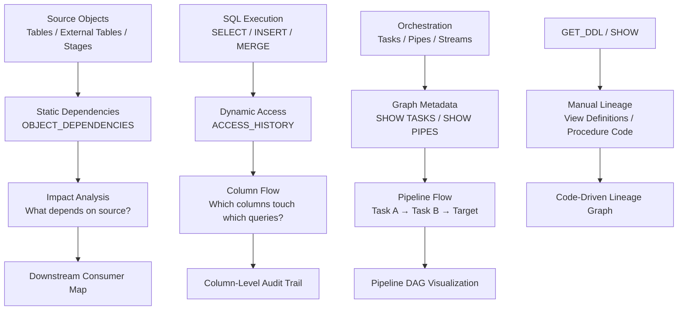

# 1. Data Lineage in Snowflake

# 2. Overview

Data lineage in Snowflake is the ability to trace the flow of data from source to target across database objects, SQL transformations, tasks, and pipelines. Native lineage is exposed through **OBJECT_DEPENDENCIES**, **ACCESS_HISTORY**, task graph metadata, and object DDL. It enables impact analysis, root cause investigation, compliance documentation, and pipeline debugging.

Snowflake does not provide a fully automated end-to-end column-level lineage graph out-of-the-box. Instead, it offers:
- **OBJECT_DEPENDENCIES:** Object-level dependency mapping (views on tables, UDFs on tables, etc.)
- **ACCESS_HISTORY:** Query-level column and table access tracking for reconstructing data flows
- **Task Graph Metadata:** Predecessor/successor relationships via `SHOW TASKS` and `TASK_HISTORY`
- **DDL Inspection:** `GET_DDL` and `SHOW` commands for manual lineage reconstruction
- **Horizon/Data Catalog:** Higher-tier features for visual lineage (Enterprise+)

This feature set exists to help engineers understand what breaks when a source table changes, which downstream consumers depend on a dataset, and which columns are touched by which queries. The intended consumers are data engineers refactoring pipelines, governance teams tracking sensitive data flow, and SnowPro Advanced exam candidates who must understand dependency views, access history parsing, and lineage limitations.

# 3. SQL Object Summary

| Object/Feature | Type | Purpose | Source Objects or Inputs | Output Object or Observable Behavior | Execution Mode or Invocation Method |
|---|---|---|---|---|---|
| [OBJECT_DEPENDENCIES](SQL Object Summary/OBJECT_DEPENDENCIES.md) | System view | Object-level dependency graph | DDL creating dependencies (views, UDFs, masking policies) | Referenced and referencing objects | Query-time |
| [ACCESS_HISTORY](SQL Object Summary/ACCESS_HISTORY.md) | Account view | Query-level column/table access | Query execution | JSON arrays of accessed columns, tables, modified objects | Query-time, 45-min latency |
| [SHOW OBJECTS](SQL Object Summary/SHOW OBJECTS.md) | SQL command | Object enumeration | Database/schema | Object list with type, owner | DDL command |
| [SHOW VIEWS](SQL Object Summary/SHOW VIEWS.md) | SQL command | View lineage inspection | Database/schema | View definitions, source tables | DDL command |
| [GET_DDL](SQL Object Summary/GET_DDL.md) | SQL function | Object definition extraction | Object name | CREATE statement text | Function call |
| [TASK_HISTORY](SQL Object Summary/TASK_HISTORY.md) | Account view | Task execution lineage | Task scheduler | Predecessor/successor states, query IDs | Query-time, 45-min latency |
| [SHOW TASKS](SQL Object Summary/SHOW TASKS.md) | SQL command | Task graph enumeration | Database/schema | Task list with AFTER clauses | DDL command |
| [SHOW PIPES](SQL Object Summary/SHOW PIPES.md) | SQL command | Pipe source-to-target mapping | Database/schema | Pipe definition, source stage, target table | DDL command |
| [SHOW STREAMS](SQL Object Summary/SHOW STREAMS.md) | SQL command | Stream source mapping | Database/schema | Stream name, source table, staleness | DDL command |
| [TABLE_STORAGE_METRICS](SQL Object Summary/TABLE_STORAGE_METRICS.md) | System view | Storage-level object metadata | Table objects | Bytes, rows, clustering depth | Query-time |
| [DATA_METRIC_FUNCTION_REFERENCES](SQL Object Summary/DATA_METRIC_FUNCTION_REFERENCES.md) | System view | Quality rule bindings | Table-column to function mappings | Bound metrics and schedules | Query-time |

# 4. Architecture

Lineage is reconstructed from three layers: static object dependencies (OBJECT_DEPENDENCIES), dynamic query access patterns (ACCESS_HISTORY), and orchestration metadata (task graphs, pipes, streams). External catalogs or manual documentation fill gaps where native column-level lineage is incomplete.

# 5. Data Flow / Process Flow

## Step 1: Object Dependency Registration
- **Input:** `CREATE VIEW`, `CREATE FUNCTION`, `CREATE MASKING POLICY`, or `CREATE TABLE` with constraints
- **Transformation:** Snowflake catalog registers referencing and referenced object relationships
- **Output:** Entries in `OBJECT_DEPENDENCIES`
- **Purpose:** Establish static object-level lineage

## Step 2: Query Execution and Access Tracking
- **Input:** User or task executes SQL referencing tables and columns
- **Transformation:** Query optimizer resolves column references; access history captures touched columns and tables
- **Output:** Rows in `ACCESS_HISTORY` with JSON arrays of `DIRECT_OBJECTS_ACCESSED`, `BASE_OBJECTS_ACCESSED`, `COLUMNS_ACCESSED`
- **Purpose:** Establish dynamic query-level lineage

## Step 3: Orchestration Graph Construction
- **Input:** Task definitions with `AFTER` clauses, pipe definitions with `COPY INTO`, stream definitions with `ON TABLE`
- **Transformation:** Metadata catalog stores pipeline topology
- **Output:** Task DAGs, pipe source-to-target mappings, stream source bindings
- **Purpose:** Model pipeline execution lineage

## Step 4: Lineage Reconstruction
- **Input:** Dependency views, access history, orchestration metadata, DDL text
- **Transformation:** SQL queries join and parse these sources to build lineage graphs
- **Output:** Impact lists, column flow maps, pipeline diagrams
- **Purpose:** Answer "what depends on this?" and "where did this data come from?"

## Step 5: Impact Analysis
- **Input:** Proposed schema change or source deprecation
- **Transformation:** Query `OBJECT_DEPENDENCIES` for referencing objects; query `ACCESS_HISTORY` for recent query patterns; inspect task graphs for downstream stages
- **Output:** List of affected views, tasks, pipelines, and users
- **Purpose:** Prevent breaking changes and plan migrations

# 6. Logical Breakdown

## Component: OBJECT_DEPENDENCIES View
- **Responsibility:** Map static dependencies between database objects
- **Inputs:** Object DDL creating references (views, UDFs, masking policies, row access policies)
- **Outputs:** Rows with `REFERENCING_OBJECT`, `REFERENCED_OBJECT`, `REFERENCED_OBJECT_DOMAIN`
- **Dependencies:** Objects must exist in account; view requires appropriate privileges
- **Failure Modes:** Dynamic SQL in procedures not captured; temporary objects omitted; cross-database dependencies may require explicit database context

## Component: ACCESS_HISTORY View
- **Responsibility:** Track dynamic query-level access to columns and tables
- **Inputs:** Query execution plans
- **Outputs:** Rows per query with JSON arrays of accessed objects and columns
- **Dependencies:** Enterprise edition or higher; query must reference tables/columns
- **Failure Modes:** 45-minute latency; JSON parsing complexity; dynamic SQL may show only outer procedure call; views show both direct and base objects requiring disambiguation

## Component: Task Graph Resolver
- **Responsibility:** Model task predecessor/successor relationships
- **Inputs:** `SHOW TASKS` or `INFORMATION_SCHEMA.TASKS` with `PREDECESSORS`
- **Outputs:** DAG edges representing pipeline flow
- **Dependencies:** Tasks must be defined with `AFTER` clauses
- **Failure Modes:** Task graphs are acyclic but may be deep; suspended tasks still appear in metadata; manual task execution (`EXECUTE TASK`) does not alter graph structure

## Component: Pipe Source-to-Target Mapper
- **Responsibility:** Map continuous ingestion sources to landing tables
- **Inputs:** `SHOW PIPES` or `INFORMATION_SCHEMA.PIPES`
- **Outputs:** Stage name, file format, target table
- **Dependencies:** Pipe must exist
- **Failure Modes:** Pipe definition may use dynamic patterns; `COPY INTO` within stored procedures not captured as pipe lineage

## Component: Stream Source Mapper
- **Responsibility:** Map streams to their source tables or views
- **Inputs:** `SHOW STREAMS` or `INFORMATION_SCHEMA.STREAMS`
- **Outputs:** Stream name, source table, staleness flag
- **Dependencies:** Stream must exist
- **Failure Modes:** Stale streams indicate source DDL changed, breaking lineage continuity

## Component: DDL Inspector
- **Responsibility:** Extract object definitions for manual lineage parsing
- **Inputs:** `GET_DDL` or `SHOW` commands
- **Outputs:** CREATE statement text
- **Dependencies:** Object must exist; user must have `USAGE` and `SELECT` privileges
- **Failure Modes:** `GET_DDL` on secure views returns limited definition; large procedures truncate display

## Component: Storage Metrics Correlator
- **Responsibility:** Link logical objects to physical storage for cost lineage
- **Inputs:** `TABLE_STORAGE_METRICS`
- **Outputs:** Bytes, rows, clustering metrics per table
- **Dependencies:** Table must exist
- **Failure Modes:** Does not show lineage; only physical storage context

# 7. Data Model

## INFORMATION_SCHEMA.OBJECT_DEPENDENCIES

| Column | Role | Grain | Notes |
|---|---|---|---|
| [`REFERENCING_DATABASE`](INFORMATION_SCHEMA.OBJECT_DEPENDENCIES/REFERENCING_DATABASE.md) | Context | One per dependency | Database of object that references |
| [`REFERENCING_SCHEMA`](INFORMATION_SCHEMA.OBJECT_DEPENDENCIES/REFERENCING_SCHEMA.md) | Context | One per dependency | Schema of referencing object |
| [`REFERENCING_OBJECT_NAME`](INFORMATION_SCHEMA.OBJECT_DEPENDENCIES/REFERENCING_OBJECT_NAME.md) | Source | One per dependency | Object that has the dependency |
| [`REFERENCING_OBJECT_DOMAIN`](INFORMATION_SCHEMA.OBJECT_DEPENDENCIES/REFERENCING_OBJECT_DOMAIN.md) | Type | One per dependency | `VIEW`, `FUNCTION`, `MASKING POLICY`, etc. |
| [`REFERENCED_DATABASE`](INFORMATION_SCHEMA.OBJECT_DEPENDENCIES/REFERENCED_DATABASE.md) | Context | One per dependency | Database of referenced object |
| [`REFERENCED_SCHEMA`](INFORMATION_SCHEMA.OBJECT_DEPENDENCIES/REFERENCED_SCHEMA.md) | Context | One per dependency | Schema of referenced object |
| [`REFERENCED_OBJECT_NAME`](INFORMATION_SCHEMA.OBJECT_DEPENDENCIES/REFERENCED_OBJECT_NAME.md) | Target | One per dependency | Object being referenced |
| [`REFERENCED_OBJECT_DOMAIN`](INFORMATION_SCHEMA.OBJECT_DEPENDENCIES/REFERENCED_OBJECT_DOMAIN.md) | Type | One per dependency | `TABLE`, `VIEW`, etc. |
| [`REFERENCED_OBJECT_ID`](INFORMATION_SCHEMA.OBJECT_DEPENDENCIES/REFERENCED_OBJECT_ID.md) | Identifier | One per dependency | Internal ID |

## Grain
One row per referencing object per referenced object.

## ACCOUNT_USAGE.ACCESS_HISTORY

| Column | Role | Grain | Notes |
|---|---|---|---|
| [`QUERY_ID`](ACCOUNT_USAGE.ACCESS_HISTORY/QUERY_ID.md) | Execution link | One per query | Joins to `QUERY_HISTORY` |
| [`QUERY_START_TIME`](ACCOUNT_USAGE.ACCESS_HISTORY/QUERY_START_TIME.md) | Timing | One per query | |
| [`USER_NAME`](ACCOUNT_USAGE.ACCESS_HISTORY/USER_NAME.md) | Identity | One per query | |
| [`DIRECT_OBJECTS_ACCESSED`](ACCOUNT_USAGE.ACCESS_HISTORY/DIRECT_OBJECTS_ACCESSED.md) | Immediate references | One per query | JSON array |
| [`BASE_OBJECTS_ACCESSED`](ACCOUNT_USAGE.ACCESS_HISTORY/BASE_OBJECTS_ACCESSED.md) | Resolved references | One per query | JSON array (through views) |
| [`OBJECTS_MODIFIED`](ACCOUNT_USAGE.ACCESS_HISTORY/OBJECTS_MODIFIED.md) | DML targets | One per query | JSON array |
| [`COLUMNS_ACCESSED`](ACCOUNT_USAGE.ACCESS_HISTORY/COLUMNS_ACCESSED.md) | Column detail | One per query | JSON array |

## Grain
One row per query.

## INFORMATION_SCHEMA.TASKS (Lineage-Relevant)

| Column | Role | Notes |
|---|---|---|
| [`TASK_NAME`](INFORMATION_SCHEMA.TASKS (Lineage-Relevant)/TASK_NAME.md) | Identifier | |
| [`PREDECESSORS`](INFORMATION_SCHEMA.TASKS (Lineage-Relevant)/PREDECESSORS.md) | Graph edges | Comma-separated task names |
| [`DEFINITION`](INFORMATION_SCHEMA.PIPES (Lineage-Relevant)/DEFINITION.md) | SQL body | May reference tables directly |
| [`WAREHOUSE`](INFORMATION_SCHEMA.TASKS (Lineage-Relevant)/WAREHOUSE.md) | Compute | |
| [`SCHEDULE`](INFORMATION_SCHEMA.TASKS (Lineage-Relevant)/SCHEDULE.md) | Trigger | |

## INFORMATION_SCHEMA.PIPES (Lineage-Relevant)

| Column | Role | Notes |
|---|---|---|
| [`PIPE_NAME`](INFORMATION_SCHEMA.PIPES (Lineage-Relevant)/PIPE_NAME.md) | Identifier | |
| [`DEFINITION`](INFORMATION_SCHEMA.PIPES (Lineage-Relevant)/DEFINITION.md) | SQL body | Contains `COPY INTO` with source and target |
| [`NOTIFICATION_CHANNEL`](INFORMATION_SCHEMA.PIPES (Lineage-Relevant)/NOTIFICATION_CHANNEL.md) | Event source | Cloud notification ARN/topic |

## INFORMATION_SCHEMA.STREAMS (Lineage-Relevant)

| Column | Role | Notes |
|---|---|---|
| [`STREAM_NAME`](INFORMATION_SCHEMA.STREAMS (Lineage-Relevant)/STREAM_NAME.md) | Identifier | |
| [`TABLE_NAME`](INFORMATION_SCHEMA.STREAMS (Lineage-Relevant)/TABLE_NAME.md) | Source | Base table or view |
| [`TABLE_DATABASE`](INFORMATION_SCHEMA.STREAMS (Lineage-Relevant)/TABLE_DATABASE.md) | Source context | |
| [`TABLE_SCHEMA`](INFORMATION_SCHEMA.STREAMS (Lineage-Relevant)/TABLE_SCHEMA.md) | Source context | |
| [`STALE`](INFORMATION_SCHEMA.STREAMS (Lineage-Relevant)/STALE.md) | Health | `TRUE` if source DDL changed |

# 8. Business Logic

## Object Dependency Rules
- `OBJECT_DEPENDENCIES` captures static dependencies created by DDL
- View dependencies are recorded automatically at creation time
- UDF dependencies on tables are captured if the UDF body references them
- Masking policies and row access policies show dependencies on the tables they protect
- Cross-database dependencies appear if referencing object is in current database context or accessible via fully qualified names
- Temporary tables and transient objects may not appear consistently

## Access History Lineage Rules
- `DIRECT_OBJECTS_ACCESSED`: Objects explicitly named in the query (e.g., a view in a `SELECT`)
- `BASE_OBJECTS_ACCESSED`: Underlying base tables resolved through views
- `OBJECTS_MODIFIED`: Tables modified by DML (`INSERT`, `UPDATE`, `DELETE`, `MERGE`, `COPY INTO`)
- `COLUMNS_ACCESSED`: Specific columns read; requires Enterprise edition
- JSON structure requires `LATERAL FLATTEN` for analysis
- Access history does not capture dependencies inside stored procedure bodies unless the procedure executes the SQL dynamically in a way that generates separate query records

## Task Graph Lineage Rules
- Predecessor tasks in `AFTER` clause define upstream lineage
- Child tasks implicitly depend on root task schedule or predecessor success
- Task SQL body may reference tables not captured in `OBJECT_DEPENDENCIES` if the table names are dynamic or constructed in procedures
- Task graphs are acyclic; lineage loops are rejected at DDL time

## Pipe Lineage Rules
- Pipes define a fixed source stage and target table in their `COPY INTO` definition
- File format objects are dependencies
- Pipe lineage is static; the specific files loaded are dynamic
- Pipe failures do not break lineage metadata, only runtime execution

## Stream Lineage Rules
- Streams are bound to a single source table or view at creation
- `STALE = TRUE` indicates the source object was altered, invalidating the lineage continuity
- Stream-to-task lineage is implicit: tasks consume streams, but this relationship is not recorded in `OBJECT_DEPENDENCIES`

## Impact Analysis Rules
- To find downstream dependents of a table: query `OBJECT_DEPENDENCIES` where `REFERENCED_OBJECT_NAME = 'table'`
- To find upstream sources of a view: query `OBJECT_DEPENDENCIES` where `REFERENCING_OBJECT_NAME = 'view'`
- For column-level impact: query `ACCESS_HISTORY` for queries accessing specific columns, then join to `QUERY_HISTORY` for user and application context
- For pipeline impact: trace task graphs from source-loading tasks through `SHOW TASKS` or `INFORMATION_SCHEMA.TASKS`

# 9. Transformations

## DDL to Dependency Record
- **Source:** `CREATE VIEW v AS SELECT * FROM t`
- **Output:** Row in `OBJECT_DEPENDENCIES` linking `v` to `t`
- **Logic:** Parser identifies table references in view definition
- **Meaning:** Static lineage edge
- **Impact:** Enables automated impact analysis on table changes

## Query Execution to Access History
- **Source:** `SELECT col1, col2 FROM view_a`
- **Output:** `ACCESS_HISTORY` row with `DIRECT_OBJECTS_ACCESSED = [view_a]`, `BASE_OBJECTS_ACCESSED = [base_table]`, `COLUMNS_ACCESSED = [col1, col2]`
- **Logic:** Optimizer resolves view to base table and captures column references
- **Meaning:** Dynamic lineage showing actual data flow
- **Impact:** Enables column-level governance and query pattern analysis

## Task Definition to Graph Edge
- **Source:** `CREATE TASK child AFTER parent AS ...`
- **Output:** `PREDECESSORS = 'parent'` in task metadata
- **Logic:** DDL parser records dependency
- **Meaning:** Orchestration lineage edge
- **Impact:** Enables pipeline DAG visualization and failure propagation tracing

## Pipe Definition to Ingestion Lineage
- **Source:** `CREATE PIPE p AS COPY INTO target FROM @stage`
- **Output:** Metadata linking stage, file format, and target table
- **Logic:** Pipe DDL captures source-to-target mapping
- **Meaning:** Ingestion lineage edge
- **Impact:** Enables source system traceability and file-to-table mapping

## Stream Definition to CDC Lineage
- **Source:** `CREATE STREAM s ON TABLE source`
- **Output:** Stream metadata with `TABLE_NAME = 'source'`
- **Logic:** Stream DDL binds to source object
- **Meaning:** Change capture lineage edge
- **Impact:** Enables incremental pipeline tracing

## Access History JSON to Flattened Lineage
- **Source:** `COLUMNS_ACCESSED` JSON array
- **Output:** Denormalized rows of query-to-column mappings
- **Logic:** `LATERAL FLATTEN(input => COLUMNS_ACCESSED)`
- **Meaning:** Queryable column lineage
- **Impact:** Enables data governance reporting and PII tracking

# 10. Parameters / Variables / Configuration

| Name | Type | Purpose | Allowed Values | Default | Where Used | Effect |
|---|---|---|---|---|---|---|
| [`QUERY_TAG`](Parameters  Variables  Configuration/QUERY_TAG.md) | Session parameter | Lineage traceability | String <= 256 chars | None | Session/query | Annotates query history for pipeline correlation |
| [`TIMEZONE`](Parameters  Variables  Configuration/TIMEZONE.md) | Session parameter | Timestamp context | IANA timezone | `UTC` | Session | Affects lineage record timestamps |
| [`DATA_RETENTION_TIME_IN_DAYS`](Parameters  Variables  Configuration/DATA_RETENTION_TIME_IN_DAYS.md) | Object parameter | Historical lineage availability | 0-90 (Enterprise+) | `1` | Table/schema/database | Determines time travel for historical object states |
| [`ENABLE_QUERY_ACCELERATION`](Parameters  Variables  Configuration/ENABLE_QUERY_ACCELERATION.md) | Warehouse parameter | Query performance | `TRUE`, `FALSE` | `FALSE` | Warehouse | May affect query plan resolution in access history |

# 11. APIs / Interfaces

## Interface: SELECT FROM OBJECT_DEPENDENCIES
- **Invocation:** `SELECT * FROM INFORMATION_SCHEMA.OBJECT_DEPENDENCIES WHERE REFERENCED_OBJECT_NAME = 'source_table'`
- **Input:** Object name filter
- **Output:** Referencing objects (downstream dependents)
- **Error Behavior:** Empty set if no dependencies or insufficient privileges
- **Consumers:** Impact analysis scripts, schema browsers

## Interface: SELECT FROM ACCESS_HISTORY
- **Invocation:** `SELECT * FROM SNOWFLAKE.ACCOUNT_USAGE.ACCESS_HISTORY WHERE QUERY_START_TIME >= DATEADD(day, -7, CURRENT_TIMESTAMP())`
- **Input:** Date range
- **Output:** Query-level access records with JSON metadata
- **Error Behavior:** Requires Enterprise+; 45-minute latency
- **Consumers:** Data governance, column-level audits

## Interface: FLATTEN Access History JSON
- **Invocation:** `SELECT ah.query_id, f.value:objectName::STRING AS object_name, f.value:columnName::STRING AS column_name FROM SNOWFLAKE.ACCOUNT_USAGE.ACCESS_HISTORY ah, LATERAL FLATTEN(input => ah.COLUMNS_ACCESSED) f`
- **Input:** Access history rows
- **Output:** Denormalized column access records
- **Error Behavior:** JSON structure varies; may require conditional parsing
- **Consumers:** Column lineage reports, PII tracking

## Interface: SHOW TASKS
- **Invocation:** `SHOW TASKS IN DATABASE db`
- **Input:** Database context
- **Output:** Task list with predecessors and definitions
- **Error Behavior:** Empty set if no tasks
- **Consumers:** Pipeline DAG construction

## Interface: SHOW PIPES
- **Invocation:** `SHOW PIPES IN SCHEMA sch`
- **Input:** Schema context
- **Output:** Pipe definitions with source and target
- **Error Behavior:** Empty set if no pipes
- **Consumers:** Ingestion lineage mapping

## Interface: SHOW STREAMS
- **Invocation:** `SHOW STREAMS IN DATABASE db`
- **Input:** Database context
- **Output:** Stream list with source tables
- **Error Behavior:** Empty set if no streams
- **Consumers:** CDC lineage mapping

## Interface: GET_DDL
- **Invocation:** `SELECT GET_DDL('VIEW', 'schema.view_name')`
- **Input:** Object type and name
- **Output:** CREATE statement text
- **Error Behavior:** Fails if object missing or insufficient privileges; secure objects return limited text
- **Consumers:** Manual lineage parsing, documentation generation

## Interface: TABLE_STORAGE_METRICS
- **Invocation:** `SELECT * FROM INFORMATION_SCHEMA.TABLE_STORAGE_METRICS WHERE TABLE_NAME = '...'`
- **Input:** Table filter
- **Output:** Storage metadata
- **Error Behavior:** Empty set if no tables
- **Consumers:** Storage lineage, cost attribution

# 12. Execution / Deployment

## Static Dependency Mapping
- Query `OBJECT_DEPENDENCIES` after each deployment to catalog downstream dependents
- Store dependency snapshots in a metadata table for historical comparison
- Alert when new dependencies are created on critical source tables

## Dynamic Access Tracking
- Enable `ACCESS_HISTORY` monitoring on Enterprise accounts
- Schedule tasks that query `ACCESS_HISTORY` daily and flatten JSON into reporting tables
- Retain flattened lineage data beyond 365 days in user tables if regulatory requirements demand

## Task Graph Documentation
- Maintain task graph documentation alongside code; `SHOW TASKS` provides runtime validation
- Use `GRAPH_VERSION` from `TASK_HISTORY` to detect graph changes
- Document task-to-table mappings in metadata tables since `OBJECT_DEPENDENCIES` does not capture task SQL references

## Pipeline Lineage Integration
- For each pipeline, maintain a lineage registry mapping: Source Stage → Pipe → Staging Table → Stream → Task → Target Table
- Update registry when pipeline objects are modified
- Use `QUERY_TAG` in all pipeline tasks to correlate `ACCESS_HISTORY` records to specific pipelines

## Environment Behavior
- Development: Frequent `OBJECT_DEPENDENCIES` queries during refactoring; manual `GET_DDL` inspection
- Production: Automated impact analysis before schema changes; scheduled lineage reporting tasks; integration with data catalog tools

# 13. Observability

## Dependency Change Monitoring
- Compare `OBJECT_DEPENDENCIES` snapshots weekly to detect new or removed dependencies
- Alert when sensitive tables gain new dependent views or masking policies

## Column Access Monitoring
- Track `ACCESS_HISTORY` for queries touching sensitive columns (PII, financial data)
- Monitor for unauthorized column access patterns
- Correlate column access with `QUERY_TAG` to identify pipeline or application source

## Pipeline DAG Health
- Monitor task graph depth and breadth via `SHOW TASKS`
- Track `GRAPH_VERSION` changes to detect unauthorized pipeline modifications
- Validate that all tasks in a documented DAG appear in `TASK_HISTORY` on expected schedules

## Stream Lineage Validation
- Query `INFORMATION_SCHEMA.STREAMS` for `STALE = TRUE` to detect broken lineage
- Monitor stream-to-task relationships by checking that tasks consuming streams appear in `TASK_HISTORY`

## Key Metrics
- Number of downstream dependents per critical table
- Column access frequency by user and role
- Task graph complexity (nodes, edges, depth)
- Stale stream count
- New dependency creation rate
- Access history query volume for governance trending

# 14. Failure Handling & Recovery

## Missing Dependencies in OBJECT_DEPENDENCIES
- **What breaks:** Dynamic SQL in procedures or tasks does not create static dependencies
- **Detection:** `OBJECT_DEPENDENCIES` shows fewer dependents than expected
- **Fallback:** Manual documentation; parse `GET_DDL` on procedures
- **Recovery:** Implement naming conventions that make dynamic references discoverable; document runtime dependencies separately

## ACCESS_HISTORY JSON Parsing Failures
- **What breaks:** Complex nested JSON in `COLUMNS_ACCESSED` causes flattening errors
- **Detection:** Lineage reporting queries fail with JSON parsing errors
- **Fallback:** Query `DIRECT_OBJECTS_ACCESSED` only, omitting column detail
- **Recovery:** Use `TRY_PARSE_JSON` and handle nulls; build tested views with validated flatten logic

## Stale Streams Break Lineage
- **What breaks:** Source table altered; stream becomes stale and stops capturing changes
- **Detection:** `INFORMATION_SCHEMA.STREAMS.STALE = 'TRUE'`
- **Fallback:** Full table scan without stream
- **Recovery:** Recreate stream; update lineage registry; backfill gap

## Cross-Database Dependencies Omitted
- **What breaks:** `OBJECT_DEPENDENCIES` queried in wrong database context misses cross-database references
- **Detection:** Downstream objects in other databases not appearing
- **Fallback:** Query `OBJECT_DEPENDENCIES` from each database or use account-level views
- **Recovery:** Use fully qualified names in queries; aggregate results across databases

## Task Graph Out of Sync with Documentation
- **What breaks:** Tasks modified directly in production without updating lineage docs
- **Detection:** Documented DAG does not match `SHOW TASKS` output
- **Fallback:** Manual reconciliation
- **Recovery:** Implement infrastructure-as-code for task definitions; version control DDL; scheduled validation tasks

## Secure Objects Hide Lineage
- **What breaks:** `GET_DDL` on secure views or secure UDFs returns obfuscated definitions
- **Detection:** Lineage parsing scripts cannot extract source tables
- **Fallback:** Query `OBJECT_DEPENDENCIES` instead of parsing DDL
- **Recovery:** Use `OBJECT_DEPENDENCIES` for secure objects; reserve DDL parsing for non-secure objects

## Access History Latency Gap
- **What breaks:** 45-minute delay prevents real-time lineage for recent queries
- **Detection:** Recent pipeline executions missing from lineage reports
- **Fallback:** Use `INFORMATION_SCHEMA.QUERY_HISTORY` for recent activity
- **Recovery:** Implement hybrid approach: `INFORMATION_SCHEMA` for real-time, `ACCOUNT_USAGE` for historical

# 15. Security & Access Control

## Privilege Requirements

| Action | Required Privilege | Object |
|---|---|---|
| [Query OBJECT_DEPENDENCIES](Privilege Requirements/Query OBJECT_DEPENDENCIES.md) | `USAGE` on database/schema | Database/Schema |
| [Query ACCESS_HISTORY](Privilege Requirements/Query ACCESS_HISTORY.md) | `MONITOR` or `ACCOUNTADMIN` | Account |
| [View task definitions](Privilege Requirements/View task definitions.md) | `MONITOR` or `OWNERSHIP` | Task |
| [View pipe definitions](Privilege Requirements/View pipe definitions.md) | `USAGE` on schema | Schema |
| [View stream definitions](Privilege Requirements/View stream definitions.md) | `USAGE` on schema | Schema |
| [Execute GET_DDL](Privilege Requirements/Execute GET_DDL.md) | `USAGE` + `SELECT` or `OWNERSHIP` | Target object |

## Lineage Data Sensitivity
- `ACCESS_HISTORY` reveals which users query which columns, potentially exposing sensitive access patterns
- `QUERY_HISTORY` contains query text that may expose business logic
- Restrict lineage views to governance and security teams

## Cross-Account Lineage
- `OBJECT_DEPENDENCIES` does not capture cross-account sharing (data sharing)
- For shared data, lineage stops at the shared view/table in the consumer account
- Document cross-account lineage manually in a central registry

## Secure Object Handling
- Secure views and UDFs intentionally obfuscate underlying logic
- `OBJECT_DEPENDENCIES` still reveals that a dependency exists, even if the definition is hidden
- Balance security with lineage needs by granting `MONITOR` on dependencies without exposing DDL

# 16. Performance / Scalability Considerations

## OBJECT_DEPENDENCIES Query Performance
- Lightweight view; queries filter efficiently on object names
- Large schemas with many views may return many rows; filter by `REFERENCED_OBJECT_DOMAIN` or `REFERENCING_OBJECT_DOMAIN`

## ACCESS_HISTORY Scan Performance
- Large accounts generate massive `ACCESS_HISTORY` volume
- Always filter on `QUERY_START_TIME` before flattening JSON
- Materialize flattened extracts into reporting tables for analyst consumption
- JSON flattening is CPU-intensive; use appropriately sized warehouses

## Task Graph Query Performance
- `SHOW TASKS` returns all tasks in scope efficiently
- Deep graphs require recursive traversal logic in SQL or external tools
- Consider materializing graph edges into a table for fast traversal

## GET_DDL Overhead
- Parsing DDL text for lineage is compute-intensive and fragile
- Prefer `OBJECT_DEPENDENCIES` for automated lineage; reserve `GET_DDL` for human inspection
- Secure objects return limited DDL, reducing parsing value

## Cross-Database Lineage Aggregation
- Querying `OBJECT_DEPENDENCIES` across many databases requires iterating contexts
- No single account-level `OBJECT_DEPENDENCIES` view exists
- Aggregate results into a central metadata table via scheduled tasks

## Access History Retention
- 365-day retention may be insufficient for long-term compliance
- Export or materialize lineage data to user tables for extended retention
- Monitor storage growth of lineage reporting tables

# 17. Assumptions & Constraints

## Explicit Assumptions
- The reader requires object-level and partial column-level lineage for governance or pipeline management
- The environment is Snowflake Enterprise edition or higher (required for `ACCESS_HISTORY`)
- External data catalog or lineage tool may supplement native capabilities

## Engine Boundaries
- Snowflake does not provide a native visual lineage graph out-of-the-box (requires Horizon/Data Catalog or external tools)
- `OBJECT_DEPENDENCIES` captures static DDL dependencies only; dynamic SQL in procedures is not tracked
- `ACCESS_HISTORY` has 45-minute latency and requires JSON parsing for column-level analysis
- Task SQL references are not captured in `OBJECT_DEPENDENCIES` unless the task calls a view or UDF
- Stream-to-task and pipe-to-task relationships are implicit, not recorded in dependency views
- Cross-database dependencies require per-database queries
- Secure views and UDFs obfuscate `GET_DDL` output

## Exam-Relevant Defaults
- `ACCESS_HISTORY` available on Enterprise+ only
- `ACCOUNT_USAGE` latency: 45 minutes
- `INFORMATION_SCHEMA` retention: ~7 days
- `DATA_RETENTION_TIME_IN_DAYS` default: 1 day
- Task graphs must be acyclic

## Ambiguities
- Exact JSON schema of `COLUMNS_ACCESSED` may vary by query complexity and is not fully documented
- Behavior of `OBJECT_DEPENDENCIES` for complex nested views with multiple levels of indirection may not show all intermediate objects consistently
- The granularity of column tracking for derived columns (expressions, CASE statements) is not explicitly defined

# 18. Future Enhancements

- Implement a centralized lineage metadata table that aggregates `OBJECT_DEPENDENCIES`, `ACCESS_HISTORY` (flattened), task graphs, pipe definitions, and stream mappings into a unified graph representation
- Build automated impact analysis procedures that accept a table name and return all downstream views, tasks, pipelines, and users affected by a proposed schema change
- Create scheduled tasks that snapshot `OBJECT_DEPENDENCIES` weekly and alert on new or removed dependencies for critical tables
- Develop recursive SQL views or stored procedures that traverse task graphs and produce complete pipeline lineage from source to target
- Replace manual `GET_DDL` parsing with `OBJECT_DEPENDENCIES`-first lineage discovery to handle secure objects and reduce fragility
- Implement column-level PII tracking by flattening `ACCESS_HISTORY` and joining to a data classification inventory
- Add cross-database lineage aggregation tasks that iterate all databases and consolidate dependencies into a single reporting schema
- Create lineage validation tasks that compare documented pipeline topology against actual `SHOW TASKS` and `OBJECT_DEPENDENCIES` state to detect drift
- Use `QUERY_TAG` consistently across all pipeline tasks to enable correlation of `ACCESS_HISTORY` records to specific pipeline stages for end-to-end tracing
- Integrate native lineage exports with external data catalog tools via scheduled file generation or API calls for visual lineage rendering
