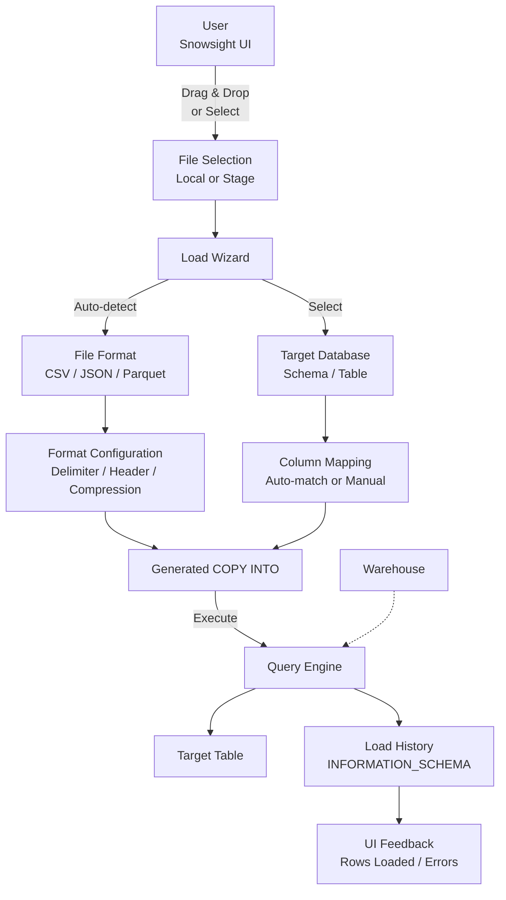

# 1. Load Files Using Snowsight

# 2. Overview

Snowsight is Snowflake's modern web-based user interface. Its file-loading capability provides a guided, wizard-driven path to ingest files from a local workstation or cloud storage into Snowflake tables without writing manual `COPY INTO` statements. The feature generates and executes `COPY INTO` commands behind the scenes, abstracting syntax while exposing critical configuration options such as file format, error handling, and target mapping.

This feature exists to:
- Enable ad-hoc data loading by analysts and engineers without SQL expertise
- Accelerate prototyping and one-time ingestion tasks
- Provide visual feedback on load progress, row counts, and errors
- Auto-detect file formats and schema mappings to reduce configuration friction

The intended consumers are data analysts performing exploratory loads, engineers validating file formats before production pipeline deployment, and SnowPro Advanced exam candidates who must understand when Snowsight loading is appropriate versus programmatic `COPY INTO`, as well as its constraints and generated behavior.

# 3. SQL Object Summary

| Object/Feature | Type | Purpose | Source Objects or Inputs | Output Object or Observable Behavior | Execution Mode or Invocation Method |
|---|---|---|---|---|---|
| Snowsight Load Wizard | UI feature | Guided file ingestion | Local files or named stages | Loaded rows in target table | Interactive web UI |
| User Stage | Stage object | Default staging area for user | Snowsight upload | Files in `@~/` | Implicit via UI |
| Table Stage | Stage object | Table-specific staging area | Snowsight upload | Files in `@%table` | Implicit via UI |
| Named Stage | Stage object | Reusable external or internal stage | Pre-created stage | Files in `@stage` | Selectable in UI |
| COPY INTO (generated) | DML statement | Bulk load execution | Stage file + target table | Loaded rows, error report | Auto-generated by UI |
| FILE_FORMAT (generated) | Schema object | Parse configuration | File content + user selections | Format definition | Auto-generated or selected |
| Load History | System view | Load outcome telemetry | COPY execution | Row counts, errors, status | Query via UI or SQL |

# 4. Architecture

Snowsight loading operates as a UI layer over standard Snowflake ingestion primitives. The user interacts with a visual wizard; Snowsight translates selections into `PUT` (for local files), `CREATE FILE FORMAT`, and `COPY INTO` operations executed in the user's security context.

# 5. Data Flow / Process Flow

## Step 1: File Selection
- **Input:** User drags local files into Snowsight or selects files from an existing stage
- **Transformation:** UI validates file extensions and size limits
- **Output:** File list ready for configuration
- **Purpose:** Identify source data to load

## Step 2: Target Selection
- **Input:** User selects database, schema, and existing or new target table
- **Transformation:** UI enumerates accessible objects based on user's role and privileges
- **Output:** Target table context established
- **Purpose:** Define load destination

## Step 3: Format Detection and Configuration
- **Input:** File content and user selections
- **Transformation:** UI samples file to infer format type, delimiter, header presence, compression, and encoding; user may override
- **Output:** File format configuration (inline or named)
- **Purpose:** Ensure correct parsing of source files

## Step 4: Column Mapping
- **Input:** Target table schema and file structure
- **Transformation:** UI auto-matches file columns to table columns by name and ordinal position; user may reorder, exclude, or transform mappings
- **Output:** Column mapping definition
- **Purpose:** Align source structure to target schema

## Step 5: Load Execution
- **Input:** Configured load parameters
- **Transformation:** Snowsight generates `COPY INTO` statement with `FILE_FORMAT`, `ON_ERROR`, and column mapping clauses; executes against active warehouse
- **Output:** Loaded rows in target table; error file references if applicable
- **Purpose:** Persist data

## Step 6: Result Feedback
- **Input:** `COPY INTO` execution result
- **Transformation:** UI parses load history and error outputs
- **Output:** Visual summary of rows loaded, rows rejected, error samples, and file-level status
- **Purpose:** Confirm success or diagnose failures

# 6. Logical Breakdown

## Component: File Selection Interface
- **Responsibility:** Accept file input from user or stage
- **Inputs:** Local file system paths or stage references
- **Outputs:** Validated file list
- **Dependencies:** Browser file API for local files; stage `USAGE` privilege for named stages
- **Failure Modes:** File size exceeds UI limits; unsupported file extensions; stage access denied

## Component: Format Detection Engine
- **Responsibility:** Infer file format parameters from content sampling
- **Inputs:** File header bytes, extension, user hints
- **Outputs:** Proposed `FILE_FORMAT` configuration
- **Dependencies:** File must be readable and representative
- **Failure Modes:** Ambiguous delimiters detected incorrectly; encoding misidentified; compressed files not recognized

## Component: Target Schema Resolver
- **Responsibility:** Enumerate and validate target tables
- **Inputs:** User's accessible database objects
- **Outputs:** Table list with column metadata
- **Dependencies:** `USAGE` on database/schema; `SELECT` on table or `CREATE TABLE` privilege
- **Failure Modes:** No accessible tables; schema drift between file and table; insufficient privileges to create new table

## Component: Column Mapper
- **Responsibility:** Map file fields to table columns
- **Inputs:** File structure (headers or ordinal), table DDL
- **Outputs:** Column mapping array
- **Dependencies:** Readable file structure; existing table schema
- **Failure Modes:** Column count mismatch; type incompatibility; case-sensitivity issues in column names

## Component: COPY INTO Generator
- **Responsibility:** Translate UI selections into executable SQL
- **Inputs:** File list, target table, format spec, column map, error handling option
- **Outputs:** `COPY INTO` statement
- **Dependencies:** All prior components must resolve
- **Failure Modes:** Generated SQL may not handle complex transformations (expressions, joins, UDFs) available in manual `COPY INTO`

## Component: Execution Engine
- **Responsibility:** Run generated SQL in user session
- **Inputs:** `COPY INTO` statement, active warehouse
- **Outputs:** Loaded data, load history record
- **Dependencies:** Warehouse must be running or auto-resume enabled; user must have `INSERT` on target
- **Failure Modes:** Warehouse suspended; insufficient privileges; constraint violations; file format mismatch

## Component: Result Renderer
- **Responsibility:** Present load outcomes in human-readable form
- **Inputs:** `COPY_HISTORY`, error files, row counts
- **Outputs:** UI summary with success metrics and error details
- **Dependencies:** Query execution must complete
- **Failure Modes:** Error files may be truncated in UI; large error volumes overwhelm display

# 7. Data Model

## INFORMATION_SCHEMA.LOAD_HISTORY

| Column | Role | Grain | Notes |
|---|---|---|---|
| `TABLE_NAME` | Target | One per load | |
| `SCHEMA_NAME` | Context | One per load | |
| `FILE_NAME` | Source | One per file | Stage path |
| `STAGE_LOCATION` | Source context | One per load | |
| `LAST_LOAD_TIME` | Timing | One per file | |
| `ROW_COUNT` | Volume | One per file | Rows loaded |
| `ROW_PARSED` | Volume | One per file | Rows parsed |
| `ERROR_COUNT` | Quality | One per file | Rows rejected |
| `FIRST_ERROR_MESSAGE` | Detail | One per file | First error encountered |
| `FIRST_ERROR_LINE_NUMBER` | Debug | One per file | Line in file |
| `FIRST_ERROR_CHARACTER_POS` | Debug | One per file | Position in line |
| `FIRST_ERROR_COLUMN_NAME` | Debug | One per file | Target column |

## Grain
One row per file per load operation.

## Generated COPY INTO (Conceptual)

| Clause | Source | Notes |
|---|---|---|
| `COPY INTO target_table` | User selection | Target database.schema.table |
| `FROM @stage` | File source | User stage, table stage, or named stage |
| `FILE_FORMAT = (...)` | Format detection | Inline format or named format |
| `ON_ERROR = '...'` | User selection | `ABORT_STATEMENT`, `SKIP_FILE`, `CONTINUE` |
| `(col1, col2, ...)` | Column mapping | Ordered column list |

# 8. Business Logic

## File Size and Count Limits
- Snowsight supports loading multiple files in a single operation
- Individual file size limits apply based on browser and network constraints; very large files should use `PUT` via CLI or direct stage loading
- There is no explicit documented file size ceiling for Snowsight, but browser upload timeouts and memory constraints effectively limit practical sizes to hundreds of megabytes

## Stage Selection Logic
- **User stage (`@~`):** Default for local file uploads; private to the user
- **Table stage (`@%table`):** Scoped to a specific table; useful for table-specific loads
- **Named stage:** Pre-created internal or external stage; reusable across loads and users

## Format Auto-Detection Rules
- CSV: Detected by `.csv` extension; delimiter inferred from content (comma, tab, pipe); header presence inferred from first row
- JSON: Detected by `.json` extension; auto-detected as single document or newline-delimited
- Parquet/Avro/ORC: Detected by binary format signatures and extensions
- XML: Detected by `.xml` extension
- User can override all auto-detected parameters

## Column Mapping Rules
- By default, Snowsight maps file columns to table columns by ordinal position
- If file has headers and table has matching column names, mapping may be name-based
- User can exclude columns, reorder mappings, or skip fields
- Snowsight does not support complex expressions (e.g., `TO_DATE(col)`, `HASH(col)`) in column mapping; manual `COPY INTO` is required for transformations

## Error Handling Options
- `ABORT_STATEMENT` (default): Stop on first error
- `SKIP_FILE`: Skip files with errors
- `CONTINUE`: Load valid rows, skip bad rows
- Error details displayed in UI; error files written to stage for inspection

## Table Creation Behavior
- Snowsight can create a new table if the target does not exist
- Table creation infers column names from file headers and types from content sampling
- Inferred types may be conservative (e.g., `VARCHAR` for mixed numeric data)
- Exam trap: UI-generated tables may require subsequent `ALTER TABLE` for optimal types

## Privilege Context
- All operations execute with the user's current role and warehouse
- `CREATE TABLE` requires appropriate schema privileges
- `COPY INTO` requires `INSERT` on target table and `USAGE` on stage and file format

# 9. Transformations

## Local File to Stage File
- **Source:** File on user's local workstation
- **Output:** File in Snowflake stage (user stage or table stage)
- **Logic:** Browser uploads file via HTTPS to Snowflake internal stage
- **Meaning:** Data lands in Snowflake-managed storage before loading
- **Impact:** Enables server-side parsing and bulk loading

## UI Selection to FILE_FORMAT
- **Source:** User's format choices and auto-detection results
- **Output:** `CREATE FILE FORMAT` or inline format specification
- **Logic:** UI maps visual controls to SQL format parameters
- **Meaning:** Parsing rules established for source files
- **Impact:** Determines how delimiters, quotes, dates, and encodings are interpreted

## Column Mapping to COPY INTO Projection
- **Source:** User's column assignments
- **Output:** Ordered column list in `COPY INTO` statement
- **Logic:** UI generates `(col1, col2, ...)` clause matching file fields to table columns
- **Meaning:** Schema alignment without manual SQL
- **Impact:** Defines target table population; no complex transformations supported

## Load Execution to History Record
- **Source:** `COPY INTO` completion
- **Output:** Row in `LOAD_HISTORY` and UI feedback
- **Logic:** System records file name, row counts, errors, and timing
- **Meaning:** Audit trail for the load operation
- **Impact:** Enables verification and debugging

# 10. Parameters / Variables / Configuration

| Name | Type | Purpose | Allowed Values | Default | Where Used | Effect |
|---|---|---|---|---|---|---|
| `ON_ERROR` | Load option | Error handling | `ABORT_STATEMENT`, `SKIP_FILE`, `CONTINUE` | `ABORT_STATEMENT` | UI selection | Determines behavior on parse errors |
| `FILE_FORMAT` | Format spec | Parsing rules | CSV, JSON, Parquet, Avro, ORC, XML | Auto-detected | UI selection / auto-detect | Defines how files are parsed |
| `SKIP_HEADER` | CSV option | Header rows to skip | Integer >= 0 | Auto-detected | UI format config | Rows ignored at file start |
| `FIELD_DELIMITER` | CSV option | Column separator | Character | Auto-detected | UI format config | Splits fields |
| `FIELD_OPTIONALLY_ENCLOSED_BY` | CSV option | Quote character | Character | Auto-detected | UI format config | Handles quoted fields |
| `COMPRESSION` | File option | Compression type | `AUTO`, `GZIP`, `BZ2`, `DEFLATE`, `NONE` | `AUTO` | UI format config | Decompression method |
| `DATE_FORMAT` | Type option | Date parsing | Format string | `AUTO` | UI format config | Date string interpretation |
| `TIME_FORMAT` | Type option | Time parsing | Format string | `AUTO` | UI format config | Time string interpretation |
| `TIMESTAMP_FORMAT` | Type option | Timestamp parsing | Format string | `AUTO` | UI format config | Timestamp interpretation |
| `BINARY_FORMAT` | Type option | Binary encoding | `HEX`, `BASE64`, `UTF8` | `HEX` | UI format config | Binary data interpretation |
| `ENCODING` | File option | Character encoding | `UTF8`, `ISO2022JP`, etc. | `UTF8` | UI format config | Character set |
| `WAREHOUSE` | Session context | Compute for load | Valid warehouse name | Current warehouse | UI context | Determines execution compute |
| `ROLE` | Session context | Privilege context | Valid role name | Current role | UI context | Determines accessible objects |

# 11. APIs / Interfaces

## Interface: Snowsight Load Wizard
- **Invocation:** Navigate to Databases → Schema → Table → Load Data; or drag files onto UI
- **Input:** Files, target selection, format configuration, column mappings
- **Output:** Loaded table data; visual success/failure summary
- **Error Behavior:** Displays error count, first error message, and sample bad rows; may offer to download error report
- **Consumers:** Analysts, engineers, data stewards

## Interface: Generated COPY INTO
- **Invocation:** Implicit; executed by UI after user clicks Load
- **Input:** Stage files, target table, format spec
- **Output:** Loaded rows; error files if applicable
- **Error Behavior:** Same as manual `COPY INTO`—aborts, skips, or continues based on `ON_ERROR`
- **Consumers:** Underlying engine; not directly visible to user unless inspecting query history

## Interface: INFORMATION_SCHEMA.LOAD_HISTORY
- **Invocation:** `SELECT * FROM INFORMATION_SCHEMA.LOAD_HISTORY WHERE TABLE_NAME = '...'`
- **Input:** Table name filter
- **Output:** File-level load outcomes
- **Error Behavior:** Empty set if no loads or insufficient privileges
- **Consumers:** Post-load verification, audit

## Interface: GET_DDL on Generated Objects
- **Invocation:** `SELECT GET_DDL('FILE_FORMAT', 'format_name')` or `GET_DDL('TABLE', 'table_name')`
- **Input:** Object name
- **Output:** DDL statement
- **Error Behavior:** Fails if object missing or insufficient privileges
- **Consumers:** Engineers capturing UI-generated objects for version control

# 12. Execution / Deployment

## Ad Hoc Loading
- Analyst drags CSV to Snowsight, selects target table, verifies column mapping, executes load
- Suitable for one-time data imports, prototype validation, and small-scale ingestion
- Not suitable for recurring production pipelines

## Format Prototyping
- Engineer uses Snowsight to test file format detection against sample files
- Once format is validated, capture generated `FILE_FORMAT` DDL for use in production `COPY INTO` statements
- Reduces trial-and-error in manual SQL development

## Table Creation for Exploration
- Snowsight creates tables from file headers for quick exploration
- Review inferred data types; likely need `ALTER TABLE` to optimize
- Replace UI-generated tables with properly modeled tables before production use

## Stage-Based Loading
- For files already in cloud storage, use Snowsight to select named stage rather than local upload
- Faster for large files already resident in S3/GCS/Azure stages
- Requires pre-configured stage and appropriate privileges

## Environment Behavior
- Development: Frequent Snowsight loads for experimentation; UI-generated formats and tables
- Production: Snowsight used sparingly for emergency fixes or one-off imports; production pipelines use programmatic `COPY INTO`, Tasks, and Pipes

# 13. Observability

## Load Success Verification
- UI displays row count loaded and file status
- Query `LOAD_HISTORY` to confirm row counts match expectations
- Validate target table with `SELECT COUNT(*)`, `SHOW TABLES`

## Error Inspection
- UI shows first error message and count
- For detailed analysis, query `LOAD_HISTORY` for `FIRST_ERROR_MESSAGE`, `FIRST_ERROR_LINE_NUMBER`
- Download error files from stage if `ON_ERROR = 'CONTINUE'` or `SKIP_FILE`

## Format Validation
- Compare UI-generated format parameters against source file specification
- Use `GET_DDL` on generated file formats to capture for documentation

## Query History Correlation
- Snowsight loads appear in `QUERY_HISTORY` with `QUERY_TYPE = 'COPY'`
- Use `QUERY_TAG` or timestamp to correlate UI actions with SQL execution
- Inspect generated SQL for learning and optimization

## Key Metrics
- Rows loaded per file
- Error rate per file
- Load duration per operation
- Format auto-detection accuracy (manual override frequency)

# 14. Failure Handling & Recovery

## File Format Misdetection
- **What breaks:** Auto-detected delimiter or encoding is wrong; load fails or produces garbage data
- **Detection:** Preview shows misaligned columns; load errors with parse failures
- **Fallback:** Cancel load; manually configure format parameters in UI
- **Recovery:** Override delimiter, encoding, header settings; re-run load; verify with small sample

## Column Mapping Mismatch
- **What breaks:** File columns map to wrong table columns; data lands in incorrect fields
- **Detection:** Preview shows values in wrong columns; downstream queries return anomalous results
- **Fallback:** Abort load before commit if using transaction; otherwise truncate and reload
- **Recovery:** Reorder column mappings in UI; verify by name and ordinal; re-run with correct mapping

## Type Inference Errors
- **What breaks:** UI-created table uses `VARCHAR` for dates or numbers; subsequent queries fail
- **Detection:** `DESCRIBE TABLE` shows suboptimal types; date comparisons fail
- **Fallback:** Use existing properly-typed table instead of UI-generated table
- **Recovery:** `ALTER TABLE` to correct types; or create new table with explicit types and reload

## Large File Timeouts
- **What breaks:** Browser upload times out or memory exhausts for very large files
- **Detection:** Upload progress stalls; browser becomes unresponsive
- **Fallback:** Use SnowSQL CLI `PUT` command to upload to stage, then load via Snowsight from stage
- **Recovery:** Split file into smaller chunks; use `PUT` via CLI; or use `COPY INTO` directly from external stage

## Privilege Errors
- **What breaks:** User lacks `INSERT` on target or `USAGE` on stage
- **Detection:** UI shows access denied; `QUERY_HISTORY` shows authorization error
- **Fallback:** Request privileges from administrator
- **Recovery:** Grant `INSERT` on table, `USAGE` on schema/database, `READ` on stage; retry load

## Constraint Violations
- **What breaks:** Loaded data violates `NOT NULL`, `UNIQUE`, or `PRIMARY KEY` constraints
- **Detection:** Load fails with constraint error; `LOAD_HISTORY` shows error details
- **Fallback:** Use `ON_ERROR = 'CONTINUE'` to load valid rows and quarantine bad rows
- **Recovery:** Fix source data; load to staging table without constraints; cleanse and `INSERT`/`MERGE` into constrained target

## Encoding Issues
- **What breaks:** Non-UTF8 characters cause parse errors or mojibake
- **Detection:** Error messages reference invalid byte sequences; preview shows garbled text
- **Fallback:** Specify correct encoding in format configuration
- **Recovery:** Re-encode source file to UTF-8; or set `ENCODING` parameter to match source

# 15. Security & Access Control

## Privilege Requirements

| Action | Required Privilege | Object |
|---|---|---|
| Upload to user stage | Implicit | User account |
| Upload to table stage | `INSERT` on table | Table |
| Use named stage | `USAGE` on stage | Stage |
| Load into table | `INSERT` on table | Table |
| Create table | `CREATE TABLE` on schema | Schema |
| Create file format | `CREATE FILE FORMAT` on schema | Schema |
| View load history | `MONITOR` or `SELECT` | Account/Table |

## Data Exposure in UI
- File previews may expose sensitive data before loading
- Ensure Snowsight sessions use secure connections and appropriate role
- Do not load production sensitive data on shared workstations

## Stage Data Residency
- Local file uploads land in internal stages (user or table stages)
- Internal stages use Snowflake-managed encryption
- Files remain in stage after load unless explicitly removed

## Role Context
- Snowsight operates under the user's current role
- Switch roles in UI to access different objects
- Load operations inherit all privileges and restrictions of the active role

## Network Security
- File uploads occur over HTTPS
- IP allowlisting and network policies apply to Snowsight access
- MFA requirements apply based on account policies

# 16. Performance / Scalability Considerations

## Browser Upload Limits
- Snowsight local file uploads are constrained by browser memory and network stability
- Very large files (gigabytes) should use SnowSQL `PUT` or direct stage loading
- Multiple smaller files load more efficiently than single massive files

## Warehouse Sizing
- Load execution uses the user's active warehouse
- Large files or complex parsing benefit from larger warehouses
- Auto-resume adds cold-start latency to first load after warehouse suspension

## Auto-Detection Overhead
- Format detection samples file content, adding minor latency before load
- For known formats, manually specifying parameters is faster than auto-detection

## Concurrent UI Loads
- Multiple users loading simultaneously via Snowsight share warehouse resources
- Heavy concurrent loads may queue; consider dedicated loading warehouse

## Preview Performance
- File preview renders sample rows in browser; large files with many columns may slow UI responsiveness
- Preview is for validation, not full data inspection

## Error File Generation
- `ON_ERROR = 'CONTINUE'` generates error files in stage
- Large error volumes consume stage storage and may slow error reporting
- Monitor stage storage and purge error files regularly

## Generated Object Overhead
- UI-generated file formats and tables accumulate in schema if not cleaned up
- Name UI-generated objects descriptively or delete after use
- Unused file formats do not consume significant storage but clutter schema

# 17. Assumptions & Constraints

## Explicit Assumptions
- The reader is using Snowsight for ad-hoc or prototype loading, not production pipeline automation
- Files are in supported formats (CSV, JSON, Parquet, Avro, ORC, XML)
- User has appropriate privileges on target objects and stages

## Engine Boundaries
- Snowsight does not support complex `COPY INTO` transformations (expressions, UDFs, joins, subqueries)
- Snowsight cannot automate recurring loads; use Tasks and Pipes for scheduling
- File size practical limits exist due to browser constraints; no hard ceiling is documented
- Snowsight-generated tables use inferred types that may be suboptimal
- Column mapping is limited to direct field-to-column assignment
- Snowsight is the modern UI; classic web UI loading features are deprecated

## Exam-Relevant Defaults
- `COPY INTO` default `ON_ERROR`: `ABORT_STATEMENT`
- Default file format `TYPE`: inferred from extension
- Default `ENCODING`: `UTF8`
- Default `COMPRESSION`: `AUTO`
- Default `SKIP_HEADER` for CSV: auto-detected
- User stage (`@~`) is private to the user
- Table stage (`@%table`) is scoped to the table

## Ambiguities
- Exact browser-based file size limit is not documented and varies by browser
- Auto-detection accuracy depends on file content sampling; edge cases may misidentify formats
- Behavior of column mapping when file headers contain special characters or case mismatches is not fully deterministic

# 18. Future Enhancements

- Capture UI-generated `COPY INTO` statements and file format DDL for version control and production deployment
- Implement pre-load validation tasks that run `COPY INTO` with `VALIDATION_MODE` before executing actual loads
- Create standardized file format templates for recurring source systems to reduce auto-detection variance
- Migrate validated Snowsight loads to programmatic `COPY INTO` tasks for production automation
- Add post-load validation queries as standard practice after UI loads to verify row counts, null rates, and distributions
- Use Snowsight for initial prototyping, then replace UI-generated tables with explicitly modeled tables having proper constraints and clustering
- Implement stage cleanup procedures to remove uploaded files after successful load and verification
- Document all Snowsight-generated objects in schema metadata for lineage tracking
- For large files, use Snowsight only for format detection and small-sample validation, then execute full load via SnowSQL or Tasks
- Standardize error handling in UI loads to `ON_ERROR = 'CONTINUE'` with quarantine table review for production-adjacent workflows
