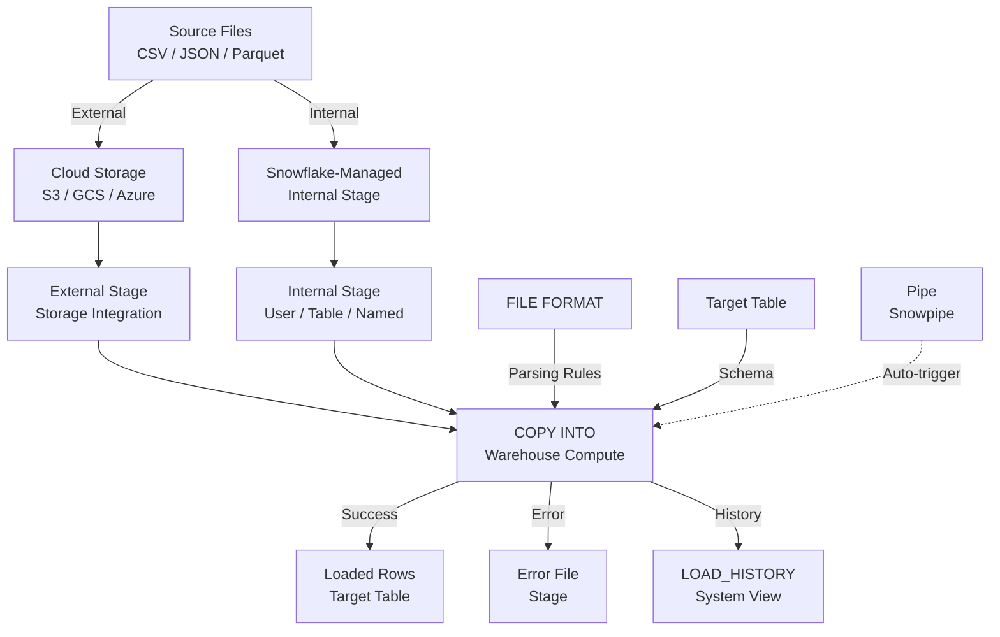

# 1. Load Data from External and Internal Stages into a Table

# 2. Overview

Loading data from stages into tables is Snowflake's primary bulk ingestion mechanism. It is implemented through the `COPY INTO <table>` command, which reads files from **external stages** (cloud storage: S3, GCS, Azure Blob) or **internal stages** (Snowflake-managed storage: user, table, or named) and inserts parsed rows into a target table.

This mechanism exists to:
- Ingest large volumes of structured and semi-structured data efficiently without row-by-row inserts
- Leverage Snowflake's elastic compute to parallelize file parsing and loading
- Support multiple file formats (CSV, JSON, Parquet, Avro, ORC, XML) with configurable parsing rules
- Provide granular error handling, validation, and observability

The intended consumers are data engineers building production ingestion pipelines, platform architects designing data landing patterns, and SnowPro Advanced exam candidates who must understand stage types, `COPY INTO` semantics, file format options, error modes, and load optimization.

# 3. SQL Object Summary

| Object/Feature | Type | Purpose | Source Objects or Inputs | Output Object or Observable Behavior | Execution Mode or Invocation Method |
|---|---|---|---|---|---|
| COPY INTO | DML command | Bulk load from stage files to table | Stage files + target table | Loaded rows, error files, load history | Manual SQL or task execution |
| External Stage | Stage object | Reference to cloud storage | S3 bucket, GCS bucket, Azure container | Accessible file paths via `@stage` | `CREATE STAGE` with cloud credentials |
| Internal Stage | Stage object | Snowflake-managed storage | User uploads via PUT/Snowsight | File paths via `@~`, `@%table`, `@named_stage` | `CREATE STAGE` or implicit |
| User Stage | Internal stage | Default per-user storage | `PUT` via SnowSQL/Snowsight | `@~/path` | Implicit per user |
| Table Stage | Internal stage | Table-scoped storage | `PUT` via SnowSQL/Snowsight | `@%table/path` | Implicit per table |
| Named Stage | Internal/External | Reusable stage object | `CREATE STAGE` definition | `@stage_name/path` | Explicit creation |
| FILE FORMAT | Schema object | Parsing configuration | Format type + parameters | Reusable format definition | `CREATE FILE FORMAT` |
| PIPE | Schema object | Automated continuous loading | Cloud storage events | Loaded rows in target table | Snowpipe serverless |
| LOAD_HISTORY | System view | Load outcome telemetry | COPY execution | File-level load metrics | Query-time |
| VALIDATION_MODE | COPY option | Pre-validate without loading | Stage files | Error report, no persisted data | `COPY INTO` option |
| PURGE | COPY option | Remove files after load | Stage files | Deleted source files | `COPY INTO` option |

# 4. Architecture

The load architecture separates storage (stage), parsing (file format), compute (warehouse), and persistence (target table). External stages reference cloud storage via integration objects; internal stages use Snowflake-managed storage. COPY INTO parallelizes file reading across warehouse nodes.

# 5. Data Flow / Process Flow

## Step 1: Stage Preparation
- **Input:** Files in cloud storage or uploaded to internal stage
- **Transformation:** Stage object provides authenticated, scoped access to file paths
- **Output:** Files accessible via `@stage/path` notation
- **Purpose:** Make source data available to Snowflake compute

## Step 2: File Discovery
- **Input:** `COPY INTO` command with `FILES = (...)` or path pattern
- **Transformation:** Engine lists files in stage matching pattern; for external stages, uses cloud API; for internal stages, queries metadata
- **Output:** File list for processing
- **Purpose:** Identify specific files to load

## Step 3: Parse and Transform
- **Input:** File bytes, `FILE_FORMAT` specification
- **Transformation:** Warehouse nodes parallelize file reading; format parser extracts rows, handles delimiters, encoding, compression, type coercion
- **Output:** Row sets aligned to target table schema
- **Purpose:** Convert raw files into structured row format

## Step 4: Load and Validate
- **Input:** Parsed rows, target table schema, constraints
- **Transformation:** Rows inserted into table; `NOT NULL` constraints enforced; `UNIQUE`/`PRIMARY KEY` enforced only if explicitly enabled
- **Output:** Committed rows or rejected rows
- **Purpose:** Persist valid data

## Step 5: Error Handling
- **Input:** Rejected rows based on `ON_ERROR` setting
- **Transformation:** Bad rows written to error file in stage; load continues or aborts per configuration
- **Output:** Error files, error counts, first error details
- **Purpose:** Isolate bad data without losing valid rows

## Step 6: History Recording
- **Input:** Load execution metadata
- **Output:** Row in `LOAD_HISTORY` with file name, row count, error count, timing
- **Purpose:** Provide audit trail and observability

# 6. Logical Breakdown

## Component: External Stage
- **Responsibility:** Provide authenticated access to cloud storage
- **Inputs:** Cloud storage URI, storage integration or direct credentials
- **Outputs:** File paths accessible via `@stage` notation
- **Dependencies:** Cloud IAM trust, network policies, storage integration
- **Failure Modes:** Credential expiration, IAM misconfiguration, network policy blocking, bucket permissions

## Component: Internal Stage
- **Responsibility:** Store files in Snowflake-managed storage
- **Inputs:** File uploads via `PUT`, Snowsight, or programmatic API
- **Outputs:** File paths accessible via `@~`, `@%table`, or `@named_stage`
- **Dependencies:** User/table existence, stage creation privileges
- **Failure Modes:** Storage limits (internal stages have practical limits), upload timeouts, privilege issues

## Component: FILE FORMAT
- **Responsibility:** Define parsing rules for source files
- **Inputs:** Format type and parameters (delimiter, encoding, compression, date formats)
- **Outputs:** Reusable or inline parsing configuration
- **Dependencies:** File content must conform to specified format
- **Failure Modes:** Format mismatch causes parse errors; incorrect date formats produce nulls or errors; encoding mismatches cause garbled data

## Component: COPY INTO Parser
- **Responsibility:** Read files and produce row sets
- **Inputs:** Stage files, file format, warehouse compute
- **Outputs:** Parsed rows or parse errors
- **Dependencies:** Warehouse must be running; files must be readable
- **Failure Modes:** Malformed files, schema mismatch, type coercion failures, compression errors

## Component: Target Table Loader
- **Responsibility:** Insert parsed rows into table
- **Inputs:** Parsed rows, target table schema
- **Outputs:** Committed rows
- **Dependencies:** `INSERT` privilege; table must exist; constraints must be satisfied
- **Failure Modes:** Constraint violations (nulls in `NOT NULL`, duplicates in enabled `UNIQUE`), insufficient privileges, warehouse timeout

## Component: Error File Writer
- **Responsibility:** Persist rejected rows for debugging
- **Inputs:** Bad rows, error context
- **Outputs:** Error files in stage
- **Dependencies:** Stage must be writable
- **Failure Modes:** Error file generation disabled if `ON_ERROR = 'ABORT_STATEMENT'`; error files may grow large

## Component: Load History Tracker
- **Responsibility:** Record load outcomes
- **Inputs:** Load execution metadata
- **Outputs:** `LOAD_HISTORY` rows
- **Dependencies:** Load must execute
- **Failure Modes:** History retention limited; loads aborted before completion may not record

# 7. Data Model

## INFORMATION_SCHEMA.LOAD_HISTORY

| Column | Role | Grain | Notes |
|---|---|---|---|
| `TABLE_NAME` | Target | One per file per load | |
| `SCHEMA_NAME` | Context | One per file per load | |
| `FILE_NAME` | Source | One per file per load | Full stage path |
| `STAGE_LOCATION` | Source context | One per file per load | |
| `LAST_LOAD_TIME` | Timing | One per file per load | |
| `ROW_COUNT` | Loaded volume | One per file per load | Successfully loaded |
| `ROW_PARSED` | Parsed volume | One per file per load | Total rows parsed |
| `ERROR_COUNT` | Rejected volume | One per file per load | Rows with errors |
| `FIRST_ERROR_MESSAGE` | Debug | One per file per load | |
| `FIRST_ERROR_LINE_NUMBER` | Debug | One per file per load | |
| `FIRST_ERROR_CHARACTER_POS` | Debug | One per file per load | |
| `FIRST_ERROR_COLUMN_NAME` | Debug | One per file per load | Target column |

## Grain
One row per file per load operation.

## Target Table (Load Destination)

| Column | Role | Grain | Notes |
|---|---|---|---|
| Load-defined columns | Data fields | One per row | Must align with COPY projection |
| `METADATA$FILENAME` | Source trace | One per row | Available via metadata columns |
| `METADATA$FILE_ROW_NUMBER` | Source trace | One per row | Row number in source file |
| `METADATA$FILE_CONTENT_KEY` | Source trace | One per row | For pipe loads |

## Grain
One row per successfully loaded record.

# 8. Business Logic

## Stage Type Selection
- **External stage:** Use when files originate in cloud storage and should not be duplicated into Snowflake-managed storage; optimal for large-scale, recurring loads from data lakes
- **Internal named stage:** Use when files are uploaded via `PUT` or API and reused across users; good for ETL staging
- **Table stage (`@%table`):** Use when files are scoped to a single table; private to table owner
- **User stage (`@~`):** Use for personal, ad-hoc uploads; private to user

## COPY INTO File Specification
- `FROM @stage/path/` loads all files in path
- `FILES = ('file1.csv', 'file2.csv')` loads specific files
- `PATTERN = '.*data_[0-9]+.csv'` loads files matching regex
- Without `FILES` or `PATTERN`, loads all files not yet loaded (tracked by load metadata)

## Load Deduplication
- Snowflake tracks loaded files to prevent duplicates within a 64-day window
- Re-loading the same file path without changes is skipped automatically
- Use `FORCE = TRUE` to override deduplication; risks duplicates; avoid in production

## Error Handling Modes
- `ABORT_STATEMENT` (default): Stop on first error in any file
- `SKIP_FILE`: Skip files containing errors; load error-free files
- `SKIP_FILE_<num>`: Skip file if error count exceeds threshold
- `CONTINUE`: Load valid rows, skip bad rows; generates error files

## Validation Mode
- `VALIDATION_MODE = 'RETURN_N_ROWS'`: Parse and return N rows without loading
- `VALIDATION_MODE = 'RETURN_ALL_ERRORS'`: Parse all files and return all errors without loading
- Used for pre-load quality checks without persisting data

## Column Mapping
- `COPY INTO t (col1, col2) FROM @stage` maps file fields to columns by ordinal position
- `COPY INTO t FROM @stage FILE_FORMAT = (...)` loads all columns by position
- Metadata columns (`METADATA$FILENAME`, `METADATA$FILE_ROW_NUMBER`) can be included in column list
- Expressions and transformations require manual SQL: `COPY INTO t (col1, computed_col) SELECT $1, UPPER($2) FROM @stage`

## File Format Defaults
- CSV: Comma delimiter, UTF-8, no compression, no header skip unless specified
- JSON: Auto-detect array vs. newline-delimited; `STRIP_OUTER_ARRAY` for array files
- Parquet/Avro/ORC: Binary formats with embedded schema; type inference from file metadata
- XML: Requires `STRIP_OUTER_ELEMENT` for nested structures

## Purge Behavior
- `PURGE = TRUE` removes successfully loaded files from stage after load
- Use with caution on external stages; deletes source files in cloud storage
- Default is `FALSE`; files remain in stage

## Size Limit
- `SIZE_LIMIT = <bytes>` stops loading after specified bytes processed
- Useful for testing or incremental loading of large file sets

## Return Failed Only
- `RETURN_FAILED_ONLY = TRUE` returns only files that failed to load
- Useful for error-focused monitoring

# 9. Transformations

## Stage File to Parsed Row
- **Source:** Raw file bytes in stage
- **Output:** Structured row set
- **Logic:** Format parser applies delimiter, encoding, compression, and type rules
- **Meaning:** Raw data converted to typed columns
- **Impact:** Foundation for table insertion

## Parsed Row to Table Row
- **Source:** Parsed row set
- **Output:** Committed rows in target table
- **Logic:** Type coercion, constraint validation, metadata column injection
- **Meaning:** Data persisted in production schema
- **Impact:** Target table reflects source state

## Error Row to Error File
- **Source:** Rows failing parse or constraint checks
- **Output:** Error files in stage with rejection context
- **Logic:** `ON_ERROR` setting determines whether bad rows are written to error files
- **Meaning:** Isolation of invalid data for debugging
- **Impact:** Valid rows load successfully; bad rows preserved for analysis

## File List to Load History
- **Source:** Processed files
- **Output:** `LOAD_HISTORY` records
- **Logic:** System records file name, counts, timing, and first error
- **Meaning:** Audit trail for ingestion operations
- **Impact:** Enables observability and reconciliation

## Cloud Storage to Snowflake Table
- **Source:** Files in S3/GCS/Azure
- **Output:** Rows in target table
- **Logic:** External stage + storage integration provides authenticated access; COPY INTO parallelizes reads
- **Meaning:** Zero-copy ingestion from data lake
- **Impact:** Eliminates data movement overhead; leverages cloud-native architecture

# 10. Parameters / Variables / Configuration

| Name | Type | Purpose | Allowed Values | Default | Where Used | Effect |
|---|---|---|---|---|---|---|
| `ON_ERROR` | COPY option | Error handling | `ABORT_STATEMENT`, `SKIP_FILE`, `SKIP_FILE_<n>`, `CONTINUE` | `ABORT_STATEMENT` | `COPY INTO` | Determines behavior on bad rows |
| `FILE_FORMAT` | COPY option | Parsing spec | Named format or inline | Required | `COPY INTO` | Defines how files are parsed |
| `FILES` | COPY option | Specific files | List of file names | None (all files) | `COPY INTO` | Limits load to named files |
| `PATTERN` | COPY option | Regex filter | Regular expression | None (all files) | `COPY INTO` | Limits load by pattern |
| `FORCE` | COPY option | Override dedup | `TRUE`, `FALSE` | `FALSE` | `COPY INTO` | `TRUE` risks duplicates |
| `PURGE` | COPY option | Delete after load | `TRUE`, `FALSE` | `FALSE` | `COPY INTO` | Removes source files |
| `SIZE_LIMIT` | COPY option | Byte limit | Integer | None | `COPY INTO` | Stops after N bytes |
| `RETURN_FAILED_ONLY` | COPY option | Result filtering | `TRUE`, `FALSE` | `FALSE` | `COPY INTO` | Returns only failed files |
| `VALIDATION_MODE` | COPY option | Pre-validate | `RETURN_N_ROWS`, `RETURN_ALL_ERRORS` | None | `COPY INTO` | No data persistence |
| `LOAD_UNCERTAIN_FILES` | COPY option | Force load | `TRUE`, `FALSE` | `FALSE` | `COPY INTO` | Loads files with uncertain state |
| `METADATA$FILENAME` | Metadata column | Source file path | String | Auto | `COPY INTO` column list | Injects source file name |
| `METADATA$FILE_ROW_NUMBER` | Metadata column | Source row number | Integer | Auto | `COPY INTO` column list | Injects row number |
| `COMPRESSION` | File format | Compression type | `AUTO`, `GZIP`, `BZ2`, `DEFLATE`, `RAW_DEFLATE`, `NONE` | `AUTO` | `FILE FORMAT` | Decompression method |
| `SKIP_HEADER` | File format | Header rows | Integer >= 0 | `0` | `FILE FORMAT` | Rows ignored at start |
| `FIELD_DELIMITER` | File format | CSV separator | Character | `,` | `FILE FORMAT` | Field separator |
| `RECORD_DELIMITER` | File format | Row separator | Character | `\n` | `FILE FORMAT` | Record separator |
| `FIELD_OPTIONALLY_ENCLOSED_BY` | File format | Quote char | Character | None | `FILE FORMAT` | Quote handling |
| `ESCAPE` | File format | Escape char | Character | `\\` | `FILE FORMAT` | Escape handling |
| `DATE_FORMAT` | File format | Date parsing | Format string | `AUTO` | `FILE FORMAT` | Date interpretation |
| `TIME_FORMAT` | File format | Time parsing | Format string | `AUTO` | `FILE FORMAT` | Time interpretation |
| `TIMESTAMP_FORMAT` | File format | Timestamp parsing | Format string | `AUTO` | `FILE FORMAT` | Timestamp interpretation |
| `BINARY_FORMAT` | File format | Binary encoding | `HEX`, `BASE64`, `UTF8` | `HEX` | `FILE FORMAT` | Binary interpretation |
| `ENCODING` | File format | Character set | `UTF8`, `ISO2022JP`, `UTF16`, etc. | `UTF8` | `FILE FORMAT` | Character encoding |
| `ERROR_ON_COLUMN_COUNT_MISMATCH` | File format | Strict columns | `TRUE`, `FALSE` | `TRUE` | `FILE FORMAT` | Rejects rows with wrong column count |
| `REPLACE_INVALID_CHARACTERS` | File format | Encoding fix | `TRUE`, `FALSE` | `FALSE` | `FILE FORMAT` | Replaces bad chars with replacement char |
| `NULL_IF` | File format | Null values | List of strings | `['\\N', 'NULL']` | `FILE FORMAT` | Strings interpreted as NULL |
| `STRIP_OUTER_ARRAY` | JSON format | Array handling | `TRUE`, `FALSE` | `FALSE` | `FILE FORMAT` | Strips outer JSON array |
| `STRIP_NULL_VALUES` | JSON format | Null filtering | `TRUE`, `FALSE` | `FALSE` | `FILE FORMAT` | Removes null-valued keys |
| `TRIM_SPACE` | CSV format | Whitespace handling | `TRUE`, `FALSE` | `FALSE` | `FILE FORMAT` | Trims whitespace from fields |

# 11. APIs / Interfaces

## Interface: COPY INTO
- **Invocation:** `COPY INTO target_table [ ( col1, col2, ... ) ] FROM { @stage [ /path ] | @%table | @~ } [ FILES = (...) | PATTERN = '...' ] FILE_FORMAT = ( ... ) [ ON_ERROR = ... ] [ PURGE = ... ] [ VALIDATION_MODE = ... ]`
- **Input:** Target table, stage reference, format spec, options
- **Output:** Result set with file names, statuses, rows parsed, rows loaded, errors
- **Error Behavior:** Aborts, skips, or continues based on `ON_ERROR`
- **Consumers:** ETL pipelines, ad-hoc loads, tasks, pipes

## Interface: CREATE STAGE (External)
- **Invocation:** `CREATE STAGE stage_name URL = 's3://bucket/path' STORAGE_INTEGRATION = integration_name FILE_FORMAT = format_name`
- **Input:** Cloud URI, credentials/integration, format
- **Output:** External stage object
- **Error Behavior:** Fails on invalid URI, bad credentials, or insufficient privileges
- **Consumers:** Production pipelines, data lake integration

## Interface: CREATE STAGE (Internal)
- **Invocation:** `CREATE STAGE stage_name FILE_FORMAT = format_name`
- **Input:** Stage name, optional format
- **Output:** Internal named stage
- **Error Behavior:** Fails if name exists or insufficient privileges
- **Consumers:** ETL staging, file uploads

## Interface: PUT (SnowSQL)
- **Invocation:** `PUT file://local/path @stage/path [ AUTO_COMPRESS = TRUE ]`
- **Input:** Local file path, stage path
- **Output:** File uploaded to internal stage
- **Error Behavior:** Fails on file not found, stage access denied, network issues
- **Consumers:** CLI-based file uploads

## Interface: INFORMATION_SCHEMA.LOAD_HISTORY
- **Invocation:** `SELECT * FROM INFORMATION_SCHEMA.LOAD_HISTORY WHERE TABLE_NAME = '...'`
- **Input:** Table name filter
- **Output:** File-level load outcomes
- **Error Behavior:** Empty set if no loads
- **Consumers:** Load verification, audit, reconciliation

## Interface: VALIDATION_MODE
- **Invocation:** `COPY INTO target FROM @stage FILE_FORMAT = (...) VALIDATION_MODE = 'RETURN_ALL_ERRORS'`
- **Input:** Same as COPY INTO
- **Output:** Error report without loaded data
- **Error Behavior:** Returns all parse errors found
- **Consumers:** Pre-load quality checks

# 12. Execution / Deployment

## External Stage Loading
- Create storage integration with IAM role trust
- Create external stage referencing integration
- Execute `COPY INTO` from stage to target table
- Monitor via `LOAD_HISTORY` and `PIPE_USAGE_HISTORY` if using pipes

## Internal Stage Loading
- Upload files via `PUT` (SnowSQL), Snowsight, or API
- Execute `COPY INTO` from internal stage
- Clean up stage files after load or use `PURGE = TRUE`

## Production Pipeline Pattern
- Files land in cloud storage → Pipe or task triggers → `COPY INTO` loads to staging table → Task transforms to production table
- Use `ON_ERROR = 'CONTINUE'` with quarantine table review for dirty data
- Use `VALIDATION_MODE` in dev before production deployment

## Incremental Loading
- New files arrive in stage with distinct names or timestamps
- `COPY INTO` without `FILES` or `PATTERN` skips already-loaded files automatically
- For forced reprocessing, use `FORCE = TRUE` with caution

## Bulk Backfill
- Use `FILES` or `PATTERN` to select specific historical files
- Size warehouse appropriately for parallel parsing
- Monitor `WAREHOUSE_METERING_HISTORY` for credit consumption

## Environment Behavior
- Development: Frequent `VALIDATION_MODE` use, small test files, verbose error inspection
- Production: Named stages, reusable file formats, `ON_ERROR = 'CONTINUE'` or `SKIP_FILE`, error integration alerts, stage cleanup policies

# 13. Observability

## Load Verification
- Query `LOAD_HISTORY` for row counts, error counts, and timing per file
- Compare `ROW_COUNT` to expected counts from source systems
- Validate with `SELECT COUNT(*)` on target table

## Error Monitoring
- Inspect error files in stage for rejected rows
- Query `LOAD_HISTORY.FIRST_ERROR_MESSAGE` for error patterns
- Categorize errors: format mismatch, type coercion, constraint violation, encoding issues

## File Tracking
- Monitor which files have been loaded vs. remain in stage
- Use `LIST @stage` to enumerate stage contents
- Compare stage file list to `LOAD_HISTORY` to identify unprocessed files

## Performance Monitoring
- Join `LOAD_HISTORY` to `QUERY_HISTORY` on query ID for execution details
- Monitor bytes scanned and duration per file
- Track warehouse credit consumption per load batch

## Pipe Monitoring (if applicable)
- Query `PIPE_USAGE_HISTORY` for continuous load metrics
- Monitor file backlog and error rates
- Verify notification channel health for auto-ingest pipes

## Key Metrics
- Rows loaded per file and per batch
- Error rate (error count / parsed count)
- Load duration per file
- Warehouse credits per million rows
- Stage file age (time from arrival to load)
- Duplicate load rate (should be near zero)

# 14. Failure Handling & Recovery

## Parse Errors
- **What breaks:** File format does not match `FILE_FORMAT` specification
- **Detection:** `LOAD_HISTORY` shows `ERROR_COUNT > 0`; error files contain rejected rows
- **Fallback:** `ON_ERROR = 'CONTINUE'` loads valid rows; `VALIDATION_MODE` previews errors
- **Recovery:** Fix `FILE_FORMAT` parameters; reprocess error files; or fix source files and reload

## Schema Mismatch
- **What breaks:** File columns do not align with target table columns
- **Detection:** `ERROR_ON_COLUMN_COUNT_MISMATCH` rejects rows; `LOAD_HISTORY` shows errors
- **Fallback:** Load to staging table with `VARIANT` or loose typing; transform and insert
- **Recovery:** Adjust column mapping in `COPY INTO`; use explicit column list; or alter target table

## Type Coercion Failures
- **What breaks:** String values cannot cast to target column types
- **Detection:** Cast errors in `LOAD_HISTORY`; nulls where data expected
- **Fallback:** Use `TRY_CAST` in staging load; load as `VARIANT` and parse later
- **Recovery:** Fix source data; adjust `FILE_FORMAT` type formats; or load to `VARIANT` column

## Constraint Violations
- **What breaks:** `NOT NULL` columns receive nulls; enabled `UNIQUE` constraints encounter duplicates
- **Detection:** Constraint error messages in `LOAD_HISTORY`
- **Fallback:** Load to unconstrained staging table; cleanse and `MERGE` into constrained target
- **Recovery:** Fix nulls with `COALESCE` or `NULL_IF`; deduplicate before loading

## Duplicate Loads
- **What breaks:** `FORCE = TRUE` or file rename causes same data to load twice
- **Detection:** Target row count exceeds expected; duplicate primary keys
- **Fallback:** Use `MERGE` for idempotent loads instead of `COPY INTO` directly
- **Recovery:** Identify duplicates; delete or deduplicate target table; remove `FORCE = TRUE`

## Stage Access Failures
- **What breaks:** External stage credentials expired or IAM role misconfigured
- **Detection:** `COPY INTO` fails with access denied or credential error
- **Fallback:** Verify stage with `LIST @stage`
- **Recovery:** Rotate credentials; verify IAM trust policy; test storage integration

## Warehouse Timeout
- **What breaks:** Very large files or many files exceed warehouse capacity or timeout
- **Detection:** Query cancelled; `LOAD_HISTORY` incomplete
- **Fallback:** Increase warehouse size; split load into smaller batches
- **Recovery:** Resize warehouse; use `SIZE_LIMIT` to chunk loads; retry with smaller file sets

## Encoding Issues
- **What breaks:** Non-UTF8 characters cause parse failures
- **Detection:** Invalid byte sequence errors; garbled text in preview
- **Fallback:** Set `ENCODING` to match source; use `REPLACE_INVALID_CHARACTERS`
- **Recovery:** Re-encode source files; or configure format to handle source encoding

## Compression Errors
- **What breaks:** Files labeled as GZIP but are not compressed, or compression is corrupted
- **Detection:** Decompression errors in `LOAD_HISTORY`
- **Fallback:** Set `COMPRESSION = 'AUTO'` or explicit type
- **Recovery:** Verify file compression; recompress if corrupted; adjust format spec

# 15. Security & Access Control

## Privilege Requirements

| Action | Required Privilege | Object |
|---|---|---|
| Create external stage | `CREATE STAGE` on schema | Schema |
| Create internal stage | `CREATE STAGE` on schema | Schema |
| Use external stage | `USAGE` on stage + storage integration | Stage/Integration |
| Use internal stage | `USAGE` on stage | Stage |
| Load into table | `INSERT` on table | Table |
| Read stage files | `READ` on stage | Stage |
| Write stage files | `WRITE` on stage | Stage |
| Create file format | `CREATE FILE FORMAT` on schema | Schema |
| Use file format | `USAGE` on file format | File format |

## External Stage Security
- Use storage integrations with IAM roles rather than direct credentials
- Rotate IAM roles per security policy
- Apply IP allowlisting and network policies
- Encrypt data at rest in cloud storage; Snowflake decrypts via integration

## Internal Stage Security
- Internal stages use Snowflake-managed encryption
- User stages are private to the user
- Table stages are accessible to table owner
- Named stages require explicit `READ`/`WRITE` grants

## Data Masking During Load
- `COPY INTO` evaluates masking policies on target table columns
- Ensure load user role has appropriate masking policy exemptions if raw data must load
- Consider loading to staging table without masking, then applying policies on production table

## Row Access Policies
- Row access policies on target table filter loaded data if the loading role is subject to them
- Use a service role with bypass privilege for ETL loads if all rows must be loaded regardless of policy

## Error File Security
- Error files written to stage may contain sensitive data that failed validation
- Restrict stage access to prevent unauthorized error file inspection
- Implement error file retention and purge policies

# 16. Performance / Scalability Considerations

## Parallel Loading
- `COPY INTO` parallelizes across warehouse nodes
- Larger warehouses load faster due to more parallelism
- Very small files underutilize warehouse; consolidate files to 100MB-250MB for optimal throughput

## File Size Optimization
- Optimal file size for Snowflake loading: 100MB-250MB compressed
- Many tiny files create overhead; consolidate before loading
- Very large files (>1GB) may cause memory pressure; split if possible

## Stage Type Performance
- External stages: No data movement into Snowflake storage; compute reads directly from cloud
- Internal stages: Files stored in Snowflake-managed storage; slightly faster for repeated access
- Performance difference is negligible for most workloads; choose based on architecture

## Format Parsing Cost
- CSV parsing is CPU-intensive due to delimiter handling and type coercion
- Parquet/Avro/ORC parsing is faster due to embedded schema and binary format
- JSON parsing is moderate; nested structures increase cost
- Prefer columnar formats (Parquet) for large-scale loads

## Compression Impact
- Compressed files reduce transfer time and storage
- `AUTO` compression detection adds minimal overhead
- GZIP is standard; Snappy/ZSTD in Parquet may be faster

## Metadata Column Overhead
- Including `METADATA$FILENAME` and `METADATA$FILE_ROW_NUMBER` adds minimal overhead
- Useful for audit and debugging; recommended for production loads

## Warehouse Sizing
- Small loads: XSMALL-SMALL sufficient
- Large bulk loads: MEDIUM-LARGE or larger
- Auto-scale or resize warehouse for load windows, then suspend

## Purge vs. Retain
- `PURGE = TRUE` removes files after load, reducing stage storage costs
- On external stages, purge deletes source files in cloud storage
- Retain files for reprocessing or audit until verified

## Load History Query Performance
- `LOAD_HISTORY` is efficient for recent loads
- Large date ranges may scan significant data; filter by `LAST_LOAD_TIME`

# 17. Assumptions & Constraints

## Explicit Assumptions
- The reader is implementing bulk data ingestion from files into Snowflake tables
- Source files are in supported formats and accessible via stages
- Target tables exist or are created as part of the load process

## Engine Boundaries
- `COPY INTO` supports files up to 5GB uncompressed per file (practical limit)
- Load deduplication tracks files for 64 days; beyond this window, re-loading may duplicate
- `COPY INTO` from external stages requires network connectivity to cloud storage
- Error files are written to the stage; external stage error files are stored in cloud storage
- `VALIDATION_MODE` does not persist data but consumes compute
- Snowpipe (continuous loading) is a separate mechanism from batch `COPY INTO`

## Exam-Relevant Defaults
- `ON_ERROR` default: `ABORT_STATEMENT`
- `COMPRESSION` default: `AUTO`
- `ENCODING` default: `UTF8`
- `SKIP_HEADER` default: `0`
- `FIELD_DELIMITER` default: `,`
- `ERROR_ON_COLUMN_COUNT_MISMATCH` default: `TRUE`
- `FORCE` default: `FALSE`
- `PURGE` default: `FALSE`
- Load deduplication window: 64 days
- Maximum `COPY INTO` file size: 5GB uncompressed

## Ambiguities
- Exact parallelization factor for `COPY INTO` is not documented as a fixed number; it scales with warehouse size
- Behavior of `AUTO` compression detection for unusual formats is not fully specified
- Error file format and structure may vary slightly based on file type and error mode

# 18. Future Enhancements

- Implement reusable file format templates per source system to standardize parsing and reduce configuration drift
- Add pre-load validation tasks using `VALIDATION_MODE = 'RETURN_ALL_ERRORS'` before production `COPY INTO` execution
- Create error file monitoring tasks that parse rejected rows and write structured quarantine records
- Migrate CSV loads to Parquet where possible to reduce parsing overhead and improve type fidelity
- Implement stage cleanup tasks that archive or delete loaded files after verification, using `PURGE` or explicit `REMOVE`
- Build load reconciliation procedures that compare source file row counts to `LOAD_HISTORY` and target table counts
- Use `METADATA$FILENAME` and `METADATA$FILE_ROW_NUMBER` in all production loads for traceability and debugging
- Standardize on named stages and storage integrations rather than direct credentials for security and maintainability
- Add warehouse auto-resize logic for load windows to optimize cost and throughput
- Implement incremental load patterns using file timestamp patterns rather than relying solely on Snowflake's deduplication window
