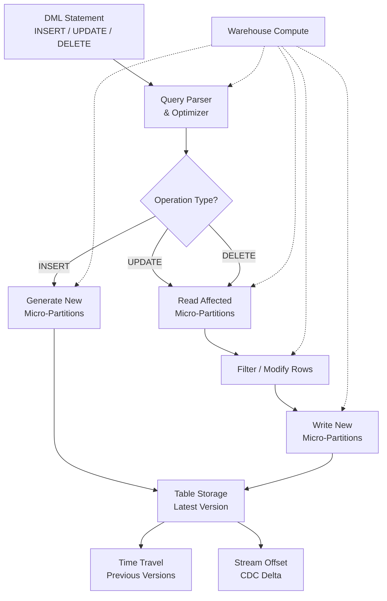

# 1. Perform General DML (INSERT, UPDATE, and DELETE) in Snowflake

# 2. Overview

Snowflake DML (Data Manipulation Language) consists of `INSERT`, `UPDATE`, and `DELETE` statements that modify table data. These operations are ACID-compliant at the statement level and operate on Snowflake's micro-partition storage architecture. Unlike traditional row-store databases, `UPDATE` and `DELETE` in Snowflake rewrite entire micro-partitions rather than modifying individual rows in place, which has significant performance and cost implications.

- **INSERT:** Adds new rows via `VALUES` clauses or `SELECT` statements. Supports single-row, bulk, multi-table (`INSERT ALL`), and overwrite patterns. This is the primary ingestion path alongside `COPY INTO`.
- **UPDATE:** Modifies existing rows by rewriting all micro-partitions containing affected rows. Supports scalar assignments and subqueries in `SET` and `WHERE` clauses. Does not support multi-table update syntax.
- **DELETE:** Removes rows by rewriting affected micro-partitions. Supports subqueries and the `USING` clause for join-based deletion. `TRUNCATE TABLE` is the efficient alternative for full-table deletion.

These statements exist to enable transactional data modification, incremental pipeline loads, data correction, and retention management. The intended consumers are data engineers building ELT pipelines, application developers integrating with Snowflake, and SnowPro Advanced exam candidates who must understand micro-partition rewrite behavior, constraint enforcement, Time Travel implications, and concurrency boundaries.

# 3. SQL Object Summary

| Object/Feature | Type | Purpose | Source Objects or Inputs | Output Object or Observable Behavior | Execution Mode or Invocation Method |
|---|---|---|---|---|---|
| INSERT | DML statement | Add rows to table | VALUES list or SELECT result set | New rows in target table | Manual SQL, task, or application |
| INSERT INTO ... SELECT | DML pattern | Bulk row insertion from query | Source tables/views/subqueries | New rows in target table | Query execution |
| INSERT OVERWRITE | DML variant | Replace table contents atomically | SELECT result set | Table with only new rows | Atomic truncate + insert |
| INSERT ALL | DML variant | Insert into multiple tables from one source | Source query + multiple target tables | Rows distributed across targets | Single statement |
| UPDATE | DML statement | Modify existing rows | Target table + SET assignments + WHERE | Updated rows, rewritten micro-partitions | Manual SQL, task, or application |
| DELETE | DML statement | Remove existing rows | Target table + WHERE/USING | Removed rows, rewritten micro-partitions | Manual SQL, task, or application |
| TRUNCATE TABLE | DDL statement | Efficient full-table deletion | Target table | Empty table, no micro-partition rewrite | Manual SQL |
| Stream (CDC) | Schema object | Capture DML changes | DML on source table | Delta rows with metadata | Automatic |
| Task | Schema object | Automate DML execution | SQL statement | Scheduled or triggered DML | Time/predecessor based |

# 4. Architecture

DML operations flow through the query engine to micro-partition storage. `INSERT` appends new micro-partitions. `UPDATE` and `DELETE` read existing micro-partitions, filter/modify rows, and write new micro-partitions while the old versions remain available via Time Travel until retention expires. Streams capture row-level changes for downstream incremental processing.

# 5. Data Flow / Process Flow

## Step 1: Statement Parsing and Planning
- **Input:** `INSERT`, `UPDATE`, or `DELETE` SQL statement
- **Transformation:** Parser validates syntax, resolves object references, optimizer generates execution plan
- **Output:** Query plan with scan predicates, join orders, and write targets
- **Purpose:** Ensure statement is valid and executable

## Step 2: Data Scan (UPDATE/DELETE) or Generation (INSERT)
- **Input:** For `UPDATE`/`DELETE`: existing micro-partitions matching `WHERE` predicate; for `INSERT`: source query result or `VALUES` list
- **Transformation:** Engine reads affected micro-partitions or evaluates source query
- **Output:** Row set for modification or insertion
- **Purpose:** Identify the exact data to change

## Step 3: Row Modification
- **Input:** Scanned rows or generated rows
- **Transformation:** `UPDATE` applies `SET` assignments; `DELETE` marks rows for removal; `INSERT` prepares rows for persistence
- **Output:** Modified row set
- **Purpose:** Apply business logic to data

## Step 4: Constraint Validation
- **Input:** Modified row set
- **Transformation:** Engine checks `NOT NULL` constraints; checks enabled `UNIQUE`/`PRIMARY KEY` constraints if applicable
- **Output:** Validated rows or constraint violation error
- **Purpose:** Enforce data integrity rules

## Step 5: Micro-Partition Write
- **Input:** Validated rows
- **Transformation:** Rows are encoded, compressed, and written as new micro-partitions; `UPDATE`/`DELETE` rewrite all affected partitions
- **Output:** New micro-partitions in table storage
- **Purpose:** Persist changes immutably

## Step 6: Metadata Update
- **Input:** New micro-partition metadata
- **Transformation:** Table catalog updated to point to new partitions; old partitions retained for Time Travel
- **Output:** Consistent table state visible to new queries
- **Purpose:** Ensure atomic visibility of changes

## Step 7: Stream Advancement (if applicable)
- **Input:** Committed DML transaction
- **Transformation:** Streams on the table capture insert, update, and delete deltas
- **Output:** Stream offset advanced with new change records
- **Purpose:** Enable downstream incremental processing

# 6. Logical Breakdown

## Component: INSERT Executor
- **Responsibility:** Add new rows to a table
- **Inputs:** `VALUES` list or `SELECT` query result
- **Outputs:** New micro-partitions appended to table
- **Dependencies:** Target table must exist; user must have `INSERT` privilege
- **Failure Modes:** Constraint violations; type mismatches; warehouse timeout on large `SELECT`; stream offset not advanced if read-only query

## Component: UPDATE Executor
- **Responsibility:** Modify existing rows by rewriting micro-partitions
- **Inputs:** Target table, `SET` assignments, `WHERE` predicate
- **Outputs:** New micro-partitions with updated rows; old micro-partitions retained for Time Travel
- **Dependencies:** `UPDATE` privilege; warehouse compute for partition rewrite
- **Failure Modes:** Very large updates exhaust warehouse resources or timeout; non-deterministic updates if `WHERE` matches duplicates; constraint violations on enabled unique keys

## Component: DELETE Executor
- **Responsibility:** Remove existing rows by rewriting micro-partitions
- **Inputs:** Target table, `WHERE` predicate or `USING` join
- **Outputs:** New micro-partitions excluding deleted rows
- **Dependencies:** `DELETE` privilege; warehouse compute
- **Failure Modes:** Accidental unqualified `DELETE` removes all rows (rewrites all partitions); join explosion with `USING` produces unexpected deletions; warehouse timeout

## Component: Constraint Validator
- **Responsibility:** Enforce data integrity during DML
- **Inputs:** Modified rows
- **Outputs:** Validated rows or errors
- **Dependencies:** Table constraints defined
- **Failure Modes:** `NOT NULL` violations abort statement; enabled `UNIQUE`/`PRIMARY KEY` violations abort; informational constraints (`CHECK`, `FOREIGN KEY`) are not enforced

## Component: Micro-Partition Manager
- **Responsibility:** Handle immutable storage semantics for DML
- **Inputs:** Row modifications
- **Outputs:** New micro-partitions; metadata updates
- **Dependencies:** Storage layer
- **Failure Modes:** Storage limits; very wide rows exceed micro-partition bounds; clustering degradation after rewrite

## Component: Stream Capturer
- **Responsibility:** Record DML changes for CDC
- **Inputs:** Committed DML transactions
- **Outputs:** Stream delta records with `METADATA$ACTION` and `METADATA$ISUPDATE`
- **Dependencies:** Stream must exist on table
- **Failure Modes:** Stream becomes stale if table DDL changes; unconsumed streams grow conceptually

## Component: Time Travel Retainer
- **Responsibility:** Preserve old micro-partitions for historical querying
- **Inputs:** Rewritten micro-partitions from UPDATE/DELETE
- **Outputs:** Previous table versions accessible via `AT`/`BEFORE` clauses
- **Dependencies:** `DATA_RETENTION_TIME_IN_DAYS` setting
- **Failure Modes:** Old data retained until retention expires, increasing storage costs; cannot recover beyond fail-safe

# 7. Data Model

## Target Table (DML Subject)

| Column | Role | Grain | Notes |
|---|---|---|---|
| User-defined columns | Data | One per row | Subject to DML modification |
| `METADATA$FILENAME` | Metadata | One per row | Available if loaded via COPY |
| `METADATA$FILE_ROW_NUMBER` | Metadata | One per row | Available if loaded via COPY |

## Grain
One row per logical record.

## INFORMATION_SCHEMA.TABLES (DML-Relevant)

| Column | Role | Notes |
|---|---|---|
| `TABLE_NAME` | Identifier | |
| `TABLE_SCHEMA` | Context | |
| `TABLE_TYPE` | Classification | `BASE TABLE` for DML targets |
| `ROW_COUNT` | Estimate | Approximate; updated periodically |
| `BYTES` | Storage | Approximate storage size |
| `RETENTION_TIME` | Time Travel | Days of historical retention |

## INFORMATION_SCHEMA.COLUMNS (DML-Relevant)

| Column | Role | Notes |
|---|---|---|
| `COLUMN_NAME` | Identifier | |
| `DATA_TYPE` | Type | Determines coercion rules |
| `IS_NULLABLE` | Constraint | `NO` for NOT NULL columns |
| `COLUMN_DEFAULT` | Default | Applied when omitted in INSERT |

## INFORMATION_SCHEMA.TABLE_CONSTRAINTS (DML-Relevant)

| Column | Role | Notes |
|---|---|---|
| `CONSTRAINT_NAME` | Identifier | |
| `CONSTRAINT_TYPE` | Classification | `PRIMARY KEY`, `UNIQUE`, `FOREIGN KEY`, `CHECK` |
| `ENFORCED` | Enforcement | `YES` only for NOT NULL and enabled UNIQUE/PK |

## Stream Delta (if stream exists)

| Column | Role | Notes |
|---|---|---|
| `METADATA$ACTION` | Delta type | `INSERT` or `DELETE` |
| `METADATA$ISUPDATE` | Update flag | `TRUE` if update presented as delete+insert |
| `METADATA$ROW_ID` | Delta ID | Unique change identifier |

# 8. Business Logic

## INSERT Semantics
- `INSERT INTO table VALUES (...)` adds single or multiple rows via value lists
- `INSERT INTO table SELECT ...` is the bulk pattern; parallelized like standard queries
- `INSERT OVERWRITE TABLE table SELECT ...` atomically replaces all table contents; equivalent to `TRUNCATE` + `INSERT` in a single transaction
- `INSERT ALL` distributes source rows to multiple target tables based on `WHEN` conditions
- Omitting columns in `INSERT` uses `DEFAULT` values or `NULL` if no default and column is nullable
- `NOT NULL` columns without defaults must be provided; omission causes error

## UPDATE Semantics
- `UPDATE table SET col = expr [, ...] [WHERE condition]` modifies rows matching predicate
- All micro-partitions containing at least one matching row are rewritten entirely
- Subqueries permitted in `SET` and `WHERE` clauses
- `UPDATE` does not support `FROM` clause for multi-table joins directly in the same way as PostgreSQL; use subqueries or `MERGE` for complex join updates
- Non-deterministic updates (where `WHERE` matches multiple rows with ambiguous ordering) may produce unpredictable results
- Updates to clustering keys may cause significant partition rewriting

## DELETE Semantics
- `DELETE FROM table [WHERE condition]` removes matching rows
- `DELETE FROM table USING other_table WHERE ...` enables join-based deletion
- Unqualified `DELETE FROM table` removes all rows by rewriting all micro-partitions; use `TRUNCATE TABLE` for this case as it is metadata-only and far cheaper
- All micro-partitions containing matching rows are rewritten

## TRUNCATE TABLE Semantics
- `TRUNCATE TABLE` is a metadata operation that drops all micro-partitions
- Does not rewrite partitions; simply updates table metadata to point to empty state
- Much faster than `DELETE` without `WHERE` clause
- Cannot be rolled back via Time Travel (it is DDL, not DML); however, pre-truncate data is still available via Time Travel until retention expires
- Requires `OWNERSHIP` or `DELETE` privilege

## Constraint Enforcement During DML
- `NOT NULL`: Enforced on `INSERT` and `UPDATE`; violation aborts statement
- `UNIQUE` / `PRIMARY KEY`: Enforced only if explicitly `ENABLE`d; otherwise informational
- `FOREIGN KEY`: Never enforced; purely informational
- `CHECK`: Never enforced; purely informational
- Default values applied when column omitted in `INSERT`

## Time Travel Implications
- `UPDATE` and `DELETE` create new micro-partitions; old partitions remain for `DATA_RETENTION_TIME_IN_DAYS`
- Storage cost increases until old partitions expire
- Query previous states with `SELECT ... AT(OFFSET => ...)` or `BEFORE(STATEMENT => ...)`
- Cannot use Time Travel to undo DML directly; must query historical state and re-insert

## Stream Behavior
- Streams capture `INSERT` as `INSERT` action
- Streams capture `UPDATE` as a `DELETE` + `INSERT` pair (`METADATA$ISUPDATE = TRUE`)
- Streams capture `DELETE` as `DELETE` action
- Stream offset advances only when DML commits and stream is consumed in same transaction

## Transactional Behavior
- Each DML statement is atomic
- Multiple DML statements in a transaction commit or roll back together
- `AUTOCOMMIT` is enabled by default; explicit transactions via `BEGIN`/`COMMIT`/`ROLLBACK`

# 9. Transformations

## Source Query to Inserted Rows
- **Source:** `SELECT` result set or `VALUES` list
- **Output:** New rows in target table micro-partitions
- **Logic:** Query engine evaluates source, applies type coercion, validates constraints, writes new partitions
- **Meaning:** Data appended to table
- **Impact:** Increases table row count and storage; triggers stream inserts

## Existing Row to Updated Row
- **Source:** Rows matching `WHERE` predicate
- **Output:** Rows with modified column values in new micro-partitions
- **Logic:** Engine reads affected partitions, applies `SET` expressions, validates constraints, writes new partitions
- **Meaning:** In-place logical modification, physical rewrite
- **Impact:** Old partitions retained for Time Travel; storage increases; stream emits delete+insert pair

## Existing Row to Deleted State
- **Source:** Rows matching `WHERE` predicate
- **Output:** Micro-partitions excluding deleted rows
- **Logic:** Engine reads affected partitions, filters out matching rows, writes new partitions
- **Meaning:** Logical removal, physical rewrite
- **Impact:** Old partitions retained for Time Travel; storage increases until retention expires; stream emits delete

## Table State to Empty State (TRUNCATE)
- **Source:** All table micro-partitions
- **Output:** Empty table metadata pointer
- **Logic:** Metadata updated to discard all partition references
- **Meaning:** Instant emptying without row-level processing
- **Impact:** No partition rewrite; minimal compute; data still in Time Travel

## DML Transaction to Stream Delta
- **Source:** Committed insert, update, or delete
- **Output:** Stream records with action flags
- **Logic:** Stream captures before/after state of modified rows
- **Meaning:** Change data for incremental pipelines
- **Impact:** Enables downstream task-driven processing

# 10. Parameters / Variables / Configuration

| Name | Type | Purpose | Allowed Values | Default | Where Used | Effect |
|---|---|---|---|---|---|---|
| `AUTOCOMMIT` | Session parameter | Transaction mode | `TRUE`, `FALSE` | `TRUE` | Session | Controls implicit commit per statement |
| `TIMEZONE` | Session parameter | Timestamp context | IANA timezone | `UTC` | Session | Affects `CURRENT_TIMESTAMP` in DML |
| `TIMESTAMP_TYPE_MAPPING` | Session parameter | Timestamp semantics | `TIMESTAMP_LTZ`, `TIMESTAMP_NTZ` | `TIMESTAMP_NTZ` | Session | Controls implicit timestamp types |
| `DATA_RETENTION_TIME_IN_DAYS` | Object parameter | Time Travel retention | 0-90 (Enterprise+) | `1` | Table/schema/database | Determines how long old micro-partitions persist |
| `MAX_DATA_EXTENSION_TIME_IN_DAYS` | Account parameter | Fail-safe extension | 0-90 | `0` | Account | Additional recovery beyond Time Travel |
| `STATEMENT_TIMEOUT_IN_SECONDS` | Session parameter | Query abort limit | Integer | `172800` | Session | Cancels long-running DML |
| `QUERY_TAG` | Session parameter | DML traceability | String <= 256 chars | None | Session/query | Tags DML in history views |
| `ERROR_ON_NONDETERMINISTIC_UPDATE` | Session parameter | Update safety | `TRUE`, `FALSE` | `FALSE` | Session | Controls error on ambiguous updates |
| `LOCK_TIMEOUT` | Session parameter | Lock wait limit | Integer (milliseconds) | `43200000` (12 hours) | Session | Max time to wait for lock |

# 11. APIs / Interfaces

## Interface: INSERT INTO ... VALUES
- **Invocation:** `INSERT INTO table_name (col1, col2) VALUES (val1, val2), (val3, val4)`
- **Input:** Value lists aligned to column list
- **Output:** Inserted rows
- **Error Behavior:** Fails on constraint violation, type mismatch, or missing required columns
- **Consumers:** Application inserts, small data corrections

## Interface: INSERT INTO ... SELECT
- **Invocation:** `INSERT INTO target_table SELECT * FROM source_table WHERE ...`
- **Input:** Source query result set
- **Output:** Bulk inserted rows
- **Error Behavior:** Fails on constraint violation or warehouse timeout
- **Consumers:** ETL pipelines, data movement, batch loads

## Interface: INSERT OVERWRITE
- **Invocation:** `INSERT OVERWRITE INTO target_table SELECT ...`
- **Input:** Source query
- **Output:** Table containing only new rows
- **Error Behavior:** Atomic; all or nothing
- **Consumers:** Full refresh patterns, snapshot loading

## Interface: INSERT ALL
- **Invocation:** `INSERT ALL WHEN condition THEN INTO table1 ... WHEN condition THEN INTO table2 ... SELECT ...`
- **Input:** Source query + conditional logic
- **Output:** Rows distributed to multiple tables
- **Error Behavior:** Fails if any target insert violates constraints
- **Consumers:** Multi-target ETL, fan-out loading

## Interface: UPDATE
- **Invocation:** `UPDATE table_name SET col1 = expr1, col2 = expr2 [WHERE condition]`
- **Input:** Target table, assignments, predicate
- **Output:** Updated rows
- **Error Behavior:** Fails on constraint violation; may produce non-deterministic results without ordering
- **Consumers:** Data corrections, status updates, soft deletes

## Interface: DELETE
- **Invocation:** `DELETE FROM table_name [WHERE condition]` or `DELETE FROM t USING u WHERE t.key = u.key`
- **Input:** Target table, predicate or join
- **Output:** Deleted rows
- **Error Behavior:** Unqualified delete removes all rows; join explosion may delete more than intended
- **Consumers:** Retention management, data purging, soft delete hardening

## Interface: TRUNCATE TABLE
- **Invocation:** `TRUNCATE TABLE table_name`
- **Input:** Table identifier
- **Output:** Empty table
- **Error Behavior:** Fails if table does not exist or insufficient privileges
- **Consumers:** Full table resets, staging table clearing

## Interface: INFORMATION_SCHEMA.LOAD_HISTORY
- **Invocation:** `SELECT * FROM INFORMATION_SCHEMA.LOAD_HISTORY WHERE TABLE_NAME = '...'`
- **Input:** Table filter
- **Output:** Load metrics
- **Error Behavior:** Empty set if no loads
- **Consumers:** Bulk insert verification

# 12. Execution / Deployment

## Single-Row Inserts
- Used by applications via JDBC/ODBC/Python connectors
- Set `AUTOCOMMIT = FALSE` for transactional batches
- Use parameterized statements to prevent injection and leverage query caching

## Bulk Inserts
- `INSERT INTO target SELECT * FROM staging` is the production standard
- Execute within tasks for scheduled pipelines
- Use `QUERY_TAG` to attribute inserts to pipelines in history views

## Incremental Updates
- Update small, targeted row sets to minimize micro-partition rewriting
- Filter on clustering keys or partition pruning columns to limit scan scope
- For large updates, consider recreating table via `CREATE TABLE ... AS SELECT` with `CASE` logic instead of `UPDATE`

## Data Deletion Patterns
- For full table purge: use `TRUNCATE TABLE` not `DELETE FROM table`
- For partitioned deletion: filter on clustering key to minimize partition rewrite
- For retention policies: use `DELETE` with date filter, then monitor storage growth from Time Travel

## Multi-Table Inserts
- Use `INSERT ALL` when one source query feeds multiple target tables
- Ensure `WHEN` conditions are mutually exclusive if targets should not receive duplicates
- Validate row counts per target after execution

## Transaction Management
- Wrap related DML in explicit `BEGIN`/`COMMIT` blocks when atomicity across statements is required
- Be aware that long transactions hold locks and may block concurrent DML on same table
- `ROLLBACK` undoes uncommitted changes

## Environment Behavior
- Development: Frequent small DML for testing; short retention times
- Production: Large `INSERT ... SELECT` via tasks; minimal `UPDATE`/`DELETE` due to partition rewrite cost; `TRUNCATE` for staging tables

# 13. Observability

## Row Count Verification
- Query `COUNT(*)` before and after DML to validate effect
- For `INSERT ... SELECT`, compare source count to inserted count
- For `UPDATE`/`DELETE`, compare expected match count to actual

## Query History Tracking
- All DML appears in `QUERY_HISTORY` with type, duration, and status
- Use `QUERY_TAG` to filter pipeline-related DML
- Join `QUERY_HISTORY` to `ACCESS_HISTORY` for column-level modification tracking

## Storage Monitoring
- Monitor table bytes before and after large `UPDATE`/`DELETE` operations
- Expect temporary storage increase due to Time Travel retention of old micro-partitions
- Track `WAREHOUSE_METERING_HISTORY` for DML credit consumption

## Stream Monitoring
- Verify stream captures DML changes as expected
- Check `SYSTEM$STREAM_HAS_DATA` after DML to confirm delta availability
- Monitor for stale streams after DDL changes

## Load History
- `INSERT` operations via bulk patterns appear in `LOAD_HISTORY` if using `COPY INTO`; pure `INSERT` does not
- Track `INSERT ... SELECT` via `QUERY_HISTORY` instead

## Key Metrics
- Rows inserted/updated/deleted per operation
- Micro-partitions scanned vs. rewritten for UPDATE/DELETE
- Warehouse credits per DML operation
- Table storage growth rate after UPDATE/DELETE
- Stream delta size after DML
- DML failure rate by error type

# 14. Failure Handling & Recovery

## Constraint Violation on INSERT/UPDATE
- **What breaks:** `NOT NULL` or enabled `UNIQUE` constraint prevents DML
- **Detection:** Error message with constraint name and violating value
- **Fallback:** Rollback transaction; fix data; retry
- **Recovery:** Use `TRY_CAST` in source query; validate with `VALIDATION_MODE`; load to staging table first

## Non-Deterministic UPDATE
- **What breaks:** `UPDATE` without unique key match updates wrong rows or ambiguous rows
- **Detection:** Unexpected row counts; data anomalies
- **Fallback:** Use `MERGE` with deterministic match keys instead of `UPDATE`
- **Recovery:** Query Time Travel to recover previous state; fix update logic; reapply

## Accidental Unqualified DELETE
- **What breaks:** `DELETE FROM table` without `WHERE` removes all rows
- **Detection:** Table empty; row count zero
- **Fallback:** Query table `AT` or `BEFORE` the statement to recover data
- **Recovery:** `CREATE TABLE recovery AS SELECT * FROM table AT(OFFSET => -60)`; re-insert recovered rows

## Warehouse Timeout During Large DML
- **What breaks:** `UPDATE` or `DELETE` on massive table exceeds `STATEMENT_TIMEOUT_IN_SECONDS`
- **Detection:** Query cancelled; partial work rolled back
- **Fallback:** Break into smaller batches using `WHERE` predicates on ranges or dates
- **Recovery:** Increase warehouse size or timeout; process in chunks; or use `CREATE TABLE ... AS SELECT` pattern

## Lock Contention
- **What breaks:** Concurrent DML on same table causes wait or timeout
- **Detection:** `LOCK_TIMEOUT` exceeded; query hangs
- **Fallback:** Retry with backoff; schedule DML serially
- **Recovery:** Reduce transaction duration; commit frequently; avoid long-running DML during peak hours

## Stream Staleness After UPDATE/DELETE
- **What breaks:** Table DDL changed after DML; stream becomes stale
- **Detection:** `INFORMATION_SCHEMA.STREAMS.STALE = 'TRUE'`
- **Fallback:** Full table scan without stream
- **Recovery:** Recreate stream; backfill gap with timestamp-based query

## Storage Cost Spike After UPDATE
- **What breaks:** Large `UPDATE` doubles table storage due to micro-partition retention
- **Detection:** `TABLE_STORAGE_METRICS` shows sharp byte increase
- **Fallback:** None until retention expires; consider reducing `DATA_RETENTION_TIME_IN_DAYS` temporarily
- **Recovery:** Wait for retention expiration; for critical cases, contact support for early purge

## Join Explosion in DELETE USING
- **What breaks:** `DELETE FROM t USING u WHERE ...` matches multiple `u` rows per `t` row, deleting more than intended
- **Detection:** Row count lower than expected
- **Fallback:** Use `EXISTS` subquery instead of `USING` for safer semantics
- **Recovery:** Recover from Time Travel; rewrite delete with deduplicated join keys

# 15. Security & Access Control

## Privilege Requirements

| Action | Required Privilege | Object |
|---|---|---|
| INSERT | `INSERT` | Table |
| UPDATE | `UPDATE` | Table |
| DELETE | `DELETE` | Table |
| TRUNCATE | `DELETE` or `OWNERSHIP` | Table |
| SELECT (for INSERT...SELECT) | `SELECT` | Source table |
| Use warehouse | `USAGE` | Warehouse |

## Row Access Policies
- Row access policies filter rows visible to DML operations
- A user can only `UPDATE` or `DELETE` rows they are authorized to see
- `INSERT` is not filtered by row access policies on target table (policies apply to reads, not writes)
- Test DML with the same role as production users to verify policy behavior

## Data Masking
- Masking policies apply to `SELECT` within `INSERT ... SELECT` and to `UPDATE`/`DELETE` `WHERE` clauses
- Masked values used in `SET` assignments may produce incorrect results if masks are applied
- Use masking policy exemptions for ETL service roles if raw values are required

## Column-Level Security
- Users without `SELECT` on specific columns cannot read them in `INSERT ... SELECT` source queries
- Users can `INSERT` into tables without `SELECT` privilege on all columns if column list is explicit
- `UPDATE` requires `UPDATE` privilege only on columns being modified

## Audit Trail
- All DML recorded in `QUERY_HISTORY` with user, role, and query text
- Sensitive DML should use `QUERY_TAG` for pipeline attribution
- Monitor `QUERY_HISTORY` for unauthorized `DELETE` or `TRUNCATE` operations

# 16. Performance / Scalability Considerations

## INSERT Performance
- `INSERT ... SELECT` is highly parallelized and efficient
- `INSERT VALUES` with many rows is less efficient than bulk `INSERT ... SELECT`
- Single-row inserts from applications should be batched when possible
- `INSERT OVERWRITE` is atomic but requires exclusive table lock briefly

## UPDATE Performance
- `UPDATE` rewrites all micro-partitions containing affected rows
- Updating 1 row in a 100MB micro-partition rewrites the entire partition
- Cost scales with number of partitions touched, not just rows modified
- Filter on clustering keys to minimize partition scan
- Large updates may be cheaper as `CREATE TABLE ... AS SELECT` with `CASE` logic, then swap tables

## DELETE Performance
- `DELETE` has same partition rewrite cost as `UPDATE`
- `TRUNCATE TABLE` is O(1) metadata operation; always prefer for full-table deletion
- For large selective deletions, consider partitioning strategy that isolates deletable data into separate partitions or tables

## Micro-Partition Rewrite Cost
- Each rewritten partition consumes compute for read, modify, compress, write
- Storage temporarily doubles for affected partitions until Time Travel expires
- Frequent small updates fragment micro-partitions and degrade clustering

## Clustering Impact
- DML that changes clustering keys requires re-clustering
- Automatic clustering consumes additional credits to maintain order
- Heavy DML on clustered tables may cause clustering depth to increase rapidly

## Concurrency and Locking
- DML acquires table-level locks during execution
- Concurrent DML on same table serializes; long transactions block others
- `INSERT` and `COPY INTO` can sometimes run concurrently if targeting different partitions, but do not rely on this

## Warehouse Sizing
- Large DML benefits from larger warehouses due to parallelism
- However, partition rewrite is I/O and CPU bound; diminishing returns beyond LARGE for single-table DML
- Monitor `QUERY_HISTORY` for queue time vs. execution time

## Time Travel Storage
- `UPDATE` and `DELETE` increase storage costs proportionally to affected partition size
- Budget for 2x storage during heavy update periods until retention expires
- Reduce `DATA_RETENTION_TIME_IN_DAYS` on staging tables where historical recovery is unnecessary

# 17. Assumptions & Constraints

## Explicit Assumptions
- The reader is modifying table data via SQL DML in production or development environments
- Target tables exist and are accessible
- DML is executed with appropriate privileges and warehouse resources

## Engine Boundaries
- Snowflake does not support `UPDATE` with `FROM` clause for multi-table joins (use subqueries or `MERGE`)
- `UPDATE` and `DELETE` always rewrite entire micro-partitions; there is no in-place row modification
- `TRUNCATE TABLE` is DDL, not DML; it cannot be rolled back within a transaction but data is recoverable via Time Travel
- Maximum single DML statement size is limited by warehouse memory and timeout
- `RETURNING` clause is not supported for `INSERT`/`UPDATE`/`DELETE`
- Streams capture DML but do not capture DDL or `TRUNCATE`

## Exam-Relevant Defaults
- `AUTOCOMMIT` default: `TRUE`
- `DATA_RETENTION_TIME_IN_DAYS` default: `1`
- `STATEMENT_TIMEOUT_IN_SECONDS` default: `172800` (48 hours)
- `ERROR_ON_NONDETERMINISTIC_UPDATE` default: `FALSE`
- `NOT NULL` is the only constraint enforced by default
- `TRUNCATE TABLE` requires `DELETE` or `OWNERSHIP` privilege
- Time Travel retention maximum: 90 days (Enterprise edition)

## Ambiguities
- Exact micro-partition size (target ~16MB compressed, but varies) is not guaranteed
- The degree of parallelism for DML rewrite is not explicitly documented as a fixed number
- Behavior of concurrent DML locking is not fully specified at the partition level

# 18. Future Enhancements

- Replace large `UPDATE` operations with `CREATE TABLE ... AS SELECT` using `CASE` expressions for new values, then swap tables via `ALTER TABLE ... SWAP WITH` to minimize partition rewrite and downtime
- Implement soft-delete patterns (`UPDATE SET is_deleted = TRUE`) instead of `DELETE` to avoid partition rewrite and preserve row history
- Use `INSERT OVERWRITE` for full-refresh staging tables instead of `TRUNCATE` + `INSERT` to ensure atomicity
- Batch application inserts into bulk `INSERT ... SELECT` operations using temporary staging tables to reduce micro-partition fragmentation
- Add pre-DML validation queries that check row counts, null rates, and constraint compliance before executing modifications
- Implement DML reconciliation procedures that compare source and target counts after `INSERT ... SELECT` to detect silent failures
- Use `QUERY_TAG` on all DML statements to enable cost attribution and audit traceability in `QUERY_HISTORY`
- Monitor table clustering depth after heavy DML and schedule re-clustering or automatic clustering review
- For retention policies, partition tables by date and drop old partitions via `TRUNCATE` or table rotation instead of `DELETE` to avoid rewrite costs
- Add error handling wrappers in stored procedures to catch constraint violations, log to quarantine tables, and retry with corrected data
