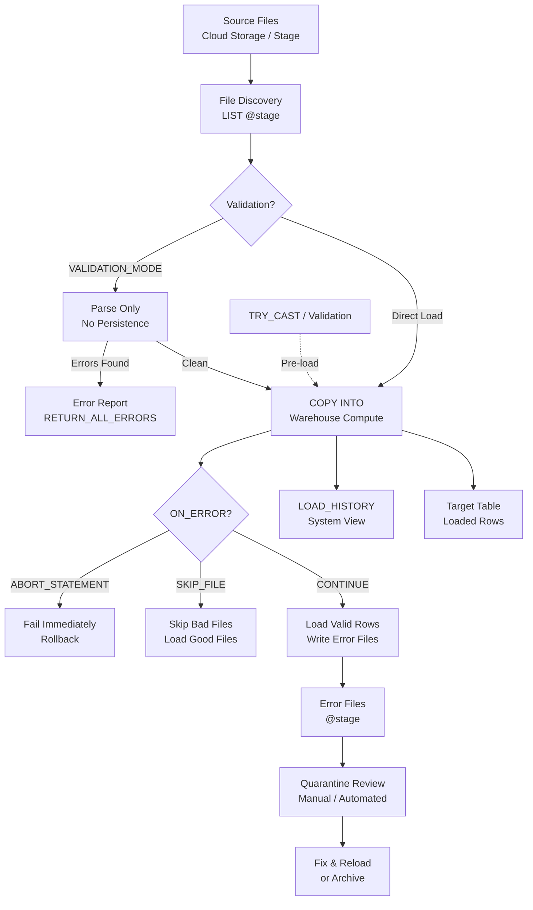

# 1. Identify and Resolve Data Import Errors in Snowflake

# 2. Overview

Data import errors occur when `COPY INTO`, `INSERT`, or pipe operations encounter files or rows that violate parsing rules, schema constraints, type expectations, or encoding standards. Snowflake provides multiple mechanisms to detect, isolate, and diagnose these errors: `COPY INTO` error handling modes, validation previews, system history views, error files, and quarantine patterns.

Import errors fall into four categories:
- **Parse errors:** Malformed file structure, delimiter mismatches, encoding corruption, or unsupported compression
- **Type errors:** Values that fail coercion to target column types (dates, numbers, booleans)
- **Schema errors:** Column count mismatches, missing columns, or header misalignment
- **Constraint errors:** `NOT NULL` violations, enabled `UNIQUE`/`PRIMARY KEY` duplicates, or invalid check expressions

Resolving errors requires distinguishing between transient issues (corrupt single files) and systemic issues (wrong file format specification or schema drift). The intended consumers are data engineers debugging production loads, platform operators managing Snowpipe ingestion, and SnowPro Advanced exam candidates who must understand error modes, `ON_ERROR` semantics, validation options, and recovery patterns.

# 3. SQL Object Summary

| Object/Feature | Type | Purpose | Source Objects or Inputs | Output Object or Observable Behavior | Execution Mode or Invocation Method |
|---|---|---|---|---|---|
| [COPY INTO](SQL Object Summary/COPY INTO.md) | DML command | Bulk load with error handling | Stage files + target table | Loaded rows, error files, result set | Manual SQL, task, or pipe |
| [VALIDATION_MODE](SQL Object Summary/VALIDATION_MODE.md) | COPY option | Pre-validate without loading | Stage files | Error report, no persisted data | `COPY INTO` option |
| [ON_ERROR](SQL Object Summary/ON_ERROR.md) | COPY option | Error behavior control | `ABORT_STATEMENT`, `SKIP_FILE`, `CONTINUE`, `SKIP_FILE_<n>` | Load continuation or abort | `COPY INTO` clause |
| [LOAD_HISTORY](SQL Object Summary/LOAD_HISTORY.md) | System view | File-level load outcomes | COPY execution | Row counts, errors, first error details | Query-time |
| [COPY_HISTORY](SQL Object Summary/COPY_HISTORY.md) | Account view | Long-term load audit | COPY and pipe operations | File status, rows loaded, errors | Query-time, 45-min latency |
| [PIPE_USAGE_HISTORY](SQL Object Summary/PIPE_USAGE_HISTORY.md) | Account view | Snowpipe load telemetry | Pipe serverless compute | Files processed, error counts, credits | Query-time, 45-min latency |
| [FILE_FORMAT](SQL Object Summary/FILE_FORMAT.md) | Schema object | Parsing configuration | Format parameters | Reusable parsing rules | `CREATE FILE FORMAT` |
| [Error File](SQL Object Summary/Error File.md) | Stage file | Rejected row isolation | COPY `ON_ERROR` | CSV/JSON of bad rows with context | Automatic on `CONTINUE` or `SKIP_FILE` |
| [Quarantine Table](SQL Object Summary/Quarantine Table.md) | User table | Structured bad-row storage | ETL validation logic | Rejected rows with error metadata | DML within procedure |
| [TRY_CAST / TRY_TO_DATE](SQL Object Summary/TRY_CAST  TRY_TO_DATE.md) | Functions | Safe type conversion | Source string values | Converted value or NULL | Per-row in query |
| [INFORMATION_SCHEMA.FILES](SQL Object Summary/INFORMATION_SCHEMA.FILES.md) | System view | Stage file enumeration | Stage contents | File names, sizes, checksums | Query-time |

# 4. Architecture

Error handling in Snowflake ingestion operates across three layers: the parse layer (file format and type coercion), the load execution layer (`COPY INTO` with error modes), and the observability layer (history views and error files). Errors can be caught before load via `VALIDATION_MODE`, during load via `ON_ERROR` controls, or after load via reconciliation queries.

# 5. Data Flow / Process Flow

## Step 1: File Inspection
- **Input:** Files in stage
- **Transformation:** `LIST @stage` enumerates files; `SELECT $1, $2 FROM @stage` previews raw content
- **Output:** File metadata and sample rows
- **Purpose:** Verify file presence, size, and structure before load

## Step 2: Pre-Load Validation
- **Input:** Files and proposed `FILE_FORMAT`
- **Transformation:** `COPY INTO ... VALIDATION_MODE = 'RETURN_ALL_ERRORS'` parses files without persisting rows
- **Output:** Error report listing all parse errors per file
- **Purpose:** Catch systemic format issues before committing data

## Step 3: Load Execution
- **Input:** Validated or unvalidated files, target table, error mode
- **Transformation:** `COPY INTO` parses, coerces types, validates constraints, and inserts rows
- **Output:** Loaded rows, rejected rows, error files, load history record
- **Purpose:** Persist valid data

## Step 4: Error Detection
- **Input:** Load result set, `LOAD_HISTORY`, error files
- **Transformation:** Query history for error counts; inspect error files for rejected row samples
- **Output:** Classified errors (parse, type, schema, constraint)
- **Purpose:** Identify root cause

## Step 5: Diagnosis
- **Input:** Error messages, file samples, target schema
- **Transformation:** Correlate `FIRST_ERROR_MESSAGE` with file content; compare source structure to `FILE_FORMAT` and table DDL
- **Output:** Identified root cause (delimiter mismatch, encoding issue, schema drift, etc.)
- **Purpose:** Determine fix strategy

## Step 6: Resolution
- **Input:** Classified error
- **Transformation:** Fix file format, source file, staging table pattern, or target schema; reload affected files
- **Output:** Clean data in target table
- **Purpose:** Complete ingestion with full data quality

# 6. Logical Breakdown

## Component: File Inspector
- **Responsibility:** Verify file presence and preview content
- **Inputs:** Stage path
- **Outputs:** File list, sample rows
- **Dependencies:** `READ` privilege on stage
- **Failure Modes:** Stage access denied; files encrypted with wrong keys; preview shows garbled text indicating encoding issues

## Component: Validation Engine
- **Responsibility:** Parse files without loading to preview errors
- **Inputs:** Stage files, `FILE_FORMAT`, `VALIDATION_MODE`
- **Outputs:** Error report or clean confirmation
- **Dependencies:** Warehouse compute
- **Failure Modes:** Validation consumes credits without loading; large files may timeout during validation

## Component: COPY INTO Parser
- **Responsibility:** Convert files to typed rows
- **Inputs:** File bytes, format spec
- **Outputs:** Parsed rows or parse errors
- **Dependencies:** Correct format configuration
- **Failure Modes:** Delimiter mismatch, header misalignment, compression errors, encoding failures

## Component: Type Coercer
- **Responsibility:** Cast parsed strings to target column types
- **Inputs:** String values, target column types
- **Outputs:** Typed values or coercion errors
- **Dependencies:** `FILE_FORMAT` date/time formats; `ERROR_ON_NONDETERMINISTIC_MERGE` settings
- **Failure Modes:** Date format mismatch, numeric overflow, invalid boolean strings, timezone ambiguity

## Component: Constraint Validator
- **Responsibility:** Enforce table constraints on loaded rows
- **Inputs:** Coerced rows, table constraints
- **Outputs:** Valid rows or constraint violation errors
- **Dependencies:** Constraints defined on table
- **Failure Modes:** `NOT NULL` violations abort load; enabled `UNIQUE` violations abort; informational constraints ignored

## Component: Error File Writer
- **Responsibility:** Persist rejected rows for analysis
- **Inputs:** Bad rows, error context
- **Outputs:** Error files in stage
- **Dependencies:** Stage must be writable; `ON_ERROR` must be `CONTINUE` or `SKIP_FILE`
- **Failure Modes:** Error files omitted if `ABORT_STATEMENT`; error files may grow large for systemic issues

## Component: History Tracker
- **Responsibility:** Record load outcomes
- **Inputs:** Load execution metadata
- **Outputs:** `LOAD_HISTORY` and `COPY_HISTORY` rows
- **Dependencies:** Load must execute
- **Failure Modes:** Aborted loads may not record; history retention limits apply

## Component: Quarantine Manager
- **Responsibility:** Structured storage of bad rows
- **Inputs:** Rejected rows from procedures or manual inspection
- **Outputs:** Quarantine table entries
- **Dependencies:** User-defined table and loading logic
- **Failure Modes:** Quarantine table grows unbounded without retention policy

# 7. Data Model

## INFORMATION_SCHEMA.LOAD_HISTORY

| Column | Role | Grain | Notes |
|---|---|---|---|
| [`TABLE_NAME`](INFORMATION_SCHEMA.LOAD_HISTORY/TABLE_NAME.md) | Target | One per file per load | |
| [`SCHEMA_NAME`](INFORMATION_SCHEMA.LOAD_HISTORY/SCHEMA_NAME.md) | Context | One per file per load | |
| [`FILE_NAME`](INFORMATION_SCHEMA.LOAD_HISTORY/FILE_NAME.md) | Source | One per file per load | Full stage path |
| [`STAGE_LOCATION`](INFORMATION_SCHEMA.LOAD_HISTORY/STAGE_LOCATION.md) | Source context | One per file per load | |
| [`LAST_LOAD_TIME`](INFORMATION_SCHEMA.LOAD_HISTORY/LAST_LOAD_TIME.md) | Timing | One per file per load | |
| [`ROW_COUNT`](INFORMATION_SCHEMA.LOAD_HISTORY/ROW_COUNT.md) | Loaded | One per file per load | Successfully committed |
| [`ROW_PARSED`](INFORMATION_SCHEMA.LOAD_HISTORY/ROW_PARSED.md) | Parsed | One per file per load | Total rows parsed |
| [`ERROR_COUNT`](INFORMATION_SCHEMA.LOAD_HISTORY/ERROR_COUNT.md) | Rejected | One per file per load | Rows with errors |
| [`FIRST_ERROR_MESSAGE`](INFORMATION_SCHEMA.LOAD_HISTORY/FIRST_ERROR_MESSAGE.md) | Debug | One per file per load | First error encountered |
| [`FIRST_ERROR_LINE_NUMBER`](INFORMATION_SCHEMA.LOAD_HISTORY/FIRST_ERROR_LINE_NUMBER.md) | Debug | One per file per load | |
| [`FIRST_ERROR_CHARACTER_POS`](INFORMATION_SCHEMA.LOAD_HISTORY/FIRST_ERROR_CHARACTER_POS.md) | Debug | One per file per load | |
| [`FIRST_ERROR_COLUMN_NAME`](INFORMATION_SCHEMA.LOAD_HISTORY/FIRST_ERROR_COLUMN_NAME.md) | Debug | One per file per load | Target column |

## Grain
One row per file per load operation.

## Error File Structure (Auto-Generated)

| Field | Role | Notes |
|---|---|---|
| [Rejected row data](Error File Structure (Auto-Generated)/Rejected row data.md) | Raw content | Original row as parsed |
| [Error code](Error File Structure (Auto-Generated)/Error code.md) | Classification | Snowflake error code |
| [Error message](Error File Structure (Auto-Generated)/Error message.md) | Detail | Human-readable reason |
| [File name](Error File Structure (Auto-Generated)/File name.md) | Source | Originating file |
| [Line number](Error File Structure (Auto-Generated)/Line number.md) | Position | Row position in source |

## Quarantine Table (Recommended Pattern)

| Column | Role | Grain | Notes |
|---|---|---|---|
| [`QUARANTINE_ID`](Quarantine Table (Recommended Pattern)/QUARANTINE_ID.md) | Surrogate key | One per row | |
| [`SOURCE_FILE`](Quarantine Table (Recommended Pattern)/SOURCE_FILE.md) | Provenance | One per row | |
| [`REJECTED_ROW`](Quarantine Table (Recommended Pattern)/REJECTED_ROW.md) | Raw data | One per row | VARIANT or VARCHAR |
| [`ERROR_CODE`](Quarantine Table (Recommended Pattern)/ERROR_CODE.md) | Classification | One per row | |
| [`ERROR_MESSAGE`](Quarantine Table (Recommended Pattern)/ERROR_MESSAGE.md) | Detail | One per row | |
| [`TARGET_TABLE`](Quarantine Table (Recommended Pattern)/TARGET_TABLE.md) | Context | One per row | |
| [`LOAD_TIMESTAMP`](Quarantine Table (Recommended Pattern)/LOAD_TIMESTAMP.md) | Audit | One per row | |
| [`RESOLUTION_STATUS`](Quarantine Table (Recommended Pattern)/RESOLUTION_STATUS.md) | Tracking | One per row | `OPEN`, `FIXED`, `DISCARDED` |

## Grain
One row per rejected record.

# 8. Business Logic

## Error Classification Rules
- **Parse errors:** File cannot be read as specified format (corrupt JSON, wrong delimiter, bad compression, encoding mismatch)
- **Type errors:** Value cannot coerce to target type (invalid date string, non-numeric in NUMBER column, boolean parse failure)
- **Schema errors:** Column count mismatch, missing required columns, header row treated as data
- **Constraint errors:** `NOT NULL` violation, enabled `UNIQUE`/`PRIMARY KEY` duplicate
- **System errors:** Stage access failure, credential expiration, warehouse timeout, out-of-memory

## ON_ERROR Behavior Rules
- `ABORT_STATEMENT` (default): First error in any file stops entire load; no rows committed
- `SKIP_FILE`: Files containing errors are skipped entirely; error-free files load
- `SKIP_FILE_<num>`: Skip file if error count exceeds threshold; load files with fewer errors
- `CONTINUE`: Load valid rows row-by-row; write bad rows to error files; most granular but slowest

## VALIDATION_MODE Rules
- `RETURN_N_ROWS`: Parse and return first N rows without loading; useful for structure preview
- `RETURN_ALL_ERRORS`: Parse all files and return all errors without loading; useful for systemic issue detection
- No data persisted; warehouse credits still consumed for parsing

## Error File Generation Rules
- Generated only for `ON_ERROR = 'CONTINUE'` or `SKIP_FILE`/`SKIP_FILE_<num>`
- Written to the stage in a subdirectory or alongside source files
- Format matches source file format (CSV errors in CSV, JSON errors in JSON)
- Error files contain the rejected row plus error code and message

## Load Deduplication and Reprocessing
- Snowflake tracks loaded files for 64 days; reprocessing same file path is skipped unless `FORCE = TRUE`
- Error files must be renamed or moved to be reprocessed as new files
- For corrected data, generate new file names or use `FORCE = TRUE` with caution

## Type Coercion Rules
- `VARCHAR` to `NUMBER`: Requires valid numeric string; fails on currency symbols or commas unless format handles them
- `VARCHAR` to `DATE`/`TIMESTAMP`: Requires matching `DATE_FORMAT`/`TIMESTAMP_FORMAT`; `AUTO` detects common formats but not all
- `VARCHAR` to `BOOLEAN`: Accepts `TRUE`, `FALSE`, `1`, `0`, `YES`, `NO` case-insensitively; other values fail
- `VARIANT` to structured type: Requires explicit casting in SQL after load

## Constraint Check Timing
- `NOT NULL` checked after type coercion; nulls from failed casts trigger constraint violations
- `UNIQUE`/`PRIMARY KEY` checked only if `ENABLE`d; default is disabled
- `FOREIGN KEY` and `CHECK` never checked during load

# 9. Transformations

## Raw File to Parsed Row
- **Source:** File bytes in stage
- **Output:** Structured row set or parse error
- **Logic:** Format parser applies delimiter, encoding, compression, header skip
- **Meaning:** Raw data converted to typed columns
- **Impact:** Foundation for load; parse errors caught here

## Parsed String to Typed Value
- **Source:** String field from parser
- **Output:** Typed column value or coercion error
- **Logic:** Cast using target column type and format parameters
- **Meaning:** Semantic alignment to table schema
- **Impact:** Type errors surface as load failures or nulls

## Valid Row to Table Row
- **Source:** Coerced row
- **Output:** Committed row in target table
- **Logic:** Constraint validation, metadata injection, micro-partition write
- **Meaning:** Data persisted
- **Impact:** Target table reflects source state

## Bad Row to Error File
- **Source:** Row failing parse, coercion, or constraint
- **Output:** Error file entry in stage
- **Logic:** `ON_ERROR` setting determines if row is written to error file
- **Meaning:** Isolation of invalid data
- **Impact:** Valid rows load; bad rows preserved for debugging

## Error Context to Quarantine Record
- **Source:** Error file or load history
- **Output:** Structured row in quarantine table
- **Logic:** ETL procedure extracts error details and raw row
- **Meaning:** Operational tracking of data quality issues
- **Impact:** Enables trending, root cause analysis, and reprocessing workflows

# 10. Parameters / Variables / Configuration

| Name | Type | Purpose | Allowed Values | Default | Where Used | Effect |
|---|---|---|---|---|---|---|
| [`ON_ERROR`](Parameters  Variables  Configuration/ON_ERROR.md) | COPY option | Error handling | `ABORT_STATEMENT`, `SKIP_FILE`, `SKIP_FILE_<n>`, `CONTINUE` | `ABORT_STATEMENT` | `COPY INTO` | Determines load behavior on errors |
| [`VALIDATION_MODE`](Parameters  Variables  Configuration/VALIDATION_MODE.md) | COPY option | Pre-validation | `RETURN_N_ROWS`, `RETURN_ALL_ERRORS` | None | `COPY INTO` | No data persistence |
| [`FORCE`](Parameters  Variables  Configuration/FORCE.md) | COPY option | Override dedup | `TRUE`, `FALSE` | `FALSE` | `COPY INTO` | Reloads already-loaded files |
| [`PURGE`](Parameters  Variables  Configuration/PURGE.md) | COPY option | Delete after load | `TRUE`, `FALSE` | `FALSE` | `COPY INTO` | Removes source files |
| [`FILE_FORMAT`](Parameters  Variables  Configuration/FILE_FORMAT.md) | Format spec | Parsing rules | Named or inline | Required | `COPY INTO` | Defines file parsing |
| [`SKIP_HEADER`](Parameters  Variables  Configuration/SKIP_HEADER.md) | File format | Header rows | Integer >= 0 | `0` | `FILE FORMAT` | Rows ignored at start |
| [`FIELD_DELIMITER`](Parameters  Variables  Configuration/FIELD_DELIMITER.md) | File format | CSV separator | Character | `,` | `FILE FORMAT` | Field separator |
| [`ERROR_ON_COLUMN_COUNT_MISMATCH`](Parameters  Variables  Configuration/ERROR_ON_COLUMN_COUNT_MISMATCH.md) | File format | Strict columns | `TRUE`, `FALSE` | `TRUE` | `FILE FORMAT` | Rejects rows with wrong column count |
| [`NULL_IF`](Parameters  Variables  Configuration/NULL_IF.md) | File format | Null values | List of strings | `['\\N', 'NULL']` | `FILE FORMAT` | Strings interpreted as NULL |
| [`DATE_FORMAT`](Parameters  Variables  Configuration/DATE_FORMAT.md) | File format | Date parsing | Format string | `AUTO` | `FILE FORMAT` | Date interpretation |
| [`TIMESTAMP_FORMAT`](Parameters  Variables  Configuration/TIMESTAMP_FORMAT.md) | File format | Timestamp parsing | Format string | `AUTO` | `FILE FORMAT` | Timestamp interpretation |
| [`ENCODING`](Parameters  Variables  Configuration/ENCODING.md) | File format | Character set | `UTF8`, etc. | `UTF8` | `FILE FORMAT` | Character encoding |
| [`REPLACE_INVALID_CHARACTERS`](Parameters  Variables  Configuration/REPLACE_INVALID_CHARACTERS.md) | File format | Encoding fix | `TRUE`, `FALSE` | `FALSE` | `FILE FORMAT` | Replaces bad bytes |
| [`COMPRESSION`](Parameters  Variables  Configuration/COMPRESSION.md) | File format | Compression | `AUTO`, `GZIP`, etc. | `AUTO` | `FILE FORMAT` | Decompression method |
| [`ERROR_ON_NONDETERMINISTIC_MERGE`](Parameters  Variables  Configuration/ERROR_ON_NONDETERMINISTIC_MERGE.md) | Session parameter | Merge safety | `TRUE`, `FALSE` | `FALSE` | Session | Error on ambiguous MERGE |

# 11. APIs / Interfaces

## Interface: COPY INTO with VALIDATION_MODE
- **Invocation:** `COPY INTO target FROM @stage FILE_FORMAT = (...) VALIDATION_MODE = 'RETURN_ALL_ERRORS'`
- **Input:** Stage files, format spec
- **Output:** Error report without loaded data
- **Error Behavior:** Returns all parse errors found
- **Consumers:** Pre-load quality checks, development validation

## Interface: INFORMATION_SCHEMA.LOAD_HISTORY
- **Invocation:** `SELECT * FROM INFORMATION_SCHEMA.LOAD_HISTORY WHERE TABLE_NAME = '...'`
- **Input:** Table name filter
- **Output:** File-level load outcomes with error details
- **Error Behavior:** Empty set if no loads
- **Consumers:** Load monitoring, error triage

## Interface: COPY_HISTORY
- **Invocation:** `SELECT * FROM SNOWFLAKE.ACCOUNT_USAGE.COPY_HISTORY WHERE TABLE_NAME = '...'`
- **Input:** Table name, date range
- **Output:** Long-term load audit
- **Error Behavior:** 45-minute latency
- **Consumers:** Compliance, trend analysis

## Interface: LIST @stage
- **Invocation:** `LIST @stage/path`
- **Input:** Stage path
- **Output:** File names, sizes, checksums
- **Error Behavior:** Fails on stage access denied
- **Consumers:** File inventory, pre-load verification

## Interface: SELECT $1, $2 FROM @stage
- **Invocation:** `SELECT $1, $2 FROM @stage/file.csv LIMIT 10`
- **Input:** Stage file
- **Output:** Raw parsed rows
- **Error Behavior:** Parse errors visible directly
- **Consumers:** File preview, format debugging

## Interface: PIPE_USAGE_HISTORY
- **Invocation:** `SELECT * FROM SNOWFLAKE.ACCOUNT_USAGE.PIPE_USAGE_HISTORY`
- **Input:** Pipe name, date range
- **Output:** Snowpipe load metrics and errors
- **Error Behavior:** 45-minute latency
- **Consumers:** Continuous ingestion monitoring

# 12. Execution / Deployment

## Pre-Load Validation Workflow
- Run `VALIDATION_MODE = 'RETURN_ALL_ERRORS'` before production load
- Inspect error report for systemic issues (wrong delimiter, encoding, date format)
- Fix `FILE_FORMAT` or source files before executing actual load

## Staging Table Pattern
- Load raw data into staging table with `VARIANT` or all `VARCHAR` columns
- Use `TRY_CAST` and validation queries to identify bad rows
- Insert cleansed rows into production table
- Bad rows written to quarantine table for review

## Error File Inspection
- After `ON_ERROR = 'CONTINUE'`, query `LIST @stage` for error files
- Download or `SELECT` from error files to inspect rejected rows
- Correlate error messages with source file content

## Quarantine Table Deployment
- Create quarantine table with `VARIANT` column for raw rejected rows
- Implement task or procedure that reads error files and writes to quarantine
- Add retention policy or scheduled purge to prevent unbounded growth

## Pipe Error Handling
- For Snowpipe, monitor `PIPE_USAGE_HISTORY` for failed loads
- Failed files remain in queue; fix file format or source data
- Use `ALTER PIPE ... REFRESH` to retry after fixes

## Environment Behavior
- Development: Frequent `VALIDATION_MODE`, small test files, verbose error inspection
- Production: `ON_ERROR = 'CONTINUE'` with quarantine, error integration alerts, error file cleanup policies

# 13. Observability

## Load Error Rate Monitoring
- Calculate `ERROR_COUNT / ROW_PARSED` from `LOAD_HISTORY`
- Alert when error rate exceeds threshold (e.g., 1% for production)
- Trend error rates by file source to identify systemic supplier issues

## Error Pattern Analysis
- Aggregate `FIRST_ERROR_MESSAGE` from `LOAD_HISTORY` by error type
- Common patterns: `Numeric value 'abc' is not recognized`, `Date '13/45/2023' is not recognized`, `NULL result in a non-nullable column`
- Correlate patterns with source system changes

## File-Level Tracking
- Compare `LIST @stage` to `LOAD_HISTORY` to identify unprocessed files
- Track file age from arrival to load completion
- Monitor for files stuck in queue due to persistent errors

## Pipe Health Monitoring
- Query `PIPE_USAGE_HISTORY` for error counts and credit consumption
- Monitor notification channel health for auto-ingest pipes
- Alert on pipe stall (no loads for extended period)

## Quarantine Table Monitoring
- Track quarantine row count growth rate
- Measure time-to-resolution for quarantined records
- Categorize quarantine entries by error type and source system

## Key Metrics
- Parse error rate per file and per source system
- Type coercion failure rate by column
- Constraint violation count per load
- Average time from error detection to resolution
- Error file storage volume
- Pipe failure rate and retry success rate

# 14. Failure Handling & Recovery

## Delimiter Mismatch
- **What breaks:** `FIELD_DELIMITER` does not match actual file delimiter; columns misaligned
- **Detection:** `ERROR_ON_COLUMN_COUNT_MISMATCH` rejects rows; preview shows misaligned data
- **Fallback:** Load with `ERROR_ON_COLUMN_COUNT_MISMATCH = FALSE` as temporary workaround
- **Recovery:** Correct `FIELD_DELIMITER`; verify with `SELECT $1, $2 FROM @stage`; reload

## Encoding Corruption
- **What breaks:** Non-UTF8 characters cause parse failures or garbled text
- **Detection:** Invalid byte sequence errors; replacement characters in preview
- **Fallback:** Set `ENCODING` to match source; enable `REPLACE_INVALID_CHARACTERS`
- **Recovery:** Re-encode source files to UTF-8; or configure format to handle source encoding

## Date/Time Format Mismatch
- **What breaks:** Date strings do not match `DATE_FORMAT` or `TIMESTAMP_FORMAT`
- **Detection:** `Date 'xyz' is not recognized` errors; nulls in date columns
- **Fallback:** Load as `VARCHAR` and parse with `TRY_TO_DATE` in staging table
- **Recovery:** Identify correct format from source; update `FILE_FORMAT`; reload

## Header Row Treated as Data
- **What breaks:** First data row contains column names; `SKIP_HEADER` not set
- **Detection:** String values in numeric columns; unexpected row in target
- **Fallback:** Delete header row from target; set `SKIP_HEADER = 1`
- **Recovery:** Set `SKIP_HEADER` in file format; truncate target; reload

## Column Count Mismatch
- **What breaks:** File has more or fewer columns than target table
- **Detection:** `ERROR_ON_COLUMN_COUNT_MISMATCH` rejects rows
- **Fallback:** Load to staging table with `VARIANT` column; parse dynamically
- **Recovery:** Fix source file schema; adjust target table; or use explicit column mapping in `COPY INTO`

## NOT NULL Violation
- **What breaks:** Source contains nulls or empty strings in `NOT NULL` columns
- **Detection:** `NULL result in a non-nullable column` error
- **Fallback:** Load to staging table; apply `COALESCE` or default values; insert to target
- **Recovery:** Fix source data; or add `DEFAULT` to target column; or make column nullable temporarily

## Duplicate Key Violation
- **What breaks:** Enabled `UNIQUE` or `PRIMARY KEY` constraint encounters duplicate
- **Detection:** Constraint violation error; load aborts if `ABORT_STATEMENT`
- **Fallback:** Disable constraint; deduplicate source; or use `MERGE` instead of `COPY INTO`
- **Recovery:** Remove duplicates with `QUALIFY ROW_NUMBER()`; enable constraint; reload

## Compression Errors
- **What breaks:** File labeled as GZIP but is uncompressed or corrupted
- **Detection:** Decompression errors in `LOAD_HISTORY`
- **Fallback:** Set `COMPRESSION = 'NONE'` or `AUTO`
- **Recovery:** Verify file compression with `file` command; recompress if corrupted; adjust format

## Schema Drift
- **What breaks:** Source system adds columns, renames columns, or changes types
- **Detection:** Column count mismatch; type coercion failures; new headers
- **Fallback:** Load to `VARIANT` staging table to absorb schema changes
- **Recovery:** Update ETL logic; alter target table; remap columns in `COPY INTO`

## Pipe Queue Stall
- **What breaks:** Snowpipe encounters persistent errors; queue backs up
- **Detection:** `PIPE_USAGE_HISTORY` shows failed loads; no recent successes
- **Fallback:** Pause pipe with `ALTER PIPE ... SET PIPE_EXECUTION_PAUSED = TRUE`
- **Recovery:** Fix file format or source data; resume pipe; clear queue with `ALTER PIPE ... REFRESH`

## Error File Accumulation
- **What breaks:** `CONTINUE` mode generates large error files consuming storage
- **Detection:** Stage storage growth; `LIST @stage` shows many error files
- **Fallback:** Implement error file retention and purge policy
- **Recovery:** Archive or delete old error files; fix root cause to reduce generation

# 15. Security & Access Control

## Privilege Requirements

| Action | Required Privilege | Object |
|---|---|---|
| [Execute COPY INTO](Privilege Requirements/Execute COPY INTO.md) | `INSERT` on table, `USAGE` on stage | Table/Stage |
| [Read error files](Privilege Requirements/Read error files.md) | `READ` on stage | Stage |
| [Write quarantine table](Privilege Requirements/Write quarantine table.md) | `INSERT` on quarantine table | Table |
| [Query LOAD_HISTORY](Privilege Requirements/Query LOAD_HISTORY.md) | `MONITOR` or `SELECT` | Table/Account |
| [Query COPY_HISTORY](Privilege Requirements/Query COPY_HISTORY.md) | `ACCOUNTADMIN` or `MONITOR` | Account |
| [Manage pipes](Privilege Requirements/Manage pipes.md) | `OWNERSHIP` or `OPERATE` | Pipe |

## Error File Data Exposure
- Error files contain rejected rows which may include sensitive or PII data
- Restrict stage access to prevent unauthorized error file inspection
- Implement error file encryption and lifecycle policies

## Quarantine Table Security
- Quarantine tables may contain raw rejected data that bypassed masking
- Apply masking policies to quarantine tables if they contain sensitive columns
- Restrict `SELECT` on quarantine to data quality and security teams

## Validation Mode Safety
- `VALIDATION_MODE` does not load data but still reads source files
- Ensure validation queries do not expose sensitive data in query results
- Use `RETURN_N_ROWS` with small N for previews

# 16. Performance / Scalability Considerations

## VALIDATION_MODE Cost
- Parses entire file set without loading; consumes warehouse credits proportional to file size
- Use `RETURN_N_ROWS` for quick checks; reserve `RETURN_ALL_ERRORS` for small batches or critical validation
- Do not run validation on massive file sets repeatedly

## ON_ERROR = CONTINUE Overhead
- Row-by-row error checking is slower than `ABORT_STATEMENT` or `SKIP_FILE`
- Error file generation adds I/O overhead
- Use `CONTINUE` only when data quality is variable and partial loads are acceptable

## Error File Storage
- Error files consume stage storage and may incur cloud storage costs
- Implement automated cleanup of error files older than retention period
- Monitor stage storage metrics

## Large File Error Handling
- Single large file with errors near the beginning wastes parse effort if `ABORT_STATEMENT`
- Split large files into smaller chunks to minimize reprocessing on failure
- `SKIP_FILE` is more efficient than `CONTINUE` for files with many errors

## Pipe Retry Behavior
- Snowpipe does not automatically retry failed files indefinitely
- Persistent errors require manual intervention
- Monitor pipe backlog to prevent queue depth issues

## History View Query Performance
- `COPY_HISTORY` and `PIPE_USAGE_HISTORY` scan large historical data
- Filter by date range and table/pipe name
- Materialize filtered extracts for dashboards

## Staging Table Pattern Cost
- Loading to `VARIANT` staging then transforming adds an extra step
- However, it isolates parse errors and enables complex cleansing
- Tradeoff: slightly higher total cost vs. significantly higher reliability

# 17. Assumptions & Constraints

## Explicit Assumptions
- The reader is debugging production data loads using `COPY INTO` or Snowpipe
- Source files are in supported formats but may have quality issues
- Error handling and recovery procedures are required for operational reliability

## Engine Boundaries
- Snowflake does not provide a native dead-letter queue; error files and quarantine tables must be implemented manually
- `VALIDATION_MODE` does not persist data but still consumes compute credits
- Error files are generated only for certain `ON_ERROR` modes
- Load deduplication tracks files for 64 days; beyond this, reprocessing requires `FORCE = TRUE`
- `COPY_HISTORY` has 45-minute latency; real-time error detection requires `LOAD_HISTORY` or direct `COPY INTO` result inspection
- Pipe errors do not trigger task error integrations directly; pipe monitoring requires separate polling

## Exam-Relevant Defaults
- `ON_ERROR` default: `ABORT_STATEMENT`
- `ERROR_ON_COLUMN_COUNT_MISMATCH` default: `TRUE`
- `VALIDATION_MODE` default: None (no validation)
- `FORCE` default: `FALSE`
- `COMPRESSION` default: `AUTO`
- `ENCODING` default: `UTF8`
- `SKIP_HEADER` default: `0`
- Load tracking window: 64 days

## Ambiguities
- Exact error file naming convention and path structure are not fully documented and may vary
- The granularity of error reporting in `RETURN_ALL_ERRORS` may truncate after a large number of errors
- Behavior of `AUTO` date format detection for edge cases is not deterministic across all locales

# 18. Future Enhancements

- Implement mandatory `VALIDATION_MODE = 'RETURN_ALL_ERRORS'` gates in CI/CD pipelines before deploying new file formats to production
- Create reusable error classification procedures that parse `LOAD_HISTORY` and `COPY_HISTORY` to categorize errors by type and auto-route alerts
- Deploy staging table patterns with `VARIANT` columns for all external source loads to isolate parse errors from production tables
- Build automated quarantine pipelines that read error files and write structured records with retention policies and reprocessing workflows
- Standardize `FILE_FORMAT` templates per source system with locked parameters to prevent ad-hoc format changes causing schema drift
- Add pre-load file inspection tasks that check file size, row count, and header signatures before executing `COPY INTO`
- Implement error file lifecycle automation that archives or deletes error files after a defined retention period
- Use `TRY_CAST` and `TRY_TO_DATE` in all staging-to-production transformations to prevent single bad rows from failing entire batches
- Replace `ON_ERROR = 'ABORT_STATEMENT'` in production with `ON_ERROR = 'CONTINUE'` plus quarantine review for sources with known quality variability
- Create pipe health dashboards joining `PIPE_USAGE_HISTORY`, `COPY_HISTORY`, and stage file listings to detect stalled queues and persistent error patterns
