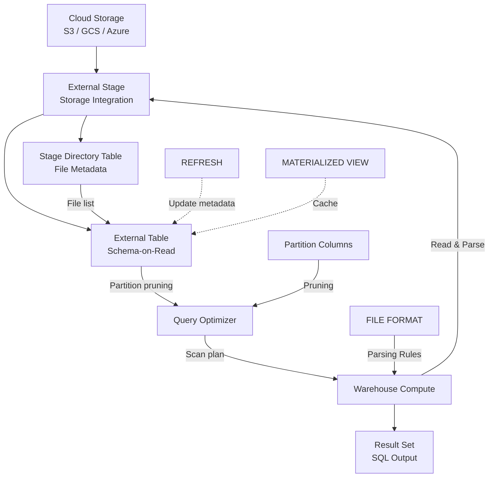

# 1. Prepare External Tables in Snowflake

# 2. Overview

External tables in Snowflake provide a schema-on-read interface over files stored in cloud object storage (S3, GCS, Azure Blob) without loading data into Snowflake-managed storage. They enable querying raw files using standard SQL, joining external data with native tables, and building ELT pipelines that stage data before loading. External tables are defined with column schemas mapped to file contents via file formats, and they support partitioning for query pruning.

This feature exists to:
- Query data lakes and raw file repositories without ingestion cost or storage duplication
- Enable schema-on-read exploration before committing to a load strategy
- Support federated queries across cloud storage and Snowflake tables
- Provide a staging layer for incremental ELT pipelines

The intended consumers are data engineers designing lakehouse architectures, analysts exploring raw data, and SnowPro Advanced exam candidates who must understand external table limitations, refresh semantics, partitioning, and performance boundaries.

# 3. SQL Object Summary

| Object/Feature | Type | Purpose | Source Objects or Inputs | Output Object or Observable Behavior | Execution Mode or Invocation Method |
|---|---|---|---|---|---|
| [External Table](SQL Object Summary/External Table.md) | Schema object | Schema-on-read over cloud files | Cloud storage files + file format | Queryable tabular interface | DDL creation; queried like standard table |
| [External Stage](SQL Object Summary/External Stage.md) | Stage object | Cloud storage reference | S3/GCS/Azure URI + credentials | Accessible file paths via `@stage` | `CREATE STAGE` with storage integration |
| [FILE FORMAT](SQL Object Summary/FILE FORMAT.md) | Schema object | Parsing rules for external files | Format type + parameters | Reusable parsing configuration | `CREATE FILE FORMAT` |
| [Partition Column](SQL Object Summary/Partition Column.md) | External table column | Pruning metadata for file organization | File path structure or metadata | Filtered file scans | Defined in external table DDL |
| [REFRESH](SQL Object Summary/REFRESH.md) | Maintenance operation | Update external table metadata | New/deleted files in stage | Updated partition metadata and file registry | `ALTER EXTERNAL TABLE ... REFRESH` |
| [MATERIALIZED VIEW](SQL Object Summary/MATERIALIZED VIEW.md) | Schema object | Cached query over external table | External table query | Pre-computed results in native storage | `CREATE MATERIALIZED VIEW` |
| [Stage Directory Table](SQL Object Summary/Stage Directory Table.md) | Stage feature | File metadata listing | Files in stage | File names, sizes, last modified, ETags | Automatic for stages with directory tables enabled |

# 4. Architecture

External tables decouple storage (cloud object storage) from compute (Snowflake warehouse) via an external stage and metadata layer. The external table catalog maintains a registry of files and partitions. Queries against external tables read files on-demand from cloud storage, parse them according to the file format, and return rows. Partition columns enable pruning to limit file scans.

# 5. Data Flow / Process Flow

## Step 1: Stage Configuration
- **Input:** Cloud storage URI, IAM role or storage integration, file format
- **Transformation:** `CREATE STAGE` establishes authenticated access to cloud storage
- **Output:** External stage object
- **Purpose:** Provide Snowflake with secure access to source files

## Step 2: External Table Definition
- **Input:** Stage reference, column schema, file format, optional partition columns
- **Transformation:** `CREATE EXTERNAL TABLE` registers column mappings and file location patterns
- **Output:** External table catalog entry
- **Purpose:** Define the schema-on-read interface

## Step 3: Metadata Refresh
- **Input:** File changes in cloud storage (new files, deletions)
- **Transformation:** `ALTER EXTERNAL TABLE ... REFRESH` scans stage and updates file registry and partition metadata
- **Output:** Updated external table metadata
- **Purpose:** Synchronize catalog with actual storage state

## Step 4: Query Planning
- **Input:** SQL query against external table
- **Transformation:** Optimizer evaluates partition columns in `WHERE` clause to prune file list; generates scan plan
- **Output:** Execution plan targeting specific files
- **Purpose:** Minimize data scanned

## Step 5: File Scan and Parse
- **Input:** Selected files from cloud storage
- **Transformation:** Warehouse nodes read files, apply file format parsing, project columns
- **Output:** Row sets aligned to external table schema
- **Purpose:** Convert raw files to queryable rows

## Step 6: Result Materialization
- **Input:** Parsed rows
- **Transformation:** Query engine applies filters, joins, aggregations
- **Output:** Final result set
- **Purpose:** Deliver query results to consumer

# 6. Logical Breakdown

## Component: External Stage
- **Responsibility:** Provide authenticated, scoped access to cloud storage
- **Inputs:** Cloud URI, storage integration or credentials, optional directory table
- **Outputs:** File paths accessible via `@stage` notation
- **Dependencies:** Cloud IAM trust, network policies, valid credentials
- **Failure Modes:** Credential expiration, IAM misconfiguration, bucket policy changes, network policy blocking

## Component: External Table Catalog
- **Responsibility:** Maintain file registry and column-to-file mappings
- **Inputs:** Stage reference, column definitions, file format, partition expressions
- **Outputs:** Queryable table interface
- **Dependencies:** Stage must exist; files must conform to format
- **Failure Modes:** Stale metadata after file changes; partition column type mismatches; file format incompatible with column definitions

## Component: Partition Manager
- **Responsibility:** Enable query pruning based on file path structure
- **Inputs:** File path patterns, partition column definitions
- **Outputs:** Filtered file lists for queries with partition predicates
- **Dependencies:** Files organized in partitioned directory structure
- **Failure Modes:** Partition columns not aligned with actual paths; queries without partition predicates scan all files

## Component: Refresh Orchestrator
- **Responsibility:** Synchronize external table metadata with storage state
- **Inputs:** `ALTER EXTERNAL TABLE ... REFRESH` command or auto-refresh configuration
- **Outputs:** Updated file registry
- **Dependencies:** Stage access; files must be readable
- **Failure Modes:** Refresh fails if stage inaccessible; new files with incompatible schema break queries; refresh latency causes stale data

## Component: File Scanner
- **Responsibility:** Read and parse files during query execution
- **Inputs:** Selected files, file format specification
- **Outputs:** Row streams
- **Dependencies:** Warehouse compute; files must be accessible and parseable
- **Failure Modes:** Slow due to cloud latency; parse errors on malformed files; large files cause memory pressure

## Component: Materialized View Cache
- **Responsibility:** Cache external table query results in native storage
- **Inputs:** External table query definition
- **Outputs:** Pre-computed results
- **Dependencies:** Enterprise edition; refresh policy or manual refresh
- **Failure Modes:** Stale cache if not refreshed; not supported on all external table query patterns

## Component: Stage Directory Table
- **Responsibility:** Provide file-level metadata for inspection and lineage
- **Inputs:** Files in stage with directory table enabled
- **Outputs:** File names, sizes, modification times, ETags, checksums
- **Dependencies:** `DIRECTORY = (ENABLE = TRUE)` on stage
- **Failure Modes:** Directory table must be refreshed separately; metadata lag

# 7. Data Model

## External Table Definition (Example)

| Column | Role | Type | Mapping | Notes |
|---|---|---|---|---|
| [`COL1`](External Table Definition (Example)/COL1.md) | Data | VARCHAR | `$1::VARCHAR` | First field in file |
| [`COL2`](External Table Definition (Example)/COL2.md) | Data | NUMBER | `$2::NUMBER` | Second field |
| [`COL3`](External Table Definition (Example)/COL3.md) | Data | TIMESTAMP | `$3::TIMESTAMP` | Third field |
| [`PARTITION_DATE`](External Table Definition (Example)/PARTITION_DATE.md) | Partition | DATE | `METADATA$FILENAME` | Extracted from path |
| [`METADATA$FILENAME`](External Table Definition (Example)/METADATA$FILENAME.md) | Metadata | VARCHAR | Auto | Source file path |
| [`METADATA$FILE_ROW_NUMBER`](External Table Definition (Example)/METADATA$FILE_ROW_NUMBER.md) | Metadata | NUMBER | Auto | Row in source file |
| [`METADATA$FILE_CONTENT_KEY`](External Table Definition (Example)/METADATA$FILE_CONTENT_KEY.md) | Metadata | VARCHAR | Auto | Content identifier |

## Grain
One row per record in source files.

## Stage Directory Table

| Column | Role | Notes |
|---|---|---|
| [`RELATIVE_PATH`](Stage Directory Table/RELATIVE_PATH.md) | File path | Relative to stage root |
| [`SIZE`](Stage Directory Table/SIZE.md) | File size | Bytes |
| [`LAST_MODIFIED`](Stage Directory Table/LAST_MODIFIED.md) | Timestamp | Cloud storage modification time |
| [`ETAG`](Stage Directory Table/ETAG.md) | Version | Cloud storage ETag |
| [`MD5`](Stage Directory Table/MD5.md) | Checksum | MD5 hash if available |

## Grain
One row per file in stage.

# 8. Business Logic

## External Table Column Mapping
- Columns defined using expressions like `$1::TYPE`, `$2::TYPE` referencing positional fields
- `METADATA$FILENAME` provides source file path for audit and partitioning
- `METADATA$FILE_ROW_NUMBER` provides row position in file
- `VALUE` column of type `VARIANT` available for semi-structured files (JSON, Parquet with nested data)
- Column expressions evaluated at query time; no persistent schema validation at creation

## Partition Column Semantics
- Partition columns are virtual columns derived from file path structure or metadata
- Defined using expressions on `METADATA$FILENAME` (e.g., `TO_DATE(SUBSTRING(METADATA$FILENAME, 12, 10), 'YYYY/MM/DD')`)
- Enable partition pruning: queries with `WHERE partition_col = 'value'` scan only matching directories
- Partitions must align with actual directory structure in cloud storage

## Refresh Semantics
- `ALTER EXTERNAL TABLE ... REFRESH` scans stage and updates file registry
- Does not read file contents; only updates metadata catalog
- Must be executed after files are added, removed, or renamed in cloud storage
- Can be automated via tasks or external triggers
- Auto-refresh supported via cloud event notifications (SNS, Pub/Sub, Event Grid) with pipe-like integration

## File Format Requirements
- External tables require a file format for parsing
- Supported formats: CSV, JSON, Parquet, Avro, ORC, XML
- Format must match actual file structure; mismatches cause query-time parse errors
- `TYPE = JSON` with `STRIP_OUTER_ARRAY = TRUE` for array JSON files

## Query Performance Rules
- External table queries read files from cloud storage on-demand; latency higher than native tables
- Partition pruning is critical for performance; queries without partition predicates scan all files
- File format affects parse cost: Parquet is fastest, CSV slowest
- Small files (<100MB) recommended for parallelization; many tiny files create overhead
- Materialized views can cache results for frequently accessed external table queries

## DML Restrictions
- External tables do not support `INSERT`, `UPDATE`, or `DELETE` directly
- Data modification requires loading into native tables via `COPY INTO` or `INSERT ... SELECT`
- External tables are read-only interfaces

## Stage Directory Table Rules
- Enabled via `DIRECTORY = (ENABLE = TRUE)` in stage definition
- Provides file listing without requiring external table refresh
- Useful for file inventory, lineage, and pre-load validation
- Directory table data accessed via `DIRECTORY()` function

# 9. Transformations

## Cloud File to External Table Row
- **Source:** Raw file bytes in cloud storage
- **Output:** Typed row projected by external table column expressions
- **Logic:** File format parser extracts fields; column expressions cast and name them
- **Meaning:** Schema-on-read conversion
- **Impact:** Enables SQL querying over raw files

## File Path to Partition Value
- **Source:** `METADATA$FILENAME` string
- **Output:** Typed partition column value
- **Logic:** String manipulation extracts date, region, or category from path
- **Meaning:** Organizational metadata for pruning
- **Impact:** Reduces scan scope for filtered queries

## Storage State to Catalog Metadata
- **Source:** Files in cloud storage
- **Output:** Updated external table file registry
- **Logic:** `REFRESH` lists files, extracts partition values, updates catalog
- **Meaning:** Synchronization of logical table with physical storage
- **Impact:** Ensures queries see current file set

## External Query to Materialized Result
- **Source:** Query against external table
- **Output:** Cached results in native table storage
- **Logic:** Materialized view pre-computes and stores results
- **Meaning:** Performance optimization for repeated access
- **Impact:** Reduces cloud storage reads; enables faster analytics

## Stage Files to Directory Listing
- **Source:** Files in stage
- **Output:** Structured metadata table
- **Logic:** Directory table scans stage and records file attributes
- **Meaning:** File inventory for operational monitoring
- **Impact:** Enables file-level observability without reading contents

# 10. Parameters / Variables / Configuration

| Name | Type | Purpose | Allowed Values | Default | Where Used | Effect |
|---|---|---|---|---|---|---|
| [`FILE_FORMAT`](Parameters  Variables  Configuration/FILE_FORMAT.md) | External table property | Parsing spec | Named format or inline | Required | `CREATE EXTERNAL TABLE` | Defines file parsing |
| [`LOCATION`](Parameters  Variables  Configuration/LOCATION.md) | External table property | Stage path | `@stage/path` | Required | `CREATE EXTERNAL TABLE` | Root directory for files |
| [`PARTITION_TYPE`](Parameters  Variables  Configuration/PARTITION_TYPE.md) | External table property | Partitioning mode | `USER_SPECIFIED` | `USER_SPECIFIED` | `CREATE EXTERNAL TABLE` | Partition management mode |
| [`AUTO_REFRESH`](Parameters  Variables  Configuration/AUTO_REFRESH.md) | External table property | Metadata sync | `TRUE`, `FALSE` | `FALSE` | `CREATE/ALTER EXTERNAL TABLE` | Enables event-driven refresh |
| [`REFRESH_ON_CREATE`](Parameters  Variables  Configuration/REFRESH_ON_CREATE.md) | External table property | Initial sync | `TRUE`, `FALSE` | `TRUE` | `CREATE EXTERNAL TABLE` | Refreshes metadata on creation |
| [`PATTERN`](Parameters  Variables  Configuration/PATTERN.md) | External table property | File filter | Regex string | None | `CREATE EXTERNAL TABLE` | Limits files in table |
| [`COPY_OPTIONS`](Parameters  Variables  Configuration/COPY_OPTIONS.md) | External table property | Load options | `ON_ERROR`, etc. | None | `CREATE EXTERNAL TABLE` | Error handling for reads |
| [`DIRECTORY`](Parameters  Variables  Configuration/DIRECTORY.md) | Stage property | Enable file listing | `(ENABLE = TRUE)` | `FALSE` | `CREATE STAGE` | Activates directory table |
| [`STORAGE_INTEGRATION`](Parameters  Variables  Configuration/STORAGE_INTEGRATION.md) | Stage property | Auth method | Integration name | None | `CREATE STAGE` | Cloud credential management |

# 11. APIs / Interfaces

## Interface: CREATE EXTERNAL TABLE
- **Invocation:** `CREATE EXTERNAL TABLE ext_table (col1 TYPE, col2 TYPE, partition_col TYPE AS expression) LOCATION = @stage/path FILE_FORMAT = (TYPE = CSV) PARTITION_TYPE = USER_SPECIFIED`
- **Input:** Column definitions, stage location, format, partition spec
- **Output:** External table object
- **Error Behavior:** Fails if stage missing, format invalid, or location inaccessible
- **Consumers:** Lakehouse queries, ELT staging

## Interface: ALTER EXTERNAL TABLE ... REFRESH
- **Invocation:** `ALTER EXTERNAL TABLE ext_table REFRESH [SUBPATH = 'path']`
- **Input:** External table name, optional subpath
- **Output:** Updated file registry
- **Error Behavior:** Fails if stage inaccessible
- **Consumers:** Metadata synchronization, pipeline tasks

## Interface: SELECT FROM EXTERNAL TABLE
- **Invocation:** `SELECT * FROM ext_table WHERE partition_col = '2024-01-01'`
- **Input:** SQL query with optional partition predicates
- **Output:** Parsed rows from files
- **Error Behavior:** Parse errors on malformed files; stale metadata may miss new files
- **Consumers:** Analytics, ELT source queries

## Interface: DIRECTORY() Function
- **Invocation:** `SELECT * FROM DIRECTORY(@stage_name)`
- **Input:** Stage name
- **Output:** File metadata listing
- **Error Behavior:** Fails if directory table not enabled
- **Consumers:** File inventory, pre-load validation

## Interface: CREATE MATERIALIZED VIEW
- **Invocation:** `CREATE MATERIALIZED VIEW mv AS SELECT * FROM ext_table WHERE ...`
- **Input:** External table query
- **Output:** Cached native table
- **Error Behavior:** Fails if query pattern unsupported; requires Enterprise edition
- **Consumers:** Performance optimization, repeated analytics

## Interface: SHOW EXTERNAL TABLES
- **Invocation:** `SHOW EXTERNAL TABLES [LIKE '...'] [IN ...]`
- **Input:** Optional filter
- **Output:** External table metadata
- **Error Behavior:** Empty set if none exist
- **Consumers:** Schema browsing, inventory

# 12. Execution / Deployment

## External Stage Setup
- Create storage integration with IAM role trust for cloud storage
- Create external stage with `DIRECTORY = (ENABLE = TRUE)` for file listing
- Verify access with `LIST @stage` and `SELECT * FROM DIRECTORY(@stage)`

## External Table Creation
- Define columns with appropriate types and expressions
- Add partition columns derived from `METADATA$FILENAME` if directory structure is partitioned
- Set `REFRESH_ON_CREATE = TRUE` for initial metadata load
- Test with `SELECT LIMIT` to verify parsing

## Partition Strategy
- Organize cloud storage in hive-style partitions: `s3://bucket/data/year=2024/month=01/day=15/`
- Define partition columns using path extraction expressions
- Ensure queries filter on partition columns for pruning

## Refresh Automation
- Schedule task to `ALTER EXTERNAL TABLE ... REFRESH` at appropriate cadence
- For near-real-time, configure auto-refresh with cloud event notifications
- Monitor refresh latency as a pipeline SLA metric

## Materialized View for Performance
- Create materialized views on frequently queried external table subsets
- Refresh materialized views on schedule or via task
- Use for dashboards and BI tools requiring low latency

## ELT Pipeline Pattern
- External table as source → `INSERT INTO staging_table SELECT * FROM ext_table WHERE partition = current` → Transform → Load to production
- Refresh external table before each pipeline run

## Environment Behavior
- Development: Frequent refresh, small sample queries, format experimentation
- Production: Automated refresh, partition pruning enforced, materialized views for hot queries, error monitoring on parse failures

# 13. Observability

## Refresh Monitoring
- Track `ALTER EXTERNAL TABLE ... REFRESH` execution in `QUERY_HISTORY`
- Monitor time from file arrival in cloud storage to query visibility
- Alert on refresh failures due to stage access issues

## Query Performance
- Monitor bytes scanned per external table query in `QUERY_HISTORY`
- Compare with native table queries to justify loading decisions
- Track partition pruning effectiveness: files scanned vs. total files

## File Inventory
- Query `DIRECTORY(@stage)` regularly to track file counts and sizes
- Correlate file growth with external table query performance
- Identify orphaned files no longer referenced by queries

## Parse Error Tracking
- Monitor `QUERY_HISTORY` for external table query failures
- Categorize errors: format mismatch, type coercion, file corruption
- Track error frequency by source directory or file pattern

## Partition Pruning Verification
- Use `EXPLAIN` or query profile to verify partition elimination
- Ensure `WHERE` clauses on partition columns are sargable
- Monitor full-table scans indicating missing partition filters

## Key Metrics
- External table query duration and bytes scanned
- Refresh latency (file arrival to metadata update)
- Files scanned vs. files pruned per query
- Parse error rate per file source
- Materialized view staleness duration
- Cloud storage egress costs from external table reads

# 14. Failure Handling & Recovery

## Stale Metadata
- **What breaks:** New files in cloud storage not visible to queries
- **Detection:** Expected data missing; `DIRECTORY(@stage)` shows files not in query results
- **Fallback:** Query `DIRECTORY()` directly for file listing
- **Recovery:** Execute `ALTER EXTERNAL TABLE ... REFRESH`; verify auto-refresh configuration

## Parse Errors on Query
- **What breaks:** File content does not match external table column expressions
- **Detection:** Query fails with cast or format errors
- **Fallback:** Query with `TRY_CAST` in column expressions to return nulls on failure
- **Recovery:** Fix file format; update column expressions; or load to `VARIANT` staging table

## Partition Pruning Failure
- **What breaks:** Queries scan all files despite `WHERE` on partition column
- **Detection:** Query profile shows more files scanned than expected; high bytes scanned
- **Fallback:** Add explicit partition filters; verify partition column expression matches path structure
- **Recovery:** Redefine partition column expression; reorganize cloud storage paths

## Stage Access Failure
- **What breaks:** Credential expiration or IAM policy change blocks file access
- **Detection:** Refresh fails; queries fail with access denied
- **Fallback:** Verify with `LIST @stage`
- **Recovery:** Rotate storage integration credentials; verify IAM trust policy; test access

## File Format Mismatch
- **What breaks:** Files change format (e.g., CSV to JSON) without external table update
- **Detection:** Parse errors; unexpected column values
- **Fallback:** Create separate external table for new format
- **Recovery:** Update `FILE_FORMAT`; or create new external table; refresh metadata

## Large File Performance
- **What breaks:** Single massive file causes query timeout or memory pressure
- **Detection:** Query cancelled; long execution time
- **Fallback:** Filter with partition predicates to avoid the file if possible
- **Recovery:** Split large files into smaller chunks in cloud storage; or load to native table

## Materialized View Staleness
- **What breaks:** Cached results do not reflect new files
- **Detection:** Query results inconsistent with expected data
- **Fallback:** Query external table directly bypassing materialized view
- **Recovery:** Refresh materialized view; verify refresh schedule

## Directory Table Lag
- **What breaks:** `DIRECTORY()` shows stale file list
- **Detection:** Missing recently added files
- **Fallback:** Use `LIST @stage` for immediate file enumeration
- **Recovery:** Refresh directory table with `ALTER STAGE ... REFRESH DIRECTORY TABLE`

# 15. Security & Access Control

## Privilege Requirements

| Action | Required Privilege | Object |
|---|---|---|
| [Create external table](Privilege Requirements/Create external table.md) | `CREATE EXTERNAL TABLE` on schema | Schema |
| [Create stage](Privilege Requirements/Create stage.md) | `CREATE STAGE` on schema | Schema |
| [Use external table](Privilege Requirements/Use external table.md) | `SELECT` on external table | External table |
| [Refresh external table](Privilege Requirements/Refresh external table.md) | `OWNERSHIP` or `OPERATE` | External table |
| [Use storage integration](Privilege Requirements/Use storage integration.md) | `USAGE` on integration | Integration |
| [Read stage files](Privilege Requirements/Read stage files.md) | `READ` on stage | Stage |
| [Query directory table](Privilege Requirements/Query directory table.md) | `USAGE` on stage | Stage |

## Data Access Security
- External tables inherit stage access controls
- Files in cloud storage must be accessible to Snowflake via IAM role
- No data copied to Snowflake storage unless materialized view is used
- Row access policies and masking policies do not apply to external tables (applied after load to native tables)

## Cloud Storage Permissions
- IAM role needs `s3:GetObject`, `s3:ListBucket` (or GCS/Azure equivalents)
- Restrict bucket policy to Snowflake account VPC/service account
- Rotate credentials per security policy

## Directory Table Exposure
- Directory tables expose file names, sizes, and modification times
- Do not enable directory tables on stages containing sensitive file names
- Restrict `USAGE` on stages with directory tables

# 16. Performance / Scalability Considerations

## Cloud Latency
- External table queries incur cloud storage read latency
- Not suitable for low-latency transactional queries
- Acceptable for batch analytics, ELT staging, and exploratory queries

## Partition Pruning Necessity
- Without partition pruning, every query scans all files
- Partition columns must be used in `WHERE` clauses with equality or range predicates
- Partition pruning does not work with functions wrapped around partition columns

## File Size Optimization
- Optimal file size: 100MB-250MB compressed
- Many small files create listing overhead and reduce parallelism
- Very large files limit parallelism and may cause memory issues

## Format Performance
- Parquet and ORC are fastest due to columnar format and embedded schema
- JSON is moderate; nested structures increase parse cost
- CSV is slowest due to delimiter handling and type inference
- Prefer columnar formats for large-scale external table queries

## Warehouse Sizing
- Larger warehouses provide more parallelism for external table scans
- However, cloud storage bandwidth may bottleneck before warehouse CPU
- Start with MEDIUM; scale up if query profile shows CPU saturation

## Materialized View Overhead
- Materialized views consume native storage and compute for refresh
- Refresh frequency must balance staleness tolerance with cost
- Not all external table query patterns support materialized views

## Refresh Cost
- `REFRESH` operation lists files but does not read contents
- Cost scales with number of files, not file size
- Very large file counts (millions) may cause refresh timeout

## Result Cache
- External table query results are not cached in result cache by default
- Materialized views provide the caching layer for repeated queries

# 17. Assumptions & Constraints

## Explicit Assumptions
- The reader is building a lakehouse or staging architecture using cloud storage
- Source files are organized in a directory structure that may support partitioning
- External tables serve as read-only interfaces, not primary data stores

## Engine Boundaries
- External tables do not support DML (`INSERT`, `UPDATE`, `DELETE`)
- No automatic refresh; metadata becomes stale when files change
- Partition pruning requires explicit partition column definitions and hive-style paths
- Materialized views on external tables require Enterprise edition and have pattern restrictions
- External tables cannot use clustering keys (no native storage to cluster)
- Time Travel and Fail-safe do not apply to external tables
- `QUERY_HISTORY` tracks external table queries but bytes scanned may not reflect actual cloud egress

## Exam-Relevant Defaults
- `PARTITION_TYPE` default: `USER_SPECIFIED`
- `REFRESH_ON_CREATE` default: `TRUE`
- `AUTO_REFRESH` default: `FALSE`
- Directory table default: disabled
- Supported formats: CSV, JSON, Parquet, Avro, ORC, XML
- External tables are read-only

## Ambiguities
- Exact refresh performance characteristics for millions of files are not documented
- Behavior of partition pruning with complex expressions on `METADATA$FILENAME` is not fully specified
- Auto-refresh event integration setup varies by cloud provider and is subject to provider-specific limitations

# 18. Future Enhancements

- Implement automated refresh tasks that run `ALTER EXTERNAL TABLE ... REFRESH` on schedule and alert on failure
- Add partition validation procedures that verify cloud storage paths align with external table partition column expressions
- Create materialized views on high-frequency external table queries to reduce cloud storage reads and improve BI performance
- Standardize on columnar formats (Parquet) for all external table sources to maximize query performance
- Implement file arrival monitoring using `DIRECTORY()` queries to detect upstream pipeline failures
- Build external table-to-native table ELT templates with `TRY_CAST` error handling and quarantine patterns
- Add cloud event notification auto-refresh for near-real-time external table synchronization
- Create partition pruning verification tasks that compare expected vs. actual files scanned for critical queries
- Use `QUERY_TAG` on all external table queries to attribute cloud egress costs to specific workloads
- Develop fallback procedures that load external table data to native tables when query performance degrades beyond SLA thresholds
