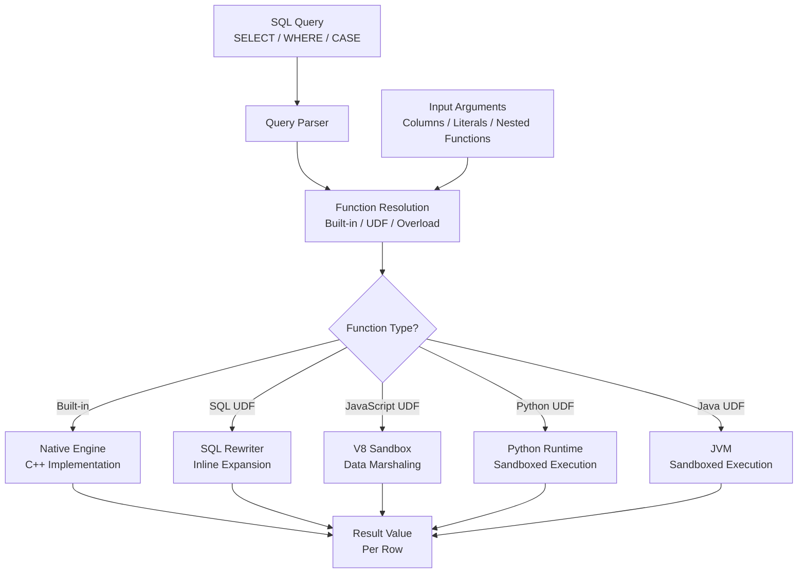

# 1. Scalar Functions in Snowflake

# 2. Overview

Scalar functions in Snowflake operate on zero or more input values and return a single value per row. They are the fundamental building blocks of SQL transformations, enabling data type conversion, string manipulation, mathematical computation, date/time arithmetic, conditional logic, and semi-structured data navigation. Snowflake provides extensive built-in scalar function libraries and supports user-defined functions (UDFs) in SQL, JavaScript, Python, Java, and Scala.

Scalar functions are deterministic or non-deterministic, immutable or mutable, and may be overloaded across input types. They execute per row during query processing and can be nested, composed, and used in `SELECT`, `WHERE`, `JOIN`, `GROUP BY`, `ORDER BY`, `HAVING`, and `CASE` expressions.

The intended consumers are data engineers writing transformation logic, analytics engineers modeling data, application developers integrating with Snowflake, and SnowPro Advanced exam candidates who must understand function categories, null handling, type coercion, deterministic behavior, and performance implications.

# 3. SQL Object Summary

| Object/Feature | Type | Purpose | Source Objects or Inputs | Output Object or Observable Behavior | Execution Mode or Invocation Method |
|---|---|---|---|---|---|
| [Built-in Scalar Function](SQL Object Summary/Built-in Scalar Function.md) | System function | Single-value computation per row | Input expressions, literals, columns | Single value per input row | Per-row during query execution |
| [SQL UDF](SQL Object Summary/SQL UDF.md) | User-defined function | Custom scalar logic in SQL | Input arguments | Single value per invocation | `CREATE FUNCTION` with SQL body |
| [JavaScript UDF](SQL Object Summary/JavaScript UDF.md) | User-defined function | Custom scalar logic in JavaScript | Input arguments | Single value per invocation | `CREATE FUNCTION` with JavaScript body |
| [Python UDF](SQL Object Summary/Python UDF.md) | User-defined function | Custom scalar logic in Python | Input arguments | Single value per invocation | `CREATE FUNCTION` with Python body |
| [Java UDF](SQL Object Summary/Java UDF.md) | User-defined function | Custom scalar logic in Java | Input arguments | Single value per invocation | `CREATE FUNCTION` with Java body |
| [Secure UDF](SQL Object Summary/Secure UDF.md) | UDF variant | Prevents SQL introspection | Same as base UDF type | Same as base UDF type | `CREATE SECURE FUNCTION` |
| [Immutable Function](SQL Object Summary/Immutable Function.md) | Function property | Same inputs always produce same outputs | Input values | Deterministic result | Declared or inherent |
| [Volatile Function](SQL Object Summary/Volatile Function.md) | Function property | Result may vary across calls | Input values + system state | Non-deterministic result | Declared or inherent |

# 4. Architecture

Scalar functions execute within the query processing layer. Built-in functions are native to the engine. UDFs execute in sandboxed runtimes (JavaScript V8, Python interpreter, JVM) with data marshaling between SQL and the guest runtime. Secure UDFs obfuscate definitions from `GET_DDL` and `SHOW` output.

# 5. Data Flow / Process Flow

## Step 1: Function Invocation
- **Input:** SQL expression containing function call with arguments
- **Transformation:** Parser identifies function name, resolves overload based on argument types, validates argument count and types
- **Output:** Bound function call ready for execution
- **Purpose:** Ensure the function call is valid and unambiguous

## Step 2: Argument Evaluation
- **Input:** Function arguments (columns, literals, subqueries, nested functions)
- **Transformation:** Engine evaluates each argument expression per row
- **Output:** Typed argument values
- **Purpose:** Prepare inputs for function computation

## Step 3: Function Execution
- **Input:** Evaluated arguments
- **Transformation:** Built-in functions execute native code; UDFs marshal data to guest runtime, execute logic, marshal result back
- **Output:** Single return value per row
- **Purpose:** Compute the function result

## Step 4: Null and Error Handling
- **Input:** Function result or exception
- **Transformation:** `NULL` inputs propagate to `NULL` output for most functions unless explicitly handled; errors raise SQL exceptions
- **Output:** Result value, `NULL`, or error
- **Purpose:** Ensure predictable behavior with incomplete data

## Step 5: Result Integration
- **Input:** Function return value
- **Transformation:** Value feeds into outer expression, filter predicate, or result set projection
- **Output:** Final query result
- **Purpose:** Complete the query computation

# 6. Logical Breakdown

## Component: Built-in Function Library
- **Responsibility:** Provide native, optimized scalar operations
- **Inputs:** Typed arguments
- **Outputs:** Computed values
- **Dependencies:** None (engine-native)
- **Failure Modes:** Type mismatch raises error; domain errors (e.g., `SQRT(-1)`) raise error; overflow may raise error or return `NULL` depending on function

## Component: SQL UDF Engine
- **Responsibility:** Execute user-defined SQL logic
- **Inputs:** Arguments bound to UDF parameters
- **Outputs:** UDF body result
- **Dependencies:** Objects referenced in UDF body must be accessible
- **Failure Modes:** Recursive UDFs may hit stack limits; complex UDFs may not inline optimally

## Component: JavaScript UDF Runtime
- **Responsibility:** Execute JavaScript logic per row
- **Inputs:** Marshaled SQL values
- **Outputs:** Marshaled JavaScript return value
- **Dependencies:** V8 runtime; memory limits apply
- **Failure Modes:** Memory exhaustion; timeout; type marshaling mismatches; uncaught exceptions

## Component: Python UDF Runtime
- **Responsibility:** Execute Python logic per row
- **Inputs:** Marshaled SQL values
- **Outputs:** Marshaled Python return value
- **Dependencies:** Python sandbox; package imports restricted to allowlist
- **Failure Modes:** Import errors; memory limits; execution timeout; serialization failures

## Component: Java UDF Runtime
- **Responsibility:** Execute Java logic per row
- **Inputs:** Marshaled SQL values
- **Outputs:** Marshaled Java return value
- **Dependencies:** JVM; JAR dependencies
- **Failure Modes:** Class loading errors; memory limits; GC pressure

## Component: Function Overload Resolver
- **Responsibility:** Select correct function implementation based on argument types
- **Inputs:** Function name, argument type signatures
- **Outputs:** Resolved function reference
- **Dependencies:** Function catalog
- **Failure Modes:** Ambiguous overload raises error; no matching overload raises error

## Component: Secure UDF Wrapper
- **Responsibility:** Obfuscate UDF definition from metadata queries
- **Inputs:** UDF definition
- **Outputs:** Opaque metadata
- **Dependencies:** `CREATE SECURE FUNCTION`
- **Failure Modes:** `GET_DDL` returns obscured definition; debugging requires ownership

# 7. Data Model

## Function Catalog (Conceptual)

| Attribute | Role | Notes |
|---|---|---|
| [`FUNCTION_NAME`](UDF Definition Metadata/FUNCTION_NAME.md) | Identifier | May be overloaded |
| [`ARGUMENT_TYPES`](Function Catalog (Conceptual)/ARGUMENT_TYPES.md) | Signature | Determines overload selection |
| [`RETURN_TYPE`](Parameters  Variables  Configuration/RETURN_TYPE.md) | Output type | Fixed or polymorphic |
| [`IS_BUILTIN`](Function Catalog (Conceptual)/IS_BUILTIN.md) | Origin | System or user-defined |
| [`IS_UDF`](Function Catalog (Conceptual)/IS_UDF.md) | Origin | SQL, JavaScript, Python, Java, Scala |
| [`IS_SECURE`](Parameters  Variables  Configuration/IS_SECURE.md) | Visibility | `TRUE` obscures definition |
| [`IS_IMMUTABLE`](Function Catalog (Conceptual)/IS_IMMUTABLE.md) | Determinism | Same inputs → same outputs |
| [`IS_VOLATILE`](Function Catalog (Conceptual)/IS_VOLATILE.md) | Determinism | May vary across calls (e.g., `RANDOM()`) |

## UDF Definition Metadata

| Attribute | Role | Notes |
|---|---|---|
| [`FUNCTION_NAME`](UDF Definition Metadata/FUNCTION_NAME.md) | Identifier | Schema-qualified |
| [`ARGUMENT_SIGNATURE`](UDF Definition Metadata/ARGUMENT_SIGNATURE.md) | Input types | Used for overload resolution |
| [`RETURN_TYPE`](Parameters  Variables  Configuration/RETURN_TYPE.md) | Output type | Must match body result |
| [`LANGUAGE`](Parameters  Variables  Configuration/LANGUAGE.md) | Runtime | `SQL`, `JAVASCRIPT`, `PYTHON`, `JAVA`, `SCALA` |
| [`BODY`](UDF Definition Metadata/BODY.md) | Logic | Obscured if secure |
| [`OWNER`](UDF Definition Metadata/OWNER.md) | Privilege context | Execution uses owner privileges |

# 8. Business Logic

## Null Handling Semantics
- Most scalar functions return `NULL` if any argument is `NULL` (null-propagating)
- Exceptions: `COALESCE`, `IFNULL`, `NVL`, `NULLIF`, `ISNULL`, `ZEROIFNULL` explicitly handle `NULL`
- `TRY_CAST`, `TRY_TO_DATE`, `TRY_TO_NUMBER` return `NULL` on failure instead of raising error
- `CONCAT` with `NULL` argument returns `NULL` unless using `CONCAT_WS`

## Type Coercion Rules
- Functions accept arguments of compatible types with implicit coercion
- Numeric types coerce toward higher precision (`INTEGER` → `NUMBER` → `FLOAT`)
- String types coerce to `VARCHAR`
- Date/time types coerce toward higher granularity (`DATE` → `TIMESTAMP_NTZ` → `TIMESTAMP_LTZ`)
- `VARIANT` arguments may be auto-unwrapped for certain functions

## Deterministic vs. Non-Deterministic
- **Deterministic:** `UPPER('abc')` always returns `'ABC'`; `DATEADD(day, 1, '2024-01-01')` always returns `'2024-01-02'`
- **Non-deterministic:** `CURRENT_TIMESTAMP()` returns different values per call; `RANDOM()` returns different values; `UUID_STRING()` generates unique values
- Non-deterministic functions disable result cache eligibility and may affect materialized view refresh

## Immutable vs. Volatile
- **Immutable:** Result depends only on inputs; can be pre-computed or cached
- **Volatile:** Result may change between calls even with same inputs; includes functions reading system state
- UDFs default to immutable unless declared volatile; incorrect declaration may cause stale results

## Function Nesting and Composition
- Scalar functions can be nested arbitrarily: `UPPER(TRIM(SUBSTRING(col, 1, 10)))`
- Evaluation order is inside-out
- Deep nesting may impact readability and optimization

## Secure UDF Behavior
- `CREATE SECURE FUNCTION` prevents `GET_DDL` from returning the function body
- `SHOW FUNCTIONS` displays limited information
- Ownership or `OPERATE` privilege required to view secure UDF definitions
- Used for hiding business logic, API keys in UDFs, or sensitive algorithms

## UDF Execution Context
- UDFs execute with the privileges of the UDF owner, not the caller
- If owner loses privileges on referenced objects, UDF fails
- JavaScript/Python UDFs run in sandboxed environments with resource limits

# 9. Transformations

## Input Value to Computed Value
- **Source:** Column value, literal, or expression
- **Output:** Transformed single value
- **Logic:** Function-specific computation (e.g., `UPPER` converts case, `DATEADD` adds intervals)
- **Meaning:** Row-level data transformation
- **Impact:** Enables cleansing, standardization, and derivation

## NULL to Non-NULL
- **Source:** `NULL` input
- **Output:** Default or computed non-NULL value
- **Logic:** `COALESCE(col, 'DEFAULT')`, `IFNULL(col, 0)`, `ZEROIFNULL(col)`
- **Meaning:** Null handling and default substitution
- **Impact:** Prevents null propagation in downstream logic

## String to Typed Value
- **Source:** String representation
- **Output:** Typed value or error/NULL
- **Logic:** `CAST`, `TO_DATE`, `TO_NUMBER`, `TRY_CAST`, `TRY_TO_DATE`
- **Meaning:** Type conversion and validation
- **Impact:** Enables schema alignment and data quality enforcement

## Date/Time to Date/Time
- **Source:** Date or timestamp value
- **Output:** Modified date or timestamp
- **Logic:** `DATEADD`, `DATEDIFF`, `DATE_TRUNC`, `LAST_DAY`
- **Meaning:** Temporal arithmetic and truncation
- **Impact:** Enables time-based analysis and period alignment

## Semi-Structured to Scalar
- **Source:** `VARIANT`, `OBJECT`, `ARRAY` value
- **Output:** Scalar value extracted from nested structure
- **Logic:** `GET`, `GET_PATH`, `FLATTEN` (table function, but extracts scalars), `PARSE_JSON`
- **Meaning:** Structured data extraction
- **Impact:** Enables JSON/Avro/Parquet nested field access

## Conditional to Scalar
- **Source:** Boolean condition and candidate values
- **Output:** Selected value based on condition
- **Logic:** `CASE`, `DECODE`, `IFF`, `NULLIF`
- **Meaning:** Branching logic in expressions
- **Impact:** Enables classification, mapping, and exception handling

# 10. Parameters / Variables / Configuration

| Name | Type | Purpose | Allowed Values | Default | Where Used | Effect |
|---|---|---|---|---|---|---|
| [`LANGUAGE`](Parameters  Variables  Configuration/LANGUAGE.md) | UDF property | Runtime selection | `SQL`, `JAVASCRIPT`, `PYTHON`, `JAVA`, `SCALA` | `SQL` | `CREATE FUNCTION` | Determines execution environment |
| [`RETURN_TYPE`](Parameters  Variables  Configuration/RETURN_TYPE.md) | UDF property | Output data type | Any valid Snowflake type | Required | `CREATE FUNCTION` | Defines result type |
| [`IS_SECURE`](Parameters  Variables  Configuration/IS_SECURE.md) | UDF property | Definition visibility | `TRUE`, `FALSE` | `FALSE` | `CREATE FUNCTION` | Obscures body from metadata |
| [`IMMUTABLE`](Parameters  Variables  Configuration/IMMUTABLE.md) | UDF property | Determinism | `TRUE`, `FALSE` | `TRUE` | `CREATE FUNCTION` | Affects caching and optimization |
| [`RUNTIME_VERSION`](Parameters  Variables  Configuration/RUNTIME_VERSION.md) | Python UDF | Python version | `3.8`, `3.9`, `3.10`, `3.11` | `3.8` | `CREATE FUNCTION` | Python interpreter version |
| [`HANDLER`](Parameters  Variables  Configuration/HANDLER.md) | Python/Java UDF | Entry point | Function/class name | Required | `CREATE FUNCTION` | Specifies callable entry |
| [`PACKAGES`](Parameters  Variables  Configuration/PACKAGES.md) | Python UDF | Dependencies | List of package specs | None | `CREATE FUNCTION` | Third-party libraries |
| [`IMPORTS`](Parameters  Variables  Configuration/IMPORTS.md) | Python/Java UDF | File dependencies | Stage file paths | None | `CREATE FUNCTION` | Additional files |
| [`TIMEZONE`](Parameters  Variables  Configuration/TIMEZONE.md) | Session parameter | Temporal context | IANA timezone | `UTC` | Session | Affects date/time functions |
| [`TIMESTAMP_TYPE_MAPPING`](Parameters  Variables  Configuration/TIMESTAMP_TYPE_MAPPING.md) | Session parameter | Timestamp semantics | `TIMESTAMP_LTZ`, `TIMESTAMP_NTZ` | `TIMESTAMP_NTZ` | Session | Controls implicit timestamp types |
| [`BINARY_OUTPUT_FORMAT`](Parameters  Variables  Configuration/BINARY_OUTPUT_FORMAT.md) | Session parameter | Binary display | `HEX`, `BASE64`, `UTF8` | `HEX` | Session | Affects binary function results |

# 11. APIs / Interfaces

## Interface: Built-in Function Invocation
- **Invocation:** `SELECT UPPER(col), DATEADD(day, 1, ts), SQRT(num) FROM table`
- **Input:** Column values, literals
- **Output:** Transformed values per row
- **Error Behavior:** Type mismatch raises error; domain errors raise error
- **Consumers:** All SQL queries

## Interface: CREATE FUNCTION (SQL)
- **Invocation:** `CREATE FUNCTION add_one(n NUMBER) RETURNS NUMBER AS 'n + 1'`
- **Input:** Argument signature, SQL expression body
- **Output:** SQL UDF object
- **Error Behavior:** Fails on syntax error, type mismatch, or invalid object references
- **Consumers:** Reusable SQL logic, business rules

## Interface: CREATE FUNCTION (JavaScript)
- **Invocation:** `CREATE FUNCTION js_udf(s VARCHAR) RETURNS VARCHAR LANGUAGE JAVASCRIPT AS 'return S.toUpperCase()'`
- **Input:** Argument signature, JavaScript body
- **Output:** JavaScript UDF object
- **Error Behavior:** Fails on syntax error, memory limit, or timeout
- **Consumers:** Complex string manipulation, regex, JSON processing

## Interface: CREATE FUNCTION (Python)
- **Invocation:** `CREATE FUNCTION py_udf(n NUMBER) RETURNS NUMBER LANGUAGE PYTHON RUNTIME_VERSION = '3.9' HANDLER = 'double' AS $$ def double(n): return n * 2 $$`
- **Input:** Argument signature, Python code, runtime version, handler
- **Output:** Python UDF object
- **Error Behavior:** Fails on import error, syntax error, or execution exception
- **Consumers:** Data science integration, complex algorithms, ML inference

## Interface: CREATE SECURE FUNCTION
- **Invocation:** `CREATE SECURE FUNCTION secure_udf(...) RETURNS ... AS ...`
- **Input:** Same as base UDF type
- **Output:** Secure UDF with obscured definition
- **Error Behavior:** Same as base type
- **Consumers:** Sensitive business logic, API key encapsulation

## Interface: SHOW FUNCTIONS
- **Invocation:** `SHOW FUNCTIONS [LIKE '...'] [IN ...]`
- **Input:** Optional filter
- **Output:** Function metadata (name, signature, return type, language)
- **Error Behavior:** Secure UDFs show limited detail
- **Consumers:** Schema discovery, dependency analysis

## Interface: GET_DDL
- **Invocation:** `SELECT GET_DDL('FUNCTION', 'schema.func_name(arg_type)')`
- **Input:** Function type and fully qualified name with signature
- **Output:** CREATE FUNCTION statement
- **Error Behavior:** Returns obscured body for secure functions
- **Consumers:** Documentation, version control

# 12. Execution / Deployment

## Built-in Function Usage
- Use built-in functions directly in SQL expressions
- Prefer built-ins over UDFs for performance (native execution, no marshaling overhead)
- Reference Snowflake documentation for function-specific null handling and type coercion

## SQL UDF Deployment
- Define reusable transformations as SQL UDFs for consistency across queries
- SQL UDFs may be inlined by optimizer; no runtime overhead for simple expressions
- Use for business rules that change infrequently and do not require imperative logic

## JavaScript UDF Deployment
- Use for regex operations, JSON manipulation, or logic not expressible in SQL
- Be aware of memory limits and execution timeout
- Avoid JavaScript UDFs in high-volume queries due to per-row marshaling cost

## Python UDF Deployment
- Use for data science integration, statistical functions, or ML model inference
- Specify `RUNTIME_VERSION` and `PACKAGES` explicitly
- Test in development with representative data volumes due to sandbox overhead

## Secure UDF Deployment
- Mark UDFs as `SECURE` when containing sensitive logic or credentials
- Document secure UDF behavior for operators who cannot inspect definitions
- Maintain source code in version control outside Snowflake

## Function Testing
- Test UDFs with `NULL` inputs, boundary values, and type edge cases
- Verify deterministic behavior for functions intended to support caching
- Benchmark UDF performance against built-in alternatives

## Environment Behavior
- Development: Verbose UDF testing, non-secure functions for debugging
- Production: Secure UDFs for sensitive logic, built-in functions preferred for performance, documented function catalog

# 13. Observability

## Function Usage Tracking
- Query `QUERY_HISTORY` for functions used in production queries
- Use `QUERY_TAG` to attribute function-heavy queries to specific workloads
- Monitor UDF execution frequency and duration

## UDF Performance Monitoring
- JavaScript/Python UDFs appear in query profile with guest runtime overhead
- Compare UDF query duration to equivalent built-in or SQL UDF implementations
- Monitor memory and timeout errors in UDF execution

## Error Tracking
- Track function-related errors: type mismatches, domain errors, UDF exceptions
- Categorize by function name and error code
- Correlate error spikes with deployments or schema changes

## Key Metrics
- Query execution time with vs. without UDFs
- UDF invocation count per hour
- UDF error rate by type
- Built-in function usage distribution
- Secure vs. non-secure UDF ratio

# 14. Failure Handling & Recovery

## Type Mismatch Error
- **What breaks:** Function called with incompatible argument types
- **Detection:** `SQL compilation error: Invalid argument types for function`
- **Fallback:** Use explicit `CAST` or `TRY_CAST` to coerce types
- **Recovery:** Fix query to pass correct types; or create overloaded UDF for additional type support

## Null Propagation
- **What breaks:** Function returns unexpected `NULL` due to null input
- **Detection:** Query results show nulls where values expected
- **Fallback:** Wrap with `COALESCE` or `IFNULL`
- **Recovery:** Add null handling in query or UDF body

## UDF Timeout
- **What breaks:** JavaScript/Python UDF exceeds execution time limit
- **Detection:** Query fails with timeout error
- **Fallback:** Simplify UDF logic; process in batches
- **Recovery:** Optimize algorithm; move logic to stored procedure for row-set processing; or pre-compute values

## UDF Memory Limit
- **What breaks:** JavaScript/Python UDF exceeds memory allocation
- **Detection:** Query fails with memory error
- **Fallback:** Reduce data size per call; avoid large object accumulation
- **Recovery:** Refactor to use less memory; or move to external processing

## Determinism Mismatch
- **What breaks:** UDF declared immutable but contains non-deterministic logic (e.g., `CURRENT_TIMESTAMP`)
- **Detection:** Stale or inconsistent results in cached queries
- **Fallback:** Declare UDF as volatile
- **Recovery:** Alter UDF to correct immutability declaration; or remove non-deterministic logic

## Secure UDF Debugging
- **What breaks:** Secure UDF fails but definition is not visible
- **Detection:** Error message without source context
- **Fallback:** Test with non-secure copy in development
- **Recovery:** Grant temporary ownership for debugging; or maintain parallel non-secure version in dev

## Import Error (Python UDF)
- **What breaks:** Python UDF references package not in allowlist
- **Detection:** `ImportError` at UDF invocation
- **Fallback:** Use standard library only
- **Recovery:** Request package addition; or implement logic without external dependencies

# 15. Security & Access Control

## Privilege Requirements

| Action | Required Privilege | Object |
|---|---|---|
| [Create UDF](Privilege Requirements/Create UDF.md) | `CREATE FUNCTION` on schema | Schema |
| [Call UDF](Privilege Requirements/Call UDF.md) | `USAGE` on function | Function |
| [View UDF definition](Privilege Requirements/View UDF definition.md) | `OWNERSHIP` or `OPERATE` | Function |
| [Call secure UDF](Privilege Requirements/Call secure UDF.md) | `USAGE` on function | Function |
| [Reference objects in UDF](Privilege Requirements/Reference objects in UDF.md) | Privileges on referenced objects | Referenced tables/views |

## Secure UDF Visibility
- `GET_DDL` returns obscured body for secure functions
- `SHOW FUNCTIONS` displays limited metadata
- Only owner and `ACCOUNTADMIN` can view full secure UDF definitions
- Use for API keys, proprietary algorithms, or sensitive business rules

## UDF Owner Context
- UDFs execute with owner privileges on referenced objects
- If owner loses access, UDF fails for all callers
- Use dedicated service roles for UDF ownership to prevent user-driven privilege changes

## Data Exposure in UDFs
- UDF arguments and return values travel through query processing
- Masking policies apply to UDF arguments if the column is masked
- Do not log sensitive data in UDF error messages

## Python UDF Sandbox
- Python UDFs run in restricted environment
- Network access blocked unless external access integration configured
- File system access restricted to imported files only
- Do not store credentials in UDF body unless secure and necessary

# 16. Performance / Scalability Considerations

## Built-in Function Performance
- Native C++ implementation; optimal performance
- No marshaling overhead
- Vectorized execution on micro-partitions

## SQL UDF Performance
- Simple SQL UDFs may be inlined by optimizer (zero overhead)
- Complex SQL UDFs execute as subqueries; may not push down predicates optimally
- Prefer built-ins or simple SQL UDFs for high-volume queries

## JavaScript UDF Performance
- Per-row V8 invocation with data marshaling
- Significantly slower than built-ins for simple operations
- Acceptable for low-frequency complex logic (regex, JSON parsing)
- Avoid in queries processing millions of rows

## Python UDF Performance
- Per-row Python interpreter invocation
- Slower than JavaScript for simple operations due to Python startup
- Benefits emerge for complex data science computations amortizing overhead
- Package import adds latency on first call per session

## Java UDF Performance
- JVM startup overhead on first invocation
- Faster than Python/JavaScript for compute-intensive logic once warmed
- JAR loading and class initialization add cold-start latency

## Function Nesting Depth
- Deep nesting complicates query plans and may limit optimization
- Break complex expressions into CTEs for readability and plan clarity

## Non-Deterministic Functions
- `CURRENT_TIMESTAMP`, `RANDOM`, `UUID_STRING` disable result cache
- Repeated calls in same query may return different values
- Use sparingly in expressions intended for caching or materialized views

## Secure UDF Overhead
- No runtime overhead for secure flag
- Metadata queries are slower due to obscured definitions

# 17. Assumptions & Constraints

## Explicit Assumptions
- The reader is implementing row-level transformations using scalar functions in SQL queries
- Functions operate on valid Snowflake data types
- UDFs are used when built-in functions are insufficient

## Engine Boundaries
- Maximum UDF argument count: 512
- JavaScript UDF maximum execution time: 30 seconds per call
- Python UDF memory limit: 1GB per process
- SQL UDF body cannot contain DDL or DML (read-only expressions)
- Not all built-in functions support all data types; check documentation
- UDF overloading requires distinct argument type signatures
- Recursive UDF calls may hit stack depth limits

## Exam-Relevant Defaults
- UDFs default to `IMMUTABLE` (deterministic)
- `TIMEZONE` default: `UTC`
- `TIMESTAMP_TYPE_MAPPING` default: `TIMESTAMP_NTZ`
- `BINARY_OUTPUT_FORMAT` default: `HEX`
- `NULL` propagates through most functions
- `TRY_CAST` returns `NULL` on failure rather than raising error

## Ambiguities
- Exact inlining behavior for SQL UDFs is optimizer-dependent and not guaranteed
- JavaScript UDF memory limits may vary based on warehouse size
- Python package allowlist changes over time and is not fully documented as a fixed set

# 18. Future Enhancements

- Replace JavaScript UDFs with SQL UDFs or built-in functions where possible to eliminate marshaling overhead
- Implement a function catalog documenting all UDFs with purpose, performance characteristics, and deprecation policies
- Standardize null handling patterns using `COALESCE`, `TRY_CAST`, and `ZEROIFNULL` rather than `CASE` expressions
- Use `TRY_TO_DATE` and `TRY_TO_NUMBER` instead of `CAST` in production pipelines to prevent single bad values from aborting queries
- Create overloaded SQL UDFs for common business transformations to ensure type-safe reuse across teams
- Mark sensitive business logic UDFs as `SECURE` and maintain source in version control
- Benchmark UDF alternatives (built-in vs. SQL vs. JavaScript vs. Python) before deploying to high-volume queries
- Add `QUERY_TAG` to all queries using custom UDFs to enable performance tracking and cost attribution
- Implement UDF test suites covering null inputs, boundary values, and type edge cases
- Migrate complex row-by-row Python UDFs to vectorized Python UDFs or stored procedures for better throughput on large datasets
