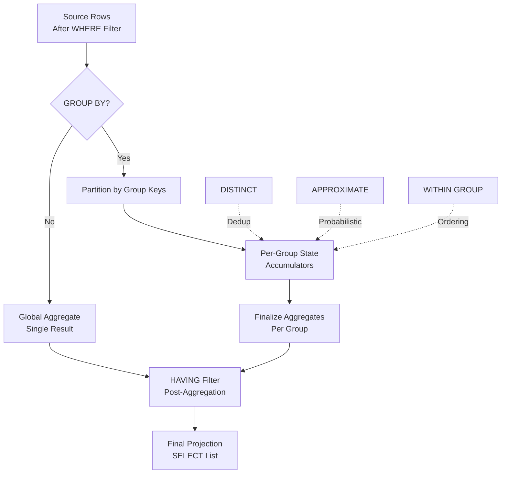

# 1. Aggregate Functions in Snowflake

# 2. Overview

Aggregate functions in Snowflake operate on sets of rows and return a single summary value per group. They are the computational core of analytical SQL, enabling counting, summation, averaging, extremum detection, statistical analysis, and collection of values into arrays or strings. Snowflake supports built-in aggregate functions across numeric, string, date, boolean, bitwise, and semi-structured data types, as well as approximate distinct counting and percentile computation.

Aggregate functions execute during the aggregation phase of query processing, typically after filtering (`WHERE`) and before final projection. They can operate over entire result sets (no `GROUP BY`), over explicit groups (`GROUP BY`), or over ordered sets (`WITHIN GROUP`). Most aggregate functions can also be used as window functions with an `OVER()` clause, though this documentation focuses on their grouped behavior.

This feature exists to:
- Summarize large datasets into meaningful metrics
- Support statistical and financial analysis via variance, standard deviation, covariance, and regression functions
- Enable semi-structured data collection via `ARRAY_AGG`, `OBJECT_AGG`, and `LISTAGG`
- Provide approximate aggregates for high-cardinality distinct counting and percentile estimation at reduced compute cost

The intended consumers are analytics engineers writing summary queries, data scientists performing statistical analysis, BI tools generating reports, and SnowPro Advanced exam candidates who must understand NULL handling, `DISTINCT` semantics, `GROUP BY` extensions, approximate aggregates, and the interaction between aggregates and filters.

# 3. SQL Object Summary

| Object/Feature | Type | Purpose | Source Objects or Inputs | Output Object or Observable Behavior | Execution Mode or Invocation Method |
|---|---|---|---|---|---|
| COUNT | Aggregate function | Count rows or non-null values | Column expression or `*` | Integer count per group | Query aggregation phase |
| SUM | Aggregate function | Sum of numeric values | Numeric column or expression | Numeric sum per group | Query aggregation phase |
| AVG | Aggregate function | Average of numeric values | Numeric column or expression | Numeric average per group | Query aggregation phase |
| MIN / MAX | Aggregate function | Minimum/maximum value | Column of any comparable type | Extreme value per group | Query aggregation phase |
| STDDEV / STDDEV_SAMP / STDDEV_POP | Aggregate function | Standard deviation | Numeric column or expression | Float standard deviation per group | Query aggregation phase |
| VARIANCE / VAR_SAMP / VAR_POP | Aggregate function | Variance | Numeric column or expression | Float variance per group | Query aggregation phase |
| COVAR_SAMP / COVAR_POP | Aggregate function | Covariance | Two numeric expressions | Float covariance per group | Query aggregation phase |
| CORR | Aggregate function | Correlation coefficient | Two numeric expressions | Float correlation per group | Query aggregation phase |
| REGR_ functions | Aggregate function | Linear regression statistics | Two numeric expressions (y, x) | Regression metric per group | Query aggregation phase |
| LISTAGG | Aggregate function | String concatenation | String column or expression | Concatenated string per group | Query aggregation phase |
| ARRAY_AGG | Aggregate function | Array collection | Column of any type | ARRAY per group | Query aggregation phase |
| OBJECT_AGG | Aggregate function | Object collection | Key and value columns | OBJECT per group | Query aggregation phase |
| BOOLAND_AGG / BOOLOR_AGG / BOOLXOR_AGG | Aggregate function | Boolean aggregation | Boolean expression | Boolean result per group | Query aggregation phase |
| BITAND_AGG / BITOR_AGG / BITXOR_AGG | Aggregate function | Bitwise aggregation | Integer expression | Integer result per group | Query aggregation phase |
| APPROX_COUNT_DISTINCT | Aggregate function | Approximate distinct count | Column expression | Integer approximate count per group | Query aggregation phase |
| APPROX_PERCENTILE | Aggregate function | Approximate percentile | Numeric expression + percentile | Numeric approximate percentile per group | Query aggregation phase |
| GROUP BY | Clause | Define aggregation groups | Column expressions | One output row per group | Query grouping phase |
| GROUP BY ALL | Clause | Automatic grouping | All non-aggregate SELECT columns | One output row per distinct combination | Query grouping phase |
| CUBE / ROLLUP / GROUPING SETS | Clause | Multi-dimensional grouping | Column list | Multiple grouping levels in one scan | Query grouping phase |
| HAVING | Clause | Post-aggregation filter | Boolean expression with aggregates | Filtered group result set | Query filtering phase |
| DISTINCT | Keyword | Deduplicate inputs | Column expression | Aggregate over unique values | Query aggregation phase |

# 4. Architecture

Aggregate functions execute in the query engine's aggregation operator. For grouped queries, the engine partitions rows by `GROUP BY` keys, computes aggregate state per partition, and emits one row per group. For non-grouped queries, a single global aggregate is computed. Approximate aggregates use probabilistic data structures (HyperLogLog for distinct counting, T-Digest for percentiles) to reduce memory and compute.

# 5. Data Flow / Process Flow

## Step 1: Row Filtering
- **Input:** Source table rows
- **Transformation:** `WHERE` clause filters rows before aggregation
- **Output:** Qualified row set
- **Purpose:** Restrict the population being summarized

## Step 2: Grouping Key Extraction
- **Input:** Qualified rows
- **Transformation:** `GROUP BY` expressions compute grouping keys; rows are partitioned by key values
- **Output:** Row partitions per group
- **Purpose:** Define summary granularity

## Step 3: Aggregate Computation
- **Input:** Row partitions
- **Transformation:** Aggregate functions evaluate expressions per partition, maintaining running state (count, sum, min, max, etc.)
- **Output:** Intermediate aggregate state per group
- **Purpose:** Compute summary metrics

## Step 4: DISTINCT Handling (if specified)
- **Input:** Expression values within each group
- **Transformation:** Duplicate values are eliminated before aggregation
- **Output:** Unique value set per group
- **Purpose:** Ensure aggregates operate on distinct inputs only

## Step 5: Finalization
- **Input:** Intermediate aggregate state
- **Transformation:** State is finalized into output values (e.g., sum divided by count for `AVG`, square root for `STDDEV`)
- **Output:** Final aggregate values per group
- **Purpose:** Produce queryable results

## Step 6: Post-Aggregation Filtering
- **Input:** Grouped results with aggregate values
- **Transformation:** `HAVING` clause filters groups based on aggregate results
- **Output:** Filtered group set
- **Purpose:** Eliminate groups that do not meet summary criteria

## Step 7: Projection
- **Input:** Final group results
- **Transformation:** `SELECT` list projects grouping keys and aggregate values
- **Output:** Result set
- **Purpose:** Return summarized data to consumer

# 6. Logical Breakdown

## Component: COUNT Executor
- **Responsibility:** Count rows or non-null values
- **Inputs:** Column expression or `*`
- **Outputs:** Integer count
- **Dependencies:** None
- **Failure Modes:** `COUNT(*)` counts all rows including nulls; `COUNT(col)` ignores nulls; `COUNT(DISTINCT col)` deduplicates before counting

## Component: SUM/AVG Executor
- **Responsibility:** Compute sum or average of numeric values
- **Inputs:** Numeric expression
- **Outputs:** Numeric sum or average
- **Dependencies:** Input must be numeric or coercible to numeric
- **Failure Modes:** Overflow on very large sums; `AVG` of empty set returns null; `AVG` ignores nulls in count

## Component: MIN/MAX Executor
- **Responsibility:** Find minimum or maximum value
- **Inputs:** Expression of any comparable type
- **Outputs:** Extreme value
- **Dependencies:** Type must support ordering
- **Failure Modes:** Returns null for empty groups; `MIN`/`MAX` on strings uses lexical ordering

## Component: Statistical Aggregate Executor
- **Responsibility:** Compute variance, standard deviation, covariance, correlation, or regression metrics
- **Inputs:** One or two numeric expressions
- **Outputs:** Float statistical metric
- **Dependencies:** Sufficient sample size (population vs. sample variants)
- **Failure Modes:** `STDDEV_SAMP` requires at least two non-null values; single-value groups return null for sample statistics

## Component: LISTAGG Executor
- **Responsibility:** Concatenate string values with delimiter
- **Inputs:** String expression, delimiter, optional `WITHIN GROUP (ORDER BY)`
- **Outputs:** Concatenated string
- **Dependencies:** Result string must fit within VARCHAR size limit (16MB)
- **Failure Modes:** Exceeds size limit raises error; null values are skipped unless explicitly handled

## Component: ARRAY_AGG Executor
- **Responsibility:** Collect values into an array
- **Inputs:** Expression of any type, optional `WITHIN GROUP (ORDER BY)`
- **Outputs:** ARRAY value
- **Dependencies:** Array size limits apply
- **Failure Modes:** Very large arrays may exceed size limits; null values included unless filtered

## Component: OBJECT_AGG Executor
- **Responsibility:** Collect key-value pairs into an object
- **Inputs:** Key expression (string), value expression
- **Outputs:** OBJECT value
- **Dependencies:** Keys must be strings; duplicate keys behavior depends on ordering
- **Failure Modes:** Non-string keys cause error; duplicate keys may overwrite

## Component: Boolean Aggregate Executor
- **Responsibility:** Aggregate boolean values
- **Inputs:** Boolean expression
- **Outputs:** Boolean result
- **Dependencies:** Input must be boolean
- **Failure Modes:** `BOOLAND_AGG` returns true only if all values are true; nulls are ignored

## Component: Bitwise Aggregate Executor
- **Responsibility:** Aggregate integers via bitwise operations
- **Inputs:** Integer expression
- **Outputs:** Integer result
- **Dependencies:** Input must be integer
- **Failure Modes:** Non-integer inputs cause type error

## Component: Approximate Distinct Counter
- **Responsibility:** Estimate distinct count using HyperLogLog
- **Inputs:** Any expression
- **Outputs:** Integer estimate
- **Dependencies:** None
- **Failure Modes:** Estimate has ~1-2% error; not exact; memory bounded regardless of cardinality

## Component: Approximate Percentile Estimator
- **Responsibility:** Estimate percentile using T-Digest
- **Inputs:** Numeric expression, percentile constant (0.0 to 1.0)
- **Outputs:** Numeric estimate
- **Dependencies:** Numeric input
- **Failure Modes:** Estimate is approximate; accuracy varies by distribution

## Component: Grouping Key Generator
- **Responsibility:** Compute grouping keys from expressions
- **Inputs:** `GROUP BY` expressions
- **Outputs:** Distinct key combinations
- **Dependencies:** Expressions must be evaluable
- **Failure Modes:** `GROUP BY` columns must appear in SELECT or be aggregated; `GROUP BY ALL` infers columns automatically

## Component: HAVING Filter
- **Responsibility:** Filter groups after aggregation
- **Inputs:** Aggregate results, boolean predicate
- **Outputs:** Qualified groups
- **Dependencies:** Predicate may reference aggregates and grouping keys
- **Failure Modes:** Cannot reference non-grouped, non-aggregated columns

# 7. Data Model

## Query Result Set (Aggregated)

| Column | Role | Grain | Notes |
|---|---|---|---|
| Grouping key columns | Dimensions | One per group | From `GROUP BY` |
| Aggregate result columns | Metrics | One per group | From aggregate functions |
| `GROUPING_ID` | Metadata | One per group | Bitmask of grouping levels (for CUBE/ROLLUP) |

## Grain
One row per group.

## Aggregate Function Signatures (Selected)

| Function | Input Type | Output Type | NULL Handling | DISTINCT Support |
|---|---|---|---|---|
| `COUNT(*)` | Any | NUMBER | Counts all rows | N/A |
| `COUNT(expr)` | Any | NUMBER | Ignores nulls | Yes |
| `SUM(expr)` | Numeric | Numeric | Ignores nulls | Yes |
| `AVG(expr)` | Numeric | Numeric (float) | Ignores nulls | Yes |
| `MIN(expr)` / `MAX(expr)` | Comparable | Same as input | Ignores nulls | Yes |
| `STDDEV_SAMP(expr)` | Numeric | FLOAT | Ignores nulls | No |
| `STDDEV_POP(expr)` | Numeric | FLOAT | Ignores nulls | No |
| `VAR_SAMP(expr)` | Numeric | FLOAT | Ignores nulls | No |
| `VAR_POP(expr)` | Numeric | FLOAT | Ignores nulls | No |
| `COVAR_SAMP(y, x)` | Numeric | FLOAT | Pairwise null handling | No |
| `CORR(y, x)` | Numeric | FLOAT | Pairwise null handling | No |
| `LISTAGG(expr, delimiter)` | String | VARCHAR | Ignores nulls | No |
| `ARRAY_AGG(expr)` | Any | ARRAY | Includes nulls | No |
| `OBJECT_AGG(key, value)` | String, Any | OBJECT | Includes nulls | No |
| `APPROX_COUNT_DISTINCT(expr)` | Any | NUMBER | Ignores nulls | N/A (inherently distinct) |
| `APPROX_PERCENTILE(expr, percentile)` | Numeric | Numeric | Ignores nulls | N/A |

# 8. Business Logic

## COUNT Semantics
- `COUNT(*)` counts all rows in the group, including rows with all null columns
- `COUNT(expr)` counts only rows where `expr` is not null
- `COUNT(DISTINCT expr)` counts unique non-null values
- `COUNT` returns `0` for empty groups (in `COUNT(*)`) or `0` for empty groups with `COUNT(expr)` when no non-null values exist

## SUM and AVG Semantics
- `SUM` adds all non-null numeric values; returns null if all inputs are null
- `AVG` computes `SUM / COUNT(expr)`; returns null if all inputs are null
- `AVG` on integers returns a float or decimal depending on context
- Overflow behavior depends on numeric scale and precision

## MIN and MAX Semantics
- Return the smallest/largest non-null value
- Work on any comparable type: numbers, strings, dates, timestamps, booleans
- String comparison uses lexical ordering based on collation
- Return null if all inputs are null

## NULL Handling in Aggregates
- Most aggregates ignore nulls (do not include in computation)
- `ARRAY_AGG` includes nulls by default; filter with `WHERE` if nulls should be excluded
- `OBJECT_AGG` includes null values by default
- `LISTAGG` skips nulls; use `COALESCE` if nulls should appear as placeholder text

## DISTINCT in Aggregates
- `DISTINCT` deduplicates values before aggregation
- Supported by `COUNT`, `SUM`, `AVG`, `MIN`, `MAX`, `LISTAGG`
- Not supported by statistical aggregates (`STDDEV`, `VARIANCE`, `COVAR`, `CORR`, regression functions)
- Adds computational cost due to deduplication step

## LISTAGG Semantics
- `LISTAGG(expr, delimiter)` concatenates string values
- `WITHIN GROUP (ORDER BY ...)` controls concatenation order
- Result truncated if exceeding 16MB VARCHAR limit; use `LISTAGG` with `ON OVERFLOW` clause to handle
- `LISTAGG(DISTINCT expr, delimiter)` deduplicates before concatenation

## ARRAY_AGG Semantics
- `ARRAY_AGG(expr)` collects values into an array
- `WITHIN GROUP (ORDER BY ...)` controls array element order
- Array size limited by variant size limits
- Use `ARRAY_AGG(DISTINCT expr)` to deduplicate

## OBJECT_AGG Semantics
- `OBJECT_AGG(key_expr, value_expr)` builds an object from key-value pairs
- Keys must be strings or castable to strings
- Duplicate keys: later values overwrite earlier values in the absence of ordering; use `WITHIN GROUP` to control

## Boolean Aggregate Semantics
- `BOOLAND_AGG`: Returns true if all non-null values are true; returns null if all values are null
- `BOOLOR_AGG`: Returns true if any non-null value is true
- `BOOLXOR_AGG`: Returns true if an odd number of non-null values are true

## Bitwise Aggregate Semantics
- `BITAND_AGG`: Bitwise AND of all non-null integer values
- `BITOR_AGG`: Bitwise OR of all non-null integer values
- `BITXOR_AGG`: Bitwise XOR of all non-null integer values

## Approximate Aggregate Semantics
- `APPROX_COUNT_DISTINCT`: Uses HyperLogLog; error typically within 1.6% for large cardinalities; bounded memory regardless of input size
- `APPROX_PERCENTILE(expr, p)`: Uses T-Digest; estimates the p-th percentile (0.0 to 1.0); accuracy varies by distribution
- Approximate aggregates are significantly faster and more memory-efficient than exact equivalents for large datasets

## GROUP BY Extensions
- `GROUP BY CUBE(a, b, c)`: Generates all 2^n grouping combinations (grand total, by a, by b, by c, by a+b, by a+c, by b+c, by a+b+c)
- `GROUP BY ROLLUP(a, b, c)`: Generates hierarchical grouping (a+b+c, a+b, a, grand total)
- `GROUP BY GROUPING SETS(...)`: Explicit list of grouping combinations
- `GROUP BY ALL`: Automatically groups by all non-aggregate expressions in SELECT
- `GROUPING_ID()` returns a bitmask indicating which grouping columns are active in the current row

## HAVING Clause Rules
- `HAVING` filters groups after aggregation
- Can reference aggregate expressions and grouping keys
- Cannot reference non-aggregated, non-grouped columns
- Evaluated after `GROUP BY` and aggregates, before `ORDER BY`

# 9. Transformations

## Row Set to Grouped Summary
- **Source:** Filtered rows
- **Output:** One row per group with aggregate metrics
- **Logic:** Rows partitioned by grouping keys; aggregate functions compute summary state per partition
- **Meaning:** Dimensional summarization
- **Impact:** Reduces cardinality; enables reporting and analysis

## Values to Distinct Set
- **Source:** Expression values within a group
- **Output:** Unique values
- **Logic:** `DISTINCT` keyword eliminates duplicates before aggregation
- **Meaning:** Deduplicated aggregation
- **Impact:** Changes count, sum, average to operate on unique values only

## Values to Ordered String
- **Source:** String values in a group
- **Output:** Concatenated string
- **Logic:** `LISTAGG` with optional `WITHIN GROUP (ORDER BY)` concatenates values
- **Meaning:** String collection with delimiter separation
- **Impact:** Enables comma-separated lists, path construction, and denormalization

## Values to Array/Object
- **Source:** Column values in a group
- **Output:** ARRAY or OBJECT
- **Logic:** `ARRAY_AGG` or `OBJECT_AGG` collects values into semi-structured types
- **Meaning:** Row-to-collection transformation
- **Impact:** Enables nested result sets and JSON-like output

## High-Cardinality Set to Approximate Count
- **Source:** Distinct values in large groups
- **Output:** Estimated distinct count
- **Logic:** HyperLogLog probabilistic counting
- **Meaning:** Memory-bounded distinct counting
- **Impact:** Enables distinct counting on billions of rows without OOM

## Distribution to Percentile Estimate
- **Source:** Numeric distribution in a group
- **Output:** Estimated percentile value
- **Logic:** T-Digest algorithm
- **Meaning:** Approximate percentile without full sort
- **Impact:** Enables median, p95, p99 computation on large datasets efficiently

## Multi-Dimensional Grouping
- **Source:** Rows with multiple dimension columns
- **Output:** Multiple grouping levels in single scan
- **Logic:** `CUBE`, `ROLLUP`, or `GROUPING SETS` generate subtotals and grand totals
- **Meaning:** Hierarchical and cross-dimensional analysis
- **Impact:** Reduces query count for multi-level reporting

# 10. Parameters / Variables / Configuration

| Name | Type | Purpose | Allowed Values | Default | Where Used | Effect |
|---|---|---|---|---|---|---|
| `GROUP BY ALL` | SQL clause | Automatic grouping | Implicit | None | `SELECT` | Groups by all non-aggregate columns |
| `DISTINCT` | Keyword | Deduplication | `DISTINCT` | None (all values) | Aggregate function | Removes duplicates before aggregation |
| `WITHIN GROUP (ORDER BY ...)` | Clause | Ordering | Sort expression | None | `LISTAGG`, `ARRAY_AGG` | Defines output element order |
| `ON OVERFLOW` | LISTAGG option | Truncation handling | `ERROR`, `TRUNCATE [delimiter]` | `ERROR` | `LISTAGG` | Behavior when result exceeds limit |
| `CUBE` | Grouping operator | Multi-dimensional | Column list | None | `GROUP BY` | All combinations |
| `ROLLUP` | Grouping operator | Hierarchical | Column list | None | `GROUP BY` | Hierarchical subtotals |
| `GROUPING SETS` | Grouping operator | Explicit combinations | Column list tuples | None | `GROUP BY` | Custom grouping levels |
| `GROUPING_ID` | Function | Grouping level mask | Column list | None | `SELECT` | Identifies active grouping columns |
| `APPROXIMATE` | Keyword | Approximate mode | `APPROXIMATE` | Exact | `COUNT DISTINCT` | Enables HyperLogLog for distinct count |
| `TIMEZONE` | Session parameter | Temporal context | IANA timezone | `UTC` | Session | Affects date grouping and ordering |

# 11. APIs / Interfaces

## Interface: COUNT / SUM / AVG / MIN / MAX
- **Invocation:** `SELECT COUNT(*), SUM(amount), AVG(amount), MIN(date), MAX(date) FROM table GROUP BY region`
- **Input:** Column expressions, grouping keys
- **Output:** Summary metrics per group
- **Error Behavior:** Type mismatch raises error; overflow on extreme sums
- **Consumers:** Reporting, dashboards, KPIs

## Interface: LISTAGG
- **Invocation:** `SELECT dept, LISTAGG(name, ', ') WITHIN GROUP (ORDER BY name) FROM employees GROUP BY dept`
- **Input:** String expression, delimiter, optional order
- **Output:** Concatenated string per group
- **Error Behavior:** Exceeds 16MB raises overflow error unless `ON OVERFLOW TRUNCATE` specified
- **Consumers:** String denormalization, CSV generation

## Interface: ARRAY_AGG / OBJECT_AGG
- **Invocation:** `SELECT dept, ARRAY_AGG(id), OBJECT_AGG(name, salary) FROM employees GROUP BY dept`
- **Input:** Expressions for collection
- **Output:** ARRAY or OBJECT per group
- **Error Behavior:** Size limits apply
- **Consumers:** Semi-structured output, API response construction

## Interface: APPROX_COUNT_DISTINCT
- **Invocation:** `SELECT APPROX_COUNT_DISTINCT(user_id) FROM events`
- **Input:** Any expression
- **Output:** Approximate distinct count
- **Error Behavior:** None; returns estimate with ~1.6% error
- **Consumers:** High-cardinality distinct counting, cardinality estimation

## Interface: APPROX_PERCENTILE
- **Invocation:** `SELECT APPROX_PERCENTILE(response_time, 0.95) FROM requests`
- **Input:** Numeric expression, percentile (0.0-1.0)
- **Output:** Approximate percentile value
- **Error Behavior:** Non-numeric input raises error
- **Consumers:** Latency analysis, distribution metrics

## Interface: GROUP BY CUBE / ROLLUP / GROUPING SETS
- **Invocation:** `SELECT region, product, SUM(sales) FROM data GROUP BY CUBE(region, product)`
- **Input:** Column lists
- **Output:** Multiple grouping levels
- **Error Behavior:** Complex grouping may consume significant memory
- **Consumers:** OLAP, multi-dimensional reporting

## Interface: HAVING
- **Invocation:** `SELECT region, SUM(sales) FROM data GROUP BY region HAVING SUM(sales) > 1000000`
- **Input:** Aggregate predicate
- **Output:** Filtered groups
- **Error Behavior:** Non-aggregate, non-grouped columns raise error
- **Consumers:** Threshold filtering, exception detection

# 12. Execution / Deployment

## Basic Aggregation
- Use `GROUP BY` for explicit grouping
- Use `GROUP BY ALL` for automatic grouping by non-aggregate SELECT columns
- Ensure `WHERE` filters reduce input before aggregation for performance

## Distinct Aggregation
- Use `COUNT(DISTINCT col)` for exact distinct counting on moderate cardinality
- Use `APPROX_COUNT_DISTINCT` for high-cardinality exact distinct counting is too expensive
- Be aware that `COUNT(DISTINCT)` across multiple columns requires separate counts or `COUNT(DISTINCT (col1, col2))`

## String Collection
- Use `LISTAGG` for human-readable concatenation
- Always specify `WITHIN GROUP (ORDER BY)` for deterministic output
- Use `ON OVERFLOW TRUNCATE` for safety in production to prevent query abortion

## Semi-Structured Collection
- Use `ARRAY_AGG` to build arrays for JSON output or nested structures
- Use `OBJECT_AGG` to build key-value objects
- Filter nulls before aggregation if they should be excluded

## Statistical Analysis
- Use `STDDEV_SAMP` / `VAR_SAMP` for sample statistics (divides by n-1)
- Use `STDDEV_POP` / `VAR_POP` for population statistics (divides by n)
- Use `CORR` and `COVAR` for relationship analysis
- Use `REGR_SLOPE`, `REGR_INTERCEPT`, `REGR_R2` for linear regression

## Multi-Dimensional Reporting
- Use `ROLLUP` for hierarchical subtotals (e.g., year → quarter → month)
- Use `CUBE` for cross-tabulation of all dimension combinations
- Use `GROUPING SETS` for specific combinations only
- Use `GROUPING_ID` to identify which dimensions are active in each output row

## Environment Behavior
- Development: Test aggregates with small groups; verify `HAVING` logic
- Production: Use approximate aggregates for large-scale distinct counting; monitor memory for large group counts; use `LISTAGG` overflow protection

# 13. Observability

## Aggregate Query Performance
- Monitor query profile for aggregation operator time
- Check bytes scanned vs. rows aggregated ratio
- Identify if spilling to disk occurs (indicated in query profile)

## Group Cardinality
- Monitor number of groups produced by `GROUP BY`
- Very high cardinality (billions of groups) may cause memory pressure
- Approximate aggregates help when group-level distinct counting is expensive

## Distinct Count Accuracy
- Compare `COUNT(DISTINCT)` to `APPROX_COUNT_DISTINCT` during development to validate error tolerance
- Track approximate aggregate usage for cost optimization

## LISTAGG Overflow
- Monitor queries using `LISTAGG` for overflow errors
- Implement `ON OVERFLOW TRUNCATE` proactively
- Track result string sizes in development

## Key Metrics
- Rows scanned per aggregate query
- Groups produced per query
- Aggregate query duration by function type
- Approximate vs. exact aggregate usage ratio
- LISTAGG overflow frequency
- Memory spilling frequency in aggregation operators

# 14. Failure Handling & Recovery

## Group By Expression Error
- **What breaks:** Non-aggregated column in SELECT not in GROUP BY
- **Detection:** `SQL compilation error: ... not a valid group by expression`
- **Fallback:** Add column to GROUP BY or wrap in aggregate
- **Recovery:** Fix SELECT list; use `GROUP BY ALL` for automatic grouping

## LISTAGG Overflow
- **What breaks:** Concatenated string exceeds 16MB limit
- **Detection:** `String '(result)' is too long and would be truncated`
- **Fallback:** Use `ON OVERFLOW TRUNCATE`
- **Recovery:** Add overflow clause; or filter/group more granularly to reduce concatenation size

## Type Mismatch in Aggregate
- **What breaks:** `SUM` or `AVG` on non-numeric type
- **Detection:** `Invalid argument types for function`
- **Fallback:** Cast to numeric before aggregation
- **Recovery:** Use `TRY_CAST` or explicit `CAST`; or fix source data

## Null Handling Surprise
- **What breaks:** `COUNT(col)` returns lower than expected due to nulls
- **Detection:** Row count discrepancy
- **Fallback:** Use `COUNT(*)` for all rows; use `COUNT(IFNULL(col, 0))` to count nulls as values
- **Recovery:** Understand null semantics; adjust query logic

## Memory Spilling in Aggregation
- **What breaks:** Large group count or large aggregates exceed memory; query spills to disk
- **Detection:** Query profile shows spilling; execution time increases significantly
- **Fallback:** Increase warehouse size for more memory
- **Recovery:** Reduce group cardinality with finer pre-filtering; use approximate aggregates; or pre-aggregate in stages

## HAVING Reference Error
- **What breaks:** `HAVING` references non-aggregated, non-grouped column
- **Detection:** `HAVING clause references non-aggregate, non-grouped column`
- **Fallback:** Move filter to WHERE if pre-aggregation; or add column to GROUP BY
- **Recovery:** Restructure query to reference only aggregates and grouping keys in HAVING

## Approximate Aggregate Misuse
- **What breaks:** `APPROX_COUNT_DISTINCT` used where exact count is required
- **Detection:** Discrepancy between approximate and exact counts
- **Fallback:** Use exact `COUNT(DISTINCT)` for small cardinalities
- **Recovery:** Validate error tolerance with business stakeholders; switch to exact if precision required

## CUBE/ROLLUP Memory Exhaustion
- **What breaks:** High-dimension CUBE generates massive group counts
- **Detection:** Query timeout or memory error
- **Fallback:** Use `GROUPING SETS` with specific combinations instead of full CUBE
- **Recovery:** Reduce dimensionality; or compute subtotals in separate queries

# 15. Security & Access Control

## Privilege Requirements

| Action | Required Privilege | Object |
|---|---|---|
| Query aggregates | `SELECT` on table | Table |
| Use UDAFs | `USAGE` on function | Function |
| Reference objects in aggregates | `SELECT` on referenced objects | Tables/Views |

## Data Masking
- Masking policies apply to columns before aggregation
- `SUM` of masked values produces incorrect results if masking transforms numeric values
- Use masking policy exemptions for aggregate service roles if raw values are required for accurate aggregation

## Row Access Policies
- Row access policies filter rows before aggregation
- Aggregate results reflect only accessible rows
- Ensure aggregate queries tested with the same role as end users

## Secure UDFs in Aggregates
- Secure UDFs used in aggregate expressions are not introspectable
- Aggregate results may expose patterns even if UDF logic is hidden
- Review whether aggregate outputs reveal sensitive information

# 16. Performance / Scalability Considerations

## Aggregation Memory
- Aggregation operators hold group state in memory
- High-cardinality GROUP BY (billions of groups) may exceed memory and spill to disk
- Spilling significantly degrades performance
- Approximate aggregates use bounded memory regardless of input size

## DISTINCT Overhead
- `COUNT(DISTINCT)` and `SUM(DISTINCT)` require deduplication before aggregation
- Memory and compute cost proportional to cardinality
- Use approximate aggregates for very high cardinality

## LISTAGG Performance
- String concatenation is memory-intensive
- Large groups with many values may exceed memory or string limits
- Use `ON OVERFLOW TRUNCATE` and consider pre-aggregation

## Semi-Structured Aggregates
- `ARRAY_AGG` and `OBJECT_AGG` build in-memory structures
- Large collections may exceed variant size limits
- Prefer native aggregation when possible

## Partition Pruning Interaction
- Aggregates on clustered tables benefit from partition pruning when WHERE clause filters clustering keys
- Aggregation does not directly use clustering but benefits from reduced scan scope

## Parallel Aggregation
- Snowflake parallelizes aggregation across warehouse nodes
- Final merge of partial aggregates occurs on a single node for global ordering
- Very large result sets may bottleneck on the final merge

## GROUP BY ALL Performance
- `GROUP BY ALL` infers grouping columns from SELECT list
- May include unnecessary columns, increasing group cardinality
- Prefer explicit `GROUP BY` for optimal performance

## CUBE/ROLLUP Cost
- `CUBE(n)` generates 2^n grouping combinations
- Expensive for many dimensions; use `GROUPING SETS` for targeted combinations
- Sorting for ROLLUP hierarchy adds overhead

## Approximate Aggregate Efficiency
- `APPROX_COUNT_DISTINCT` uses ~10KB memory per group regardless of input cardinality
- `APPROX_PERCENTILE` uses ~5KB memory per group
- Dramatically faster than exact equivalents for large datasets

## Result Cache
- Aggregate queries with deterministic functions are eligible for result cache
- Non-deterministic functions (`RANDOM`, `CURRENT_TIMESTAMP`) in aggregates disable cache
- `APPROX_COUNT_DISTINCT` is deterministic for same input; results may be cached

# 17. Assumptions & Constraints

## Explicit Assumptions
- The reader is writing analytical SQL that summarizes datasets
- Aggregates operate on valid Snowflake data types
- Grouping keys produce manageable cardinality

## Engine Boundaries
- Aggregate functions return one value per group; for per-row computation use window functions or scalar functions
- `LISTAGG` result limited to 16MB VARCHAR
- `ARRAY_AGG` and `OBJECT_AGG` subject to variant size limits
- `APPROX_COUNT_DISTINCT` error ~1.6% for large cardinalities; smaller sets may have higher relative error
- `GROUP BY` expressions cannot reference window functions
- `HAVING` cannot reference columns not in GROUP BY or not aggregated
- Snowflake does not support user-defined aggregate functions (UDAFs) in all editions; built-in aggregates must be used

## Exam-Relevant Defaults
- Most aggregates ignore nulls (except `COUNT(*)`)
- `LISTAGG` default overflow behavior: `ERROR`
- `STDDEV` and `VARIANCE` default to sample formulas (`STDDEV_SAMP`, `VAR_SAMP`) in most contexts; verify behavior
- `COUNT` returns `0` for empty groups with `COUNT(*)` or `COUNT(expr)` when no non-null values
- `APPROX_COUNT_DISTINCT` is the default when `APPROXIMATE` keyword used with `COUNT(DISTINCT)`
- `GROUP BY ALL` groups by all non-aggregate SELECT expressions

## Ambiguities
- Exact memory limits for aggregation spilling vary by warehouse size and are not published as fixed values
- `APPROX_PERCENTILE` accuracy guarantees are distribution-dependent and not expressed as a fixed bound
- Behavior of `OBJECT_AGG` with duplicate keys and no `WITHIN GROUP` ordering is not deterministic across parallel execution

# 18. Future Enhancements

- Replace `COUNT(DISTINCT)` with `APPROX_COUNT_DISTINCT` in exploratory dashboards and high-cardinality reports where exact precision is not required
- Add `ON OVERFLOW TRUNCATE` to all production `LISTAGG` calls to prevent query abortion
- Use `WITHIN GROUP (ORDER BY)` on all `LISTAGG` and `ARRAY_AGG` calls for deterministic output across executions
- Implement approximate percentile baselines using `APPROX_PERCENTILE` for SLA monitoring instead of exact `PERCENTILE_CONT` when distribution tolerance allows
- Replace multi-column `COUNT(DISTINCT (a, b))` with separate `APPROX_COUNT_DISTINCT` calls or pre-aggregation if performance degrades
- Use `GROUPING SETS` instead of full `CUBE` when only specific dimension combinations are needed to reduce compute
- Add `GROUP BY ALL` in ad-hoc queries for convenience, but prefer explicit `GROUP BY` in production for clarity and performance control
- Pre-filter rows with `WHERE` before aggregation to reduce group cardinality and memory pressure
- Use `BOOLAND_AGG` and `BOOLOR_AGG` for flag validation instead of `MIN`/`MAX` on boolean expressions for semantic clarity
- Monitor aggregate query profiles for spilling indicators and increase warehouse size or reduce group count when detected
