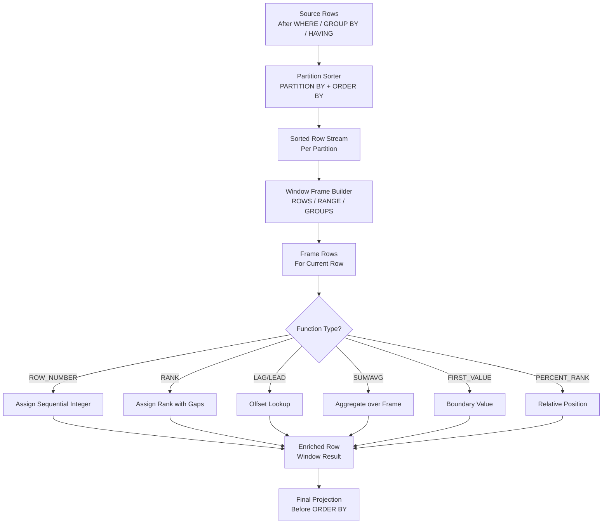

# 1. Window Functions in Snowflake

# 2. Overview

Window functions in Snowflake perform calculations across a set of rows related to the current row without collapsing the result set into groups. Unlike aggregate functions, which return one row per group, window functions return one row per input row, enriching each row with contextual computations such as running totals, rankings, percentiles, and lead/lag values.

Window functions operate over a **window frame** defined by a `PARTITION BY` clause (row grouping) and an `ORDER BY` clause (row ordering within partitions), optionally bounded by a **frame specification** (`ROWS`, `RANGE`, or `GROUPS`). They execute after `WHERE`, `GROUP BY`, and `HAVING` but before `ORDER BY` in the query processing pipeline.

This feature exists to:
- Compute running totals, moving averages, and cumulative metrics without self-joins
- Rank, deduplicate, and assign row numbers within ordered sets
- Access values from preceding or following rows via `LAG` and `LEAD`
- Calculate percentiles and distribution statistics across ordered windows
- Perform offset-based comparisons and gap analysis

The intended consumers are analytics engineers modeling time-series data, data scientists performing cohort analysis, BI developers implementing ranking and pagination, and SnowPro Advanced exam candidates who must understand frame semantics, `NULLS FIRST`/`LAST`, window ordering requirements, and performance implications of unbounded frames.

# 3. SQL Object Summary

| Object/Feature | Type | Purpose | Source Objects or Inputs | Output Object or Observable Behavior | Execution Mode or Invocation Method |
|---|---|---|---|---|---|
| [ROW_NUMBER](SQL Object Summary/ROW_NUMBER.md) | Window function | Assign unique sequential integer per partition | `PARTITION BY`, `ORDER BY` | Integer 1..N per partition | Per-row during query execution |
| [RANK](SQL Object Summary/RANK.md) | Window function | Assign rank with gaps for ties | `PARTITION BY`, `ORDER BY` | Integer rank; ties share rank, next rank skips | Per-row during query execution |
| [DENSE_RANK](SQL Object Summary/DENSE_RANK.md) | Window function | Assign rank without gaps for ties | `PARTITION BY`, `ORDER BY` | Integer rank; ties share rank, next rank consecutive | Per-row during query execution |
| [NTILE](SQL Object Summary/NTILE.md) | Window function | Distribute rows into N buckets | `PARTITION BY`, `ORDER BY`, bucket count | Integer bucket number 1..N | Per-row during query execution |
| [LAG](SQL Object Summary/LAG.md) | Window function | Access preceding row value | `PARTITION BY`, `ORDER BY`, offset | Value from N rows before current | Per-row during query execution |
| [LEAD](SQL Object Summary/LEAD.md) | Window function | Access following row value | `PARTITION BY`, `ORDER BY`, offset | Value from N rows after current | Per-row during query execution |
| [FIRST_VALUE](SQL Object Summary/FIRST_VALUE.md) | Window function | First value in window frame | `PARTITION BY`, `ORDER BY`, frame | First ordered value | Per-row during query execution |
| [LAST_VALUE](SQL Object Summary/LAST_VALUE.md) | Window function | Last value in window frame | `PARTITION BY`, `ORDER BY`, frame | Last ordered value | Per-row during query execution |
| [NTH_VALUE](SQL Object Summary/NTH_VALUE.md) | Window function | Nth value in window frame | `PARTITION BY`, `ORDER BY`, frame, N | Nth ordered value | Per-row during query execution |
| [SUM/AVG/COUNT (window)](SQL Object Summary/SUMAVGCOUNT (window).md) | Aggregate window function | Running/cumulative aggregates | `PARTITION BY`, `ORDER BY`, frame | Cumulative or sliding aggregate | Per-row during query execution |
| [MIN/MAX (window)](SQL Object Summary/MINMAX (window).md) | Aggregate window function | Running extremum | `PARTITION BY`, `ORDER BY`, frame | Sliding minimum/maximum | Per-row during query execution |
| [PERCENT_RANK](SQL Object Summary/PERCENT_RANK.md) | Window function | Relative rank within partition | `PARTITION BY`, `ORDER BY` | Float 0..1 | Per-row during query execution |
| [CUME_DIST](SQL Object Summary/CUME_DIST.md) | Window function | Cumulative distribution | `PARTITION BY`, `ORDER BY` | Float 0..1 | Per-row during query execution |
| [PERCENTILE_CONT](SQL Object Summary/PERCENTILE_CONT.md) | Window function | Continuous percentile | `WITHIN GROUP (ORDER BY)`, percentile | Interpolated percentile value | Per-row during query execution |
| [PERCENTILE_DISC](SQL Object Summary/PERCENTILE_DISC.md) | Window function | Discrete percentile | `WITHIN GROUP (ORDER BY)`, percentile | Exact percentile value | Per-row during query execution |
| [RATIO_TO_REPORT](SQL Object Summary/RATIO_TO_REPORT.md) | Window function | Proportion of partition total | `PARTITION BY`, value expression | Float proportion | Per-row during query execution |
| [LISTAGG (window)](SQL Object Summary/LISTAGG (window).md) | Window function | Ordered string collection per frame | `PARTITION BY`, `ORDER BY`, frame | Concatenated string | Per-row during query execution |
| [ROWS](SQL Object Summary/ROWS.md) | Frame unit | Row-based frame bounds | `UNBOUNDED PRECEDING`, `N PRECEDING`, `CURRENT ROW`, `N FOLLOWING`, `UNBOUNDED FOLLOWING` | Frame boundary | Window specification |
| [RANGE](SQL Object Summary/RANGE.md) | Frame unit | Value-based frame bounds | Same keywords as ROWS | Frame boundary based on ORDER BY value differences | Window specification |
| [GROUPS](SQL Object Summary/GROUPS.md) | Frame unit | Peer-group-based frame bounds | Same keywords as ROWS | Frame boundary based on peer groups | Window specification |
| [NULLS FIRST / NULLS LAST](SQL Object Summary/NULLS FIRST  NULLS LAST.md) | Ordering modifier | Null placement in ordering | `NULLS FIRST`, `NULLS LAST` | Null ordering position | `ORDER BY` clause |

# 4. Architecture

Window functions execute in a dedicated query operator that maintains ordered partition state in memory. The engine sorts rows by partition and order keys, then scans the sorted stream to compute window results. Frame specifications define which rows contribute to each function evaluation.

# 5. Data Flow / Process Flow

## Step 1: Row Qualification
- **Input:** Rows after `WHERE`, `GROUP BY`, and `HAVING` processing
- **Transformation:** Only qualified rows enter window computation
- **Output:** Row set for window evaluation
- **Purpose:** Filter data before window framing

## Step 2: Partition and Order
- **Input:** Qualified rows
- **Transformation:** Rows are sorted by `PARTITION BY` expressions, then by `ORDER BY` expressions within each partition
- **Output:** Sorted row stream partitioned by key values
- **Purpose:** Define the ordered context for window computation

## Step 3: Frame Construction
- **Input:** Sorted rows within each partition
- **Transformation:** For each current row, the engine identifies which rows belong to its window frame based on `ROWS`/`RANGE`/`GROUPS` specification
- **Output:** Frame row set per current row
- **Purpose:** Bound the set of rows contributing to the function

## Step 4: Function Evaluation
- **Input:** Current row and its frame rows
- **Transformation:** Window-specific logic computes the result (rank, offset value, aggregate over frame, etc.)
- **Output:** Window function result for current row
- **Purpose:** Produce the contextual computation

## Step 5: Result Integration
- **Input:** Original row plus window function result
- **Transformation:** Result is appended to the row; row cardinality preserved
- **Output:** Enriched result set
- **Purpose:** Return one row per input with window values

# 6. Logical Breakdown

## Component: Partition Sorter
- **Responsibility:** Group and order rows for window evaluation
- **Inputs:** `PARTITION BY` and `ORDER BY` expressions
- **Outputs:** Sorted row stream
- **Dependencies:** Sufficient memory for sort; spill to disk if memory exceeded
- **Failure Modes:** Very large partitions may cause memory pressure; missing `ORDER BY` where required causes error or undefined behavior

## Component: Frame Builder
- **Responsibility:** Define which rows participate in each window computation
- **Inputs:** Frame specification (`ROWS`/`RANGE`/`GROUPS` with bounds)
- **Outputs:** Frame row set per current row
- **Dependencies:** `ORDER BY` must be present for frame bounds to be meaningful
- **Failure Modes:** `RANGE` frames require single `ORDER BY` expression; `GROUPS` requires `ORDER BY`

## Component: Ranking Engine
- **Responsibility:** Assign ordinal or rank values
- **Inputs:** Ordered partition rows
- **Outputs:** `ROW_NUMBER`, `RANK`, `DENSE_RANK`, `NTILE` values
- **Dependencies:** `ORDER BY` required
- **Failure Modes:** `NTILE` with fewer rows than buckets assigns 1 row per bucket until exhausted

## Component: Offset Engine
- **Responsibility:** Access values from other rows in the partition
- **Inputs:** Ordered partition, offset value, default for out-of-bounds
- **Outputs:** `LAG`/`LEAD` values
- **Dependencies:** `ORDER BY` required
- **Failure Modes:** Offset beyond partition boundary returns NULL or specified default

## Component: Boundary Value Engine
- **Responsibility:** Extract first, last, or Nth value in frame
- **Inputs:** Frame rows, position
- **Outputs:** `FIRST_VALUE`, `LAST_VALUE`, `NTH_VALUE`
- **Dependencies:** Frame definition
- **Failure Modes:** `LAST_VALUE` without explicit frame defaults to `RANGE UNBOUNDED PRECEDING AND CURRENT ROW`, which always returns current row; must specify `ROWS BETWEEN UNBOUNDED PRECEDING AND UNBOUNDED FOLLOWING` for true last value

## Component: Aggregate Window Engine
- **Responsibility:** Compute aggregates over sliding or expanding frames
- **Inputs:** Frame rows, aggregate function
- **Outputs:** Running sum, average, count, min, max
- **Dependencies:** Frame definition
- **Failure Modes:** Unbounded frames may accumulate large values causing overflow

## Component: Distribution Engine
- **Responsibility:** Compute percentile and distribution metrics
- **Inputs:** Ordered partition, percentile value
- **Outputs:** `PERCENT_RANK`, `CUME_DIST`, `PERCENTILE_CONT`, `PERCENTILE_DISC`
- **Dependencies:** `ORDER BY` required
- **Failure Modes:** `PERCENTILE_CONT` interpolates between values; `PERCENTILE_DISC` returns exact row value

# 7. Data Model

## Query Result with Window Functions

| Column | Role | Grain | Notes |
|---|---|---|---|
| [Original columns](Query Result with Window Functions/Original columns.md) | Source data | One per row | From input row set |
| [`ROW_NUMBER()`](Query Result with Window Functions/ROW_NUMBER().md) | Ranking | One per row | Unique within partition |
| [`RANK()`](Query Result with Window Functions/RANK().md) | Ranking | One per row | With gaps for ties |
| [`DENSE_RANK()`](Query Result with Window Functions/DENSE_RANK().md) | Ranking | One per row | Without gaps for ties |
| [`LAG(col, offset)`](Query Result with Window Functions/LAG(col, offset).md) | Offset | One per row | Value from preceding row |
| [`LEAD(col, offset)`](Query Result with Window Functions/LEAD(col, offset).md) | Offset | One per row | Value from following row |
| [`SUM(col) OVER (...)`](Query Result with Window Functions/SUM(col) OVER (...).md) | Aggregate window | One per row | Cumulative or sliding sum |
| [`PERCENT_RANK()`](Query Result with Window Functions/PERCENT_RANK().md) | Distribution | One per row | Relative position 0..1 |

## Grain
One row per input row (window functions do not change cardinality).

## Window Frame Specifications

| Frame Type | Unit | Use Case | Performance |
|---|---|---|---|
| [`ROWS`](Parameters  Variables  Configuration/ROWS.md) | Physical row offset | Running totals, fixed lookback | Fast; simple arithmetic |
| [`RANGE`](Parameters  Variables  Configuration/RANGE.md) | Value difference from ORDER BY | Value-based windows (e.g., 7 days) | Slower; requires value comparison |
| [`GROUPS`](Parameters  Variables  Configuration/GROUPS.md) | Peer group offset | Tie-aware windows | Moderate; peer group tracking |

## Default Frame Behavior

| Function Category | Default Frame | Notes |
|---|---|---|
| [Ranking (`ROW_NUMBER`, `RANK`, etc.)](Default Frame Behavior/Ranking (ROW_NUMBER, RANK, etc.).md) | `RANGE UNBOUNDED PRECEDING AND CURRENT ROW` | Frame irrelevant for ranking |
| [Offset (`LAG`, `LEAD`)](Default Frame Behavior/Offset (LAG, LEAD).md) | Row-based implicit | Offset is physical rows |
| [Aggregate window (`SUM`, `AVG`)](Default Frame Behavior/Aggregate window (SUM, AVG).md) | `RANGE UNBOUNDED PRECEDING AND CURRENT ROW` | Cumulative from partition start |
| [`FIRST_VALUE`, `NTH_VALUE`](Default Frame Behavior/FIRST_VALUE, NTH_VALUE.md) | `RANGE UNBOUNDED PRECEDING AND CURRENT ROW` | Must override for full partition |
| [`LAST_VALUE`](Default Frame Behavior/LAST_VALUE.md) | `RANGE UNBOUNDED PRECEDING AND CURRENT ROW` | **Always returns current row unless frame overridden** |

# 8. Business Logic

## ROW_NUMBER Semantics
- Assigns unique sequential integers starting at 1 within each partition
- No ties; every row gets a distinct number
- Used for deduplication (`QUALIFY ROW_NUMBER() = 1`), pagination, and sequence generation
- Requires `ORDER BY`; without it, order is undefined

## RANK vs. DENSE_RANK
- `RANK`: Ties receive same rank; next rank skips (1, 2, 2, 4)
- `DENSE_RANK`: Ties receive same rank; next rank is consecutive (1, 2, 2, 3)
- Use `RANK` when gaps reflect the true position; use `DENSE_RANK` for consecutive ranking

## NTILE Semantics
- Divides partition into N approximately equal buckets
- Bucket 1 contains the lowest values per ORDER BY
- If rows not evenly divisible, lower-numbered buckets get extra rows
- Used for quartile, decile, and percentile bucket assignment

## LAG and LEAD Semantics
- `LAG(col, offset, default)` accesses value from N rows before current
- `LEAD(col, offset, default)` accesses value from N rows after current
- Offset defaults to 1; default for out-of-bounds defaults to NULL
- Used for period-over-period comparisons, gap detection, and forward/backward fills

## FIRST_VALUE, LAST_VALUE, NTH_VALUE
- `FIRST_VALUE(col)` returns first value in frame per ORDER BY
- `LAST_VALUE(col)` returns last value in frame; **critical**: default frame is `RANGE UNBOUNDED PRECEDING AND CURRENT ROW`, so `LAST_VALUE` without explicit frame returns current row value
- To get true last value of partition: `LAST_VALUE(col) OVER (PARTITION BY ... ORDER BY ... ROWS BETWEEN UNBOUNDED PRECEDING AND UNBOUNDED FOLLOWING)`
- `NTH_VALUE(col, N)` returns Nth value in frame

## Aggregate Window Functions
- `SUM(col) OVER (ORDER BY ...)` computes cumulative sum from partition start to current row
- `SUM(col) OVER (ORDER BY ... ROWS BETWEEN 3 PRECEDING AND CURRENT ROW)` computes 4-row moving sum
- `AVG`, `COUNT`, `MIN`, `MAX` work similarly over frames
- Used for running totals, moving averages, and rolling metrics

## Frame Specification Rules
- `ROWS`: Frame boundaries are physical row offsets
  - `ROWS UNBOUNDED PRECEDING`: All rows from partition start to current
  - `ROWS BETWEEN 3 PRECEDING AND 3 FOLLOWING`: 7-row centered window
  - `ROWS BETWEEN CURRENT ROW AND UNBOUNDED FOLLOWING`: Current row to partition end
- `RANGE`: Frame boundaries are value differences from current row's ORDER BY value
  - `RANGE BETWEEN INTERVAL '7 DAYS' PRECEDING AND CURRENT ROW`: All rows within 7 days
  - Requires single `ORDER BY` expression of numeric or interval type
- `GROUPS`: Frame boundaries are peer group offsets
  - `GROUPS BETWEEN 1 PRECEDING AND 1 FOLLOWING`: Current peer group plus adjacent peer groups
  - Peer groups are rows with equal ORDER BY values

## NULLS FIRST / NULLS LAST
- Controls whether NULL values appear before or after non-NULL values in ordering
- Default: `NULLS LAST` for ASC, `NULLS FIRST` for DESC (exam trap: verify behavior)
- Explicit `NULLS FIRST` or `NULLS LAST` overrides default

## PERCENT_RANK and CUME_DIST
- `PERCENT_RANK()`: `(RANK - 1) / (total rows in partition - 1)`; returns 0 for first row, 1 for last
- `CUME_DIST()`: Number of rows with value <= current value / total rows; cumulative distribution
- Both require `ORDER BY`

## PERCENTILE_CONT and PERCENTILE_DISC
- `PERCENTILE_CONT(0.5) WITHIN GROUP (ORDER BY col)`: Continuous median; interpolates between values
- `PERCENTILE_DISC(0.5) WITHIN GROUP (ORDER BY col)`: Discrete median; returns exact row value
- Can be used as window functions with `OVER()` or as aggregates without

## RATIO_TO_REPORT
- `RATIO_TO_REPORT(col) OVER (PARTITION BY ...)`: `col / SUM(col) OVER (same partition)`
- Returns proportion of row's value to partition total
- Useful for percentage contribution analysis

## QUALIFY Clause
- `QUALIFY` filters rows after window function evaluation
- Equivalent to `HAVING` for window functions
- Can reference window functions directly without subqueries
- Example: `QUALIFY ROW_NUMBER() OVER (PARTITION BY key ORDER BY ts DESC) = 1`

# 9. Transformations

## Unordered Rows to Ranked Rows
- **Source:** Raw rows with ordering criteria
- **Output:** Rows with rank/row number per partition
- **Logic:** `ROW_NUMBER()`, `RANK()`, or `DENSE_RANK()` over ordered partition
- **Meaning:** Ordinal assignment for deduplication or tiering
- **Impact:** Enables top-N selection, duplicate removal, and sequence generation

## Time-Series to Offset Comparison
- **Source:** Time-ordered rows
- **Output:** Rows with previous/next period values
- **Logic:** `LAG(metric, 1)` and `LEAD(metric, 1)` over time-ordered partition
- **Meaning:** Period-over-period analysis
- **Impact:** Enables trend detection and variance calculation

## Running Total Calculation
- **Source:** Chronologically ordered transaction rows
- **Output:** Rows with cumulative sum
- **Logic:** `SUM(amount) OVER (PARTITION BY account ORDER BY date ROWS UNBOUNDED PRECEDING)`
- **Meaning:** Balance or cumulative metric computation
- **Impact:** Enables running balance reports without self-joins

## Sliding Window Average
- **Source:** Time-series or ordered rows
- **Output:** Rows with moving average
- **Logic:** `AVG(metric) OVER (ORDER BY ts ROWS BETWEEN 6 PRECEDING AND CURRENT ROW)`
- **Meaning:** 7-period moving average
- **Impact:** Smooths noise and reveals trends

## Partition to Proportion
- **Source:** Rows with numeric values in categories
- **Output:** Rows with percentage of category total
- **Logic:** `RATIO_TO_REPORT(sales) OVER (PARTITION BY region)`
- **Meaning:** Relative contribution analysis
- **Impact:** Enables percentage breakdowns without subqueries

## Distribution to Percentile
- **Source:** Ordered numeric values
- **Output:** Rows with percentile position
- **Logic:** `PERCENT_RANK() OVER (ORDER BY value)` or `PERCENTILE_CONT(0.9) WITHIN GROUP (ORDER BY value)`
- **Meaning:** Relative standing in distribution
- **Impact:** Enables SLA analysis and outlier detection

# 10. Parameters / Variables / Configuration

| Name | Type | Purpose | Allowed Values | Default | Where Used | Effect |
|---|---|---|---|---|---|---|
| [`PARTITION BY`](Parameters  Variables  Configuration/PARTITION BY.md) | Window clause | Row grouping | Expression list | None (single partition) | `OVER()` | Divides rows into independent groups |
| [`ORDER BY`](Parameters  Variables  Configuration/ORDER BY.md) | Window clause | Row ordering | Expression list | None | `OVER()` | Defines row sequence within partition |
| [`ROWS`](Parameters  Variables  Configuration/ROWS.md) | Frame unit | Physical bounds | `UNBOUNDED PRECEDING`, `N PRECEDING`, `CURRENT ROW`, `N FOLLOWING`, `UNBOUNDED FOLLOWING` | `RANGE UNBOUNDED PRECEDING AND CURRENT ROW` | `OVER()` | Frame based on row position |
| [`RANGE`](Parameters  Variables  Configuration/RANGE.md) | Frame unit | Value bounds | Same as ROWS | Same default | `OVER()` | Frame based on ORDER BY value difference |
| [`GROUPS`](Parameters  Variables  Configuration/GROUPS.md) | Frame unit | Peer bounds | Same as ROWS | Same default | `OVER()` | Frame based on peer group position |
| [`NULLS FIRST`](Parameters  Variables  Configuration/NULLS FIRST.md) | Ordering modifier | Null placement | `NULLS FIRST`, `NULLS LAST` | `NULLS LAST` (ASC), `NULLS FIRST` (DESC) | `ORDER BY` | Controls null ordering |
| [`LAG/LEAD offset`](Parameters  Variables  Configuration/LAGLEAD offset.md) | Function arg | Row offset | Integer >= 0 | `1` | `LAG`/`LEAD` | Number of rows to look back/forward |
| [`LAG/LEAD default`](Parameters  Variables  Configuration/LAGLEAD default.md) | Function arg | OOB value | Any compatible value | `NULL` | `LAG`/`LEAD` | Value when offset beyond boundary |
| [`NTILE buckets`](Parameters  Variables  Configuration/NTILE buckets.md) | Function arg | Bucket count | Integer > 0 | Required | `NTILE` | Number of groups to create |
| [`NTH_VALUE N`](Parameters  Variables  Configuration/NTH_VALUE N.md) | Function arg | Position | Integer > 0 | Required | `NTH_VALUE` | Which value to return |
| [`TIMEZONE`](Parameters  Variables  Configuration/TIMEZONE.md) | Session parameter | Temporal context | IANA timezone | `UTC` | Session | Affects date/time ordering |

# 11. APIs / Interfaces

## Interface: ROW_NUMBER / RANK / DENSE_RANK
- **Invocation:** `SELECT col, ROW_NUMBER() OVER (PARTITION BY grp ORDER BY ord) FROM table`
- **Input:** Partition and order expressions
- **Output:** Rank integer per row
- **Error Behavior:** Missing ORDER BY produces undefined ranking
- **Consumers:** Deduplication, pagination, tiering

## Interface: LAG / LEAD
- **Invocation:** `SELECT col, LAG(col, 1, 0) OVER (PARTITION BY grp ORDER BY ord) FROM table`
- **Input:** Column, offset, default
- **Output:** Offset value per row
- **Error Behavior:** Negative offset raises error
- **Consumers:** Period comparison, gap detection, fill-forward

## Interface: SUM/AVG/COUNT OVER
- **Invocation:** `SELECT col, SUM(col) OVER (PARTITION BY grp ORDER BY ord ROWS UNBOUNDED PRECEDING) FROM table`
- **Input:** Aggregate expression, window specification
- **Output:** Running aggregate per row
- **Error Behavior:** Type mismatch raises error
- **Consumers:** Running totals, moving averages

## Interface: FIRST_VALUE / LAST_VALUE
- **Invocation:** `SELECT FIRST_VALUE(col) OVER (PARTITION BY grp ORDER BY ord) FROM table`
- **Input:** Column, window specification
- **Output:** Boundary value per row
- **Error Behavior:** Default frame may not produce expected last value
- **Consumers:** Boundary extraction, baseline comparison

## Interface: PERCENTILE_CONT / PERCENTILE_DISC
- **Invocation:** `SELECT PERCENTILE_CONT(0.5) WITHIN GROUP (ORDER BY col) OVER (PARTITION BY grp) FROM table`
- **Input:** Percentile, order expression
- **Output:** Percentile value per partition
- **Error Behavior:** Non-numeric order raises error
- **Consumers:** Median, p90, p95, p99 analysis

## Interface: QUALIFY
- **Invocation:** `SELECT * FROM table QUALIFY ROW_NUMBER() OVER (PARTITION BY key ORDER BY ts DESC) = 1`
- **Input:** Window predicate
- **Output:** Filtered rows
- **Error Behavior:** References non-window expressions may raise error
- **Consumers:** Top-N, deduplication, latest record selection

# 12. Execution / Deployment

## Deduplication Pattern
- `QUALIFY ROW_NUMBER() OVER (PARTITION BY business_key ORDER BY load_timestamp DESC) = 1`
- Selects most recent row per key
- Used in staging-to-target pipelines

## Running Total Pattern
- `SUM(amount) OVER (PARTITION BY account ORDER BY transaction_date ROWS UNBOUNDED PRECEDING)`
- Computes cumulative balance
- Frame must be explicit for predictable results

## Moving Average Pattern
- `AVG(metric) OVER (ORDER BY date ROWS BETWEEN 6 PRECEDING AND CURRENT ROW)`
- 7-day moving average
- Adjust window size based on smoothing requirements

## Period Comparison Pattern
- `metric - LAG(metric, 1) OVER (ORDER BY period)` as period_change
- `metric / LAG(metric, 1) OVER (ORDER BY period) - 1` as period_growth_rate
- Used for MoM, QoQ, YoY analysis

## Percentile Analysis Pattern
- `PERCENTILE_CONT(0.5) WITHIN GROUP (ORDER BY response_time) OVER (PARTITION BY service)` as median
- `PERCENTILE_CONT(0.95) WITHIN GROUP (ORDER BY response_time) OVER (PARTITION BY service)` as p95
- Used for SLA monitoring

## Gap Detection Pattern
- `DATEDIFF(day, date, LEAD(date) OVER (ORDER BY date)) - 1` as gap_days
- Identifies missing dates in sequences

## Environment Behavior
- Development: Test window functions with small datasets; verify frame behavior
- Production: Use explicit frame specifications; avoid unbounded `LAST_VALUE` without frame override; monitor memory for large partitions

# 13. Observability

## Window Function Performance
- Monitor query profile for window sort operator time
- Large partitions require more memory for sorting and frame maintenance
- Check for disk spilling in window operators

## Frame Behavior Verification
- Test `FIRST_VALUE` and `LAST_VALUE` with explicit frames to ensure expected behavior
- Verify `LAST_VALUE` returns true partition end value, not current row

## Rank Distribution
- Monitor rank distribution for anomalies (unexpected ties, gaps)
- Validate `NTILE` bucket sizes are approximately equal

## Offset Function Accuracy
- Verify `LAG`/`LEAD` return expected values at partition boundaries
- Check default values for out-of-bounds cases

## Key Metrics
- Window operator execution time
- Partition sizes (rows per partition)
- Frame row counts per evaluation
- Memory usage in window operators
- Disk spilling frequency for large sorts

# 14. Failure Handling & Recovery

## Missing ORDER BY
- **What breaks:** Ranking functions without `ORDER BY` produce undefined results
- **Detection:** Results vary between executions; ties handled inconsistently
- **Fallback:** Add explicit `ORDER BY` to all ranking functions
- **Recovery:** Restructure query with deterministic ordering

## LAST_VALUE Returns Current Row
- **What breaks:** `LAST_VALUE` without explicit frame returns current row, not partition end
- **Detection:** All rows show same value as current row
- **Fallback:** Use `ROWS BETWEEN UNBOUNDED PRECEDING AND UNBOUNDED FOLLOWING`
- **Recovery:** Add explicit frame specification

## Memory Exhaustion in Large Partitions
- **What breaks:** Very large partitions (billions of rows) exhaust memory during sort
- **Detection:** Query timeout or memory error; disk spilling in profile
- **Fallback:** Increase warehouse size; or pre-aggregate to reduce partition size
- **Recovery:** Add `WHERE` filters; or partition data into smaller chunks

## Frame Specification Error
- **What breaks:** `RANGE` frame with multiple `ORDER BY` expressions or non-numeric type
- **Detection:** `RANGE frame requires exactly one ORDER BY expression`
- **Fallback:** Use `ROWS` instead of `RANGE`
- **Recovery:** Simplify `ORDER BY` to single expression; or cast to numeric/interval

## LAG/LEAD Offset Beyond Boundary
- **What breaks:** First rows in partition return NULL for `LAG`; last rows return NULL for `LEAD`
- **Detection:** Unexpected NULLs at partition boundaries
- **Fallback:** Specify explicit default value: `LAG(col, 1, 0)`
- **Recovery:** Handle boundary conditions in outer expression

## NTILE with Fewer Rows Than Buckets
- **What breaks:** More buckets than rows; some buckets empty
- **Detection:** Missing bucket numbers in output
- **Fallback:** Validate row count vs. bucket count before applying `NTILE`
- **Recovery:** Use `CASE` or `WIDTH_BUCKET` for custom bucketing

## QUALIFY with Non-Window References
- **What breaks:** `QUALIFY` references columns not in window context
- **Detection:** Compilation error
- **Fallback:** Use subquery with `WHERE` instead of `QUALIFY`
- **Recovery:** Ensure `QUALIFY` only references window functions and grouping keys

## Incorrect NULL Ordering
- **What breaks:** NULL values appear in unexpected positions affecting ranks or frames
- **Detection:** Rank anomalies; frame boundaries incorrect
- **Fallback:** Explicit `NULLS FIRST` or `NULLS LAST`
- **Recovery:** Add explicit null ordering to `ORDER BY`

# 15. Security & Access Control

## Privilege Requirements

| Action | Required Privilege | Object |
|---|---|---|
| [Query window functions](Privilege Requirements/Query window functions.md) | `SELECT` on table | Table |
| [Use window UDFs](Privilege Requirements/Use window UDFs.md) | `USAGE` on function | Function |

## Data Masking
- Masking policies apply to columns before window evaluation
- Window functions operate on masked values if column is masked
- `LAG`/`LEAD` may expose adjacent masked values; review if this reveals patterns

## Row Access Policies
- Row access policies filter rows before window computation
- Window results reflect only accessible rows
- Partition sizes may appear smaller than actual due to filtering

## Secure UDFs in Windows
- Secure UDFs used in `PARTITION BY` or `ORDER BY` are not introspectable
- Window results may reveal information about secure logic through ordering

# 16. Performance / Scalability Considerations

## Sort Cost
- Window functions require sorting by partition and order keys
- Sort cost is O(N log N) per partition
- Very large partitions dominate execution time

## Memory Usage
- Window operators hold partition state in memory
- Large partitions or wide frames may exceed memory and spill to disk
- Spilling dramatically degrades performance

## Frame Type Performance
- `ROWS`: Fastest; simple integer arithmetic for frame bounds
- `RANGE`: Slower; requires value comparison and range scanning
- `GROUPS`: Moderate; requires peer group tracking

## Unbounded Frames
- `ROWS UNBOUNDED PRECEDING` maintains running state efficiently
- `ROWS BETWEEN UNBOUNDED PRECEDING AND UNBOUNDED FOLLOWING` requires full partition scan per row (expensive)
- For full-partition aggregates, use aggregate window without frame or with minimal frame

## Multiple Window Functions
- Multiple window functions with same `PARTITION BY` and `ORDER BY` share the sort
- Different specifications require separate sorts
- Consolidate window specifications where possible

## QUALIFY Performance
- `QUALIFY` filters after window computation
- All rows are computed before filtering; consider pre-filtering with `WHERE` if possible
- For top-N per group, `QUALIFY` is efficient and clearer than subqueries

## Parallelization
- Partitions are processed in parallel across warehouse nodes
- Very large single partitions limit parallelism
- Ensure partitions are reasonably sized for optimal distribution

## Result Cache
- Window queries with deterministic functions and no volatile expressions are cacheable
- Non-deterministic expressions in `ORDER BY` or `PARTITION BY` disable cache

# 17. Assumptions & Constraints

## Explicit Assumptions
- The reader is writing analytical SQL requiring row-contextual computations
- Data has meaningful ordering for window framing
- Partitions are sized to fit in memory or tolerate spill

## Engine Boundaries
- Window functions execute after `GROUP BY`/`HAVING`; cannot reference non-aggregated columns from `GROUP BY` unless also in `GROUP BY`
- `RANGE` frames require exactly one `ORDER BY` expression of numeric, date, or timestamp type
- `GROUPS` frames require `ORDER BY`
- Maximum frame offset is limited by integer range
- Window functions cannot be nested (e.g., `LAG(SUM(...) OVER (...))` is invalid); use subqueries or CTEs
- `QUALIFY` is Snowflake-specific; not standard SQL
- `PERCENTILE_CONT`/`PERCENTILE_DISC` as window functions require `OVER()`; as aggregates use `WITHIN GROUP`

## Exam-Relevant Defaults
- Default frame for aggregate window functions: `RANGE UNBOUNDED PRECEDING AND CURRENT ROW`
- Default null ordering: `NULLS LAST` for ASC, `NULLS FIRST` for DESC
- `LAG`/`LEAD` default offset: `1`
- `LAG`/`LEAD` default out-of-bounds value: `NULL`
- `NTILE` requires integer argument > 0
- `LAST_VALUE` default frame returns current row, not partition end

## Ambiguities
- Exact memory limits for window operators vary by warehouse size
- Behavior of `RANGE` with `NULL` ORDER BY values is not fully specified
- `PERCENTILE_CONT` interpolation behavior for even/odd row counts may vary slightly from statistical definitions

# 18. Future Enhancements

- Always specify explicit frame clauses for `LAST_VALUE` and aggregate window functions to prevent default-frame surprises
- Use `QUALIFY` instead of subqueries for top-N and deduplication to improve readability and performance
- Replace self-joins for period comparison with `LAG`/`LEAD` to reduce complexity and improve performance
- Use `ROWS` frames instead of `RANGE` when value-based boundaries are not required for better performance
- Add `NULLS FIRST`/`LAST` explicitly to all window `ORDER BY` clauses for deterministic behavior
- Monitor query profiles for window operator spilling and increase warehouse size or reduce partition sizes when detected
- Consolidate multiple window functions with identical `PARTITION BY`/`ORDER BY` to share sort operations
- Use `APPROX_PERCENTILE` instead of exact percentile window functions for large-scale distribution analysis
- Implement boundary-condition handling in `LAG`/`LEAD` with explicit default values rather than relying on NULL
- Pre-filter rows with `WHERE` before window computation to reduce sort and frame maintenance costs
