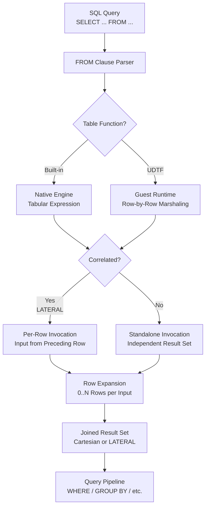

# 1. Table Functions in Snowflake

# 2. Overview

Table functions in Snowflake return a result set (zero or more rows) rather than a single scalar value. They operate as tabular expressions that can appear in the `FROM` clause of a `SELECT` statement, enabling row-set generation, semi-structured data unnesting, file content inspection, external data access, and result-set oriented transformations. Snowflake provides built-in table functions, system table functions, and user-defined table functions (UDTFs) in SQL, JavaScript, Python, Java, and Scala.

Built-in table functions include `FLATTEN` for semi-structured data, `SPLIT_TO_TABLE` for string tokenization, `GENERATOR` for synthetic row generation, `RESULT_SCAN` for query result introspection, `INFORMATION_SCHEMA` object listing functions, and external table access functions. UDTFs enable custom row-set logic for scenarios not covered by built-ins.

This feature exists to:
- Unnest nested arrays and objects into relational rows
- Generate synthetic data for testing and padding
- Access query results and metadata as queryable tables
- Integrate external data sources via custom connectors
- Implement complex ETL transformations that produce multiple output rows per input row

The intended consumers are data engineers building ELT pipelines, analytics engineers modeling nested data, platform architects integrating external systems, and SnowPro Advanced exam candidates who must understand tabular vs. scalar function semantics, `LATERAL` correlation, result-set cardinality, and UDTF execution boundaries.

# 3. SQL Object Summary

| Object/Feature | Type | Purpose | Source Objects or Inputs | Output Object or Observable Behavior | Execution Mode or Invocation Method |
|---|---|---|---|---|---|
| [FLATTEN](SQL Object Summary/FLATTEN.md) | Built-in table function | Unnest VARIANT arrays/objects into rows | VARIANT, ARRAY, or OBJECT expression | Relational rows with path, index, key, value, type | `FROM` clause with `LATERAL` |
| [SPLIT_TO_TABLE](SQL Object Summary/SPLIT_TO_TABLE.md) | Built-in table function | Tokenize string into rows | String expression, delimiter | Rows with index and token value | `FROM` clause with `LATERAL` |
| [GENERATOR](SQL Object Summary/GENERATOR.md) | Built-in table function | Generate synthetic rows | Row count or time range | Specified number of rows | `FROM` clause |
| [RESULT_SCAN](SQL Object Summary/RESULT_SCAN.md) | Built-in table function | Access query result set as table | Query ID | Rows from historical query result | `FROM` clause |
| [TABLE / INFORMATION_SCHEMA functions](SQL Object Summary/TABLE  INFORMATION_SCHEMA functions.md) | System table functions | List objects and metadata | Database/schema context | Object inventory rows | `FROM` clause |
| [EXTERNAL_TABLE_FILES](SQL Object Summary/EXTERNAL_TABLE_FILES.md) | System table function | List files referenced by external table | External table name | File metadata rows | `FROM` clause |
| [EXTERNAL_TABLE_PARTITIONS](SQL Object Summary/EXTERNAL_TABLE_PARTITIONS.md) | System table function | List partitions of external table | External table name | Partition metadata rows | `FROM` clause |
| [SQL UDTF](SQL Object Summary/SQL UDTF.md) | User-defined table function | Custom row-set logic in SQL | Input arguments | Result set rows | `CREATE FUNCTION` with `RETURNS TABLE` |
| [JavaScript/Python/Java UDTF](SQL Object Summary/JavaScriptPythonJava UDTF.md) | User-defined table function | Custom row-set logic in guest runtime | Input arguments | Result set rows | `CREATE FUNCTION` with `RETURNS TABLE` |
| [LATERAL](SQL Object Summary/LATERAL.md) | Join modifier | Correlate table function to preceding row | Table function expression | Correlated row expansion | `FROM` clause |

# 4. Architecture

Table functions execute in the query engine's tabular expression evaluator. Built-in functions are native to the engine. UDTFs execute in sandboxed runtimes with row-by-row data marshaling. `LATERAL` correlation binds table function invocations to rows from preceding `FROM` clause items, enabling per-row expansion.

# 5. Data Flow / Process Flow

## Step 1: Table Function Invocation
- **Input:** `FROM` clause containing table function reference
- **Transformation:** Parser identifies table function, validates argument types and count, resolves output column schema
- **Output:** Bound table function expression ready for execution
- **Purpose:** Establish the tabular source

## Step 2: Correlation Resolution (if LATERAL)
- **Input:** Preceding `FROM` clause row and `LATERAL` table function arguments
- **Transformation:** For each row from the left source, the table function is invoked with correlated argument values
- **Output:** Expanded rows per left input row
- **Purpose:** Enable per-row tabular expansion

## Step 3: Row Generation
- **Input:** Table function arguments (scalar values or correlated columns)
- **Transformation:** Built-in functions execute native logic; UDTFs marshal data to guest runtime, execute row-generation logic, marshal results back
- **Output:** Result set rows with defined schema
- **Purpose:** Produce tabular output

## Step 4: Join Integration
- **Input:** Left source rows and expanded table function rows
- **Transformation:** `LATERAL` join combines each left row with its expanded rows; non-correlated table functions produce Cartesian product
- **Output:** Integrated row set
- **Purpose:** Combine tabular sources

## Step 5: Pipeline Continuation
- **Input:** Combined row set from `FROM` clause
- **Transformation:** Standard query processing (`WHERE`, `GROUP BY`, `HAVING`, `SELECT`, `ORDER BY`)
- **Output:** Final query result
- **Purpose:** Complete the query

# 6. Logical Breakdown

## Component: FLATTEN Engine
- **Responsibility:** Unnest semi-structured data into relational rows
- **Inputs:** `VARIANT`, `ARRAY`, or `OBJECT` expression; optional `PATH`, `OUTER`, `RECURSIVE`, `MODE` parameters
- **Outputs:** Rows with `SEQ`, `KEY`, `PATH`, `INDEX`, `VALUE`, `THIS` columns
- **Dependencies:** Input must be valid semi-structured data
- **Failure Modes:** Invalid JSON path; `OUTER = TRUE` returns null row for empty input; deep recursion may hit limits

## Component: SPLIT_TO_TABLE Engine
- **Responsibility:** Tokenize strings into rows
- **Inputs:** String expression, delimiter string
- **Outputs:** Rows with `INDEX` (1-based) and `VALUE` columns
- **Dependencies:** Input must be string or castable to string
- **Failure Modes:** Null input returns no rows unless handled; empty string returns no rows

## Component: GENERATOR Engine
- **Responsibility:** Produce synthetic rows
- **Inputs:** `ROWCOUNT` integer or `TIMESTEP` range
- **Outputs:** Specified number of rows with `SEQ` or `TIMESTAMP` column
- **Dependencies:** None
- **Failure Modes:** Very large row counts may timeout or exhaust resources

## Component: RESULT_SCAN Engine
- **Responsibility:** Expose query result as queryable table
- **Inputs:** Query ID from `QUERY_HISTORY` or `LAST_QUERY_ID()`
- **Outputs:** Rows identical to the original query result
- **Dependencies:** Query must have executed; result must be in cache (typically 24 hours for result cache)
- **Failure Modes:** Query ID not found; result expired from cache; insufficient privileges

## Component: System Table Function Library
- **Responsibility:** Provide metadata and inventory access
- **Inputs:** Context parameters (database, schema, object type filters)
- **Outputs:** Object metadata rows
- **Dependencies:** Appropriate privileges on metadata views
- **Failure Modes:** Insufficient privileges return empty sets

## Component: SQL UDTF Engine
- **Responsibility:** Execute custom SQL returning row sets
- **Inputs:** Arguments bound to UDTF parameters
- **Outputs:** Tabular result per invocation
- **Dependencies:** Objects referenced in UDTF body must be accessible
- **Failure Modes:** Recursive UDTFs may hit limits; complex UDTFs may not optimize well

## Component: Guest Runtime UDTF Engine
- **Responsibility:** Execute Python/JavaScript/Java logic producing row sets
- **Inputs:** Marshaled SQL values
- **Outputs:** Marshaled row sets
- **Dependencies:** Runtime sandbox; memory and timeout limits
- **Failure Modes:** Memory exhaustion; timeout; serialization failures; uncaught exceptions

## Component: LATERAL Correlator
- **Responsibility:** Bind table function to preceding row context
- **Inputs:** Left source row, correlated table function arguments
- **Outputs:** Expanded rows per left row
- **Dependencies:** Table function arguments must reference left source columns
- **Failure Modes:** Non-correlated references in `LATERAL` context raise errors

# 7. Data Model

## FLATTEN Output Schema

| Column | Role | Type | Notes |
|---|---|---|---|
| [`SEQ`](FLATTEN Output Schema/SEQ.md) | Sequence | NUMBER | Unique within flatten invocation |
| [`KEY`](FLATTEN Output Schema/KEY.md) | Object key | VARCHAR | Key for object elements; null for arrays |
| [`PATH`](FLATTEN Output Schema/PATH.md) | JSON path | VARCHAR | Full path to element |
| [`INDEX`](SPLIT_TO_TABLE Output Schema/INDEX.md) | Array index | NUMBER | 0-based index for array elements; null for objects |
| [`VALUE`](SPLIT_TO_TABLE Output Schema/VALUE.md) | Element value | VARIANT | The flattened value |
| [`THIS`](FLATTEN Output Schema/THIS.md) | Parent context | VARIANT | Parent object/array containing element |

## Grain
One row per element in the flattened structure.

## SPLIT_TO_TABLE Output Schema

| Column | Role | Type | Notes |
|---|---|---|---|
| [`INDEX`](SPLIT_TO_TABLE Output Schema/INDEX.md) | Position | NUMBER | 1-based token index |
| [`VALUE`](SPLIT_TO_TABLE Output Schema/VALUE.md) | Token | VARCHAR | Substring between delimiters |

## Grain
One row per token.

## GENERATOR Output Schema

| Column | Role | Type | Notes |
|---|---|---|---|
| [`SEQ` / `TIMESTAMP`](GENERATOR Output Schema/SEQ  TIMESTAMP.md) | Generated value | NUMBER / TIMESTAMP | Sequence number or time step |

## Grain
One row per generated value.

## UDTF Output Schema

| Column | Role | Type | Notes |
|---|---|---|---|
| [User-defined columns](UDTF Output Schema/User-defined columns.md) | Output data | As declared | Defined in `RETURNS TABLE (...)` |

## Grain
One row per emitted row from UDTF logic.

# 8. Business Logic

## FLATTEN Semantics
- `FLATTEN(input => expr)` unnests top-level array elements or object key-value pairs
- `FLATTEN(input => expr, path => 'path.to.nested')` unnests nested structures
- `FLATTEN(input => expr, recursive => TRUE)` recursively flattens all nested levels
- `FLATTEN(input => expr, outer => TRUE)` returns a single null row if input is empty or null
- `FLATTEN(input => expr, mode => 'OBJECT')` treats input as object; `mode => 'ARRAY'` as array
- Output `VALUE` is VARIANT; cast to specific types in outer query

## SPLIT_TO_TABLE Semantics
- `SPLIT_TO_TABLE(string, delimiter)` splits string on delimiter boundaries
- Delimiter is a literal string, not a regex
- Consecutive delimiters produce empty tokens
- Leading/trailing delimiters produce empty first/last tokens
- Null input produces no rows

## GENERATOR Semantics
- `GENERATOR(ROWCOUNT => n)` produces n rows with `SEQ` column (0-based)
- `GENERATOR(TIMESTEP => '1 MINUTE', START => '...', STOP => '...')` produces time-series rows
- Used for padding, date spine generation, and synthetic test data
- Very large `ROWCOUNT` values may hit resource limits

## RESULT_SCAN Semantics
- `RESULT_SCAN(query_id)` returns the result set of a previously executed query
- Query ID obtained from `QUERY_HISTORY.QUERY_ID` or `LAST_QUERY_ID()`
- Result must be in result cache (typically 24 hours)
- Useful for inspecting `SHOW` command results, `COPY INTO` results, or query outputs programmatically
- Column names may differ from original query aliases

## LATERAL Correlation Semantics
- `LATERAL` enables table function arguments to reference columns from preceding `FROM` clause items
- Without `LATERAL`, table function executes once independently
- `LATERAL` is implicit for built-in table functions in many contexts; explicit for clarity
- If table function returns zero rows for a left row, that left row is excluded unless `LEFT JOIN LATERAL` is used

## UDTF Semantics
- Defined with `CREATE FUNCTION ... RETURNS TABLE (col1 TYPE1, col2 TYPE2, ...)`
- SQL UDTF body is a `SELECT` statement returning matching column types
- Guest runtime UDTFs use `process` method (Python) or callback (JavaScript) to emit rows
- UDTFs execute per row when correlated via `LATERAL`
- Secure UDTFs obscure definition from `GET_DDL`

## System Table Functions
- `INFORMATION_SCHEMA.*` functions list tables, views, columns, etc.
- `EXTERNAL_TABLE_FILES(table_name)` lists files backing an external table
- `EXTERNAL_TABLE_PARTITIONS(table_name)` lists partitions
- Output schemas vary by function; consult documentation

# 9. Transformations

## Nested VARIANT to Relational Rows
- **Source:** JSON array or object in VARIANT column
- **Output:** Flat rows with path, key, index, and value
- **Logic:** `FLATTEN(input => variant_col)`
- **Meaning:** Semi-structured to structured conversion
- **Impact:** Enables SQL analysis of nested JSON/Avro/Parquet data

## String to Token Rows
- **Source:** Delimited string
- **Output:** Rows with position and token value
- **Logic:** `SPLIT_TO_TABLE(string_col, ',')`
- **Meaning:** String tokenization for normalization
- **Impact:** Enables one-to-many expansion from CSV-like strings

## Scalar to Row Set
- **Source:** Scalar value or expression
- **Output:** Multiple rows per input
- **Logic:** UDTF or `GENERATOR` with `LATERAL`
- **Meaning:** Row multiplication and expansion
- **Impact:** Enables complex ETL transformations producing multiple outputs

## Query Result to Queryable Table
- **Source:** Previous query execution
- **Output:** Rows from result cache as table
- **Logic:** `RESULT_SCAN(query_id)`
- **Meaning:** Result introspection and reuse
- **Impact:** Enables programmatic access to `SHOW` results and query outputs

## External Table File to Metadata
- **Source:** External table definition
- **Output:** File listing with metadata
- **Logic:** `EXTERNAL_TABLE_FILES('ext_table')`
- **Meaning:** Storage-level observability
- **Impact:** Enables file-level lineage and monitoring

## Per-Row Expansion
- **Source:** Left table row with nested data
- **Output:** Expanded rows correlated to left row
- **Logic:** `FROM left_table, LATERAL FLATTEN(input => left_table.nested_col)`
- **Meaning:** One-to-many join without pre-aggregation
- **Impact:** Enables normalized analysis of denormalized source data

# 10. Parameters / Variables / Configuration

| Name | Type | Purpose | Allowed Values | Default | Where Used | Effect |
|---|---|---|---|---|---|---|
| [`input`](Parameters  Variables  Configuration/input.md) | FLATTEN arg | Source data | VARIANT/ARRAY/OBJECT expression | Required | `FLATTEN` | Data to flatten |
| [`path`](Parameters  Variables  Configuration/path.md) | FLATTEN arg | JSON path | String path | None (root) | `FLATTEN` | Nested structure target |
| [`outer`](Parameters  Variables  Configuration/outer.md) | FLATTEN arg | Empty handling | `TRUE`, `FALSE` | `FALSE` | `FLATTEN` | Returns null row for empty input |
| [`recursive`](Parameters  Variables  Configuration/recursive.md) | FLATTEN arg | Deep flatten | `TRUE`, `FALSE` | `FALSE` | `FLATTEN` | Recursively flattens nested structures |
| [`mode`](Parameters  Variables  Configuration/mode.md) | FLATTEN arg | Input type hint | `'OBJECT'`, `'ARRAY'`, `'BOTH'` | `'BOTH'` | `FLATTEN` | Treats input as object or array |
| [`ROWCOUNT`](Parameters  Variables  Configuration/ROWCOUNT.md) | GENERATOR arg | Row count | Integer >= 0 | None | `GENERATOR` | Number of rows to generate |
| [`TIMESTEP`](Parameters  Variables  Configuration/TIMESTEP.md) | GENERATOR arg | Time interval | Interval string | None | `GENERATOR` | Time increment for series |
| [`START`](Parameters  Variables  Configuration/START.md) | GENERATOR arg | Series start | Timestamp | None | `GENERATOR` | Series start time |
| [`STOP`](Parameters  Variables  Configuration/STOP.md) | GENERATOR arg | Series end | Timestamp | None | `GENERATOR` | Series end time |
| [`query_id`](Parameters  Variables  Configuration/query_id.md) | RESULT_SCAN arg | Source query | Valid query ID | Required | `RESULT_SCAN` | Query to introspect |
| [`LANGUAGE`](Parameters  Variables  Configuration/LANGUAGE.md) | UDTF property | Runtime | `SQL`, `JAVASCRIPT`, `PYTHON`, `JAVA`, `SCALA` | `SQL` | `CREATE FUNCTION` | Execution environment |
| [`RETURNS TABLE`](Parameters  Variables  Configuration/RETURNS TABLE.md) | UDTF property | Output schema | Column list with types | Required | `CREATE FUNCTION` | Defines result structure |
| [`IS_SECURE`](Parameters  Variables  Configuration/IS_SECURE.md) | UDTF property | Visibility | `TRUE`, `FALSE` | `FALSE` | `CREATE FUNCTION` | Obscures definition |

# 11. APIs / Interfaces

## Interface: FLATTEN
- **Invocation:** `SELECT f.* FROM table t, LATERAL FLATTEN(input => t.variant_col) f`
- **Input:** VARIANT/ARRAY/OBJECT expression; optional path, outer, recursive, mode
- **Output:** Rows with SEQ, KEY, PATH, INDEX, VALUE, THIS
- **Error Behavior:** Invalid path returns empty set; type mismatch raises error
- **Consumers:** JSON/Avro/Parquet unnesting, nested data analysis

## Interface: SPLIT_TO_TABLE
- **Invocation:** `SELECT s.* FROM table t, LATERAL SPLIT_TO_TABLE(t.csv_col, ',') s`
- **Input:** String expression, delimiter
- **Output:** Rows with INDEX and VALUE
- **Error Behavior:** Null input returns no rows
- **Consumers:** String tokenization, tag expansion, multi-value parsing

## Interface: GENERATOR
- **Invocation:** `SELECT * FROM TABLE(GENERATOR(ROWCOUNT => 1000))`
- **Input:** Row count or time range
- **Output:** Synthetic rows
- **Error Behavior:** Very large counts may timeout
- **Consumers:** Test data, date spines, padding

## Interface: RESULT_SCAN
- **Invocation:** `SELECT * FROM TABLE(RESULT_SCAN(LAST_QUERY_ID()))`
- **Input:** Query ID
- **Output:** Rows from cached result
- **Error Behavior:** Fails if query ID invalid or result expired
- **Consumers:** Result introspection, `SHOW` command processing

## Interface: EXTERNAL_TABLE_FILES
- **Invocation:** `SELECT * FROM TABLE(EXTERNAL_TABLE_FILES('my_db.my_schema.my_ext_table'))`
- **Input:** External table name
- **Output:** File metadata rows
- **Error Behavior:** Fails if external table missing or inaccessible
- **Consumers:** External table monitoring, file inventory

## Interface: CREATE FUNCTION ... RETURNS TABLE (SQL UDTF)
- **Invocation:** `CREATE FUNCTION my_udtf(n NUMBER) RETURNS TABLE (seq NUMBER, val VARCHAR) AS 'SELECT seq, val FROM source WHERE id = n'`
- **Input:** Argument signature, SQL SELECT body
- **Output:** UDTF object
- **Error Behavior:** Fails on type mismatch or invalid references
- **Consumers:** Custom row-set transformations

## Interface: CREATE FUNCTION ... RETURNS TABLE (Python UDTF)
- **Invocation:** `CREATE FUNCTION py_udtf(n NUMBER) RETURNS TABLE (seq NUMBER, val VARCHAR) LANGUAGE PYTHON RUNTIME_VERSION = '3.9' HANDLER = 'MyClass' AS $$ class MyClass: def process(self, n): yield (1, 'a') $$`
- **Input:** Argument signature, Python class with process method
- **Output:** UDTF object
- **Error Behavior:** Fails on syntax, import, or execution errors
- **Consumers:** Complex custom transformations

# 12. Execution / Deployment

## JSON Unnesting Pattern
- Store raw JSON in VARIANT column
- Use `FLATTEN` with `LATERAL` to expand arrays and objects
- Cast `VALUE` to target types in outer SELECT
- Use `PATH` parameter for nested extraction

## Tag Expansion Pattern
- Store comma-separated tags in VARCHAR column
- Use `SPLIT_TO_TABLE` with `LATERAL` to create one row per tag
- Join to tag dimension table for normalization

## Date Spine Generation
- Use `GENERATOR(TIMESTEP => '1 DAY', START => '2024-01-01', STOP => '2024-12-31')`
- Left join to sparse event data for time-series analysis
- Ensures all dates appear in output even with no events

## Result Introspection Pattern
- Execute `SHOW TABLES` or `COPY INTO`
- Capture query ID with `LAST_QUERY_ID()`
- Query `RESULT_SCAN` to process results programmatically
- Useful for dynamic SQL and metadata-driven pipelines

## UDTF Deployment
- Define SQL UDTFs for reusable row-set logic
- Use guest runtime UDTFs only when SQL is insufficient
- Test UDTFs with empty inputs, single-row inputs, and large inputs
- Mark sensitive UDTFs as `SECURE`

## LATERAL Join Patterns
- `FROM left, LATERAL table_func(left.col)` for inner join (excludes left rows with no expansion)
- `FROM left LEFT JOIN LATERAL table_func(left.col) ON TRUE` for outer join (preserves left rows)
- Explicit `LATERAL` improves readability and ensures correct correlation

## Environment Behavior
- Development: Frequent `FLATTEN` and `RESULT_SCAN` for exploration; small `GENERATOR` counts
- Production: UDTFs for custom ETL; `FLATTEN` in pipelines; `RESULT_SCAN` for metadata automation

# 13. Observability

## FLATTEN Performance
- Monitor rows produced per input row
- Deep recursive flatten on large nested structures may be expensive
- Check query profile for flatten operator time

## UDTF Performance
- Guest runtime UDTFs show per-invocation overhead in query profile
- Correlated UDTFs execute once per left row; monitor invocation count
- Compare SQL UDTF performance to guest runtime alternatives

## GENERATOR Usage
- Track synthetic row generation for test data vs. production
- Monitor `ROWCOUNT` values to prevent accidental resource exhaustion

## RESULT_SCAN Reliability
- Track result cache hit rate for `RESULT_SCAN` queries
- Monitor query IDs used; expired results cause failures

## Key Metrics
- Rows generated per table function invocation
- FLATTEN depth and element count
- UDTF invocation count and duration
- RESULT_SCAN cache hit rate
- LATERAL join expansion ratio (output rows / input rows)

# 14. Failure Handling & Recovery

## FLATTEN Path Error
- **What breaks:** Invalid JSON path in `FLATTEN` path parameter
- **Detection:** Empty result or unexpected structure
- **Fallback:** Use `recursive => TRUE` to discover structure
- **Recovery:** Validate path against sample data; use `PARSE_JSON` and inspect structure

## SPLIT_TO_TABLE Null Handling
- **What breaks:** Null input produces no rows, losing left row in inner join
- **Detection:** Missing expected rows after expansion
- **Fallback:** Use `LEFT JOIN LATERAL` or `COALESCE` empty string
- **Recovery:** Handle nulls explicitly before split; or use outer join

## GENERATOR Resource Exhaustion
- **What breaks:** Very large `ROWCOUNT` causes timeout or memory error
- **Detection:** Query cancellation; warehouse credit spike
- **Fallback:** Reduce row count; use `LIMIT` in outer query
- **Recovery:** Generate in chunks; or use `TIMESTEP` for time series instead of row count

## RESULT_SCAN Cache Miss
- **What breaks:** Query result expired from cache; `RESULT_SCAN` fails
- **Detection:** `Query result not found` error
- **Fallback:** Re-execute original query
- **Recovery:** Store critical results in temporary tables instead of relying on `RESULT_SCAN`

## UDTF Type Mismatch
- **What breaks:** UDTF emits rows with types not matching `RETURNS TABLE` declaration
- **Detection:** `Type mismatch` error at invocation
- **Fallback:** Cast values in UDTF body
- **Recovery:** Fix `RETURNS TABLE` schema or UDTF output logic

## LATERAL Correlation Error
- **What breaks:** Table function references columns not available in preceding `FROM` items
- **Detection:** `Invalid identifier` or correlation error
- **Fallback:** Restructure `FROM` clause order
- **Recovery:** Ensure referenced columns appear in preceding `FROM` items; use explicit `LATERAL`

## Recursive FLATTEN Stack Depth
- **What breaks:** Deeply nested JSON exceeds recursion limits
- **Detection:** Recursion depth error
- **Fallback:** Use iterative flattening with multiple `FLATTEN` calls
- **Recovery:** Flatten level by level; or pre-process JSON to reduce nesting

## UDTF Memory Limit
- **What breaks:** Guest runtime UDTF accumulates too much state
- **Detection:** Memory error in query profile
- **Fallback:** Stream results instead of buffering
- **Recovery:** Refactor to yield rows incrementally; reduce per-invocation state

# 15. Security & Access Control

## Privilege Requirements

| Action | Required Privilege | Object |
|---|---|---|
| [Use FLATTEN/SPLIT_TO_TABLE](Privilege Requirements/Use FLATTENSPLIT_TO_TABLE.md) | `SELECT` on source table | Table |
| [Use GENERATOR](Privilege Requirements/Use GENERATOR.md) | None | N/A |
| [Use RESULT_SCAN](Privilege Requirements/Use RESULT_SCAN.md) | `SELECT` on result (implicit) | Query result |
| [Create UDTF](Privilege Requirements/Create UDTF.md) | `CREATE FUNCTION` on schema | Schema |
| [Call UDTF](Privilege Requirements/Call UDTF.md) | `USAGE` on function | Function |
| [Use system table functions](Privilege Requirements/Use system table functions.md) | `USAGE` on database/schema | Context objects |

## Data Exposure in Table Functions
- `FLATTEN` exposes all nested values including potentially sensitive fields
- `RESULT_SCAN` exposes query results to users who know the query ID
- Restrict access to `QUERY_HISTORY` to prevent unauthorized `RESULT_SCAN`

## Secure UDTFs
- `CREATE SECURE FUNCTION` obscures UDTF definition
- `GET_DDL` returns limited information for secure UDTFs
- Use for proprietary transformation logic

## UDTF Owner Context
- UDTFs execute with owner privileges on referenced objects
- If owner loses access, UDTF fails for all callers

## Guest Runtime Isolation
- Python/JavaScript/Java UDTFs run in sandboxed environments
- Network and file system access restricted
- Do not store credentials in UDTF body

# 16. Performance / Scalability Considerations

## FLATTEN Performance
- Cost scales with nested element count
- Recursive flatten on large arrays is expensive
- Prefer path-specific flatten over recursive when structure is known

## SPLIT_TO_TABLE Performance
- Lightweight for moderate string sizes
- Very long strings with many delimiters produce many rows
- Consider pre-filtering to reduce input set

## GENERATOR Performance
- `ROWCOUNT` up to millions is feasible on appropriate warehouse
- `TIMESTEP` generation is efficient for time series
- Avoid Cartesian products with large generators

## RESULT_SCAN Performance
- No re-execution; reads from result cache
- Cache hit is instant; cache miss requires re-execution
- Result cache shared across users with appropriate privileges

## UDTF Performance
- SQL UDTFs may be inlined; minimal overhead
- Guest runtime UDTFs incur per-row marshaling cost
- Correlated UDTFs multiply overhead by left row count

## LATERAL Join Performance
- Inner `LATERAL` excludes left rows with empty expansion
- Outer `LATERAL` preserves left rows but adds nulls
- Ensure table function is selective to limit expansion ratio

## Memory for Large Expansions
- `FLATTEN` on large nested structures may produce millions of rows per input
- Monitor query profile for memory pressure
- Consider pre-filtering or limiting expansion depth

## Parallelization
- Table functions parallelize across warehouse nodes
- `LATERAL` correlation may limit parallelism if left source is small
- Large left sources with independent `LATERAL` invocations parallelize well

# 17. Assumptions & Constraints

## Explicit Assumptions
- The reader is transforming semi-structured or denormalized data into relational rows
- Table functions are used in `FROM` clause contexts
- UDTFs are deployed when built-in functions are insufficient

## Engine Boundaries
- `FLATTEN` output columns are fixed (SEQ, KEY, PATH, INDEX, VALUE, THIS)
- `RESULT_SCAN` requires result to be in cache (typically 24 hours)
- `GENERATOR` practical limits vary by warehouse; very large counts may fail
- UDTFs cannot reference window functions in their body
- Guest runtime UDTFs have memory and timeout limits
- `LATERAL` correlation requires table function to appear after referenced columns in `FROM` clause
- System table functions may require specific privileges and return limited rows

## Exam-Relevant Defaults
- `FLATTEN` default `outer`: `FALSE`
- `FLATTEN` default `recursive`: `FALSE`
- `FLATTEN` default `mode`: `'BOTH'`
- `SPLIT_TO_TABLE` delimiter is literal string, not regex
- `GENERATOR` `SEQ` starts at 0
- `RESULT_SCAN` result cache: ~24 hours
- UDTFs default to `IMMUTABLE` (deterministic)

## Ambiguities
- Exact maximum recursion depth for `FLATTEN` is not documented as a fixed number
- `RESULT_SCAN` column naming behavior for aliased queries may vary
- Guest runtime UDTF memory limits vary by warehouse size and runtime type

# 18. Future Enhancements

- Replace multiple nested `FLATTEN` calls with path-specific flatten and explicit casting to reduce query complexity
- Use `SPLIT_TO_TABLE` with `LATERAL` instead of string parsing UDFs for delimiter-based expansion
- Implement date spine generation using `GENERATOR(TIMESTEP)` instead of calendar tables for time-series analysis
- Store critical `SHOW` command results in temporary tables rather than relying on `RESULT_SCAN` cache durability
- Create SQL UDTFs for common row-set transformations before resorting to Python/JavaScript UDTFs for better performance
- Add `OUTER => TRUE` to `FLATTEN` calls when empty arrays/objects are possible to prevent row loss in inner joins
- Use `LEFT JOIN LATERAL` explicitly when preserving left rows with potentially empty expansions
- Standardize `FLATTEN` patterns with documented path conventions for each source system's JSON structure
- Monitor UDTF invocation counts in query profiles and refactor correlated UDTFs that execute millions of times
- Implement error handling in UDTFs to yield empty result sets rather than raising exceptions for invalid inputs
